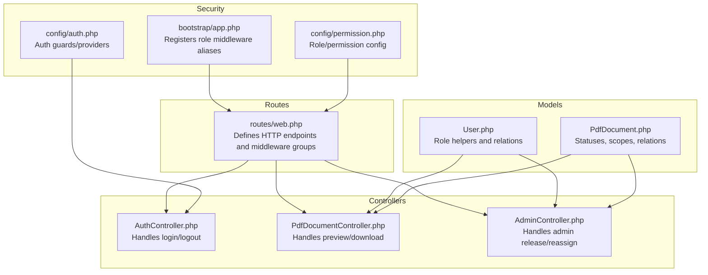
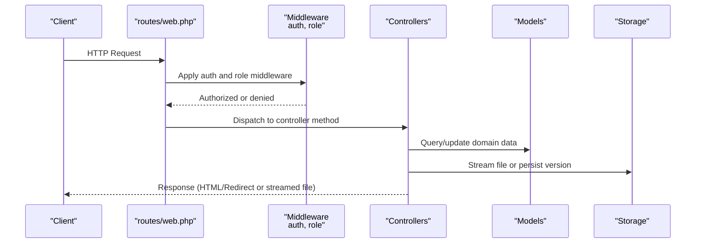
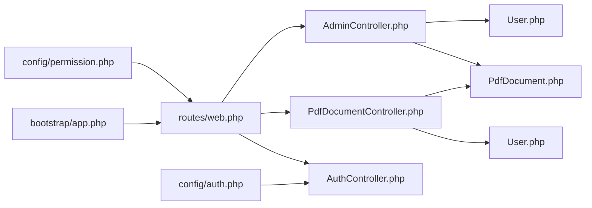

# API Reference

<cite>
**Referenced Files in This Document**
- [routes/web.php](file://routes/web.php)
- [AuthController.php](file://app/Http/Controllers/AuthController.php)
- [PdfDocumentController.php](file://app/Http/Controllers/PdfDocumentController.php)
- [AdminController.php](file://app/Http/Controllers/AdminController.php)
- [auth.php](file://config/auth.php)
- [permission.php](file://config/permission.php)
- [app.php](file://bootstrap/app.php)
- [User.php](file://app/Models/User.php)
- [PdfDocument.php](file://app/Models/PdfDocument.php)
- [Dashboard.php](file://app/Livewire/Dashboard.php)
- [PdfPool.php](file://app/Livewire/PdfPool.php)
- [MyAssignments.php](file://app/Livewire/MyAssignments.php)
</cite>

## Table of Contents
1. [Introduction](#introduction)
2. [Project Structure](#project-structure)
3. [Core Components](#core-components)
4. [Architecture Overview](#architecture-overview)
5. [Detailed Component Analysis](#detailed-component-analysis)
6. [Dependency Analysis](#dependency-analysis)
7. [Performance Considerations](#performance-considerations)
8. [Troubleshooting Guide](#troubleshooting-guide)
9. [Conclusion](#conclusion)
10. [Appendices](#appendices)

## Introduction
This document provides comprehensive API documentation for the PDF correction system. It covers authentication, document management, assignment operations, and administrative functions. The system exposes REST-like endpoints via Laravel routes and controllers, with role-based access control enforced by middleware. Authentication supports local accounts and optional LDAP integration.

## Project Structure
The API surface is primarily defined in routes and controllers, with models and Livewire components handling business logic and UI interactions. Key areas:
- Authentication endpoints for login/logout
- Document endpoints for preview and download
- Administrative endpoints for releasing/reassigning documents
- Role-based routing and middleware for editor/proofreader/admin

**Diagram sources**
- [routes/web.php:1-54](file://routes/web.php#L1-L54)
- [AuthController.php:1-81](file://app/Http/Controllers/AuthController.php#L1-L81)
- [PdfDocumentController.php:1-82](file://app/Http/Controllers/PdfDocumentController.php#L1-L82)
- [AdminController.php:1-62](file://app/Http/Controllers/AdminController.php#L1-L62)
- [app.php:13-19](file://bootstrap/app.php#L13-L19)
- [auth.php:1-49](file://config/auth.php#L1-L49)
- [permission.php:1-34](file://config/permission.php#L1-L34)
- [User.php:1-71](file://app/Models/User.php#L1-L71)
- [PdfDocument.php:1-130](file://app/Models/PdfDocument.php#L1-L130)

**Section sources**
- [routes/web.php:1-54](file://routes/web.php#L1-L54)
- [app.php:13-19](file://bootstrap/app.php#L13-L19)
- [auth.php:1-49](file://config/auth.php#L1-L49)
- [permission.php:1-34](file://config/permission.php#L1-L34)

## Core Components
- Authentication: Local and LDAP supported; session-based guard.
- Authorization: Role-based middleware for editor, proofreader, and admin.
- Document lifecycle: Uploads, previews, downloads, versioning, assignments, and archival.
- Administrative actions: Release and reassign documents.

**Section sources**
- [AuthController.php:21-71](file://app/Http/Controllers/AuthController.php#L21-L71)
- [PdfDocumentController.php:15-63](file://app/Http/Controllers/PdfDocumentController.php#L15-L63)
- [AdminController.php:13-60](file://app/Http/Controllers/AdminController.php#L13-L60)
- [User.php:56-69](file://app/Models/User.php#L56-L69)
- [PdfDocument.php:14-39](file://app/Models/PdfDocument.php#L14-L39)

## Architecture Overview
The system uses Laravel’s route-to-controller pattern with middleware for authentication and roles. Controllers delegate to models and services for data access and logging.

**Diagram sources**
- [routes/web.php:25-52](file://routes/web.php#L25-L52)
- [PdfDocumentController.php:15-63](file://app/Http/Controllers/PdfDocumentController.php#L15-L63)
- [PdfDocumentController.php:65-80](file://app/Http/Controllers/PdfDocumentController.php#L65-L80)
- [AdminController.php:13-60](file://app/Http/Controllers/AdminController.php#L13-L60)

## Detailed Component Analysis

### Authentication Endpoints
- Purpose: User login and logout.
- Security: Session-based authentication; optional LDAP provider.
- Validation: Username and password required for login.

Endpoints
- POST /login
  - Description: Authenticate user.
  - Authentication: None (login form).
  - Request body: username (string, required), password (string, required), remember (boolean, optional).
  - Responses:
    - 302 Found: Redirect to intended page on success.
    - 422 Unprocessable Entity: Validation errors.
    - 401 Unauthorized: Invalid credentials.
  - Notes: Supports local username/email and optional LDAP provider.

- POST /logout
  - Description: Invalidate current session.
  - Authentication: Required (auth middleware).
  - Responses: 302 Found to login page.

Example usage
- Login: curl -X POST http://example.com/login -F username=john -F password=secret
- Logout: curl -X POST http://example.com/logout -H "Cookie: laravel_session=..."

Validation and sanitization
- Input validated as required strings.
- LDAP exceptions logged; user notified gracefully.

**Section sources**
- [routes/web.php:21-23](file://routes/web.php#L21-L23)
- [AuthController.php:21-71](file://app/Http/Controllers/AuthController.php#L21-L71)
- [auth.php:8-38](file://config/auth.php#L8-L38)

### Document Management Endpoints
- Purpose: Preview and download PDF versions.
- Access control: Depends on user role and ownership/assignment.

Endpoints
- GET /pdf/{pdfDocument}/preview
  - Description: Stream PDF preview inline.
  - Authentication: Required.
  - Authorization: Editor who uploaded, Proofreader assigned, or Admin.
  - Path parameters:
    - pdfDocument (integer or slug): Document identifier.
  - Responses:
    - 200 OK: PDF stream.
    - 403 Forbidden: No access.
    - 404 Not Found: File missing.
  - Example: curl -H "Authorization: Bearer ..." http://example.com/pdf/123/preview

- GET /pdf/{pdfDocument}/download/{version?}
  - Description: Download a specific or latest version.
  - Authentication: Required.
  - Authorization: Same as preview.
  - Path parameters:
    - pdfDocument (integer or slug)
    - version (integer, optional): Version number; defaults to latest.
  - Query parameters:
    - version (integer, optional): Version number override.
  - Responses:
    - 200 OK: File download.
    - 403 Forbidden: No access.
    - 404 Not Found: File missing.
  - Example: curl -H "Authorization: Bearer ..." http://example.com/pdf/123/download/2

Access control logic
- Admins can access any document.
- Editors can access documents they uploaded.
- Proofreaders can access documents assigned to them.
- Otherwise 403.

Validation and sanitization
- Route model binding resolves pdfDocument; version is validated as integer when provided.
- File existence checked before streaming.

**Section sources**
- [routes/web.php:38-41](file://routes/web.php#L38-L41)
- [PdfDocumentController.php:15-63](file://app/Http/Controllers/PdfDocumentController.php#L15-L63)
- [PdfDocumentController.php:65-80](file://app/Http/Controllers/PdfDocumentController.php#L65-L80)
- [User.php:56-69](file://app/Models/User.php#L56-L69)
- [PdfDocument.php:14-39](file://app/Models/PdfDocument.php#L14-L39)

### Assignment Operations
- Purpose: Pool management, assignment, corrections, and release.
- Access control: Proofreader-specific operations.

Endpoints
- GET /pool
  - Description: List unassigned, non-archived documents (Livewire route).
  - Authentication: Required.
  - Authorization: Proofreader or Admin.
  - Filtering/pagination: Implemented client-side via Livewire; supports title filter and search.
  - Pagination: Paginated with 15 items per page.

- GET /my-assignments
  - Description: List documents assigned to the current proofreader (Livewire route).
  - Authentication: Required.
  - Authorization: Proofreader or Admin.
  - Pagination: Paginated with 15 items per page.

- POST /pdf/{pdfDocument}/release (Admin)
  - Description: Admin releases a document (removes assignee).
  - Authentication: Required.
  - Authorization: Admin.
  - Path parameters:
    - pdfDocument (integer or slug)
  - Form fields:
    - reason (string, max 500, optional)
  - Responses:
    - 302 Found: Back with success/error message.
    - 422 Unprocessable Entity: Validation errors.

- POST /pdf/{pdfDocument}/reassign (Admin)
  - Description: Admin reassigns a document to another user.
  - Authentication: Required.
  - Authorization: Admin.
  - Path parameters:
    - pdfDocument (integer or slug)
  - Form fields:
    - user_id (integer, required, exists in users)
    - reason (string, max 500, optional)
  - Responses:
    - 302 Found: Back with success/error message.
    - 422 Unprocessable Entity: Validation errors.

Note: The pool and assignments pages are Livewire components and do not expose REST endpoints directly. They manage state and perform updates via form submissions and actions.

**Section sources**
- [routes/web.php:28-36](file://routes/web.php#L28-L36)
- [routes/web.php:43-52](file://routes/web.php#L43-L52)
- [PdfPool.php:22-39](file://app/Livewire/PdfPool.php#L22-L39)
- [MyAssignments.php:42-88](file://app/Livewire/MyAssignments.php#L42-L88)
- [AdminController.php:13-60](file://app/Http/Controllers/AdminController.php#L13-L60)

### Administrative Functions
- Users, Audit Log, Titles, Archive pages are Livewire routes under /admin and do not expose REST endpoints.

**Section sources**
- [routes/web.php:43-48](file://routes/web.php#L43-L48)

## Dependency Analysis
- Middleware
  - auth: Ensures session-based authentication.
  - role: Enforces editor, proofreader, or admin roles.
- Controllers depend on models and services for data access and logging.
- Routes define endpoint URLs and bind controllers.

**Diagram sources**
- [routes/web.php:1-54](file://routes/web.php#L1-L54)
- [app.php:13-19](file://bootstrap/app.php#L13-L19)
- [auth.php:1-49](file://config/auth.php#L1-L49)
- [permission.php:1-34](file://config/permission.php#L1-L34)
- [AuthController.php:1-81](file://app/Http/Controllers/AuthController.php#L1-L81)
- [PdfDocumentController.php:1-82](file://app/Http/Controllers/PdfDocumentController.php#L1-L82)
- [AdminController.php:1-62](file://app/Http/Controllers/AdminController.php#L1-L62)
- [User.php:1-71](file://app/Models/User.php#L1-L71)
- [PdfDocument.php:1-130](file://app/Models/PdfDocument.php#L1-L130)

**Section sources**
- [routes/web.php:25-52](file://routes/web.php#L25-L52)
- [app.php:13-19](file://bootstrap/app.php#L13-L19)
- [auth.php:1-49](file://config/auth.php#L1-L49)
- [permission.php:1-34](file://config/permission.php#L1-L34)

## Performance Considerations
- Pagination: Livewire components paginate lists with 15 items per page to limit payload sizes.
- File streaming: Preview and download stream files directly from storage to avoid loading entire files into memory.
- Indexing: Ensure database indexes exist on frequently filtered columns (e.g., status, assigned_to_user_id, uploaded_by_user_id) to optimize queries.

[No sources needed since this section provides general guidance]

## Troubleshooting Guide
Common issues and resolutions
- 401 Unauthorized on login: Verify username/password and provider configuration.
- 403 Forbidden on document access: Confirm role and relationship to document (uploader vs assignee).
- 404 Not Found on download/preview: Ensure the requested version exists and file path is valid.
- 422 Validation errors: Check required fields and constraints (e.g., user_id exists, string lengths).

**Section sources**
- [AuthController.php:68-70](file://app/Http/Controllers/AuthController.php#L68-L70)
- [PdfDocumentController.php:19-21](file://app/Http/Controllers/PdfDocumentController.php#L19-L21)
- [PdfDocumentController.php:35-37](file://app/Http/Controllers/PdfDocumentController.php#L35-L37)
- [AdminController.php:15-17](file://app/Http/Controllers/AdminController.php#L15-L17)
- [AdminController.php:41-44](file://app/Http/Controllers/AdminController.php#L41-L44)

## Conclusion
The PDF correction system provides a clear set of endpoints for authentication, document preview/download, and administrative release/reassignment. Access control is role-based and enforced via middleware. Livewire components handle list views, filtering, and interactive operations. Ensure proper configuration of authentication providers and database indexes for optimal performance and security.

[No sources needed since this section summarizes without analyzing specific files]

## Appendices

### Authentication and Authorization Headers
- Authentication: Session-based; use cookies from browser or curl.
- Authorization: Not applicable for session endpoints; roles enforced server-side.

**Section sources**
- [auth.php:8-12](file://config/auth.php#L8-L12)
- [routes/web.php:25-36](file://routes/web.php#L25-L36)

### Request Validation and Input Sanitization
- Login: Validates username and password as required strings.
- Admin release/reassign: Validates presence and types of fields; checks user existence for reassign.
- Preview/Download: Uses route model binding and integer version validation.

**Section sources**
- [AuthController.php:23-26](file://app/Http/Controllers/AuthController.php#L23-L26)
- [AdminController.php:15-17](file://app/Http/Controllers/AdminController.php#L15-L17)
- [AdminController.php:41-44](file://app/Http/Controllers/AdminController.php#L41-L44)

### Rate Limiting and Security Considerations
- Password reset tokens expire after a configurable window.
- LDAP connectivity errors are logged; user receives a graceful error message.
- Session invalidation and CSRF protection are handled by Laravel’s session middleware.

**Section sources**
- [auth.php:40-44](file://config/auth.php#L40-L44)
- [AuthController.php:58-65](file://app/Http/Controllers/AuthController.php#L58-L65)

### Pagination and Filtering Patterns
- Dashboard: Filters by status, title, and free-text search; sorts by selected field/direction; paginated.
- Pool: Filters by title and free-text search; paginated.
- My Assignments: Lists assigned, non-archived documents; paginated.

**Section sources**
- [Dashboard.php:16-76](file://app/Livewire/Dashboard.php#L16-L76)
- [PdfPool.php:17-58](file://app/Livewire/PdfPool.php#L17-L58)
- [MyAssignments.php:109-120](file://app/Livewire/MyAssignments.php#L109-L120)