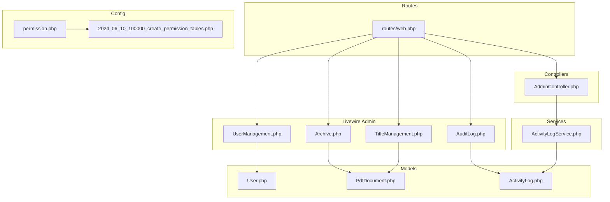
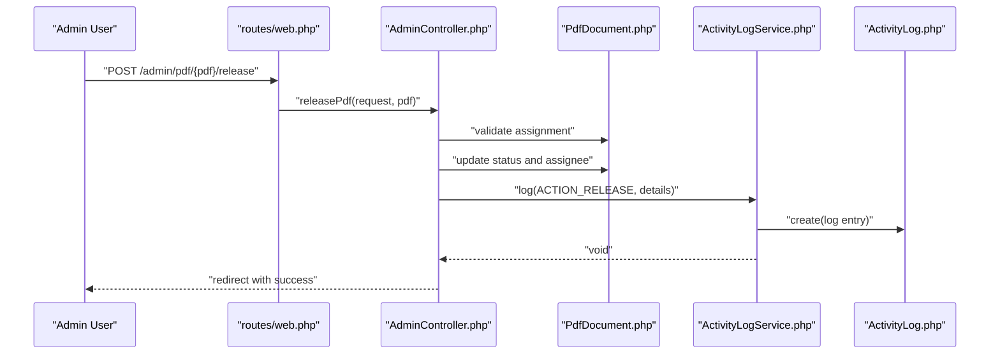
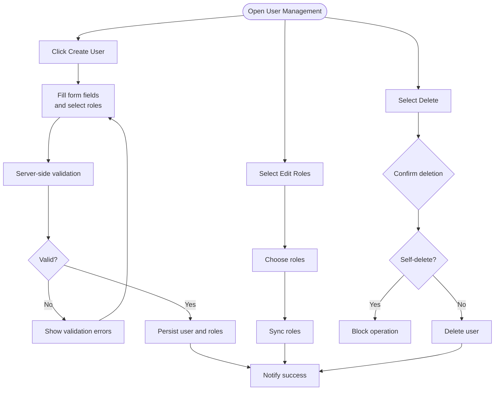
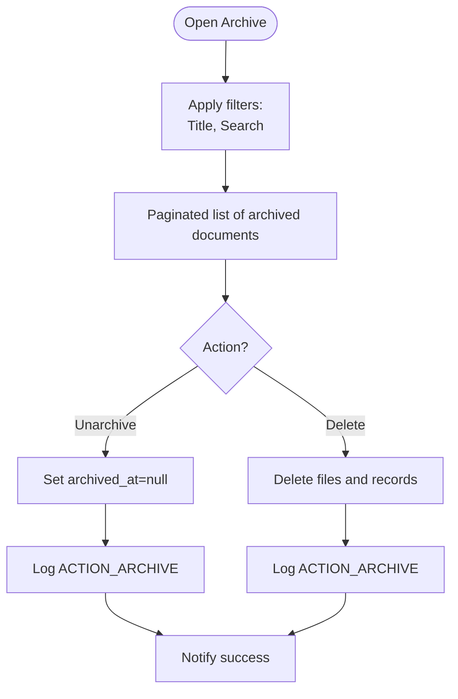
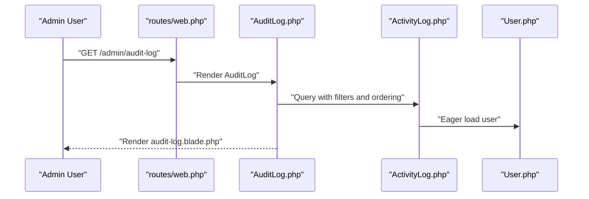
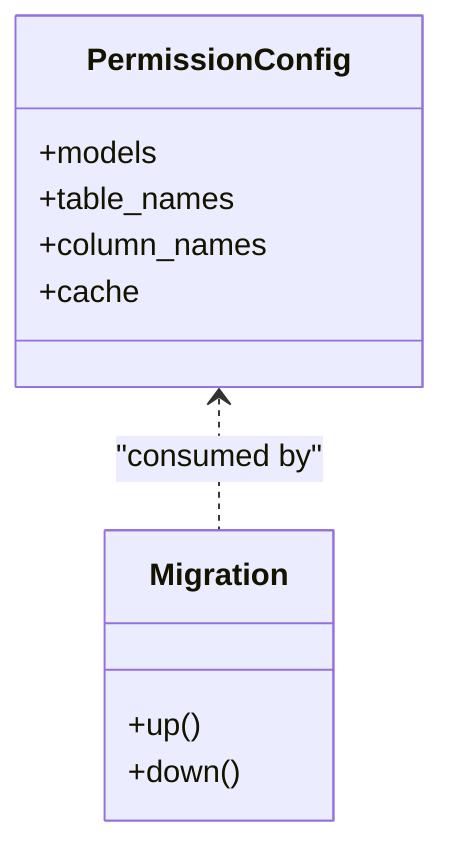
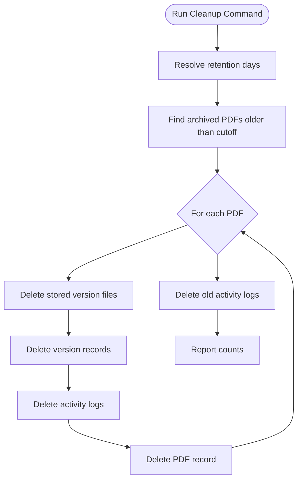
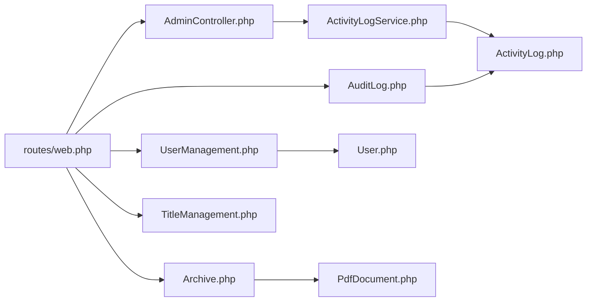

# Administrative Functions

<cite>
**Referenced Files in This Document**
- [web.php](file://routes/web.php)
- [AdminController.php](file://app/Http/Controllers/AdminController.php)
- [UserManagement.php](file://app/Livewire/Admin/UserManagement.php)
- [Archive.php](file://app/Livewire/Admin/Archive.php)
- [AuditLog.php](file://app/Livewire/Admin/AuditLog.php)
- [TitleManagement.php](file://app/Livewire/Admin/TitleManagement.php)
- [ActivityLogService.php](file://app/Services/ActivityLogService.php)
- [CleanupOldRecords.php](file://app/Console/Commands/CleanupOldRecords.php)
- [User.php](file://app/Models/User.php)
- [PdfDocument.php](file://app/Models/PdfDocument.php)
- [ActivityLog.php](file://app/Models/ActivityLog.php)
- [permission.php](file://config/permission.php)
- [2024_06_10_100000_create_permission_tables.php](file://database/migrations/2024_06_10_100000_create_permission_tables.php)
- [user-management.blade.php](file://resources/views/livewire/admin/user-management.blade.php)
- [audit-log.blade.php](file://resources/views/livewire/admin/audit-log.blade.php)
</cite>

## Table of Contents
1. [Introduction](#introduction)
2. [Project Structure](#project-structure)
3. [Core Components](#core-components)
4. [Architecture Overview](#architecture-overview)
5. [Detailed Component Analysis](#detailed-component-analysis)
6. [Dependency Analysis](#dependency-analysis)
7. [Performance Considerations](#performance-considerations)
8. [Troubleshooting Guide](#troubleshooting-guide)
9. [Conclusion](#conclusion)
10. [Appendices](#appendices)

## Introduction
This document describes the administrative functions of the system, focusing on user administration, document archiving, audit logging, configuration, maintenance tasks, bulk operations, reporting and analytics, backup and recovery, and monitoring and alerting. It synthesizes the backend controllers and Livewire components with their supporting models, services, and configuration to provide a practical guide for administrators.

## Project Structure
Administrative features are primarily implemented via:
- Web routes under an admin middleware group
- Controllers for administrative actions (release/reassign PDFs)
- Livewire components for user management, audit log, archive, and title management
- Services for centralized logging
- Models representing users, documents, versions, and activity logs
- Configuration for permissions and roles

**Diagram sources**
- [web.php:43-52](file://routes/web.php#L43-L52)
- [AdminController.php:11-61](file://app/Http/Controllers/AdminController.php#L11-L61)
- [UserManagement.php:14-126](file://app/Livewire/Admin/UserManagement.php#L14-L126)
- [AuditLog.php:11-54](file://app/Livewire/Admin/AuditLog.php#L11-L54)
- [Archive.php:13-74](file://app/Livewire/Admin/Archive.php#L13-L74)
- [TitleManagement.php:11-97](file://app/Livewire/Admin/TitleManagement.php#L11-L97)
- [ActivityLogService.php:10-30](file://app/Services/ActivityLogService.php#L10-L30)
- [User.php:10-70](file://app/Models/User.php#L10-L70)
- [PdfDocument.php:10-129](file://app/Models/PdfDocument.php#L10-L129)
- [ActivityLog.php:9-59](file://app/Models/ActivityLog.php#L9-L59)
- [permission.php:1-34](file://config/permission.php#L1-L34)
- [2024_06_10_100000_create_permission_tables.php:1-122](file://database/migrations/2024_06_10_100000_create_permission_tables.php#L1-L122)

**Section sources**
- [web.php:43-52](file://routes/web.php#L43-L52)
- [permission.php:1-34](file://config/permission.php#L1-L34)
- [2024_06_10_100000_create_permission_tables.php:1-122](file://database/migrations/2024_06_10_100000_create_permission_tables.php#L1-L122)

## Core Components
- Admin controller actions for releasing and reassigning PDFs
- Livewire components for user management, audit log, archive, and title management
- Activity log service for capturing system actions
- Maintenance command for cleanup of old archived records and logs

Key responsibilities:
- User administration: create, update roles, delete users (with safeguards)
- Document lifecycle: release assignments, reassign documents, archive/unarchive, delete archived documents
- Audit trail: filterable log of actions with timestamps, actors, and IP addresses
- Configuration: role-based permissions and caching
- Maintenance: automated cleanup of old archived data and logs

**Section sources**
- [AdminController.php:13-60](file://app/Http/Controllers/AdminController.php#L13-L60)
- [UserManagement.php:39-107](file://app/Livewire/Admin/UserManagement.php#L39-L107)
- [AuditLog.php:23-52](file://app/Livewire/Admin/AuditLog.php#L23-L52)
- [Archive.php:22-49](file://app/Livewire/Admin/Archive.php#L22-L49)
- [ActivityLogService.php:20-29](file://app/Services/ActivityLogService.php#L20-L29)
- [CleanupOldRecords.php:16-44](file://app/Console/Commands/CleanupOldRecords.php#L16-L44)

## Architecture Overview
Administrative workflows are routed through dedicated endpoints and Livewire pages. Controllers delegate logging to a centralized service. Models encapsulate domain logic and scopes for filtering and status.

**Diagram sources**
- [web.php:48-49](file://routes/web.php#L48-L49)
- [AdminController.php:13-37](file://app/Http/Controllers/AdminController.php#L13-L37)
- [PdfDocument.php:98-106](file://app/Models/PdfDocument.php#L98-L106)
- [ActivityLogService.php:20-29](file://app/Services/ActivityLogService.php#L20-L29)
- [ActivityLog.php:21-27](file://app/Models/ActivityLog.php#L21-L27)

## Detailed Component Analysis

### User Administration
- Creation: Validates name, unique username/email, matching passwords, and at least one role; creates user and assigns roles
- Modification: Edits roles for a selected user; prevents self-role changes
- Deletion: Removes a user with protection against self-deletion
- Search and pagination: Full-text search across name, email, and username

**Diagram sources**
- [UserManagement.php:39-107](file://app/Livewire/Admin/UserManagement.php#L39-L107)
- [user-management.blade.php:14-73](file://resources/views/livewire/admin/user-management.blade.php#L14-L73)
- [user-management.blade.php:75-99](file://resources/views/livewire/admin/user-management.blade.php#L75-L99)
- [user-management.blade.php:129-136](file://resources/views/livewire/admin/user-management.blade.php#L129-L136)

**Section sources**
- [UserManagement.php:39-107](file://app/Livewire/Admin/UserManagement.php#L39-L107)
- [user-management.blade.php:14-73](file://resources/views/livewire/admin/user-management.blade.php#L14-L73)
- [user-management.blade.php:75-99](file://resources/views/livewire/admin/user-management.blade.php#L75-L99)
- [user-management.blade.php:129-136](file://resources/views/livewire/admin/user-management.blade.php#L129-L136)

### Document Archiving and Lifecycle
- Unarchive: Clears archived timestamp and logs the action
- Delete archived: Deletes all version files, version records, activity logs, and the document itself
- Filtering: Title filter and free-text search on name/issue
- Pagination: Paginated listing of archived documents with counts

**Diagram sources**
- [Archive.php:22-49](file://app/Livewire/Admin/Archive.php#L22-L49)
- [Archive.php:51-72](file://app/Livewire/Admin/Archive.php#L51-L72)

**Section sources**
- [Archive.php:22-49](file://app/Livewire/Admin/Archive.php#L22-L49)
- [Archive.php:51-72](file://app/Livewire/Admin/Archive.php#L51-L72)

### Audit Log Management
- Filters: Action type, user, date range, and free-text search in details
- Display: Timestamp, user, action label, related PDF, details, IP address
- Navigation: Paginated results with distinct action list and user list

**Diagram sources**
- [web.php:45-45](file://routes/web.php#L45-L45)
- [AuditLog.php:23-52](file://app/Livewire/Admin/AuditLog.php#L23-L52)
- [ActivityLog.php:36-44](file://app/Models/ActivityLog.php#L36-L44)
- [User.php:51-54](file://app/Models/User.php#L51-L54)

**Section sources**
- [AuditLog.php:23-52](file://app/Livewire/Admin/AuditLog.php#L23-L52)
- [audit-log.blade.php:4-22](file://resources/views/livewire/admin/audit-log.blade.php#L4-L22)
- [audit-log.blade.php:24-66](file://resources/views/livewire/admin/audit-log.blade.php#L24-L66)

### System Configuration and Permissions
- Role-based access control via Spatie Permission package
- Configuration keys for models, table names, column names, caching
- Migration sets up permissions, roles, and linking tables

**Diagram sources**
- [permission.php:3-33](file://config/permission.php#L3-L33)
- [2024_06_10_100000_create_permission_tables.php:9-121](file://database/migrations/2024_06_10_100000_create_permission_tables.php#L9-L121)

**Section sources**
- [permission.php:1-34](file://config/permission.php#L1-L34)
- [2024_06_10_100000_create_permission_tables.php:1-122](file://database/migrations/2024_06_10_100000_create_permission_tables.php#L1-L122)

### Maintenance Tasks
- Cleanup old records command removes archived PDFs older than a threshold, their versions, and associated activity logs
- Retention period configurable via CLI option

**Diagram sources**
- [CleanupOldRecords.php:16-44](file://app/Console/Commands/CleanupOldRecords.php#L16-L44)

**Section sources**
- [CleanupOldRecords.php:13-44](file://app/Console/Commands/CleanupOldRecords.php#L13-L44)

### Bulk Operations
- User management supports bulk role updates per user via Livewire checkboxes
- Archive management supports bulk deletion of archived documents (per item)
- No explicit bulk user creation/deletion endpoints are present in the analyzed routes/controllers

Note: While individual operations exist, there is no dedicated bulk endpoint for creating or deleting multiple users simultaneously.

**Section sources**
- [UserManagement.php:75-88](file://app/Livewire/Admin/UserManagement.php#L75-L88)
- [Archive.php:32-49](file://app/Livewire/Admin/Archive.php#L32-L49)

### Reporting and Analytics
- Audit log provides filtered historical insights into system usage and actions
- Document scopes support status and archival queries suitable for building reports
- No dedicated analytics dashboards or export endpoints were identified in the analyzed files

**Section sources**
- [AuditLog.php:23-52](file://app/Livewire/Admin/AuditLog.php#L23-L52)
- [PdfDocument.php:88-96](file://app/Models/PdfDocument.php#L88-L96)

### Backup and Recovery
- No backup/restore commands or procedures were identified in the analyzed files
- Storage operations in archive deletion indicate local disk usage for version files

**Section sources**
- [Archive.php:37-39](file://app/Livewire/Admin/Archive.php#L37-L39)

### Monitoring and Alerting
- Activity logs capture IP addresses and timestamps for auditing
- No dedicated monitoring/alerting endpoints or integrations were identified in the analyzed files

**Section sources**
- [ActivityLogService.php:24-28](file://app/Services/ActivityLogService.php#L24-L28)
- [ActivityLog.php:21-27](file://app/Models/ActivityLog.php#L21-L27)

## Dependency Analysis
Administrative components depend on:
- Routes grouped by role middleware for access control
- Models for data access and scopes
- Service for centralized logging
- Blade templates for rendering UI

**Diagram sources**
- [web.php:43-52](file://routes/web.php#L43-L52)
- [AdminController.php:7-7](file://app/Http/Controllers/AdminController.php#L7-L7)
- [ActivityLogService.php:5-8](file://app/Services/ActivityLogService.php#L5-L8)
- [UserManagement.php:5-11](file://app/Livewire/Admin/UserManagement.php#L5-L11)
- [AuditLog.php:5-8](file://app/Livewire/Admin/AuditLog.php#L5-L8)
- [Archive.php:5-8](file://app/Livewire/Admin/Archive.php#L5-L8)
- [PdfDocument.php:10-12](file://app/Models/PdfDocument.php#L10-L12)
- [ActivityLog.php:9-11](file://app/Models/ActivityLog.php#L9-L11)

**Section sources**
- [web.php:25-52](file://routes/web.php#L25-L52)
- [ActivityLogService.php:20-29](file://app/Services/ActivityLogService.php#L20-L29)

## Performance Considerations
- Pagination is used in user, audit log, and archive listings to limit result set sizes
- Eager loading of relations reduces N+1 query risks in Livewire components
- Cleanup command batches deletions and file operations to manage resource usage

[No sources needed since this section provides general guidance]

## Troubleshooting Guide
- Role synchronization: Ensure roles exist and are properly seeded before assigning
- Self-deletion prevention: Attempting to delete yourself is blocked in user management
- Permission migration: If permission tables are missing, run the migration to create required schema
- Cleanup command: Verify storage paths exist before running cleanup to avoid errors

**Section sources**
- [UserManagement.php:99-103](file://app/Livewire/Admin/UserManagement.php#L99-L103)
- [2024_06_10_100000_create_permission_tables.php:17-22](file://database/migrations/2024_06_10_100000_create_permission_tables.php#L17-L22)
- [CleanupOldRecords.php:29-31](file://app/Console/Commands/CleanupOldRecords.php#L29-L31)

## Conclusion
The administrative subsystem provides robust capabilities for managing users, documents, and system activity. It leverages role-based access control, centralized logging, and paginated UI components to support efficient administration. Maintenance automation helps keep storage and logs manageable. Additional features such as bulk operations, reporting exports, backup/restore, and monitoring/alerting are not present in the analyzed code and would require extension.

## Appendices
- Administrative endpoints summary:
  - Users: GET /admin/users
  - Audit log: GET /admin/audit-log
  - Titles: GET /admin/titles
  - Archive: GET /admin/archive
  - Release PDF: POST /admin/pdf/{pdf}/release
  - Reassign PDF: POST /admin/pdf/{pdf}/reassign

**Section sources**
- [web.php:44-51](file://routes/web.php#L44-L51)