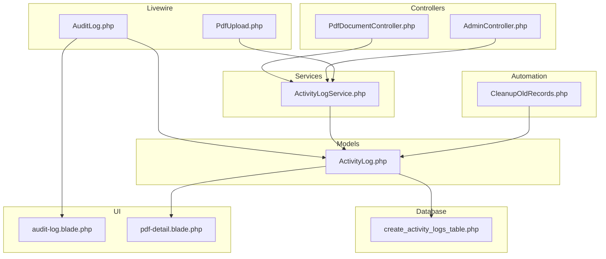
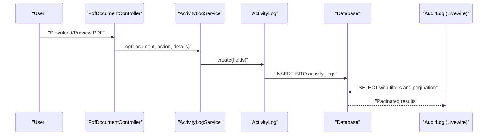
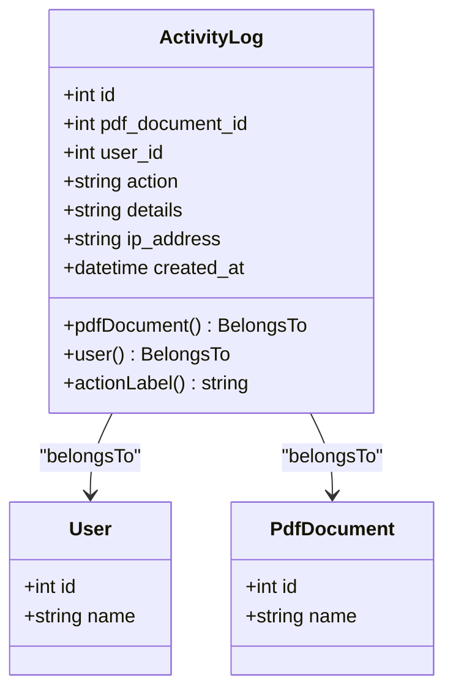
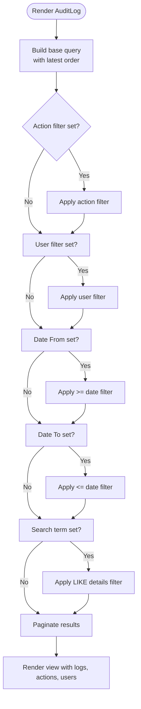
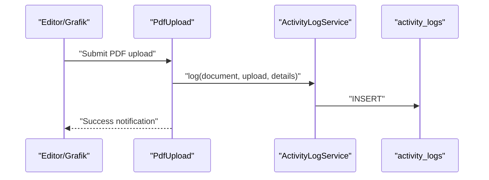
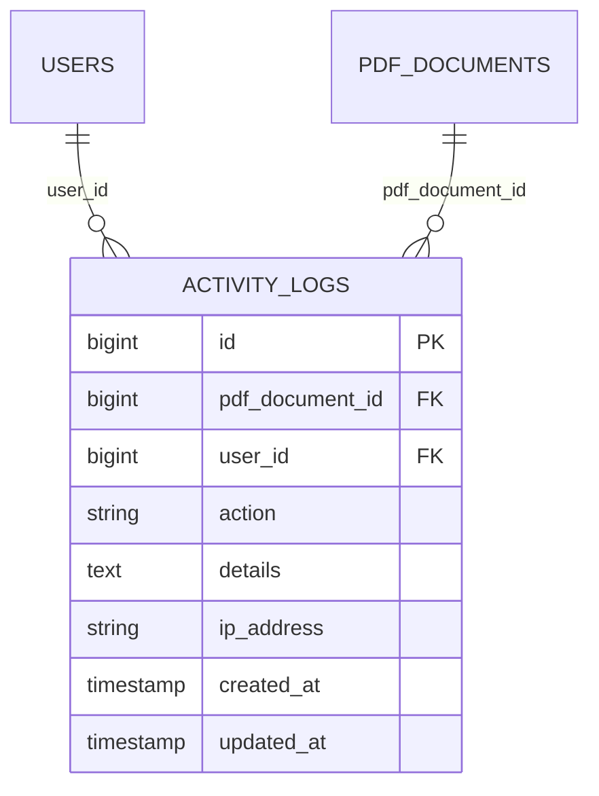
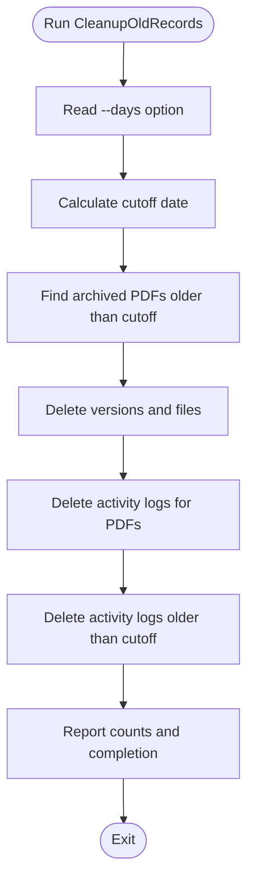
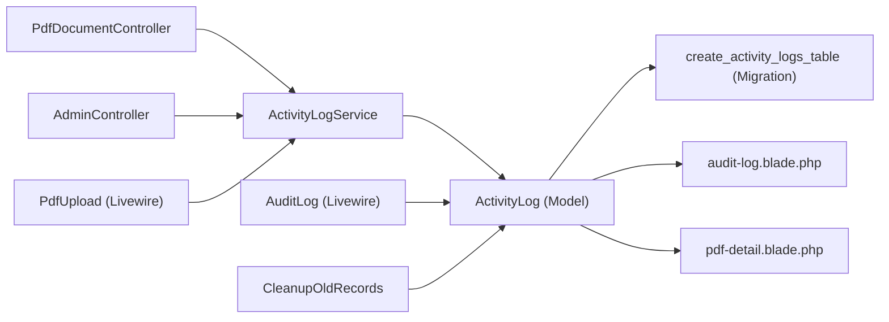

# Audit Trail Management

<cite>
**Referenced Files in This Document**
- [ActivityLog.php](file://app/Models/ActivityLog.php)
- [ActivityLogService.php](file://app/Services/ActivityLogService.php)
- [create_activity_logs_table.php](file://database/migrations/2024_06_10_140000_create_activity_logs_table.php)
- [AuditLog.php](file://app/Livewire/Admin/AuditLog.php)
- [audit-log.blade.php](file://resources/views/livewire/admin/audit-log.blade.php)
- [CleanupOldRecords.php](file://app/Console/Commands/CleanupOldRecords.php)
- [PdfDocumentController.php](file://app/Http/Controllers/PdfDocumentController.php)
- [AdminController.php](file://app/Http/Controllers/AdminController.php)
- [PdfUpload.php](file://app/Livewire/PdfUpload.php)
- [web.php](file://routes/web.php)
- [pdf-detail.blade.php](file://resources/views/livewire/pdf-detail.blade.php)
</cite>

## Table of Contents
1. [Introduction](#introduction)
2. [Project Structure](#project-structure)
3. [Core Components](#core-components)
4. [Architecture Overview](#architecture-overview)
5. [Detailed Component Analysis](#detailed-component-analysis)
6. [Dependency Analysis](#dependency-analysis)
7. [Performance Considerations](#performance-considerations)
8. [Troubleshooting Guide](#troubleshooting-guide)
9. [Conclusion](#conclusion)

## Introduction
This document describes the comprehensive audit trail management functionality implemented in the system. It covers the logging infrastructure that captures user actions, system events, and administrative changes across PDF document workflows. The solution provides:
- Centralized audit logging with structured persistence
- Real-time visibility through a dedicated admin interface with filtering and search
- Automated cleanup of old records based on configurable retention periods
- Export-ready data suitable for compliance reporting and forensic analysis
- Security and integrity considerations for tamper-evident logging

## Project Structure
The audit trail system spans models, services, controllers, Livewire components, Blade templates, database migrations, and console commands. The following diagram shows how these pieces fit together.

**Diagram sources**
- [PdfDocumentController.php:1-82](file://app/Http/Controllers/PdfDocumentController.php#L1-L82)
- [AdminController.php:1-62](file://app/Http/Controllers/AdminController.php#L1-L62)
- [PdfUpload.php:1-95](file://app/Livewire/PdfUpload.php#L1-L95)
- [AuditLog.php:1-55](file://app/Livewire/Admin/AuditLog.php#L1-L55)
- [ActivityLogService.php:1-31](file://app/Services/ActivityLogService.php#L1-L31)
- [ActivityLog.php:1-60](file://app/Models/ActivityLog.php#L1-L60)
- [create_activity_logs_table.php:1-27](file://database/migrations/2024_06_10_140000_create_activity_logs_table.php#L1-L27)
- [audit-log.blade.php:1-68](file://resources/views/livewire/admin/audit-log.blade.php#L1-L68)
- [pdf-detail.blade.php:63-89](file://resources/views/livewire/pdf-detail.blade.php#L63-L89)
- [CleanupOldRecords.php:1-47](file://app/Console/Commands/CleanupOldRecords.php#L1-L47)

**Section sources**
- [web.php:1-54](file://routes/web.php#L1-L54)

## Core Components
- ActivityLog model: Defines the audit record schema, relationships, and localized action labels.
- ActivityLogService: Provides a centralized logging method invoked by controllers and Livewire components.
- AuditLog Livewire component: Implements filtering, pagination, and rendering of audit logs for administrators.
- Controllers and Livewire components: Trigger logging for user actions such as uploads, downloads, previews, and administrative assignments/releases.
- CleanupOldRecords command: Automates deletion of old activity logs based on a configurable retention period.

Key implementation references:
- [ActivityLog.php:13-58](file://app/Models/ActivityLog.php#L13-L58)
- [ActivityLogService.php:20-29](file://app/Services/ActivityLogService.php#L20-L29)
- [AuditLog.php:23-52](file://app/Livewire/Admin/AuditLog.php#L23-L52)
- [CleanupOldRecords.php:16-45](file://app/Console/Commands/CleanupOldRecords.php#L16-L45)

**Section sources**
- [ActivityLog.php:1-60](file://app/Models/ActivityLog.php#L1-L60)
- [ActivityLogService.php:1-31](file://app/Services/ActivityLogService.php#L1-L31)
- [AuditLog.php:1-55](file://app/Livewire/Admin/AuditLog.php#L1-L55)
- [CleanupOldRecords.php:1-47](file://app/Console/Commands/CleanupOldRecords.php#L1-L47)

## Architecture Overview
The audit trail architecture follows a layered pattern:
- Event producers (controllers and Livewire components) call the ActivityLogService to persist audit entries.
- ActivityLogService captures the current user ID, IP address, and optional details.
- ActivityLog model persists the record to the database via the activity_logs table.
- Administrators use the AuditLog Livewire component to view, filter, and paginate logs.
- A scheduled console command removes old records according to retention policy.

**Diagram sources**
- [PdfDocumentController.php:15-62](file://app/Http/Controllers/PdfDocumentController.php#L15-L62)
- [ActivityLogService.php:20-29](file://app/Services/ActivityLogService.php#L20-L29)
- [ActivityLog.php:21-27](file://app/Models/ActivityLog.php#L21-L27)
- [AuditLog.php:23-52](file://app/Livewire/Admin/AuditLog.php#L23-L52)

## Detailed Component Analysis

### ActivityLog Model
Responsibilities:
- Stores audit records with user, document, action, details, and IP address.
- Provides localized labels for actions.
- Defines relationships to User and PdfDocument.

Design highlights:
- Fillable attributes ensure safe mass assignment.
- Timestamp casting ensures consistent datetime handling.
- Action label mapping supports human-readable display.

**Diagram sources**
- [ActivityLog.php:9-58](file://app/Models/ActivityLog.php#L9-L58)

**Section sources**
- [ActivityLog.php:13-58](file://app/Models/ActivityLog.php#L13-L58)

### ActivityLogService
Responsibilities:
- Centralized logging method invoked by controllers and Livewire components.
- Captures current authenticated user ID and client IP address.
- Supports optional free-form details for contextual information.

Usage patterns:
- Called during PDF upload, download, preview, and administrative actions.

**Section sources**
- [ActivityLogService.php:20-29](file://app/Services/ActivityLogService.php#L20-L29)

### AuditLog Livewire Component
Responsibilities:
- Provides an admin interface to view audit logs.
- Supports filtering by action type, user, date range, and text search in details.
- Paginates results for efficient browsing.
- Exposes distinct actions and users for filter dropdowns.

Filtering logic:
- Action filter constrains by the action field.
- User filter constrains by user ID.
- Date filters constrain by created_at date boundaries.
- Text search filters details using LIKE operator.

**Diagram sources**
- [AuditLog.php:23-52](file://app/Livewire/Admin/AuditLog.php#L23-L52)

**Section sources**
- [AuditLog.php:15-52](file://app/Livewire/Admin/AuditLog.php#L15-L52)
- [audit-log.blade.php:6-21](file://resources/views/livewire/admin/audit-log.blade.php#L6-L21)

### Controllers and Livewire Components That Generate Logs
- PdfDocumentController: Logs downloads and previews.
- AdminController: Logs release and reassignment actions.
- PdfUpload Livewire component: Logs initial PDF uploads.

**Diagram sources**
- [PdfUpload.php:47-87](file://app/Livewire/PdfUpload.php#L47-L87)
- [ActivityLogService.php:20-29](file://app/Services/ActivityLogService.php#L20-L29)

**Section sources**
- [PdfDocumentController.php:15-62](file://app/Http/Controllers/PdfDocumentController.php#L15-L62)
- [AdminController.php:13-60](file://app/Http/Controllers/AdminController.php#L13-L60)
- [PdfUpload.php:47-87](file://app/Livewire/PdfUpload.php#L47-L87)

### Database Schema for Activity Logs
The migration defines the activity_logs table with foreign keys, nullable document references, and appropriate indexing for performance.

**Diagram sources**
- [create_activity_logs_table.php:11-18](file://database/migrations/2024_06_10_140000_create_activity_logs_table.php#L11-L18)

**Section sources**
- [create_activity_logs_table.php:9-26](file://database/migrations/2024_06_10_140000_create_activity_logs_table.php#L9-L26)

### Log Retention and Automated Cleanup
The CleanupOldRecords command enforces retention by deleting old activity logs and associated PDF artifacts after documents reach archival state.

Operational flow:
- Accepts a --days option to define retention period.
- Identifies archived PDF documents older than the cutoff date.
- Deletes associated versions and activity logs.
- Removes remaining old activity logs beyond the cutoff date.
- Reports counts of deleted records.

**Diagram sources**
- [CleanupOldRecords.php:16-45](file://app/Console/Commands/CleanupOldRecords.php#L16-L45)

**Section sources**
- [CleanupOldRecords.php:13-45](file://app/Console/Commands/CleanupOldRecords.php#L13-L45)

### Viewing and Filtering Audit Logs
Administrative users can:
- Filter by action type, user, date range, and search terms in details.
- Navigate paginated results.
- See associated user, document, action label, details, and IP address.

UI elements:
- Dropdowns for action and user filters.
- Date pickers for from/to ranges.
- Debounced text input for details search.
- Pagination controls.

**Section sources**
- [AuditLog.php:15-52](file://app/Livewire/Admin/AuditLog.php#L15-L52)
- [audit-log.blade.php:6-65](file://resources/views/livewire/admin/audit-log.blade.php#L6-L65)

### Export Functionality for Compliance Reporting
The audit log data is presented in a tabular format suitable for export. Administrators can:
- Copy/paste from the browser table.
- Use external tools to export the rendered HTML table to CSV/Excel.
- Alternatively, integrate backend endpoints to programmatically export filtered datasets.

Note: The current implementation focuses on UI presentation. For programmatic exports, consider adding controller endpoints or Livewire actions that stream CSV/Excel files based on current filters.

**Section sources**
- [audit-log.blade.php:24-65](file://resources/views/livewire/admin/audit-log.blade.php#L24-L65)

### Real-time Monitoring and Alerting
The current implementation does not include built-in real-time monitoring or alerting. Recommendations for future enhancement:
- Integrate with external monitoring systems (e.g., SIEM) to ingest audit events.
- Add webhook notifications for critical actions.
- Implement alert rules for unusual patterns (e.g., repeated failed attempts, bulk deletions).
- Store alerts in a separate table with severity and resolution status.

[No sources needed since this section provides general guidance]

### Log Security and Integrity Verification
Current protections:
- IP address capture aids attribution and forensic analysis.
- Foreign keys maintain referential integrity for users and documents.
- Centralized logging service ensures consistent capture of user and IP context.

Recommended enhancements for tamper-evident logging:
- Immutable log storage: Write-only filesystem or cloud storage with object lock.
- Cryptographic hashing: Maintain a Merkle tree of log entries for integrity verification.
- Digital signatures: Sign log batches with private keys; verify with public keys.
- Audit trails of audit logs: Track who accessed, modified, or deleted audit records.
- Retention hardening: Use legal hold mechanisms to prevent deletion.

[No sources needed since this section provides general guidance]

## Dependency Analysis
The following diagram shows key dependencies among components involved in audit logging.

**Diagram sources**
- [PdfDocumentController.php:15-62](file://app/Http/Controllers/PdfDocumentController.php#L15-L62)
- [AdminController.php:13-60](file://app/Http/Controllers/AdminController.php#L13-L60)
- [PdfUpload.php:47-87](file://app/Livewire/PdfUpload.php#L47-L87)
- [ActivityLogService.php:20-29](file://app/Services/ActivityLogService.php#L20-L29)
- [ActivityLog.php:21-27](file://app/Models/ActivityLog.php#L21-L27)
- [create_activity_logs_table.php:11-18](file://database/migrations/2024_06_10_140000_create_activity_logs_table.php#L11-L18)
- [AuditLog.php:23-52](file://app/Livewire/Admin/AuditLog.php#L23-L52)
- [audit-log.blade.php:24-65](file://resources/views/livewire/admin/audit-log.blade.php#L24-L65)
- [pdf-detail.blade.php:74-84](file://resources/views/livewire/pdf-detail.blade.php#L74-L84)
- [CleanupOldRecords.php:16-45](file://app/Console/Commands/CleanupOldRecords.php#L16-L45)

**Section sources**
- [web.php:38-51](file://routes/web.php#L38-L51)

## Performance Considerations
- Indexing: Consider adding indexes on frequently filtered columns (user_id, action, created_at) to improve query performance.
- Pagination: The AuditLog component already paginates results; keep page sizes reasonable to avoid heavy queries.
- Selective loading: The Livewire component eager-loads related user and document data; monitor memory usage with large datasets.
- Cleanup cadence: Schedule CleanupOldRecords to run during off-peak hours to minimize impact on audit queries.

[No sources needed since this section provides general guidance]

## Troubleshooting Guide
Common issues and resolutions:
- Missing user context: Ensure authentication middleware is applied to routes that trigger logs.
- Empty audit log results: Verify filters are not overly restrictive; clear filters to confirm data exists.
- IP address not recorded: Confirm that the request context provides a valid IP; check proxy configurations if applicable.
- Cleanup not removing expected records: Validate the --days parameter and confirm archived documents meet the criteria.

**Section sources**
- [web.php:25-52](file://routes/web.php#L25-L52)
- [AuditLog.php:23-52](file://app/Livewire/Admin/AuditLog.php#L23-L52)
- [CleanupOldRecords.php:16-45](file://app/Console/Commands/CleanupOldRecords.php#L16-L45)

## Conclusion
The system provides a robust, centralized audit trail for PDF document lifecycle events and administrative actions. It offers practical filtering, pagination, and automated cleanup aligned with retention policies. For compliance and forensic readiness, consider integrating external monitoring, implementing immutable storage, and adding cryptographic integrity measures.