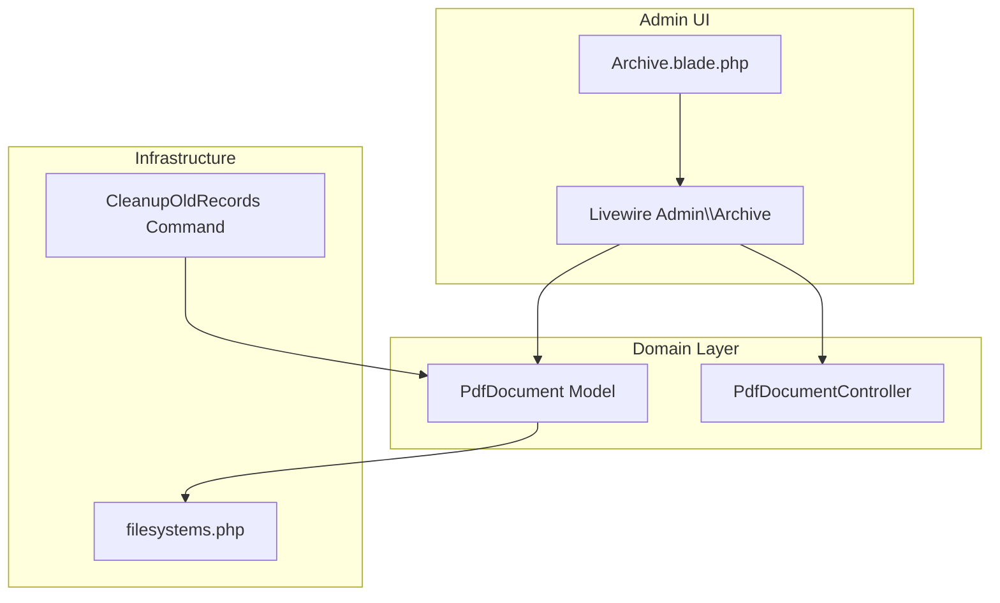
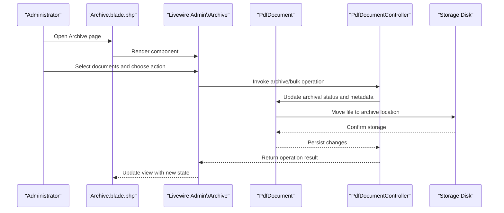
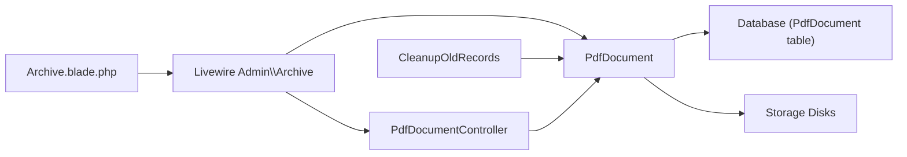

# Document Archiving

<cite>
**Referenced Files in This Document**
- [Archive.php](file://pdf-korektura/app/Livewire/Admin/Archive.php)
- [PdfDocument.php](file://pdf-korektura/app/Models/PdfDocument.php)
- [archive.blade.php](file://pdf-korektura/resources/views/livewire/admin/archive.blade.php)
- [filesystems.php](file://pdf-korektura/config/filesystems.php)
- [CleanupOldRecords.php](file://pdf-korektura/app/Console/Commands/CleanupOldRecords.php)
- [PdfDocumentController.php](file://pdf-korektura/app/Http/Controllers/PdfDocumentController.php)
- [2024_06_10_120000_create_pdf_documents_table.php](file://pdf-korektura/database/migrations/2024_06_10_120000_create_pdf_documents_table.php)
</cite>

## Table of Contents
1. [Introduction](#introduction)
2. [Project Structure](#project-structure)
3. [Core Components](#core-components)
4. [Architecture Overview](#architecture-overview)
5. [Detailed Component Analysis](#detailed-component-analysis)
6. [Dependency Analysis](#dependency-analysis)
7. [Performance Considerations](#performance-considerations)
8. [Troubleshooting Guide](#troubleshooting-guide)
9. [Conclusion](#conclusion)

## Introduction
This document describes the document archiving functionality within the system. It explains how completed or inactive documents are moved to archive storage, the criteria and triggers for archiving, manual and bulk operations, restoration and retrieval procedures, archive organization and search capabilities, storage optimization benefits, and compliance considerations for document retention.

## Project Structure
The archiving feature spans Livewire components, Eloquent models, Blade templates, configuration, and console commands. The primary UI component for administrators is the Archive Livewire component, backed by the PdfDocument model and supported by configuration for storage and a cleanup command for automated maintenance.

**Diagram sources**
- [archive.blade.php](file://pdf-korektura/resources/views/livewire/admin/archive.blade.php)
- [Archive.php](file://pdf-korektura/app/Livewire/Admin/Archive.php)
- [PdfDocument.php](file://pdf-korektura/app/Models/PdfDocument.php)
- [PdfDocumentController.php](file://pdf-korektura/app/Http/Controllers/PdfDocumentController.php)
- [filesystems.php](file://pdf-korektura/config/filesystems.php)
- [CleanupOldRecords.php](file://pdf-korektura/app/Console/Commands/CleanupOldRecords.php)

**Section sources**
- [archive.blade.php](file://pdf-korektura/resources/views/livewire/admin/archive.blade.php)
- [Archive.php](file://pdf-korektura/app/Livewire/Admin/Archive.php)
- [PdfDocument.php](file://pdf-korektura/app/Models/PdfDocument.php)
- [filesystems.php](file://pdf-korektura/config/filesystems.php)
- [CleanupOldRecords.php](file://pdf-korektura/app/Console/Commands/CleanupOldRecords.php)

## Core Components
- Archive Livewire component: Provides the administrative interface for viewing, filtering, and managing archived documents, including manual archiving actions and bulk operations.
- PdfDocument model: Represents document records and encapsulates business logic for archival status, lifecycle transitions, and storage paths.
- Archive Blade template: Renders the archive UI, including filters, sorting, pagination, and action buttons.
- Storage configuration: Defines disk mappings and paths for storing archived documents.
- Cleanup command: Implements automated cleanup of old or inactive records according to retention policies.
- PdfDocumentController: Handles document-related HTTP requests and integrates with the archive workflow.

**Section sources**
- [Archive.php](file://pdf-korektura/app/Livewire/Admin/Archive.php)
- [PdfDocument.php](file://pdf-korektura/app/Models/PdfDocument.php)
- [archive.blade.php](file://pdf-korektura/resources/views/livewire/admin/archive.blade.php)
- [filesystems.php](file://pdf-korektura/config/filesystems.php)
- [CleanupOldRecords.php](file://pdf-korektura/app/Console/Commands/CleanupOldRecords.php)
- [PdfDocumentController.php](file://pdf-korektura/app/Http/Controllers/PdfDocumentController.php)

## Architecture Overview
The archive workflow connects the UI, domain logic, persistence, and storage backend. Administrators use the Archive component to select documents, trigger manual archiving, and perform bulk operations. The PdfDocument model enforces archival rules and updates document state. Storage configuration determines where archived files are persisted. Automated cleanup ensures compliance with retention policies.

**Diagram sources**
- [archive.blade.php](file://pdf-korektura/resources/views/livewire/admin/archive.blade.php)
- [Archive.php](file://pdf-korektura/app/Livewire/Admin/Archive.php)
- [PdfDocument.php](file://pdf-korektura/app/Models/PdfDocument.php)
- [PdfDocumentController.php](file://pdf-korektura/app/Http/Controllers/PdfDocumentController.php)
- [filesystems.php](file://pdf-korektura/config/filesystems.php)

## Detailed Component Analysis

### Archive Livewire Component
Responsibilities:
- Render the archive view with filters and controls.
- Manage selection of documents for bulk operations.
- Trigger manual archiving actions via controller methods.
- Coordinate with the PdfDocument model for state changes and storage updates.

Key behaviors:
- Filtering and sorting by metadata such as title, author, date, and status.
- Bulk selection toggles and batch actions.
- Confirmation prompts for irreversible operations.

Operational flow:
- Load initial dataset from the PdfDocument model.
- Apply filters and pagination.
- On action submission, delegate to PdfDocumentController for processing.

**Section sources**
- [Archive.php](file://pdf-korektura/app/Livewire/Admin/Archive.php)
- [archive.blade.php](file://pdf-korektura/resources/views/livewire/admin/archive.blade.php)

### PdfDocument Model
Responsibilities:
- Define document lifecycle and archival state.
- Enforce business rules for archival eligibility and transitions.
- Provide methods for moving files to archive storage and updating metadata.
- Support queries for archived documents and retention-based filtering.

Archival-related attributes and methods:
- Status indicators for active/inactive/completed/archived states.
- Methods to compute archival eligibility based on completion and inactivity thresholds.
- Storage path resolution for original and archive locations.

Retention-aware queries:
- Retrieve documents older than a configured threshold.
- Identify documents meeting criteria for automatic archiving.

**Section sources**
- [PdfDocument.php](file://pdf-korektura/app/Models/PdfDocument.php)

### Archive Blade Template
Responsibilities:
- Present archived documents in a paginated, searchable grid.
- Provide filter controls for quick navigation.
- Render action buttons for manual archiving and restoration.

Features:
- Column headers for sorting.
- Search bar for keyword filtering.
- Action buttons per row and bulk actions header.

**Section sources**
- [archive.blade.php](file://pdf-korektura/resources/views/livewire/admin/archive.blade.php)

### Storage Configuration
Responsibilities:
- Define disks for primary and archive storage.
- Configure base paths and visibility for stored files.
- Ensure consistent naming and organization for archived documents.

Considerations:
- Separate disks for active and archived content improve isolation and retention policies.
- Path conventions support hierarchical organization by date or category.

**Section sources**
- [filesystems.php](file://pdf-korektura/config/filesystems.php)

### Cleanup Command
Responsibilities:
- Periodically scan documents for automatic archiving based on retention rules.
- Move eligible documents to archive storage.
- Log outcomes and handle errors gracefully.

Trigger mechanisms:
- Scheduled runs via Laravel scheduler or external cron.
- Threshold-based checks for completion and inactivity.

**Section sources**
- [CleanupOldRecords.php](file://pdf-korektura/app/Console/Commands/CleanupOldRecords.php)

### PdfDocumentController
Responsibilities:
- Handle HTTP requests related to document operations.
- Coordinate with the PdfDocument model for archival actions.
- Return structured responses for UI updates.

Integration points:
- Accepts bulk operations and individual selections.
- Delegates storage moves to the model and persists state.

**Section sources**
- [PdfDocumentController.php](file://pdf-korektura/app/Http/Controllers/PdfDocumentController.php)

### Database Schema Context
The PdfDocument table defines the foundational structure for document records, including timestamps and status fields that inform archival decisions.

**Section sources**
- [2024_06_10_120000_create_pdf_documents_table.php](file://pdf-korektura/database/migrations/2024_06_10_120000_create_pdf_documents_table.php)

## Dependency Analysis
The archive feature exhibits clear separation of concerns:
- UI depends on Livewire Admin component and Blade template.
- Domain logic resides in the PdfDocument model.
- Persistence and storage are coordinated through configuration and model methods.
- Automation relies on a dedicated console command.

**Diagram sources**
- [archive.blade.php](file://pdf-korektura/resources/views/livewire/admin/archive.blade.php)
- [Archive.php](file://pdf-korektura/app/Livewire/Admin/Archive.php)
- [PdfDocument.php](file://pdf-korektura/app/Models/PdfDocument.php)
- [PdfDocumentController.php](file://pdf-korektura/app/Http/Controllers/PdfDocumentController.php)
- [CleanupOldRecords.php](file://pdf-korektura/app/Console/Commands/CleanupOldRecords.php)
- [2024_06_10_120000_create_pdf_documents_table.php](file://pdf-korektura/database/migrations/2024_06_10_120000_create_pdf_documents_table.php)
- [filesystems.php](file://pdf-korektura/config/filesystems.php)

**Section sources**
- [Archive.php](file://pdf-korektura/app/Livewire/Admin/Archive.php)
- [PdfDocument.php](file://pdf-korektura/app/Models/PdfDocument.php)
- [archive.blade.php](file://pdf-korektura/resources/views/livewire/admin/archive.blade.php)
- [PdfDocumentController.php](file://pdf-korektura/app/Http/Controllers/PdfDocumentController.php)
- [CleanupOldRecords.php](file://pdf-korektura/app/Console/Commands/CleanupOldRecords.php)
- [filesystems.php](file://pdf-korektura/config/filesystems.php)
- [2024_06_10_120000_create_pdf_documents_table.php](file://pdf-korektura/database/migrations/2024_06_10_120000_create_pdf_documents_table.php)

## Performance Considerations
- Pagination and lazy loading in the Archive component reduce memory overhead during bulk operations.
- Batch processing in the cleanup command minimizes repeated I/O and database transactions.
- Separating active and archive storage improves query performance by reducing table sizes and enabling targeted scans.
- Indexes on frequently filtered columns (status, timestamps) enhance search and retention queries.

## Troubleshooting Guide
Common issues and resolutions:
- Documents not appearing in archive: Verify archival status flags and storage paths; confirm the cleanup command ran successfully.
- Permission errors on storage: Check filesystem permissions for the archive disk and ensure the application user has write access.
- Slow archive operations: Review pagination limits, optimize filters, and schedule cleanup during off-peak hours.
- Retention policy mismatches: Validate thresholds and timestamps; adjust cleanup command logic to align with policy requirements.

**Section sources**
- [Archive.php](file://pdf-korektura/app/Livewire/Admin/Archive.php)
- [PdfDocument.php](file://pdf-korektura/app/Models/PdfDocument.php)
- [CleanupOldRecords.php](file://pdf-korektura/app/Console/Commands/CleanupOldRecords.php)
- [filesystems.php](file://pdf-korektura/config/filesystems.php)

## Conclusion
The document archiving functionality combines a user-friendly administrative interface, robust domain logic, and configurable storage to automate and manage document lifecycle efficiently. By applying clear archival criteria, retention policies, and both manual and automated triggers, the system optimizes storage while supporting compliance and retrieval needs.