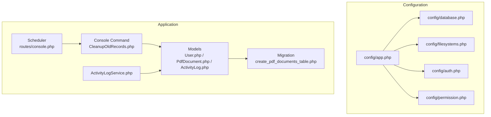
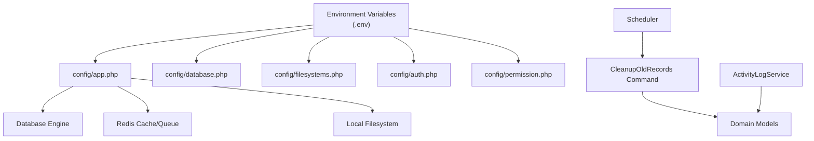
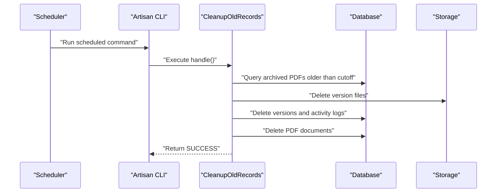
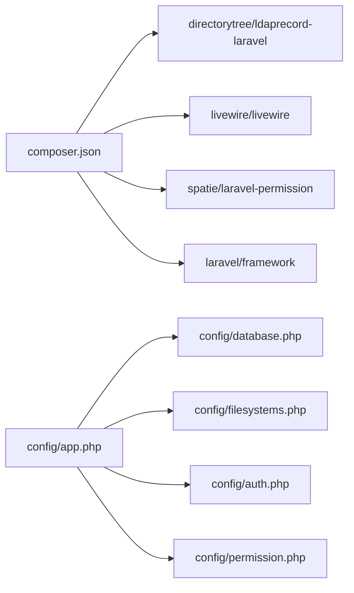

# System Configuration

<cite>
**Referenced Files in This Document**
- [app.php](file://config/app.php)
- [database.php](file://config/database.php)
- [filesystems.php](file://config/filesystems.php)
- [auth.php](file://config/auth.php)
- [permission.php](file://config/permission.php)
- [composer.json](file://composer.json)
- [CleanupOldRecords.php](file://app\Console\Commands\CleanupOldRecords.php)
- [console.php](file://routes\console.php)
- [ActivityLogService.php](file://app\Services\ActivityLogService.php)
- [User.php](file://app\Models\User.php)
- [PdfDocument.php](file://app\Models\PdfDocument.php)
- [ActivityLog.php](file://app\Models\ActivityLog.php)
- [2024_06_10_120000_create_pdf_documents_table.php](file://database\migrations\2024_06_10_120000_create_pdf_documents_table.php)
- [AdminController.php](file://app\Http\Controllers\AdminController.php)
- [UserManagement.php](file://app\Livewire\Admin\UserManagement.php)
</cite>

## Table of Contents
1. [Introduction](#introduction)
2. [Project Structure](#project-structure)
3. [Core Components](#core-components)
4. [Architecture Overview](#architecture-overview)
5. [Detailed Component Analysis](#detailed-component-analysis)
6. [Dependency Analysis](#dependency-analysis)
7. [Performance Considerations](#performance-considerations)
8. [Troubleshooting Guide](#troubleshooting-guide)
9. [Conclusion](#conclusion)
10. [Appendices](#appendices)

## Introduction
This document explains how the system is configured and maintained. It covers environment-driven settings, database and file storage configuration, authentication and authorization, scheduled maintenance, logging and auditing, and operational parameters. It also outlines backup and recovery considerations, monitoring setup, performance tuning options, and security controls grounded in the repository’s configuration and code.

## Project Structure
The system is a Laravel application with a clear separation of concerns:
- Configuration is centralized under config/ with environment variables controlling runtime behavior.
- Database connectivity and Redis caching are configured via config/database.php.
- File storage is managed through config/filesystems.php with local disks and symbolic links.
- Authentication and authorization integrate LDAP and role-based permissions via Spatie Permission.
- Maintenance automation is implemented with a console command scheduled daily.
- Logging and auditing are captured through an ActivityLog model and service.



**Diagram sources**
- [app.php:1-92](file://config/app.php#L1-L92)
- [database.php:1-93](file://config/database.php#L1-L93)
- [filesystems.php:1-23](file://config/filesystems.php#L1-L23)
- [auth.php:1-49](file://config/auth.php#L1-L49)
- [permission.php:1-34](file://config/permission.php#L1-L34)
- [CleanupOldRecords.php:1-47](file://app\Console\Commands\CleanupOldRecords.php#L1-L47)
- [console.php:1-12](file://routes\console.php#L1-L12)
- [ActivityLogService.php:1-31](file://app\Services\ActivityLogService.php#L1-L31)
- [User.php:1-76](file://app\Models\User.php#L1-L76)
- [PdfDocument.php:1-130](file://app\Models\PdfDocument.php#L1-L130)
- [ActivityLog.php:1-60](file://app\Models\ActivityLog.php#L1-L60)
- [2024_06_10_120000_create_pdf_documents_table.php:1-32](file://database\migrations\2024_06_10_120000_create_pdf_documents_table.php#L1-L32)

**Section sources**
- [app.php:1-92](file://config/app.php#L1-L92)
- [database.php:1-93](file://config/database.php#L1-L93)
- [filesystems.php:1-23](file://config/filesystems.php#L1-L23)
- [auth.php:1-49](file://config/auth.php#L1-L49)
- [permission.php:1-34](file://config/permission.php#L1-L34)
- [composer.json:1-70](file://composer.json#L1-L70)

## Core Components
- Application configuration: environment-driven settings for name, environment, debug mode, URLs, timezone, locale, encryption key, maintenance driver/store, and provider registration.
- Database configuration: support for SQLite, MySQL, PostgreSQL, SQL Server with connection parameters, charset/collation, SSL options, and Redis client configuration.
- Filesystems: local disks for private and public storage, with a symbolic link from public/storage to storage/app/public.
- Authentication: session guard, Eloquent/LDAP providers, password broker settings, and LDAP attribute synchronization.
- Authorization: Spatie Permission models, table names, caching, and wildcard permission disabled.
- Maintenance automation: a daily scheduled console command to clean old records and files.
- Activity logging: structured audit trail for document actions with IP capture.

**Section sources**
- [app.php:3-20](file://config/app.php#L3-L20)
- [database.php:5-67](file://config/database.php#L5-L67)
- [database.php:68-91](file://config/database.php#L68-L91)
- [filesystems.php:3-22](file://config/filesystems.php#L3-L22)
- [auth.php:3-48](file://config/auth.php#L3-L48)
- [permission.php:3-33](file://config/permission.php#L3-L33)
- [CleanupOldRecords.php:11-46](file://app\Console\Commands\CleanupOldRecords.php#L11-L46)
- [console.php:11-11](file://routes\console.php#L11-L11)
- [ActivityLogService.php:10-30](file://app\Services\ActivityLogService.php#L10-L30)

## Architecture Overview
The system architecture integrates configuration-driven components with scheduled maintenance and robust logging.



**Diagram sources**
- [app.php:3-20](file://config/app.php#L3-L20)
- [database.php:5-67](file://config/database.php#L5-L67)
- [database.php:68-91](file://config/database.php#L68-L91)
- [filesystems.php:3-22](file://config/filesystems.php#L3-L22)
- [auth.php:3-48](file://config/auth.php#L3-L48)
- [permission.php:3-33](file://config/permission.php#L3-L33)
- [console.php:11-11](file://routes\console.php#L11-L11)
- [CleanupOldRecords.php:11-46](file://app\Console\Commands\CleanupOldRecords.php#L11-L46)
- [ActivityLogService.php:10-30](file://app\Services\ActivityLogService.php#L10-L30)

## Detailed Component Analysis

### Environment and Application Settings
- Purpose and identity: application name, environment, debug flag, base URLs, asset URL, timezone, locale, fallback locale, faker locale.
- Encryption: cipher and application key with previous keys support.
- Maintenance mode: driver and store selection.
- Providers and aliases: registered service providers and facades.

Operational parameters:
- Set APP_ENV to production for secure defaults.
- Enable APP_DEBUG only during development.
- Configure APP_TIMEZONE to align with regional operations.
- Set APP_KEY via a strong random value and rotate using APP_PREVIOUS_KEYS during key rotation.

**Section sources**
- [app.php:3-20](file://config/app.php#L3-L20)

### Database Configuration
Supported drivers:
- sqlite: default connection with optional URL, database path, foreign key constraints, and journal/sync tuning.
- mysql: host, port, database, credentials, charset/collation, strict mode, and SSL CA option.
- pgsql: host, port, database, credentials, charset, prefix, search path, and SSL mode.
- sqlsrv: host, port, database, credentials, charset, and prefix.

Redis:
- Client selection, cluster, prefix, persistence.
- Default and cache databases with URL/host/port/credentials.

Migration behavior:
- Default migration table name and date update policy.

**Section sources**
- [database.php:5-67](file://config/database.php#L5-L67)
- [database.php:68-91](file://config/database.php#L68-L91)

### File Storage Configuration
- Default disk controlled by FILESYSTEM_DISK.
- Local disks:
  - local: private storage under storage/app.
  - public: public storage under storage/app/public with a public symlink at public/storage.
- Symbolic link ensures public assets are served via APP_URL/storage.

**Section sources**
- [filesystems.php:3-22](file://config/filesystems.php#L3-L22)

### Authentication and Authorization
- Guards and providers:
  - Session-based web guard.
  - Eloquent provider for users and LDAP provider with Active Directory model and attribute sync.
- Password broker: reset token table, expiration, throttle.
- LDAP sync includes mapping attributes (name, email, username, guid) and existing record sync rules.
- Permission system:
  - Models and table names for roles and permissions.
  - Caching enabled with expiration and store key.
  - Wildcard permissions disabled.

Access control:
- Roles checked via User model helpers (isAdmin, isEditor, isGrafik, isProofreader).
- Admin actions (release/reassign) validated against assignment state and logged.

**Section sources**
- [auth.php:3-48](file://config/auth.php#L3-L48)
- [permission.php:3-33](file://config/permission.php#L3-L33)
- [User.php:56-75](file://app\Models\User.php#L56-L75)
- [AdminController.php:13-61](file://app\Http\Controllers\AdminController.php#L13-L61)

### Activity Logging and Auditing
- ActivityLogService captures actions (upload, assign, release, correct, archive, view, download) with user ID, document ID, details, and IP address.
- ActivityLog model stores per-document and per-user audit entries with timestamps and localized action labels.

Integration points:
- Controllers and Livewire components trigger logging for administrative and user actions.
- Logs support compliance reporting and incident investigation.

**Section sources**
- [ActivityLogService.php:10-30](file://app\Services\ActivityLogService.php#L10-L30)
- [ActivityLog.php:9-59](file://app\Models\ActivityLog.php#L9-L59)

### Scheduled Maintenance and Automated Cleanup
Daily cleanup command:
- Signature supports a retention period (--days).
- Deletes archived PDF documents older than cutoff date.
- Removes associated versions and their stored files from storage.
- Cleans up related activity logs.
- Returns success after completion.

Scheduler:
- Daily execution via routes/console.php.

Operational parameters:
- Adjust --days to balance retention and storage usage.
- Monitor cleanup logs and storage utilization post-execution.



**Diagram sources**
- [console.php:11-11](file://routes\console.php#L11-L11)
- [CleanupOldRecords.php:11-46](file://app\Console\Commands\CleanupOldRecords.php#L11-L46)

**Section sources**
- [CleanupOldRecords.php:11-46](file://app\Console\Commands\CleanupOldRecords.php#L11-L46)
- [console.php:11-11](file://routes\console.php#L11-L11)

### Data Models and Relationships
Core entities and their relationships:
- User: uploadedPdfs, assignedPdfs, pdfVersions, activityLogs, roles.
- PdfDocument: belongs to Title and Users (uploader, assignee), versions, latestVersion, activityLogs, scopes for filtering.
- ActivityLog: belongs to PdfDocument and User.

```mermaid
erDiagram
USERS {
bigint id PK
string name
string email
string username
string guid
string domain
timestamp email_verified_at
timestamps created_at, updated_at
}
TITLES {
bigint id PK
string name
timestamps created_at, updated_at
}
PDF_DOCUMENTS {
bigint id PK
bigint title_id FK
bigint uploaded_by_user_id FK
string name
int page_number
string issue_title
timestamp deadline_date
enum status
bigint assigned_to_user_id FK
int current_version_number
timestamp archived_at
timestamps created_at, updated_at
}
PDF_VERSIONS {
bigint id PK
bigint pdf_document_id FK
int version_number
string file_path
bigint uploaded_by_user_id FK
timestamps created_at, updated_at
}
ACTIVITY_LOGS {
bigint id PK
bigint pdf_document_id FK
bigint user_id FK
string action
string details
string ip_address
timestamp created_at
}
USERS ||--o{ PDF_DOCUMENTS : "uploads"
USERS ||--o{ PDF_VERSIONS : "uploads"
USERS ||--o{ ACTIVITY_LOGS : "generates"
TITLES ||--o{ PDF_DOCUMENTS : "contains"
PDF_DOCUMENTS ||--o{ PDF_VERSIONS : "has_many"
PDF_DOCUMENTS ||--o{ ACTIVITY_LOGS : "audits"
```

**Diagram sources**
- [User.php:10-75](file://app\Models\User.php#L10-L75)
- [PdfDocument.php:10-129](file://app\Models\PdfDocument.php#L10-L129)
- [ActivityLog.php:9-59](file://app\Models\ActivityLog.php#L9-L59)
- [2024_06_10_120000_create_pdf_documents_table.php:11-24](file://database\migrations\2024_06_10_120000_create_pdf_documents_table.php#L11-L24)

**Section sources**
- [User.php:36-54](file://app\Models\User.php#L36-L54)
- [PdfDocument.php:41-70](file://app\Models\PdfDocument.php#L41-L70)
- [ActivityLog.php:36-44](file://app\Models\ActivityLog.php#L36-L44)
- [2024_06_10_120000_create_pdf_documents_table.php:11-24](file://database\migrations\2024_06_10_120000_create_pdf_documents_table.php#L11-L24)

### Security Configuration and Access Control
- Authentication:
  - Session guard with Eloquent provider.
  - LDAP provider with Active Directory model and attribute mapping.
  - Password broker with configurable reset token table, expiry, and throttle.
- Authorization:
  - Spatie Permission with explicit table names and caching.
  - Wildcard permissions disabled.
- Role-based checks in User model for Admin, Editor, Grafik, and Proofreader roles.
- Administrative actions (release/reassign) validated and logged.

Compliance-related parameters:
- Activity logs capture user, action, document, IP, and timestamp for audit trails.

**Section sources**
- [auth.php:3-48](file://config/auth.php#L3-L48)
- [permission.php:3-33](file://config/permission.php#L3-L33)
- [User.php:56-75](file://app\Models\User.php#L56-L75)
- [AdminController.php:13-61](file://app\Http\Controllers\AdminController.php#L13-L61)
- [ActivityLogService.php:20-29](file://app\Services\ActivityLogService.php#L20-L29)

### Backup and Recovery Procedures
- Database backups:
  - For SQLite, back up the database.sqlite file located under database/.
  - For MySQL/PostgreSQL/SQL Server, use native database tools to export schema and data.
- File storage backups:
  - Back up storage/app and storage/app/public as needed; public assets are symlinked to storage/app/public.
- Configuration backups:
  - Preserve config/*.php and .env with environment-specific values.
- Recovery steps:
  - Restore database and files atomically.
  - Re-run migrations if schema changed.
  - Recreate symbolic links if public/storage is restored separately.
  - Verify APP_KEY and previous keys for decryption continuity.

[No sources needed since this section provides general guidance]

### Monitoring Setup and Health Checks
- Application logs:
  - Laravel logs are written to storage/logs; monitor for errors and warnings.
- Database health:
  - Use database-native diagnostics and slow query logs.
- Redis health:
  - Verify connectivity and ping; check cache hit rates.
- Scheduler health:
  - Confirm cron/systemd runs the scheduler and that CleanupOldRecords executes as scheduled.

[No sources needed since this section provides general guidance]

### Performance Tuning Options
- Database:
  - Enable appropriate collations and indexes; tune SQLite journal_mode and synchronous for write-heavy workloads.
  - For MySQL/PG, configure connection pooling and query timeouts.
- Redis:
  - Tune client, cluster, prefix, and database separation for cache vs queues.
- Filesystem:
  - Use local disk for small deployments; consider object storage for large-scale file serving.
- Application:
  - Disable debug in production; leverage compiled routes and optimized autoloaders.

[No sources needed since this section provides general guidance]

## Dependency Analysis
The application depends on configuration-driven components and third-party packages for LDAP, Livewire, and permissions.



**Diagram sources**
- [composer.json:7-23](file://composer.json#L7-L23)
- [app.php:21-47](file://config/app.php#L21-L47)
- [database.php:5-67](file://config/database.php#L5-L67)
- [filesystems.php:3-22](file://config/filesystems.php#L3-L22)
- [auth.php:3-48](file://config/auth.php#L3-L48)
- [permission.php:3-33](file://config/permission.php#L3-L33)

**Section sources**
- [composer.json:7-23](file://composer.json#L7-L23)
- [app.php:21-47](file://config/app.php#L21-L47)

## Performance Considerations
- Use production-grade database engines (MySQL/PostgreSQL/SQL Server) for scalability.
- Separate Redis databases for cache and queues to avoid contention.
- Keep APP_DEBUG disabled in production to reduce overhead.
- Monitor storage growth and adjust cleanup retention (--days) accordingly.
- Index frequently queried columns (e.g., status, assigned_to_user_id, archived_at).

[No sources needed since this section provides general guidance]

## Troubleshooting Guide
- Maintenance command not running:
  - Verify scheduler is executed by the system and that CleanupOldRecords is scheduled daily.
- Storage deletion failures:
  - Ensure file paths exist and permissions allow deletion; confirm cleanup logic targets archived documents.
- LDAP synchronization issues:
  - Validate LDAP provider configuration and attribute mapping; confirm Active Directory connectivity.
- Permission errors:
  - Confirm Spatie Permission cache is initialized and roles are synced; review cache store configuration.
- Activity logs missing:
  - Ensure logging is enabled and that the ActivityLogService is invoked on relevant actions.

**Section sources**
- [console.php:11-11](file://routes\console.php#L11-L11)
- [CleanupOldRecords.php:16-45](file://app\Console\Commands\CleanupOldRecords.php#L16-L45)
- [auth.php:19-37](file://config/auth.php#L19-L37)
- [permission.php:28-32](file://config/permission.php#L28-L32)
- [ActivityLogService.php:20-29](file://app\Services\ActivityLogService.php#L20-L29)

## Conclusion
This system relies on environment-driven configuration to control behavior across authentication, authorization, storage, and database connectivity. Scheduled maintenance automates cleanup of old records and files, while activity logging provides an audit trail. By tuning database and Redis settings, maintaining secure environment variables, and monitoring logs and scheduler health, operators can ensure reliable and compliant operation.

## Appendices
- Compliance parameters:
  - Activity logs include user, action, document, details, and IP address for traceability.
- Administrative controls:
  - AdminController enforces assignment state and logs administrative actions.
  - Livewire-based UserManagement handles creation, role assignment, and deletion with validation and safeguards.

**Section sources**
- [ActivityLog.php:21-27](file://app\Models\ActivityLog.php#L21-L27)
- [AdminController.php:13-61](file://app\Http\Controllers\AdminController.php#L13-L61)
- [UserManagement.php:39-107](file://app\Livewire\Admin\UserManagement.php#L39-L107)