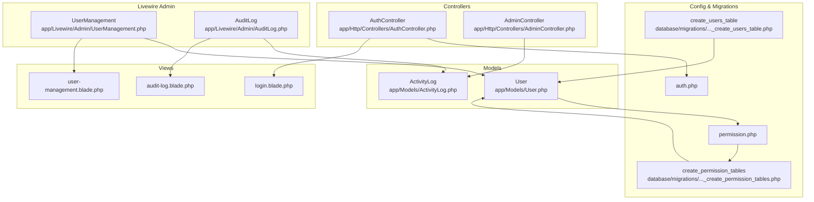
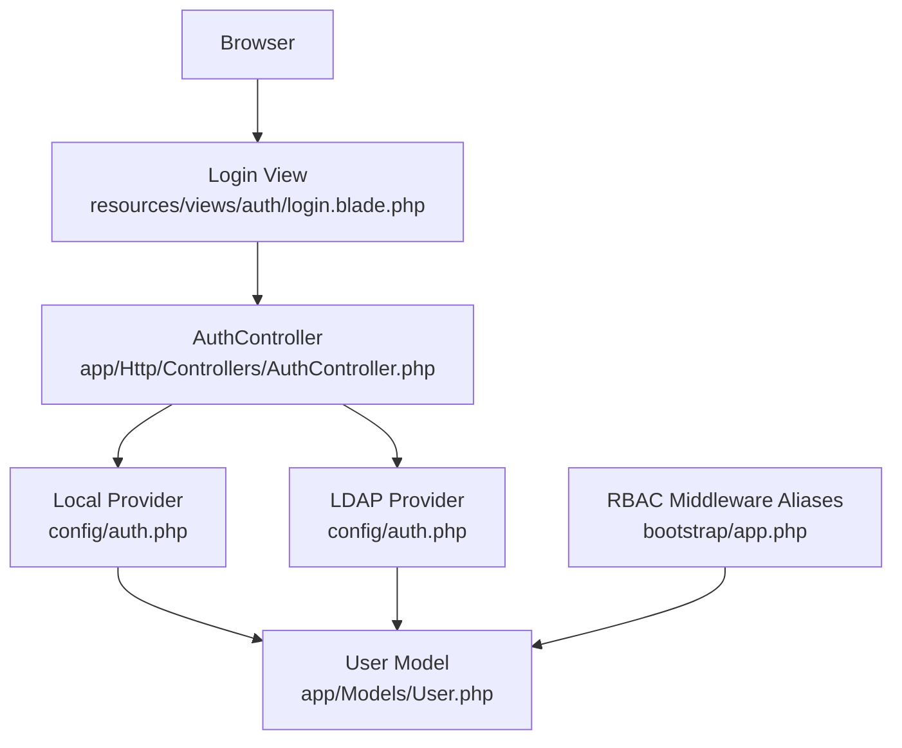
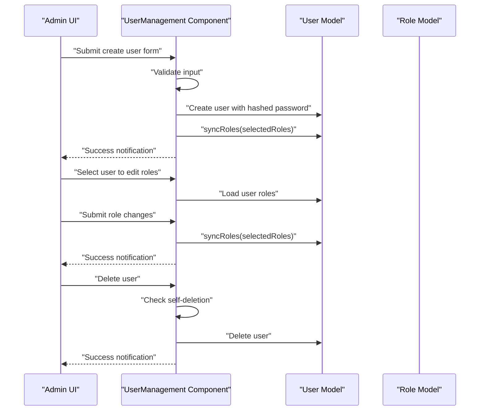
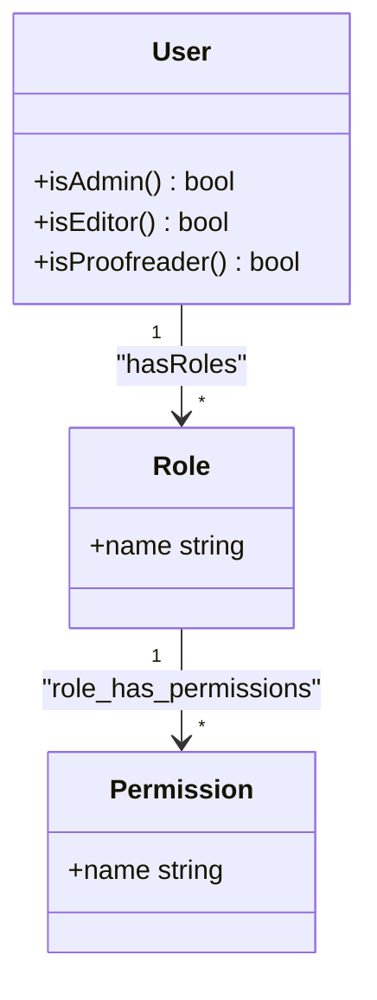
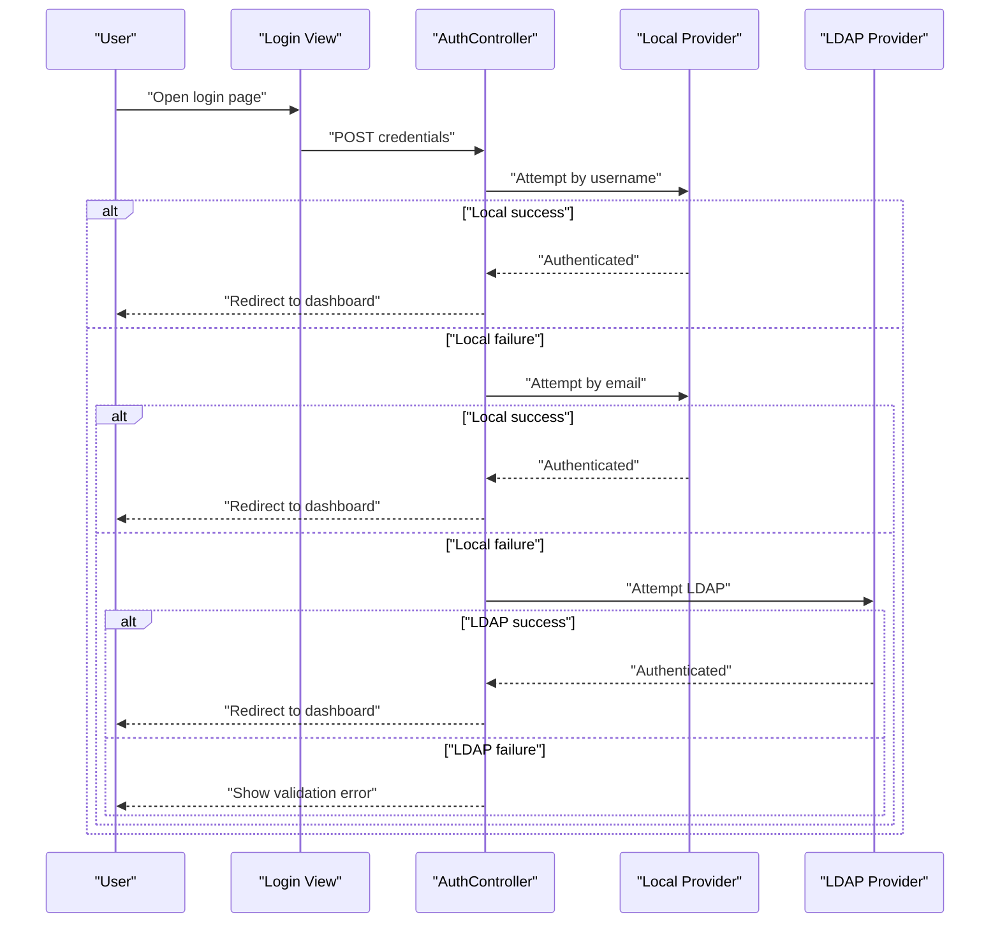
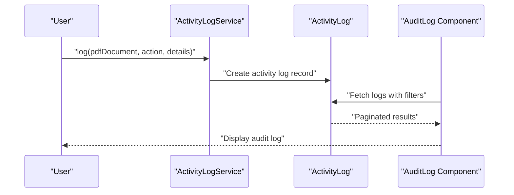
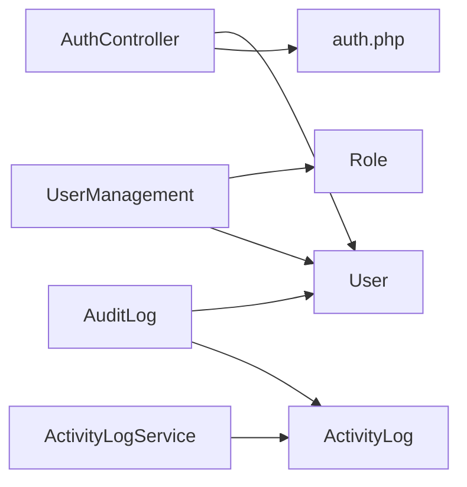

# User Administration

<cite>
**Referenced Files in This Document**
- [User.php](file://app/Models/User.php)
- [UserManagement.php](file://app/Livewire/Admin/UserManagement.php)
- [user-management.blade.php](file://resources/views/livewire/admin/user-management.blade.php)
- [AuthController.php](file://app/Http/Controllers/AuthController.php)
- [auth.php](file://config/auth.php)
- [permission.php](file://config/permission.php)
- [2024_06_10_100000_create_permission_tables.php](file://database/migrations/2024_06_10_100000_create_permission_tables.php)
- [2024_06_10_100000_create_users_table.php](file://database/migrations/0001_01_01_000000_create_users_table.php)
- [ActivityLog.php](file://app/Models/ActivityLog.php)
- [ActivityLogService.php](file://app/Services/ActivityLogService.php)
- [AuditLog.php](file://app/Livewire/Admin/AuditLog.php)
- [audit-log.blade.php](file://resources/views/livewire/admin/audit-log.blade.php)
- [AdminController.php](file://app/Http/Controllers/AdminController.php)
- [login.blade.php](file://resources/views/auth/login.blade.php)
- [app.php](file://bootstrap/app.php)
</cite>

## Table of Contents
1. [Introduction](#introduction)
2. [Project Structure](#project-structure)
3. [Core Components](#core-components)
4. [Architecture Overview](#architecture-overview)
5. [Detailed Component Analysis](#detailed-component-analysis)
6. [Dependency Analysis](#dependency-analysis)
7. [Performance Considerations](#performance-considerations)
8. [Troubleshooting Guide](#troubleshooting-guide)
9. [Conclusion](#conclusion)

## Introduction
This document describes the user administration functionality of the PDF correction platform. It covers user lifecycle operations (creation, modification, deletion), role assignment and permission management via a role-based access control (RBAC) system, user registration and authentication workflows, profile management, account status controls, bulk user operations, user search and filtering, user activity monitoring, and account security features. Administrative approval workflows are integrated with the RBAC system and audit logging.

## Project Structure
The user administration feature spans models, Livewire components, controllers, configuration, migrations, and views:
- Models define user profiles, roles, and activity logs.
- Livewire components provide interactive UI for user management and audit logging.
- Controllers handle authentication and administrative actions affecting documents and assignments.
- Configuration files set up authentication providers (local and LDAP/AD) and RBAC settings.
- Migrations establish database schemas for users, roles, permissions, and activity logs.
- Views render forms and lists for user creation, role editing, and audit reporting.

**Diagram sources**
- [User.php:10-71](file://app/Models/User.php#L10-L71)
- [UserManagement.php:14-127](file://app/Livewire/Admin/UserManagement.php#L14-L127)
- [user-management.blade.php:1-152](file://resources/views/livewire/admin/user-management.blade.php#L1-L152)
- [AuthController.php:11-81](file://app/Http/Controllers/AuthController.php#L11-L81)
- [auth.php:1-49](file://config/auth.php#L1-L49)
- [permission.php:1-34](file://config/permission.php#L1-L34)
- [2024_06_10_100000_create_users_table.php:7-47](file://database/migrations/0001_01_01_000000_create_users_table.php#L7-L47)
- [2024_06_10_100000_create_permission_tables.php:7-122](file://database/migrations/2024_06_10_100000_create_permission_tables.php#L7-L122)
- [ActivityLog.php:9-60](file://app/Models/ActivityLog.php#L9-L60)
- [ActivityLogService.php:10-31](file://app/Services/ActivityLogService.php#L10-L31)
- [AuditLog.php:11-54](file://app/Livewire/Admin/AuditLog.php#L11-L54)
- [audit-log.blade.php:1-69](file://resources/views/livewire/admin/audit-log.blade.php#L1-L69)
- [AdminController.php:11-62](file://app/Http/Controllers/AdminController.php#L11-L62)
- [login.blade.php:1-49](file://resources/views/auth/login.blade.php#L1-L49)

**Section sources**
- [User.php:10-71](file://app/Models/User.php#L10-L71)
- [UserManagement.php:14-127](file://app/Livewire/Admin/UserManagement.php#L14-L127)
- [AuthController.php:11-81](file://app/Http/Controllers/AuthController.php#L11-L81)
- [auth.php:1-49](file://config/auth.php#L1-L49)
- [permission.php:1-34](file://config/permission.php#L1-L34)
- [2024_06_10_100000_create_users_table.php:7-47](file://database/migrations/0001_01_01_000000_create_users_table.php#L7-L47)
- [2024_06_10_100000_create_permission_tables.php:7-122](file://database/migrations/2024_06_10_100000_create_permission_tables.php#L7-L122)
- [ActivityLog.php:9-60](file://app/Models/ActivityLog.php#L9-L60)
- [ActivityLogService.php:10-31](file://app/Services/ActivityLogService.php#L10-L31)
- [AuditLog.php:11-54](file://app/Livewire/Admin/AuditLog.php#L11-L54)
- [audit-log.blade.php:1-69](file://resources/views/livewire/admin/audit-log.blade.php#L1-L69)
- [AdminController.php:11-62](file://app/Http/Controllers/AdminController.php#L11-L62)
- [login.blade.php:1-49](file://resources/views/auth/login.blade.php#L1-L49)

## Core Components
- User model with RBAC traits and helper methods for role checks.
- User management Livewire component for creating, editing roles, deleting users, and searching/filtering.
- Authentication controller supporting local accounts and LDAP/AD with fallback attempts.
- Activity log model and service for capturing user actions with IP and timestamps.
- Audit log Livewire component for filtering and paginating activity logs.
- Admin controller for document assignment/release actions with audit logging.

Key implementation references:
- User model role helpers and relations: [User.php:56-69](file://app/Models/User.php#L56-L69)
- User management CRUD and search: [UserManagement.php:39-127](file://app/Livewire/Admin/UserManagement.php#L39-L127)
- Authentication flow and LDAP integration: [AuthController.php:21-71](file://app/Http/Controllers/AuthController.php#L21-L71)
- Activity logging service: [ActivityLogService.php:20-29](file://app/Services/ActivityLogService.php#L20-L29)
- Audit log filters and pagination: [AuditLog.php:23-53](file://app/Livewire/Admin/AuditLog.php#L23-L53)

**Section sources**
- [User.php:56-69](file://app/Models/User.php#L56-L69)
- [UserManagement.php:39-127](file://app/Livewire/Admin/UserManagement.php#L39-L127)
- [AuthController.php:21-71](file://app/Http/Controllers/AuthController.php#L21-L71)
- [ActivityLogService.php:20-29](file://app/Services/ActivityLogService.php#L20-L29)
- [AuditLog.php:23-53](file://app/Livewire/Admin/AuditLog.php#L23-L53)

## Architecture Overview
The user administration architecture integrates:
- Authentication providers (local and LDAP/AD) configured in auth configuration.
- RBAC middleware aliases registered in the application bootstrap.
- User management UI driven by Livewire components with server-side validation and persistence.
- Activity logging centralized in the activity log service and stored in the activity logs table.
- Audit reporting filtered by action, user, date range, and details search.

**Diagram sources**
- [login.blade.php:1-49](file://resources/views/auth/login.blade.php#L1-L49)
- [AuthController.php:21-71](file://app/Http/Controllers/AuthController.php#L21-L71)
- [auth.php:8-38](file://config/auth.php#L8-L38)
- [User.php:10-71](file://app/Models/User.php#L10-L71)
- [app.php:13-19](file://bootstrap/app.php#L13-L19)

## Detailed Component Analysis

### User Creation, Modification, and Deletion
- Creation: Validates name, unique username and email, matching passwords, and selected roles. Creates hashed password and assigns roles.
- Modification: Edits roles for a selected user via syncRoles and displays current roles.
- Deletion: Prevents self-deletion and deletes the user after confirmation.

**Diagram sources**
- [UserManagement.php:39-107](file://app/Livewire/Admin/UserManagement.php#L39-L107)
- [user-management.blade.php:14-107](file://resources/views/livewire/admin/user-management.blade.php#L14-L107)

**Section sources**
- [UserManagement.php:39-107](file://app/Livewire/Admin/UserManagement.php#L39-L107)
- [user-management.blade.php:14-107](file://resources/views/livewire/admin/user-management.blade.php#L14-L107)

### Role Assignment and Permission Management
- Roles are managed through Spatie Laravel Permission. The User model uses HasRoles trait and exposes helper methods for role checks.
- Middleware aliases for role and permission checks are registered in the application bootstrap.
- The permission configuration defines table names and caching behavior.

**Diagram sources**
- [User.php:56-69](file://app/Models/User.php#L56-L69)
- [permission.php:3-34](file://config/permission.php#L3-L34)
- [2024_06_10_100000_create_permission_tables.php:32-100](file://database/migrations/2024_06_10_100000_create_permission_tables.php#L32-L100)
- [app.php:13-19](file://bootstrap/app.php#L13-L19)

**Section sources**
- [User.php:56-69](file://app/Models/User.php#L56-L69)
- [permission.php:3-34](file://config/permission.php#L3-L34)
- [2024_06_10_100000_create_permission_tables.php:32-100](file://database/migrations/2024_06_10_100000_create_permission_tables.php#L32-L100)
- [app.php:13-19](file://bootstrap/app.php#L13-L19)

### User Registration Workflows and Authentication
- Login accepts either username or email and tries local authentication first, then LDAP/AD if configured.
- Supports "remember me" sessions and handles LDAP connection errors gracefully.
- The login view presents provider hints for AD and local accounts.

**Diagram sources**
- [AuthController.php:21-71](file://app/Http/Controllers/AuthController.php#L21-L71)
- [login.blade.php:23-46](file://resources/views/auth/login.blade.php#L23-L46)
- [auth.php:14-38](file://config/auth.php#L14-L38)

**Section sources**
- [AuthController.php:21-71](file://app/Http/Controllers/AuthController.php#L21-L71)
- [login.blade.php:23-46](file://resources/views/auth/login.blade.php#L23-L46)
- [auth.php:14-38](file://config/auth.php#L14-L38)

### Profile Management and Account Status Controls
- Profiles include name, email, optional username, and GUID/domain attributes.
- Passwords are hashed upon creation and not exposed in hidden fields.
- Account status controls are not explicitly modeled in the provided files; administrators can disable access by removing roles or revoking permissions.

**Section sources**
- [User.php:14-34](file://app/Models/User.php#L14-L34)
- [2024_06_10_100000_create_users_table.php:11-22](file://database/migrations/0001_01_01_000000_create_users_table.php#L11-L22)

### Bulk User Operations and Search/Filtering
- Bulk operations: The user management component supports batch role updates via checkboxes and pagination for efficient browsing.
- Search and filtering: Real-time search across name, email, and username; pagination with configurable page size.

**Section sources**
- [UserManagement.php:18-127](file://app/Livewire/Admin/UserManagement.php#L18-L127)
- [user-management.blade.php:102-149](file://resources/views/livewire/admin/user-management.blade.php#L102-L149)

### User Activity Monitoring and Audit Logging
- Activity logging captures actions performed by users, including uploads, assignments, releases, corrections, archiving, views, and downloads, along with IP address and timestamps.
- The audit log component allows filtering by action, user, date range, and free-text search in details.

**Diagram sources**
- [ActivityLogService.php:20-29](file://app/Services/ActivityLogService.php#L20-L29)
- [ActivityLog.php:13-58](file://app/Models/ActivityLog.php#L13-L58)
- [AuditLog.php:23-53](file://app/Livewire/Admin/AuditLog.php#L23-L53)
- [audit-log.blade.php:4-67](file://resources/views/livewire/admin/audit-log.blade.php#L4-L67)

**Section sources**
- [ActivityLogService.php:20-29](file://app/Services/ActivityLogService.php#L20-L29)
- [ActivityLog.php:13-58](file://app/Models/ActivityLog.php#L13-L58)
- [AuditLog.php:23-53](file://app/Livewire/Admin/AuditLog.php#L23-L53)
- [audit-log.blade.php:4-67](file://resources/views/livewire/admin/audit-log.blade.php#L4-L67)

### Administrative Approval Workflows
- Administrators can assign or release PDF documents to/from users, with reasons recorded in audit logs.
- These actions are part of the broader administrative toolkit and integrate with the activity logging system.

**Section sources**
- [AdminController.php:13-60](file://app/Http/Controllers/AdminController.php#L13-L60)

## Dependency Analysis
- User model depends on Spatie Permission traits and Eloquent relationships.
- User management component depends on the User model, Role model, and Livewire pagination.
- Authentication controller depends on auth configuration and LDAP provider when enabled.
- Activity log service depends on the ActivityLog model and global request/session context.
- Audit log component depends on ActivityLog model and user list for filters.

**Diagram sources**
- [UserManagement.php:5-11](file://app/Livewire/Admin/UserManagement.php#L5-L11)
- [AuthController.php:5-10](file://app/Http/Controllers/AuthController.php#L5-L10)
- [ActivityLogService.php:5-8](file://app/Services/ActivityLogService.php#L5-L8)
- [AuditLog.php:5-8](file://app/Livewire/Admin/AuditLog.php#L5-L8)

**Section sources**
- [UserManagement.php:5-11](file://app/Livewire/Admin/UserManagement.php#L5-L11)
- [AuthController.php:5-10](file://app/Http/Controllers/AuthController.php#L5-L10)
- [ActivityLogService.php:5-8](file://app/Services/ActivityLogService.php#L5-L8)
- [AuditLog.php:5-8](file://app/Livewire/Admin/AuditLog.php#L5-L8)

## Performance Considerations
- Pagination: User and audit log listings use pagination to limit database load and improve responsiveness.
- Indexing: Users table includes unique indexes on email and username; sessions table indexes user_id for session lookup.
- Caching: Permission cache is configured with a 24-hour expiration interval to reduce repeated permission checks.
- Validation: Client-side debounced search reduces unnecessary server requests during filtering.

[No sources needed since this section provides general guidance]

## Troubleshooting Guide
- Authentication failures:
  - Verify local provider credentials and ensure the user exists with a valid password hash.
  - For LDAP/AD, check provider configuration and network connectivity; connection exceptions are logged and surfaced to the user.
- Role synchronization:
  - Ensure roles exist in the roles table and that the user has at least one role assigned.
  - Confirm middleware aliases are registered for role/permission checks.
- Activity logging:
  - Confirm the activity logs table exists and that the service is invoked with proper parameters.
  - Check that the user is authenticated when logging actions.
- Self-deletion prevention:
  - The user management component prevents deleting the currently authenticated user; confirm session state and user identity.

**Section sources**
- [AuthController.php:52-71](file://app/Http/Controllers/AuthController.php#L52-L71)
- [app.php:13-19](file://bootstrap/app.php#L13-L19)
- [UserManagement.php:95-107](file://app/Livewire/Admin/UserManagement.php#L95-L107)
- [ActivityLogService.php:20-29](file://app/Services/ActivityLogService.php#L20-L29)

## Conclusion
The user administration system provides a robust foundation for managing users, roles, and permissions with integrated authentication (local and LDAP/AD), comprehensive activity auditing, and intuitive UI components for search, filtering, and bulk operations. Administrators can efficiently onboard users, assign appropriate roles, monitor activities, and maintain security through centralized logging and RBAC middleware.