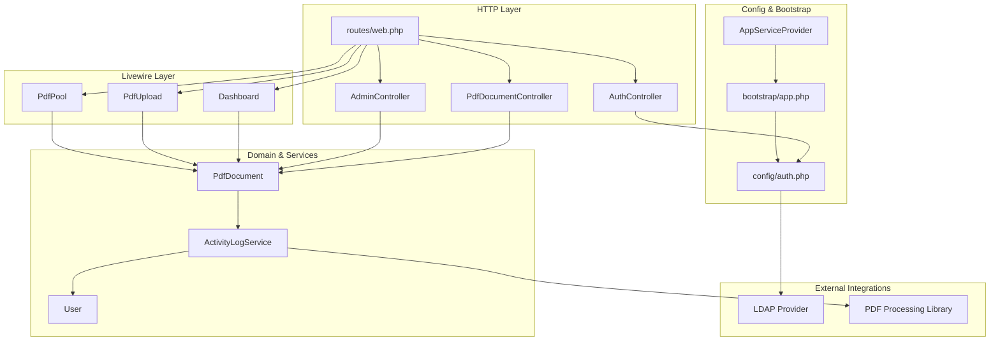
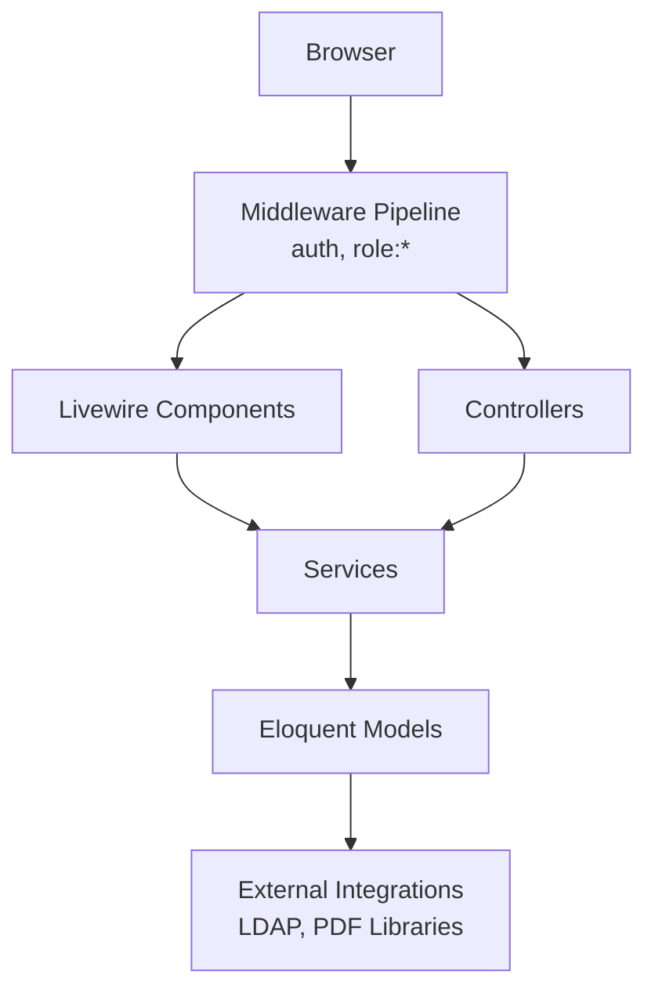
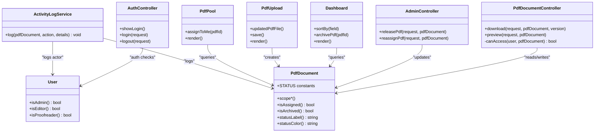
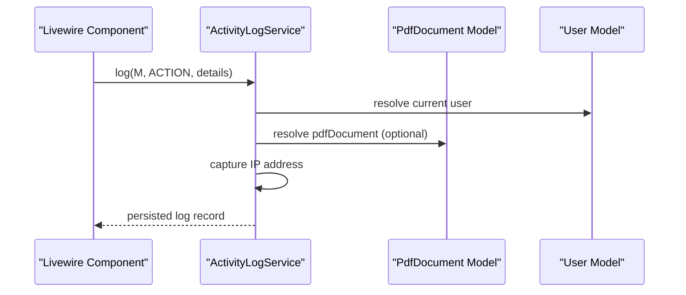
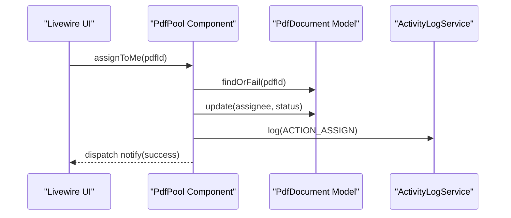
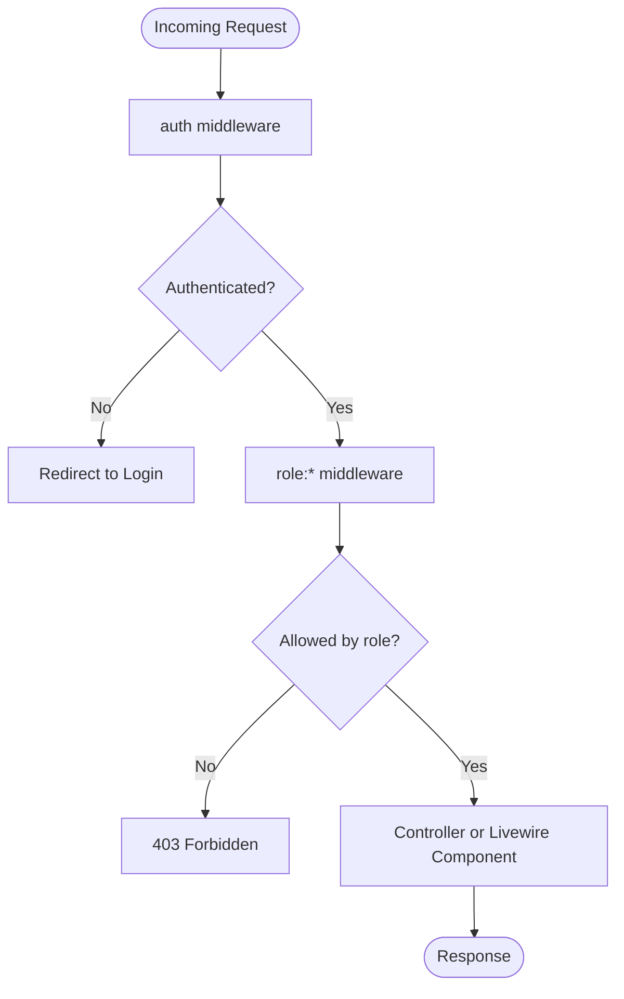
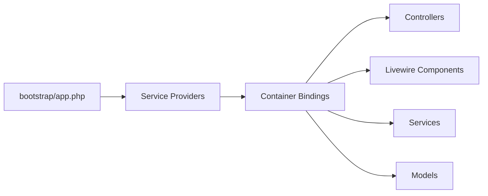
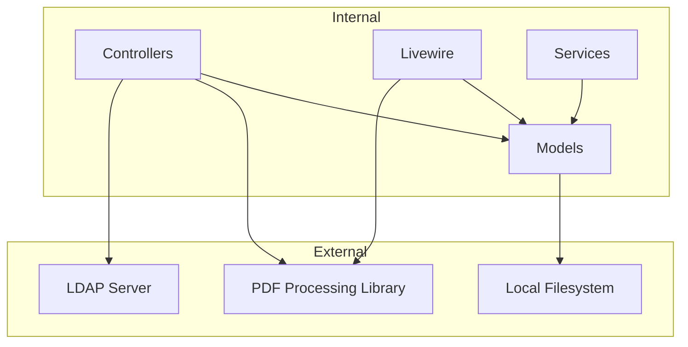
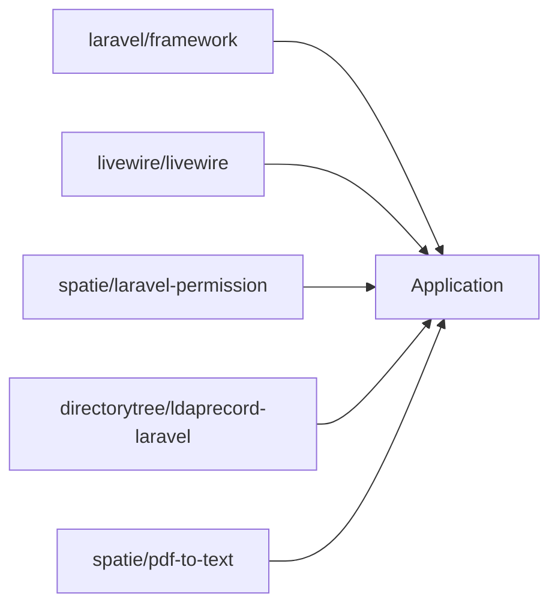

# Architecture Overview

<cite>
**Referenced Files in This Document**
- [app.php](file://bootstrap/app.php)
- [web.php](file://routes/web.php)
- [auth.php](file://config/auth.php)
- [AuthController.php](file://app/Http/controllers/AuthController.php)
- [PdfDocumentController.php](file://app/Http/controllers/PdfDocumentController.php)
- [AdminController.php](file://app/Http/controllers/AdminController.php)
- [Controller.php](file://app/Http/controllers/Controller.php)
- [AppServiceProvider.php](file://app/Providers/AppServiceProvider.php)
- [Dashboard.php](file://app/Livewire/Dashboard.php)
- [PdfUpload.php](file://app/Livewire/PdfUpload.php)
- [PdfPool.php](file://app/Livewire/PdfPool.php)
- [User.php](file://app/Models/User.php)
- [PdfDocument.php](file://app/Models/PdfDocument.php)
- [ActivityLogService.php](file://app/Services/ActivityLogService.php)
- [composer.json](file://composer.json)
</cite>

## Table of Contents
1. [Introduction](#introduction)
2. [Project Structure](#project-structure)
3. [Core Components](#core-components)
4. [Architecture Overview](#architecture-overview)
5. [Detailed Component Analysis](#detailed-component-analysis)
6. [Dependency Analysis](#dependency-analysis)
7. [Performance Considerations](#performance-considerations)
8. [Troubleshooting Guide](#troubleshooting-guide)
9. [Conclusion](#conclusion)

## Introduction
This document describes the architecture of the PDF correction management system. It explains the high-level MVC separation, the service layer pattern for business logic, the Livewire reactive component model for real-time UI updates, the middleware pipeline for request processing and authentication, and the dependency injection container and service provider registration. It also documents system boundaries, external integrations (LDAP and PDF processing libraries), and cross-cutting concerns such as logging, caching, and error handling.

## Project Structure
The system follows Laravel conventions:
- Controllers under app/Http/Controllers handle HTTP requests and delegate to services/models.
- Livewire components under app/Livewire encapsulate UI state and interactions.
- Models under app/Models define domain entities and Eloquent relations.
- Services under app/Services encapsulate business logic.
- Routes in routes/web.php bind URLs to controllers and Livewire components.
- Configuration in config/* defines guards, providers, and permissions.
- bootstrap/app.php configures middleware aliases and exception handling.

**Diagram sources**
- [web.php:1-54](file://routes/web.php#L1-L54)
- [auth.php:1-49](file://config/auth.php#L1-L49)
- [AuthController.php:1-81](file://app/Http/Controllers/AuthController.php#L1-L81)
- [PdfDocumentController.php:1-82](file://app/Http/Controllers/PdfDocumentController.php#L1-L82)
- [AdminController.php:1-62](file://app/Http/Controllers/AdminController.php#L1-L62)
- [Dashboard.php:1-92](file://app/Livewire/Dashboard.php#L1-L92)
- [PdfUpload.php:1-96](file://app/Livewire/PdfUpload.php#L1-L96)
- [PdfPool.php:1-67](file://app/Livewire/PdfPool.php#L1-L67)
- [User.php:1-71](file://app/Models/User.php#L1-L71)
- [PdfDocument.php:1-130](file://app/Models/PdfDocument.php#L1-L130)
- [ActivityLogService.php:1-31](file://app/Services/ActivityLogService.php#L1-L31)
- [app.php:1-23](file://bootstrap/app.php#L1-L23)
- [AppServiceProvider.php:1-19](file://app/Providers/AppServiceProvider.php#L1-L19)
- [composer.json:1-70](file://composer.json#L1-L70)

**Section sources**
- [web.php:1-54](file://routes/web.php#L1-L54)
- [app.php:1-23](file://bootstrap/app.php#L1-L23)
- [composer.json:1-70](file://composer.json#L1-L70)

## Core Components
- Controllers: Handle HTTP requests, validate inputs, enforce access checks, and orchestrate model/service interactions.
- Livewire Components: Reactive UI components managing state, filtering, sorting, and actions with real-time updates.
- Models: Define domain entities, relations, scopes, and value helpers.
- Services: Encapsulate business logic (e.g., activity logging) and coordinate domain operations.
- Middleware: Apply authentication and role-based authorization.
- Authentication: Supports local accounts and LDAP with configurable provider.
- Routing: Maps URLs to controllers and Livewire components with layered middleware groups.

**Section sources**
- [Controller.php:1-9](file://app/Http/Controllers/Controller.php#L1-L9)
- [AuthController.php:1-81](file://app/Http/Controllers/AuthController.php#L1-L81)
- [PdfDocumentController.php:1-82](file://app/Http/Controllers/PdfDocumentController.php#L1-L82)
- [AdminController.php:1-62](file://app/Http/Controllers/AdminController.php#L1-L62)
- [Dashboard.php:1-92](file://app/Livewire/Dashboard.php#L1-L92)
- [PdfUpload.php:1-96](file://app/Livewire/PdfUpload.php#L1-L96)
- [PdfPool.php:1-67](file://app/Livewire/PdfPool.php#L1-L67)
- [User.php:1-71](file://app/Models/User.php#L1-L71)
- [PdfDocument.php:1-130](file://app/Models/PdfDocument.php#L1-L130)
- [ActivityLogService.php:1-31](file://app/Services/ActivityLogService.php#L1-L31)

## Architecture Overview
The system follows a layered MVC architecture:
- Presentation: Livewire components for dynamic UI and controllers for traditional HTTP endpoints.
- Business Logic: Services encapsulate domain operations and cross-cutting concerns.
- Data Access: Eloquent models with scopes and relations.
- Cross-Cutting: Middleware for auth and roles, configuration for providers, and logging.

**Diagram sources**
- [app.php:13-19](file://bootstrap/app.php#L13-L19)
- [web.php:25-53](file://routes/web.php#L25-L53)
- [ActivityLogService.php:1-31](file://app/Services/ActivityLogService.php#L1-L31)
- [PdfDocument.php:1-130](file://app/Models/PdfDocument.php#L1-L130)
- [composer.json:9-14](file://composer.json#L9-L14)

## Detailed Component Analysis

### MVC Separation of Concerns
- Controllers: Handle HTTP actions (login, logout, downloads, previews, admin releases/reassignments).
- Models: Define entity relations, scopes, and helpers (status labels/colors, archived flags).
- Views: Blade templates rendered by Livewire and controllers; Livewire components specify layouts and render views.

**Diagram sources**
- [AuthController.php:1-81](file://app/Http/Controllers/AuthController.php#L1-L81)
- [PdfDocumentController.php:1-82](file://app/Http/Controllers/PdfDocumentController.php#L1-L82)
- [AdminController.php:1-62](file://app/Http/Controllers/AdminController.php#L1-L62)
- [Dashboard.php:1-92](file://app/Livewire/Dashboard.php#L1-L92)
- [PdfUpload.php:1-96](file://app/Livewire/PdfUpload.php#L1-L96)
- [PdfPool.php:1-67](file://app/Livewire/PdfPool.php#L1-L67)
- [User.php:1-71](file://app/Models/User.php#L1-L71)
- [PdfDocument.php:1-130](file://app/Models/PdfDocument.php#L1-L130)
- [ActivityLogService.php:1-31](file://app/Services/ActivityLogService.php#L1-L31)

**Section sources**
- [AuthController.php:1-81](file://app/Http/Controllers/AuthController.php#L1-L81)
- [PdfDocumentController.php:1-82](file://app/Http/Controllers/PdfDocumentController.php#L1-L82)
- [AdminController.php:1-62](file://app/Http/Controllers/AdminController.php#L1-L62)
- [Dashboard.php:1-92](file://app/Livewire/Dashboard.php#L1-L92)
- [PdfUpload.php:1-96](file://app/Livewire/PdfUpload.php#L1-L96)
- [PdfPool.php:1-67](file://app/Livewire/PdfPool.php#L1-L67)
- [User.php:1-71](file://app/Models/User.php#L1-L71)
- [PdfDocument.php:1-130](file://app/Models/PdfDocument.php#L1-L130)

### Service Layer Pattern
ActivityLogService centralizes logging logic, decoupling it from controllers and Livewire components. It records actions, actors, and IP addresses, enabling consistent auditing across the system.

**Diagram sources**
- [ActivityLogService.php:20-29](file://app/Services/ActivityLogService.php#L20-L29)
- [PdfDocument.php:1-130](file://app/Models/PdfDocument.php#L1-L130)
- [User.php:1-71](file://app/Models/User.php#L1-L71)

**Section sources**
- [ActivityLogService.php:1-31](file://app/Services/ActivityLogService.php#L1-L31)

### Livewire Reactive Components
Livewire components manage UI state and trigger backend actions without full page reloads. They dispatch notifications and update filtered lists, paged results, and counters.

**Diagram sources**
- [PdfPool.php:22-39](file://app/Livewire/PdfPool.php#L22-L39)
- [ActivityLogService.php:20-29](file://app/Services/ActivityLogService.php#L20-L29)
- [PdfDocument.php:1-130](file://app/Models/PdfDocument.php#L1-L130)

**Section sources**
- [Dashboard.php:1-92](file://app/Livewire/Dashboard.php#L1-L92)
- [PdfUpload.php:1-96](file://app/Livewire/PdfUpload.php#L1-L96)
- [PdfPool.php:1-67](file://app/Livewire/PdfPool.php#L1-L67)

### Middleware Pipeline and Authentication
- Middleware alias configuration registers role-based middlewares.
- Routes group requests by auth and roles (editor, proofreader, admin).
- Authentication supports local accounts and LDAP depending on provider configuration.

**Diagram sources**
- [app.php:14-18](file://bootstrap/app.php#L14-L18)
- [web.php:25-53](file://routes/web.php#L25-L53)
- [auth.php:8-37](file://config/auth.php#L8-L37)

**Section sources**
- [app.php:13-19](file://bootstrap/app.php#L13-L19)
- [web.php:25-53](file://routes/web.php#L25-L53)
- [auth.php:1-49](file://config/auth.php#L1-L49)

### Dependency Injection Container and Service Providers
- The application bootstraps routing and middleware via bootstrap/app.php.
- Service providers are registered through the framework’s provider discovery; AppServiceProvider exists for custom bindings if needed.
- Composer dependencies include LDAP, Livewire, Spatie Permission, and PDF processing library.

**Diagram sources**
- [app.php:7-22](file://bootstrap/app.php#L7-L22)
- [AppServiceProvider.php:1-19](file://app/Providers/AppServiceProvider.php#L1-L19)
- [composer.json:9-14](file://composer.json#L9-L14)

**Section sources**
- [app.php:1-23](file://bootstrap/app.php#L1-L23)
- [AppServiceProvider.php:1-19](file://app/Providers/AppServiceProvider.php#L1-L19)
- [composer.json:1-70](file://composer.json#L1-L70)

### System Boundaries and External Integrations
- LDAP Authentication: Configured via auth.php with an LDAP provider and attributes mapping; AuthController attempts local and LDAP authentication.
- PDF Processing: The project includes a PDF-to-text library for text extraction from PDFs.
- Storage: PDFs are stored on the local filesystem under storage/app.

**Diagram sources**
- [auth.php:19-36](file://config/auth.php#L19-L36)
- [AuthController.php:51-66](file://app/Http/Controllers/AuthController.php#L51-L66)
- [PdfUpload.php:52-61](file://app/Livewire/PdfUpload.php#L52-L61)
- [composer.json:14](file://composer.json#L14)

**Section sources**
- [auth.php:1-49](file://config/auth.php#L1-L49)
- [AuthController.php:1-81](file://app/Http/Controllers/AuthController.php#L1-L81)
- [PdfUpload.php:1-96](file://app/Livewire/PdfUpload.php#L1-L96)
- [composer.json:1-70](file://composer.json#L1-L70)

## Dependency Analysis
Key dependencies and their roles:
- laravel/framework: Core framework.
- livewire/livewire: Reactive UI components.
- spatie/laravel-permission: Role and permission middleware.
- directorytree/ldaprecord-laravel: LDAP authentication driver.
- spatie/pdf-to-text: PDF text extraction.

**Diagram sources**
- [composer.json:7-14](file://composer.json#L7-L14)

**Section sources**
- [composer.json:1-70](file://composer.json#L1-L70)

## Performance Considerations
- Pagination: Livewire components use pagination to limit result sets.
- Eager loading: Models use with() to reduce N+1 queries.
- Scopes: Domain-specific query scopes improve readability and reuse.
- File storage: Local filesystem storage is straightforward but may require scaling considerations for large volumes.

[No sources needed since this section provides general guidance]

## Troubleshooting Guide
- Authentication failures:
  - Local attempts by username and email are supported; LDAP fallback occurs when provider is set to ldap.
  - LDAP exceptions are logged and surfaced to the user with a generic message.
- Authorization errors:
  - Middleware enforces role-based access; 403 responses occur when access is denied.
- File operations:
  - Download and preview check for file existence and enforce access rules per user role.

**Section sources**
- [AuthController.php:31-71](file://app/Http/Controllers/AuthController.php#L31-L71)
- [PdfDocumentController.php:15-40](file://app/Http/Controllers/PdfDocumentController.php#L15-L40)
- [PdfDocumentController.php:42-63](file://app/Http/Controllers/PdfDocumentController.php#L42-L63)
- [PdfDocumentController.php:65-80](file://app/Http/Controllers/PdfDocumentController.php#L65-L80)

## Conclusion
The system employs a clean MVC architecture with a strong service layer for business logic, Livewire for reactive UI, and robust middleware for authentication and authorization. External integrations include LDAP and PDF processing libraries. The design emphasizes separation of concerns, maintainability, and scalability through Eloquent models, scopes, and pagination.