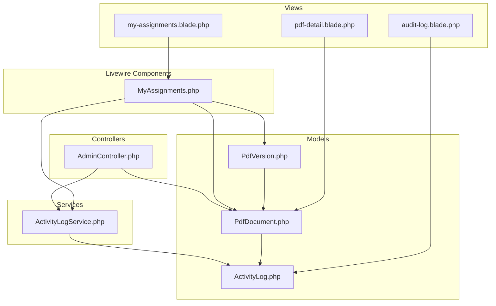
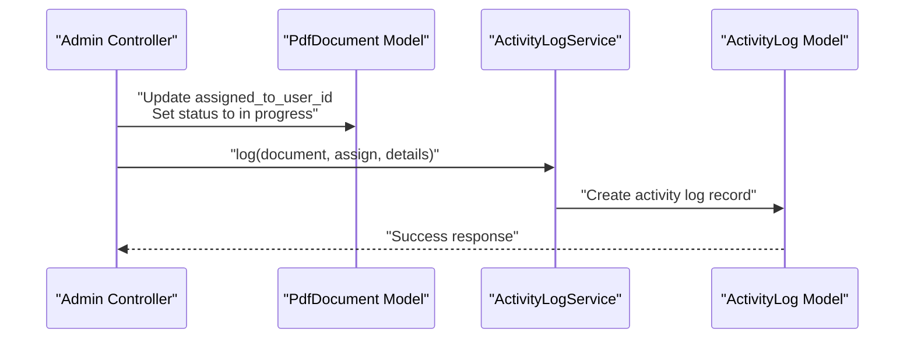
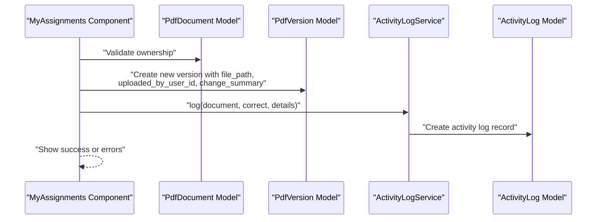
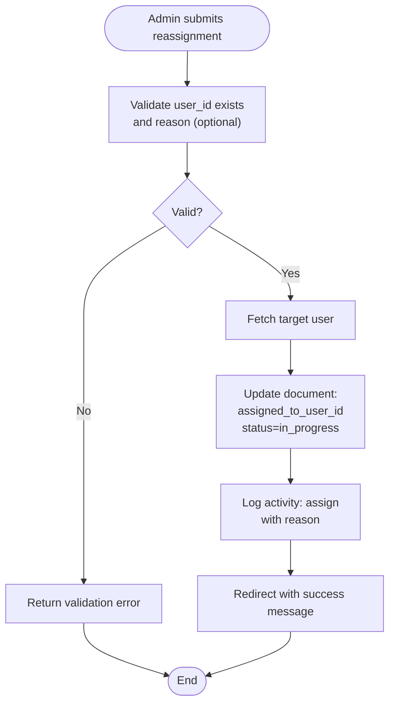
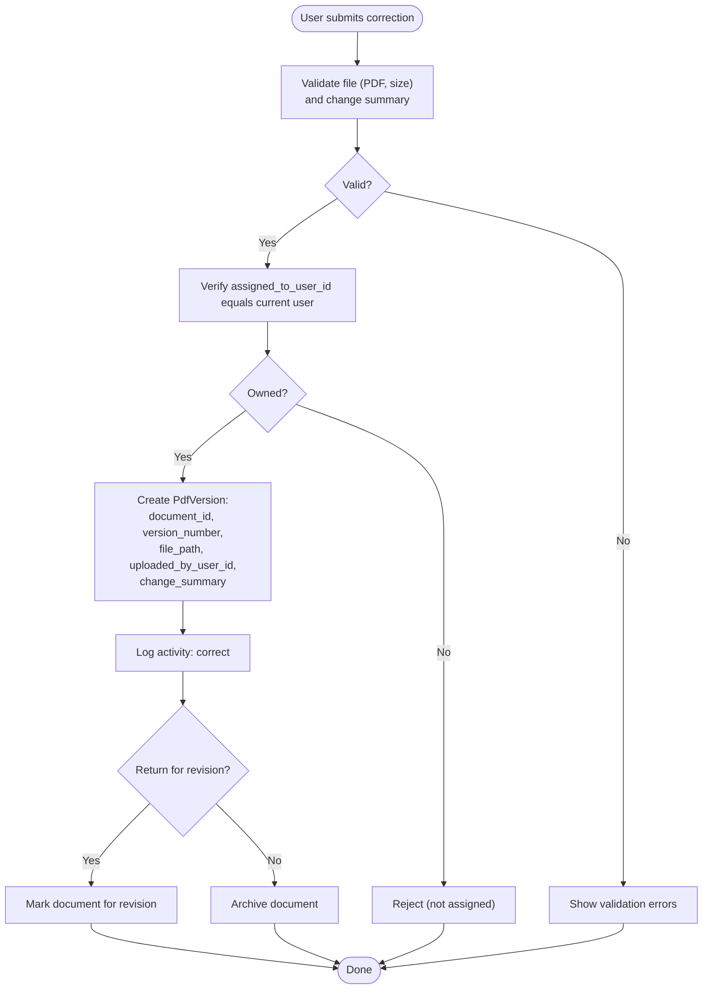
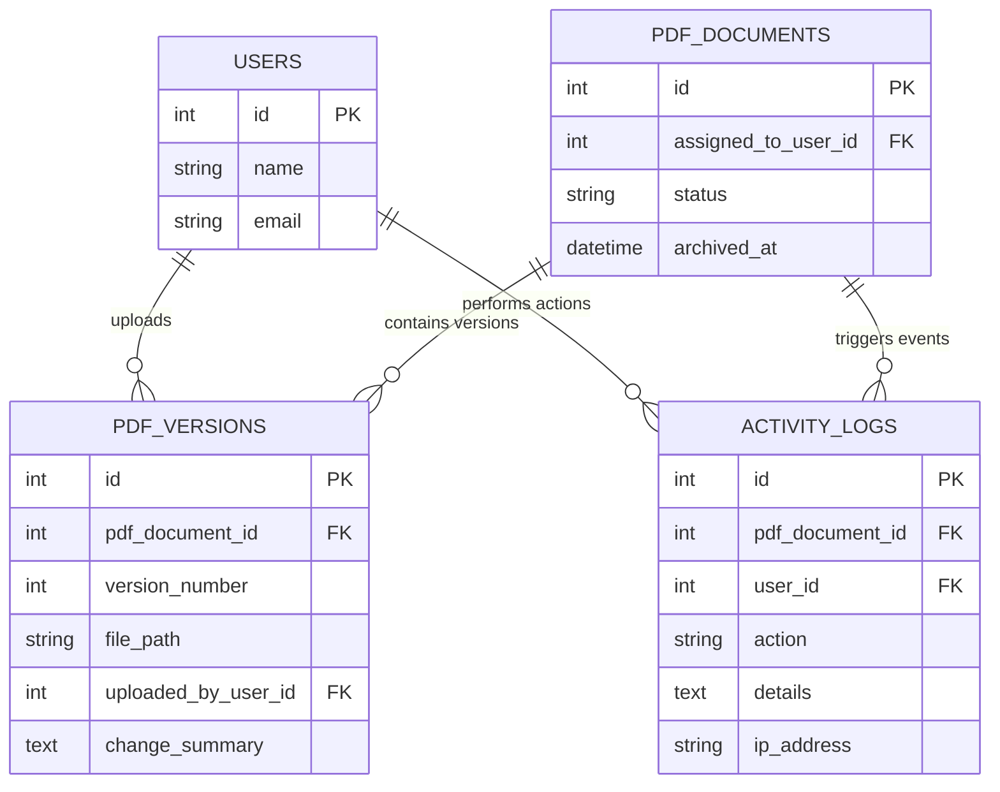
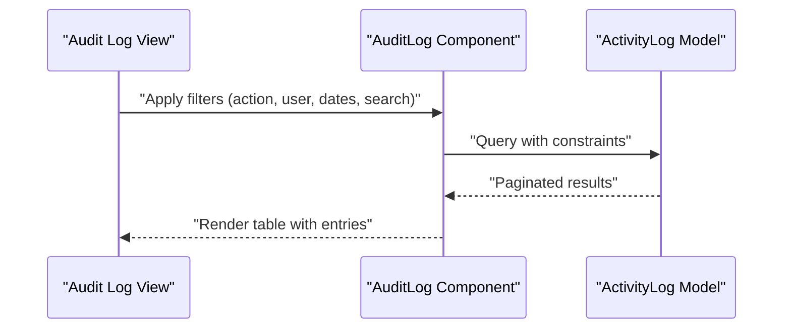
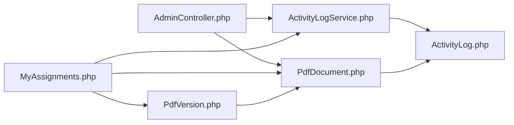

# Assignment Modification

<cite>
**Referenced Files in This Document**
- [AdminController.php](file://app/Http/Controllers/AdminController.php)
- [MyAssignments.php](file://app/Livewire/MyAssignments.php)
- [PdfDocument.php](file://app/Models/PdfDocument.php)
- [PdfVersion.php](file://app/Models/PdfVersion.php)
- [ActivityLog.php](file://app/Models/ActivityLog.php)
- [ActivityLogService.php](file://app/Services/ActivityLogService.php)
- [2024_06_10_120000_create_pdf_documents_table.php](file://database/migrations/2024_06_10_120000_create_pdf_documents_table.php)
- [2024_06_10_130000_create_pdf_versions_table.php](file://database/migrations/2024_06_10_130000_create_pdf_versions_table.php)
- [2024_06_10_140000_create_activity_logs_table.php](file://database/migrations/2024_06_10_140000_create_activity_logs_table.php)
- [audit-log.blade.php](file://resources/views/livewire/admin/audit-log.blade.php)
- [my-assignments.blade.php](file://resources/views/livewire/my-assignments.blade.php)
- [pdf-detail.blade.php](file://resources/views/livewire/pdf-detail.blade.php)
</cite>

## Table of Contents
1. [Introduction](#introduction)
2. [Project Structure](#project-structure)
3. [Core Components](#core-components)
4. [Architecture Overview](#architecture-overview)
5. [Detailed Component Analysis](#detailed-component-analysis)
6. [Dependency Analysis](#dependency-analysis)
7. [Performance Considerations](#performance-considerations)
8. [Troubleshooting Guide](#troubleshooting-guide)
9. [Conclusion](#conclusion)

## Introduction
This document explains how assignment modification works in the system, focusing on:
- Modifying assignments after creation (user reassignment and deadline changes)
- Validation logic and approval workflows
- Reassignment process and its impact on document versions
- Bulk assignment modification operations and use cases
- Change history tracking and audit trails
- Conflict resolution and data consistency
- User interface components for assignment modification actions

The system supports administrative reassignment of PDF documents to different users, correction uploads by assigned users, and comprehensive audit logging for all changes.

## Project Structure
Assignment modification spans controllers, Livewire components, models, services, and views:
- Controllers handle administrative reassignment requests
- Livewire components manage user-side correction uploads and assignment lists
- Models define document, version, and activity log structures
- Services centralize audit logging
- Views provide UI for modification actions and audit inspection

**Diagram sources**
- [AdminController.php:42-61](file://app/Http/Controllers/AdminController.php#L42-L61)
- [MyAssignments.php:1-48](file://app/Livewire/MyAssignments.php#L1-L48)
- [PdfDocument.php:94-129](file://app/Models/PdfDocument.php#L94-L129)
- [PdfVersion.php:1-42](file://app/Models/PdfVersion.php#L1-L42)
- [ActivityLog.php:1-59](file://app/Models/ActivityLog.php#L1-L59)
- [ActivityLogService.php:1-30](file://app/Services/ActivityLogService.php#L1-L30)
- [audit-log.blade.php:1-67](file://resources/views/livewire/admin/audit-log.blade.php#L1-L67)
- [my-assignments.blade.php:96-118](file://resources/views/livewire/my-assignments.blade.php#L96-L118)
- [pdf-detail.blade.php](file://resources/views/livewire/pdf-detail.blade.php)

**Section sources**
- [AdminController.php:42-61](file://app/Http/Controllers/AdminController.php#L42-L61)
- [MyAssignments.php:1-48](file://app/Livewire/MyAssignments.php#L1-L48)
- [PdfDocument.php:94-129](file://app/Models/PdfDocument.php#L94-L129)
- [PdfVersion.php:1-42](file://app/Models/PdfVersion.php#L1-L42)
- [ActivityLog.php:1-59](file://app/Models/ActivityLog.php#L1-L59)
- [ActivityLogService.php:1-30](file://app/Services/ActivityLogService.php#L1-L30)
- [audit-log.blade.php:1-67](file://resources/views/livewire/admin/audit-log.blade.php#L1-L67)
- [my-assignments.blade.php:96-118](file://resources/views/livewire/my-assignments.blade.php#L96-L118)
- [pdf-detail.blade.php](file://resources/views/livewire/pdf-detail.blade.php)

## Core Components
- Administrative reassignment controller: Validates target user and updates document assignment and status, then logs the action.
- User correction upload component: Handles PDF upload, change summary, and optional revision return flag; enforces ownership validation.
- Document model: Provides helpers for status labeling and assignment state.
- Version model: Stores document versions with metadata and file paths.
- Activity log service and model: Centralizes logging and provides human-readable labels.
- Audit log view: Filters and displays activity logs for compliance and oversight.

Key implementation references:
- [AdminController.php:42-61](file://app/Http/Controllers/AdminController.php#L42-L61)
- [MyAssignments.php:1-48](file://app/Livewire/MyAssignments.php#L1-L48)
- [PdfDocument.php:94-129](file://app/Models/PdfDocument.php#L94-L129)
- [PdfVersion.php:1-42](file://app/Models/PdfVersion.php#L1-L42)
- [ActivityLog.php:1-59](file://app/Models/ActivityLog.php#L1-L59)
- [ActivityLogService.php:1-30](file://app/Services/ActivityLogService.php#L1-L30)

**Section sources**
- [AdminController.php:42-61](file://app/Http/Controllers/AdminController.php#L42-L61)
- [MyAssignments.php:1-48](file://app/Livewire/MyAssignments.php#L1-L48)
- [PdfDocument.php:94-129](file://app/Models/PdfDocument.php#L94-L129)
- [PdfVersion.php:1-42](file://app/Models/PdfVersion.php#L1-L42)
- [ActivityLog.php:1-59](file://app/Models/ActivityLog.php#L1-L59)
- [ActivityLogService.php:1-30](file://app/Services/ActivityLogService.php#L1-L30)

## Architecture Overview
Assignment modification involves two primary flows:
- Administrative reassignment: Admin selects a user and optionally provides a reason; the system updates the document assignment and status and records an audit event.
- User correction upload: An assigned user uploads a corrected PDF, adds a change summary, and can opt to return the document for further revision instead of archiving.

**Diagram sources**
- [AdminController.php:42-61](file://app/Http/Controllers/AdminController.php#L42-L61)
- [ActivityLogService.php:20-29](file://app/Services/ActivityLogService.php#L20-L29)
- [ActivityLog.php:21-27](file://app/Models/ActivityLog.php#L21-L27)

**Diagram sources**
- [MyAssignments.php:42-48](file://app/Livewire/MyAssignments.php#L42-L48)
- [PdfVersion.php:13-19](file://app/Models/PdfVersion.php#L13-L19)
- [ActivityLogService.php:20-29](file://app/Services/ActivityLogService.php#L20-L29)
- [ActivityLog.php:21-27](file://app/Models/ActivityLog.php#L21-L27)

## Detailed Component Analysis

### Administrative Reassignment Workflow
Administrative reassignment updates the assigned user and status, then logs the action with a reason.

Processing logic:
- Validate incoming request for target user existence and optional reason
- Fetch target user and update document assignment and status
- Log the action with details including reason
- Return success feedback

**Diagram sources**
- [AdminController.php:42-61](file://app/Http/Controllers/AdminController.php#L42-L61)
- [ActivityLogService.php:20-29](file://app/Services/ActivityLogService.php#L20-L29)

**Section sources**
- [AdminController.php:42-61](file://app/Http/Controllers/AdminController.php#L42-L61)

### User Correction Upload and Versioning
Assigned users can upload corrected PDFs, which become new versions while preserving prior versions.

Processing logic:
- Validate file type and size, and optional change summary
- Ensure the current user owns the assignment
- Persist new version with metadata
- Log the correction action
- Optionally mark for revision instead of archiving

**Diagram sources**
- [MyAssignments.php:26-48](file://app/Livewire/MyAssignments.php#L26-L48)
- [PdfVersion.php:13-19](file://app/Models/PdfVersion.php#L13-L19)
- [ActivityLogService.php:20-29](file://app/Services/ActivityLogService.php#L20-L29)

**Section sources**
- [MyAssignments.php:26-48](file://app/Livewire/MyAssignments.php#L26-L48)
- [PdfVersion.php:13-19](file://app/Models/PdfVersion.php#L13-L19)

### Data Models and Relationships
The assignment modification system relies on three core models with clear relationships and constraints.

**Diagram sources**
- [2024_06_10_120000_create_pdf_documents_table.php](file://database/migrations/2024_06_10_120000_create_pdf_documents_table.php)
- [2024_06_10_130000_create_pdf_versions_table.php:11-21](file://database/migrations/2024_06_10_130000_create_pdf_versions_table.php#L11-L21)
- [2024_06_10_140000_create_activity_logs_table.php:11-19](file://database/migrations/2024_06_10_140000_create_activity_logs_table.php#L11-L19)
- [PdfDocument.php:94-129](file://app/Models/PdfDocument.php#L94-L129)
- [PdfVersion.php:28-36](file://app/Models/PdfVersion.php#L28-L36)
- [ActivityLog.php:36-44](file://app/Models/ActivityLog.php#L36-L44)

**Section sources**
- [2024_06_10_120000_create_pdf_documents_table.php](file://database/migrations/2024_06_10_120000_create_pdf_documents_table.php)
- [2024_06_10_130000_create_pdf_versions_table.php:11-21](file://database/migrations/2024_06_10_130000_create_pdf_versions_table.php#L11-L21)
- [2024_06_10_140000_create_activity_logs_table.php:11-19](file://database/migrations/2024_06_10_140000_create_activity_logs_table.php#L11-L19)
- [PdfDocument.php:94-129](file://app/Models/PdfDocument.php#L94-L129)
- [PdfVersion.php:28-36](file://app/Models/PdfVersion.php#L28-L36)
- [ActivityLog.php:36-44](file://app/Models/ActivityLog.php#L36-L44)

### Audit Trail and Compliance
The system maintains a centralized audit trail for all actions, enabling filtering by action type, user, date range, and free-text search.

Key capabilities:
- Filter by action type and user
- Date range selection
- Free-text search within details
- Pagination and responsive display

**Diagram sources**
- [audit-log.blade.php:23-52](file://resources/views/livewire/admin/audit-log.blade.php#L23-L52)
- [ActivityLog.php:46-58](file://app/Models/ActivityLog.php#L46-L58)

**Section sources**
- [audit-log.blade.php:1-67](file://resources/views/livewire/admin/audit-log.blade.php#L1-L67)
- [ActivityLog.php:1-59](file://app/Models/ActivityLog.php#L1-L59)

### User Interface Components for Assignment Modification
- Administrative reassignment: Admin selects a user and optionally provides a reason; submission triggers server-side update and logging.
- User correction upload: Assigned users can open a correction panel, select a PDF, enter a change summary, and choose whether to return for revision.
- Audit log: Administrators can inspect all actions performed on documents and system-wide.

UI references:
- [my-assignments.blade.php:96-118](file://resources/views/livewire/my-assignments.blade.php#L96-L118)
- [audit-log.blade.php:1-67](file://resources/views/livewire/admin/audit-log.blade.php#L1-L67)

**Section sources**
- [my-assignments.blade.php:96-118](file://resources/views/livewire/my-assignments.blade.php#L96-L118)
- [audit-log.blade.php:1-67](file://resources/views/livewire/admin/audit-log.blade.php#L1-L67)

## Dependency Analysis
Assignment modification depends on:
- Controllers depend on models and services for persistence and logging
- Livewire components depend on models for data access and on services for audit logging
- Views depend on components and models for rendering and filtering
- Database migrations define referential integrity and uniqueness constraints

**Diagram sources**
- [AdminController.php:42-61](file://app/Http/Controllers/AdminController.php#L42-L61)
- [MyAssignments.php:1-48](file://app/Livewire/MyAssignments.php#L1-L48)
- [PdfDocument.php:94-129](file://app/Models/PdfDocument.php#L94-L129)
- [PdfVersion.php:1-42](file://app/Models/PdfVersion.php#L1-L42)
- [ActivityLog.php:1-59](file://app/Models/ActivityLog.php#L1-L59)
- [ActivityLogService.php:1-30](file://app/Services/ActivityLogService.php#L1-L30)

**Section sources**
- [AdminController.php:42-61](file://app/Http/Controllers/AdminController.php#L42-L61)
- [MyAssignments.php:1-48](file://app/Livewire/MyAssignments.php#L1-L48)
- [PdfDocument.php:94-129](file://app/Models/PdfDocument.php#L94-L129)
- [PdfVersion.php:1-42](file://app/Models/PdfVersion.php#L1-L42)
- [ActivityLog.php:1-59](file://app/Models/ActivityLog.php#L1-L59)
- [ActivityLogService.php:1-30](file://app/Services/ActivityLogService.php#L1-L30)

## Performance Considerations
- Use pagination for audit logs to avoid large result sets
- Validate file sizes early to prevent unnecessary uploads
- Keep change summaries concise to reduce storage overhead
- Index frequently filtered columns (user_id, action, created_at) in the activity logs table

## Troubleshooting Guide
Common issues and resolutions:
- Ownership validation fails: Ensure the current user matches the document’s assigned user before allowing corrections
- Duplicate version number: Enforce unique version numbers per document via database constraints
- Missing audit entries: Verify logging service is invoked on all modification paths
- Large file uploads: Confirm server limits and client-side validation align with configured maximums

**Section sources**
- [MyAssignments.php:42-48](file://app/Livewire/MyAssignments.php#L42-L48)
- [2024_06_10_130000_create_pdf_versions_table.php:20-21](file://database/migrations/2024_06_10_130000_create_pdf_versions_table.php#L20-L21)
- [ActivityLogService.php:20-29](file://app/Services/ActivityLogService.php#L20-L29)

## Conclusion
Assignment modification in the system is centered around secure, auditable operations:
- Administrative reassignment updates assignment and status with clear logging
- User corrections create new versions while maintaining historical traceability
- Comprehensive audit logs enable compliance and oversight
- UI components provide intuitive controls for modification actions

These mechanisms collectively ensure data consistency, transparency, and operational control over document assignments and corrections.