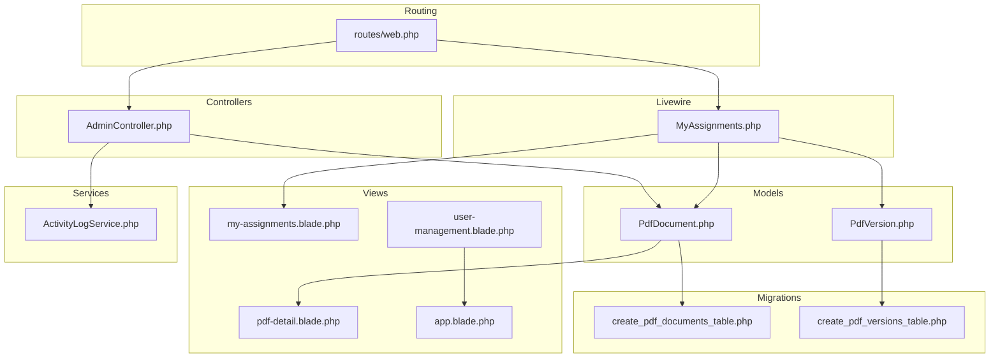
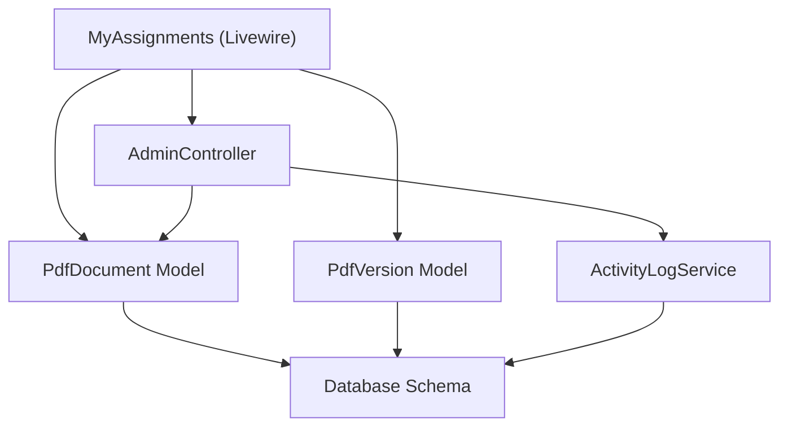
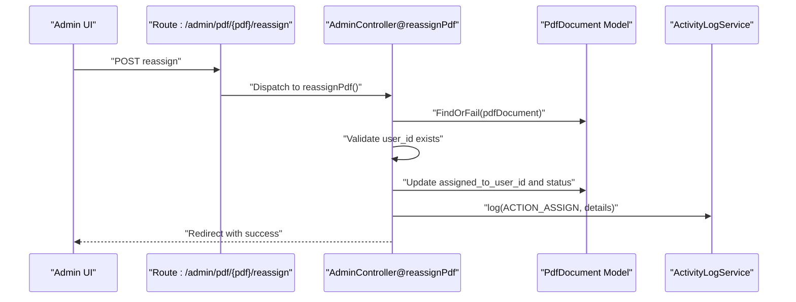
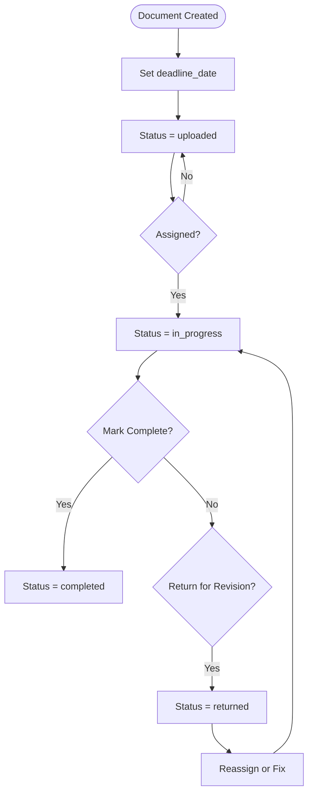
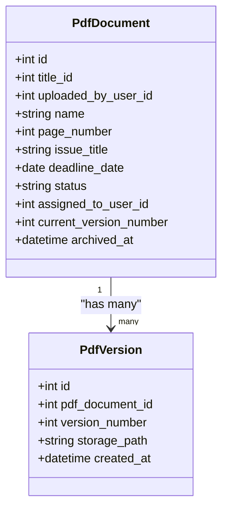
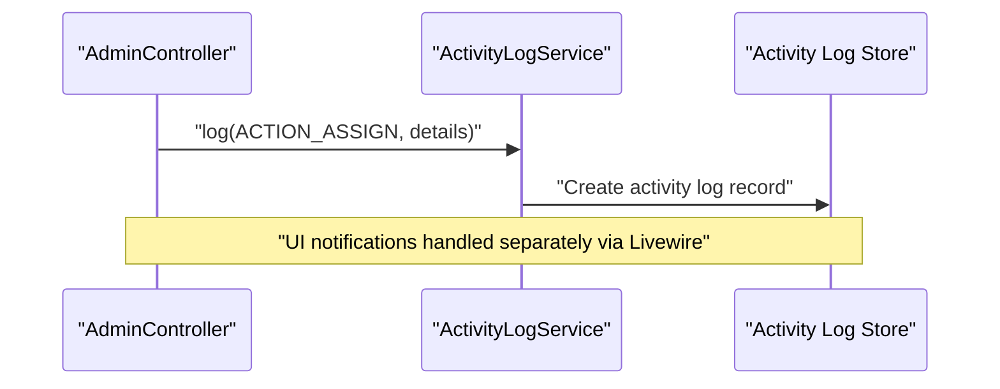
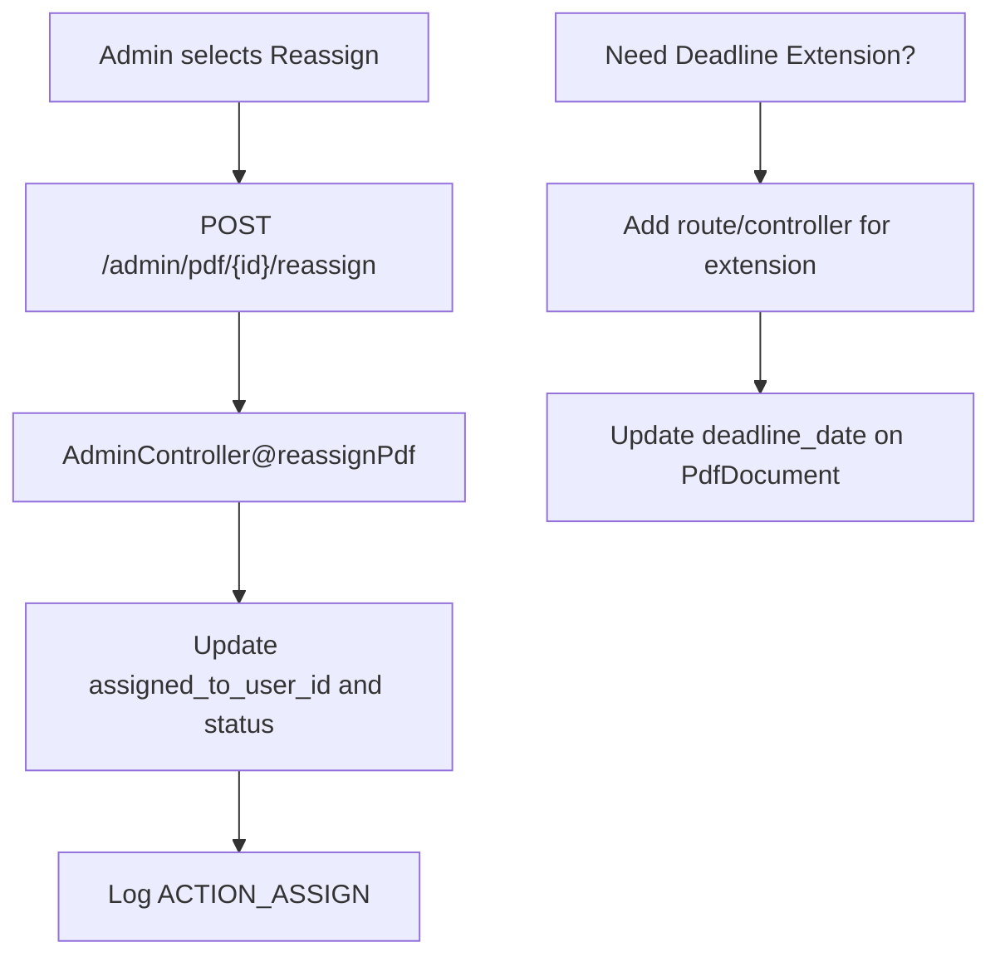
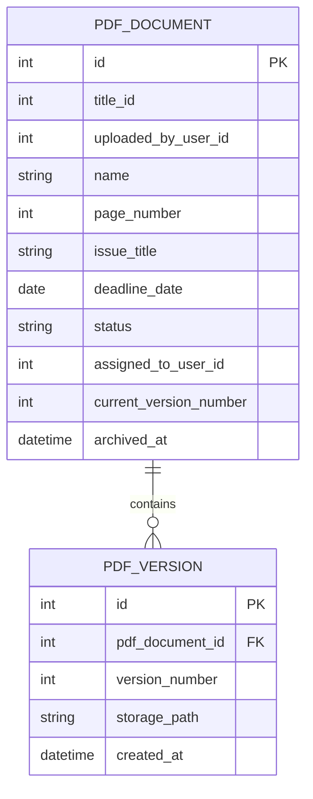
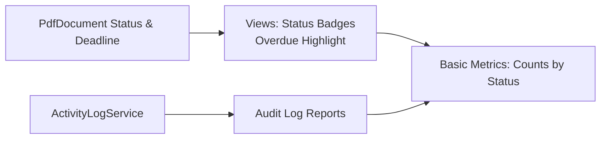
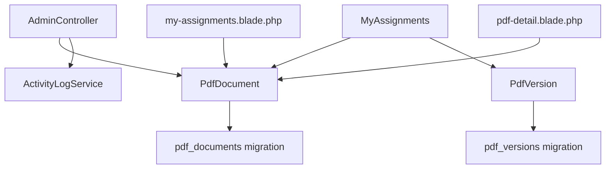

# Assignment System

<cite>
**Referenced Files in This Document**
- [web.php](file://routes/web.php)
- [AdminController.php](file://app/Http/Controllers/AdminController.php)
- [MyAssignments.php](file://app/Livewire/MyAssignments.php)
- [PdfDocument.php](file://app/Models/PdfDocument.php)
- [PdfVersion.php](file://app/Models/PdfVersion.php)
- [ActivityLogService.php](file://app/Services/ActivityLogService.php)
- [create_pdf_documents_table.php](file://database/migrations/2024_06_10_120000_create_pdf_documents_table.php)
- [create_pdf_versions_table.php](file://database/migrations/2024_06_10_130000_create_pdf_versions_table.php)
- [pdf-detail.blade.php](file://resources/views/livewire/pdf-detail.blade.php)
- [my-assignments.blade.php](file://resources/views/livewire/my-assignments.blade.php)
- [user-management.blade.php](file://resources/views/livewire/admin/user-management.blade.php)
- [app.blade.php](file://resources/views/layouts/app.blade.php)
</cite>

## Table of Contents
1. [Introduction](#introduction)
2. [Project Structure](#project-structure)
3. [Core Components](#core-components)
4. [Architecture Overview](#architecture-overview)
5. [Detailed Component Analysis](#detailed-component-analysis)
6. [Dependency Analysis](#dependency-analysis)
7. [Performance Considerations](#performance-considerations)
8. [Troubleshooting Guide](#troubleshooting-guide)
9. [Conclusion](#conclusion)

## Introduction
This document describes the assignment system for the PDF correction workflow. It explains how administrators assign documents to users, manage deadlines and priorities, track progress, notify users, modify assignments, relate assignments to document versions, support bulk operations, and provide reporting/analytics. The system is built with Laravel and Livewire, integrating controllers, models, services, and Blade views.

## Project Structure
The assignment system spans routing, controllers, Livewire components, models, migrations, and views:
- Routes define admin actions for release and reassign, and a user-facing assignment page.
- Controllers handle administrative assignment operations and logging.
- Livewire components implement user interactions for corrections and assignment lists.
- Models encapsulate document and version data with status and deadlines.
- Migrations define the database schema for documents and versions.
- Views render status, deadlines, and assignment-related UI.

**Diagram sources**
- [web.php:35-53](file://routes/web.php#L35-L53)
- [AdminController.php:42-61](file://app/Http/Controllers/AdminController.php#L42-L61)
- [MyAssignments.php:1-48](file://app/Livewire/MyAssignments.php#L1-L48)
- [PdfDocument.php:1-53](file://app/Models/PdfDocument.php#L1-L53)
- [PdfVersion.php](file://app/Models/PdfVersion.php)
- [create_pdf_documents_table.php:1-31](file://database/migrations/2024_06_10_120000_create_pdf_documents_table.php#L1-L31)
- [create_pdf_versions_table.php](file://database/migrations/2024_06_10_130000_create_pdf_versions_table.php)
- [pdf-detail.blade.php:21-46](file://resources/views/livewire/pdf-detail.blade.php#L21-L46)
- [my-assignments.blade.php:118-134](file://resources/views/livewire/my-assignments.blade.php#L118-L134)
- [user-management.blade.php:1-26](file://resources/views/livewire/admin/user-management.blade.php#L1-L26)
- [app.blade.php:33-56](file://resources/views/layouts/app.blade.php#L33-L56)
- [ActivityLogService.php:1-30](file://app/Services/ActivityLogService.php#L1-L30)

**Section sources**
- [web.php:35-53](file://routes/web.php#L35-L53)
- [PdfDocument.php:1-53](file://app/Models/PdfDocument.php#L1-L53)
- [PdfVersion.php](file://app/Models/PdfVersion.php)
- [create_pdf_documents_table.php:1-31](file://database/migrations/2024_06_10_120000_create_pdf_documents_table.php#L1-L31)
- [create_pdf_versions_table.php](file://database/migrations/2024_06_10_130000_create_pdf_versions_table.php)

## Core Components
- Administrative assignment controller: Handles reassignment and release actions, updates document status, and logs activities.
- User assignment interface: Allows users to upload corrected versions, mark return for revision, and view their assigned documents.
- Document model: Stores metadata, status, deadline, current version number, and assignment relationship.
- Version model: Represents document versions; integrates with assignment progress.
- Activity logging service: Centralized logging for assignment, correction, and other actions.
- Routing: Exposes admin endpoints for reassignment/release and a user route for assignments.

Key implementation references:
- Reassignment endpoint and handler: [web.php:50-51](file://routes/web.php#L50-L51), [AdminController.php:42-61](file://app/Http/Controllers/AdminController.php#L42-L61)
- User assignment page and correction submission: [MyAssignments.php:31-48](file://app/Livewire/MyAssignments.php#L31-L48)
- Document model fields and relations: [PdfDocument.php:14-39](file://app/Models/PdfDocument.php#L14-L39), [create_pdf_documents_table.php:11-24](file://database/migrations/2024_06_10_120000_create_pdf_documents_table.php#L11-L24)
- Version model: [PdfVersion.php](file://app/Models/PdfVersion.php)
- Activity logging constants and method: [ActivityLogService.php:12-29](file://app/Services/ActivityLogService.php#L12-L29)

**Section sources**
- [web.php:35-53](file://routes/web.php#L35-L53)
- [AdminController.php:42-61](file://app/Http/Controllers/AdminController.php#L42-L61)
- [MyAssignments.php:1-48](file://app/Livewire/MyAssignments.php#L1-L48)
- [PdfDocument.php:14-39](file://app/Models/PdfDocument.php#L14-L39)
- [PdfVersion.php](file://app/Models/PdfVersion.php)
- [ActivityLogService.php:12-29](file://app/Services/ActivityLogService.php#L12-L29)

## Architecture Overview
The assignment system follows a layered architecture:
- Presentation: Livewire components and Blade templates for admin and user views.
- Application: Controllers and services orchestrate business logic.
- Domain: Models encapsulate domain entities and relationships.
- Persistence: Migrations define schema for documents and versions.

**Diagram sources**
- [MyAssignments.php:1-48](file://app/Livewire/MyAssignments.php#L1-L48)
- [AdminController.php:42-61](file://app/Http/Controllers/AdminController.php#L42-L61)
- [PdfDocument.php:1-53](file://app/Models/PdfDocument.php#L1-L53)
- [PdfVersion.php](file://app/Models/PdfVersion.php)
- [ActivityLogService.php:1-30](file://app/Services/ActivityLogService.php#L1-L30)
- [create_pdf_documents_table.php:11-24](file://database/migrations/2024_06_10_120000_create_pdf_documents_table.php#L11-L24)
- [create_pdf_versions_table.php](file://database/migrations/2024_06_10_130000_create_pdf_versions_table.php)

## Detailed Component Analysis

### Task Assignment Logic (Administrators)
Administrators can assign or reassign documents to users via admin routes. The process:
- Validates the target user exists.
- Updates the document’s assigned user and status to in-progress.
- Logs the assignment action with optional reason.

**Diagram sources**
- [web.php:50-51](file://routes/web.php#L50-L51)
- [AdminController.php:42-61](file://app/Http/Controllers/AdminController.php#L42-L61)
- [ActivityLogService.php:20-29](file://app/Services/ActivityLogService.php#L20-L29)

**Section sources**
- [web.php:43-52](file://routes/web.php#L43-L52)
- [AdminController.php:42-61](file://app/Http/Controllers/AdminController.php#L42-L61)
- [ActivityLogService.php:12-29](file://app/Services/ActivityLogService.php#L12-L29)

### Deadline Management and Priority Handling
- Deadline storage: Documents store a deadline date field.
- Status lifecycle: Documents cycle through uploaded, in_progress, returned, completed.
- Priority: No explicit priority field is present in the document schema; priority handling would require extending the schema and UI.

**Diagram sources**
- [create_pdf_documents_table.php:18-19](file://database/migrations/2024_06_10_120000_create_pdf_documents_table.php#L18-L19)
- [PdfDocument.php:14-17](file://app/Models/PdfDocument.php#L14-L17)

**Section sources**
- [create_pdf_documents_table.php:18-19](file://database/migrations/2024_06_10_120000_create_pdf_documents_table.php#L18-L19)
- [PdfDocument.php:14-17](file://app/Models/PdfDocument.php#L14-L17)

### Progress Tracking and Completion Metrics
- Current version tracking: Documents maintain a current version number.
- UI indicators: Views display status badges and deadlines, highlighting overdue items.
- Assignment list: Users see deadlines and current version numbers for their assignments.

**Diagram sources**
- [PdfDocument.php:19-30](file://app/Models/PdfDocument.php#L19-L30)
- [PdfVersion.php](file://app/Models/PdfVersion.php)
- [create_pdf_documents_table.php](file://database/migrations/2024_06_10_120000_create_pdf_documents_table.php#L21)
- [create_pdf_versions_table.php](file://database/migrations/2024_06_10_130000_create_pdf_versions_table.php)

**Section sources**
- [my-assignments.blade.php:128-133](file://resources/views/livewire/my-assignments.blade.php#L128-L133)
- [pdf-detail.blade.php:30-33](file://resources/views/livewire/pdf-detail.blade.php#L30-L33)
- [PdfDocument.php:21-21](file://app/Models/PdfDocument.php#L21-L21)

### Notification System for New Assignments
- Activity logging: The system logs assignment actions with IP and user context.
- UI notifications: Livewire components dispatch notifications for user feedback (e.g., role updates).
- Email notifications: Not implemented in the provided code; administrators could extend logging or add mail notifications.

**Diagram sources**
- [ActivityLogService.php:20-29](file://app/Services/ActivityLogService.php#L20-L29)
- [AdminController.php:53-57](file://app/Http/Controllers/AdminController.php#L53-L57)

**Section sources**
- [ActivityLogService.php:12-29](file://app/Services/ActivityLogService.php#L12-L29)
- [AdminController.php:53-57](file://app/Http/Controllers/AdminController.php#L53-L57)

### Assignment Modification (Reassignment and Extensions)
- Reassignment: Admins can reassign documents to another user, updating status to in-progress.
- Deadline extensions: No dedicated extension endpoint is present; extending deadlines would require adding a route/controller method and updating the deadline_date field.

**Diagram sources**
- [web.php:50-51](file://routes/web.php#L50-L51)
- [AdminController.php:42-61](file://app/Http/Controllers/AdminController.php#L42-L61)
- [ActivityLogService.php](file://app/Services/ActivityLogService.php#L13)

**Section sources**
- [web.php:50-51](file://routes/web.php#L50-L51)
- [AdminController.php:42-61](file://app/Http/Controllers/AdminController.php#L42-L61)

### Relationship Between Assignments and Document Versions
- Each document maintains a current version number.
- Versions are stored as separate records linked to the document.
- Corrections increment version numbers and create new versions.

**Diagram sources**
- [create_pdf_documents_table.php:11-24](file://database/migrations/2024_06_10_120000_create_pdf_documents_table.php#L11-L24)
- [create_pdf_versions_table.php](file://database/migrations/2024_06_10_130000_create_pdf_versions_table.php)

**Section sources**
- [PdfDocument.php:21-21](file://app/Models/PdfDocument.php#L21-L21)
- [PdfVersion.php](file://app/Models/PdfVersion.php)

### Bulk Assignment Operations and Mass Workflows
- No explicit bulk assignment endpoints are present in the routes.
- Mass workflows can be implemented by adding batch endpoints in the admin controller and iterating over selected documents.

[No sources needed since this section proposes future enhancements not present in the codebase]

### Assignment Reporting and Analytics
- Status badges and overdue indicators are rendered in views.
- Audit logging captures assignment actions for review.
- Additional analytics (e.g., assignment counts per user, overdue metrics) can be derived from activity logs and document statuses.

**Diagram sources**
- [pdf-detail.blade.php:30-33](file://resources/views/livewire/pdf-detail.blade.php#L30-L33)
- [my-assignments.blade.php:128-133](file://resources/views/livewire/my-assignments.blade.php#L128-L133)
- [ActivityLogService.php:20-29](file://app/Services/ActivityLogService.php#L20-L29)

**Section sources**
- [pdf-detail.blade.php:30-33](file://resources/views/livewire/pdf-detail.blade.php#L30-L33)
- [my-assignments.blade.php:128-133](file://resources/views/livewire/my-assignments.blade.php#L128-L133)
- [ActivityLogService.php:20-29](file://app/Services/ActivityLogService.php#L20-L29)

## Dependency Analysis
- Controllers depend on models and services for persistence and logging.
- Livewire components depend on models for rendering and validation rules.
- Views depend on models for data display and status rendering.
- Migrations define foreign keys and constraints linking documents to users and versions.

**Diagram sources**
- [AdminController.php:42-61](file://app/Http/Controllers/AdminController.php#L42-L61)
- [MyAssignments.php:1-48](file://app/Livewire/MyAssignments.php#L1-L48)
- [PdfDocument.php:1-53](file://app/Models/PdfDocument.php#L1-L53)
- [PdfVersion.php](file://app/Models/PdfVersion.php)
- [create_pdf_documents_table.php:11-24](file://database/migrations/2024_06_10_120000_create_pdf_documents_table.php#L11-L24)
- [create_pdf_versions_table.php](file://database/migrations/2024_06_10_130000_create_pdf_versions_table.php)
- [my-assignments.blade.php:128-133](file://resources/views/livewire/my-assignments.blade.php#L128-L133)
- [pdf-detail.blade.php:30-33](file://resources/views/livewire/pdf-detail.blade.php#L30-L33)

**Section sources**
- [web.php:35-53](file://routes/web.php#L35-L53)
- [PdfDocument.php:1-53](file://app/Models/PdfDocument.php#L1-L53)
- [PdfVersion.php](file://app/Models/PdfVersion.php)
- [create_pdf_documents_table.php:11-24](file://database/migrations/2024_06_10_120000_create_pdf_documents_table.php#L11-L24)
- [create_pdf_versions_table.php](file://database/migrations/2024_06_10_130000_create_pdf_versions_table.php)

## Performance Considerations
- Pagination: Livewire components use pagination to limit result sets for large assignment lists.
- Indexing: Consider adding database indexes on frequently filtered columns (e.g., assigned_to_user_id, status, deadline_date).
- View rendering: Blade templates compute overdue status client-side; keep computations lightweight.
- Logging volume: Activity logs grow with operations; consider retention policies.

[No sources needed since this section provides general guidance]

## Troubleshooting Guide
- Reassignment errors: Ensure the target user exists and the document ID is valid.
- Correction submission failures: Verify the authenticated user matches the assigned user and file validation passes.
- Overdue displays: Confirm deadline_date casting and status comparisons in views.
- Admin navigation: Use the admin dropdown menu to access user management and audit log pages.

**Section sources**
- [web.php:43-52](file://routes/web.php#L43-L52)
- [MyAssignments.php:42-48](file://app/Livewire/MyAssignments.php#L42-L48)
- [pdf-detail.blade.php:30-33](file://resources/views/livewire/pdf-detail.blade.php#L30-L33)
- [app.blade.php:33-39](file://resources/views/layouts/app.blade.php#L33-L39)

## Conclusion
The assignment system provides a solid foundation for assigning PDF documents to users, tracking progress via status and deadlines, and logging administrative actions. Administrators can reassign documents and update statuses, while users can upload corrected versions and view their assignments. Extending the system with deadline extensions, explicit priority fields, bulk operations, and email notifications would further enhance workflow management and reporting capabilities.