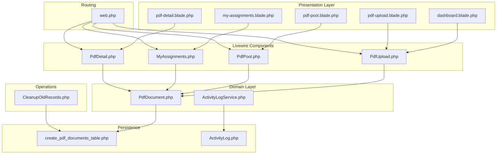
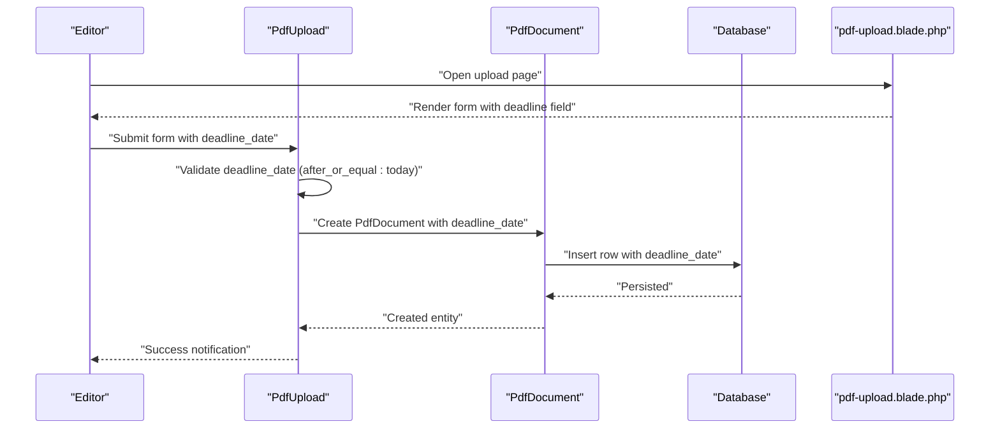
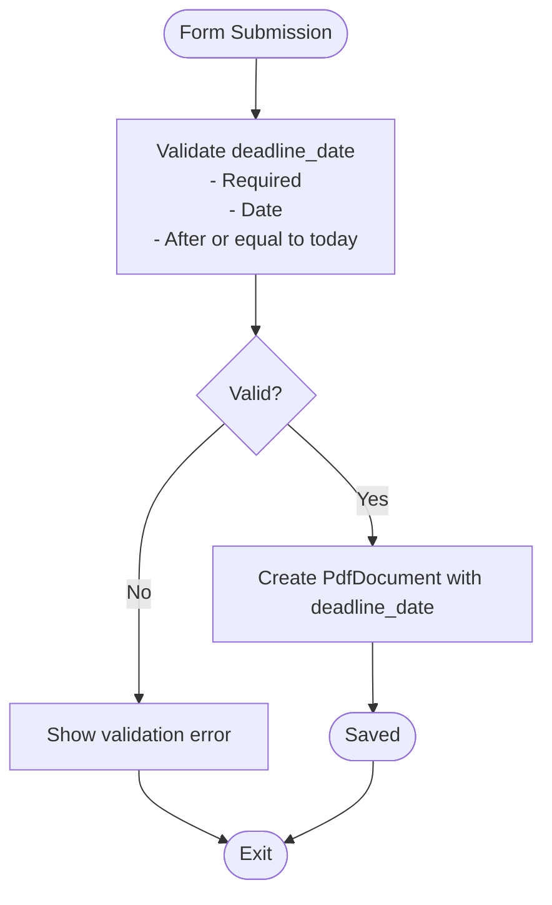
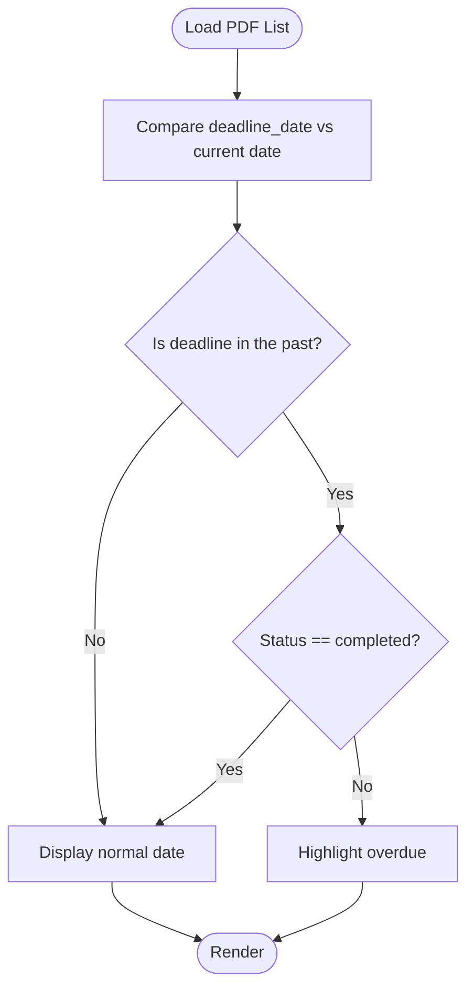
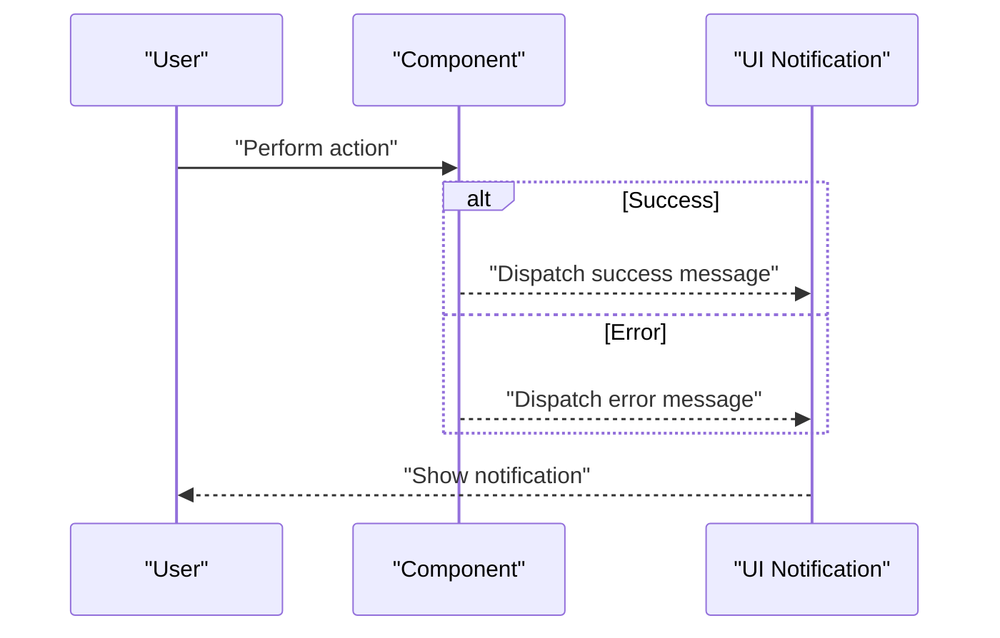
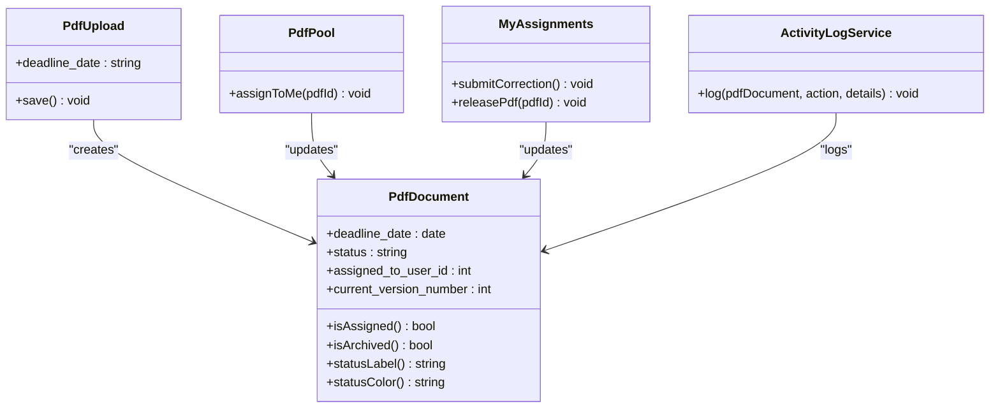

# Deadline Management

<cite>
**Referenced Files in This Document**
- [PdfUpload.php](file://app/Livewire/PdfUpload.php)
- [PdfPool.php](file://app/Livewire/PdfPool.php)
- [MyAssignments.php](file://app/Livewire/MyAssignments.php)
- [PdfDetail.php](file://app/Livewire/PdfDetail.php)
- [PdfDocument.php](file://app/Models/PdfDocument.php)
- [2024_06_10_120000_create_pdf_documents_table.php](file://database/migrations/2024_06_10_120000_create_pdf_documents_table.php)
- [dashboard.blade.php](file://resources/views/livewire/dashboard.blade.php)
- [my-assignments.blade.php](file://resources/views/livewire/my-assignments.blade.php)
- [pdf-detail.blade.php](file://resources/views/livewire/pdf-detail.blade.php)
- [pdf-pool.blade.php](file://resources/views/livewire/pdf-pool.blade.php)
- [pdf-upload.blade.php](file://resources/views/livewire/pdf-upload.blade.php)
- [web.php](file://routes/web.php)
- [CleanupOldRecords.php](file://app/Console/Commands/CleanupOldRecords.php)
- [ActivityLogService.php](file://app/Services/ActivityLogService.php)
- [ActivityLog.php](file://app/Models/ActivityLog.php)
</cite>

## Table of Contents
1. [Introduction](#introduction)
2. [Project Structure](#project-structure)
3. [Core Components](#core-components)
4. [Architecture Overview](#architecture-overview)
5. [Detailed Component Analysis](#detailed-component-analysis)
6. [Dependency Analysis](#dependency-analysis)
7. [Performance Considerations](#performance-considerations)
8. [Troubleshooting Guide](#troubleshooting-guide)
9. [Conclusion](#conclusion)
10. [Appendices](#appendices)

## Introduction
This document explains deadline management within the assignment system. It covers how deadlines are set during assignment creation, validated, and displayed; how they influence sorting and status visibility; and how the system detects expiration and supports administrative actions. It also outlines current workflows for deadline-related operations, noting areas where extensions and approvals are not yet implemented, and describes existing notification mechanisms and logging.

## Project Structure
The deadline management feature spans Livewire components, Eloquent models, Blade templates, migrations, routes, and console commands. Key areas:
- Creation and validation: Livewire PdfUpload component and form validation
- Assignment and display: Livewire PdfPool, MyAssignments, and PdfDetail
- Persistence: PdfDocument model and database migration
- Visibility and UX: Blade templates across dashboard, pool, assignments, and detail views
- Administrative controls: Routes and controller actions for release/reassign
- Logging and cleanup: ActivityLogService and CleanupOldRecords command



**Diagram sources**
- [PdfUpload.php:1-96](file://app/Livewire/PdfUpload.php#L1-L96)
- [PdfPool.php:1-67](file://app/Livewire/PdfPool.php#L1-L67)
- [MyAssignments.php:1-122](file://app/Livewire/MyAssignments.php#L1-L122)
- [PdfDetail.php:1-24](file://app/Livewire/PdfDetail.php#L1-L24)
- [PdfDocument.php:1-130](file://app/Models/PdfDocument.php#L1-L130)
- [2024_06_10_120000_create_pdf_documents_table.php:1-32](file://database/migrations/2024_06_10_120000_create_pdf_documents_table.php#L1-L32)
- [dashboard.blade.php](file://resources/views/livewire/dashboard.blade.php)
- [pdf-pool.blade.php](file://resources/views/livewire/pdf-pool.blade.php)
- [my-assignments.blade.php](file://resources/views/livewire/my-assignments.blade.php)
- [pdf-detail.blade.php](file://resources/views/livewire/pdf-detail.blade.php)
- [pdf-upload.blade.php](file://resources/views/livewire/pdf-upload.blade.php)
- [web.php:1-54](file://routes/web.php#L1-L54)
- [ActivityLogService.php:1-31](file://app/Services/ActivityLogService.php#L1-L31)
- [ActivityLog.php:1-60](file://app/Models/ActivityLog.php#L1-L60)
- [CleanupOldRecords.php:1-47](file://app/Console/Commands/CleanupOldRecords.php#L1-L47)

**Section sources**
- [web.php:1-54](file://routes/web.php#L1-L54)
- [PdfUpload.php:1-96](file://app/Livewire/PdfUpload.php#L1-L96)
- [PdfPool.php:1-67](file://app/Livewire/PdfPool.php#L1-L67)
- [MyAssignments.php:1-122](file://app/Livewire/MyAssignments.php#L1-L122)
- [PdfDetail.php:1-24](file://app/Livewire/PdfDetail.php#L1-L24)
- [PdfDocument.php:1-130](file://app/Models/PdfDocument.php#L1-L130)
- [2024_06_10_120000_create_pdf_documents_table.php:1-32](file://database/migrations/2024_06_10_120000_create_pdf_documents_table.php#L1-L32)

## Core Components
- Deadline storage and casting: The PdfDocument model defines deadline_date as a date cast and includes it in fillable attributes.
- Creation workflow: The PdfUpload component validates deadline_date and persists it along with other metadata.
- Assignment and sorting: MyAssignments and PdfPool order items by deadline_date ascending.
- Expiration display: Blade templates highlight past deadlines for overdue awareness.
- Administrative controls: Admin routes enable releasing or reassigning PDFs, affecting status and assignment.
- Logging: ActivityLogService records lifecycle events including upload, assign, release, and correction.

**Section sources**
- [PdfDocument.php:19-39](file://app/Models/PdfDocument.php#L19-L39)
- [PdfUpload.php:27-72](file://app/Livewire/PdfUpload.php#L27-L72)
- [MyAssignments.php:111-115](file://app/Livewire/MyAssignments.php#L111-L115)
- [PdfPool.php:43-58](file://app/Livewire/PdfPool.php#L43-L58)
- [pdf-detail.blade.php:29-31](file://resources/views/livewire/pdf-detail.blade.php#L29-L31)
- [pdf-pool.blade.php:23-37](file://resources/views/livewire/pdf-pool.blade.php#L23-L37)
- [web.php:43-52](file://routes/web.php#L43-L52)
- [ActivityLogService.php:20-29](file://app/Services/ActivityLogService.php#L20-L29)

## Architecture Overview
The deadline lifecycle integrates front-end forms, server-side validation, persistence, and presentation. Administrative actions modify status and assignment, while logging tracks all significant events.



**Diagram sources**
- [PdfUpload.php:27-72](file://app/Livewire/PdfUpload.php#L27-L72)
- [PdfDocument.php:19-39](file://app/Models/PdfDocument.php#L19-L39)
- [pdf-upload.blade.php:125-128](file://resources/views/livewire/pdf-upload.blade.php#L125-L128)

## Detailed Component Analysis

### Deadline Validation and Business Rule Enforcement
- Validation rule: deadline_date must be a date and greater than or equal to today.
- Persistence: deadline_date is stored as a DATE column in the pdf_documents table.
- Casting: deadline_date is cast to a date type in the model, ensuring consistent handling.



**Diagram sources**
- [PdfUpload.php:27-34](file://app/Livewire/PdfUpload.php#L27-L34)
- [PdfDocument.php:32-39](file://app/Models/PdfDocument.php#L32-L39)
- [2024_06_10_120000_create_pdf_documents_table.php:17-18](file://database/migrations/2024_06_10_120000_create_pdf_documents_table.php#L17-L18)

**Section sources**
- [PdfUpload.php:27-34](file://app/Livewire/PdfUpload.php#L27-L34)
- [PdfDocument.php:32-39](file://app/Models/PdfDocument.php#L32-L39)
- [2024_06_10_120000_create_pdf_documents_table.php:17-18](file://database/migrations/2024_06_10_120000_create_pdf_documents_table.php#L17-L18)

### Deadline Calculation and Timezone Handling
- Storage: deadline_date is persisted as a DATE value without time-of-day or timezone offset.
- Casting: The model treats deadline_date as a date, simplifying comparisons.
- Presentation: Blade templates format the date for display, but do not apply timezone conversions.
- Implication: The system operates on a single date boundary per record. No explicit timezone conversion logic is present in the deadline handling code.

**Section sources**
- [PdfDocument.php:32-39](file://app/Models/PdfDocument.php#L32-L39)
- [pdf-detail.blade.php:29-31](file://resources/views/livewire/pdf-detail.blade.php#L29-L31)

### Deadline Expiration Detection and Automatic Status Updates
- Expiration detection: Blade templates compare deadline_date against the current date and visually mark overdue items when status is not completed.
- Automatic updates: There is no automated job or scheduled task to change status upon expiration. Status remains as set by user/admin actions.



**Diagram sources**
- [pdf-detail.blade.php:29-31](file://resources/views/livewire/pdf-detail.blade.php#L29-L31)
- [pdf-pool.blade.php:36-37](file://resources/views/livewire/pdf-pool.blade.php#L36-L37)
- [my-assignments.blade.php:128-129](file://resources/views/livewire/my-assignments.blade.php#L128-L129)

**Section sources**
- [pdf-detail.blade.php:29-31](file://resources/views/livewire/pdf-detail.blade.php#L29-L31)
- [pdf-pool.blade.php:36-37](file://resources/views/livewire/pdf-pool.blade.php#L36-L37)
- [my-assignments.blade.php:128-129](file://resources/views/livewire/my-assignments.blade.php#L128-L129)

### Deadline Extension Workflows and Approval Processes
- Current state: There is no dedicated deadline extension workflow or approval process in the codebase.
- Administrative actions: Admins can release or reassign PDFs, which affects assignment and status, but does not inherently extend deadlines.
- Recommendation: Introduce an extension request mechanism (form, approval workflow, audit trail) and update the deadline_date accordingly.

**Section sources**
- [web.php:48-51](file://routes/web.php#L48-L51)
- [MyAssignments.php:90-107](file://app/Livewire/MyAssignments.php#L90-L107)

### Deadline-Related Notifications and Reminders
- Success notifications: The PdfUpload component dispatches a success notification after saving.
- Error notifications: Components dispatch notifications for invalid operations (e.g., assigning already assigned PDFs).
- Reminder absence: There is no built-in reminder system for approaching or expired deadlines.



**Diagram sources**
- [PdfUpload.php:82-87](file://app/Livewire/PdfUpload.php#L82-L87)
- [MyAssignments.php:48-51](file://app/Livewire/MyAssignments.php#L48-L51)
- [PdfPool.php:26-29](file://app/Livewire/PdfPool.php#L26-L29)

**Section sources**
- [PdfUpload.php:82-87](file://app/Livewire/PdfUpload.php#L82-L87)
- [MyAssignments.php:48-51](file://app/Livewire/MyAssignments.php#L48-L51)
- [PdfPool.php:26-29](file://app/Livewire/PdfPool.php#L26-L29)

### Deadline Reporting and Analytics
- Sorting and filtering: Views sort by deadline_date and allow filtering by title and search terms.
- Status indicators: Status labels and colors are displayed alongside deadlines.
- Analytics gap: There is no dedicated reporting module for deadline metrics (e.g., overdue counts, completion rates by deadline).

**Section sources**
- [MyAssignments.php:111-115](file://app/Livewire/MyAssignments.php#L111-L115)
- [PdfPool.php:43-58](file://app/Livewire/PdfPool.php#L43-L58)
- [PdfDocument.php:108-128](file://app/Models/PdfDocument.php#L108-L128)

## Dependency Analysis
The deadline feature depends on:
- Livewire components for user interaction and validation
- Eloquent model for persistence and casting
- Blade templates for rendering and highlighting
- Routes for exposing functionality to roles
- ActivityLogService for auditing



**Diagram sources**
- [PdfDocument.php:1-130](file://app/Models/PdfDocument.php#L1-L130)
- [PdfUpload.php:47-87](file://app/Livewire/PdfUpload.php#L47-L87)
- [PdfPool.php:22-39](file://app/Livewire/PdfPool.php#L22-L39)
- [MyAssignments.php:42-107](file://app/Livewire/MyAssignments.php#L42-L107)
- [ActivityLogService.php:20-29](file://app/Services/ActivityLogService.php#L20-L29)

**Section sources**
- [PdfDocument.php:1-130](file://app/Models/PdfDocument.php#L1-L130)
- [PdfUpload.php:47-87](file://app/Livewire/PdfUpload.php#L47-L87)
- [PdfPool.php:22-39](file://app/Livewire/PdfPool.php#L22-L39)
- [MyAssignments.php:42-107](file://app/Livewire/MyAssignments.php#L42-L107)
- [ActivityLogService.php:20-29](file://app/Services/ActivityLogService.php#L20-L29)

## Performance Considerations
- Indexing: Consider adding an index on deadline_date for queries ordering/filtering by deadline.
- Pagination: Existing pagination mitigates large result sets; ensure deadline-based queries remain efficient.
- Casting: Using date casting avoids unnecessary string parsing and improves comparison performance.

[No sources needed since this section provides general guidance]

## Troubleshooting Guide
- Validation errors on deadline_date: Ensure the selected date meets the "after or equal to today" requirement.
- Overdue items not auto-updated: Confirm that no scheduled job exists; status changes occur only through manual actions.
- Admin actions not working: Verify role permissions and route bindings for release/reassign endpoints.
- Cleanup command scope: The cleanup command targets archived records older than a threshold; it does not affect active deadlines.

**Section sources**
- [PdfUpload.php:32-34](file://app/Livewire/PdfUpload.php#L32-L34)
- [web.php:48-51](file://routes/web.php#L48-L51)
- [CleanupOldRecords.php:16-45](file://app/Console/Commands/CleanupOldRecords.php#L16-L45)

## Conclusion
The system enforces deadline validation during creation, persists deadlines reliably, and highlights expiration in the UI. Assignment workflows leverage deadline ordering, and administrative controls manage assignment and status. However, there is no automated expiration handling, extension approvals, or reminder system. Extending the feature would involve introducing extension workflows, approval processes, scheduled jobs for expiration, and notification triggers.

[No sources needed since this section summarizes without analyzing specific files]

## Appendices

### Data Model for Deadlines
```mermaid
erDiagram
PDF_DOCUMENTS {
bigint id PK
bigint title_id FK
bigint uploaded_by_user_id FK
string name
int page_number
string issue_title
date deadline_date
enum status
bigint assigned_to_user_id
int current_version_number
timestamp archived_at
timestamps created_at, updated_at
}
```

**Diagram sources**
- [2024_06_10_120000_create_pdf_documents_table.php:11-24](file://database/migrations/2024_06_10_120000_create_pdf_documents_table.php#L11-L24)