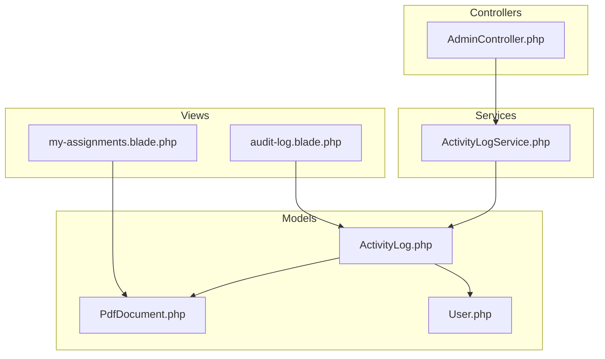
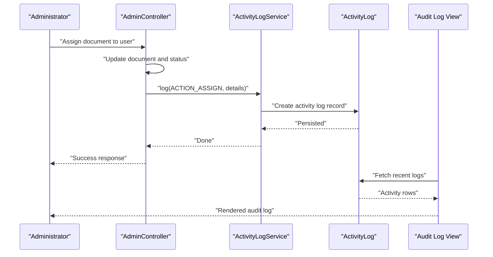
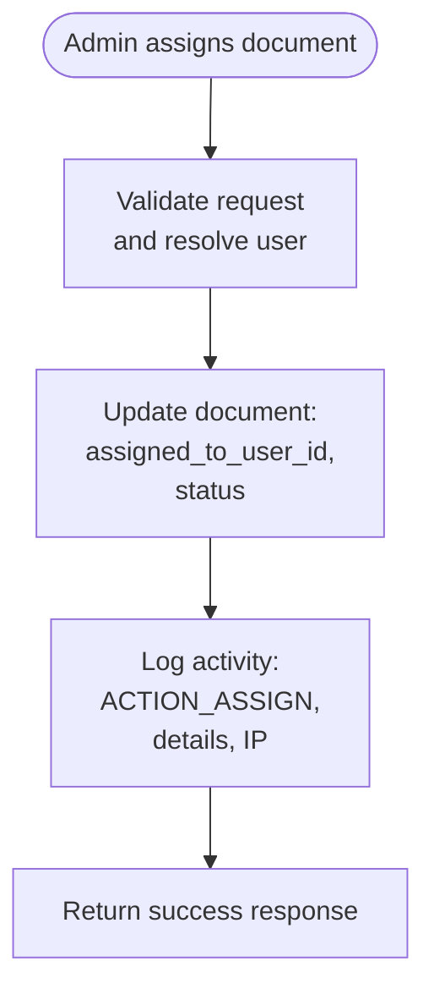
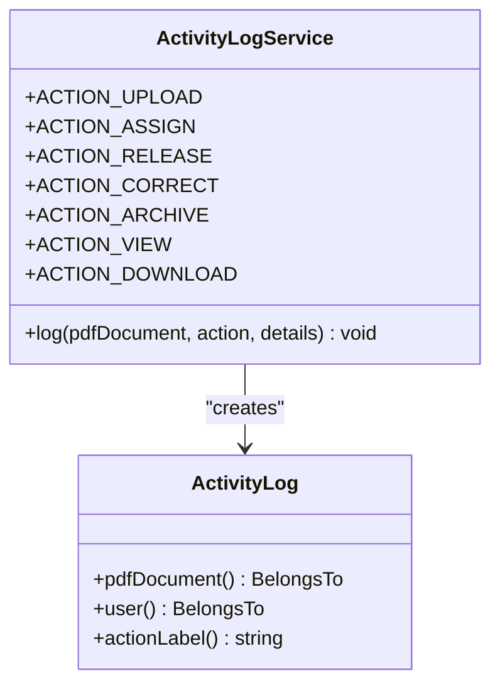
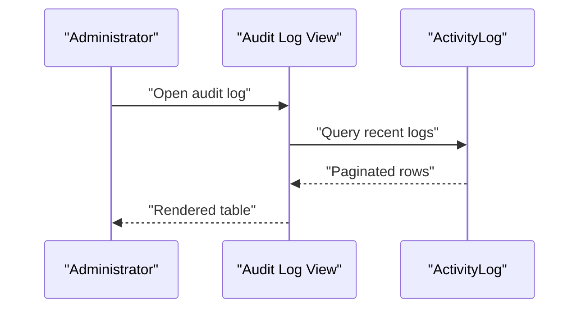
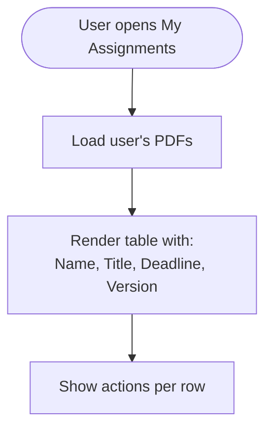
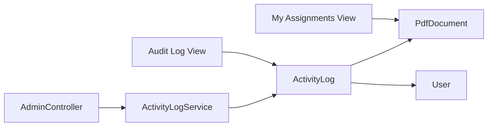

# Notification System

<cite>
**Referenced Files in This Document**
- [AdminController.php](file://pdf-korektura/app/Http/Controllers/AdminController.php)
- [ActivityLogService.php](file://pdf-korektura/app/Services/ActivityLogService.php)
- [ActivityLog.php](file://pdf-korektura/app/Models/ActivityLog.php)
- [2024_06_10_140000_create_activity_logs_table.php](file://pdf-korektura/database/migrations/2024_06_10_140000_create_activity_logs_table.php)
- [my-assignments.blade.php](file://pdf-korektura/resources/views/livewire/my-assignments.blade.php)
- [audit-log.blade.php](file://pdf-korektura/resources/views/livewire/admin/audit-log.blade.php)
- [PdfDocument.php](file://pdf-korektura/app/Models/PdfDocument.php)
- [User.php](file://pdf-korektura/app/Models/User.php)
</cite>

## Table of Contents
1. [Introduction](#introduction)
2. [Project Structure](#project-structure)
3. [Core Components](#core-components)
4. [Architecture Overview](#architecture-overview)
5. [Detailed Component Analysis](#detailed-component-analysis)
6. [Dependency Analysis](#dependency-analysis)
7. [Performance Considerations](#performance-considerations)
8. [Troubleshooting Guide](#troubleshooting-guide)
9. [Conclusion](#conclusion)

## Introduction
This document describes the assignment notification system within the application. The system currently focuses on activity logging and visibility of assignment events for administrators and users. Notifications via email or other channels are not implemented in the current codebase. Instead, the system records assignment actions and displays them in audit logs and user dashboards.

## Project Structure
The notification-related functionality centers around:
- Controllers that trigger assignment actions
- A service that logs activities
- Models representing documents, users, and activity logs
- Blade views that surface audit logs and assignment lists

**Diagram sources**
- [AdminController.php:42-61](file://pdf-korektura/app/Http/Controllers/AdminController.php#L42-L61)
- [ActivityLogService.php:20-29](file://pdf-korektura/app/Services/ActivityLogService.php#L20-L29)
- [ActivityLog.php:13-59](file://pdf-korektura/app/Models/ActivityLog.php#L13-L59)
- [PdfDocument.php:94-129](file://pdf-korektura/app/Models/PdfDocument.php#L94-L129)
- [User.php](file://pdf-korektura/app/Models/User.php)
- [my-assignments.blade.php:1-134](file://pdf-korektura/resources/views/livewire/my-assignments.blade.php#L1-L134)
- [audit-log.blade.php:20-67](file://pdf-korektura/resources/views/livewire/admin/audit-log.blade.php#L20-L67)

**Section sources**
- [AdminController.php:42-61](file://pdf-korektura/app/Http/Controllers/AdminController.php#L42-L61)
- [ActivityLogService.php:20-29](file://pdf-korektura/app/Services/ActivityLogService.php#L20-L29)
- [ActivityLog.php:13-59](file://pdf-korektura/app/Models/ActivityLog.php#L13-L59)
- [my-assignments.blade.php:1-134](file://pdf-korektura/resources/views/livewire/my-assignments.blade.php#L1-L134)
- [audit-log.blade.php:20-67](file://pdf-korektura/resources/views/livewire/admin/audit-log.blade.php#L20-L67)

## Core Components
- Assignment controller action: Assigns a PDF document to a user and logs the event.
- Activity logging service: Creates persistent records of user actions.
- Activity log model: Defines attributes, relationships, and localized labels for actions.
- Views: Display recent activity and user assignments.

Key responsibilities:
- Triggering assignment events
- Recording audit trails
- Presenting actionable information to users and administrators

**Section sources**
- [AdminController.php:42-61](file://pdf-korektura/app/Http/Controllers/AdminController.php#L42-L61)
- [ActivityLogService.php:20-29](file://pdf-korektura/app/Services/ActivityLogService.php#L20-L29)
- [ActivityLog.php:13-59](file://pdf-korektura/app/Models/ActivityLog.php#L13-L59)

## Architecture Overview
Assignment notifications are implemented as synchronous activity logging. When an administrator assigns a document, the system:
1. Updates the document record
2. Logs the assignment action with contextual details
3. Makes the event visible in audit logs and the user's assignment list

**Diagram sources**
- [AdminController.php:42-61](file://pdf-korektura/app/Http/Controllers/AdminController.php#L42-L61)
- [ActivityLogService.php:20-29](file://pdf-korektura/app/Services/ActivityLogService.php#L20-L29)
- [ActivityLog.php:13-59](file://pdf-korektura/app/Models/ActivityLog.php#L13-L59)
- [audit-log.blade.php:20-67](file://pdf-korektura/resources/views/livewire/admin/audit-log.blade.php#L20-L67)

## Detailed Component Analysis

### Assignment Controller Action
- Validates input and updates the document assignment and status.
- Logs the assignment action with a reason and actor details.
- Returns a user-facing success message.

**Diagram sources**
- [AdminController.php:42-61](file://pdf-korektura/app/Http/Controllers/AdminController.php#L42-L61)
- [ActivityLogService.php:20-29](file://pdf-korektura/app/Services/ActivityLogService.php#L20-L29)

**Section sources**
- [AdminController.php:42-61](file://pdf-korektura/app/Http/Controllers/AdminController.php#L42-L61)

### Activity Logging Service
- Provides a centralized method to persist activity logs.
- Captures the acting user, action type, related document, and client IP.
- Supports multiple action types including assignment.

**Diagram sources**
- [ActivityLogService.php:10-30](file://pdf-korektura/app/Services/ActivityLogService.php#L10-L30)
- [ActivityLog.php:9-59](file://pdf-korektura/app/Models/ActivityLog.php#L9-L59)

**Section sources**
- [ActivityLogService.php:10-30](file://pdf-korektura/app/Services/ActivityLogService.php#L10-L30)
- [ActivityLog.php:13-59](file://pdf-korektura/app/Models/ActivityLog.php#L13-L59)

### Audit Log Presentation
- Administrators can browse recent activity events.
- Displays timestamps, actors, actions, associated documents, details, and IPs.
- Supports pagination and filtering.

**Diagram sources**
- [audit-log.blade.php:20-67](file://pdf-korektura/resources/views/livewire/admin/audit-log.blade.php#L20-L67)
- [ActivityLog.php:36-44](file://pdf-korektura/app/Models/ActivityLog.php#L36-L44)

**Section sources**
- [audit-log.blade.php:20-67](file://pdf-korektura/resources/views/livewire/admin/audit-log.blade.php#L20-L67)
- [ActivityLog.php:36-44](file://pdf-korektura/app/Models/ActivityLog.php#L36-L44)

### User Assignment Visibility
- Users see their assigned documents in a dedicated view.
- Includes document name, title, deadline, and current version.
- Provides actions for uploading corrections when applicable.

**Diagram sources**
- [my-assignments.blade.php:1-134](file://pdf-korektura/resources/views/livewire/my-assignments.blade.php#L1-L134)
- [PdfDocument.php:94-129](file://pdf-korektura/app/Models/PdfDocument.php#L94-L129)

**Section sources**
- [my-assignments.blade.php:1-134](file://pdf-korektura/resources/views/livewire/my-assignments.blade.php#L1-L134)
- [PdfDocument.php:94-129](file://pdf-korektura/app/Models/PdfDocument.php#L94-L129)

## Dependency Analysis
- Controllers depend on the logging service to record actions.
- The logging service depends on the activity log model.
- Views depend on models to render data.
- There is no external notification channel configured; all notifications are local and logged.

**Diagram sources**
- [AdminController.php:42-61](file://pdf-korektura/app/Http/Controllers/AdminController.php#L42-L61)
- [ActivityLogService.php:20-29](file://pdf-korektura/app/Services/ActivityLogService.php#L20-L29)
- [ActivityLog.php:36-44](file://pdf-korektura/app/Models/ActivityLog.php#L36-L44)
- [my-assignments.blade.php:1-134](file://pdf-korektura/resources/views/livewire/my-assignments.blade.php#L1-L134)
- [audit-log.blade.php:20-67](file://pdf-korektura/resources/views/livewire/admin/audit-log.blade.php#L20-L67)

**Section sources**
- [AdminController.php:42-61](file://pdf-korektura/app/Http/Controllers/AdminController.php#L42-L61)
- [ActivityLogService.php:20-29](file://pdf-korektura/app/Services/ActivityLogService.php#L20-L29)
- [ActivityLog.php:36-44](file://pdf-korektura/app/Models/ActivityLog.php#L36-L44)
- [my-assignments.blade.php:1-134](file://pdf-korektura/resources/views/livewire/my-assignments.blade.php#L1-L134)
- [audit-log.blade.php:20-67](file://pdf-korektura/resources/views/livewire/admin/audit-log.blade.php#L20-L67)

## Performance Considerations
- Logging is synchronous and lightweight; overhead is minimal.
- Audit log queries should be paginated and filtered to avoid large result sets.
- Consider indexing frequently queried columns (e.g., user_id, pdf_document_id, created_at) to improve performance.

## Troubleshooting Guide
- If assignment actions do not appear in audit logs:
  - Verify the logging service is invoked after document updates.
  - Confirm the activity logs table exists and is properly migrated.
- If user assignment lists are empty:
  - Ensure the user is assigned to documents and the status reflects active assignments.
- If logs show unexpected IPs:
  - Check proxy or load balancer configurations affecting client IP capture.

**Section sources**
- [ActivityLogService.php:20-29](file://pdf-korektura/app/Services/ActivityLogService.php#L20-L29)
- [2024_06_10_140000_create_activity_logs_table.php:11-18](file://pdf-korektura/database/migrations/2024_06_10_140000_create_activity_logs_table.php#L11-L18)
- [PdfDocument.php:94-129](file://pdf-korektura/app/Models/PdfDocument.php#L94-L129)

## Conclusion
The current assignment notification system is implemented through synchronous activity logging and local visibility in audit logs and user dashboards. Email or external notification channels are not present in the codebase. To extend the system, integrate a queue-backed notification mechanism and define templates for email dispatch, while preserving the existing logging infrastructure for auditability.