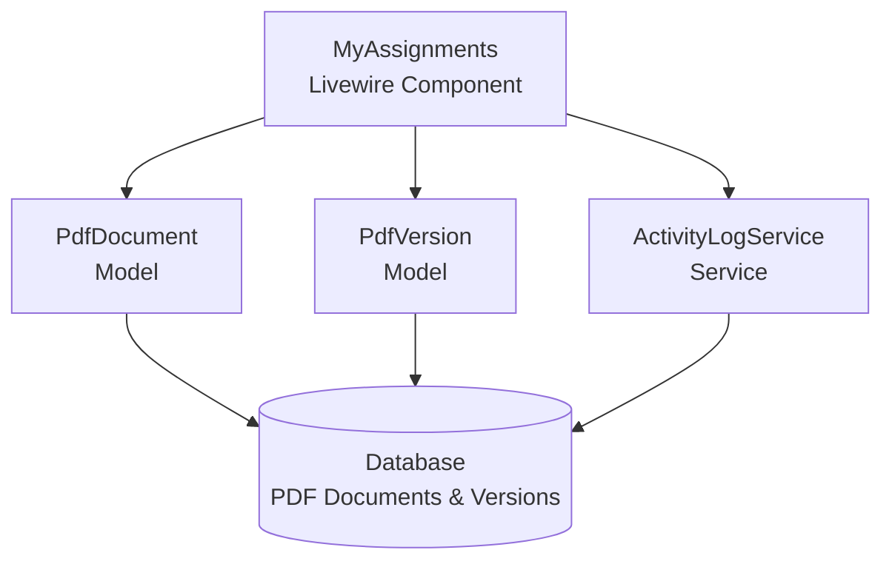
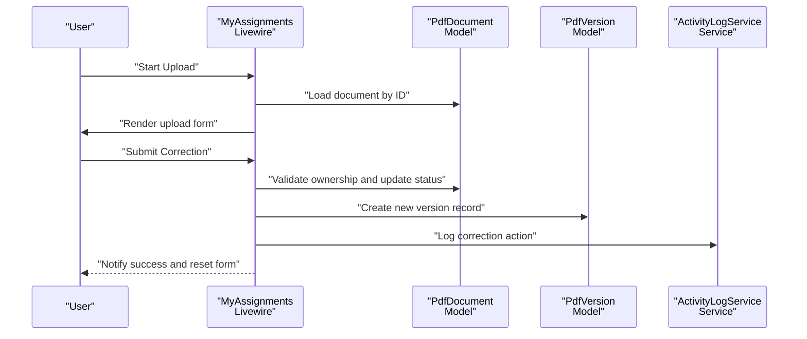
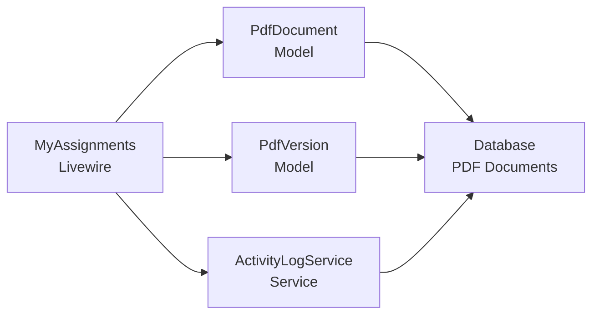

# Progress Tracking

<cite>
**Referenced Files in This Document**
- [MyAssignments.php](file://app/Livewire/MyAssignments.php)
- [my-assignments.blade.php](file://resources/views/livewire/my-assignments.blade.php)
- [PdfDocument.php](file://app/Models/PdfDocument.php)
- [PdfVersion.php](file://app/Models/PdfVersion.php)
- [ActivityLogService.php](file://app/Services/ActivityLogService.php)
- [2024_06_10_120000_create_pdf_documents_table.php](file://database/migrations/2024_06_10_120000_create_pdf_documents_table.php)
- [2024_06_10_130000_create_pdf_versions_table.php](file://database/migrations/2024_06_10_130000_create_pdf_versions_table.php)
</cite>

## Table of Contents
1. [Introduction](#introduction)
2. [Project Structure](#project-structure)
3. [Core Components](#core-components)
4. [Architecture Overview](#architecture-overview)
5. [Detailed Component Analysis](#detailed-component-analysis)
6. [Dependency Analysis](#dependency-analysis)
7. [Performance Considerations](#performance-considerations)
8. [Troubleshooting Guide](#troubleshooting-guide)
9. [Conclusion](#conclusion)

## Introduction
This document explains how progress tracking works in the assignment system, focusing on the correction workflow and the MyAssignments Livewire component. It covers how assignment status is tracked, how progress indicators and visual representations are implemented, the status transition logic across phases, metrics calculation and display, real-time updates via Livewire reactive components, progress reporting and historical tracking, and analytics for performance monitoring.

## Project Structure
The progress tracking system centers around:
- Livewire component for managing assignments and corrections
- Models representing documents and versions with status fields
- Migration files defining database schema and status constants
- Activity logging service for historical tracking

**Diagram sources**
- [MyAssignments.php:16-121](file://app/Livewire/MyAssignments.php#L16-L121)
- [PdfDocument.php:1-150](file://app/Models/PdfDocument.php#L1-L150)
- [PdfVersion.php:1-200](file://app/Models/PdfVersion.php#L1-L200)
- [ActivityLogService.php:1-200](file://app/Services/ActivityLogService.php#L1-L200)

**Section sources**
- [MyAssignments.php:16-121](file://app/Livewire/MyAssignments.php#L16-L121)
- [PdfDocument.php:1-150](file://app/Models/PdfDocument.php#L1-L150)
- [PdfVersion.php:1-200](file://app/Models/PdfVersion.php#L1-L200)
- [2024_06_10_120000_create_pdf_documents_table.php:1-200](file://database/migrations/2024_06_10_120000_create_pdf_documents_table.php#L1-L200)
- [2024_06_10_130000_create_pdf_versions_table.php:1-200](file://database/migrations/2024_06_10_130000_create_pdf_versions_table.php#L1-L200)

## Core Components
- MyAssignments Livewire component orchestrates assignment display, upload initiation, correction submission, and release actions. It reacts to user interactions and updates the UI in real time.
- PdfDocument model encapsulates status constants, labels, and color mapping for visual indicators. It also provides helpers for assignment and archival checks.
- PdfVersion model supports versioning of corrected documents and links to PdfDocument.
- ActivityLogService records historical events for auditing and progress reporting.
- Database migrations define the schema and status enumerations used across the system.

Key responsibilities:
- Track and render assignment status with color-coded labels
- Manage status transitions during correction and release
- Persist versioned corrections and maintain history
- Provide real-time UI updates through Livewire reactivity

**Section sources**
- [MyAssignments.php:16-121](file://app/Livewire/MyAssignments.php#L16-L121)
- [PdfDocument.php:94-129](file://app/Models/PdfDocument.php#L94-L129)
- [PdfVersion.php:1-200](file://app/Models/PdfVersion.php#L1-L200)
- [ActivityLogService.php:1-200](file://app/Services/ActivityLogService.php#L1-L200)

## Architecture Overview
The correction workflow integrates Livewire, models, and persistence to provide a real-time progress tracking experience.

**Diagram sources**
- [MyAssignments.php:31-88](file://app/Livewire/MyAssignments.php#L31-L88)
- [PdfDocument.php:94-129](file://app/Models/PdfDocument.php#L94-L129)
- [PdfVersion.php:1-200](file://app/Models/PdfVersion.php#L1-L200)
- [ActivityLogService.php:1-200](file://app/Services/ActivityLogService.php#L1-L200)

## Detailed Component Analysis

### MyAssignments Livewire Component
Responsibilities:
- Render paginated list of assignments for the authenticated user
- Initiate uploads and manage form state for corrections
- Submit corrections with validation and status updates
- Release assignments back to the pool
- Dispatch notifications and reset UI state after actions

Progress indicators:
- Status label and color are derived from PdfDocument model helpers
- Real-time updates occur through Livewire reactivity and pagination rendering

Status transitions:
- Correction submission sets status to COMPLETED or RETURNED depending on user choice
- Release action resets assignment ownership and sets status back to UPLOADED

Real-time updates:
- Uses Livewire attributes for pagination and file uploads
- Dispatches notifications and form resets to refresh UI state

**Section sources**
- [MyAssignments.php:16-121](file://app/Livewire/MyAssignments.php#L16-L121)
- [my-assignments.blade.php:1-200](file://resources/views/livewire/my-assignments.blade.php#L1-L200)

### PdfDocument Model
Responsibilities:
- Define status constants and helper methods for labels and colors
- Provide helpers for assignment and archival state checks
- Support relationship with PdfVersion for versioned corrections

Progress representation:
- statusLabel returns localized status text
- statusColor returns semantic color for UI indicators

Status constants and transitions:
- Upstream statuses include UPLOADED, IN_PROGRESS, RETURNED, COMPLETED
- Transitions are managed by Livewire actions and validated against ownership

**Section sources**
- [PdfDocument.php:94-129](file://app/Models/PdfDocument.php#L94-L129)
- [2024_06_10_120000_create_pdf_documents_table.php:1-200](file://database/migrations/2024_06_10_120000_create_pdf_documents_table.php#L1-L200)

### PdfVersion Model
Responsibilities:
- Store corrected versions of documents
- Link versions to PdfDocument and track version numbers
- Enable historical tracking of changes

Progress metrics:
- Version count reflects total corrections per document
- Timestamps enable time-to-completion calculations

**Section sources**
- [PdfVersion.php:1-200](file://app/Models/PdfVersion.php#L1-L200)
- [2024_06_10_130000_create_pdf_versions_table.php:1-200](file://database/migrations/2024_06_10_130000_create_pdf_versions_table.php#L1-L200)

### ActivityLogService
Responsibilities:
- Log actions performed on documents (corrections, releases)
- Provide historical audit trail for progress reporting

Progress reporting:
- Logs include action type, timestamp, and descriptive messages
- Enables generation of reports on correction frequency and reviewer activity

**Section sources**
- [ActivityLogService.php:1-200](file://app/Services/ActivityLogService.php#L1-L200)

### Database Schema and Status Constants
The migrations define:
- PDF documents table with status field and assignment ownership
- PDF versions table linking corrected versions to documents
- Status enumerations used consistently across the system

Progress metrics:
- Count of documents per status for team dashboards
- Aggregated statistics on completion rates and turnaround times

**Section sources**
- [2024_06_10_120000_create_pdf_documents_table.php:1-200](file://database/migrations/2024_06_10_120000_create_pdf_documents_table.php#L1-L200)
- [2024_06_10_130000_create_pdf_versions_table.php:1-200](file://database/migrations/2024_06_10_130000_create_pdf_versions_table.php#L1-L200)

## Dependency Analysis
The following diagram shows how components depend on each other to implement progress tracking:

**Diagram sources**
- [MyAssignments.php:16-121](file://app/Livewire/MyAssignments.php#L16-L121)
- [PdfDocument.php:1-150](file://app/Models/PdfDocument.php#L1-L150)
- [PdfVersion.php:1-200](file://app/Models/PdfVersion.php#L1-L200)
- [ActivityLogService.php:1-200](file://app/Services/ActivityLogService.php#L1-L200)

**Section sources**
- [MyAssignments.php:16-121](file://app/Livewire/MyAssignments.php#L16-L121)
- [PdfDocument.php:1-150](file://app/Models/PdfDocument.php#L1-L150)
- [PdfVersion.php:1-200](file://app/Models/PdfVersion.php#L1-L200)
- [ActivityLogService.php:1-200](file://app/Services/ActivityLogService.php#L1-L200)

## Performance Considerations
- Pagination reduces UI load when displaying large assignment lists
- Reactive Livewire updates minimize full-page reloads
- Using model helpers for status labels and colors avoids repeated conditional logic
- Logging actions asynchronously can improve responsiveness for correction submissions

## Troubleshooting Guide
Common issues and resolutions:
- Ownership validation failures: Ensure the authenticated user matches the assignment owner before allowing corrections or releases
- Status mismatch errors: Verify that the document status aligns with expected transitions (e.g., only assigned documents can be released)
- Upload validation errors: Confirm file type and size constraints meet requirements
- Notification visibility: Use Livewire dispatch events to surface success/error messages to users

**Section sources**
- [MyAssignments.php:42-107](file://app/Livewire/MyAssignments.php#L42-L107)

## Conclusion
The assignment progress tracking system combines Livewire reactivity, model-driven status management, and versioned document storage to provide a robust correction workflow. Users receive immediate feedback through color-coded status indicators and notifications, while administrators gain access to historical logs and reporting capabilities. The modular design enables straightforward extension for advanced analytics and performance monitoring.