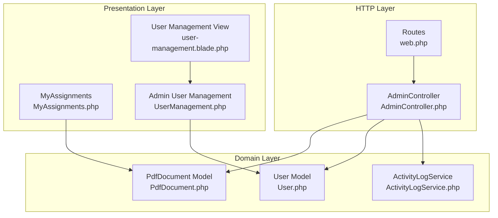
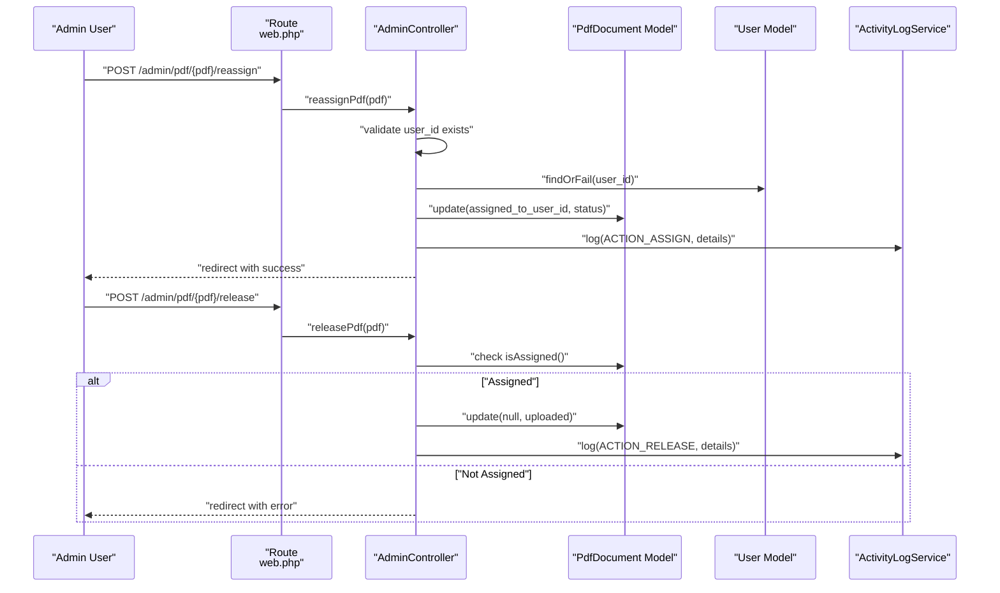
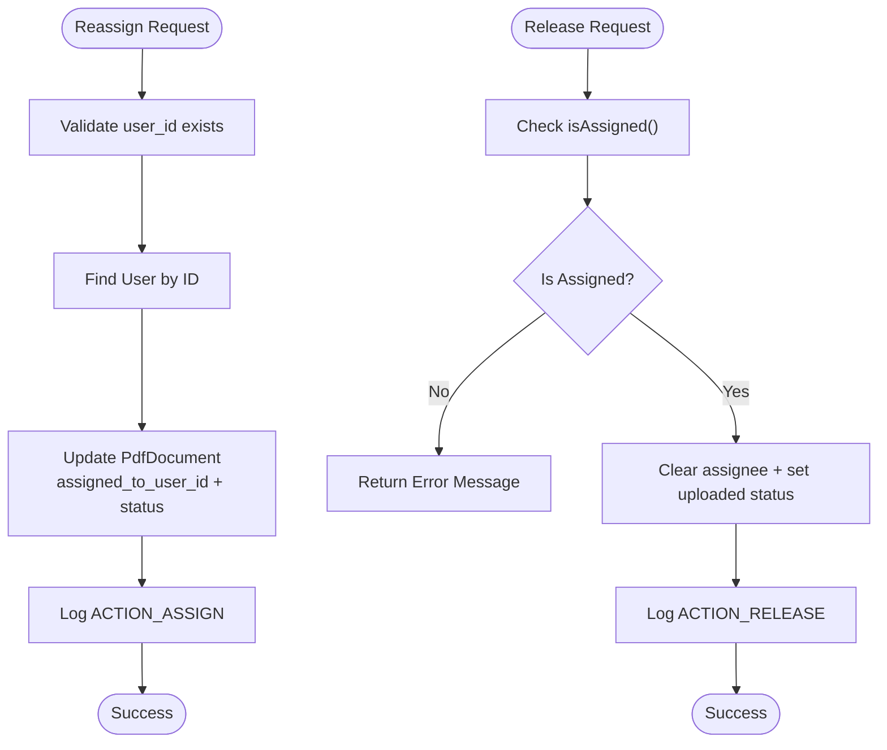
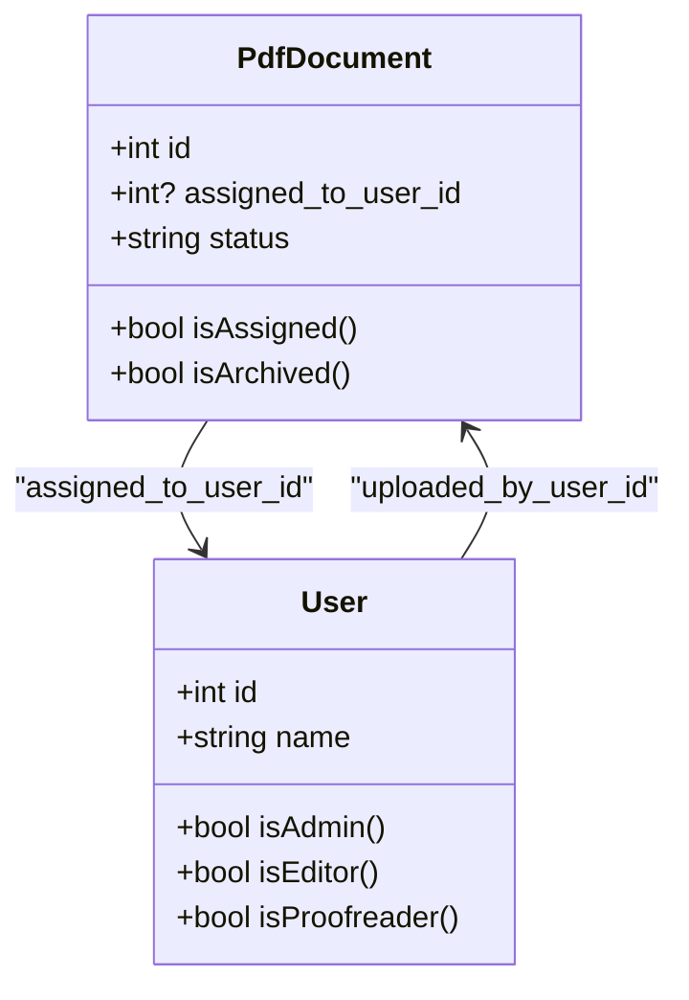
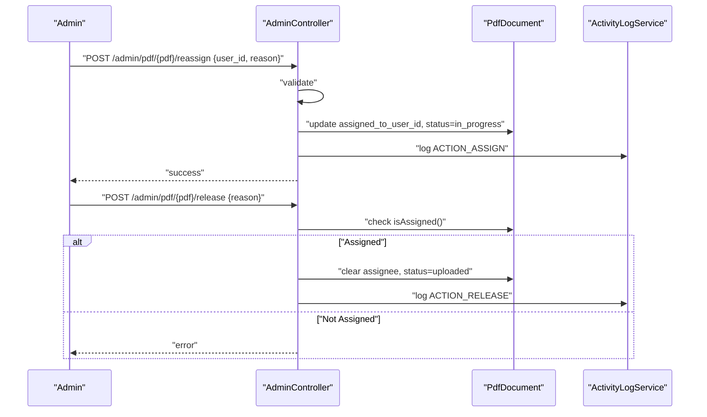
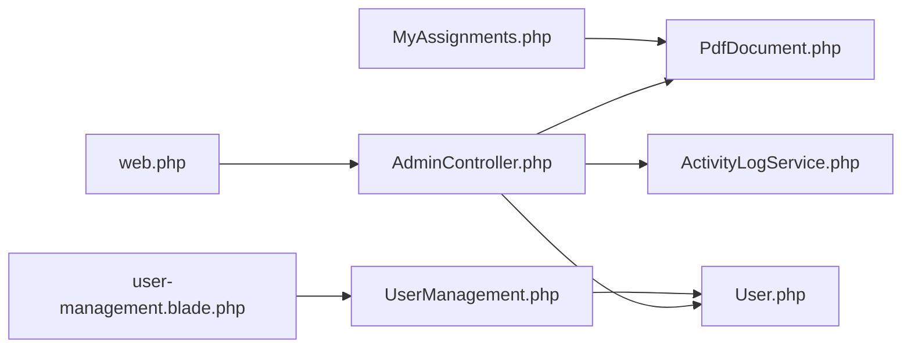

# Task Assignment

<cite>
**Referenced Files in This Document**
- [AdminController.php](file://app/Http/Controllers/AdminController.php)
- [web.php](file://routes/web.php)
- [PdfDocument.php](file://app/Models/PdfDocument.php)
- [User.php](file://app/Models/User.php)
- [ActivityLogService.php](file://app/Services/ActivityLogService.php)
- [MyAssignments.php](file://app/Livewire/MyAssignments.php)
- [user-management.blade.php](file://resources/views/livewire/admin/user-management.blade.php)
- [UserManagement.php](file://app/Livewire/Admin/UserManagement.php)
</cite>

## Table of Contents
1. [Introduction](#introduction)
2. [Project Structure](#project-structure)
3. [Core Components](#core-components)
4. [Architecture Overview](#architecture-overview)
5. [Detailed Component Analysis](#detailed-component-analysis)
6. [Dependency Analysis](#dependency-analysis)
7. [Performance Considerations](#performance-considerations)
8. [Troubleshooting Guide](#troubleshooting-guide)
9. [Conclusion](#conclusion)

## Introduction
This document explains the task assignment functionality implemented for administrators to assign PDF documents to specific users. It covers the end-to-end workflow from route exposure to controller actions, validation, persistence via Eloquent, and audit logging. It also details conflict resolution and duplicate assignment prevention strategies, along with error handling scenarios.

## Project Structure
The assignment feature spans routing, controllers, models, services, and Livewire components:
- Routes expose admin endpoints for releasing and reassigning PDFs.
- AdminController handles assignment-related requests and updates document state.
- PdfDocument model encapsulates document metadata, status, and relations.
- User model defines roles and relationships to documents.
- ActivityLogService records administrative actions.
- MyAssignments Livewire component manages proofreader tasks and status transitions.
- Admin user-management UI supports role configuration for assignment eligibility.

**Diagram sources**
- [web.php:43-52](file://routes/web.php#L43-L52)
- [AdminController.php:11-61](file://app/Http/Controllers/AdminController.php#L11-L61)
- [PdfDocument.php:10-130](file://app/Models/PdfDocument.php#L10-L130)
- [User.php:10-71](file://app/Models/User.php#L10-L71)
- [ActivityLogService.php:10-31](file://app/Services/ActivityLogService.php#L10-L31)
- [MyAssignments.php:16-122](file://app/Livewire/MyAssignments.php#L16-L122)
- [UserManagement.php:14-127](file://app/Livewire/Admin/UserManagement.php#L14-L127)
- [user-management.blade.php:1-152](file://resources/views/livewire/admin/user-management.blade.php#L1-L152)

**Section sources**
- [web.php:43-52](file://routes/web.php#L43-L52)
- [AdminController.php:11-61](file://app/Http/Controllers/AdminController.php#L11-L61)
- [PdfDocument.php:10-130](file://app/Models/PdfDocument.php#L10-L130)
- [User.php:10-71](file://app/Models/User.php#L10-L71)
- [ActivityLogService.php:10-31](file://app/Services/ActivityLogService.php#L10-L31)
- [MyAssignments.php:16-122](file://app/Livewire/MyAssignments.php#L16-L122)
- [UserManagement.php:14-127](file://app/Livewire/Admin/UserManagement.php#L14-L127)
- [user-management.blade.php:1-152](file://resources/views/livewire/admin/user-management.blade.php#L1-L152)

## Core Components
- AdminController: Provides two assignment-related actions:
  - Reassign PDF to a user with reason and status update.
  - Release PDF from current assignee and return to pool.
- PdfDocument: Defines statuses, relations, and helpers for assignment checks.
- User: Role-based access to determine eligibility and permissions.
- ActivityLogService: Centralized logging for administrative actions.
- MyAssignments: Handles proofreader-side corrections and status transitions.
- Admin User Management: Configures roles enabling assignment eligibility.

Key assignment-related validations and constraints:
- Reassignment requires a valid user ID present in the users table.
- Release action prevents release if the document is not currently assigned.
- Status transitions are enforced per action (e.g., in-progress after reassign, uploaded after release).
- Proofreader-specific checks ensure only assigned documents can be processed.

**Section sources**
- [AdminController.php:13-60](file://app/Http/Controllers/AdminController.php#L13-L60)
- [PdfDocument.php:14-101](file://app/Models/PdfDocument.php#L14-L101)
- [User.php:56-69](file://app/Models/User.php#L56-L69)
- [ActivityLogService.php:20-29](file://app/Services/ActivityLogService.php#L20-L29)
- [MyAssignments.php:42-107](file://app/Livewire/MyAssignments.php#L42-L107)

## Architecture Overview
The assignment architecture follows a layered approach:
- HTTP requests reach routes bound to AdminController actions.
- Controllers validate inputs, resolve related entities, and persist state changes.
- Models encapsulate domain logic and relationships.
- Services centralize cross-cutting concerns like auditing.
- Livewire components provide user-facing workflows for both admins and proofreaders.

**Diagram sources**
- [web.php:48-51](file://routes/web.php#L48-L51)
- [AdminController.php:39-60](file://app/Http/Controllers/AdminController.php#L39-L60)
- [PdfDocument.php:98-101](file://app/Models/PdfDocument.php#L98-L101)
- [ActivityLogService.php:20-29](file://app/Services/ActivityLogService.php#L20-L29)

## Detailed Component Analysis

### AdminController Actions
- Reassign PDF:
  - Validates presence of user ID and optional reason.
  - Resolves target user and updates document’s assignee and status.
  - Logs the assignment action with reason details.
- Release PDF:
  - Validates optional reason.
  - Ensures document is currently assigned; otherwise returns error.
  - Clears assignee and resets status to uploaded.
  - Logs the release action with reason details.

**Diagram sources**
- [AdminController.php:39-60](file://app/Http/Controllers/AdminController.php#L39-L60)
- [PdfDocument.php:98-101](file://app/Models/PdfDocument.php#L98-L101)
- [ActivityLogService.php:20-29](file://app/Services/ActivityLogService.php#L20-L29)

**Section sources**
- [AdminController.php:13-60](file://app/Http/Controllers/AdminController.php#L13-L60)
- [web.php:48-51](file://routes/web.php#L48-L51)

### Assignment Validation Logic
- Reassignment:
  - user_id must exist in users table.
  - Optional reason string with max length enforced.
- Release:
  - Requires document to be currently assigned; otherwise returns error.
  - Optional reason string with max length enforced.

These validations prevent invalid state transitions and unauthorized operations.

**Section sources**
- [AdminController.php:41-44](file://app/Http/Controllers/AdminController.php#L41-L44)
- [AdminController.php:15-17](file://app/Http/Controllers/AdminController.php#L15-L17)
- [PdfDocument.php:98-101](file://app/Models/PdfDocument.php#L98-L101)

### Assignment Persistence Mechanism
- Eloquent updates:
  - AdminController updates PdfDocument with assigned_to_user_id and status.
  - MyAssignments updates PdfDocument with current_version_number, status, and optionally clears assignee.
- Relations:
  - PdfDocument belongs to User for both uploader and assignee.
  - User has many PdfDocument entries for uploads and assignments.
- Scopes:
  - PdfDocument scopes support querying unassigned and assigned documents.

**Diagram sources**
- [PdfDocument.php:14-101](file://app/Models/PdfDocument.php#L14-L101)
- [User.php:36-44](file://app/Models/User.php#L36-L44)
- [User.php:56-69](file://app/Models/User.php#L56-L69)

**Section sources**
- [PdfDocument.php:19-39](file://app/Models/PdfDocument.php#L19-L39)
- [PdfDocument.php:41-54](file://app/Models/PdfDocument.php#L41-L54)
- [PdfDocument.php:77-86](file://app/Models/PdfDocument.php#L77-L86)
- [User.php:36-44](file://app/Models/User.php#L36-L44)

### Assignment Conflict Resolution and Duplicate Prevention
- Conflict resolution:
  - Release action explicitly checks isAssigned() to avoid releasing unassigned documents.
  - MyAssignments enforces that only the assigned proofreader can upload corrections or release a document.
- Duplicate assignment prevention:
  - Reassignment sets the assignee field to the new user; subsequent reassignments overwrite previous assignees.
  - No explicit uniqueness constraint is defined at the database level for assignments; however, the controller logic ensures a single assignee per document.

**Section sources**
- [AdminController.php:19-21](file://app/Http/Controllers/AdminController.php#L19-L21)
- [MyAssignments.php:48-51](file://app/Livewire/MyAssignments.php#L48-L51)
- [PdfDocument.php:98-101](file://app/Models/PdfDocument.php#L98-L101)

### Examples of Assignment Creation Workflows
- Assign a PDF to a user:
  - Admin navigates to the PDF detail page and triggers the reassign endpoint with user_id and optional reason.
  - Controller validates user existence, updates the document’s assignee and status, and logs the action.
- Release a PDF:
  - Admin triggers the release endpoint with optional reason.
  - Controller verifies the document is assigned; if so, clears assignee and resets status to uploaded, then logs the action.
- Proofreader correction and completion:
  - Proofreader uploads corrected PDF via MyAssignments, increments version number, and updates status accordingly.
  - If returned for revision, status becomes returned and assignee remains; if completed, status becomes completed and assignee may be cleared depending on business rules.

**Diagram sources**
- [web.php:48-51](file://routes/web.php#L48-L51)
- [AdminController.php:39-60](file://app/Http/Controllers/AdminController.php#L39-L60)
- [PdfDocument.php:98-101](file://app/Models/PdfDocument.php#L98-L101)
- [ActivityLogService.php:20-29](file://app/Services/ActivityLogService.php#L20-L29)

**Section sources**
- [web.php:48-51](file://routes/web.php#L48-L51)
- [AdminController.php:39-60](file://app/Http/Controllers/AdminController.php#L39-L60)
- [MyAssignments.php:42-88](file://app/Livewire/MyAssignments.php#L42-L88)

## Dependency Analysis
- Controllers depend on models for state queries and updates.
- Controllers depend on services for audit logging.
- Livewire components depend on models for rendering and persistence.
- Routes bind to controllers and Livewire components.

**Diagram sources**
- [web.php:43-52](file://routes/web.php#L43-L52)
- [AdminController.php:11-61](file://app/Http/Controllers/AdminController.php#L11-L61)
- [PdfDocument.php:10-130](file://app/Models/PdfDocument.php#L10-L130)
- [User.php:10-71](file://app/Models/User.php#L10-L71)
- [ActivityLogService.php:10-31](file://app/Services/ActivityLogService.php#L10-L31)
- [MyAssignments.php:16-122](file://app/Livewire/MyAssignments.php#L16-L122)
- [UserManagement.php:14-127](file://app/Livewire/Admin/UserManagement.php#L14-L127)
- [user-management.blade.php:1-152](file://resources/views/livewire/admin/user-management.blade.php#L1-L152)

**Section sources**
- [web.php:43-52](file://routes/web.php#L43-L52)
- [AdminController.php:11-61](file://app/Http/Controllers/AdminController.php#L11-L61)
- [PdfDocument.php:10-130](file://app/Models/PdfDocument.php#L10-L130)
- [User.php:10-71](file://app/Models/User.php#L10-L71)
- [ActivityLogService.php:10-31](file://app/Services/ActivityLogService.php#L10-L31)
- [MyAssignments.php:16-122](file://app/Livewire/MyAssignments.php#L16-L122)
- [UserManagement.php:14-127](file://app/Livewire/Admin/UserManagement.php#L14-L127)
- [user-management.blade.php:1-152](file://resources/views/livewire/admin/user-management.blade.php#L1-L152)

## Performance Considerations
- Prefer scoped queries for frequently filtered lists (e.g., unassigned or assigned documents).
- Use pagination in Livewire components to limit payload sizes.
- Minimize redundant relation loading; eager load associations when rendering lists.
- Keep validation rules concise to reduce overhead on assignment endpoints.

## Troubleshooting Guide
Common issues and resolutions:
- Reassign without a valid user ID:
  - Ensure user_id exists in the users table; the controller will fail validation otherwise.
- Attempt to release an unassigned document:
  - The release action checks isAssigned(); if false, an error is returned.
- Proofreader tries to correct a document not assigned to them:
  - MyAssignments enforces that only the assigned user can upload corrections or release.
- Logging gaps:
  - Verify ActivityLogService is invoked after state changes; confirm middleware stack includes authentication and roles.

**Section sources**
- [AdminController.php:41-44](file://app/Http/Controllers/AdminController.php#L41-L44)
- [AdminController.php:19-21](file://app/Http/Controllers/AdminController.php#L19-L21)
- [MyAssignments.php:48-51](file://app/Livewire/MyAssignments.php#L48-L51)
- [ActivityLogService.php:20-29](file://app/Services/ActivityLogService.php#L20-L29)

## Conclusion
The assignment feature integrates route exposure, controller actions, model state updates, and centralized auditing. Administrators can reliably assign or release PDFs while ensuring validation and permission checks. Proofreaders manage their assignments through dedicated Livewire components. Conflict resolution and duplicate prevention are handled through explicit checks and controlled state transitions.