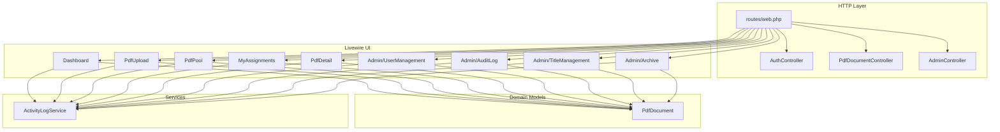
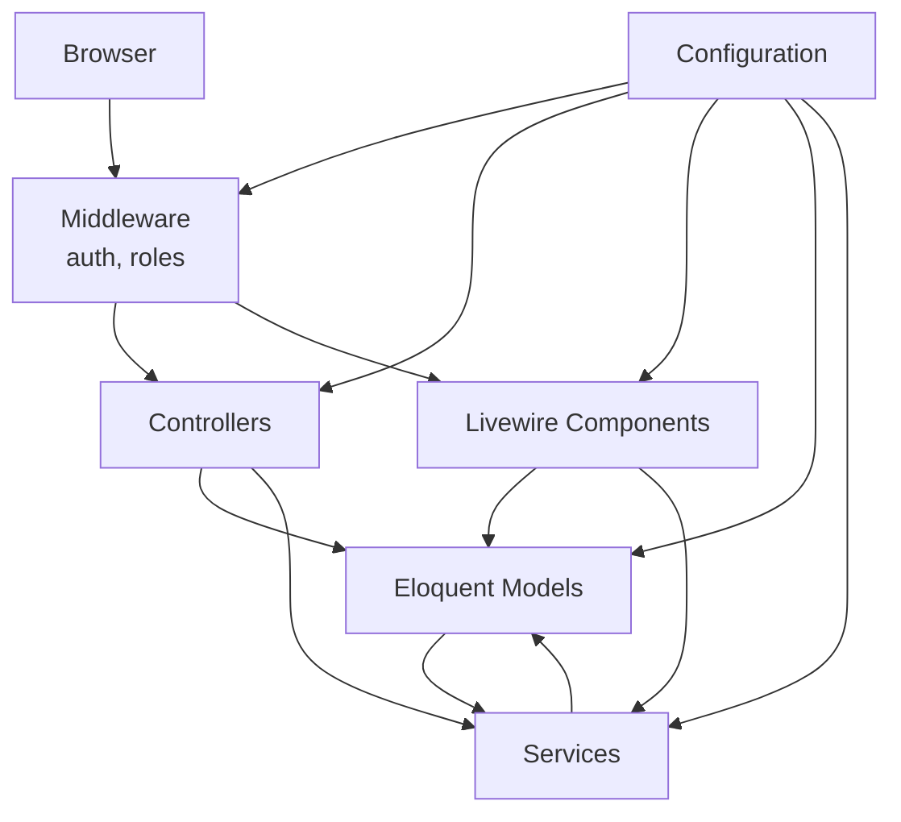

# Contributing Guidelines

<cite>
**Referenced Files in This Document**
- [composer.json](file://pdf-korektura/composer.json)
- [phpunit.xml](file://pdf-korektura/phpunit.xml)
- [.gitignore](file://pdf-korektura/.gitignore)
- [config/app.php](file://pdf-korektura/config/app.php)
- [config/auth.php](file://pdf-korektura/config/auth.php)
- [config/permission.php](file://pdf-korektura/config/permission.php)
- [routes/web.php](file://pdf-korektura/routes/web.php)
- [app/Http/Controllers/AuthController.php](file://pdf-korektura/app/Http/Controllers/AuthController.php)
- [app/Http/Controllers/PdfDocumentController.php](file://pdf-korektura/app/Http/Controllers/PdfDocumentController.php)
- [app/Http/Controllers/AdminController.php](file://pdf-korektura/app/Http/Controllers/AdminController.php)
- [app/Http/Controllers/Controller.php](file://pdf-korektura/app/Http/Controllers/Controller.php)
- [app/Livewire/Dashboard.php](file://pdf-korektura/app/Livewire/Dashboard.php)
- [app/Livewire/PdfUpload.php](file://pdf-korektura/app/Livewire/PdfUpload.php)
- [app/Livewire/PdfPool.php](file://pdf-korektura/app/Livewire/PdfPool.php)
- [app/Livewire/MyAssignments.php](file://pdf-korektura/app/Livewire/MyAssignments.php)
- [app/Livewire/PdfDetail.php](file://pdf-korektura/app/Livewire/PdfDetail.php)
- [app/Livewire/Admin/UserManagement.php](file://pdf-korektura/app/Livewire/Admin/UserManagement.php)
- [app/Livewire/Admin/AuditLog.php](file://pdf-korektura/app/Livewire/Admin/AuditLog.php)
- [app/Livewire/Admin/TitleManagement.php](file://pdf-korektura/app/Livewire/Admin/TitleManagement.php)
- [app/Livewire/Admin/Archive.php](file://pdf-korektura/app/Livewire/Admin/Archive.php)
- [app/Models/PdfDocument.php](file://pdf-korektura/app/Models/PdfDocument.php)
- [app/Services/ActivityLogService.php](file://pdf-korektura/app/Services/ActivityLogService.php)
- [database/migrations/2024_06_10_120000_create_pdf_documents_table.php](file://pdf-korektura/database/migrations/2024_06_10_120000_create_pdf_documents_table.php)
- [tests/TestCase.php](file://pdf-korektura/tests/TestCase.php)
</cite>

## Table of Contents
1. [Introduction](#introduction)
2. [Project Structure](#project-structure)
3. [Core Components](#core-components)
4. [Architecture Overview](#architecture-overview)
5. [Development Environment Setup](#development-environment-setup)
6. [Code Standards and Best Practices](#code-standards-and-best-practices)
7. [Pull Request Process](#pull-request-process)
8. [Testing Requirements and Coverage](#testing-requirements-and-coverage)
9. [Coding Style Guidelines](#coding-style-guidelines)
10. [Architectural Principles](#architectural-principles)
11. [Issue Reporting and Feature Requests](#issue-reporting-and-feature-requests)
12. [Release Procedures and Versioning](#release-procedures-and-versioning)
13. [Community Guidelines and Communication](#community-guidelines-and-communication)
14. [Troubleshooting Guide](#troubleshooting-guide)
15. [Conclusion](#conclusion)

## Introduction
This document provides comprehensive contributing guidelines for the PDF correction system. It covers development environment setup, code standards, pull request procedures, testing expectations, coding style, architecture principles, issue and feature request processes, release procedures, and community standards. The goal is to ensure consistent contributions while maintaining code quality and team collaboration.

## Project Structure
The project follows a Laravel application layout with Livewire components for interactive UI. Key areas include:
- Controllers under app/Http/Controllers for routing and request handling
- Livewire components under app/Livewire for reactive UI
- Eloquent models under app/Models representing domain entities
- Services under app/Services encapsulating cross-cutting concerns
- Routes under routes/web.php defining application endpoints
- Configuration under config/* for environment-specific behavior
- Tests under tests/ for unit and feature coverage

**Diagram sources**
- [routes/web.php:1-54](file://pdf-korektura/routes/web.php#L1-L54)
- [app/Http/Controllers/AuthController.php:1-81](file://pdf-korektura/app/Http/Controllers/AuthController.php#L1-L81)
- [app/Http/Controllers/PdfDocumentController.php](file://pdf-korektura/app/Http/Controllers/PdfDocumentController.php)
- [app/Http/Controllers/AdminController.php](file://pdf-korektura/app/Http/Controllers/AdminController.php)
- [app/Livewire/Dashboard.php:1-92](file://pdf-korektura/app/Livewire/Dashboard.php#L1-L92)
- [app/Livewire/PdfUpload.php](file://pdf-korektura/app/Livewire/PdfUpload.php)
- [app/Livewire/PdfPool.php](file://pdf-korektura/app/Livewire/PdfPool.php)
- [app/Livewire/MyAssignments.php](file://pdf-korektura/app/Livewire/MyAssignments.php)
- [app/Livewire/PdfDetail.php](file://pdf-korektura/app/Livewire/PdfDetail.php)
- [app/Livewire/Admin/UserManagement.php](file://pdf-korektura/app/Livewire/Admin/UserManagement.php)
- [app/Livewire/Admin/AuditLog.php](file://pdf-korektura/app/Livewire/Admin/AuditLog.php)
- [app/Livewire/Admin/TitleManagement.php](file://pdf-korektura/app/Livewire/Admin/TitleManagement.php)
- [app/Livewire/Admin/Archive.php](file://pdf-korektura/app/Livewire/Admin/Archive.php)
- [app/Models/PdfDocument.php:1-130](file://pdf-korektura/app/Models/PdfDocument.php#L1-L130)
- [app/Services/ActivityLogService.php:1-31](file://pdf-korektura/app/Services/ActivityLogService.php#L1-L31)

**Section sources**
- [routes/web.php:1-54](file://pdf-korektura/routes/web.php#L1-L54)
- [composer.json:1-70](file://pdf-korektura/composer.json#L1-L70)

## Core Components
- Authentication and Authorization: Login/logout flows, LDAP support, role-based middleware, and permission model configuration.
- PDF Management: Document lifecycle, status transitions, assignment, and archival.
- Livewire UI: Reactive components for dashboard, upload, pool, assignments, and admin panels.
- Activity Logging: Centralized logging service for audit trails.

Key implementation references:
- Authentication controller and routes
- Livewire components for UI
- PDF document model and scopes
- Activity log service

**Section sources**
- [app/Http/Controllers/AuthController.php:1-81](file://pdf-korektura/app/Http/Controllers/AuthController.php#L1-L81)
- [routes/web.php:25-53](file://pdf-korektura/routes/web.php#L25-L53)
- [app/Livewire/Dashboard.php:1-92](file://pdf-korektura/app/Livewire/Dashboard.php#L1-L92)
- [app/Models/PdfDocument.php:1-130](file://pdf-korektura/app/Models/PdfDocument.php#L1-L130)
- [app/Services/ActivityLogService.php:1-31](file://pdf-korektura/app/Services/ActivityLogService.php#L1-L31)

## Architecture Overview
The system uses a layered architecture:
- Presentation: Blade templates and Livewire components
- Application: Controllers and Livewire handlers orchestrating requests
- Domain: Eloquent models encapsulating business logic and relations
- Infrastructure: Configuration-driven providers, LDAP integration, and permissions

**Diagram sources**
- [routes/web.php:25-53](file://pdf-korektura/routes/web.php#L25-L53)
- [config/auth.php:1-49](file://pdf-korektura/config/auth.php#L1-L49)
- [config/permission.php:1-34](file://pdf-korektura/config/permission.php#L1-L34)
- [app/Http/Controllers/AuthController.php:1-81](file://pdf-korektura/app/Http/Controllers/AuthController.php#L1-L81)
- [app/Livewire/Dashboard.php:1-92](file://pdf-korektura/app/Livewire/Dashboard.php#L1-L92)
- [app/Models/PdfDocument.php:1-130](file://pdf-korektura/app/Models/PdfDocument.php#L1-L130)
- [app/Services/ActivityLogService.php:1-31](file://pdf-korektura/app/Services/ActivityLogService.php#L1-L31)

## Development Environment Setup
- Prerequisites
  - PHP 8.2+ as per project requirements
  - Composer for dependency management
  - SQLite for testing and local development
  - Node.js/npm/yarn for asset building (if applicable)
- Local setup steps
  - Install dependencies via Composer
  - Generate application key
  - Run database migrations
  - Configure environment variables (APP_ENV, DB_CONNECTION, etc.)
  - Use Laravel Sail or local web server for development
- Environment configuration
  - Application settings, frontend URL, and locale
  - LDAP provider configuration for authentication
  - Permission model and table names

Recommended commands and configuration locations:
- Dependencies and scripts are defined in the project manifest
- Testing environment uses SQLite in-memory database
- Ignore sensitive files and IDE artifacts via .gitignore

**Section sources**
- [composer.json:7-23](file://pdf-korektura/composer.json#L7-L23)
- [composer.json:36-51](file://pdf-korektura/composer.json#L36-L51)
- [phpunit.xml:20-30](file://pdf-korektura/phpunit.xml#L20-L30)
- [.gitignore:1-23](file://pdf-korektura/.gitignore#L1-L23)
- [config/app.php:3-16](file://pdf-korektura/config/app.php#L3-L16)
- [config/auth.php:8-38](file://pdf-korektura/config/auth.php#L8-L38)
- [config/permission.php:3-33](file://pdf-korektura/config/permission.php#L3-L33)

## Code Standards and Best Practices
- PHP and Laravel
  - Follow PSR standards and Laravel conventions
  - Keep controllers thin; delegate business logic to services and models
  - Use Eloquent relationships and query scopes for data access
  - Validate input early in controllers and Livewire handlers
  - Prefer explicit method visibility and concise return statements
- Livewire
  - Encapsulate state and actions in components
  - Use attributes like #[Layout] for consistent page structure
  - Keep render() methods focused and efficient
  - Use pagination for large datasets
- Security
  - Enforce middleware guards and role checks
  - Sanitize user inputs and avoid SQL injection
  - Log sensitive actions via the activity log service
- Configuration
  - Centralize environment-dependent settings in config/*
  - Use typed enums/constants for statuses and actions

**Section sources**
- [app/Http/Controllers/AuthController.php:21-71](file://pdf-korektura/app/Http/Controllers/AuthController.php#L21-L71)
- [app/Livewire/Dashboard.php:11-92](file://pdf-korektura/app/Livewire/Dashboard.php#L11-L92)
- [app/Models/PdfDocument.php:14-129](file://pdf-korektura/app/Models/PdfDocument.php#L14-L129)
- [app/Services/ActivityLogService.php:20-29](file://pdf-korektura/app/Services/ActivityLogService.php#L20-L29)
- [config/auth.php:14-38](file://pdf-korektura/config/auth.php#L14-L38)

## Pull Request Process
- Branch naming
  - Use descriptive names prefixed by feature/, fix/, chore/, docs/
  - Example: feature/add-pdf-upload, fix/auth-login-flow
- Commit messages
  - Use imperative mood; separate subject from body with blank line
  - Reference related issues and PRs where applicable
- Review procedure
  - Ensure tests pass locally before opening a PR
  - Include screenshots or short videos for UI changes
  - Request reviews from maintainers; address feedback promptly
- Merge criteria
  - All checks must pass (CI, linters, tests)
  - Code must adhere to style guide and architecture principles

[No sources needed since this section provides general guidance]

## Testing Requirements and Coverage
- Test suites
  - Unit and Feature test suites are defined in phpunit.xml
  - Tests are autoloaded from tests/ directory
- Database testing
  - SQLite in-memory database for fast, isolated tests
  - Environment variables configure drivers for testing
- Coverage expectations
  - Aim for high coverage in controllers, services, and models
  - Focus on critical paths: authentication, authorization, and PDF lifecycle
- Running tests
  - Execute PHPUnit via Composer scripts or directly
  - Ensure APP_ENV is set to testing during CI runs

**Section sources**
- [phpunit.xml:7-14](file://pdf-korektura/phpunit.xml#L7-L14)
- [phpunit.xml:15-19](file://pdf-korektura/phpunit.xml#L15-L19)
- [phpunit.xml:20-30](file://pdf-korektura/phpunit.xml#L20-L30)
- [tests/TestCase.php:1-11](file://pdf-korektura/tests/TestCase.php#L1-L11)

## Coding Style Guidelines
- PHP
  - Consistent indentation and spacing
  - Short methods and single responsibility
  - Use strict typing where appropriate
- Laravel
  - Favor Eloquent over raw queries
  - Use form request validation classes for complex inputs
  - Leverage service containers and dependency injection
- Livewire
  - Keep state minimal; compute derived data in render()
  - Use dispatch events for UI notifications
- Naming
  - Use meaningful variable and method names
  - Constants for statuses and actions
- Comments
  - Document complex logic and decisions
  - Avoid redundant comments for obvious code

**Section sources**
- [app/Models/PdfDocument.php:14-129](file://pdf-korektura/app/Models/PdfDocument.php#L14-L129)
- [app/Livewire/Dashboard.php:48-90](file://pdf-korektura/app/Livewire/Dashboard.php#L48-L90)
- [app/Services/ActivityLogService.php:20-29](file://pdf-korektura/app/Services/ActivityLogService.php#L20-L29)

## Architectural Principles
- Separation of Concerns
  - Controllers handle HTTP; Livewire handles UI; Services encapsulate business logic
- Dependency Injection
  - Inject dependencies via constructors or container resolution
- Immutable Data Patterns
  - Prefer returning new instances over mutating existing ones
- Event-Driven Actions
  - Use centralized logging for auditability and traceability
- Role-Based Access Control
  - Enforce roles and permissions at route and component levels

**Section sources**
- [routes/web.php:25-53](file://pdf-korektura/routes/web.php#L25-L53)
- [config/permission.php:3-33](file://pdf-korektura/config/permission.php#L3-L33)
- [app/Services/ActivityLogService.php:20-29](file://pdf-korektura/app/Services/ActivityLogService.php#L20-L29)

## Issue Reporting and Feature Requests
- Issue reporting
  - Use GitHub Issues with clear titles and descriptions
  - Include steps to reproduce, expected vs. actual behavior, and environment details
  - Attach screenshots or logs when relevant
- Feature requests
  - Describe the problem being solved and proposed solution
  - Provide acceptance criteria and potential alternatives considered
- Triage and prioritization
  - Maintainers triage and label issues accordingly
  - Contributors may implement approved features in dedicated branches

[No sources needed since this section provides general guidance]

## Release Procedures and Versioning
- Versioning strategy
  - Use semantic versioning (MAJOR.MINOR.PATCH)
  - Increment MAJOR for breaking changes, MINOR for backward-compatible features, PATCH for fixes
- Pre-release checklist
  - Verify all tests pass
  - Confirm environment variables and configuration updates
  - Update changelog entries
- Tagging and publishing
  - Create annotated tags for releases
  - Publish release notes highlighting changes and migration steps
- Post-release
  - Monitor for regressions and security patches
  - Prepare next minor or patch branch as needed

[No sources needed since this section provides general guidance]

## Community Guidelines and Communication
- Be respectful and inclusive in discussions
- Provide constructive feedback and acknowledge good work
- Use clear and concise language in issues and PRs
- Avoid sensitive information in public channels
- Follow the project’s code of conduct (if adopted)

[No sources needed since this section provides general guidance]

## Troubleshooting Guide
Common issues and resolutions:
- Authentication failures
  - Verify credentials and LDAP connectivity
  - Check provider configuration and user mapping
- Authorization errors
  - Confirm roles and permissions are assigned
  - Ensure middleware is applied to protected routes
- Database migration problems
  - Re-run migrations with fresh environment
  - Confirm SQLite availability for testing
- Activity logging not recorded
  - Verify service invocation and database permissions

**Section sources**
- [app/Http/Controllers/AuthController.php:52-71](file://pdf-korektura/app/Http/Controllers/AuthController.php#L52-L71)
- [config/auth.php:14-38](file://pdf-korektura/config/auth.php#L14-L38)
- [config/permission.php:3-33](file://pdf-korektura/config/permission.php#L3-L33)
- [app/Services/ActivityLogService.php:20-29](file://pdf-korektura/app/Services/ActivityLogService.php#L20-L29)

## Conclusion
These guidelines aim to streamline contributions, maintain code quality, and ensure a healthy development workflow. By following the environment setup, standards, testing, and process guidelines outlined here, contributors can efficiently collaborate on the PDF correction system.