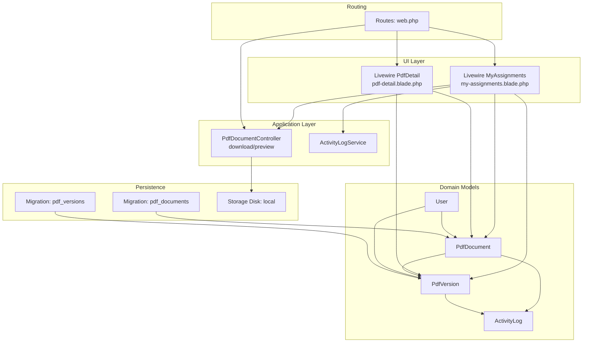
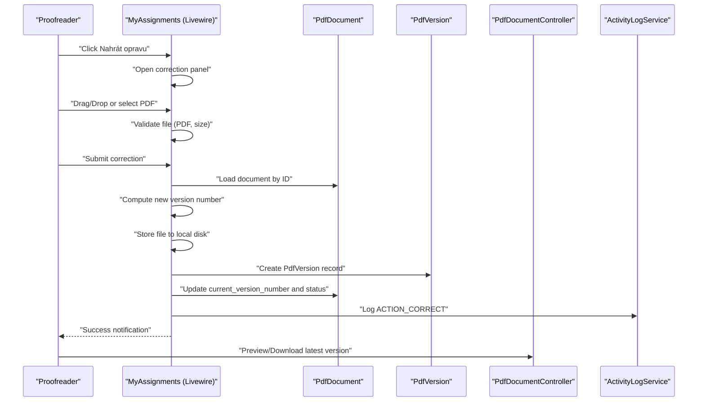
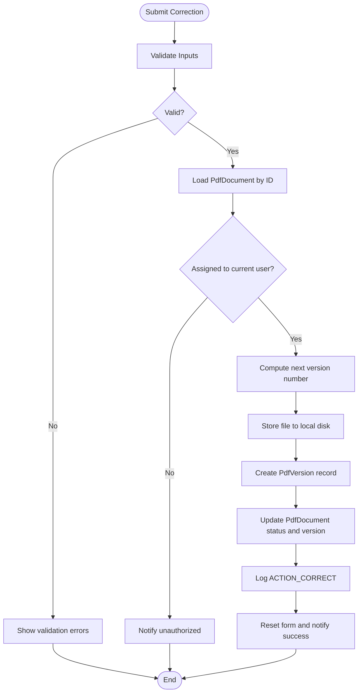
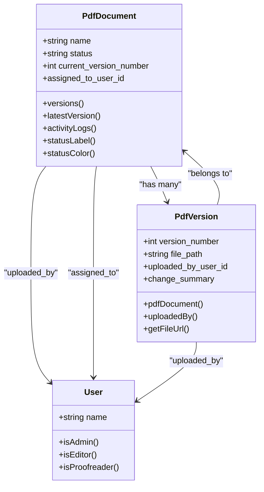
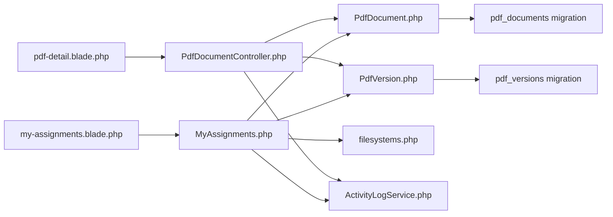

# Correction Submission

<cite>
**Referenced Files in This Document**
- [PdfDocumentController.php](file://app/Http/Controllers/PdfDocumentController.php)
- [MyAssignments.php](file://app/Livewire/MyAssignments.php)
- [PdfDetail.php](file://app/Livewire/PdfDetail.php)
- [PdfDocument.php](file://app/Models/PdfDocument.php)
- [PdfVersion.php](file://app/Models/PdfVersion.php)
- [2024_06_10_120000_create_pdf_documents_table.php](file://database/migrations/2024_06_10_120000_create_pdf_documents_table.php)
- [2024_06_10_130000_create_pdf_versions_table.php](file://database/migrations/2024_06_10_130000_create_pdf_versions_table.php)
- [my-assignments.blade.php](file://resources/views/livewire/my-assignments.blade.php)
- [pdf-detail.blade.php](file://resources/views/livewire/pdf-detail.blade.php)
- [web.php](file://routes/web.php)
- [filesystems.php](file://config/filesystems.php)
- [ActivityLogService.php](file://app/Services/ActivityLogService.php)
- [ActivityLog.php](file://app/Models/ActivityLog.php)
- [User.php](file://app/Models/User.php)
</cite>

## Table of Contents
1. [Introduction](#introduction)
2. [Project Structure](#project-structure)
3. [Core Components](#core-components)
4. [Architecture Overview](#architecture-overview)
5. [Detailed Component Analysis](#detailed-component-analysis)
6. [Dependency Analysis](#dependency-analysis)
7. [Performance Considerations](#performance-considerations)
8. [Troubleshooting Guide](#troubleshooting-guide)
9. [Conclusion](#conclusion)
10. [Appendices](#appendices)

## Introduction
This document explains the correction submission process for PDF documents within the application. It covers how proofreaders receive assigned documents, how corrections are uploaded and validated, how new document versions are created, and how statuses transition from assigned to completed or returned. It also documents the relationship between original documents and submitted corrections, file storage and organization, user interface interactions, and step-by-step workflows.

## Project Structure
The correction submission spans Livewire components for the UI, Eloquent models for persistence, controllers for download/preview, routes for navigation, and configuration for storage. The UI templates define drag-and-drop upload behavior and form controls for change summaries and revision returns.

**Diagram sources**
- [my-assignments.blade.php:1-155](file://resources/views/livewire/my-assignments.blade.php#L1-L155)
- [pdf-detail.blade.php:1-90](file://resources/views/livewire/pdf-detail.blade.php#L1-L90)
- [PdfDocumentController.php:1-82](file://app/Http/Controllers/PdfDocumentController.php#L1-L82)
- [MyAssignments.php:1-122](file://app/Livewire/MyAssignments.php#L1-L122)
- [PdfDetail.php:1-24](file://app/Livewire/PdfDetail.php#L1-L24)
- [PdfDocument.php:1-130](file://app/Models/PdfDocument.php#L1-L130)
- [PdfVersion.php:1-43](file://app/Models/PdfVersion.php#L1-L43)
- [ActivityLogService.php:1-31](file://app/Services/ActivityLogService.php#L1-L31)
- [ActivityLog.php:1-60](file://app/Models/ActivityLog.php#L1-L60)
- [2024_06_10_120000_create_pdf_documents_table.php:1-32](file://database/migrations/2024_06_10_120000_create_pdf_documents_table.php#L1-L32)
- [2024_06_10_130000_create_pdf_versions_table.php:1-29](file://database/migrations/2024_06_10_130000_create_pdf_versions_table.php#L1-L29)
- [web.php:1-54](file://routes/web.php#L1-L54)
- [filesystems.php:1-23](file://config/filesystems.php#L1-L23)

**Section sources**
- [my-assignments.blade.php:1-155](file://resources/views/livewire/my-assignments.blade.php#L1-L155)
- [pdf-detail.blade.php:1-90](file://resources/views/livewire/pdf-detail.blade.php#L1-L90)
- [PdfDocumentController.php:1-82](file://app/Http/Controllers/PdfDocumentController.php#L1-L82)
- [MyAssignments.php:1-122](file://app/Livewire/MyAssignments.php#L1-L122)
- [PdfDetail.php:1-24](file://app/Livewire/PdfDetail.php#L1-L24)
- [PdfDocument.php:1-130](file://app/Models/PdfDocument.php#L1-L130)
- [PdfVersion.php:1-43](file://app/Models/PdfVersion.php#L1-L43)
- [2024_06_10_120000_create_pdf_documents_table.php:1-32](file://database/migrations/2024_06_10_120000_create_pdf_documents_table.php#L1-L32)
- [2024_06_10_130000_create_pdf_versions_table.php:1-29](file://database/migrations/2024_06_10_130000_create_pdf_versions_table.php#L1-L29)
- [web.php:1-54](file://routes/web.php#L1-L54)
- [filesystems.php:1-23](file://config/filesystems.php#L1-L23)

## Core Components
- Livewire MyAssignments: Provides the correction submission UI, validation, and submission pipeline for proofreaders.
- Livewire PdfDetail: Displays document metadata, current status, version history, and download links.
- PdfDocumentController: Handles preview and download of PDF versions.
- PdfDocument and PdfVersion: Domain models representing documents and their versions.
- ActivityLogService and ActivityLog: Track actions such as correction uploads.
- Routes and Storage: Define endpoints and local disk storage configuration.

Key responsibilities:
- Validation: Ensures uploaded file is a PDF and under size limits; validates optional change summary length.
- Versioning: Creates a new PdfVersion with incremented version number and stores file path.
- Status transitions: Moves document status to completed or returned depending on user choice.
- Access control: Restricts operations to the assigned proofreader.

**Section sources**
- [MyAssignments.php:26-88](file://app/Livewire/MyAssignments.php#L26-L88)
- [PdfDocumentController.php:15-63](file://app/Http/Controllers/PdfDocumentController.php#L15-L63)
- [PdfDocument.php:14-128](file://app/Models/PdfDocument.php#L14-L128)
- [PdfVersion.php:13-41](file://app/Models/PdfVersion.php#L13-L41)
- [ActivityLogService.php:20-29](file://app/Services/ActivityLogService.php#L20-L29)
- [ActivityLog.php:46-58](file://app/Models/ActivityLog.php#L46-L58)

## Architecture Overview
The correction submission follows a client-driven UI flow via Livewire with server-side validation and persistence. The UI template integrates drag-and-drop upload and real-time feedback. On submit, the component validates inputs, creates a new version, updates the document’s current version and status, and records an activity log.

**Diagram sources**
- [my-assignments.blade.php:7-107](file://resources/views/livewire/my-assignments.blade.php#L7-L107)
- [MyAssignments.php:42-88](file://app/Livewire/MyAssignments.php#L42-L88)
- [PdfDocumentController.php:15-63](file://app/Http/Controllers/PdfDocumentController.php#L15-L63)
- [PdfDocument.php:56-65](file://app/Models/PdfDocument.php#L56-L65)
- [PdfVersion.php:13-19](file://app/Models/PdfVersion.php#L13-L19)
- [ActivityLogService.php:20-29](file://app/Services/ActivityLogService.php#L20-L29)

## Detailed Component Analysis

### Livewire MyAssignments: Correction Upload and Submission
Responsibilities:
- UI for selecting corrected PDF via file input or drag-and-drop.
- Validation rules for corrected PDF (type, size) and optional change summary.
- Submission pipeline: compute next version number, store file, create PdfVersion, update PdfDocument, and dispatch notifications.
- Optional “return for revision” toggles status to returned and clears assignment.

Validation rules:
- correctedPdf: required, file, mimes:pdf, max: 51200 KB.
- changeSummary: nullable, string, max: 1000 characters.

Submission logic highlights:
- Confirms assignment to current user before proceeding.
- Determines storage folder path based on title name and year-month, with version subfolder.
- Supports both temporary upload (wire:model) and direct upload via $wire.upload().
- Creates PdfVersion with uploaded_by_user_id and optional change summary.
- Updates PdfDocument: increments current_version_number, sets status to returned or completed, clears assignment if not returning.

Status transitions:
- Completed: when “return for revision” is unchecked.
- Returned: when “return for revision” is checked.

**Diagram sources**
- [MyAssignments.php:26-88](file://app/Livewire/MyAssignments.php#L26-L88)
- [my-assignments.blade.php:7-107](file://resources/views/livewire/my-assignments.blade.php#L7-L107)

**Section sources**
- [MyAssignments.php:26-88](file://app/Livewire/MyAssignments.php#L26-L88)
- [my-assignments.blade.php:7-107](file://resources/views/livewire/my-assignments.blade.php#L7-L107)

### Livewire PdfDetail: Document and Version History
Responsibilities:
- Displays document metadata, current status label and color, uploaded and assigned users.
- Lists historical versions with change summaries and timestamps.
- Provides quick links to preview and download latest or specific versions.

Integration with controller:
- Uses route helpers to generate preview and download URLs for the current document and specific versions.

**Section sources**
- [PdfDetail.php:14-22](file://app/Livewire/PdfDetail.php#L14-L22)
- [pdf-detail.blade.php:1-90](file://resources/views/livewire/pdf-detail.blade.php#L1-L90)
- [PdfDocumentController.php:39-62](file://app/Http/Controllers/PdfDocumentController.php#L39-L62)

### PdfDocument and PdfVersion Models
PdfDocument:
- Enumerated status values: uploaded, in_progress, returned, completed.
- Scopes for unassigned, assigned, archived, and editor-specific filtering.
- Helper methods for status label and color for UI rendering.
- Relations to Title, uploaded_by User, assigned_to User, versions, and activity logs.

PdfVersion:
- Belongs to PdfDocument and uploaded_by User.
- Provides a helper to generate download route for a specific version.

**Diagram sources**
- [PdfDocument.php:14-128](file://app/Models/PdfDocument.php#L14-L128)
- [PdfVersion.php:13-41](file://app/Models/PdfVersion.php#L13-L41)
- [User.php:56-70](file://app/Models/User.php#L56-L70)

**Section sources**
- [PdfDocument.php:14-128](file://app/Models/PdfDocument.php#L14-L128)
- [PdfVersion.php:13-41](file://app/Models/PdfVersion.php#L13-L41)
- [User.php:56-70](file://app/Models/User.php#L56-L70)

### PdfDocumentController: Preview and Download
Responsibilities:
- Validates access based on roles and assignment.
- Resolves the requested version (latest or specific) and serves the file.
- Logs view/download actions.

Preview:
- Returns inline PDF for browser preview.

Download:
- Streams the selected version for download.

Access checks:
- Admins can access any document.
- Editors who uploaded the document can access.
- Proofreaders assigned to the document can access.

**Section sources**
- [PdfDocumentController.php:15-63](file://app/Http/Controllers/PdfDocumentController.php#L15-L63)

### Routes and Storage
Routes:
- Expose endpoints for preview and download of PDF versions.
- Gate Livewire pages behind authentication and role middleware.

Storage:
- Local disk configured for storing files under storage/app.
- UI templates indicate drag-and-drop upload behavior and file type restrictions.

**Section sources**
- [web.php:38-41](file://routes/web.php#L38-L41)
- [filesystems.php:6-17](file://config/filesystems.php#L6-L17)
- [my-assignments.blade.php:34-74](file://resources/views/livewire/my-assignments.blade.php#L34-L74)

## Dependency Analysis
The correction submission process depends on:
- UI templates to collect inputs and trigger uploads.
- Livewire component to validate and persist data.
- Models to represent domain entities and enforce referential integrity.
- Controller to serve files and enforce access.
- Storage disk to persist files.
- Activity logging to track actions.

**Diagram sources**
- [my-assignments.blade.php:1-155](file://resources/views/livewire/my-assignments.blade.php#L1-L155)
- [MyAssignments.php:1-122](file://app/Livewire/MyAssignments.php#L1-L122)
- [PdfDocument.php:1-130](file://app/Models/PdfDocument.php#L1-L130)
- [PdfVersion.php:1-43](file://app/Models/PdfVersion.php#L1-L43)
- [PdfDocumentController.php:1-82](file://app/Http/Controllers/PdfDocumentController.php#L1-L82)
- [filesystems.php:1-23](file://config/filesystems.php#L1-L23)
- [ActivityLogService.php:1-31](file://app/Services/ActivityLogService.php#L1-L31)
- [2024_06_10_120000_create_pdf_documents_table.php:1-32](file://database/migrations/2024_06_10_120000_create_pdf_documents_table.php#L1-L32)
- [2024_06_10_130000_create_pdf_versions_table.php:1-29](file://database/migrations/2024_06_10_130000_create_pdf_versions_table.php#L1-L29)

**Section sources**
- [MyAssignments.php:1-122](file://app/Livewire/MyAssignments.php#L1-L122)
- [PdfDocumentController.php:1-82](file://app/Http/Controllers/PdfDocumentController.php#L1-L82)
- [PdfDocument.php:1-130](file://app/Models/PdfDocument.php#L1-L130)
- [PdfVersion.php:1-43](file://app/Models/PdfVersion.php#L1-L43)
- [2024_06_10_120000_create_pdf_documents_table.php:1-32](file://database/migrations/2024_06_10_120000_create_pdf_documents_table.php#L1-L32)
- [2024_06_10_130000_create_pdf_versions_table.php:1-29](file://database/migrations/2024_06_10_130000_create_pdf_versions_table.php#L1-L29)
- [filesystems.php:1-23](file://config/filesystems.php#L1-L23)

## Performance Considerations
- File size limit: enforced at 51200 KB to prevent large uploads from overwhelming storage and bandwidth.
- Single-file upload per submission: reduces concurrent write contention.
- Local disk storage: suitable for moderate loads; consider cloud storage for scalability.
- Version indexing: unique constraint on (pdf_document_id, version_number) ensures integrity but requires careful ordering when inserting.
- Pagination: Livewire lists use pagination to keep page loads responsive.

[No sources needed since this section provides general guidance]

## Troubleshooting Guide
Common issues and resolutions:
- Unauthorized access to a document:
  - Ensure the proofreader is assigned to the document; otherwise, submission is blocked.
  - Verify role-based middleware allows access to the correction page.
- File type or size errors:
  - Only PDFs are accepted; ensure the selected file has .pdf extension.
  - Reduce file size below the maximum allowed.
- Missing or corrupted file after download:
  - Confirm the file exists at the stored path; controller checks file existence before serving.
- Status not updating:
  - Verify the “return for revision” checkbox state determines whether the status becomes returned or completed.
- Notifications not appearing:
  - Ensure Livewire event dispatches are handled by the UI; reset events are triggered after successful submission.

**Section sources**
- [MyAssignments.php:48-51](file://app/Livewire/MyAssignments.php#L48-L51)
- [my-assignments.blade.php:23-26](file://resources/views/livewire/my-assignments.blade.php#L23-L26)
- [PdfDocumentController.php:35-37](file://app/Http/Controllers/PdfDocumentController.php#L35-L37)
- [PdfDocument.php:14-17](file://app/Models/PdfDocument.php#L14-L17)

## Conclusion
The correction submission process is centered around a robust Livewire component that enforces validation, manages file storage, creates new document versions, and updates document status. Access control ensures only assigned proofreaders can submit corrections. The UI provides intuitive drag-and-drop upload and clear feedback, while controllers and models maintain data integrity and auditability through activity logs.

[No sources needed since this section summarizes without analyzing specific files]

## Appendices

### Step-by-Step Submission Workflow
1. Navigate to the assignments page and open the correction panel for an assigned document.
2. Select or drag-and-drop a PDF file; the UI validates type and size.
3. Optionally enter a brief change summary and choose whether to return the document for further revision.
4. Submit the form; the system computes the next version number, stores the file, and creates a new PdfVersion.
5. The document’s current version number is updated, and its status is set accordingly.
6. An activity log entry is recorded for the correction.
7. Preview or download the newly submitted version via the document detail page.

**Section sources**
- [my-assignments.blade.php:7-107](file://resources/views/livewire/my-assignments.blade.php#L7-L107)
- [MyAssignments.php:42-88](file://app/Livewire/MyAssignments.php#L42-L88)
- [pdf-detail.blade.php:45-67](file://resources/views/livewire/pdf-detail.blade.php#L45-L67)

### File Storage and Organization
- Storage disk: local disk configured under storage/app.
- Folder structure: organized by title name, year-month, and version subfolder (e.g., pdfs/{title}/{YYYY-MM}/v{version}).
- File naming: uses a unique identifier combined with the original file name for uploaded PDFs.

**Section sources**
- [filesystems.php:6-17](file://config/filesystems.php#L6-L17)
- [MyAssignments.php:55-63](file://app/Livewire/MyAssignments.php#L55-L63)

### Relationship Between Original Documents and Submitted Corrections
- Each PdfDocument maintains a current_version_number and a collection of PdfVersion entries.
- New corrections increment the version number and create a new PdfVersion linked to the PdfDocument.
- The latest version is determined either by latest version number or by the current_version_number field.

**Section sources**
- [PdfDocument.php:56-65](file://app/Models/PdfDocument.php#L56-L65)
- [PdfVersion.php:13-19](file://app/Models/PdfVersion.php#L13-L19)