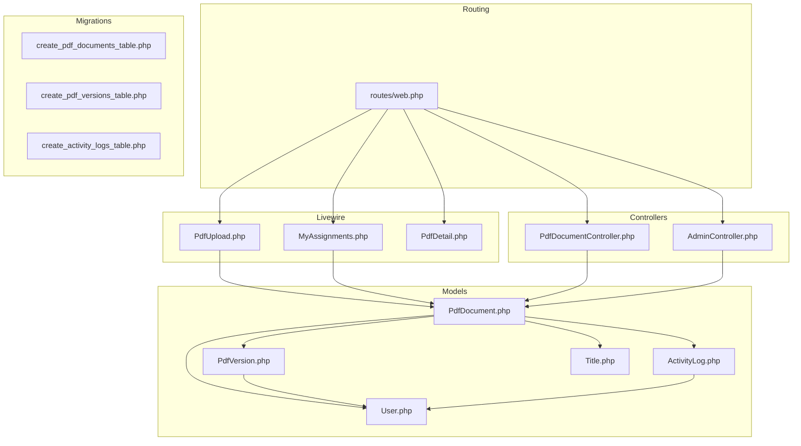
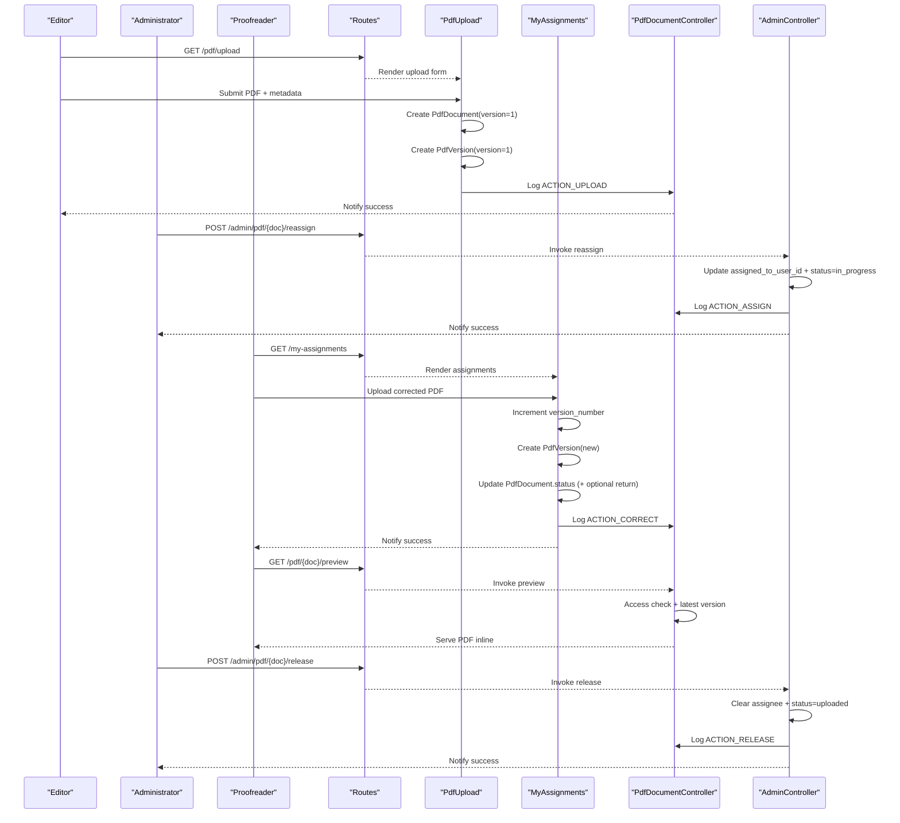
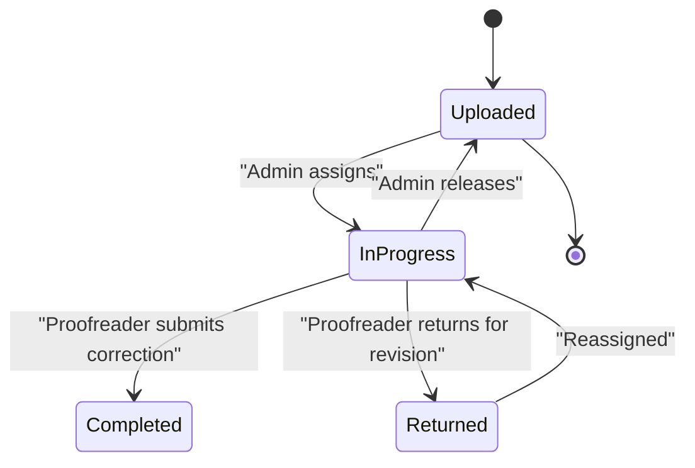
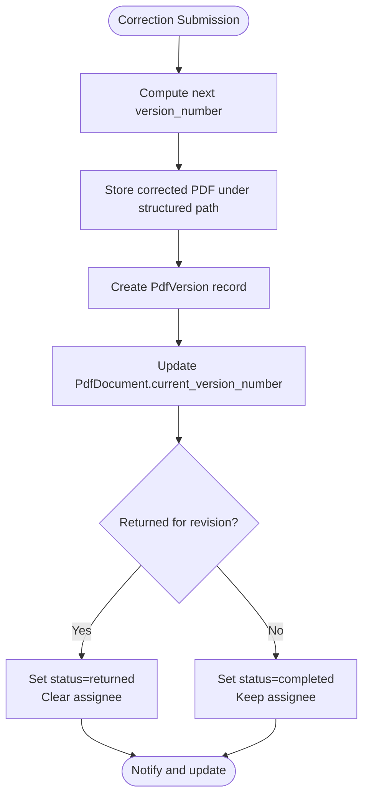
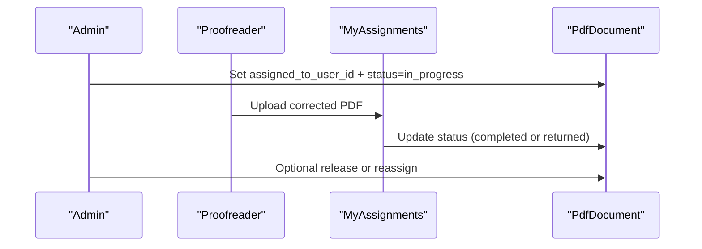
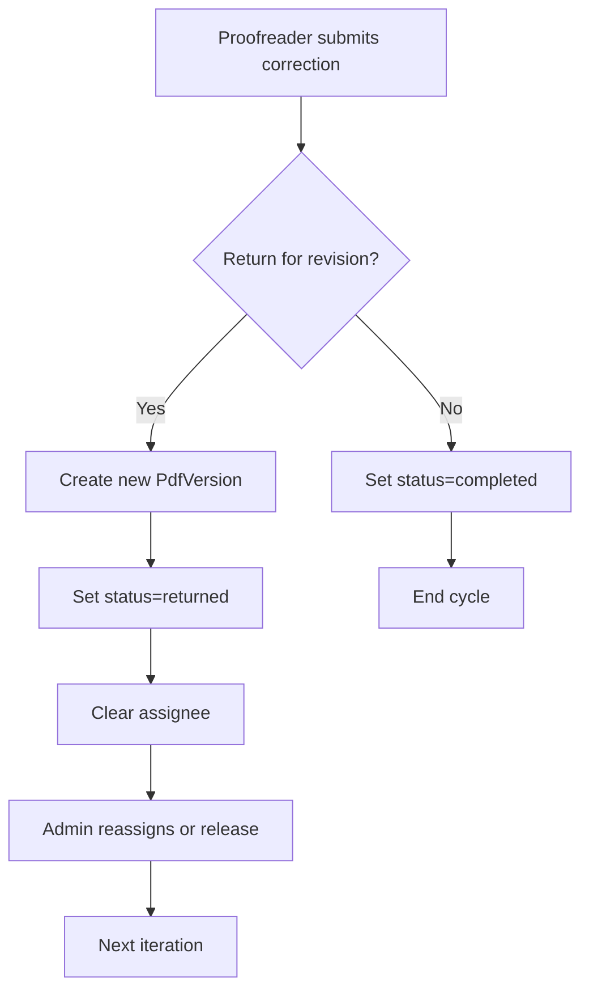
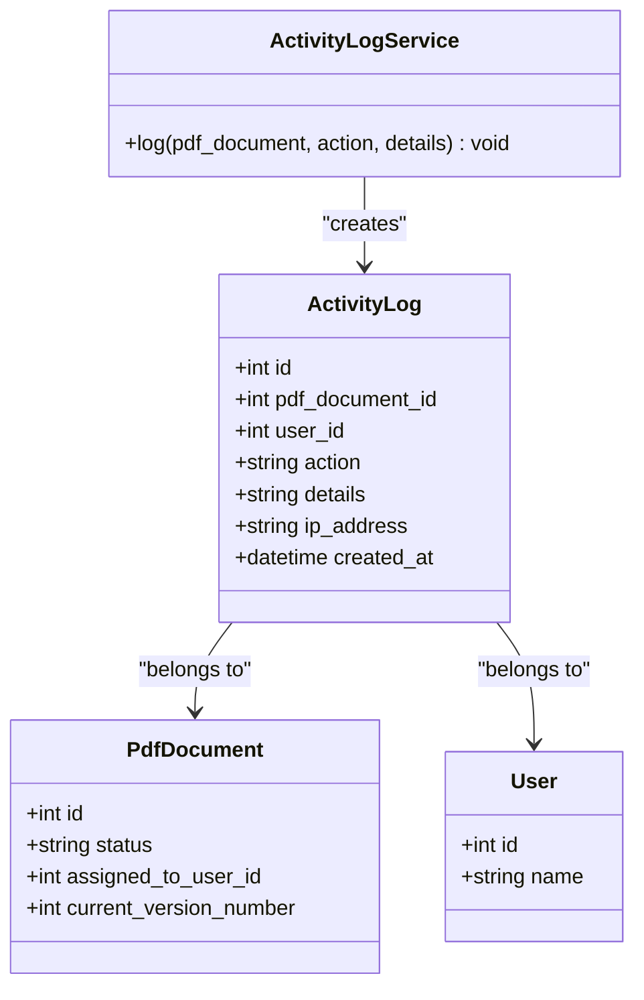
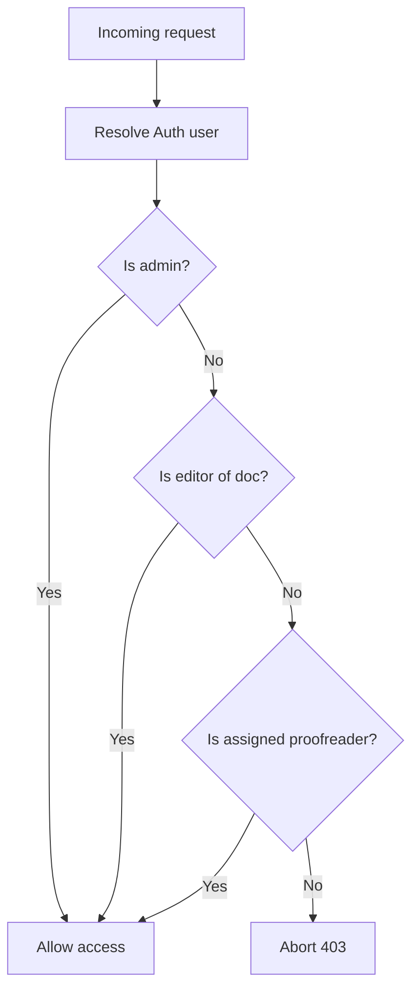
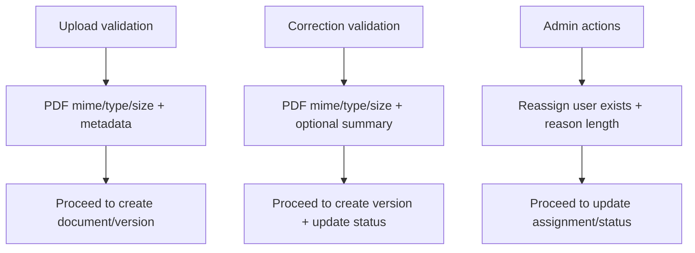
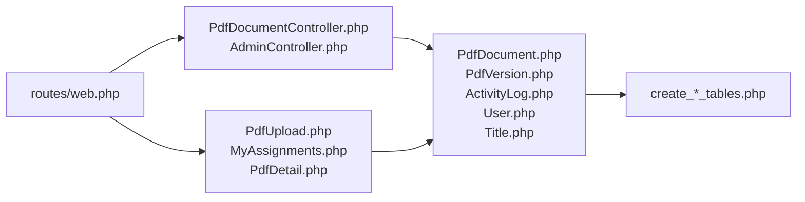

# Correction Workflow

<cite>
**Referenced Files in This Document**
- [web.php](file://routes/web.php)
- [PdfDocumentController.php](file://app/Http/Controllers/PdfDocumentController.php)
- [AdminController.php](file://app/Http/Controllers/AdminController.php)
- [PdfDocument.php](file://app/Models/PdfDocument.php)
- [PdfVersion.php](file://app/Models/PdfVersion.php)
- [ActivityLog.php](file://app/Models/ActivityLog.php)
- [ActivityLogService.php](file://app/Services/ActivityLogService.php)
- [PdfUpload.php](file://app/Livewire/PdfUpload.php)
- [MyAssignments.php](file://app/Livewire/MyAssignments.php)
- [PdfDetail.php](file://app/Livewire/PdfDetail.php)
- [User.php](file://app/Models/User.php)
- [Title.php](file://app/Models/Title.php)
- [2024_06_10_120000_create_pdf_documents_table.php](file://database/migrations/2024_06_10_120000_create_pdf_documents_table.php)
- [2024_06_10_130000_create_pdf_versions_table.php](file://database/migrations/2024_06_10_130000_create_pdf_versions_table.php)
- [2024_06_10_140000_create_activity_logs_table.php](file://database/migrations/2024_06_10_140000_create_activity_logs_table.php)
</cite>

## Table of Contents
1. [Introduction](#introduction)
2. [Project Structure](#project-structure)
3. [Core Components](#core-components)
4. [Architecture Overview](#architecture-overview)
5. [Detailed Component Analysis](#detailed-component-analysis)
6. [Dependency Analysis](#dependency-analysis)
7. [Performance Considerations](#performance-considerations)
8. [Troubleshooting Guide](#troubleshooting-guide)
9. [Conclusion](#conclusion)

## Introduction
This document describes the end-to-end correction workflow for PDF documents within the system. It covers how assignments are received, how corrections are submitted and tracked, how versions are managed, how approvals and reviews are handled across multiple stakeholders, and how activity is logged and audited. It also outlines status management, return-for-revision handling, iterative cycles, quality assurance checkpoints, and notification triggers.

## Project Structure
The correction workflow spans routing, controllers, Livewire components, Eloquent models, and database migrations. Key areas:
- Routes define access by role and expose endpoints for uploads, previews, downloads, and administrative actions.
- Controllers handle document access checks, file delivery, and administrative reassignment/release.
- Livewire components implement the upload, assignment, correction, and detail views.
- Models encapsulate business logic for statuses, roles, and relationships.
- Migrations define the persistent schema for documents, versions, and activity logs.

**Diagram sources**
- [web.php:25-53](file://routes/web.php#L25-L53)
- [PdfDocumentController.php:13-82](file://app/Http/Controllers/PdfDocumentController.php#L13-L82)
- [AdminController.php:11-62](file://app/Http/Controllers/AdminController.php#L11-L62)
- [PdfUpload.php:16-96](file://app/Livewire/PdfUpload.php#L16-L96)
- [MyAssignments.php:16-122](file://app/Livewire/MyAssignments.php#L16-L122)
- [PdfDetail.php:10-24](file://app/Livewire/PdfDetail.php#L10-L24)
- [PdfDocument.php:10-130](file://app/Models/PdfDocument.php#L10-L130)
- [PdfVersion.php:9-43](file://app/Models/PdfVersion.php#L9-L43)
- [ActivityLog.php:9-60](file://app/Models/ActivityLog.php#L9-L60)
- [User.php:10-71](file://app/Models/User.php#L10-L71)
- [Title.php:9-31](file://app/Models/Title.php#L9-L31)
- [2024_06_10_120000_create_pdf_documents_table.php:7-32](file://database/migrations/2024_06_10_120000_create_pdf_documents_table.php#L7-L32)
- [2024_06_10_130000_create_pdf_versions_table.php:7-29](file://database/migrations/2024_06_10_130000_create_pdf_versions_table.php#L7-L29)
- [2024_06_10_140000_create_activity_logs_table.php:7-27](file://database/migrations/2024_06_10_140000_create_activity_logs_table.php#L7-L27)

**Section sources**
- [web.php:25-53](file://routes/web.php#L25-L53)

## Core Components
- PdfDocument: Tracks metadata, status, assignment, current version, and archived state. Provides scopes for filtering and helpers for status labels/colors.
- PdfVersion: Represents a single saved version of a document with change summary and file path.
- ActivityLogService: Centralized logging of user actions with IP and context.
- PdfUpload (Livewire): Handles initial upload, folder structure creation, and first version creation.
- MyAssignments (Livewire): Manages correction submission, return-for-revision, version increment, and status transitions.
- PdfDocumentController: Enforces access control and serves preview/download for versions.
- AdminController: Supports administrative release and reassignment of documents.
- Routes: Define role-based access and named endpoints.

**Section sources**
- [PdfDocument.php:14-128](file://app/Models/PdfDocument.php#L14-L128)
- [PdfVersion.php:13-41](file://app/Models/PdfVersion.php#L13-L41)
- [ActivityLogService.php:10-31](file://app/Services/ActivityLogService.php#L10-L31)
- [PdfUpload.php:47-87](file://app/Livewire/PdfUpload.php#L47-L87)
- [MyAssignments.php:42-88](file://app/Livewire/MyAssignments.php#L42-L88)
- [PdfDocumentController.php:15-63](file://app/Http/Controllers/PdfDocumentController.php#L15-L63)
- [AdminController.php:13-60](file://app/Http/Controllers/AdminController.php#L13-L60)
- [web.php:25-53](file://routes/web.php#L25-L53)

## Architecture Overview
The workflow is role-driven:
- Editors upload PDFs and create the initial version.
- Administrators assign documents to proofreaders.
- Proofreaders receive assignments, apply corrections, optionally return for revision, and mark as completed.
- Administrators can release or reassign documents.
- Access control ensures only authorized users can view, download, or modify documents.
- Activity logs capture every action for auditability.

**Diagram sources**
- [web.php:28-52](file://routes/web.php#L28-L52)
- [PdfUpload.php:47-87](file://app/Livewire/PdfUpload.php#L47-L87)
- [MyAssignments.php:42-88](file://app/Livewire/MyAssignments.php#L42-L88)
- [PdfDocumentController.php:15-63](file://app/Http/Controllers/PdfDocumentController.php#L15-L63)
- [AdminController.php:13-60](file://app/Http/Controllers/AdminController.php#L13-L60)

## Detailed Component Analysis

### Status Management and Lifecycle
- Statuses: uploaded, in_progress, returned, completed.
- Transitions:
  - Uploaded by editor → in_progress upon assignment.
  - In progress → completed or returned depending on correction outcome.
  - Returned → reassignment or release back to pool.
  - Release clears assignee and resets status to uploaded.
- Helpers provide localized labels and color indicators for UI rendering.

**Diagram sources**
- [PdfDocument.php:14-18](file://app/Models/PdfDocument.php#L14-L18)
- [PdfDocument.php:108-128](file://app/Models/PdfDocument.php#L108-L128)
- [MyAssignments.php:73-77](file://app/Livewire/MyAssignments.php#L73-L77)
- [AdminController.php:25-28](file://app/Http/Controllers/AdminController.php#L25-L28)

**Section sources**
- [PdfDocument.php:14-18](file://app/Models/PdfDocument.php#L14-L18)
- [PdfDocument.php:108-128](file://app/Models/PdfDocument.php#L108-L128)
- [MyAssignments.php:73-77](file://app/Livewire/MyAssignments.php#L73-L77)
- [AdminController.php:25-28](file://app/Http/Controllers/AdminController.php#L25-L28)

### Version Management and History
- Each correction creates a new PdfVersion with incremented version_number.
- Storage path is organized by title/year-month and version number.
- Latest version is determined by current_version_number on PdfDocument.
- Access to specific versions is supported via download endpoint.

**Diagram sources**
- [MyAssignments.php:53-77](file://app/Livewire/MyAssignments.php#L53-L77)
- [PdfVersion.php:13-19](file://app/Models/PdfVersion.php#L13-L19)
- [PdfDocument.php:61-65](file://app/Models/PdfDocument.php#L61-L65)

**Section sources**
- [MyAssignments.php:53-77](file://app/Livewire/MyAssignments.php#L53-L77)
- [PdfVersion.php:13-19](file://app/Models/PdfVersion.php#L13-L19)
- [PdfDocument.php:61-65](file://app/Models/PdfDocument.php#L61-L65)

### Review and Approval Workflow
- Assignment: Admin sets assigned_to_user_id and status=in_progress.
- Correction: Proofreader uploads corrected PDF; system increments version and updates status.
- Return for revision: Proofreader selects return; document moves back to returned and clears assignee.
- Completion: If not returned, document remains assigned and marks as completed.
- Administrative oversight: Admin can release or reassign at any time.

**Diagram sources**
- [AdminController.php:39-60](file://app/Http/Controllers/AdminController.php#L39-L60)
- [MyAssignments.php:73-77](file://app/Livewire/MyAssignments.php#L73-L77)

**Section sources**
- [AdminController.php:39-60](file://app/Http/Controllers/AdminController.php#L39-L60)
- [MyAssignments.php:73-77](file://app/Livewire/MyAssignments.php#L73-L77)

### Return for Revision Handling and Iterative Cycles
- When returning for revision, the system:
  - Creates a new version with incremented version_number.
  - Sets status to returned.
  - Clears assigned_to_user_id.
- The document re-enters the pool and can be reassigned to the same or another proofreader.
- This enables iterative cycles until completion.

**Diagram sources**
- [MyAssignments.php:73-77](file://app/Livewire/MyAssignments.php#L73-L77)

**Section sources**
- [MyAssignments.php:73-77](file://app/Livewire/MyAssignments.php#L73-L77)

### Activity Logging and Auditing
- Logged actions include upload, assign, release, correct, archive, view, download.
- Each log captures user, action, details, and IP address.
- Activity logs are associated with documents and users for traceability.

**Diagram sources**
- [ActivityLog.php:13-27](file://app/Models/ActivityLog.php#L13-L27)
- [ActivityLogService.php:20-29](file://app/Services/ActivityLogService.php#L20-L29)
- [PdfDocument.php:46-54](file://app/Models/PdfDocument.php#L46-L54)
- [User.php:51-54](file://app/Models/User.php#L51-L54)

**Section sources**
- [ActivityLogService.php:10-31](file://app/Services/ActivityLogService.php#L10-L31)
- [ActivityLog.php:13-27](file://app/Models/ActivityLog.php#L13-L27)

### Access Control and Security
- Access checks enforce role-based permissions:
  - Admins can access all documents.
  - Editors can access documents they uploaded.
  - Proofreaders can access documents assigned to them.
- Download and preview endpoints validate access before serving content.

**Diagram sources**
- [PdfDocumentController.php:65-80](file://app/Http/Controllers/PdfDocumentController.php#L65-L80)
- [User.php:56-69](file://app/Models/User.php#L56-L69)

**Section sources**
- [PdfDocumentController.php:65-80](file://app/Http/Controllers/PdfDocumentController.php#L65-L80)
- [User.php:56-69](file://app/Models/User.php#L56-L69)

### Quality Assurance and Validation
- Initial upload validates file type, size, and metadata.
- Correction submission validates file type, size, and optional change summary.
- Administrative actions validate inputs (e.g., user exists for reassign, reason length).
- Access control prevents unauthorized modifications.

**Diagram sources**
- [PdfUpload.php:27-34](file://app/Livewire/PdfUpload.php#L27-L34)
- [MyAssignments.php:26-29](file://app/Livewire/MyAssignments.php#L26-L29)
- [AdminController.php:15-17](file://app/Http/Controllers/AdminController.php#L15-L17)

**Section sources**
- [PdfUpload.php:27-34](file://app/Livewire/PdfUpload.php#L27-L34)
- [MyAssignments.php:26-29](file://app/Livewire/MyAssignments.php#L26-L29)
- [AdminController.php:15-17](file://app/Http/Controllers/AdminController.php#L15-L17)

### Notification Triggers
- After successful actions, Livewire dispatches frontend notifications:
  - Reset dropzones after uploads.
  - Success/error notifications for correction submissions and releases.
- These events drive user feedback without page reloads.

**Section sources**
- [PdfUpload.php:84-86](file://app/Livewire/PdfUpload.php#L84-L86)
- [MyAssignments.php:85-87](file://app/Livewire/MyAssignments.php#L85-L87)
- [MyAssignments.php:99-106](file://app/Livewire/MyAssignments.php#L99-L106)

## Dependency Analysis
The system exhibits clear separation of concerns:
- Routes depend on controllers and Livewire components.
- Controllers depend on models and services.
- Livewire components orchestrate user interactions and persist data via models.
- Models encapsulate domain logic and relationships.
- Migrations define schema and constraints.

**Diagram sources**
- [web.php:25-53](file://routes/web.php#L25-L53)
- [PdfDocumentController.php:5-11](file://app/Http/Controllers/PdfDocumentController.php#L5-L11)
- [AdminController.php:5-7](file://app/Http/Controllers/AdminController.php#L5-L7)
- [PdfUpload.php:5-8](file://app/Livewire/PdfUpload.php#L5-L8)
- [MyAssignments.php:5-8](file://app/Livewire/MyAssignments.php#L5-L8)
- [PdfDetail.php:5](file://app/Livewire/PdfDetail.php#L5)
- [PdfDocument.php:5-8](file://app/Models/PdfDocument.php#L5-L8)
- [PdfVersion.php:5-7](file://app/Models/PdfVersion.php#L5-L7)
- [ActivityLog.php:5-7](file://app/Models/ActivityLog.php#L5-L7)
- [User.php:6-8](file://app/Models/User.php#L6-L8)
- [Title.php:7](file://app/Models/Title.php#L7)
- [2024_06_10_120000_create_pdf_documents_table.php:11-24](file://database/migrations/2024_06_10_120000_create_pdf_documents_table.php#L11-L24)
- [2024_06_10_130000_create_pdf_versions_table.php:11-21](file://database/migrations/2024_06_10_130000_create_pdf_versions_table.php#L11-L21)
- [2024_06_10_140000_create_activity_logs_table.php:11-19](file://database/migrations/2024_06_10_140000_create_activity_logs_table.php#L11-L19)

**Section sources**
- [web.php:25-53](file://routes/web.php#L25-L53)

## Performance Considerations
- File storage paths are structured by title and year-month to prevent directory bloat and simplify cleanup.
- Unique constraint on (pdf_document_id, version_number) prevents duplicate versions.
- Pagination in assignment listing limits payload size for large workloads.
- Inline preview avoids unnecessary downloads; download uses streamed response for large files.

[No sources needed since this section provides general guidance]

## Troubleshooting Guide
Common issues and resolutions:
- Access denied errors: Verify user role and assignment ownership; ensure access checks pass before serving content.
- File not found during download: Confirm file_path exists in storage and matches the requested version.
- Incorrect version retrieval: Ensure current_version_number matches the intended version and ordering is correct.
- Duplicate version errors: Check unique constraint on (document, version_number) and increment logic.
- Administrative actions failing: Validate inputs (user exists, reason length) and confirm document is assigned.

**Section sources**
- [PdfDocumentController.php:19-40](file://app/Http/Controllers/PdfDocumentController.php#L19-L40)
- [PdfDocumentController.php:46-63](file://app/Http/Controllers/PdfDocumentController.php#L46-L63)
- [PdfVersion.php:20](file://app/Models/PdfVersion.php#L20)
- [MyAssignments.php:53-77](file://app/Livewire/MyAssignments.php#L53-L77)
- [AdminController.php:15-17](file://app/Http/Controllers/AdminController.php#L15-L17)

## Conclusion
The system provides a robust, role-aware correction workflow with explicit status management, version control, and comprehensive activity auditing. Administrative controls enable oversight, while iterative return-for-revision supports quality outcomes. Access control and validation ensure secure and reliable operation across the lifecycle.