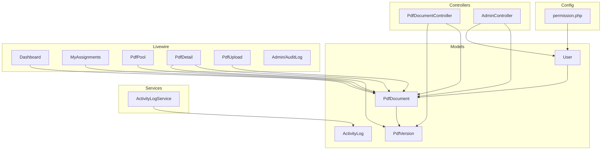
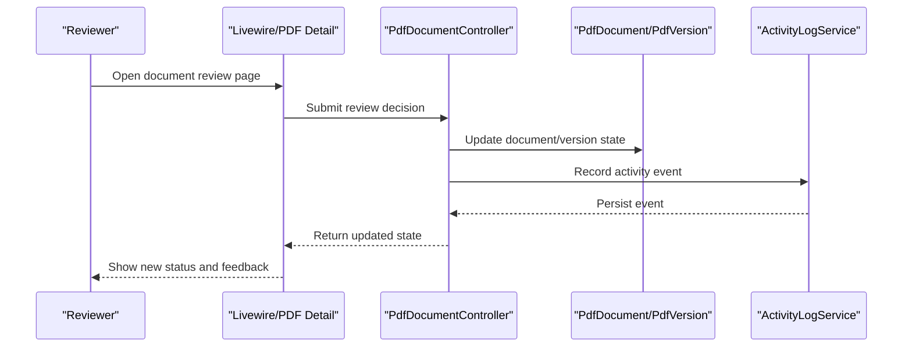
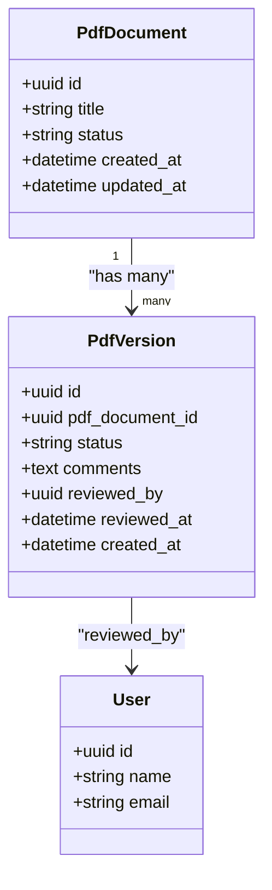
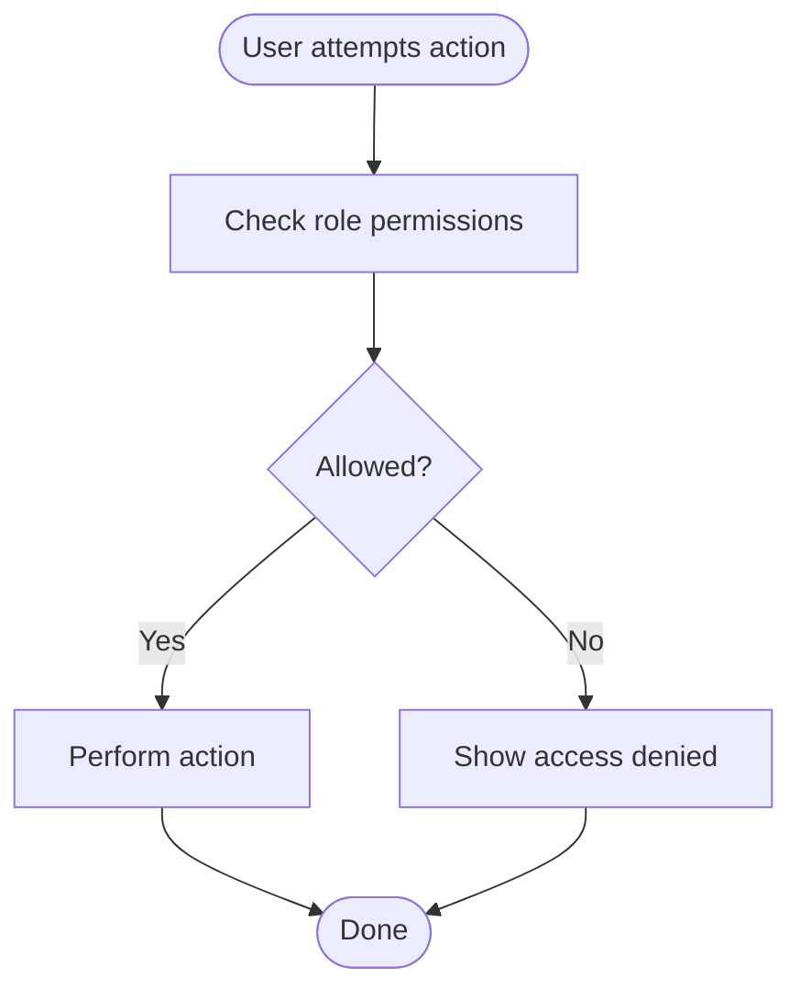
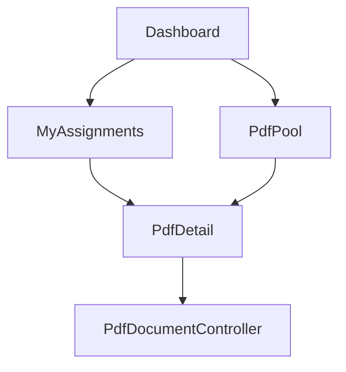
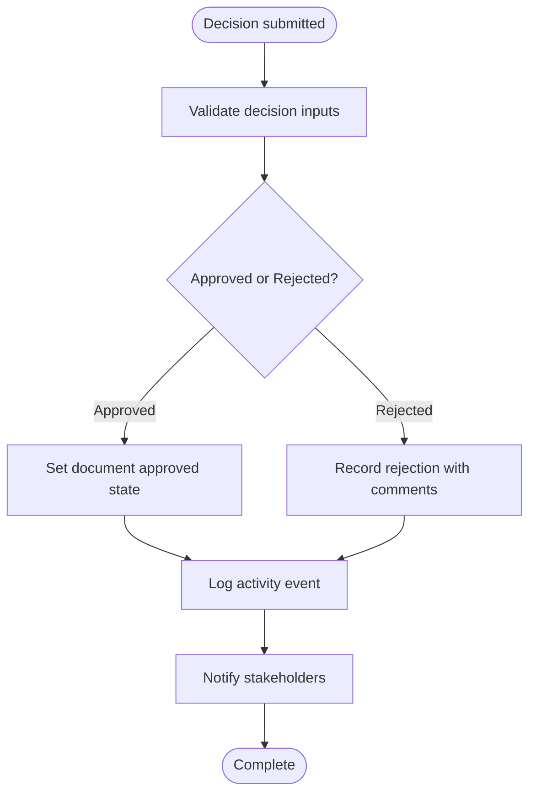
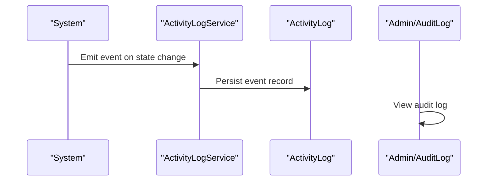
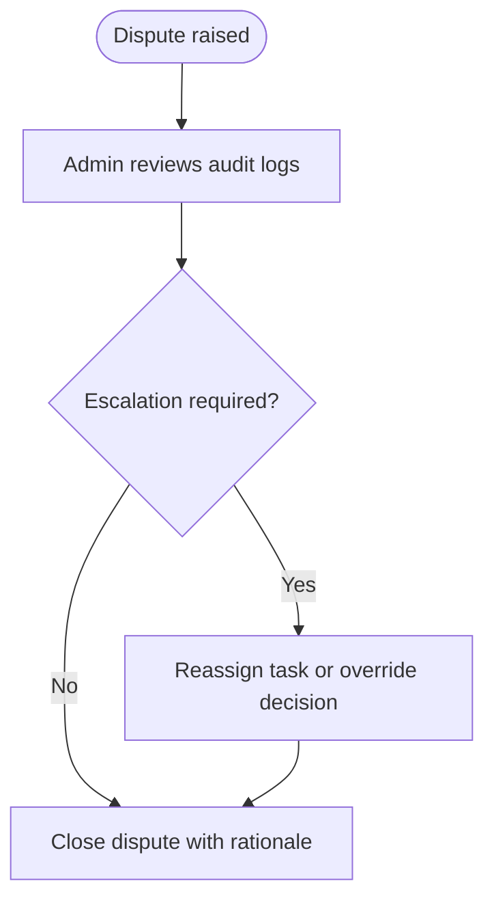
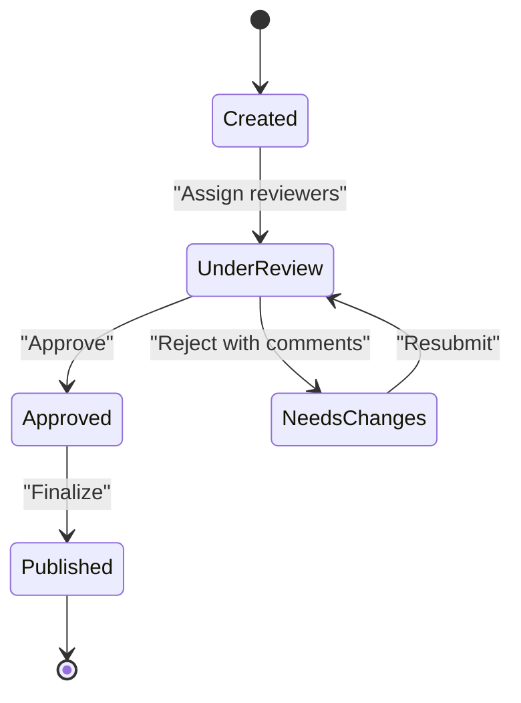
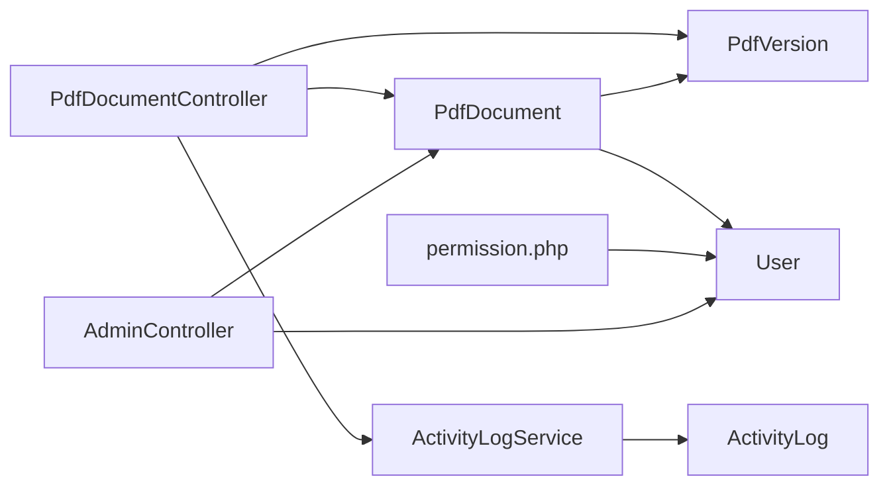

# Review and Approval

<cite>
**Referenced Files in This Document**
- [PdfDocument.php](file://pdf-korektura/app/Models/PdfDocument.php)
- [PdfVersion.php](file://pdf-korektura/app/Models/PdfVersion.php)
- [PdfDocumentController.php](file://pdf-korektura/app/Http/Controllers/PdfDocumentController.php)
- [User.php](file://pdf-korektura/app/Models/User.php)
- [permission.php](file://pdf-korektura/config/permission.php)
- [ActivityLog.php](file://pdf-korektura/app/Models/ActivityLog.php)
- [ActivityLogService.php](file://pdf-korektura/app/Services/ActivityLogService.php)
- [AdminController.php](file://pdf-korektura/app/Http/Controllers/AdminController.php)
- [Dashboard.php](file://pdf-korektura/app/Livewire/Dashboard.php)
- [MyAssignments.php](file://pdf-korektura/app/Livewire/MyAssignments.php)
- [PdfDetail.php](file://pdf-korektura/app/Livewire/PdfDetail.php)
- [PdfPool.php](file://pdf-korektura/app/Livewire/PdfPool.php)
- [PdfUpload.php](file://pdf-korektura/app/Livewire/PdfUpload.php)
- [AuditLog.php](file://pdf-korektura/app/Livewire/Admin/AuditLog.php)
- [archive.blade.php](file://pdf-korektura/resources/views/livewire/admin/archive.blade.php)
- [audit-log.blade.php](file://pdf-korektura/resources/views/livewire/admin/audit-log.blade.php)
- [dashboard.blade.php](file://pdf-korektura/resources/views/livewire/dashboard.blade.php)
- [my-assignments.blade.php](file://pdf-korektura/resources/views/livewire/my-assignments.blade.php)
- [pdf-detail.blade.php](file://pdf-korektura/resources/views/livewire/pdf-detail.blade.php)
- [pdf-pool.blade.php](file://pdf-korektura/resources/views/livewire/pdf-pool.blade.php)
- [pdf-upload.blade.php](file://pdf-korektura/resources/views/livewire/pdf-upload.blade.php)
- [login.blade.php](file://pdf-korektura/resources/views/auth/login.blade.php)
- [web.php](file://pdf-korektura/routes/web.php)
- [AppServiceProvider.php](file://pdf-korektura/app/Providers/AppServiceProvider.php)
</cite>

## Table of Contents
1. [Introduction](#introduction)
2. [Project Structure](#project-structure)
3. [Core Components](#core-components)
4. [Architecture Overview](#architecture-overview)
5. [Detailed Component Analysis](#detailed-component-analysis)
6. [Dependency Analysis](#dependency-analysis)
7. [Performance Considerations](#performance-considerations)
8. [Troubleshooting Guide](#troubleshooting-guide)
9. [Conclusion](#conclusion)
10. [Appendices](#appendices)

## Introduction
This document describes the review and approval workflow for documents within the system. It covers the multi-stakeholder process among editors and proofreaders, approval criteria and quality standards, review interface and feedback mechanisms, decision-making and rejection workflows, notifications for status changes and assignments, role-based permissions, quality assurance checkpoints, escalation procedures for disputed reviews, and how review status integrates with overall document workflow progression.

## Project Structure
The system is a Laravel application with Livewire components for the frontend and Eloquent models for persistence. Key areas relevant to review and approval include:
- Models for documents and versions
- Controllers for document operations
- Livewire components for dashboards, assignment pools, and document detail views
- Permission configuration for role-based access
- Activity logging for audit trails

**Diagram sources**
- [PdfDocument.php](file://pdf-korektura/app/Models/PdfDocument.php)
- [PdfVersion.php](file://pdf-korektura/app/Models/PdfVersion.php)
- [PdfDocumentController.php](file://pdf-korektura/app/Http/Controllers/PdfDocumentController.php)
- [User.php](file://pdf-korektura/app/Models/User.php)
- [ActivityLog.php](file://pdf-korektura/app/Models/ActivityLog.php)
- [ActivityLogService.php](file://pdf-korektura/app/Services/ActivityLogService.php)
- [AdminController.php](file://pdf-korektura/app/Http/Controllers/AdminController.php)
- [Dashboard.php](file://pdf-korektura/app/Livewire/Dashboard.php)
- [MyAssignments.php](file://pdf-korektura/app/Livewire/MyAssignments.php)
- [PdfPool.php](file://pdf-korektura/app/Livewire/PdfPool.php)
- [PdfDetail.php](file://pdf-korektura/app/Livewire/PdfDetail.php)
- [PdfUpload.php](file://pdf-korektura/app/Livewire/PdfUpload.php)
- [AuditLog.php](file://pdf-korektura/app/Livewire/Admin/AuditLog.php)
- [permission.php](file://pdf-korektura/config/permission.php)

**Section sources**
- [PdfDocument.php](file://pdf-korektura/app/Models/PdfDocument.php)
- [PdfVersion.php](file://pdf-korektura/app/Models/PdfVersion.php)
- [PdfDocumentController.php](file://pdf-korektura/app/Http/Controllers/PdfDocumentController.php)
- [User.php](file://pdf-korektura/app/Models/User.php)
- [permission.php](file://pdf-korektura/config/permission.php)
- [ActivityLog.php](file://pdf-korektura/app/Models/ActivityLog.php)
- [ActivityLogService.php](file://pdf-korektura/app/Services/ActivityLogService.php)
- [AdminController.php](file://pdf-korektura/app/Http/Controllers/AdminController.php)
- [Dashboard.php](file://pdf-korektura/app/Livewire/Dashboard.php)
- [MyAssignments.php](file://pdf-korektura/app/Livewire/MyAssignments.php)
- [PdfPool.php](file://pdf-korektura/app/Livewire/PdfPool.php)
- [PdfDetail.php](file://pdf-korektura/app/Livewire/PdfDetail.php)
- [PdfUpload.php](file://pdf-korektura/app/Livewire/PdfUpload.php)
- [AuditLog.php](file://pdf-korektura/app/Livewire/Admin/AuditLog.php)

## Core Components
- PdfDocument: Represents a document with metadata and current workflow state. It maintains relationships to versions and users.
- PdfVersion: Represents individual versions of a document, capturing review and approval history.
- PdfDocumentController: Orchestrates document lifecycle actions such as creation, updates, and transitions.
- User: Authenticates stakeholders and enforces role-based permissions via the permission configuration.
- ActivityLog and ActivityLogService: Track and persist activity events for auditability.
- Livewire components: Provide the UI for dashboards, assignment pools, document detail, uploads, and admin audit logs.

Key responsibilities:
- Maintain document state transitions during review and approval.
- Enforce role-based access for editors, proofreaders, and administrators.
- Record and expose audit trails for compliance and dispute resolution.
- Surface actionable items for reviewers and administrators.

**Section sources**
- [PdfDocument.php](file://pdf-korektura/app/Models/PdfDocument.php)
- [PdfVersion.php](file://pdf-korektura/app/Models/PdfVersion.php)
- [PdfDocumentController.php](file://pdf-korektura/app/Http/Controllers/PdfDocumentController.php)
- [User.php](file://pdf-korektura/app/Models/User.php)
- [ActivityLog.php](file://pdf-korektura/app/Models/ActivityLog.php)
- [ActivityLogService.php](file://pdf-korektura/app/Services/ActivityLogService.php)

## Architecture Overview
The review and approval workflow spans models, controllers, Livewire components, and services. Users log in, navigate dashboards, receive assignments, review documents, and submit approvals or rejections. Administrators manage users and audit logs. Activity logs capture all significant actions.

**Diagram sources**
- [PdfDetail.php](file://pdf-korektura/app/Livewire/PdfDetail.php)
- [PdfDocumentController.php](file://pdf-korektura/app/Http/Controllers/PdfDocumentController.php)
- [PdfDocument.php](file://pdf-korektura/app/Models/PdfDocument.php)
- [PdfVersion.php](file://pdf-korektura/app/Models/PdfVersion.php)
- [ActivityLogService.php](file://pdf-korektura/app/Services/ActivityLogService.php)

## Detailed Component Analysis

### Document and Version Models
PdfDocument encapsulates document metadata and current workflow state. PdfVersion captures historical states and reviewer actions. Together they form the backbone of the review and approval record.

**Diagram sources**
- [PdfDocument.php](file://pdf-korektura/app/Models/PdfDocument.php)
- [PdfVersion.php](file://pdf-korektura/app/Models/PdfVersion.php)
- [User.php](file://pdf-korektura/app/Models/User.php)

**Section sources**
- [PdfDocument.php](file://pdf-korektura/app/Models/PdfDocument.php)
- [PdfVersion.php](file://pdf-korektura/app/Models/PdfVersion.php)
- [User.php](file://pdf-korektura/app/Models/User.php)

### Role-Based Permissions and Access Control
Role-based permissions are configured centrally. Users are assigned roles that determine visibility and actions within the system. Administrative controls allow managing users and reviewing audit logs.

**Diagram sources**
- [permission.php](file://pdf-korektura/config/permission.php)
- [User.php](file://pdf-korektura/app/Models/User.php)
- [AdminController.php](file://pdf-korektura/app/Http/Controllers/AdminController.php)

**Section sources**
- [permission.php](file://pdf-korektura/config/permission.php)
- [User.php](file://pdf-korektura/app/Models/User.php)
- [AdminController.php](file://pdf-korektura/app/Http/Controllers/AdminController.php)

### Review Interface and Feedback Mechanisms
Reviewers interact with Livewire components to assess documents. The PDF detail view presents document content and review controls. Assignment pools surface documents awaiting review. Dashboards summarize progress and outstanding tasks.

**Diagram sources**
- [Dashboard.php](file://pdf-korektura/app/Livewire/Dashboard.php)
- [MyAssignments.php](file://pdf-korektura/app/Livewire/MyAssignments.php)
- [PdfPool.php](file://pdf-korektura/app/Livewire/PdfPool.php)
- [PdfDetail.php](file://pdf-korektura/app/Livewire/PdfDetail.php)
- [PdfDocumentController.php](file://pdf-korektura/app/Http/Controllers/PdfDocumentController.php)

**Section sources**
- [dashboard.blade.php](file://pdf-korektura/resources/views/livewire/dashboard.blade.php)
- [my-assignments.blade.php](file://pdf-korektura/resources/views/livewire/my-assignments.blade.php)
- [pdf-pool.blade.php](file://pdf-korektura/resources/views/livewire/pdf-pool.blade.php)
- [pdf-detail.blade.php](file://pdf-korektura/resources/views/livewire/pdf-detail.blade.php)
- [PdfDetail.php](file://pdf-korektura/app/Livewire/PdfDetail.php)
- [MyAssignments.php](file://pdf-korektura/app/Livewire/MyAssignments.php)
- [PdfPool.php](file://pdf-korektura/app/Livewire/PdfPool.php)
- [Dashboard.php](file://pdf-korektura/app/Livewire/Dashboard.php)

### Approval Decision Process and Rejection Workflows
Decisions are recorded in PdfVersion entries with associated comments and timestamps. The controller coordinates state transitions and persists outcomes. Rejected documents return to earlier stages or require resubmission depending on policy.

**Diagram sources**
- [PdfDocumentController.php](file://pdf-korektura/app/Http/Controllers/PdfDocumentController.php)
- [PdfVersion.php](file://pdf-korektura/app/Models/PdfVersion.php)
- [ActivityLogService.php](file://pdf-korektura/app/Services/ActivityLogService.php)

**Section sources**
- [PdfDocumentController.php](file://pdf-korektura/app/Http/Controllers/PdfDocumentController.php)
- [PdfVersion.php](file://pdf-korektura/app/Models/PdfVersion.php)
- [ActivityLogService.php](file://pdf-korektura/app/Services/ActivityLogService.php)

### Notification Systems for Status Changes and Assignments
Notifications are implemented through activity logging. The service persists events that can be surfaced in dashboards or emailed to stakeholders. Administrators can review logs for compliance and disputes.

**Diagram sources**
- [ActivityLogService.php](file://pdf-korektura/app/Services/ActivityLogService.php)
- [ActivityLog.php](file://pdf-korektura/app/Models/ActivityLog.php)
- [AuditLog.php](file://pdf-korektura/app/Livewire/Admin/AuditLog.php)

**Section sources**
- [ActivityLogService.php](file://pdf-korektura/app/Services/ActivityLogService.php)
- [ActivityLog.php](file://pdf-korektura/app/Models/ActivityLog.php)
- [AuditLog.php](file://pdf-korektura/app/Livewire/Admin/AuditLog.php)

### Escalation Processes for Disputed Reviews
Disputes are resolved through administrative oversight. Administrators can review audit logs, reassign tasks, and enforce policy decisions. Escalation paths are supported by the audit trail and user management capabilities.

**Diagram sources**
- [AuditLog.php](file://pdf-korektura/app/Livewire/Admin/AuditLog.php)
- [ActivityLog.php](file://pdf-korektura/app/Models/ActivityLog.php)
- [AdminController.php](file://pdf-korektura/app/Http/Controllers/AdminController.php)

**Section sources**
- [AuditLog.php](file://pdf-korektura/app/Livewire/Admin/AuditLog.php)
- [ActivityLog.php](file://pdf-korektura/app/Models/ActivityLog.php)
- [AdminController.php](file://pdf-korektura/app/Http/Controllers/AdminController.php)

### Integration Between Review Status and Workflow Progression
Review status directly influences document workflow progression. Approved documents advance to subsequent stages; rejected documents return for correction. The controller manages transitions and ensures state consistency.

**Diagram sources**
- [PdfDocumentController.php](file://pdf-korektura/app/Http/Controllers/PdfDocumentController.php)
- [PdfDocument.php](file://pdf-korektura/app/Models/PdfDocument.php)
- [PdfVersion.php](file://pdf-korektura/app/Models/PdfVersion.php)

**Section sources**
- [PdfDocumentController.php](file://pdf-korektura/app/Http/Controllers/PdfDocumentController.php)
- [PdfDocument.php](file://pdf-korektura/app/Models/PdfDocument.php)
- [PdfVersion.php](file://pdf-korektura/app/Models/PdfVersion.php)

## Dependency Analysis
The following diagram highlights key dependencies among components involved in review and approval.

**Diagram sources**
- [PdfDocumentController.php](file://pdf-korektura/app/Http/Controllers/PdfDocumentController.php)
- [PdfDocument.php](file://pdf-korektura/app/Models/PdfDocument.php)
- [PdfVersion.php](file://pdf-korektura/app/Models/PdfVersion.php)
- [User.php](file://pdf-korektura/app/Models/User.php)
- [ActivityLogService.php](file://pdf-korektura/app/Services/ActivityLogService.php)
- [ActivityLog.php](file://pdf-korektura/app/Models/ActivityLog.php)
- [permission.php](file://pdf-korektura/config/permission.php)
- [AdminController.php](file://pdf-korektura/app/Http/Controllers/AdminController.php)

**Section sources**
- [PdfDocumentController.php](file://pdf-korektura/app/Http/Controllers/PdfDocumentController.php)
- [PdfDocument.php](file://pdf-korektura/app/Models/PdfDocument.php)
- [PdfVersion.php](file://pdf-korektura/app/Models/PdfVersion.php)
- [User.php](file://pdf-korektura/app/Models/User.php)
- [ActivityLogService.php](file://pdf-korektura/app/Services/ActivityLogService.php)
- [ActivityLog.php](file://pdf-korektura/app/Models/ActivityLog.php)
- [permission.php](file://pdf-korektura/config/permission.php)
- [AdminController.php](file://pdf-korektura/app/Http/Controllers/AdminController.php)

## Performance Considerations
- Minimize database queries by batching operations when updating document states and versions.
- Use pagination in dashboards and audit logs to reduce payload sizes.
- Cache frequently accessed metadata (e.g., titles, statuses) to improve responsiveness.
- Index PdfDocument and PdfVersion fields commonly used in filters and joins.

## Troubleshooting Guide
Common issues and resolutions:
- Access Denied: Verify role permissions and ensure the user has appropriate roles configured.
- Missing Notifications: Confirm ActivityLogService is invoked and logs are persisted; check admin audit views.
- Stuck Documents: Review PdfDocumentController logic for state transitions and ensure PdfVersion records capture reviewer actions.
- Disputes: Use Admin/AuditLog to inspect timelines and reassign tasks as needed.

**Section sources**
- [permission.php](file://pdf-korektura/config/permission.php)
- [ActivityLogService.php](file://pdf-korektura/app/Services/ActivityLogService.php)
- [ActivityLog.php](file://pdf-korektura/app/Models/ActivityLog.php)
- [PdfDocumentController.php](file://pdf-korektura/app/Http/Controllers/PdfDocumentController.php)
- [AuditLog.php](file://pdf-korektura/app/Livewire/Admin/AuditLog.php)

## Conclusion
The review and approval workflow integrates role-based permissions, document/version models, Livewire interfaces, and activity logging. It supports multi-stakeholder collaboration, clear decision pathways, robust auditing, and escalation mechanisms. Administrators maintain oversight through audit logs and user management, ensuring compliance and efficient workflow progression.

## Appendices
- Login and navigation: Users authenticate via the login view and access dashboards and assignment pools.
- Routes: Web routes define endpoints for controllers and Livewire components.

**Section sources**
- [login.blade.php](file://pdf-korektura/resources/views/auth/login.blade.php)
- [web.php](file://pdf-korektura/routes/web.php)
- [AppServiceProvider.php](file://pdf-korektura/app/Providers/AppServiceProvider.php)