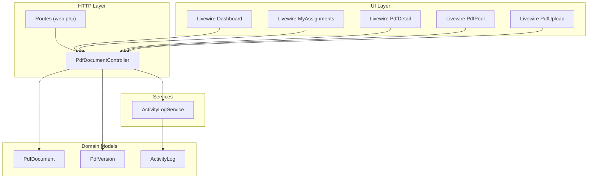
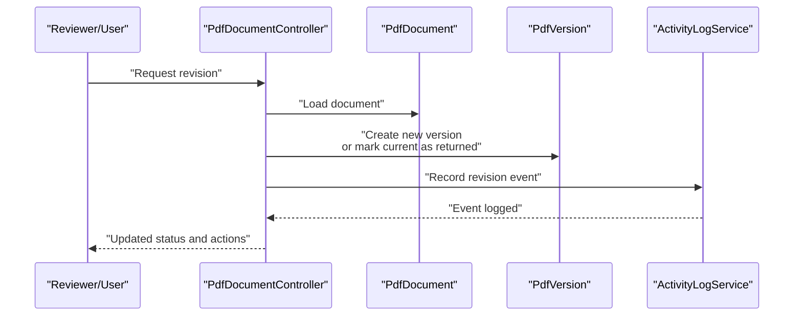
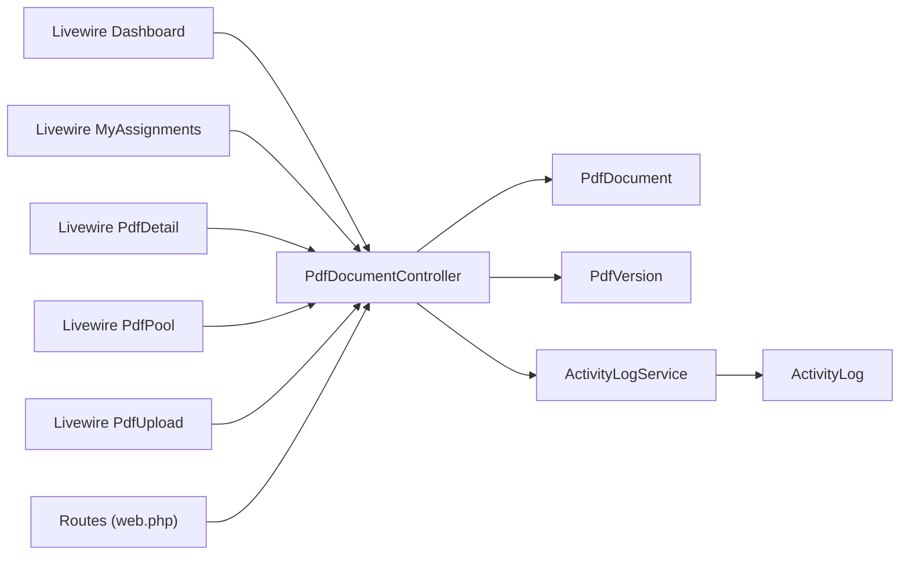

# Revision Handling

<cite>
**Referenced Files in This Document**
- [PdfDocument.php](file://pdf-korektura/app/Models/PdfDocument.php)
- [PdfVersion.php](file://pdf-korektura/app/Models/PdfVersion.php)
- [PdfDocumentController.php](file://pdf-korektura/app/Http/Controllers/PdfDocumentController.php)
- [ActivityLog.php](file://pdf-korektura/app/Models/ActivityLog.php)
- [ActivityLogService.php](file://pdf-korektura/app/Services/ActivityLogService.php)
- [AdminController.php](file://pdf-korektura/app/Http/Controllers/AdminController.php)
- [Dashboard.php](file://pdf-korektura/app/Livewire/Dashboard.php)
- [MyAssignments.php](file://pdf-korektura/app/Livewire/MyAssignments.php)
- [PdfDetail.php](file://pdf-korektura/app/Livewire/PdfDetail.php)
- [PdfPool.php](file://pdf-korektura/app/Livewire/PdfPool.php)
- [PdfUpload.php](file://pdf-korektura/app/Livewire/PdfUpload.php)
- [web.php](file://pdf-korektura/routes/web.php)
- [login.blade.php](file://pdf-korektura/resources/views/auth/login.blade.php)
- [pdf-detail.blade.php](file://pdf-korektura/resources/views/livewire/pdf-detail.blade.php)
- [my-assignments.blade.php](file://pdf-korektura/resources/views/livewire/my-assignments.blade.php)
- [pdf-pool.blade.php](file://pdf-korektura/resources/views/livewire/pdf-pool.blade.php)
- [pdf-upload.blade.php](file://pdf-korektura/resources/views/livewire/pdf-upload.blade.php)
</cite>

## Table of Contents
1. [Introduction](#introduction)
2. [Project Structure](#project-structure)
3. [Core Components](#core-components)
4. [Architecture Overview](#architecture-overview)
5. [Detailed Component Analysis](#detailed-component-analysis)
6. [Dependency Analysis](#dependency-analysis)
7. [Performance Considerations](#performance-considerations)
8. [Troubleshooting Guide](#troubleshooting-guide)
9. [Conclusion](#conclusion)

## Introduction
This document explains the revision handling workflow for documents returned for corrections in the system. It covers how revision requests are initiated, how stakeholders communicate during corrections, how documents are reassigned, the revision tracking and deadline management, iterative correction cycles, status management while in revision state, notification mechanisms, and how revision history influences final approval. It also outlines quality metrics and performance tracking for revision efficiency.

## Project Structure
The system is organized around document lifecycle management with dedicated models for documents and versions, controllers for HTTP interactions, Livewire components for UI, and services for activity logging. Routes define the application endpoints, and Blade templates render the frontend views.

**Diagram sources**
- [web.php](file://pdf-korektura/routes/web.php)
- [PdfDocumentController.php](file://pdf-korektura/app/Http/Controllers/PdfDocumentController.php)
- [PdfDocument.php](file://pdf-korektura/app/Models/PdfDocument.php)
- [PdfVersion.php](file://pdf-korektura/app/Models/PdfVersion.php)
- [ActivityLogService.php](file://pdf-korektura/app/Services/ActivityLogService.php)
- [ActivityLog.php](file://pdf-korektura/app/Models/ActivityLog.php)
- [Dashboard.php](file://pdf-korektura/app/Livewire/Dashboard.php)
- [MyAssignments.php](file://pdf-korektura/app/Livewire/MyAssignments.php)
- [PdfDetail.php](file://pdf-korektura/app/Livewire/PdfDetail.php)
- [PdfPool.php](file://pdf-korektura/app/Livewire/PdfPool.php)
- [PdfUpload.php](file://pdf-korektura/app/Livewire/PdfUpload.php)

**Section sources**
- [web.php](file://pdf-korektura/routes/web.php)
- [PdfDocumentController.php](file://pdf-korektura/app/Http/Controllers/PdfDocumentController.php)
- [PdfDocument.php](file://pdf-korektura/app/Models/PdfDocument.php)
- [PdfVersion.php](file://pdf-korektura/app/Models/PdfVersion.php)
- [ActivityLogService.php](file://pdf-korektura/app/Services/ActivityLogService.php)
- [ActivityLog.php](file://pdf-korektura/app/Models/ActivityLog.php)
- [Dashboard.php](file://pdf-korektura/app/Livewire/Dashboard.php)
- [MyAssignments.php](file://pdf-korektura/app/Livewire/MyAssignments.php)
- [PdfDetail.php](file://pdf-korektura/app/Livewire/PdfDetail.php)
- [PdfPool.php](file://pdf-korektura/app/Livewire/PdfPool.php)
- [PdfUpload.php](file://pdf-korektura/app/Livewire/PdfUpload.php)

## Core Components
- PdfDocument: Represents a document entity with lifecycle and ownership metadata.
- PdfVersion: Represents individual versions of a document, capturing changes and statuses across revisions.
- PdfDocumentController: Orchestrates document operations including returning for corrections, reassignment, and resubmission handling.
- ActivityLogService: Centralized service for recording revision-related activities and notifications.
- Livewire Components: Provide UI for viewing assignments, pools, uploads, and document details with revision-aware actions.

Key responsibilities:
- Revision initiation: Marking a version as "returned for corrections" and setting deadlines.
- Reassignment: Routing the document back to the original author or designated reviewer.
- Iterative corrections: Managing multiple revision rounds with clear tracking.
- Status management: Maintaining accurate status transitions and visibility.
- Notifications: Recording and surfacing revision events to stakeholders.
- Final approval impact: Capturing revision history to inform final decisions.

**Section sources**
- [PdfDocument.php](file://pdf-korektura/app/Models/PdfDocument.php)
- [PdfVersion.php](file://pdf-korektura/app/Models/PdfVersion.php)
- [PdfDocumentController.php](file://pdf-korektura/app/Http/Controllers/PdfDocumentController.php)
- [ActivityLogService.php](file://pdf-korektura/app/Services/ActivityLogService.php)

## Architecture Overview
The revision workflow spans HTTP requests handled by the controller, domain models for persistence, Livewire components for user interaction, and a centralized activity logging service for audit and notifications.

**Diagram sources**
- [PdfDocumentController.php](file://pdf-korektura/app/Http/Controllers/PdfDocumentController.php)
- [PdfDocument.php](file://pdf-korektura/app/Models/PdfDocument.php)
- [PdfVersion.php](file://pdf-korektura/app/Models/PdfVersion.php)
- [ActivityLogService.php](file://pdf-korektura/app/Services/ActivityLogService.php)

## Detailed Component Analysis

### PdfDocument Model
Responsibilities:
- Stores document metadata and maintains relationships to versions.
- Tracks ownership, current version, and lifecycle state.
- Supports queries for revision history and status filtering.

Design implications:
- Version association enables clear lineage and audit trails.
- Status fields support revision-aware UI and workflows.

**Section sources**
- [PdfDocument.php](file://pdf-korektura/app/Models/PdfDocument.php)

### PdfVersion Model
Responsibilities:
- Captures each iteration of a document with timestamps and status.
- Records reviewer comments and deadlines for corrections.
- Enables comparison between versions and tracks completion indicators.

Design implications:
- Deadlines stored per version enable granular reminder scheduling.
- Comments field supports stakeholder communication.

**Section sources**
- [PdfVersion.php](file://pdf-korektura/app/Models/PdfVersion.php)

### PdfDocumentController
Responsibilities:
- Handles revision initiation (return for corrections).
- Manages reassignment logic (original author vs. designated reviewer).
- Coordinates resubmission and status updates.
- Integrates with ActivityLogService for notifications.

Workflow highlights:
- Revision request endpoint triggers creation of a new version or marking of the current version as returned.
- Reassignment routes determine whether to return to the author or forward to another reviewer.
- Resubmission checks enforce deadlines and update status accordingly.

**Section sources**
- [PdfDocumentController.php](file://pdf-korektura/app/Http/Controllers/PdfDocumentController.php)

### ActivityLogService
Responsibilities:
- Centralizes logging of revision events (requested, returned, resubmitted, approved).
- Provides hooks for notifications to stakeholders.
- Ensures audit trail integrity for compliance and reporting.

Integration points:
- Called by the controller after state changes.
- Persists entries in ActivityLog model for retrieval and display.

**Section sources**
- [ActivityLogService.php](file://pdf-korektura/app/Services/ActivityLogService.php)
- [ActivityLog.php](file://pdf-korektura/app/Models/ActivityLog.php)

### Livewire Components
- Dashboard: Shows overall document pipeline and revision statistics.
- MyAssignments: Lists documents assigned to the current user with revision actions.
- PdfDetail: Displays document details, current version, and revision controls.
- PdfPool: Shows available documents for assignment and bulk revision actions.
- PdfUpload: Facilitates initial upload and baseline version creation.

UI implications:
- Revision-aware actions appear based on current status.
- Deadline indicators and comment threads improve transparency.

**Section sources**
- [Dashboard.php](file://pdf-korektura/app/Livewire/Dashboard.php)
- [MyAssignments.php](file://pdf-korektura/app/Livewire/MyAssignments.php)
- [PdfDetail.php](file://pdf-korektura/app/Livewire/PdfDetail.php)
- [PdfPool.php](file://pdf-korektura/app/Livewire/PdfPool.php)
- [PdfUpload.php](file://pdf-korektura/app/Livewire/PdfUpload.php)

### Routes and Views
- Routes define endpoints for document operations and UI rendering.
- Blade templates provide views for login, dashboard, assignments, document detail, pool, and upload.

Operational impact:
- Route coverage ensures all revision actions are reachable.
- Templates reflect revision-aware UI states and controls.

**Section sources**
- [web.php](file://pdf-korektura/routes/web.php)
- [login.blade.php](file://pdf-korektura/resources/views/auth/login.blade.php)
- [pdf-detail.blade.php](file://pdf-korektura/resources/views/livewire/pdf-detail.blade.php)
- [my-assignments.blade.php](file://pdf-korektura/resources/views/livewire/my-assignments.blade.php)
- [pdf-pool.blade.php](file://pdf-korektura/resources/views/livewire/pdf-pool.blade.php)
- [pdf-upload.blade.php](file://pdf-korektura/resources/views/livewire/pdf-upload.blade.php)

## Dependency Analysis
The controller depends on models and the activity service to manage revision state. Livewire components depend on the controller for data and actions. Routes connect UI and backend.

**Diagram sources**
- [PdfDocumentController.php](file://pdf-korektura/app/Http/Controllers/PdfDocumentController.php)
- [PdfDocument.php](file://pdf-korektura/app/Models/PdfDocument.php)
- [PdfVersion.php](file://pdf-korektura/app/Models/PdfVersion.php)
- [ActivityLogService.php](file://pdf-korektura/app/Services/ActivityLogService.php)
- [ActivityLog.php](file://pdf-korektura/app/Models/ActivityLog.php)
- [Dashboard.php](file://pdf-korektura/app/Livewire/Dashboard.php)
- [MyAssignments.php](file://pdf-korektura/app/Livewire/MyAssignments.php)
- [PdfDetail.php](file://pdf-korektura/app/Livewire/PdfDetail.php)
- [PdfPool.php](file://pdf-korektura/app/Livewire/PdfPool.php)
- [PdfUpload.php](file://pdf-korektura/app/Livewire/PdfUpload.php)
- [web.php](file://pdf-korektura/routes/web.php)

**Section sources**
- [PdfDocumentController.php](file://pdf-korektura/app/Http/Controllers/PdfDocumentController.php)
- [PdfDocument.php](file://pdf-korektura/app/Models/PdfDocument.php)
- [PdfVersion.php](file://pdf-korektura/app/Models/PdfVersion.php)
- [ActivityLogService.php](file://pdf-korektura/app/Services/ActivityLogService.php)
- [ActivityLog.php](file://pdf-korektura/app/Models/ActivityLog.php)
- [Dashboard.php](file://pdf-korektura/app/Livewire/Dashboard.php)
- [MyAssignments.php](file://pdf-korektura/app/Livewire/MyAssignments.php)
- [PdfDetail.php](file://pdf-korektura/app/Livewire/PdfDetail.php)
- [PdfPool.php](file://pdf-korektura/app/Livewire/PdfPool.php)
- [PdfUpload.php](file://pdf-korektura/app/Livewire/PdfUpload.php)
- [web.php](file://pdf-korektura/routes/web.php)

## Performance Considerations
- Indexing: Ensure database indexes on PdfDocument and PdfVersion for frequent queries (owner, status, deadline, created_at).
- Pagination: Apply pagination in Livewire lists (assignments, pool) to limit payload sizes.
- Caching: Cache frequently accessed metadata (titles, user roles) to reduce repeated lookups.
- Asynchronous notifications: Offload heavy notification tasks to queued jobs to avoid blocking user actions.
- Batch operations: Support batch reassignment and resubmission to reduce repetitive UI interactions.

[No sources needed since this section provides general guidance]

## Troubleshooting Guide
Common issues and resolutions:
- Revision action not visible: Verify current status and role permissions; ensure Livewire components are bound to the correct document ID.
- Missing notifications: Confirm ActivityLogService is invoked after state changes and that log entries are persisted.
- Deadline enforcement failing: Check deadline fields on PdfVersion and ensure resubmission logic validates deadlines before updating status.
- Reassignment confusion: Review controller logic for determining original author vs. designated reviewer routing.

**Section sources**
- [PdfDocumentController.php](file://pdf-korektura/app/Http/Controllers/PdfDocumentController.php)
- [ActivityLogService.php](file://pdf-korektura/app/Services/ActivityLogService.php)
- [ActivityLog.php](file://pdf-korektura/app/Models/ActivityLog.php)

## Conclusion
The revision handling workflow integrates domain models, a central controller, and Livewire-driven UI to support robust correction cycles. By leveraging versioning, activity logging, and deadline tracking, the system ensures transparent communication, fair reassignment, and efficient iterative improvements. Quality metrics and performance optimizations further enhance reliability and user experience.