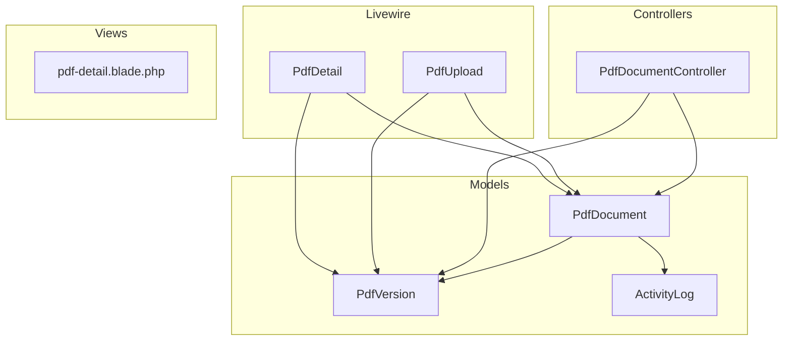
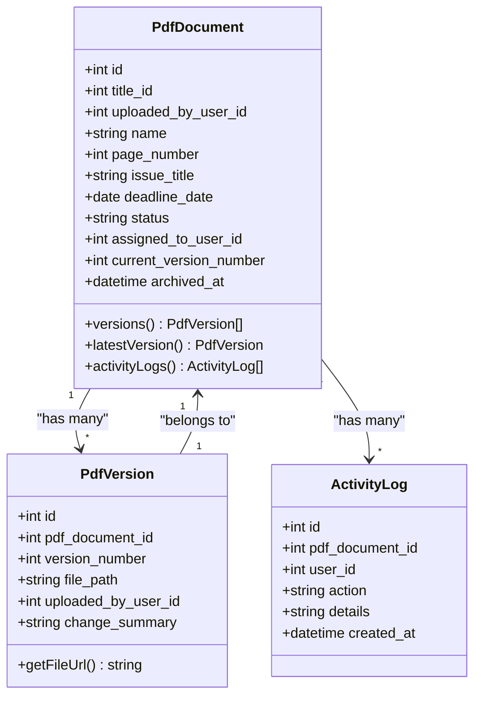
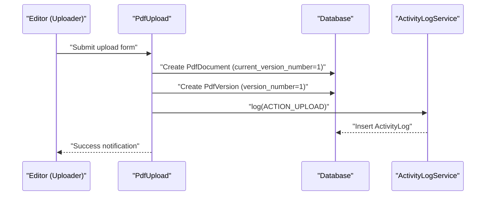
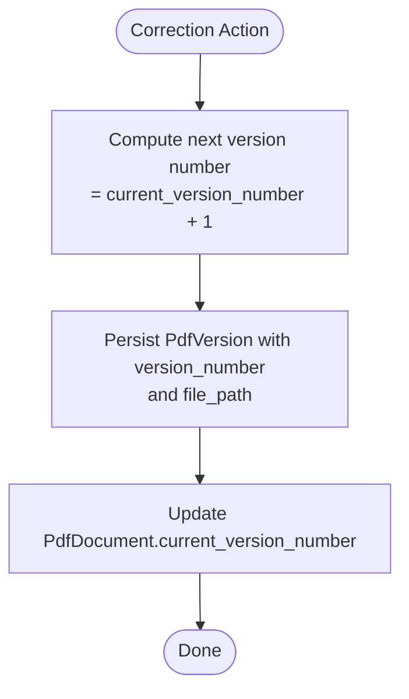
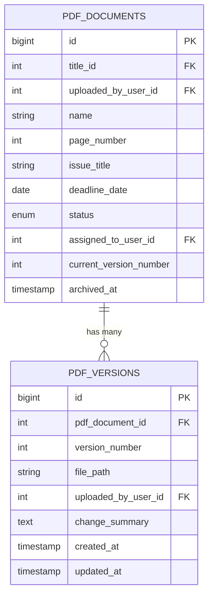
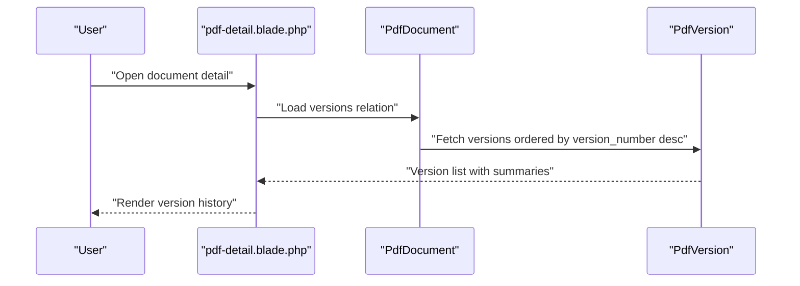
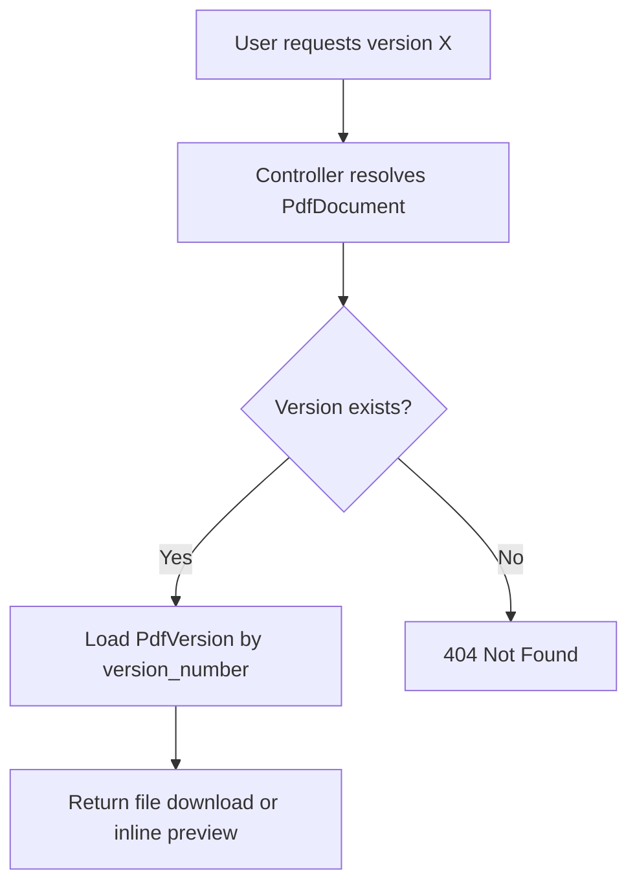
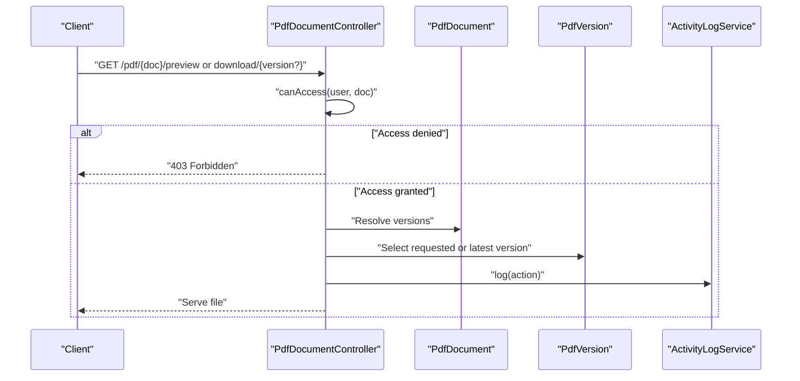
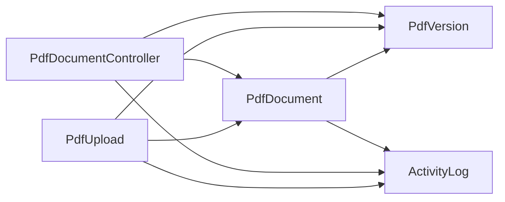

# Version Management

<cite>
**Referenced Files in This Document**
- [PdfDocument.php](file://app/Models/PdfDocument.php)
- [PdfVersion.php](file://app/Models/PdfVersion.php)
- [PdfDocumentController.php](file://app/Http/Controllers/PdfDocumentController.php)
- [PdfUpload.php](file://app/Livewire/PdfUpload.php)
- [PdfDetail.php](file://app/Livewire/PdfDetail.php)
- [ActivityLogService.php](file://app/Services/ActivityLogService.php)
- [ActivityLog.php](file://app/Models/ActivityLog.php)
- [2024_06_10_120000_create_pdf_documents_table.php](file://database/migrations/2024_06_10_120000_create_pdf_documents_table.php)
- [2024_06_10_130000_create_pdf_versions_table.php](file://database/migrations/2024_06_10_130000_create_pdf_versions_table.php)
- [pdf-detail.blade.php](file://resources/views/livewire/pdf-detail.blade.php)
</cite>

## Table of Contents
1. [Introduction](#introduction)
2. [Project Structure](#project-structure)
3. [Core Components](#core-components)
4. [Architecture Overview](#architecture-overview)
5. [Detailed Component Analysis](#detailed-component-analysis)
6. [Dependency Analysis](#dependency-analysis)
7. [Performance Considerations](#performance-considerations)
8. [Troubleshooting Guide](#troubleshooting-guide)
9. [Conclusion](#conclusion)

## Introduction
This document explains the document version management system used to track and maintain multiple versions of PDF documents throughout the correction workflow. It covers version creation, automatic version numbering and timestamping, model relationships, version comparison and change tracking, archiving and retention, rollback mechanics, metadata storage and retrieval, conflict resolution for concurrent editing, and the impact of version changes on workflow status and user permissions.

## Project Structure
The version management system spans Eloquent models, controllers, Livewire components, migrations, and views:
- Models define domain entities and relationships
- Migrations establish database schema and constraints
- Controllers orchestrate download and preview actions
- Livewire components manage upload and detail presentation
- Views render version history and activity logs

**Diagram sources**
- [PdfDocument.php:10-129](file://app/Models/PdfDocument.php#L10-L129)
- [PdfVersion.php:9-42](file://app/Models/PdfVersion.php#L9-L42)
- [PdfDocumentController.php:13-81](file://app/Http/Controllers/PdfDocumentController.php#L13-L81)
- [PdfUpload.php:16-95](file://app/Livewire/PdfUpload.php#L16-L95)
- [PdfDetail.php:10-23](file://app/Livewire/PdfDetail.php#L10-L23)
- [pdf-detail.blade.php:54-68](file://resources/views/livewire/pdf-detail.blade.php#L54-L68)

**Section sources**
- [PdfDocument.php:10-129](file://app/Models/PdfDocument.php#L10-L129)
- [PdfVersion.php:9-42](file://app/Models/PdfVersion.php#L9-L42)
- [PdfDocumentController.php:13-81](file://app/Http/Controllers/PdfDocumentController.php#L13-L81)
- [PdfUpload.php:16-95](file://app/Livewire/PdfUpload.php#L16-L95)
- [PdfDetail.php:10-23](file://app/Livewire/PdfDetail.php#L10-L23)
- [pdf-detail.blade.php:54-68](file://resources/views/livewire/pdf-detail.blade.php#L54-L68)

## Core Components
- PdfDocument: Represents a PDF document with status, assignment, deadlines, and current version tracking. Provides relationships to versions and activity logs, and scopes for filtering.
- PdfVersion: Represents a single version of a document, including file path, uploader, version number, and change summary.
- PdfDocumentController: Handles download and preview actions, enforcing access control and logging activities.
- PdfUpload (Livewire): Creates the initial document and version, sets current version number, and records activity.
- PdfDetail (Livewire): Loads a document with related data for display.
- ActivityLogService: Centralized logging for user actions across the system.
- ActivityLog: Stores action metadata with timestamps and user context.

Key behaviors:
- Automatic version numbering starts at 1 for new documents and increments per correction cycle.
- Timestamping occurs automatically via Eloquent’s timestamps.
- Access control gates downloads and previews based on roles and ownership/assignment.

**Section sources**
- [PdfDocument.php:14-129](file://app/Models/PdfDocument.php#L14-L129)
- [PdfVersion.php:13-42](file://app/Models/PdfVersion.php#L13-L42)
- [PdfDocumentController.php:15-81](file://app/Http/Controllers/PdfDocumentController.php#L15-L81)
- [PdfUpload.php:63-87](file://app/Livewire/PdfUpload.php#L63-L87)
- [ActivityLogService.php:20-29](file://app/Services/ActivityLogService.php#L20-L29)
- [ActivityLog.php:13-59](file://app/Models/ActivityLog.php#L13-L59)

## Architecture Overview
The system maintains a strict parent-child relationship between PdfDocument and PdfVersion. Each document tracks its current version number, and versions are ordered by version number descending. Access control ensures only authorized users can view or download versions. Activity logs capture all significant actions.

**Diagram sources**
- [PdfDocument.php:10-129](file://app/Models/PdfDocument.php#L10-L129)
- [PdfVersion.php:9-42](file://app/Models/PdfVersion.php#L9-L42)
- [ActivityLog.php:9-59](file://app/Models/ActivityLog.php#L9-L59)

## Detailed Component Analysis

### Version Creation and Lifecycle
- Initial creation: On upload, a PdfDocument record is created with current_version_number set to 1, and a PdfVersion with version_number 1 is created pointing to the stored file path. An upload activity log entry is recorded.
- Subsequent corrections: The correction workflow increments the version number and updates the current version number accordingly. The latest version is determined by the highest version number.

**Diagram sources**
- [PdfUpload.php:63-87](file://app/Livewire/PdfUpload.php#L63-L87)
- [ActivityLogService.php:20-29](file://app/Services/ActivityLogService.php#L20-L29)

**Section sources**
- [PdfUpload.php:63-87](file://app/Livewire/PdfUpload.php#L63-L87)
- [2024_06_10_120000_create_pdf_documents_table.php:20-21](file://database/migrations/2024_06_10_120000_create_pdf_documents_table.php#L20-L21)
- [2024_06_10_130000_create_pdf_versions_table.php:13-20](file://database/migrations/2024_06_10_130000_create_pdf_versions_table.php#L13-L20)

### Automatic Version Numbering and Timestamping
- Version numbering is integer-based and enforced as unique per document. New versions increment from the current version number.
- Timestamps are handled by Eloquent’s created_at and updated_at fields, persisted automatically by the framework.

**Diagram sources**
- [PdfDocument.php:56-65](file://app/Models/PdfDocument.php#L56-L65)
- [PdfVersion.php:13-26](file://app/Models/PdfVersion.php#L13-L26)

**Section sources**
- [PdfDocument.php:56-65](file://app/Models/PdfDocument.php#L56-L65)
- [PdfVersion.php:13-26](file://app/Models/PdfVersion.php#L13-L26)

### Relationship Between PdfDocument and PdfVersion
- One-to-many relationship: PdfDocument has many PdfVersion entries.
- Foreign key constraint: pdf_versions.pdf_document_id references pdf_documents.id with cascade delete.
- Unique constraint: (pdf_document_id, version_number) ensures no duplicate version numbers per document.
- Latest version resolution: PdfDocument.latestVersion resolves the row where pdf_versions.version_number equals pdf_documents.current_version_number.

**Diagram sources**
- [2024_06_10_120000_create_pdf_documents_table.php:11-24](file://database/migrations/2024_06_10_120000_create_pdf_documents_table.php#L11-L24)
- [2024_06_10_130000_create_pdf_versions_table.php:11-21](file://database/migrations/2024_06_10_130000_create_pdf_versions_table.php#L11-L21)

**Section sources**
- [PdfDocument.php:56-65](file://app/Models/PdfDocument.php#L56-L65)
- [PdfVersion.php:28-31](file://app/Models/PdfVersion.php#L28-L31)
- [2024_06_10_120000_create_pdf_documents_table.php:13-21](file://database/migrations/2024_06_10_120000_create_pdf_documents_table.php#L13-L21)
- [2024_06_10_130000_create_pdf_versions_table.php:13-20](file://database/migrations/2024_06_10_130000_create_pdf_versions_table.php#L13-L20)

### Version Comparison and Change Tracking
- Change tracking: Each PdfVersion stores a change_summary field describing modifications made in that version.
- Presentation: The detail view lists all versions with their version numbers, summaries, uploader, and timestamps.
- Retrieval: Versions are fetched via PdfDocument->versions(), ordered by version number descending.

**Diagram sources**
- [pdf-detail.blade.php:54-68](file://resources/views/livewire/pdf-detail.blade.php#L54-L68)
- [PdfDocument.php:56-59](file://app/Models/PdfDocument.php#L56-L59)
- [PdfVersion.php:13-19](file://app/Models/PdfVersion.php#L13-L19)

**Section sources**
- [PdfVersion.php:13-19](file://app/Models/PdfVersion.php#L13-L19)
- [pdf-detail.blade.php:54-68](file://resources/views/livewire/pdf-detail.blade.php#L54-L68)

### Version Archiving and Retention Policies
- Archiving marker: PdfDocument.archived_at is nullable and used to mark archived documents.
- Retention: No explicit retention policy is defined in the codebase; archival appears to be manual or administrative.

Recommendations:
- Define a retention period (e.g., N months/years) and schedule cleanup jobs to remove old versions or documents.
- Consider soft-deleting versions or adding a retention_date to versions for automated cleanup.

**Section sources**
- [PdfDocument.php:28-39](file://app/Models/PdfDocument.php#L28-L39)
- [2024_06_10_120000_create_pdf_documents_table.php:21-22](file://database/migrations/2024_06_10_120000_create_pdf_documents_table.php#L21-L22)

### Rollback Functionality
- Current behavior: The system does not provide a dedicated rollback endpoint or UI action to revert to a previous version.
- Mechanism: To support rollback, add a controller action that:
  - Validates user permissions
  - Selects the target PdfVersion
  - Copies the selected file to become the new latest version
  - Updates PdfDocument.current_version_number
  - Records an activity log entry indicating rollback

Impact on workflow:
- Rolling back may require resetting PdfDocument.status to a prior state (e.g., returned or in_progress) depending on organizational policy.

**Section sources**
- [PdfDocumentController.php:15-40](file://app/Http/Controllers/PdfDocumentController.php#L15-L40)
- [PdfDocument.php:56-65](file://app/Models/PdfDocument.php#L56-L65)

### Version Metadata Storage and Retrieval
- Storage: PdfVersion stores file_path, uploaded_by_user_id, version_number, and change_summary. Timestamps are managed automatically.
- Retrieval: Access via PdfDocument->versions() and via controller actions that resolve the requested version by number or latest.

**Diagram sources**
- [PdfDocumentController.php:15-40](file://app/Http/Controllers/PdfDocumentController.php#L15-L40)
- [PdfVersion.php:38-41](file://app/Models/PdfVersion.php#L38-L41)

**Section sources**
- [PdfVersion.php:13-26](file://app/Models/PdfVersion.php#L13-L26)
- [PdfDocumentController.php:15-40](file://app/Http/Controllers/PdfDocumentController.php#L15-L40)

### Version Conflict Resolution and Concurrent Editing
- Current state: There is no explicit concurrency control or conflict detection mechanism in the codebase.
- Recommended approach:
  - Use optimistic locking: Add a version counter or timestamp to detect conflicts during update.
  - Enforce atomic updates: When creating a new version, lock the PdfDocument row and ensure the new version_number is strictly greater than the current one.
  - Present conflicts to users and offer merge strategies or manual resolution steps.

**Section sources**
- [PdfDocument.php:56-65](file://app/Models/PdfDocument.php#L56-L65)
- [PdfVersion.php:13-26](file://app/Models/PdfVersion.php#L13-L26)

### Impact on Workflow Status and User Permissions
- Workflow status: PdfDocument.status transitions are not handled by version creation in the examined code. Typically, status updates occur on assignment, completion, or return actions.
- Permissions:
  - Admins: Full access to all documents and versions.
  - Editors: Access to documents they uploaded.
  - Proofreaders: Access to documents assigned to them.
- Preview and download enforce these checks before serving content.

**Diagram sources**
- [PdfDocumentController.php:15-81](file://app/Http/Controllers/PdfDocumentController.php#L15-L81)
- [ActivityLogService.php:20-29](file://app/Services/ActivityLogService.php#L20-L29)

**Section sources**
- [PdfDocumentController.php:65-80](file://app/Http/Controllers/PdfDocumentController.php#L65-L80)
- [PdfDocument.php:14-39](file://app/Models/PdfDocument.php#L14-L39)

## Dependency Analysis
- PdfDocument depends on PdfVersion for version history and on ActivityLog for audit trail.
- PdfVersion depends on PdfDocument for identity and on User for uploader attribution.
- PdfDocumentController depends on PdfDocument and PdfVersion for access and retrieval.
- PdfUpload creates both PdfDocument and PdfVersion, establishing the initial version.
- ActivityLogService centralizes logging across actions.

**Diagram sources**
- [PdfDocumentController.php:13-81](file://app/Http/Controllers/PdfDocumentController.php#L13-L81)
- [PdfUpload.php:16-95](file://app/Livewire/PdfUpload.php#L16-L95)
- [PdfDocument.php:10-129](file://app/Models/PdfDocument.php#L10-L129)
- [PdfVersion.php:9-42](file://app/Models/PdfVersion.php#L9-L42)
- [ActivityLog.php:9-59](file://app/Models/ActivityLog.php#L9-L59)

**Section sources**
- [PdfDocumentController.php:13-81](file://app/Http/Controllers/PdfDocumentController.php#L13-L81)
- [PdfUpload.php:16-95](file://app/Livewire/PdfUpload.php#L16-L95)
- [PdfDocument.php:10-129](file://app/Models/PdfDocument.php#L10-L129)
- [PdfVersion.php:9-42](file://app/Models/PdfVersion.php#L9-L42)
- [ActivityLog.php:9-59](file://app/Models/ActivityLog.php#L9-L59)

## Performance Considerations
- Indexes: Ensure indexes exist on pdf_versions(pdf_document_id, version_number) and pdf_documents(current_version_number) for fast lookups.
- File storage: Store large PDFs efficiently; consider CDN or cloud storage for downloads.
- Pagination: For long version histories, paginate version listings in views.
- Caching: Cache frequently accessed metadata (e.g., latest version info) to reduce database load.

## Troubleshooting Guide
- Download fails with “File not found”:
  - Verify file_path correctness and that the file exists at the computed storage path.
  - Confirm the requested version exists for the document.
- Permission denied:
  - Ensure the user has the appropriate role and is either the uploader (editor) or assigned proofreader.
- Version not appearing:
  - Check uniqueness constraint on (pdf_document_id, version_number) and that version_number increments correctly.
- Activity logs missing:
  - Confirm ActivityLogService::log is invoked for relevant actions.

**Section sources**
- [PdfDocumentController.php:33-37](file://app/Http/Controllers/PdfDocumentController.php#L33-L37)
- [PdfDocumentController.php:65-80](file://app/Http/Controllers/PdfDocumentController.php#L65-L80)
- [2024_06_10_130000_create_pdf_versions_table.php:19-20](file://database/migrations/2024_06_10_130000_create_pdf_versions_table.php#L19-L20)

## Conclusion
The version management system establishes a robust foundation for tracking PDF document revisions with clear relationships, automatic numbering, and activity logging. While current code supports creation, retrieval, and basic access control, enhancements are recommended for rollback, retention policies, concurrency control, and explicit status transitions to fully support complex correction workflows.