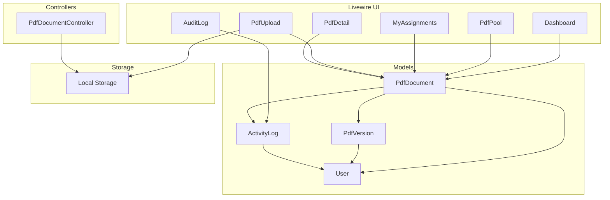
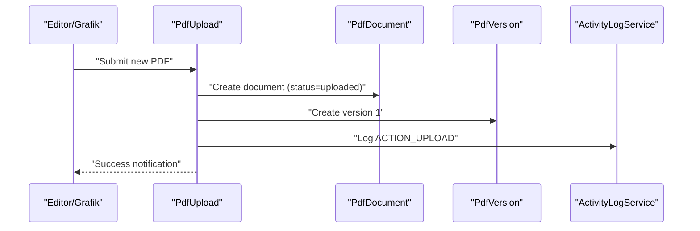
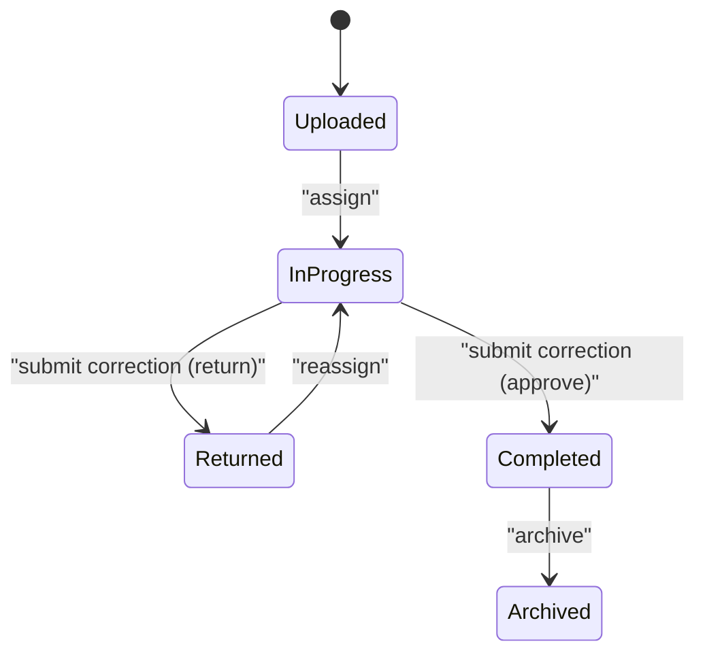
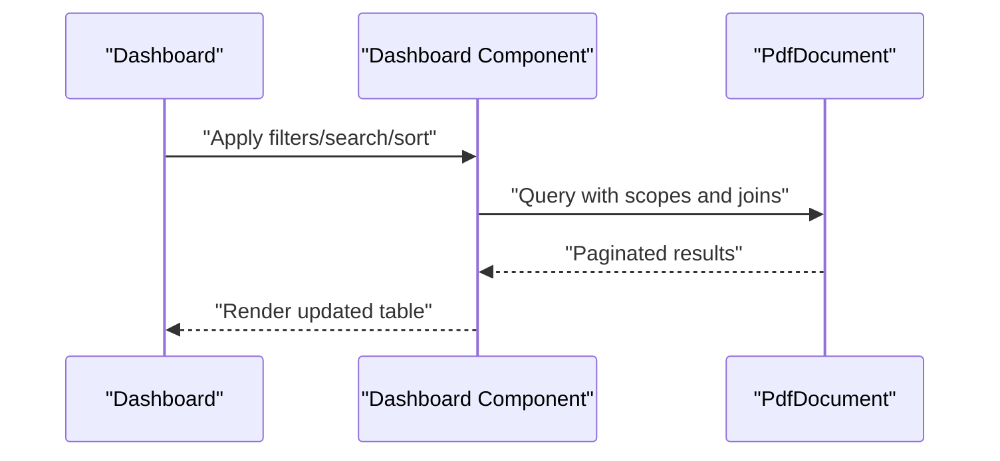
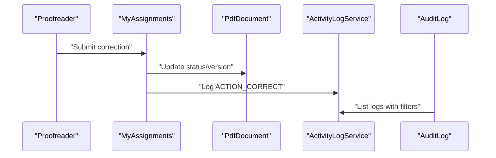
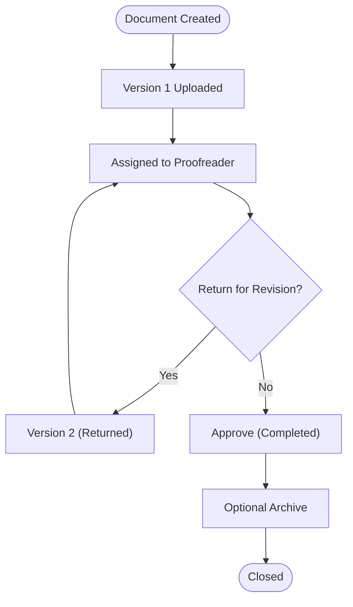
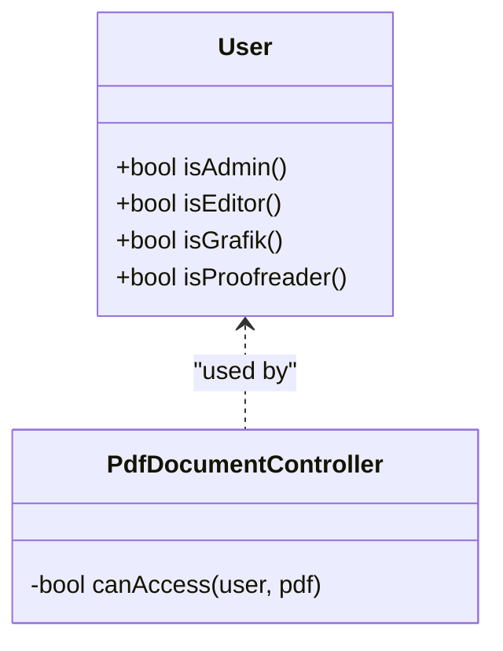
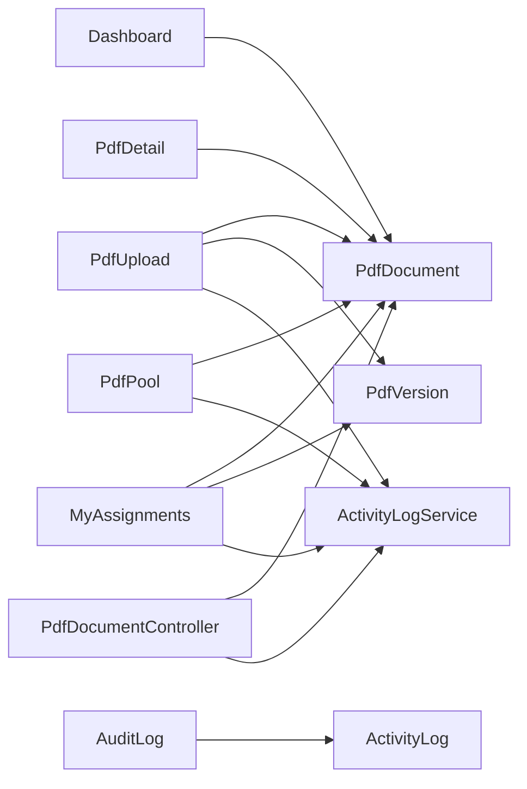

# Workflow Status Tracking

<cite>
**Referenced Files in This Document**
- [PdfDocument.php](file://app/Models/PdfDocument.php)
- [PdfVersion.php](file://app/Models/PdfVersion.php)
- [ActivityLog.php](file://app/Models/ActivityLog.php)
- [ActivityLogService.php](file://app/Services/ActivityLogService.php)
- [PdfDocumentController.php](file://app/Http/Controllers/PdfDocumentController.php)
- [Dashboard.php](file://app/Livewire/Dashboard.php)
- [PdfPool.php](file://app/Livewire/PdfPool.php)
- [MyAssignments.php](file://app/Livewire/MyAssignments.php)
- [PdfDetail.php](file://app/Livewire/PdfDetail.php)
- [PdfUpload.php](file://app/Livewire/PdfUpload.php)
- [AuditLog.php](file://app/Livewire/Admin/AuditLog.php)
- [User.php](file://app/Models/User.php)
- [2024_06_10_120000_create_pdf_documents_table.php](file://database/migrations/2024_06_10_120000_create_pdf_documents_table.php)
- [2024_06_10_130000_create_pdf_versions_table.php](file://database/migrations/2024_06_10_130000_create_pdf_versions_table.php)
- [2024_06_10_140000_create_activity_logs_table.php](file://database/migrations/2024_06_10_140000_create_activity_logs_table.php)
- [web.php](file://routes/web.php)
- [dashboard.blade.php](file://resources/views/livewire/dashboard.blade.php)
- [pdf-detail.blade.php](file://resources/views/livewire/pdf-detail.blade.php)
</cite>

## Table of Contents
1. [Introduction](#introduction)
2. [Project Structure](#project-structure)
3. [Core Components](#core-components)
4. [Architecture Overview](#architecture-overview)
5. [Detailed Component Analysis](#detailed-component-analysis)
6. [Dependency Analysis](#dependency-analysis)
7. [Performance Considerations](#performance-considerations)
8. [Troubleshooting Guide](#troubleshooting-guide)
9. [Conclusion](#conclusion)
10. [Appendices](#appendices)

## Introduction
This document describes the workflow status tracking and monitoring system for document processing. It covers the complete lifecycle from initial upload to final approval, the status transition matrix and state management logic, real-time status updates via Livewire components, the activity logging and audit trail, compliance tracking, dashboards and analytics, notifications, role-based permissions, and historical tracking of progress and decision timelines.

## Project Structure
The system is organized around Eloquent models, Livewire components, controllers, migrations, and Blade views. Permissions are managed via the Spatie Permission package. Routes define role-based access to features.



**Diagram sources**
- [Dashboard.php:48-90](file://app/Livewire/Dashboard.php#L48-L90)
- [PdfPool.php:41-65](file://app/Livewire/PdfPool.php#L41-L65)
- [MyAssignments.php:109-120](file://app/Livewire/MyAssignments.php#L109-L120)
- [PdfUpload.php:95-100](file://app/Livewire/PdfUpload.php#L95-L100)
- [PdfDetail.php:14-22](file://app/Livewire/PdfDetail.php#L14-L22)
- [PdfDocumentController.php:15-81](file://app/Http/Controllers/PdfDocumentController.php#L15-L81)
- [PdfDocument.php:10-129](file://app/Models/PdfDocument.php#L10-L129)
- [PdfVersion.php:9-42](file://app/Models/PdfVersion.php#L9-L42)
- [ActivityLog.php:9-59](file://app/Models/ActivityLog.php#L9-L59)
- [User.php:10-75](file://app/Models/User.php#L10-L75)

**Section sources**
- [web.php:25-53](file://routes/web.php#L25-L53)

## Core Components
- PdfDocument: central entity representing a document with status, deadlines, assignments, versions, and activity logs.
- PdfVersion: immutable document versions with change summaries and upload metadata.
- ActivityLog: audit trail of actions performed on documents.
- ActivityLogService: centralized logging utility.
- User: roles and permissions via Spatie Permission.
- Livewire components: UI surfaces for upload, pool assignment, corrections, dashboard, detail, and audit log.
- Controllers: file preview/download and access checks.

Key responsibilities:
- Status transitions and filters are enforced in Livewire components and model scopes.
- Access control is enforced in controllers and route middleware.
- Activity logs capture all user actions with timestamps and IP addresses.

**Section sources**
- [PdfDocument.php:14-129](file://app/Models/PdfDocument.php#L14-L129)
- [PdfVersion.php:13-42](file://app/Models/PdfVersion.php#L13-L42)
- [ActivityLog.php:13-59](file://app/Models/ActivityLog.php#L13-L59)
- [ActivityLogService.php:20-30](file://app/Services/ActivityLogService.php#L20-L30)
- [User.php:56-75](file://app/Models/User.php#L56-L75)
- [PdfDocumentController.php:65-81](file://app/Http/Controllers/PdfDocumentController.php#L65-L81)

## Architecture Overview
The system follows a layered architecture:
- Presentation: Livewire components render views and manage state.
- Application: Components orchestrate model updates and logging.
- Domain: Models encapsulate business rules (status, versions, relations).
- Persistence: Migrations define schema; local storage holds PDFs.
- Security: Middleware and role checks guard access.



**Diagram sources**
- [PdfUpload.php:52-93](file://app/Livewire/PdfUpload.php#L52-L93)
- [PdfDocument.php:19-30](file://app/Models/PdfDocument.php#L19-L30)
- [PdfVersion.php:13-26](file://app/Models/PdfVersion.php#L13-L26)
- [ActivityLogService.php:20-29](file://app/Services/ActivityLogService.php#L20-L29)

## Detailed Component Analysis

### Status Lifecycle and Transition Matrix
Statuses:
- uploaded: initial state after upload.
- in_progress: assigned to a proofreader.
- returned: sent back for revision.
- completed: final approved state.

Transitions:
- uploaded → in_progress: assignment by proofreader.
- in_progress → returned: correction submission with return flag.
- in_progress → completed: correction submission without return.
- returned → in_progress: reassignment after revision.
- completed → archived: optional archival by editor/admin.



**Diagram sources**
- [PdfDocument.php:14-17](file://app/Models/PdfDocument.php#L14-L17)
- [PdfPool.php:31-34](file://app/Livewire/PdfPool.php#L31-L34)
- [MyAssignments.php:73-77](file://app/Livewire/MyAssignments.php#L73-L77)
- [Dashboard.php:43-45](file://app/Livewire/Dashboard.php#L43-L45)

**Section sources**
- [PdfDocument.php:14-17](file://app/Models/PdfDocument.php#L14-L17)
- [PdfPool.php:22-39](file://app/Livewire/PdfPool.php#L22-L39)
- [MyAssignments.php:42-88](file://app/Livewire/MyAssignments.php#L42-L88)
- [Dashboard.php:34-46](file://app/Livewire/Dashboard.php#L34-L46)

### Real-Time Status Updates in Livewire
- Dashboard displays counts per status and live filtering/sorting.
- PdfDetail shows current status and color-coded labels.
- PdfPool and MyAssignments update status upon assignment/release/correction.
- Notifications are dispatched via Livewire events.



**Diagram sources**
- [Dashboard.php:48-90](file://app/Livewire/Dashboard.php#L48-L90)
- [dashboard.blade.php:24-98](file://resources/views/livewire/dashboard.blade.php#L24-L98)

**Section sources**
- [Dashboard.php:16-32](file://app/Livewire/Dashboard.php#L16-L32)
- [dashboard.blade.php:24-98](file://resources/views/livewire/dashboard.blade.php#L24-L98)
- [PdfDetail.php:14-22](file://app/Livewire/PdfDetail.php#L14-L22)
- [pdf-detail.blade.php:14-21](file://resources/views/livewire/pdf-detail.blade.php#L14-L21)

### Activity Logging and Audit Trail
- Actions logged include upload, assign, release, correct, archive, view, download.
- Logs record user, action, details, IP, and timestamp.
- AuditLog component allows filtering by action, user, date range, and free-text search.



**Diagram sources**
- [MyAssignments.php:79-87](file://app/Livewire/MyAssignments.php#L79-L87)
- [ActivityLogService.php:20-29](file://app/Services/ActivityLogService.php#L20-L29)
- [AuditLog.php:23-53](file://app/Livewire/Admin/AuditLog.php#L23-L53)

**Section sources**
- [ActivityLog.php:13-59](file://app/Models/ActivityLog.php#L13-L59)
- [ActivityLogService.php:20-30](file://app/Services/ActivityLogService.php#L20-L30)
- [AuditLog.php:15-53](file://app/Livewire/Admin/AuditLog.php#L15-L53)

### Compliance Tracking and Historical Progress
- Historical versions are preserved with timestamps and summaries.
- Activity logs provide a chronological audit trail of actions.
- Deadline tracking highlights overdue items in the dashboard.
- Archival separates closed items from active workflow.



**Diagram sources**
- [PdfUpload.php:68-85](file://app/Livewire/PdfUpload.php#L68-L85)
- [PdfPool.php:31-34](file://app/Livewire/PdfPool.php#L31-L34)
- [MyAssignments.php:73-77](file://app/Livewire/MyAssignments.php#L73-L77)
- [PdfDetail.php:54-67](file://app/Livewire/PdfDetail.php#L54-L67)

**Section sources**
- [PdfDetail.php:54-86](file://app/Livewire/PdfDetail.php#L54-L86)
- [pdf-detail.blade.php:53-87](file://resources/views/livewire/pdf-detail.blade.php#L53-L87)

### Notifications and Milestones
- Livewire dispatches notify events for success/error feedback.
- Milestones include assignment, correction submission, completion, and archival.

**Section sources**
- [Dashboard.php:34-46](file://app/Livewire/Dashboard.php#L34-L46)
- [PdfPool.php:22-39](file://app/Livewire/PdfPool.php#L22-L39)
- [MyAssignments.php:42-88](file://app/Livewire/MyAssignments.php#L42-L88)

### Role-Based Permissions and Access Control
- Roles: Admin, Editor/Grafik, Korektor.
- Middleware enforces role visibility for routes/components.
- Access checks in controllers ensure only authorized users can access files.



**Diagram sources**
- [User.php:56-75](file://app/Models/User.php#L56-L75)
- [PdfDocumentController.php:65-80](file://app/Http/Controllers/PdfDocumentController.php#L65-L80)
- [web.php:25-53](file://routes/web.php#L25-L53)

**Section sources**
- [User.php:56-75](file://app/Models/User.php#L56-L75)
- [PdfDocumentController.php:65-80](file://app/Http/Controllers/PdfDocumentController.php#L65-L80)
- [web.php:25-53](file://routes/web.php#L25-L53)

### Data Models and Schema
```mermaid
erDiagram
USERS {
bigint id PK
string name
string email
string username
string guid
string domain
timestamp email_verified_at
timestamps created_at, updated_at
}
TITLES {
bigint id PK
string name
boolean is_active
timestamps created_at, updated_at
}
PDF_DOCUMENTS {
bigint id PK
bigint title_id FK
bigint uploaded_by_user_id FK
string name
int page_number
string issue_title
datetime deadline_date
enum status
bigint assigned_to_user_id FK
int current_version_number
timestamp archived_at
timestamps created_at, updated_at
}
PDF_VERSIONS {
bigint id PK
bigint pdf_document_id FK
int version_number
string file_path
bigint uploaded_by_user_id FK
text change_summary
timestamps created_at, updated_at
}
ACTIVITY_LOGS {
bigint id PK
bigint pdf_document_id FK
bigint user_id FK
string action
text details
string ip_address
timestamp created_at
}
USERS ||--o{ PDF_DOCUMENTS : "uploaded_by"
USERS ||--o{ PDF_VERSIONS : "uploaded_by"
USERS ||--o{ ACTIVITY_LOGS : "user"
TITLES ||--|| PDF_DOCUMENTS : "title"
PDF_DOCUMENTS ||--o{ PDF_VERSIONS : "versions"
PDF_DOCUMENTS ||--o{ ACTIVITY_LOGS : "logs"
```

**Diagram sources**
- [2024_06_10_120000_create_pdf_documents_table.php:11-24](file://database/migrations/2024_06_10_120000_create_pdf_documents_table.php#L11-L24)
- [2024_06_10_130000_create_pdf_versions_table.php:11-21](file://database/migrations/2024_06_10_130000_create_pdf_versions_table.php#L11-L21)
- [2024_06_10_140000_create_activity_logs_table.php:11-19](file://database/migrations/2024_06_10_140000_create_activity_logs_table.php#L11-L19)

## Dependency Analysis
- Components depend on models for queries and relations.
- Controllers depend on models and request context for access checks.
- ActivityLogService is a shared dependency for all actions requiring audit.
- Routes enforce role-based access to Livewire components and controller actions.



**Diagram sources**
- [PdfUpload.php:68-85](file://app/Livewire/PdfUpload.php#L68-L85)
- [PdfPool.php:22-39](file://app/Livewire/PdfPool.php#L22-L39)
- [MyAssignments.php:42-88](file://app/Livewire/MyAssignments.php#L42-L88)
- [Dashboard.php:48-90](file://app/Livewire/Dashboard.php#L48-L90)
- [PdfDetail.php:14-22](file://app/Livewire/PdfDetail.php#L14-L22)
- [PdfDocumentController.php:15-81](file://app/Http/Controllers/PdfDocumentController.php#L15-L81)
- [ActivityLogService.php:20-29](file://app/Services/ActivityLogService.php#L20-L29)

**Section sources**
- [web.php:25-53](file://routes/web.php#L25-L53)

## Performance Considerations
- Pagination is used across Livewire components to limit result sets.
- Eager loading of relations (title, uploadedBy, assignedTo, versions, activityLogs) reduces N+1 queries.
- Sorting and filtering are applied server-side to keep UI responsive.
- File storage is local; consider CDN or cloud storage for large-scale deployments.

## Troubleshooting Guide
Common issues and resolutions:
- Access denied when downloading/viewing PDFs: verify user role and ownership/assignment.
- Status not updating after correction: ensure the correct flag is set and the component validates permissions.
- Missing versions in history: confirm version creation and ordering logic.
- Audit log filters not working: check filter parameters and query string bindings.

**Section sources**
- [PdfDocumentController.php:65-80](file://app/Http/Controllers/PdfDocumentController.php#L65-L80)
- [MyAssignments.php:42-88](file://app/Livewire/MyAssignments.php#L42-L88)
- [PdfDetail.php:14-22](file://app/Livewire/PdfDetail.php#L14-L22)
- [AuditLog.php:23-53](file://app/Livewire/Admin/AuditLog.php#L23-L53)

## Conclusion
The system provides a robust, permission-aware workflow for document processing with clear status transitions, comprehensive activity logging, and real-time UI updates. Dashboards enable oversight and compliance tracking, while historical data supports audits and performance analysis.

## Appendices

### Status Definitions and Labels
- uploaded: Vloženo (gray)
- in_progress: V procesu (blue)
- returned: Vráceno zpět (yellow)
- completed: Hotovo (green)

**Section sources**
- [PdfDocument.php:108-128](file://app/Models/PdfDocument.php#L108-L128)

### Action Types in Activity Log
- upload, assign, release, correct, archive, view, download

**Section sources**
- [ActivityLog.php:13-19](file://app/Models/ActivityLog.php#L13-L19)
- [ActivityLogService.php:12-18](file://app/Services/ActivityLogService.php#L12-L18)