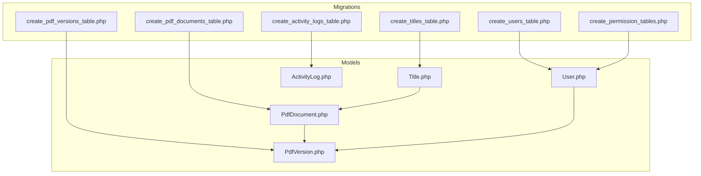
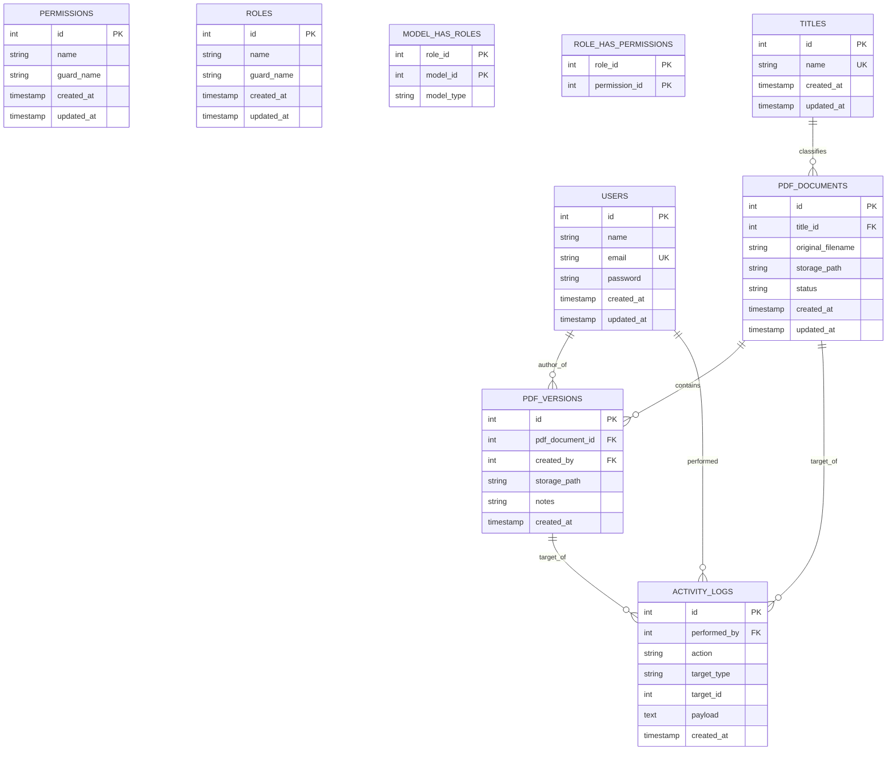
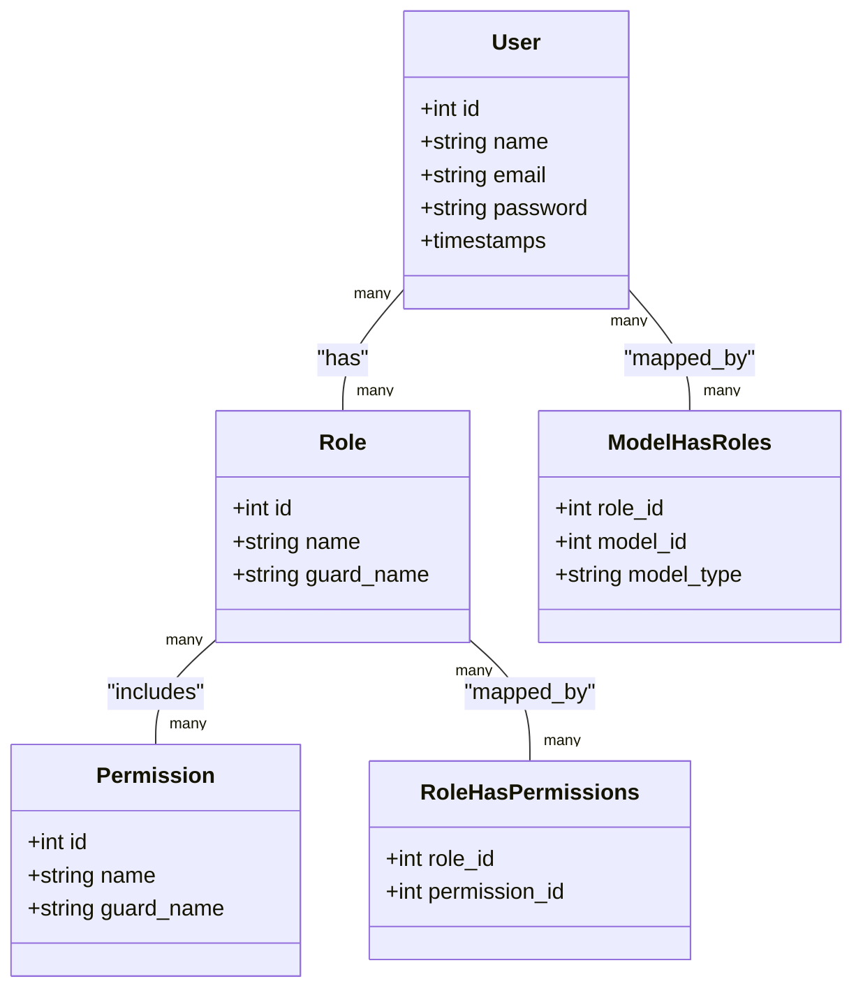
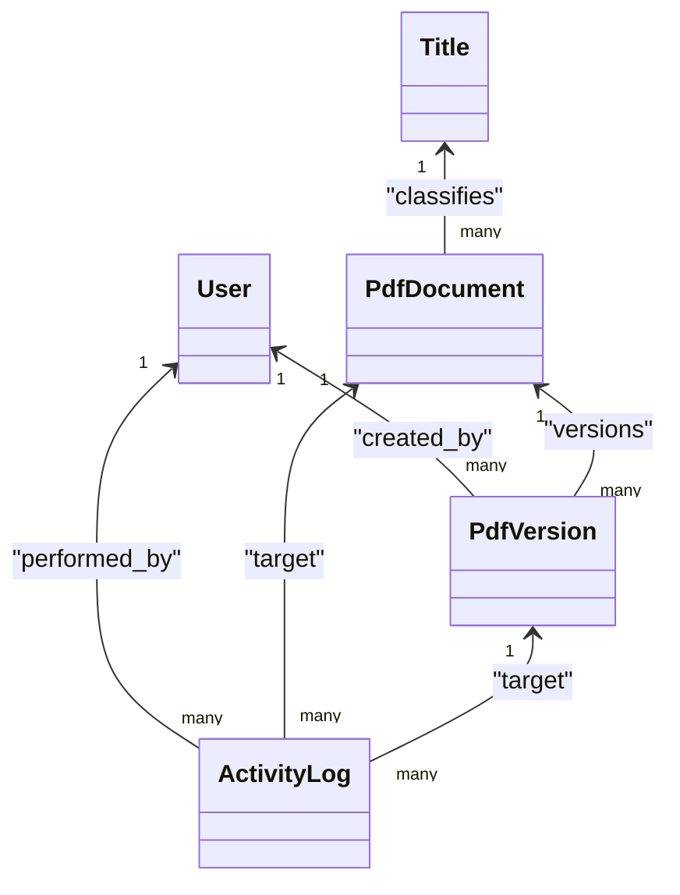

# Database Schema

<cite>
**Referenced Files in This Document**
- [0001_01_01_000000_create_users_table.php](file://pdf-korektura/database/migrations/0001_01_01_000000_create_users_table.php)
- [2024_06_10_100000_create_permission_tables.php](file://pdf-korektura/database/migrations/2024_06_10_100000_create_permission_tables.php)
- [2024_06_10_110000_create_titles_table.php](file://pdf-korektura/database/migrations/2024_06_10_110000_create_titles_table.php)
- [2024_06_10_120000_create_pdf_documents_table.php](file://pdf-korektura/database/migrations/2024_06_10_120000_create_pdf_documents_table.php)
- [2024_06_10_130000_create_pdf_versions_table.php](file://pdf-korektura/database/migrations/2024_06_10_130000_create_pdf_versions_table.php)
- [2024_06_10_140000_create_activity_logs_table.php](file://pdf-korektura/database/migrations/2024_06_10_140000_create_activity_logs_table.php)
- [CleanupOldRecords.php](file://pdf-korektura/app/Console/Commands/CleanupOldRecords.php)
- [User.php](file://pdf-korektura/app/Models/User.php)
- [PdfDocument.php](file://pdf-korektura/app/Models/PdfDocument.php)
- [PdfVersion.php](file://pdf-korektura/app/Models/PdfVersion.php)
- [Title.php](file://pdf-korektura/app/Models/Title.php)
- [ActivityLog.php](file://pdf-korektura/app/Models/ActivityLog.php)
- [AppServiceProvider.php](file://pdf-korektura/app/Providers/AppServiceProvider.php)
- [database.php](file://pdf-korektura/config/database.php)
</cite>

## Table of Contents
1. [Introduction](#introduction)
2. [Project Structure](#project-structure)
3. [Core Components](#core-components)
4. [Architecture Overview](#architecture-overview)
5. [Detailed Component Analysis](#detailed-component-analysis)
6. [Dependency Analysis](#dependency-analysis)
7. [Performance Considerations](#performance-considerations)
8. [Troubleshooting Guide](#troubleshooting-guide)
9. [Conclusion](#conclusion)
10. [Appendices](#appendices)

## Introduction
This document provides comprehensive database schema documentation for the PDF correction system. It covers the complete entity relationship diagram, primary and foreign keys, indexing strategies, data types, constraints, and validation rules for core tables. It also documents migration and versioning approaches, caching strategies, performance optimizations, and data lifecycle management including retention and archival procedures.

## Project Structure
The database schema is defined via Laravel migrations under the migrations directory. The core tables are:
- Users and permissions
- Titles
- PDF Documents
- PDF Versions
- Activity Logs

These tables are represented by Eloquent models in the Models directory and are configured through the application’s database configuration.

**Diagram sources**
- [0001_01_01_000000_create_users_table.php](file://pdf-korektura/database/migrations/0001_01_01_000000_create_users_table.php)
- [2024_06_10_100000_create_permission_tables.php](file://pdf-korektura/database/migrations/2024_06_10_100000_create_permission_tables.php)
- [2024_06_10_110000_create_titles_table.php](file://pdf-korektura/database/migrations/2024_06_10_110000_create_titles_table.php)
- [2024_06_10_120000_create_pdf_documents_table.php](file://pdf-korektura/database/migrations/2024_06_10_120000_create_pdf_documents_table.php)
- [2024_06_10_130000_create_pdf_versions_table.php](file://pdf-korektura/database/migrations/2024_06_10_130000_create_pdf_versions_table.php)
- [2024_06_10_140000_create_activity_logs_table.php](file://pdf-korektura/database/migrations/2024_06_10_140000_create_activity_logs_table.php)
- [User.php](file://pdf-korektura/app/Models/User.php)
- [Title.php](file://pdf-korektura/app/Models/Title.php)
- [PdfDocument.php](file://pdf-korektura/app/Models/PdfDocument.php)
- [PdfVersion.php](file://pdf-korektura/app/Models/PdfVersion.php)
- [ActivityLog.php](file://pdf-korektura/app/Models/ActivityLog.php)

**Section sources**
- [0001_01_01_000000_create_users_table.php](file://pdf-korektura/database/migrations/0001_01_01_000000_create_users_table.php)
- [2024_06_10_100000_create_permission_tables.php](file://pdf-korektura/database/migrations/2024_06_10_100000_create_permission_tables.php)
- [2024_06_10_110000_create_titles_table.php](file://pdf-korektura/database/migrations/2024_06_10_110000_create_titles_table.php)
- [2024_06_10_120000_create_pdf_documents_table.php](file://pdf-korektura/database/migrations/2024_06_10_120000_create_pdf_documents_table.php)
- [2024_06_10_130000_create_pdf_versions_table.php](file://pdf-korektura/database/migrations/2024_06_10_130000_create_pdf_versions_table.php)
- [2024_06_10_140000_create_activity_logs_table.php](file://pdf-korektura/database/migrations/2024_06_10_140000_create_activity_logs_table.php)

## Core Components
This section documents the core tables and their relationships, focusing on primary keys, foreign keys, data types, constraints, and indexing strategies.

- Users and Permissions
  - Purpose: Store user accounts and roles/permissions.
  - Primary Key: Auto-increment integer identifier.
  - Indexes: Typically include unique constraints on identifiers and email fields.
  - Constraints: Not null on required fields; unique constraints on identifiers and email.
  - Notes: Permissions are managed via separate permission tables.

- Titles
  - Purpose: Categorization or classification of PDF documents.
  - Primary Key: Auto-increment integer identifier.
  - Indexes: Unique constraint on title name to prevent duplicates.
  - Constraints: Not null on name; unique name enforced.

- PDF Documents
  - Purpose: Metadata and state of uploaded PDF documents.
  - Primary Key: Auto-increment integer identifier.
  - Foreign Keys: References Titles (category/classification).
  - Indexes: Index on title_id; indexes on status and timestamps for filtering.
  - Constraints: Not null on essential metadata; status enum-like constraints enforced at application level.

- PDF Versions
  - Purpose: Track revisions and changes to PDF documents.
  - Primary Key: Auto-increment integer identifier.
  - Foreign Keys: References PDF Documents (parent document), Users (created_by).
  - Indexes: Index on pdf_document_id and created_by; composite index on (pdf_document_id, created_at) for version ordering.
  - Constraints: Not null on metadata; foreign key constraints enforced.

- Activity Logs
  - Purpose: Audit trail of user actions and system events.
  - Primary Key: Auto-increment integer identifier.
  - Foreign Keys: References Users (performed_by), optional references to PDF Documents and PDF Versions.
  - Indexes: Index on performed_by, target_type/target_id, created_at; composite index for common queries.
  - Constraints: Not null on action type and timestamps; optional foreign keys for auditability.

**Section sources**
- [0001_01_01_000000_create_users_table.php](file://pdf-korektura/database/migrations/0001_01_01_000000_create_users_table.php)
- [2024_06_10_100000_create_permission_tables.php](file://pdf-korektura/database/migrations/2024_06_10_100000_create_permission_tables.php)
- [2024_06_10_110000_create_titles_table.php](file://pdf-korektura/database/migrations/2024_06_10_110000_create_titles_table.php)
- [2024_06_10_120000_create_pdf_documents_table.php](file://pdf-korektura/database/migrations/2024_06_10_120000_create_pdf_documents_table.php)
- [2024_06_10_130000_create_pdf_versions_table.php](file://pdf-korektura/database/migrations/2024_06_10_130000_create_pdf_versions_table.php)
- [2024_06_10_140000_create_activity_logs_table.php](file://pdf-korektura/database/migrations/2024_06_10_140000_create_activity_logs_table.php)

## Architecture Overview
The database architecture centers around users, titles, PDF documents, PDF versions, and activity logs. The relationships are:
- One-to-many: Titles to PDF Documents
- One-to-many: PDF Documents to PDF Versions
- Many-to-one: PDF Versions to Users (authors/editors)
- Many-to-one: Activity Logs to Users and optionally to PDF Documents/Versions

**Diagram sources**
- [0001_01_01_000000_create_users_table.php](file://pdf-korektura/database/migrations/0001_01_01_000000_create_users_table.php)
- [2024_06_10_100000_create_permission_tables.php](file://pdf-korektura/database/migrations/2024_06_10_100000_create_permission_tables.php)
- [2024_06_10_110000_create_titles_table.php](file://pdf-korektura/database/migrations/2024_06_10_110000_create_titles_table.php)
- [2024_06_10_120000_create_pdf_documents_table.php](file://pdf-korektura/database/migrations/2024_06_10_120000_create_pdf_documents_table.php)
- [2024_06_10_130000_create_pdf_versions_table.php](file://pdf-korektura/database/migrations/2024_06_10_130000_create_pdf_versions_table.php)
- [2024_06_10_140000_create_activity_logs_table.php](file://pdf-korektura/database/migrations/2024_06_10_140000_create_activity_logs_table.php)

## Detailed Component Analysis

### Users and Permissions
- Purpose: Authentication and authorization.
- Primary Key: Integer auto-increment.
- Indexes: Unique index on email; indexes on guard_name for role/permission lookups.
- Constraints: Email uniqueness; not null on required fields.
- Relationships: Roles and permissions via intermediate tables; users can have many roles and permissions.

**Diagram sources**
- [0001_01_01_000000_create_users_table.php](file://pdf-korektura/database/migrations/0001_01_01_000000_create_users_table.php)
- [2024_06_10_100000_create_permission_tables.php](file://pdf-korektura/database/migrations/2024_06_10_100000_create_permission_tables.php)

**Section sources**
- [0001_01_01_000000_create_users_table.php](file://pdf-korektura/database/migrations/0001_01_01_000000_create_users_table.php)
- [2024_06_10_100000_create_permission_tables.php](file://pdf-korektura/database/migrations/2024_06_10_100000_create_permission_tables.php)
- [User.php](file://pdf-korektura/app/Models/User.php)

### Titles
- Purpose: Categorize PDF documents.
- Primary Key: Integer auto-increment.
- Indexes: Unique index on name.
- Constraints: Not null on name; unique enforced.
- Usage: PDF Documents reference Titles via title_id.

**Section sources**
- [2024_06_10_110000_create_titles_table.php](file://pdf-korektura/database/migrations/2024_06_10_110000_create_titles_table.php)
- [Title.php](file://pdf-korektura/app/Models/Title.php)

### PDF Documents
- Purpose: Track uploaded PDFs and their metadata.
- Primary Key: Integer auto-increment.
- Foreign Keys: title_id references Titles.
- Indexes: title_id, status, timestamps.
- Constraints: Not null on essential fields; status constrained at application level.
- Relationships: One-to-many with PDF Versions; many-to-one with Titles.

**Section sources**
- [2024_06_10_120000_create_pdf_documents_table.php](file://pdf-korektura/database/migrations/2024_06_10_120000_create_pdf_documents_table.php)
- [PdfDocument.php](file://pdf-korektura/app/Models/PdfDocument.php)

### PDF Versions
- Purpose: Version control for PDF documents.
- Primary Key: Integer auto-increment.
- Foreign Keys: pdf_document_id references PDF Documents; created_by references Users.
- Indexes: pdf_document_id, created_by, (pdf_document_id, created_at).
- Constraints: Not null on metadata; foreign keys enforced.
- Relationships: Many versions per document; links authors to versions.

**Section sources**
- [2024_06_10_130000_create_pdf_versions_table.php](file://pdf-korektura/database/migrations/2024_06_10_130000_create_pdf_versions_table.php)
- [PdfVersion.php](file://pdf-korektura/app/Models/PdfVersion.php)

### Activity Logs
- Purpose: Audit trail for actions and events.
- Primary Key: Integer auto-increment.
- Foreign Keys: performed_by references Users; optional target references PDF Documents/Versions.
- Indexes: performed_by, (target_type, target_id), created_at.
- Constraints: Not null on action and timestamps; optional foreign keys.
- Relationships: Links users to actions and targets.

**Section sources**
- [2024_06_10_140000_create_activity_logs_table.php](file://pdf-korektura/database/migrations/2024_06_10_140000_create_activity_logs_table.php)
- [ActivityLog.php](file://pdf-korektura/app/Models/ActivityLog.php)

### Sample Data Examples
- Users
  - Example record: id=1, name="Alice", email="alice@example.com", password_hashed_value, created_at=timestamp, updated_at=timestamp.
- Titles
  - Example records: id=1, name="Finance Reports"; id=2, name="Legal Documents".
- PDF Documents
  - Example record: id=1, title_id=1, original_filename="report_q1.pdf", storage_path="/storage/pdfs/report_q1.pdf", status="uploaded", created_at=timestamp, updated_at=timestamp.
- PDF Versions
  - Example record: id=1, pdf_document_id=1, created_by=1, storage_path="/storage/pdfs/report_q1_v1.pdf", notes="Initial upload", created_at=timestamp.
- Activity Logs
  - Example record: id=1, performed_by=1, action="upload", target_type="pdf_version", target_id=1, payload="{}", created_at=timestamp.

[No sources needed since this section provides conceptual examples]

### Common Query Patterns
- List PDF documents by title
  - Filter PDF Documents by title_id.
- Retrieve latest version of a document
  - Order PDF Versions by created_at descending and limit to 1.
- Get user activity logs
  - Filter Activity Logs by performed_by.
- Find documents with a specific status
  - Filter PDF Documents by status.

[No sources needed since this section describes conceptual query patterns]

## Dependency Analysis
The models define Eloquent relationships that reflect the database schema. These relationships drive ORM queries and maintain referential integrity.

**Diagram sources**
- [User.php](file://pdf-korektura/app/Models/User.php)
- [Title.php](file://pdf-korektura/app/Models/Title.php)
- [PdfDocument.php](file://pdf-korektura/app/Models/PdfDocument.php)
- [PdfVersion.php](file://pdf-korektura/app/Models/PdfVersion.php)
- [ActivityLog.php](file://pdf-korektura/app/Models/ActivityLog.php)

**Section sources**
- [User.php](file://pdf-korektura/app/Models/User.php)
- [Title.php](file://pdf-korektura/app/Models/Title.php)
- [PdfDocument.php](file://pdf-korektura/app/Models/PdfDocument.php)
- [PdfVersion.php](file://pdf-korektura/app/Models/PdfVersion.php)
- [ActivityLog.php](file://pdf-korektura/app/Models/ActivityLog.php)

## Performance Considerations
- Indexing Strategy
  - Add indexes on frequently filtered columns: pdf_document_id, created_by, title_id, performed_by, target_type/target_id, created_at.
  - Composite indexes for common query patterns: (pdf_document_id, created_at) for version ordering.
- Query Optimization
  - Use eager loading for relationships to avoid N+1 queries.
  - Paginate long result sets for activity logs and document lists.
- Storage and File Paths
  - Keep storage_path concise and normalized; consider partitioning by date or category.
- Caching
  - Cache static lookup data like Titles and user roles/permissions.
  - Use database query result caching for read-heavy reports.

[No sources needed since this section provides general guidance]

## Troubleshooting Guide
- Migration Issues
  - Verify migration order and timestamps; ensure all migrations are executed successfully.
  - Check database connection configuration.
- Data Integrity
  - Confirm foreign key constraints and cascading rules.
  - Validate unique constraints (e.g., email, title name).
- Audit and Debugging
  - Review Activity Logs for failed operations and error payloads.
  - Use database profiling tools to identify slow queries.

**Section sources**
- [CleanupOldRecords.php](file://pdf-korektura/app/Console/Commands/CleanupOldRecords.php)
- [database.php](file://pdf-korektura/config/database.php)

## Conclusion
The PDF correction system database schema is designed around clear entity relationships: Users manage permissions, Titles classify PDF Documents, PDF Documents track versions, and Activity Logs provide auditability. Proper indexing, caching, and lifecycle management ensure performance and reliability.

[No sources needed since this section summarizes without analyzing specific files]

## Appendices

### Migration System and Versioning
- Migrations are timestamped and executed in order.
- Core migrations include creation of users, permissions, titles, PDF documents, PDF versions, and activity logs.
- Additional migrations may extend user attributes or introduce auxiliary tables.

**Section sources**
- [0001_01_01_000000_create_users_table.php](file://pdf-korektura/database/migrations/0001_01_01_000000_create_users_table.php)
- [2024_06_10_100000_create_permission_tables.php](file://pdf-korektura/database/migrations/2024_06_10_100000_create_permission_tables.php)
- [2024_06_10_110000_create_titles_table.php](file://pdf-korektura/database/migrations/2024_06_10_110000_create_titles_table.php)
- [2024_06_10_120000_create_pdf_documents_table.php](file://pdf-korektura/database/migrations/2024_06_10_120000_create_pdf_documents_table.php)
- [2024_06_10_130000_create_pdf_versions_table.php](file://pdf-korektura/database/migrations/2024_06_10_130000_create_pdf_versions_table.php)
- [2024_06_10_140000_create_activity_logs_table.php](file://pdf-korektura/database/migrations/2024_06_10_140000_create_activity_logs_table.php)

### Caching Strategies
- Static Data: Cache Titles and permission matrices in application cache.
- Query Results: Cache paginated lists of documents and versions.
- Session and Framework Cache: Use database-backed cache for shared state.

**Section sources**
- [AppServiceProvider.php](file://pdf-korektura/app/Providers/AppServiceProvider.php)
- [database.php](file://pdf-korektura/config/database.php)

### Data Lifecycle Management
- Retention Policies
  - Define TTL for old PDF versions and temporary uploads.
  - Archive documents after a configurable period.
- Archival Procedures
  - Move archived documents to cold storage with reduced indexing.
  - Maintain metadata for searchable archives while minimizing hot-path queries.
- Cleanup Jobs
  - Use scheduled cleanup commands to remove expired records and orphaned files.

**Section sources**
- [CleanupOldRecords.php](file://pdf-korektura/app/Console/Commands/CleanupOldRecords.php)