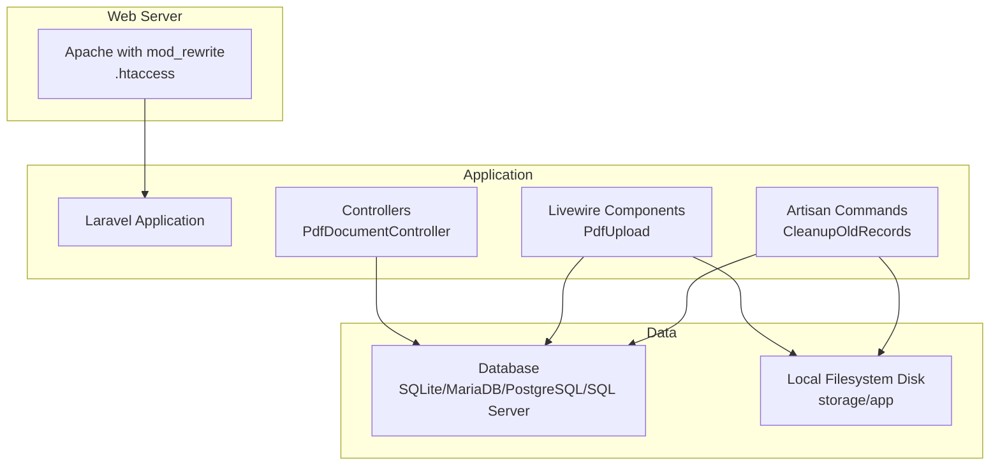
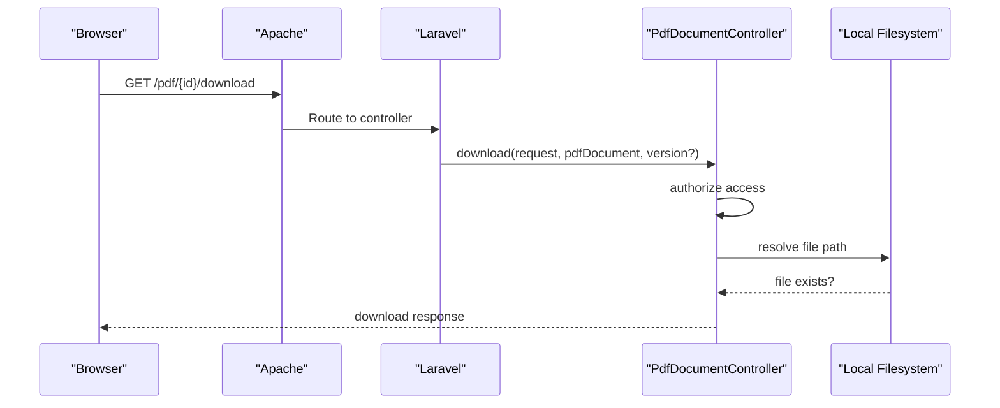
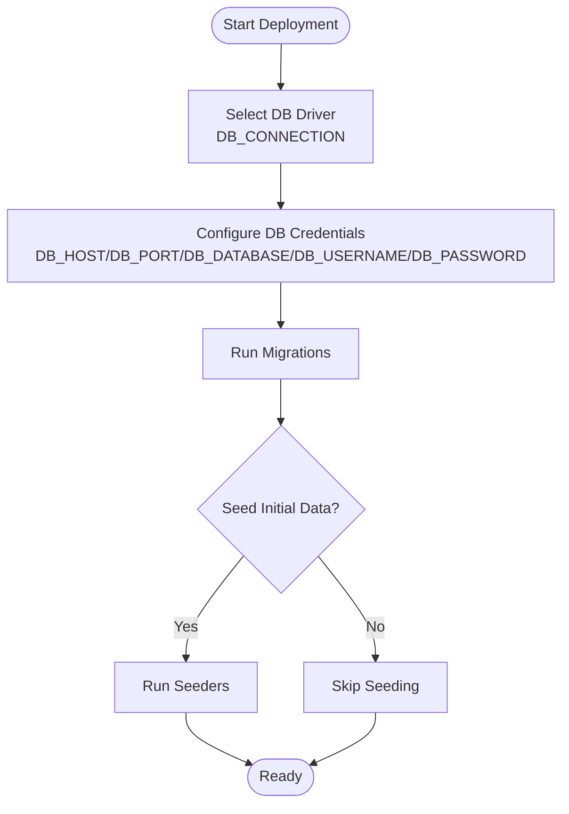
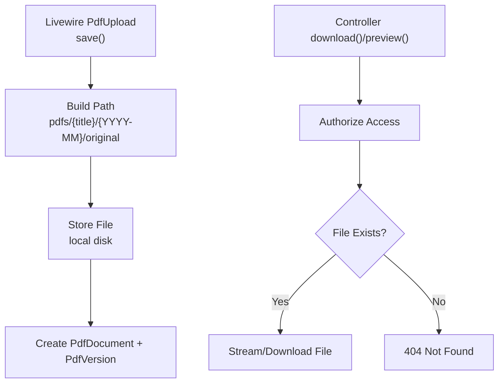
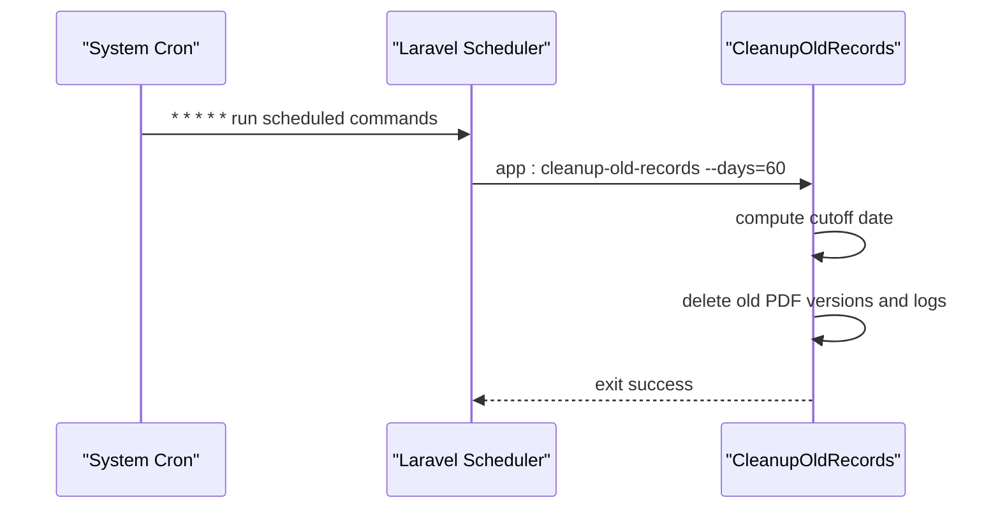
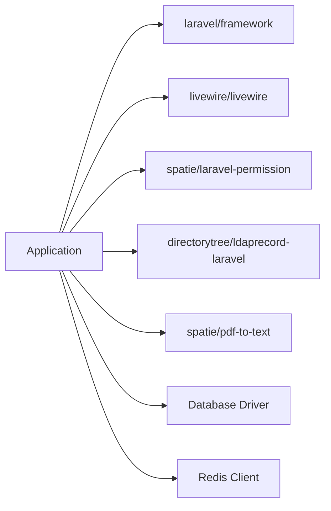

# Deployment Guide

<cite>
**Referenced Files in This Document**
- [composer.json](file://pdf-korektura/composer.json)
- [app.php](file://pdf-korektura/config/app.php)
- [database.php](file://pdf-korektura/config/database.php)
- [filesystems.php](file://pdf-korektura/config/filesystems.php)
- [.htaccess](file://pdf-korektura/public/.htaccess)
- [console.php](file://pdf-korektura/routes/console.php)
- [CleanupOldRecords.php](file://pdf-korektura/app/Console/Commands/CleanupOldRecords.php)
- [PdfDocumentController.php](file://pdf-korektura/app/Http/Controllers/PdfDocumentController.php)
- [PdfUpload.php](file://pdf-korektura/app/Livewire/PdfUpload.php)
- [2024_06_10_120000_create_pdf_documents_table.php](file://pdf-korektura/database/migrations/2024_06_10_120000_create_pdf_documents_table.php)
- [0001_01_01_000000_create_users_table.php](file://pdf-korektura/database/migrations/0001_01_01_000000_create_users_table.php)
</cite>

## Table of Contents
1. [Introduction](#introduction)
2. [Project Structure](#project-structure)
3. [Core Components](#core-components)
4. [Architecture Overview](#architecture-overview)
5. [Detailed Component Analysis](#detailed-component-analysis)
6. [Dependency Analysis](#dependency-analysis)
7. [Performance Considerations](#performance-considerations)
8. [Troubleshooting Guide](#troubleshooting-guide)
9. [Conclusion](#conclusion)
10. [Appendices](#appendices)

## Introduction
This guide provides end-to-end deployment instructions for the PDF correction system. It covers production environment prerequisites, configuration management across environments, database migration and initialization, file storage and permissions for uploaded PDFs, scheduled maintenance via cron, SSL and HTTPS setup, backup and disaster recovery, monitoring and alerting, and deployment automation and CI/CD integration.

## Project Structure
The application is a Laravel 12 project with Livewire 3 components, SQLite as default database, and a local filesystem disk for storing PDFs. The public entry point is served via Apache with URL rewriting. Environment variables control runtime behavior, including database selection, Redis usage, and filesystem disks.

**Diagram sources**
- [app.php:1-92](file://pdf-korektura/config/app.php#L1-L92)
- [database.php:1-93](file://pdf-korektura/config/database.php#L1-L93)
- [filesystems.php:1-23](file://pdf-korektura/config/filesystems.php#L1-L23)
- [PdfDocumentController.php:1-82](file://pdf-korektura/app/Http/Controllers/PdfDocumentController.php#L1-L82)
- [PdfUpload.php:1-96](file://pdf-korektura/app/Livewire/PdfUpload.php#L1-L96)
- [CleanupOldRecords.php:1-47](file://pdf-korektura/app/Console/Commands/CleanupOldRecords.php#L1-L47)

**Section sources**
- [app.php:1-92](file://pdf-korektura/config/app.php#L1-L92)
- [database.php:1-93](file://pdf-korektura/config/database.php#L1-L93)
- [filesystems.php:1-23](file://pdf-korektura/config/filesystems.php#L1-L23)
- [.htaccess:1-22](file://pdf-korektura/public/.htaccess#L1-L22)

## Core Components
- Application configuration: environment-driven settings for debug, URL, locale, providers, and maintenance mode.
- Database configuration: support for SQLite, MySQL, PostgreSQL, and SQL Server with Redis options.
- Filesystem configuration: local disk for uploads and a public symlink for asset serving.
- Web server rewrite rules: Apache mod_rewrite to route requests to index.php and normalize URLs.
- Scheduled tasks: daily cleanup command for old records and PDF versions.

Key deployment responsibilities:
- Set environment variables per stage (development, staging, production).
- Provision database and Redis instances.
- Configure web server to serve the public directory and enable mod_rewrite.
- Initialize storage and permissions for uploaded PDFs.
- Schedule cron jobs for maintenance tasks.
- Configure SSL/TLS and HTTPS.
- Establish backups and monitoring.

**Section sources**
- [app.php:1-92](file://pdf-korektura/config/app.php#L1-L92)
- [database.php:1-93](file://pdf-korektura/config/database.php#L1-L93)
- [filesystems.php:1-23](file://pdf-korektura/config/filesystems.php#L1-L23)
- [.htaccess:1-22](file://pdf-korektura/public/.htaccess#L1-L22)
- [console.php:1-12](file://pdf-korektura/routes/console.php#L1-L12)

## Architecture Overview
The system uses a standard Laravel MVC architecture with Livewire for interactive UI. Uploaded PDFs are stored on the local filesystem under a structured path derived from the publication title and year-month. Downloads and previews are handled by the controller, which validates access and streams content from storage.

**Diagram sources**
- [PdfDocumentController.php:1-82](file://pdf-korektura/app/Http/Controllers/PdfDocumentController.php#L1-L82)
- [filesystems.php:1-23](file://pdf-korektura/config/filesystems.php#L1-L23)

**Section sources**
- [PdfDocumentController.php:1-82](file://pdf-korektura/app/Http/Controllers/PdfDocumentController.php#L1-L82)
- [PdfUpload.php:1-96](file://pdf-korektura/app/Livewire/PdfUpload.php#L1-L96)

## Detailed Component Analysis

### Environment Configuration Management
- Use environment-specific .env files or CI/CD secrets to set APP_ENV, APP_DEBUG, APP_URL, FRONTEND_URL, DB_CONNECTION, DB_* variables, REDIS_* variables, and FILESYSTEM_DISK.
- Recommended stages:
  - Development: APP_ENV=local, APP_DEBUG=true, DB_CONNECTION=sqlite, FILESYSTEM_DISK=local
  - Staging: APP_ENV=staging, APP_DEBUG=false, DB_CONNECTION=mysql|pgsql, FILESYSTEM_DISK=local
  - Production: APP_ENV=production, APP_DEBUG=false, DB_CONNECTION=mysql|pgsql, FILESYSTEM_DISK=local
- Keep APP_KEY generated and consistent across deployments.

Operational notes:
- Maintenance mode can be controlled via APP_MAINTENANCE_DRIVER and APP_MAINTENANCE_STORE.
- Asset URL and frontend URL are configurable for reverse proxy or CDN setups.

**Section sources**
- [app.php:1-92](file://pdf-korektura/config/app.php#L1-L92)
- [database.php:1-93](file://pdf-korektura/config/database.php#L1-L93)

### Database Migration and Initialization
- Supported drivers: sqlite, mysql, pgsql, sqlsrv.
- Migrations define users, sessions, jobs, cache, permission tables, titles, PDF documents, PDF versions, and activity logs.
- Initialization steps:
  - Choose driver via DB_CONNECTION and configure credentials.
  - Run migrations to create tables.
  - Seed initial data if applicable.
  - For SQLite, ensure the database file exists and is writable by the web server.

**Diagram sources**
- [database.php:1-93](file://pdf-korektura/config/database.php#L1-L93)
- [0001_01_01_000000_create_users_table.php:1-47](file://pdf-korektura/database/migrations/0001_01_01_000000_create_users_table.php#L1-L47)
- [2024_06_10_120000_create_pdf_documents_table.php:1-32](file://pdf-korektura/database/migrations/2024_06_10_120000_create_pdf_documents_table.php#L1-L32)

**Section sources**
- [database.php:1-93](file://pdf-korektura/config/database.php#L1-L93)
- [0001_01_01_000000_create_users_table.php:1-47](file://pdf-korektura/database/migrations/0001_01_01_000000_create_users_table.php#L1-L47)
- [2024_06_10_120000_create_pdf_documents_table.php:1-32](file://pdf-korektura/database/migrations/2024_06_10_120000_create_pdf_documents_table.php#L1-L32)

### File Permissions and Storage Configuration for PDFs
- Default filesystem disk: local, with root at storage/app and a public symlink at public/storage -> storage/app/public.
- Uploads are stored under storage/app/pdfs/{title}/{YYYY-MM}/original with unique filenames.
- Access control:
  - Downloads and previews are validated against user roles and ownership/assignment.
  - Storage paths are resolved via storage_path('app/' . $version->file_path).

Recommendations:
- Ensure the web server user owns storage/app and storage/app/public.
- Set restrictive permissions on storage/app and readable permissions on storage/app/public for assets.
- Use a dedicated subdirectory per publisher/title and month for scalability.

**Diagram sources**
- [PdfUpload.php:1-96](file://pdf-korektura/app/Livewire/PdfUpload.php#L1-L96)
- [PdfDocumentController.php:1-82](file://pdf-korektura/app/Http/Controllers/PdfDocumentController.php#L1-L82)
- [filesystems.php:1-23](file://pdf-korektura/config/filesystems.php#L1-L23)

**Section sources**
- [PdfUpload.php:1-96](file://pdf-korektura/app/Livewire/PdfUpload.php#L1-L96)
- [PdfDocumentController.php:1-82](file://pdf-korektura/app/Http/Controllers/PdfDocumentController.php#L1-L82)
- [filesystems.php:1-23](file://pdf-korektura/config/filesystems.php#L1-L23)

### Cron Job Setup for Scheduled Maintenance Tasks
- Daily cleanup task removes archived PDFs older than N days, along with associated versions and activity logs.
- Configure system cron to run the Laravel scheduler every minute to trigger scheduled commands.

**Diagram sources**
- [console.php:1-12](file://pdf-korektura/routes/console.php#L1-L12)
- [CleanupOldRecords.php:1-47](file://pdf-korektura/app/Console/Commands/CleanupOldRecords.php#L1-L47)

**Section sources**
- [console.php:1-12](file://pdf-korektura/routes/console.php#L1-L12)
- [CleanupOldRecords.php:1-47](file://pdf-korektura/app/Console/Commands/CleanupOldRecords.php#L1-L47)

### SSL Certificate Configuration and HTTPS Setup
- Configure APP_URL and FRONTEND_URL to use https in production.
- For Apache, enable ssl_module and configure VirtualHost with SSLEngine, SSLCertificateFile, and SSLCertificateKeyFile.
- Redirect HTTP to HTTPS using a 301 redirect in .htaccess or server config.
- Ensure proper cipher suites and TLS protocol versions are enforced.

[No sources needed since this section provides general guidance]

### Backup Procedures and Disaster Recovery Planning
- Database:
  - For SQLite: back up the database file regularly; consider WAL-mode considerations.
  - For MySQL/PostgreSQL: use native logical backups (mysqldump/pg_dump) or physical backups.
- Filesystem:
  - Back up storage/app/pdfs and storage/app/public (symlink target).
- Automation:
  - Schedule periodic rsync or tar-based backups.
  - Test restoration in a staging environment.
- Offsite storage:
  - Store backups in secure, offsite locations or cloud storage with encryption.

[No sources needed since this section provides general guidance]

### Monitoring Setup and Alerting Configuration
- Application logs:
  - Centralize logs from storage/logs and integrate with log aggregation systems.
- Health checks:
  - Expose a simple endpoint to verify database connectivity and storage accessibility.
- Metrics:
  - Track queue processing (if queues are enabled), disk usage, and error rates.
- Alerts:
  - Notify on failed migrations, missing SSL certificates, low disk space, and excessive errors.

[No sources needed since this section provides general guidance]

### Deployment Automation Scripts and CI/CD Pipeline Integration
- Composer dependencies:
  - Install dependencies and run post-scripts as defined in composer.json.
- Artisan commands:
  - Generate APP_KEY during project creation.
  - Run migrations gracefully during deployment.
- CI/CD checklist:
  - Build artifacts, install dependencies, run tests, apply migrations, clear caches, warm routes.
  - Use environment-specific .env files and secret managers for sensitive values.

**Section sources**
- [composer.json:1-70](file://pdf-korektura/composer.json#L1-L70)

## Dependency Analysis
The application depends on Laravel core, Livewire, LDAP integration, permission management, and PDF parsing. Database and cache backends are pluggable via environment variables.

**Diagram sources**
- [composer.json:1-70](file://pdf-korektura/composer.json#L1-L70)
- [database.php:1-93](file://pdf-korektura/config/database.php#L1-L93)

**Section sources**
- [composer.json:1-70](file://pdf-korektura/composer.json#L1-L70)
- [database.php:1-93](file://pdf-korektura/config/database.php#L1-L93)

## Performance Considerations
- Use a production-ready database (MySQL/PostgreSQL) instead of SQLite for concurrency and reliability.
- Enable Redis for caching and queues if scaling.
- Optimize PHP-FPM and Apache worker processes for concurrent PDF uploads/downloads.
- Consider CDN for static assets and public storage links.

[No sources needed since this section provides general guidance]

## Troubleshooting Guide
- 403/404 on downloads:
  - Verify user role and ownership/assignment rules in the controller.
  - Confirm file exists at the computed storage path.
- Storage permission denied:
  - Ensure web server user has write/read access to storage directories.
- Migration failures:
  - Check DB credentials and connection string; verify database existence and privileges.
- Cron not running:
  - Confirm system cron executes the scheduler and that the timezone matches expectations.

**Section sources**
- [PdfDocumentController.php:1-82](file://pdf-korektura/app/Http/Controllers/PdfDocumentController.php#L1-L82)
- [CleanupOldRecords.php:1-47](file://pdf-korektura/app/Console/Commands/CleanupOldRecords.php#L1-L47)

## Conclusion
This guide outlines a production-ready deployment strategy for the PDF correction system. By carefully managing environment variables, configuring databases and filesystems, setting up SSL and cron, and establishing backups and monitoring, you can operate a reliable and scalable platform for PDF document management and correction workflows.

## Appendices
- Apache .htaccess enforces trailing slash removal, Authorization header handling, and front controller routing.
- Web server must serve the public directory and allow .htaccess overrides.

**Section sources**
- [.htaccess:1-22](file://pdf-korektura/public/.htaccess#L1-L22)