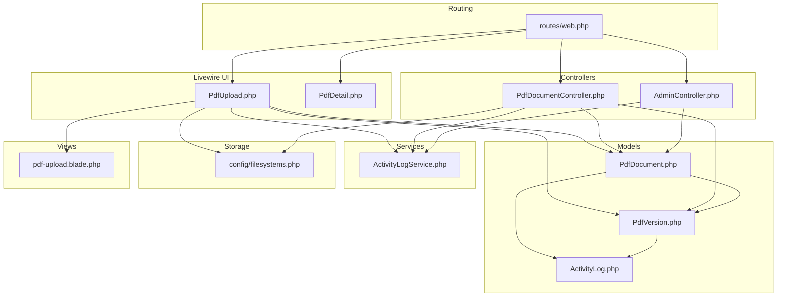
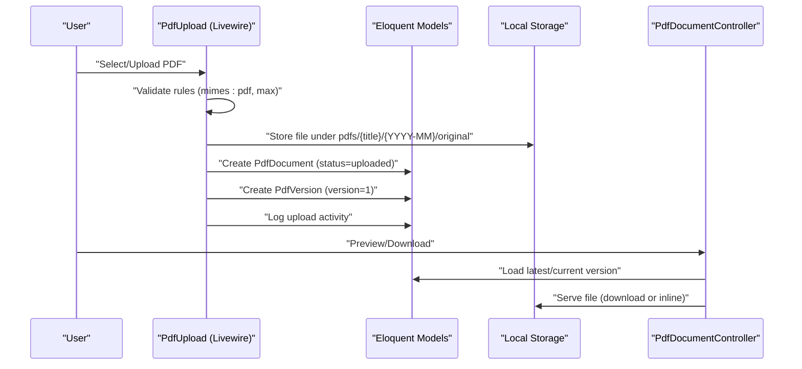
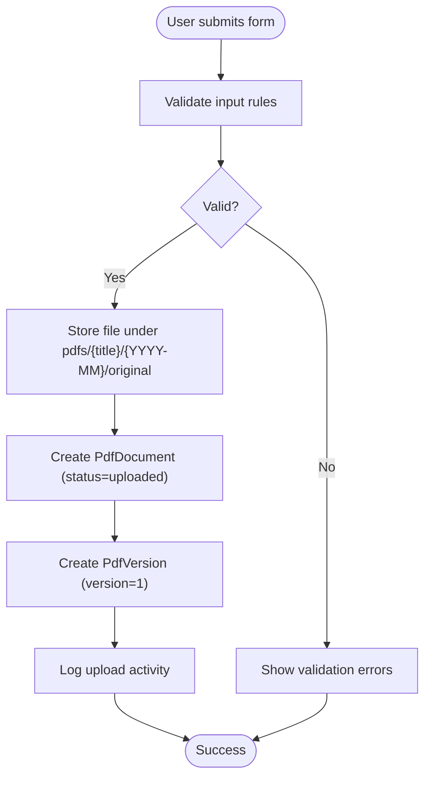
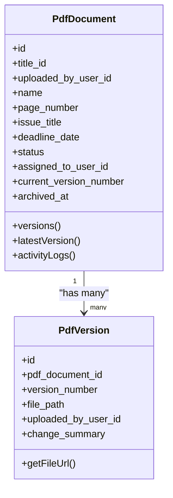
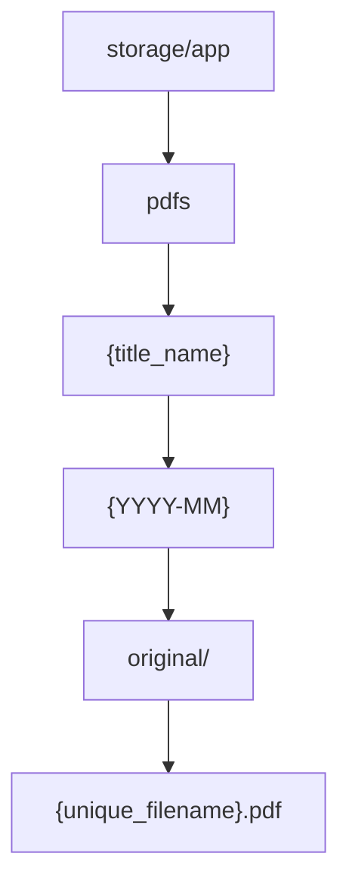
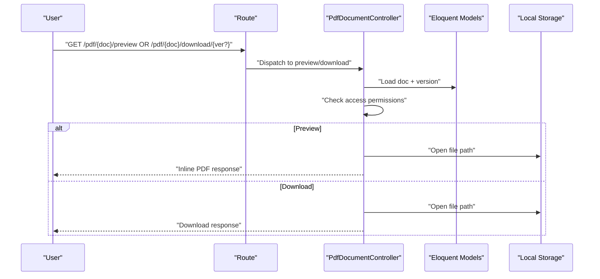
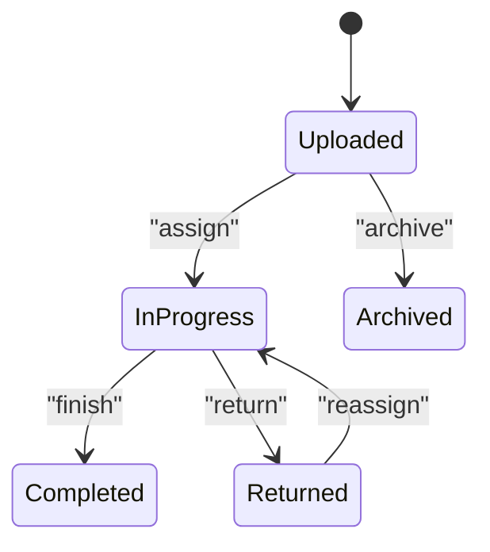
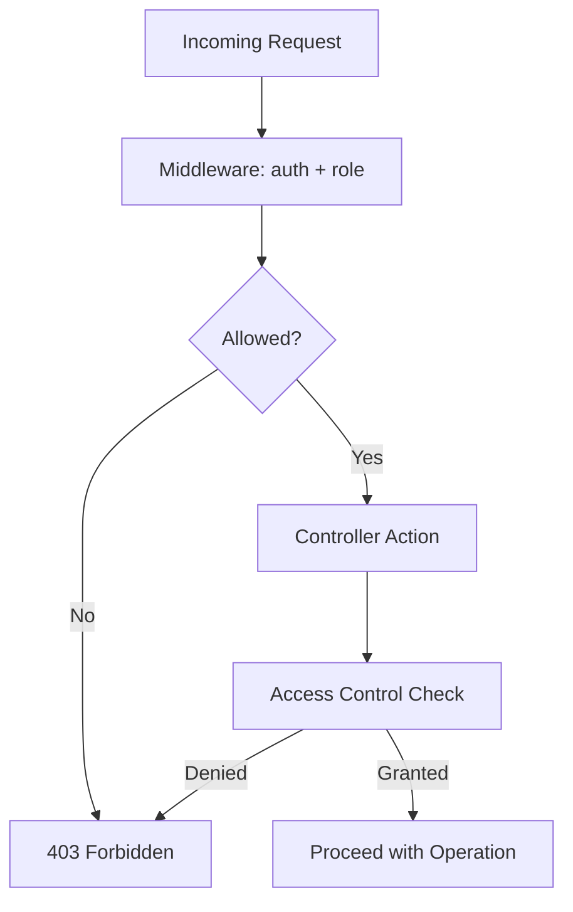
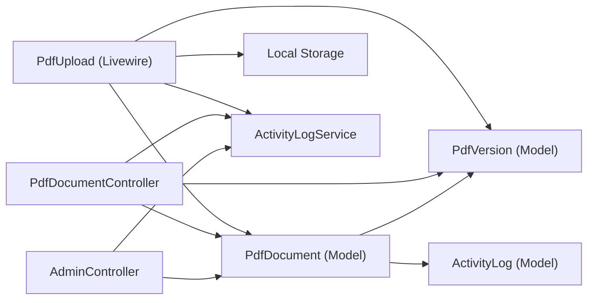

# Document Management

<cite>
**Referenced Files in This Document**
- [PdfDocumentController.php](file://app/Http/Controllers/PdfDocumentController.php)
- [PdfUpload.php](file://app/Livewire/PdfUpload.php)
- [PdfDetail.php](file://app/Livewire/PdfDetail.php)
- [PdfDocument.php](file://app/Models/PdfDocument.php)
- [PdfVersion.php](file://app/Models/PdfVersion.php)
- [ActivityLogService.php](file://app/Services/ActivityLogService.php)
- [ActivityLog.php](file://app/Models/ActivityLog.php)
- [AdminController.php](file://app/Http/Controllers/AdminController.php)
- [web.php](file://routes/web.php)
- [filesystems.php](file://config/filesystems.php)
- [2024_06_10_120000_create_pdf_documents_table.php](file://database/migrations/2024_06_10_120000_create_pdf_documents_table.php)
- [2024_06_10_130000_create_pdf_versions_table.php](file://database/migrations/2024_06_10_130000_create_pdf_versions_table.php)
- [pdf-upload.blade.php](file://resources/views/livewire/pdf-upload.blade.php)
</cite>

## Table of Contents
1. [Introduction](#introduction)
2. [Project Structure](#project-structure)
3. [Core Components](#core-components)
4. [Architecture Overview](#architecture-overview)
5. [Detailed Component Analysis](#detailed-component-analysis)
6. [Dependency Analysis](#dependency-analysis)
7. [Performance Considerations](#performance-considerations)
8. [Troubleshooting Guide](#troubleshooting-guide)
9. [Conclusion](#conclusion)
10. [Appendices](#appendices)

## Introduction
This document explains the document management system for the PDF correction workflow. It covers the complete lifecycle from PDF upload and validation, through metadata management and storage organization, to preview and download capabilities, versioning, status tracking, administrative controls, and security enforcement. The system is built with Laravel and Livewire, using Eloquent models for persistence and a local filesystem for storage.

## Project Structure
The document management functionality spans Livewire components for user interaction, controllers for secure downloads/previews, Eloquent models for data relations, migrations for schema definition, routing for access control, and configuration for storage.



**Diagram sources**
- [web.php:25-53](file://routes/web.php#L25-L53)
- [PdfUpload.php:16-96](file://app/Livewire/PdfUpload.php#L16-L96)
- [PdfDetail.php:10-24](file://app/Livewire/PdfDetail.php#L10-L24)
- [PdfDocumentController.php:13-82](file://app/Http/Controllers/PdfDocumentController.php#L13-L82)
- [AdminController.php:11-62](file://app/Http/Controllers/AdminController.php#L11-L62)
- [PdfDocument.php:10-130](file://app/Models/PdfDocument.php#L10-L130)
- [PdfVersion.php:9-43](file://app/Models/PdfVersion.php#L9-L43)
- [ActivityLog.php:9-60](file://app/Models/ActivityLog.php#L9-L60)
- [ActivityLogService.php:10-31](file://app/Services/ActivityLogService.php#L10-L31)
- [filesystems.php:3-23](file://config/filesystems.php#L3-L23)
- [pdf-upload.blade.php:1-142](file://resources/views/livewire/pdf-upload.blade.php#L1-L142)

**Section sources**
- [web.php:25-53](file://routes/web.php#L25-L53)
- [PdfUpload.php:16-96](file://app/Livewire/PdfUpload.php#L16-L96)
- [PdfDocumentController.php:13-82](file://app/Http/Controllers/PdfDocumentController.php#L13-L82)
- [PdfDocument.php:10-130](file://app/Models/PdfDocument.php#L10-L130)
- [PdfVersion.php:9-43](file://app/Models/PdfVersion.php#L9-L43)
- [ActivityLogService.php:10-31](file://app/Services/ActivityLogService.php#L10-L31)
- [filesystems.php:3-23](file://config/filesystems.php#L3-L23)
- [pdf-upload.blade.php:1-142](file://resources/views/livewire/pdf-upload.blade.php#L1-L142)

## Core Components
- PDF Upload (Livewire): Handles file selection/drop, validation, and creates the initial document and version records.
- PDF Document Controller: Provides secure preview and download endpoints with role-based access checks.
- Models: Define document metadata, version history, and activity logging.
- Storage: Local filesystem configuration for storing PDFs under a structured path.
- Routing: Enforces middleware-based access control for roles and actions.
- Activity Logging: Centralized service to track user actions across the system.

**Section sources**
- [PdfUpload.php:16-96](file://app/Livewire/PdfUpload.php#L16-L96)
- [PdfDocumentController.php:13-82](file://app/Http/Controllers/PdfDocumentController.php#L13-L82)
- [PdfDocument.php:10-130](file://app/Models/PdfDocument.php#L10-L130)
- [PdfVersion.php:9-43](file://app/Models/PdfVersion.php#L9-L43)
- [ActivityLogService.php:10-31](file://app/Services/ActivityLogService.php#L10-L31)
- [filesystems.php:3-23](file://config/filesystems.php#L3-L23)
- [web.php:25-53](file://routes/web.php#L25-L53)

## Architecture Overview
The system separates concerns between presentation (Livewire), business logic (controllers), and persistence (Eloquent). Access control is enforced via middleware and controller-side checks. Storage is handled by the configured local disk, with files organized by title and year-month.



**Diagram sources**
- [PdfUpload.php:27-87](file://app/Livewire/PdfUpload.php#L27-L87)
- [PdfDocumentController.php:15-63](file://app/Http/Controllers/PdfDocumentController.php#L15-L63)
- [PdfDocument.php:56-65](file://app/Models/PdfDocument.php#L56-L65)
- [PdfVersion.php:28-41](file://app/Models/PdfVersion.php#L28-L41)
- [filesystems.php:6-10](file://config/filesystems.php#L6-L10)

## Detailed Component Analysis

### PDF Upload and Validation
- Validation rules enforce PDF MIME type, maximum file size, required fields, and date constraints.
- File storage path is constructed from the selected title and current year-month.
- On successful validation, a document record is created with initial status and a first version is attached.



**Diagram sources**
- [PdfUpload.php:27-87](file://app/Livewire/PdfUpload.php#L27-L87)
- [pdf-upload.blade.php:26-89](file://resources/views/livewire/pdf-upload.blade.php#L26-L89)

**Section sources**
- [PdfUpload.php:27-87](file://app/Livewire/PdfUpload.php#L27-L87)
- [pdf-upload.blade.php:26-89](file://resources/views/livewire/pdf-upload.blade.php#L26-L89)

### Document Metadata Management
- Documents include title association, uploader identity, name, page count, issue title, deadline, status, assignee, current version number, and archival timestamp.
- Titles are selectable from an active list, ensuring categorization consistency.
- Status values support the correction workflow stages.



**Diagram sources**
- [PdfDocument.php:14-65](file://app/Models/PdfDocument.php#L14-L65)
- [PdfVersion.php:13-41](file://app/Models/PdfVersion.php#L13-L41)

**Section sources**
- [PdfDocument.php:14-39](file://app/Models/PdfDocument.php#L14-L39)
- [PdfDocument.php:56-96](file://app/Models/PdfDocument.php#L56-L96)
- [PdfUpload.php:51-80](file://app/Livewire/PdfUpload.php#L51-L80)

### File Storage System and Directory Organization
- Storage driver is local with a root under the application storage path.
- Uploaded files are stored under a path derived from the title name and current year-month, grouped into an "original" subdirectory.
- The filesystem configuration exposes a public disk but PDFs are served via controllers for access control.



**Diagram sources**
- [filesystems.php:6-10](file://config/filesystems.php#L6-L10)
- [PdfUpload.php:52-61](file://app/Livewire/PdfUpload.php#L52-L61)

**Section sources**
- [filesystems.php:3-23](file://config/filesystems.php#L3-L23)
- [PdfUpload.php:52-61](file://app/Livewire/PdfUpload.php#L52-L61)

### Document Preview and Download
- Preview serves the latest version inline within the browser.
- Download returns the requested version (default latest) as a downloadable attachment.
- Access control ensures only authorized users (admin, editor who uploaded, or proofreader assigned) can access documents.



**Diagram sources**
- [web.php:38-41](file://routes/web.php#L38-L41)
- [PdfDocumentController.php:15-63](file://app/Http/Controllers/PdfDocumentController.php#L15-L63)
- [PdfDocument.php:56-65](file://app/Models/PdfDocument.php#L56-L65)
- [PdfVersion.php:28-41](file://app/Models/PdfVersion.php#L28-L41)

**Section sources**
- [PdfDocumentController.php:15-63](file://app/Http/Controllers/PdfDocumentController.php#L15-L63)
- [web.php:38-41](file://routes/web.php#L38-L41)

### Document Versioning System
- Each uploaded PDF has a dedicated versions table with unique version numbers per document.
- New versions are created when editors submit corrected files; the system tracks who uploaded and a summary of changes.
- The latest version is determined by highest version number, while downloads can target a specific version.

```mermaid
erDiagram
PDF_DOCUMENTS {
bigint id PK
bigint title_id FK
bigint uploaded_by_user_id FK
string name
int page_number
string issue_title
date deadline_date
enum status
bigint assigned_to_user_id FK
int current_version_number
timestamp archived_at
timestamps
}
PDF_VERSIONS {
bigint id PK
bigint pdf_document_id FK
int version_number
string file_path
bigint uploaded_by_user_id FK
text change_summary
timestamps
}
PDF_DOCUMENTS ||--o{ PDF_VERSIONS : "contains"
```

**Diagram sources**
- [2024_06_10_120000_create_pdf_documents_table.php:11-24](file://database/migrations/2024_06_10_120000_create_pdf_documents_table.php#L11-L24)
- [2024_06_10_130000_create_pdf_versions_table.php:11-21](file://database/migrations/2024_06_10_130000_create_pdf_versions_table.php#L11-L21)

**Section sources**
- [PdfVersion.php:13-26](file://app/Models/PdfVersion.php#L13-L26)
- [PdfDocument.php:56-65](file://app/Models/PdfDocument.php#L56-L65)

### Document Status Management
- Status lifecycle includes uploaded, in_progress, returned, and completed.
- Administrative actions reset assignments and update status accordingly.
- Status labels and colors are mapped for UI display.



**Diagram sources**
- [PdfDocument.php:14-17](file://app/Models/PdfDocument.php#L14-L17)
- [PdfDocument.php:108-128](file://app/Models/PdfDocument.php#L108-L128)
- [AdminController.php:13-60](file://app/Http/Controllers/AdminController.php#L13-L60)

**Section sources**
- [PdfDocument.php:14-17](file://app/Models/PdfDocument.php#L14-L17)
- [PdfDocument.php:108-128](file://app/Models/PdfDocument.php#L108-L128)
- [AdminController.php:13-60](file://app/Http/Controllers/AdminController.php#L13-L60)

### Bulk Operations and Batch Processing
- No explicit bulk upload or batch processing endpoints are present in the current codebase.
- Administrative controls allow releasing and reassigning single documents, but batch operations are not implemented.

**Section sources**
- [web.php:43-52](file://routes/web.php#L43-L52)
- [AdminController.php:13-60](file://app/Http/Controllers/AdminController.php#L13-L60)

### Security and Access Controls
- Role-based middleware restricts access to upload, pool, and admin features.
- Controller-level access checks verify user roles against document ownership and assignment.
- Activity logs capture actions with IP addresses for auditability.



**Diagram sources**
- [web.php:25-53](file://routes/web.php#L25-L53)
- [PdfDocumentController.php:65-80](file://app/Http/Controllers/PdfDocumentController.php#L65-L80)
- [ActivityLogService.php:20-29](file://app/Services/ActivityLogService.php#L20-L29)

**Section sources**
- [web.php:25-53](file://routes/web.php#L25-L53)
- [PdfDocumentController.php:65-80](file://app/Http/Controllers/PdfDocumentController.php#L65-L80)
- [ActivityLogService.php:20-29](file://app/Services/ActivityLogService.php#L20-L29)

## Dependency Analysis
The following diagram shows key dependencies among components involved in document management.



**Diagram sources**
- [PdfUpload.php:16-96](file://app/Livewire/PdfUpload.php#L16-L96)
- [PdfDocumentController.php:13-82](file://app/Http/Controllers/PdfDocumentController.php#L13-L82)
- [AdminController.php:11-62](file://app/Http/Controllers/AdminController.php#L11-L62)
- [PdfDocument.php:10-130](file://app/Models/PdfDocument.php#L10-L130)
- [PdfVersion.php:9-43](file://app/Models/PdfVersion.php#L9-L43)
- [ActivityLog.php:9-60](file://app/Models/ActivityLog.php#L9-L60)
- [ActivityLogService.php:10-31](file://app/Services/ActivityLogService.php#L10-L31)

**Section sources**
- [PdfUpload.php:16-96](file://app/Livewire/PdfUpload.php#L16-L96)
- [PdfDocumentController.php:13-82](file://app/Http/Controllers/PdfDocumentController.php#L13-L82)
- [AdminController.php:11-62](file://app/Http/Controllers/AdminController.php#L11-L62)
- [PdfDocument.php:10-130](file://app/Models/PdfDocument.php#L10-L130)
- [PdfVersion.php:9-43](file://app/Models/PdfVersion.php#L9-L43)
- [ActivityLog.php:9-60](file://app/Models/ActivityLog.php#L9-L60)
- [ActivityLogService.php:10-31](file://app/Services/ActivityLogService.php#L10-L31)

## Performance Considerations
- File size limit is set to approximately 50 MB; larger files may increase memory usage during processing and could impact response times.
- Storing files under year-month directories helps manage filesystem scalability for large volumes.
- Using the latest version by default for preview/download avoids unnecessary joins; ensure indexes exist on version_number and pdf_document_id for optimal query performance.
- Consider implementing background jobs for heavy operations (e.g., virus scanning, OCR) to avoid blocking requests.

## Troubleshooting Guide
- Access Denied: If preview/download returns a forbidden error, verify the user’s role and relationship to the document (uploader, assignee, or admin).
- File Not Found: If the file does not exist on disk, confirm the stored file_path matches the filesystem layout and that the version exists.
- Validation Errors: Ensure the uploaded file is a PDF, meets size constraints, and required fields are filled.
- Audit Trail: Use the audit log interface to review actions, users, dates, and details for troubleshooting.

**Section sources**
- [PdfDocumentController.php:19-37](file://app/Http/Controllers/PdfDocumentController.php#L19-L37)
- [PdfDocumentController.php:46-54](file://app/Http/Controllers/PdfDocumentController.php#L46-L54)
- [PdfUpload.php:27-49](file://app/Livewire/PdfUpload.php#L27-L49)
- [ActivityLog.php:46-58](file://app/Models/ActivityLog.php#L46-L58)

## Conclusion
The document management system provides a robust foundation for uploading, organizing, previewing, downloading, versioning, and auditing PDFs within a controlled workflow. Access control and activity logging ensure accountability, while local storage with structured directories supports maintainability. Future enhancements could include batch operations, background processing, and expanded administrative controls.

## Appendices

### Supported Formats and Size Limits
- Format: PDF only.
- Maximum file size: Approximately 50 MB.
- Additional constraints: Required fields, date validation, and integer page count.

**Section sources**
- [PdfUpload.php:27-34](file://app/Livewire/PdfUpload.php#L27-L34)
- [pdf-upload.blade.php:59-59](file://resources/views/livewire/pdf-upload.blade.php#L59-L59)

### Storage Path Construction
- Path pattern: pdfs/{title_name}/{YYYY-MM}/original/{filename}.
- Disk: local storage root configured under application storage.

**Section sources**
- [PdfUpload.php:52-61](file://app/Livewire/PdfUpload.php#L52-L61)
- [filesystems.php:6-10](file://config/filesystems.php#L6-L10)

### Roles and Permissions
- Editor/Admin: Upload PDFs and view assigned documents.
- Proofreader/Admin: View document pools and assigned documents.
- Admin: Release/reassign documents and manage titles/archives.

**Section sources**
- [web.php:28-36](file://routes/web.php#L28-L36)
- [web.php:43-52](file://routes/web.php#L43-L52)