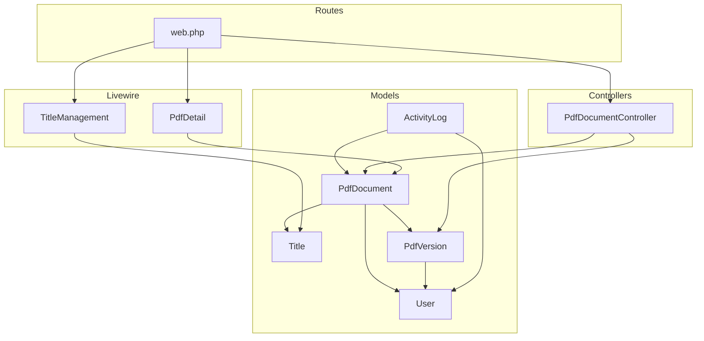
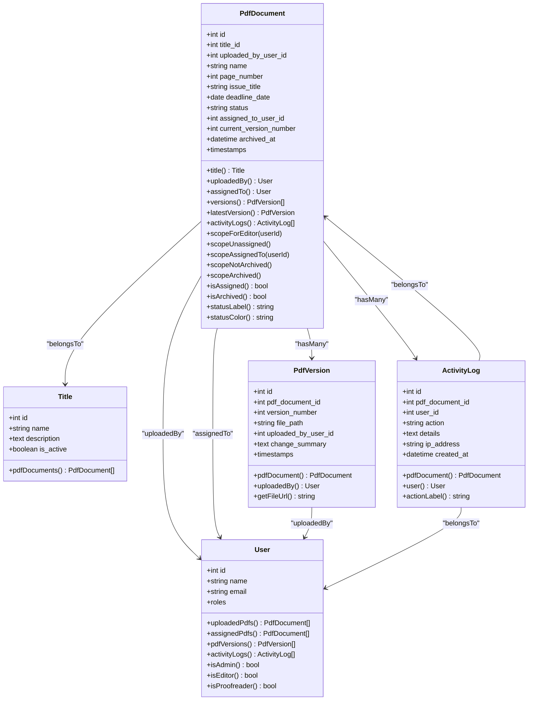
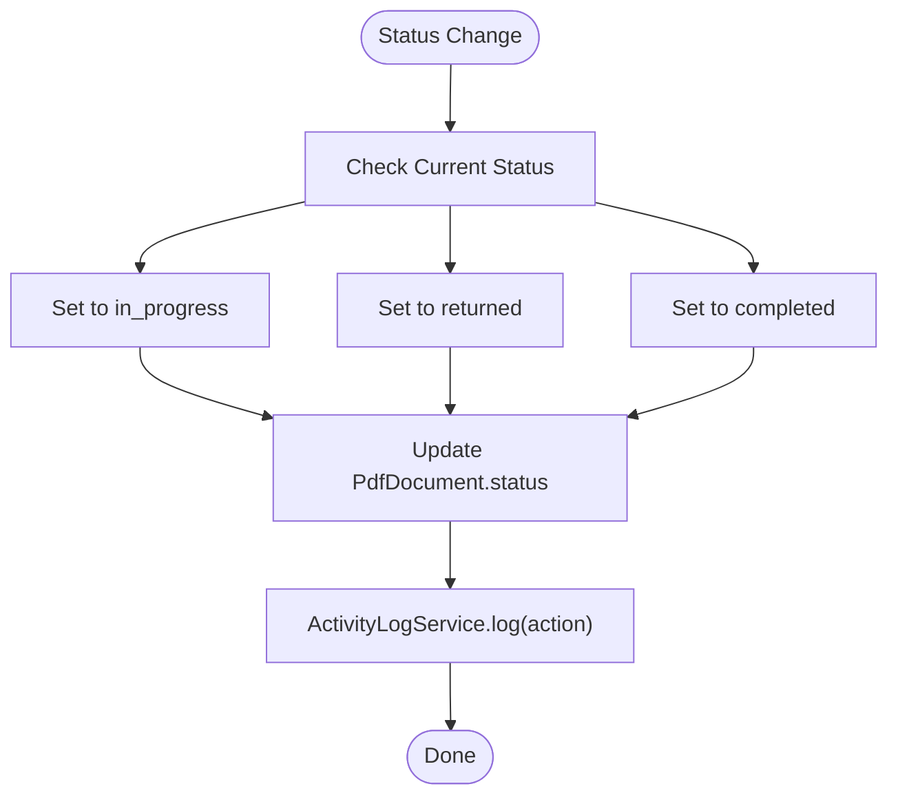
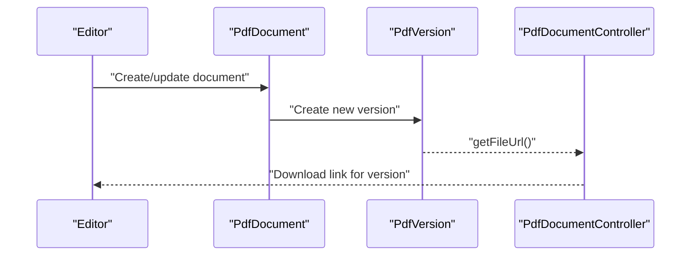
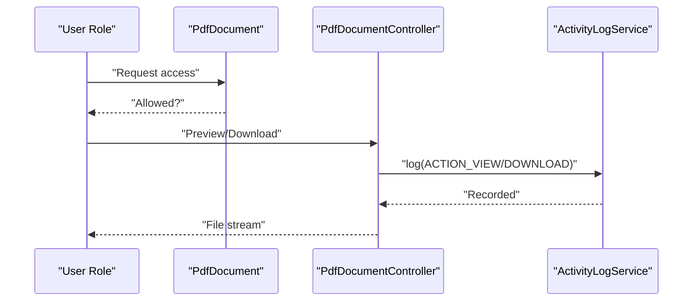
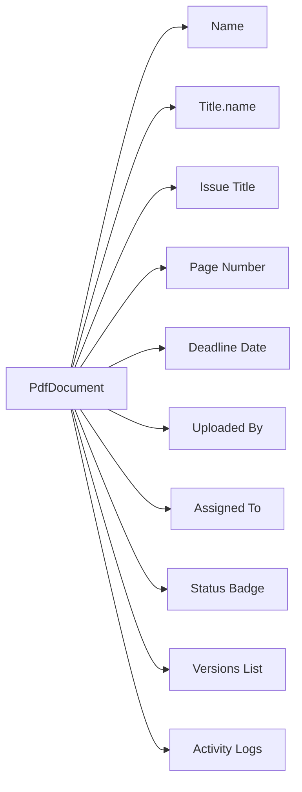
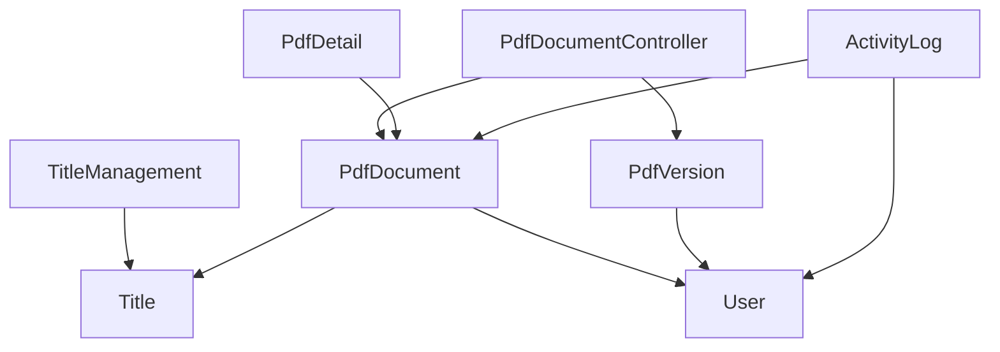

# Document Metadata Management

<cite>
**Referenced Files in This Document**
- [PdfDocument.php](file://app/Models/PdfDocument.php)
- [PdfVersion.php](file://app/Models/PdfVersion.php)
- [Title.php](file://app/Models/Title.php)
- [User.php](file://app/Models/User.php)
- [ActivityLog.php](file://app/Models/ActivityLog.php)
- [PdfDocumentController.php](file://app/Http/Controllers/PdfDocumentController.php)
- [ActivityLogService.php](file://app/Services/ActivityLogService.php)
- [PdfDetail.php](file://app/Livewire/PdfDetail.php)
- [TitleManagement.php](file://app/Livewire/Admin/TitleManagement.php)
- [create_pdf_documents_table.php](file://database/migrations/2024_06_10_120000_create_pdf_documents_table.php)
- [create_titles_table.php](file://database/migrations/2024_06_10_110000_create_titles_table.php)
- [create_pdf_versions_table.php](file://database/migrations/2024_06_10_130000_create_pdf_versions_table.php)
- [web.php](file://routes/web.php)
- [pdf-detail.blade.php](file://resources/views/livewire/pdf-detail.blade.php)
- [title-management.blade.php](file://resources/views/livewire/admin/title-management.blade.php)
</cite>

## Table of Contents
1. [Introduction](#introduction)
2. [Project Structure](#project-structure)
3. [Core Components](#core-components)
4. [Architecture Overview](#architecture-overview)
5. [Detailed Component Analysis](#detailed-component-analysis)
6. [Dependency Analysis](#dependency-analysis)
7. [Performance Considerations](#performance-considerations)
8. [Troubleshooting Guide](#troubleshooting-guide)
9. [Conclusion](#conclusion)

## Introduction
This document explains how document metadata is modeled, validated, stored, and presented across the system. It focuses on how document titles, descriptions, categorization via titles, and status tracking are handled, along with creation/modification timestamps, archival, and the correction workflow. It also covers how metadata appears in UI components and reports, and outlines validation rules and business constraints.

## Project Structure
The metadata management spans models, controllers, Livewire components, migrations, and views. The primary entities are:
- PdfDocument: central metadata container for documents
- Title: categorization and description for documents
- PdfVersion: versioned content and change summaries
- User: actors who upload, assign, correct, and archive
- ActivityLog: audit trail of actions performed on documents



**Diagram sources**
- [PdfDocument.php:10-129](file://app/Models/PdfDocument.php#L10-L129)
- [PdfVersion.php:9-42](file://app/Models/PdfVersion.php#L9-L42)
- [Title.php:9-30](file://app/Models/Title.php#L9-L30)
- [User.php:10-70](file://app/Models/User.php#L10-L70)
- [ActivityLog.php:9-59](file://app/Models/ActivityLog.php#L9-L59)
- [PdfDocumentController.php:13-81](file://app/Http/Controllers/PdfDocumentController.php#L13-L81)
- [PdfDetail.php:10-23](file://app/Livewire/PdfDetail.php#L10-L23)
- [TitleManagement.php:11-97](file://app/Livewire/Admin/TitleManagement.php#L11-L97)
- [web.php:17-53](file://routes/web.php#L17-L53)

**Section sources**
- [PdfDocument.php:10-129](file://app/Models/PdfDocument.php#L10-L129)
- [PdfVersion.php:9-42](file://app/Models/PdfVersion.php#L9-L42)
- [Title.php:9-30](file://app/Models/Title.php#L9-L30)
- [User.php:10-70](file://app/Models/User.php#L10-L70)
- [ActivityLog.php:9-59](file://app/Models/ActivityLog.php#L9-L59)
- [PdfDocumentController.php:13-81](file://app/Http/Controllers/PdfDocumentController.php#L13-L81)
- [PdfDetail.php:10-23](file://app/Livewire/PdfDetail.php#L10-L23)
- [TitleManagement.php:11-97](file://app/Livewire/Admin/TitleManagement.php#L11-L97)
- [web.php:17-53](file://routes/web.php#L17-L53)

## Core Components
- PdfDocument: stores document-level metadata including title reference, uploader, assignee, page count, issue title, deadline, current version number, archival timestamp, and status. Provides scopes for filtering and helpers for status presentation.
- Title: categorization entity with name, description, and activation flag; linked to many PdfDocument instances.
- PdfVersion: versioned content with version number, file path, uploader, and optional change summary; linked to a single PdfDocument.
- User: actors with roles (admin, editor, proofreader) who interact with documents.
- ActivityLog: records actions (upload, assign, release, correct, archive, view, download) with timestamps and IP address.

Key metadata fields in PdfDocument:
- title_id: foreign key to Title
- uploaded_by_user_id: foreign key to User
- name: document display name
- page_number: integer, nullable
- issue_title: string, nullable
- deadline_date: date
- status: enum with values uploaded, in_progress, returned, completed
- assigned_to_user_id: foreign key to User, nullable
- current_version_number: integer, default 1
- archived_at: datetime, nullable
- timestamps: created_at, updated_at

Validation and constraints:
- Migrations enforce foreign keys, enums, and unique constraints (e.g., unique combination of pdf_document_id and version_number).
- Roles-based access controls restrict who can view, download, or modify documents.

**Section sources**
- [PdfDocument.php:14-39](file://app/Models/PdfDocument.php#L14-L39)
- [PdfDocument.php:72-96](file://app/Models/PdfDocument.php#L72-L96)
- [PdfDocument.php:108-128](file://app/Models/PdfDocument.php#L108-L128)
- [create_pdf_documents_table.php:11-24](file://database/migrations/2024_06_10_120000_create_pdf_documents_table.php#L11-L24)
- [create_titles_table.php:11-17](file://database/migrations/2024_06_10_110000_create_titles_table.php#L11-L17)
- [create_pdf_versions_table.php:11-21](file://database/migrations/2024_06_10_130000_create_pdf_versions_table.php#L11-L21)
- [User.php:56-69](file://app/Models/User.php#L56-L69)

## Architecture Overview
The system separates concerns across models, controllers, services, and Livewire components. Access control is role-based, and activity logging captures all significant actions.



**Diagram sources**
- [PdfDocument.php:10-129](file://app/Models/PdfDocument.php#L10-L129)
- [Title.php:9-30](file://app/Models/Title.php#L9-L30)
- [PdfVersion.php:9-42](file://app/Models/PdfVersion.php#L9-L42)
- [User.php:10-70](file://app/Models/User.php#L10-L70)
- [ActivityLog.php:9-59](file://app/Models/ActivityLog.php#L9-L59)

## Detailed Component Analysis

### PdfDocument Model: Metadata Fields and Behavior
- Status lifecycle: uploaded → in_progress → returned/completed, with helpers for label and color.
- Scopes enable filtering by editor ownership, assignment, and archival state.
- Relationships: belongs to Title, belongs to User (uploader/assignee), has many PdfVersion, has many ActivityLog.
- Accessors: checks for assignment/archival state.



**Diagram sources**
- [PdfDocument.php:14-18](file://app/Models/PdfDocument.php#L14-L18)
- [PdfDocument.php:108-128](file://app/Models/PdfDocument.php#L108-L128)
- [ActivityLogService.php:20-29](file://app/Services/ActivityLogService.php#L20-L29)

**Section sources**
- [PdfDocument.php:14-39](file://app/Models/PdfDocument.php#L14-L39)
- [PdfDocument.php:41-70](file://app/Models/PdfDocument.php#L41-L70)
- [PdfDocument.php:72-106](file://app/Models/PdfDocument.php#L72-L106)
- [PdfDocument.php:108-128](file://app/Models/PdfDocument.php#L108-L128)

### Title Categorization and Description Management
- Titles define categories with name, description, and activation flag.
- Titles are searchable and filterable in the admin interface.
- Validation ensures name length and optional description length.

```mermaid
sequenceDiagram
participant Admin as "Admin UI"
participant TM as "TitleManagement"
participant Title as "Title Model"
participant View as "title-management.blade.php"
Admin->>TM : "Open manage titles"
TM->>View : "Render form + list"
Admin->>TM : "Submit create/edit"
TM->>Title : "Validate and persist"
Title-->>TM : "Saved"
TM-->>Admin : "Notify success"
```

**Diagram sources**
- [TitleManagement.php:21-65](file://app/Livewire/Admin/TitleManagement.php#L21-L65)
- [TitleManagement.php:85-96](file://app/Livewire/Admin/TitleManagement.php#L85-L96)
- [title-management.blade.php:40-86](file://resources/views/livewire/admin/title-management.blade.php#L40-L86)
- [Title.php:13-29](file://app/Models/Title.php#L13-L29)

**Section sources**
- [Title.php:13-29](file://app/Models/Title.php#L13-L29)
- [TitleManagement.php:21-65](file://app/Livewire/Admin/TitleManagement.php#L21-L65)
- [TitleManagement.php:85-96](file://app/Livewire/Admin/TitleManagement.php#L85-L96)
- [title-management.blade.php:40-86](file://resources/views/livewire/admin/title-management.blade.php#L40-L86)

### Versioning and Change Tracking
- PdfVersion tracks each document version with version_number, file_path, uploaded_by_user_id, and optional change_summary.
- Unique constraint prevents duplicate versions per document.
- Utility method generates download URLs for specific versions.



**Diagram sources**
- [PdfVersion.php:13-41](file://app/Models/PdfVersion.php#L13-L41)
- [create_pdf_versions_table.php:11-21](file://database/migrations/2024_06_10_130000_create_pdf_versions_table.php#L11-L21)
- [PdfDocumentController.php:15-40](file://app/Http/Controllers/PdfDocumentController.php#L15-L40)

**Section sources**
- [PdfVersion.php:13-41](file://app/Models/PdfVersion.php#L13-L41)
- [create_pdf_versions_table.php:11-21](file://database/migrations/2024_06_10_130000_create_pdf_versions_table.php#L11-L21)
- [PdfDocumentController.php:15-40](file://app/Http/Controllers/PdfDocumentController.php#L15-L40)

### Correction Workflow and Metadata Interactions
- Access control: admins can release/reassign; editors can view own uploads; proofreaders can view assigned documents.
- Activity logging captures all actions (upload, assign, release, correct, archive, view, download).
- Status transitions are reflected in UI labels and colors.



**Diagram sources**
- [PdfDocumentController.php:65-80](file://app/Http/Controllers/PdfDocumentController.php#L65-L80)
- [ActivityLogService.php:20-29](file://app/Services/ActivityLogService.php#L20-L29)
- [web.php:25-52](file://routes/web.php#L25-L52)

**Section sources**
- [PdfDocumentController.php:65-80](file://app/Http/Controllers/PdfDocumentController.php#L65-L80)
- [ActivityLogService.php:20-29](file://app/Services/ActivityLogService.php#L20-L29)
- [web.php:25-52](file://routes/web.php#L25-L52)

### Metadata Display in UI Components and Reports
- PdfDetail displays document name, title category, issue title, page count, deadline, uploader, assignee, status badge, and history of versions and activity logs.
- TitleManagement lists titles with search, pagination, and inline status indicators.



**Diagram sources**
- [PdfDetail.php:14-16](file://app/Livewire/PdfDetail.php#L14-L16)
- [pdf-detail.blade.php:11-84](file://resources/views/livewire/pdf-detail.blade.php#L11-L84)

**Section sources**
- [PdfDetail.php:14-16](file://app/Livewire/PdfDetail.php#L14-L16)
- [pdf-detail.blade.php:11-84](file://resources/views/livewire/pdf-detail.blade.php#L11-L84)
- [TitleManagement.php:85-96](file://app/Livewire/Admin/TitleManagement.php#L85-L96)
- [title-management.blade.php:40-86](file://resources/views/livewire/admin/title-management.blade.php#L40-L86)

### Metadata Queries and Filtering Capabilities
Common filters and scopes:
- By editor: documents uploaded by a specific user
- Unassigned: documents with status uploaded and no assignee
- Assigned to user: documents assigned to a specific user
- Not archived: documents without archival timestamp
- Archived: documents with archival timestamp

These are implemented as Eloquent scopes on PdfDocument and as Livewire filters for titles.

**Section sources**
- [PdfDocument.php:72-96](file://app/Models/PdfDocument.php#L72-L96)
- [TitleManagement.php:87-96](file://app/Livewire/Admin/TitleManagement.php#L87-L96)

### Metadata Validation Rules and Business Constraints
- Title management:
  - Name: required, string, max length enforced
  - Description: nullable, string, max length enforced
  - is_active: boolean
- Document metadata:
  - Foreign keys enforced by migrations (title, uploader, assignee, version uploader)
  - Enum status constrained to predefined values
  - Unique version constraint per document
  - Page number and version number cast to integers
  - Deadline date cast to date
  - Archived timestamp cast to datetime

**Section sources**
- [TitleManagement.php:21-25](file://app/Livewire/Admin/TitleManagement.php#L21-L25)
- [PdfDocument.php:32-39](file://app/Models/PdfDocument.php#L32-L39)
- [create_pdf_documents_table.php:11-24](file://database/migrations/2024_06_10_120000_create_pdf_documents_table.php#L11-L24)
- [create_pdf_versions_table.php:11-21](file://database/migrations/2024_06_10_130000_create_pdf_versions_table.php#L11-L21)

## Dependency Analysis
- PdfDocument depends on Title, User (uploader/assignee), PdfVersion, and ActivityLog.
- PdfVersion depends on PdfDocument and User.
- Controllers depend on models and services for access control and logging.
- Livewire components load eager relationships for efficient rendering.



**Diagram sources**
- [PdfDocumentController.php:13-81](file://app/Http/Controllers/PdfDocumentController.php#L13-L81)
- [PdfDetail.php:14-16](file://app/Livewire/PdfDetail.php#L14-L16)
- [TitleManagement.php:85-96](file://app/Livewire/Admin/TitleManagement.php#L85-L96)
- [PdfDocument.php:41-70](file://app/Models/PdfDocument.php#L41-L70)
- [PdfVersion.php:28-36](file://app/Models/PdfVersion.php#L28-L36)
- [ActivityLog.php:36-44](file://app/Models/ActivityLog.php#L36-L44)

**Section sources**
- [PdfDocumentController.php:13-81](file://app/Http/Controllers/PdfDocumentController.php#L13-L81)
- [PdfDetail.php:14-16](file://app/Livewire/PdfDetail.php#L14-L16)
- [TitleManagement.php:85-96](file://app/Livewire/Admin/TitleManagement.php#L85-L96)
- [PdfDocument.php:41-70](file://app/Models/PdfDocument.php#L41-L70)
- [PdfVersion.php:28-36](file://app/Models/PdfVersion.php#L28-L36)
- [ActivityLog.php:36-44](file://app/Models/ActivityLog.php#L36-L44)

## Performance Considerations
- Eager loading: PdfDetail loads title, uploader, assignee, versions with uploaders, and activity logs to minimize N+1 queries.
- Indexes: foreign keys and unique constraints improve join and lookup performance.
- Pagination: TitleManagement paginates titles to avoid large result sets.
- Casting: numeric/date casting reduces overhead in presentation logic.

[No sources needed since this section provides general guidance]

## Troubleshooting Guide
- Access denied errors: verify user roles and document ownership/assignment.
- Missing file errors: ensure file_path exists in storage and controller checks file presence.
- Status inconsistencies: confirm status transitions align with workflow and that activity logs reflect changes.
- Search/filter issues: check scopes and Livewire filters for correct conditions.

**Section sources**
- [PdfDocumentController.php:65-80](file://app/Http/Controllers/PdfDocumentController.php#L65-L80)
- [PdfDocumentController.php:33-37](file://app/Http/Controllers/PdfDocumentController.php#L33-L37)
- [PdfDetail.php:14-16](file://app/Livewire/PdfDetail.php#L14-L16)

## Conclusion
The metadata management system centers on PdfDocument with supporting entities for categorization (Title), versioning (PdfVersion), actor roles (User), and auditability (ActivityLog). Robust validation, role-based access, and clear status lifecycles ensure reliable document handling across the correction workflow. UI components present metadata effectively, while scopes and filters support efficient querying and reporting.