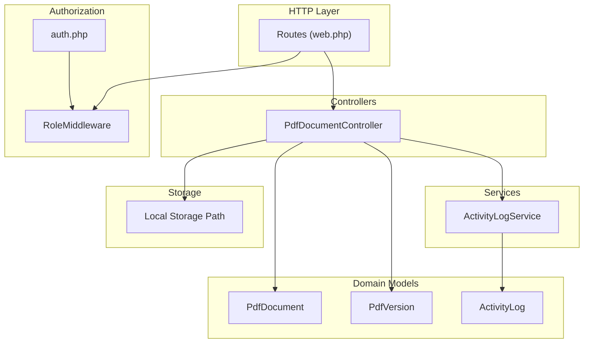
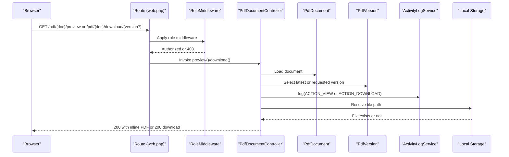
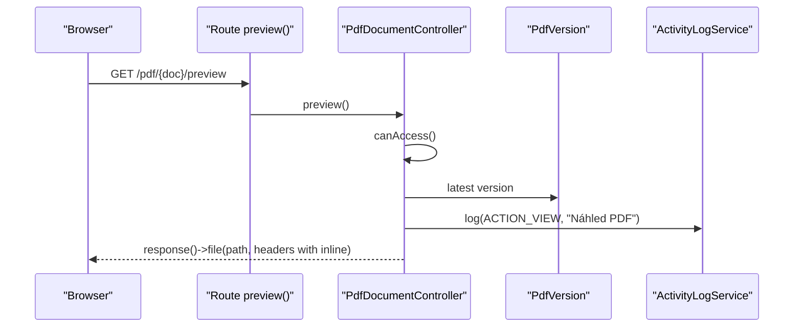
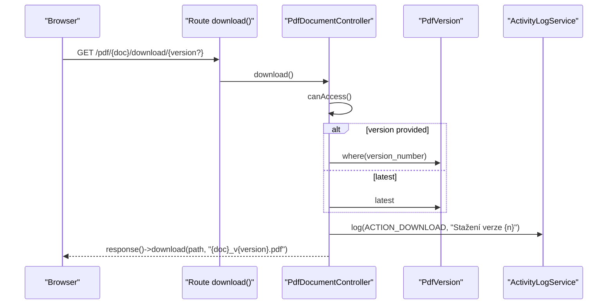
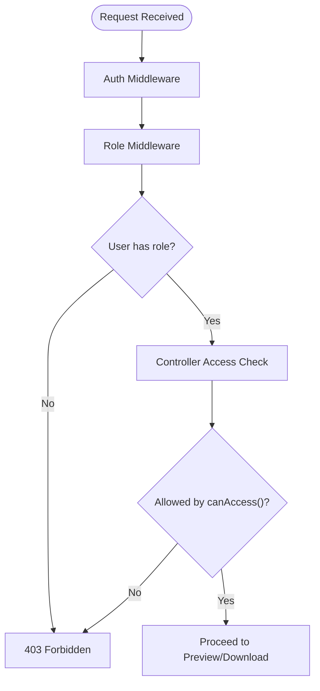
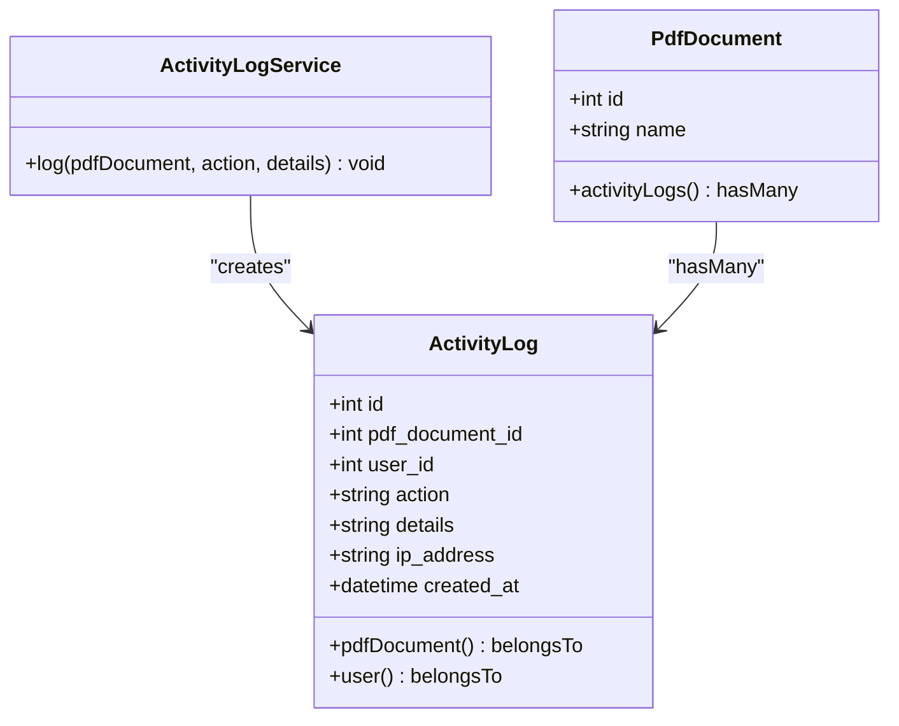
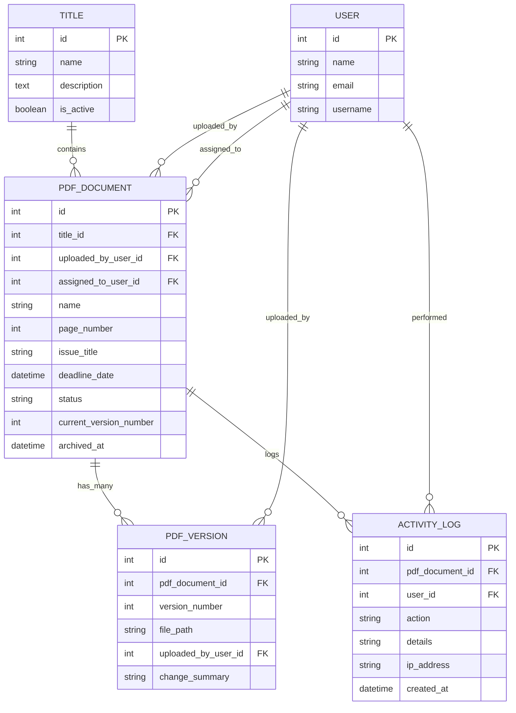
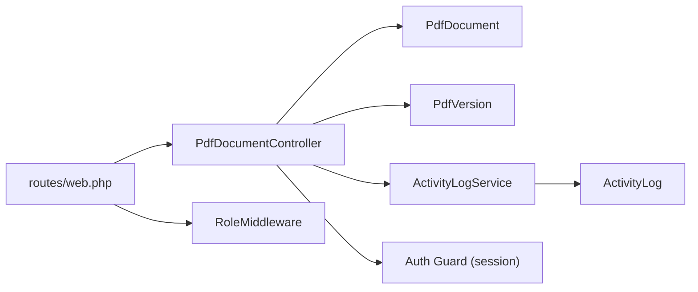

# Document Preview and Download

<cite>
**Referenced Files in This Document**
- [PdfDocumentController.php](file://pdf-korektura/app/Http/Controllers/PdfDocumentController.php)
- [PdfDocument.php](file://pdf-korektura/app/Models/PdfDocument.php)
- [PdfVersion.php](file://pdf-korektura/app/Models/PdfVersion.php)
- [ActivityLogService.php](file://pdf-korektura/app/Services/ActivityLogService.php)
- [ActivityLog.php](file://pdf-korektura/app/Models/ActivityLog.php)
- [web.php](file://pdf-korektura/routes/web.php)
- [PdfDetail.php](file://pdf-korektura/app/Livewire/PdfDetail.php)
- [User.php](file://pdf-korektura/app/Models/User.php)
- [RoleMiddleware.php](file://pdf-korektura/vendor/spatie/laravel-permission/src/Middleware/RoleMiddleware.php)
- [auth.php](file://pdf-korektura/config/auth.php)
</cite>

## Table of Contents
1. [Introduction](#introduction)
2. [Project Structure](#project-structure)
3. [Core Components](#core-components)
4. [Architecture Overview](#architecture-overview)
5. [Detailed Component Analysis](#detailed-component-analysis)
6. [Dependency Analysis](#dependency-analysis)
7. [Performance Considerations](#performance-considerations)
8. [Troubleshooting Guide](#troubleshooting-guide)
9. [Security Measures](#security-measures)
10. [Conclusion](#conclusion)

## Introduction
This document explains the end-to-end document preview and download functionality for PDF documents. It covers:
- Inline PDF preview via Content-Disposition headers and browser compatibility
- Download process including version-specific downloads and file naming conventions
- Access control ensuring only authorized users can preview or download
- Activity logging for tracking preview and download events
- Error handling for missing files, permission denials, and corrupted documents
- Performance considerations for large file downloads and streaming responses
- Security measures preventing unauthorized access through URL manipulation

## Project Structure
The preview and download features are implemented across controllers, models, services, routes, and middleware. The controller orchestrates access checks, selects versions, logs activities, and returns appropriate HTTP responses. Routes define the endpoints, while middleware enforces role-based access. Models encapsulate document and version metadata, and the activity logging service persists audit trails.

**Diagram sources**
- [web.php:38-41](file://pdf-korektura/routes/web.php#L38-L41)
- [PdfDocumentController.php:13-82](file://pdf-korektura/app/Http/Controllers/PdfDocumentController.php#L13-L82)
- [RoleMiddleware.php:10-38](file://pdf-korektura/vendor/spatie/laravel-permission/src/Middleware/RoleMiddleware.php#L10-L38)
- [auth.php:8-18](file://pdf-korektura/config/auth.php#L8-L18)
- [PdfDocument.php:10-130](file://pdf-korektura/app/Models/PdfDocument.php#L10-L130)
- [PdfVersion.php:9-43](file://pdf-korektura/app/Models/PdfVersion.php#L9-L43)
- [ActivityLogService.php:10-31](file://pdf-korektura/app/Services/ActivityLogService.php#L10-L31)
- [ActivityLog.php:9-60](file://pdf-korektura/app/Models/ActivityLog.php#L9-L60)

**Section sources**
- [web.php:38-41](file://pdf-korektura/routes/web.php#L38-L41)
- [PdfDocumentController.php:13-82](file://pdf-korektura/app/Http/Controllers/PdfDocumentController.php#L13-L82)
- [RoleMiddleware.php:10-38](file://pdf-korektura/vendor/spatie/laravel-permission/src/Middleware/RoleMiddleware.php#L10-L38)
- [auth.php:8-18](file://pdf-korektura/config/auth.php#L8-L18)

## Core Components
- PdfDocumentController: Implements preview and download actions, performs access checks, selects versions, logs activities, and returns HTTP responses.
- PdfDocument and PdfVersion: Eloquent models representing documents and versions, including relationships and helpers.
- ActivityLogService and ActivityLog: Service and model for persisting audit records of user actions.
- Routes: Define endpoints for preview and download, with middleware for authentication and roles.
- User and RoleMiddleware: Authorization primitives enabling role-based access control.

**Section sources**
- [PdfDocumentController.php:13-82](file://pdf-korektura/app/Http/Controllers/PdfDocumentController.php#L13-L82)
- [PdfDocument.php:10-130](file://pdf-korektura/app/Models/PdfDocument.php#L10-L130)
- [PdfVersion.php:9-43](file://pdf-korektura/app/Models/PdfVersion.php#L9-L43)
- [ActivityLogService.php:10-31](file://pdf-korektura/app/Services/ActivityLogService.php#L10-L31)
- [ActivityLog.php:9-60](file://pdf-korektura/app/Models/ActivityLog.php#L9-L60)
- [web.php:38-41](file://pdf-korektura/routes/web.php#L38-L41)
- [User.php:10-76](file://pdf-korektura/app/Models/User.php#L10-L76)
- [RoleMiddleware.php:10-38](file://pdf-korektura/vendor/spatie/laravel-permission/src/Middleware/RoleMiddleware.php#L10-L38)

## Architecture Overview
The preview and download pipeline follows a consistent flow:
- Routes expose endpoints for preview and download under an authenticated session guard.
- RoleMiddleware ensures callers belong to permitted roles.
- PdfDocumentController validates access against the requested document and selects the appropriate version.
- Activity logging records the event with user identity and IP.
- Responses are generated using Laravel’s file/download helpers with proper headers.

**Diagram sources**
- [web.php:38-41](file://pdf-korektura/routes/web.php#L38-L41)
- [RoleMiddleware.php:10-38](file://pdf-korektura/vendor/spatie/laravel-permission/src/Middleware/RoleMiddleware.php#L10-L38)
- [PdfDocumentController.php:42-63](file://pdf-korektura/app/Http/Controllers/PdfDocumentController.php#L42-L63)
- [PdfDocumentController.php:15-40](file://pdf-korektura/app/Http/Controllers/PdfDocumentController.php#L15-L40)
- [ActivityLogService.php:20-29](file://pdf-korektura/app/Services/ActivityLogService.php#L20-L29)

## Detailed Component Analysis

### Preview Implementation (Inline PDF)
- Endpoint: GET /pdf/{pdfDocument}/preview
- Access control: Uses the controller’s access-check method to ensure the current user meets role criteria.
- Version selection: Chooses the latest version of the document.
- Response: Returns a file response with Content-Type set to application/pdf and Content-Disposition set to inline, instructing the browser to render the PDF within the page.
- Activity logging: Logs a view action with details indicating an inline preview.

**Diagram sources**
- [web.php:40](file://pdf-korektura/routes/web.php#L40)
- [PdfDocumentController.php:42-63](file://pdf-korektura/app/Http/Controllers/PdfDocumentController.php#L42-L63)
- [ActivityLogService.php:20-29](file://pdf-korektura/app/Services/ActivityLogService.php#L20-L29)

**Section sources**
- [PdfDocumentController.php:42-63](file://pdf-korektura/app/Http/Controllers/PdfDocumentController.php#L42-L63)
- [web.php:40](file://pdf-korektura/routes/web.php#L40)

### Download Implementation (Version-Specific)
- Endpoint: GET /pdf/{pdfDocument}/download/{version?}
- Access control: Same access-check logic applies.
- Version selection: If a version number is provided, resolves that version; otherwise, resolves the latest version.
- Response: Uses Laravel’s download helper to force a file download with a filename constructed from the document name and selected version number.
- Activity logging: Logs a download action with details indicating the downloaded version.

**Diagram sources**
- [web.php:39](file://pdf-korektura/routes/web.php#L39)
- [PdfDocumentController.php:15-40](file://pdf-korektura/app/Http/Controllers/PdfDocumentController.php#L15-L40)
- [ActivityLogService.php:20-29](file://pdf-korektura/app/Services/ActivityLogService.php#L20-L29)

**Section sources**
- [PdfDocumentController.php:15-40](file://pdf-korektura/app/Http/Controllers/PdfDocumentController.php#L15-L40)
- [web.php:39](file://pdf-korektura/routes/web.php#L39)

### Access Control Mechanisms
- Authentication: Routes are wrapped in an auth middleware group, requiring a logged-in session.
- Roles: Additional role-based middleware restricts access to Editor/Grafik/Admin for uploads/detail and Korektor/Admin for pools and assignments.
- Controller-level check: The controller’s access-check method evaluates:
  - Admin users: Full access
  - Editors/Grafik: Can access documents they uploaded
  - Proofreaders: Can access documents assigned to them
- RoleMiddleware: Enforces role membership and throws unauthorized exceptions when missing.

**Diagram sources**
- [web.php:25-31](file://pdf-korektura/routes/web.php#L25-L31)
- [web.php:33-36](file://pdf-korektura/routes/web.php#L33-L36)
- [RoleMiddleware.php:10-38](file://pdf-korektura/vendor/spatie/laravel-permission/src/Middleware/RoleMiddleware.php#L10-L38)
- [PdfDocumentController.php:65-80](file://pdf-korektura/app/Http/Controllers/PdfDocumentController.php#L65-L80)
- [User.php:56-74](file://pdf-korektura/app/Models/User.php#L56-L74)

**Section sources**
- [web.php:25-31](file://pdf-korektura/routes/web.php#L25-L31)
- [web.php:33-36](file://pdf-korektura/routes/web.php#L33-L36)
- [RoleMiddleware.php:10-38](file://pdf-korektura/vendor/spatie/laravel-permission/src/Middleware/RoleMiddleware.php#L10-L38)
- [PdfDocumentController.php:65-80](file://pdf-korektura/app/Http/Controllers/PdfDocumentController.php#L65-L80)
- [User.php:56-74](file://pdf-korektura/app/Models/User.php#L56-L74)

### Activity Logging Integration
- Events recorded: View (preview) and Download actions.
- Logged fields: Related document ID, current user ID, action type, optional details, and client IP address.
- Retrieval: Documents expose an activityLogs relationship for listing recent actions.

**Diagram sources**
- [ActivityLogService.php:20-29](file://pdf-korektura/app/Services/ActivityLogService.php#L20-L29)
- [ActivityLog.php:21-44](file://pdf-korektura/app/Models/ActivityLog.php#L21-L44)
- [PdfDocument.php:67-70](file://pdf-korektura/app/Models/PdfDocument.php#L67-L70)

**Section sources**
- [ActivityLogService.php:20-29](file://pdf-korektura/app/Services/ActivityLogService.php#L20-L29)
- [ActivityLog.php:21-44](file://pdf-korektura/app/Models/ActivityLog.php#L21-L44)
- [PdfDocument.php:67-70](file://pdf-korektura/app/Models/PdfDocument.php#L67-L70)

### Data Models and Relationships
- PdfDocument: Holds document metadata, status, and relationships to versions and users. Provides scopes and helpers for filtering and labels.
- PdfVersion: Stores per-version file paths and metadata, including a helper to compute the download route for a given version.
- User: Integrates role-based permissions via Spatie’s package and exposes convenience methods for role checks.

**Diagram sources**
- [PdfDocument.php:19-39](file://pdf-korektura/app/Models/PdfDocument.php#L19-L39)
- [PdfDocument.php:41-65](file://pdf-korektura/app/Models/PdfDocument.php#L41-L65)
- [PdfVersion.php:13-26](file://pdf-korektura/app/Models/PdfVersion.php#L13-L26)
- [PdfVersion.php:28-36](file://pdf-korektura/app/Models/PdfVersion.php#L28-L36)
- [ActivityLog.php:21-44](file://pdf-korektura/app/Models/ActivityLog.php#L21-L44)
- [User.php:36-54](file://pdf-korektura/app/Models/User.php#L36-L54)

**Section sources**
- [PdfDocument.php:19-65](file://pdf-korektura/app/Models/PdfDocument.php#L19-L65)
- [PdfVersion.php:13-36](file://pdf-korektura/app/Models/PdfVersion.php#L13-L36)
- [ActivityLog.php:21-44](file://pdf-korektura/app/Models/ActivityLog.php#L21-L44)
- [User.php:36-54](file://pdf-korektura/app/Models/User.php#L36-L54)

## Dependency Analysis
- Routes depend on PdfDocumentController methods and role middleware.
- Controller depends on PdfDocument, PdfVersion, ActivityLogService, and the authenticated user.
- ActivityLogService depends on ActivityLog and the current request context.
- Models depend on Eloquent relationships and casting configurations.

**Diagram sources**
- [web.php:38-41](file://pdf-korektura/routes/web.php#L38-L41)
- [PdfDocumentController.php:13-82](file://pdf-korektura/app/Http/Controllers/PdfDocumentController.php#L13-L82)
- [ActivityLogService.php:10-31](file://pdf-korektura/app/Services/ActivityLogService.php#L10-L31)
- [ActivityLog.php:9-60](file://pdf-korektura/app/Models/ActivityLog.php#L9-L60)
- [RoleMiddleware.php:10-38](file://pdf-korektura/vendor/spatie/laravel-permission/src/Middleware/RoleMiddleware.php#L10-L38)
- [auth.php:8-18](file://pdf-korektura/config/auth.php#L8-L18)

**Section sources**
- [web.php:38-41](file://pdf-korektura/routes/web.php#L38-L41)
- [PdfDocumentController.php:13-82](file://pdf-korektura/app/Http/Controllers/PdfDocumentController.php#L13-L82)
- [ActivityLogService.php:10-31](file://pdf-korektura/app/Services/ActivityLogService.php#L10-L31)
- [ActivityLog.php:9-60](file://pdf-korektura/app/Models/ActivityLog.php#L9-L60)
- [RoleMiddleware.php:10-38](file://pdf-korektura/vendor/spatie/laravel-permission/src/Middleware/RoleMiddleware.php#L10-L38)
- [auth.php:8-18](file://pdf-korektura/config/auth.php#L8-L18)

## Performance Considerations
- Streaming vs. download: The controller uses file() for inline preview and download() for downloads. For very large files, consider streaming responses to reduce memory overhead and improve responsiveness.
- File existence checks: The controller verifies file existence before serving content. This avoids unnecessary I/O and prevents exposing non-existent paths.
- Version selection: Using latest() or where() on versions is efficient due to database indexing on version_number and foreign keys.
- Storage path resolution: Resolving storage path via storage_path reduces ambiguity and improves reliability.
- Frontend integration: Livewire components load document metadata and versions; keep queries scoped to avoid N+1 issues.

[No sources needed since this section provides general guidance]

## Troubleshooting Guide
Common issues and resolutions:
- 403 Forbidden
  - Cause: Unauthenticated user or insufficient role.
  - Resolution: Ensure the user is logged in and holds a permitted role; verify middleware groups and role assignments.
- 404 Not Found
  - Cause: The selected version file does not exist on disk.
  - Resolution: Confirm the file_path stored in the version record is correct and the file exists at the resolved storage path.
- Permission Denial
  - Cause: User lacks access to the document (not admin, not uploader, not assigned).
  - Resolution: Verify the user’s roles and the document’s uploader/assignee fields.
- Corrupted or unreadable PDF
  - Cause: File corruption or invalid path.
  - Resolution: Re-upload the correct version; confirm file integrity and path correctness.

**Section sources**
- [PdfDocumentController.php:19-21](file://pdf-korektura/app/Http/Controllers/PdfDocumentController.php#L19-L21)
- [PdfDocumentController.php:35-37](file://pdf-korektura/app/Http/Controllers/PdfDocumentController.php#L35-L37)
- [PdfDocumentController.php:65-80](file://pdf-korektura/app/Http/Controllers/PdfDocumentController.php#L65-L80)

## Security Measures
- Session-based authentication: Requests require an active session, enforced by the auth middleware group.
- Role-based access control: RoleMiddleware ensures only permitted roles can reach preview/download endpoints.
- Controller-level authorization: The canAccess method enforces strict rules based on user roles and document ownership/assignment.
- URL integrity: Access checks occur server-side; bypassing endpoints or manipulating URLs still requires valid session and roles.
- File path resolution: Paths are resolved from stored relative paths, reducing risk of directory traversal.
- Activity logging: Captures who accessed what, when, and from which IP, aiding audits and incident response.

**Section sources**
- [web.php:25-31](file://pdf-korektura/routes/web.php#L25-L31)
- [web.php:33-36](file://pdf-korektura/routes/web.php#L33-L36)
- [RoleMiddleware.php:10-38](file://pdf-korektura/vendor/spatie/laravel-permission/src/Middleware/RoleMiddleware.php#L10-L38)
- [PdfDocumentController.php:65-80](file://pdf-korektura/app/Http/Controllers/PdfDocumentController.php#L65-L80)
- [ActivityLogService.php:20-29](file://pdf-korektura/app/Services/ActivityLogService.php#L20-L29)

## Conclusion
The preview and download system combines robust access control, clear versioning semantics, and comprehensive activity logging. Inline previews leverage Content-Disposition headers for seamless browser rendering, while downloads enforce secure file delivery with version-aware naming. The architecture supports scalability through database-backed versioning and can be extended to support streaming for large files. Strict authorization and logging provide strong safeguards against unauthorized access and enable effective auditing.