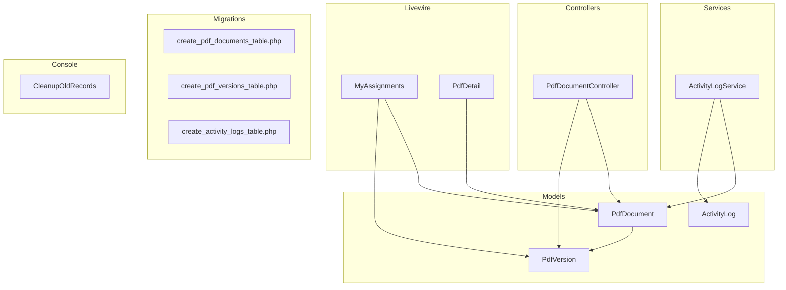
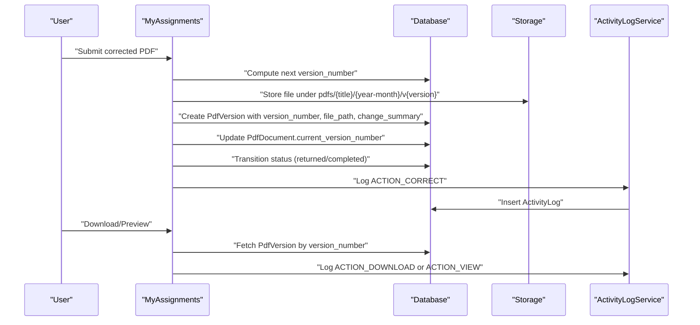
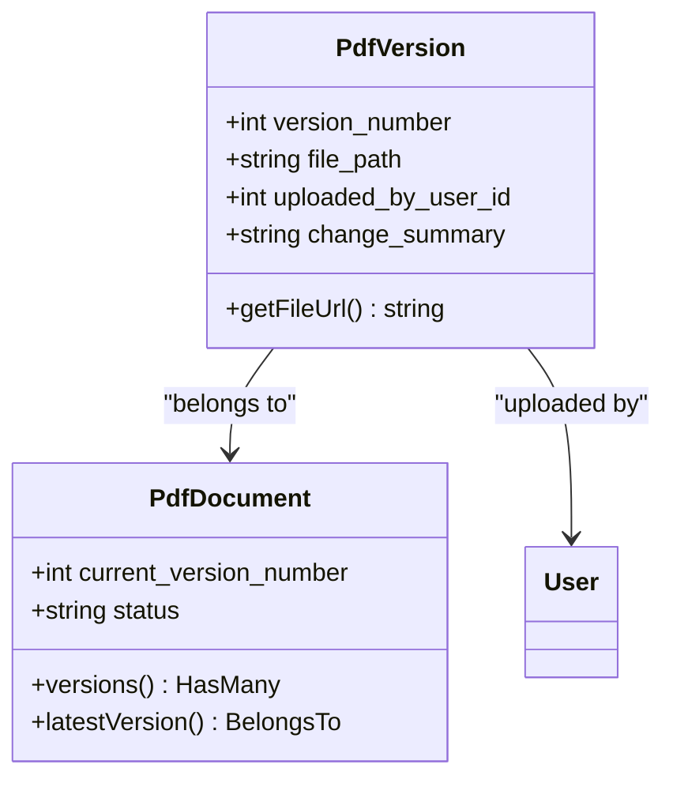
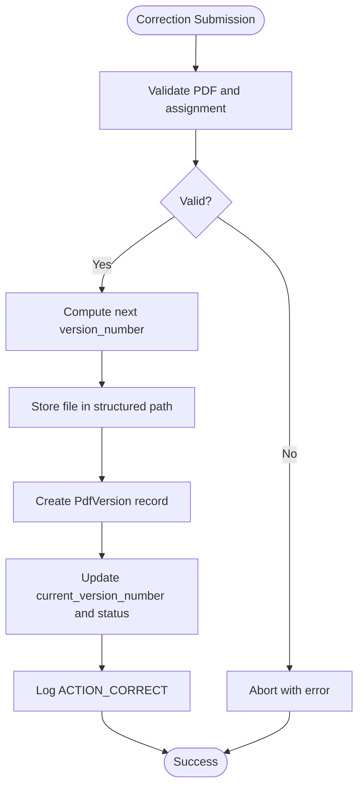
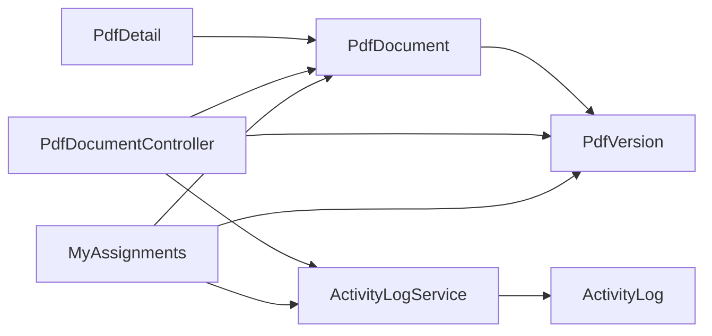

# Document Versioning System

<cite>
**Referenced Files in This Document**
- [PdfVersion.php](file://app/Models/PdfVersion.php)
- [PdfDocument.php](file://app/Models/PdfDocument.php)
- [create_pdf_versions_table.php](file://database/migrations/2024_06_10_130000_create_pdf_versions_table.php)
- [create_pdf_documents_table.php](file://database/migrations/2024_06_10_120000_create_pdf_documents_table.php)
- [PdfDocumentController.php](file://app/Http/Controllers/PdfDocumentController.php)
- [MyAssignments.php](file://app/Livewire/MyAssignments.php)
- [PdfDetail.php](file://app/Livewire/PdfDetail.php)
- [ActivityLogService.php](file://app/Services/ActivityLogService.php)
- [ActivityLog.php](file://app/Models/ActivityLog.php)
- [create_activity_logs_table.php](file://database/migrations/2024_06_10_140000_create_activity_logs_table.php)
- [CleanupOldRecords.php](file://app/Console/Commands/CleanupOldRecords.php)
</cite>

## Table of Contents
1. [Introduction](#introduction)
2. [Project Structure](#project-structure)
3. [Core Components](#core-components)
4. [Architecture Overview](#architecture-overview)
5. [Detailed Component Analysis](#detailed-component-analysis)
6. [Dependency Analysis](#dependency-analysis)
7. [Performance Considerations](#performance-considerations)
8. [Troubleshooting Guide](#troubleshooting-guide)
9. [Conclusion](#conclusion)

## Introduction
This document explains the document versioning system used to track corrections and changes throughout the workflow. It covers the version numbering strategy, automatic version creation upon document updates, the PdfVersion model structure, version management during corrections, rollback capabilities, version comparison, audit trails, workflow state relationships, cleanup policies, storage optimization, and integration with the activity logging system.

## Project Structure
The versioning system spans models, controllers, Livewire components, migrations, services, and console commands:
- Models define the domain entities and their relationships
- Migrations create the underlying database schema
- Controllers and Livewire components orchestrate user actions and version creation
- Activity logging service records user actions and system events
- Console command performs cleanup of old records

**Diagram sources**
- [PdfDocument.php:10-129](file://app/Models/PdfDocument.php#L10-L129)
- [PdfVersion.php:9-42](file://app/Models/PdfVersion.php#L9-L42)
- [ActivityLog.php:9-59](file://app/Models/ActivityLog.php#L9-L59)
- [PdfDocumentController.php:13-81](file://app/Http/Controllers/PdfDocumentController.php#L13-L81)
- [MyAssignments.php:16-121](file://app/Livewire/MyAssignments.php#L16-L121)
- [PdfDetail.php:10-23](file://app/Livewire/PdfDetail.php#L10-L23)
- [ActivityLogService.php:10-30](file://app/Services/ActivityLogService.php#L10-L30)
- [create_pdf_documents_table.php:7-31](file://database/migrations/2024_06_10_120000_create_pdf_documents_table.php#L7-L31)
- [create_pdf_versions_table.php:7-28](file://database/migrations/2024_06_10_130000_create_pdf_versions_table.php#L7-L28)
- [create_activity_logs_table.php:7-26](file://database/migrations/2024_06_10_140000_create_activity_logs_table.php#L7-L26)
- [CleanupOldRecords.php:11-46](file://app/Console/Commands/CleanupOldRecords.php#L11-L46)

**Section sources**
- [PdfDocument.php:10-129](file://app/Models/PdfDocument.php#L10-L129)
- [PdfVersion.php:9-42](file://app/Models/PdfVersion.php#L9-L42)
- [ActivityLog.php:9-59](file://app/Models/ActivityLog.php#L9-L59)
- [PdfDocumentController.php:13-81](file://app/Http/Controllers/PdfDocumentController.php#L13-L81)
- [MyAssignments.php:16-121](file://app/Livewire/MyAssignments.php#L16-L121)
- [PdfDetail.php:10-23](file://app/Livewire/PdfDetail.php#L10-L23)
- [ActivityLogService.php:10-30](file://app/Services/ActivityLogService.php#L10-L30)
- [create_pdf_documents_table.php:7-31](file://database/migrations/2024_06_10_120000_create_pdf_documents_table.php#L7-L31)
- [create_pdf_versions_table.php:7-28](file://database/migrations/2024_06_10_130000_create_pdf_versions_table.php#L7-L28)
- [create_activity_logs_table.php:7-26](file://database/migrations/2024_06_10_140000_create_activity_logs_table.php#L7-L26)
- [CleanupOldRecords.php:11-46](file://app/Console/Commands/CleanupOldRecords.php#L11-L46)

## Core Components
- PdfDocument: Represents a document with current version tracking and workflow status. It maintains relationships to versions and activity logs and exposes scopes for filtering by assignment and archival state.
- PdfVersion: Represents a single version of a document, including metadata such as version number, file path, uploader, and change summary. It belongs to PdfDocument and User.
- ActivityLog and ActivityLogService: Capture user actions (upload, assign, release, correct, archive, view, download) with timestamps, IP address, and optional details.
- MyAssignments Livewire component: Handles correction submission, creates new versions, updates document status, and logs activities.
- PdfDocumentController: Provides download and preview endpoints with access control and activity logging.
- CleanupOldRecords console command: Removes archived documents older than a threshold along with associated versions and activity logs.

**Section sources**
- [PdfDocument.php:10-129](file://app/Models/PdfDocument.php#L10-L129)
- [PdfVersion.php:9-42](file://app/Models/PdfVersion.php#L9-L42)
- [ActivityLog.php:9-59](file://app/Models/ActivityLog.php#L9-L59)
- [ActivityLogService.php:10-30](file://app/Services/ActivityLogService.php#L10-L30)
- [MyAssignments.php:16-121](file://app/Livewire/MyAssignments.php#L16-L121)
- [PdfDocumentController.php:13-81](file://app/Http/Controllers/PdfDocumentController.php#L13-L81)
- [CleanupOldRecords.php:11-46](file://app/Console/Commands/CleanupOldRecords.php#L11-L46)

## Architecture Overview
The versioning system follows a straightforward pattern:
- Users upload corrected PDFs via Livewire
- A new PdfVersion is created with incremented version_number
- PdfDocument.current_version_number is updated accordingly
- Workflow status transitions occur based on whether the correction is returned or completed
- ActivityLog entries are created for each significant action
- Downloads and previews fetch the appropriate version and record access events

**Diagram sources**
- [MyAssignments.php:42-88](file://app/Livewire/MyAssignments.php#L42-L88)
- [PdfDocumentController.php:15-40](file://app/Http/Controllers/PdfDocumentController.php#L15-L40)
- [ActivityLogService.php:20-29](file://app/Services/ActivityLogService.php#L20-L29)
- [PdfVersion.php:9-42](file://app/Models/PdfVersion.php#L9-L42)
- [PdfDocument.php:10-129](file://app/Models/PdfDocument.php#L10-L129)

## Detailed Component Analysis

### Version Numbering Strategy
- Version numbering is integer-based and strictly incremental per document.
- New version number equals PdfDocument.current_version_number + 1.
- Unique constraint ensures no duplicate version numbers per document.
- The latest version is determined either by the PdfDocument.latestVersion relationship or by ordering PdfVersion by version_number descending.

Key implementation references:
- Increment logic and unique constraint: [MyAssignments.php:53-71](file://app/Livewire/MyAssignments.php#L53-L71), [create_pdf_versions_table.php:14-20](file://database/migrations/2024_06_10_130000_create_pdf_versions_table.php#L14-L20)
- Latest version resolution: [PdfDocument.php:61-65](file://app/Models/PdfDocument.php#L61-L65), [PdfDocument.php:56-59](file://app/Models/PdfDocument.php#L56-L59)

**Section sources**
- [MyAssignments.php:53-71](file://app/Livewire/MyAssignments.php#L53-L71)
- [create_pdf_versions_table.php:14-20](file://database/migrations/2024_06_10_130000_create_pdf_versions_table.php#L14-L20)
- [PdfDocument.php:56-65](file://app/Models/PdfDocument.php#L56-L65)

### Automatic Version Creation Upon Updates
- On correction submission, a new PdfVersion is created immediately after validating the PDF and confirming assignment ownership.
- The file is stored in a folder path structured by title, year-month, and version.
- The document’s current_version_number is updated atomically with the new version creation.

References:
- Version creation and storage path: [MyAssignments.php:55-71](file://app/Livewire/MyAssignments.php#L55-L71)
- Status update and assignment reset: [MyAssignments.php:73-77](file://app/Livewire/MyAssignments.php#L73-L77)

**Section sources**
- [MyAssignments.php:42-88](file://app/Livewire/MyAssignments.php#L42-L88)

### PdfVersion Model Structure
PdfVersion encapsulates:
- Metadata: version_number, file_path, uploaded_by_user_id, change_summary
- Relationships: belongs to PdfDocument and User
- Helper: getFileUrl constructs a route to download a specific version

**Diagram sources**
- [PdfVersion.php:9-42](file://app/Models/PdfVersion.php#L9-L42)
- [PdfDocument.php:10-129](file://app/Models/PdfDocument.php#L10-L129)

**Section sources**
- [PdfVersion.php:9-42](file://app/Models/PdfVersion.php#L9-L42)
- [create_pdf_versions_table.php:11-21](file://database/migrations/2024_06_10_130000_create_pdf_versions_table.php#L11-L21)

### Relationship Between Versions and PdfDocument
- One-to-many: PdfDocument has many PdfVersions ordered by version_number descending.
- Latest version linkage: PdfDocument.latestVersion uses a whereColumn condition matching pdf_documents.current_version_number with pdf_versions.version_number.
- Access to all versions and latest version is exposed for UI rendering and controller logic.

References:
- Versions relationship and ordering: [PdfDocument.php:56-59](file://app/Models/PdfDocument.php#L56-L59)
- Latest version relationship: [PdfDocument.php:61-65](file://app/Models/PdfDocument.php#L61-L65)

**Section sources**
- [PdfDocument.php:56-65](file://app/Models/PdfDocument.php#L56-L65)

### Version Management During Correction Process
- Validation ensures the PDF is assigned to the current user and meets size/type constraints.
- A new version is created with a unique version_number and stored in the filesystem.
- The document’s current_version_number is updated, and status transitions to either returned or completed depending on user selection.
- ActivityLog entries are recorded for correction actions.

**Diagram sources**
- [MyAssignments.php:42-88](file://app/Livewire/MyAssignments.php#L42-L88)
- [ActivityLogService.php:20-29](file://app/Services/ActivityLogService.php#L20-L29)

**Section sources**
- [MyAssignments.php:42-88](file://app/Livewire/MyAssignments.php#L42-L88)

### Rollback Capabilities and Version Comparison
- Rollback: To revert to a previous version, the system supports downloading specific versions via PdfDocumentController. While the code does not implement a dedicated rollback endpoint, the existence of versioned files and explicit version_number allows manual restoration by replacing the latest version with a selected historical version.
- Version comparison: The UI lists versions with version_number, change_summary, uploader, and timestamp, enabling side-by-side review. The controller’s download method supports retrieving any version by version_number.

References:
- Download by version: [PdfDocumentController.php:15-40](file://app/Http/Controllers/PdfDocumentController.php#L15-L40)
- Version listing in UI: [PdfDetail.php](file://app/Livewire/PdfDetail.php#L16)

**Section sources**
- [PdfDocumentController.php:15-40](file://app/Http/Controllers/PdfDocumentController.php#L15-L40)
- [PdfDetail.php](file://app/Livewire/PdfDetail.php#L16)

### Examples of Version History Tracking and Audit Trails
- Version history: PdfDocument.versions relationship provides all versions ordered by version_number desc, displaying change_summary and uploaded_by_user_id.
- Audit trail: ActivityLogService.log captures user actions with timestamps, IP address, and details. PdfDocument.activityLogs relationship orders logs by creation time.

References:
- Version history rendering: [PdfDetail.php](file://app/Livewire/PdfDetail.php#L16)
- Activity logging: [ActivityLogService.php:20-29](file://app/Services/ActivityLogService.php#L20-L29), [ActivityLog.php:36-44](file://app/Models/ActivityLog.php#L36-L44)

**Section sources**
- [PdfDetail.php](file://app/Livewire/PdfDetail.php#L16)
- [ActivityLogService.php:20-29](file://app/Services/ActivityLogService.php#L20-L29)
- [ActivityLog.php:36-44](file://app/Models/ActivityLog.php#L36-L44)

### Relationship Between Versions and Workflow States
- Status transitions:
  - Returned: When the correction is sent back for revision, status becomes returned and assignment is cleared.
  - Completed: When the correction is accepted, status becomes completed and assignment remains unchanged.
- Current version tracking: PdfDocument.current_version_number is updated to the newly created version_number.

References:
- Status constants and labels: [PdfDocument.php:14-17](file://app/Models/PdfDocument.php#L14-L17), [PdfDocument.php:108-128](file://app/Models/PdfDocument.php#L108-L128)
- Transition logic: [MyAssignments.php:73-77](file://app/Livewire/MyAssignments.php#L73-L77)

**Section sources**
- [PdfDocument.php:14-17](file://app/Models/PdfDocument.php#L14-L17)
- [PdfDocument.php:108-128](file://app/Models/PdfDocument.php#L108-L128)
- [MyAssignments.php:73-77](file://app/Livewire/MyAssignments.php#L73-L77)

### Version Cleanup Policies and Storage Optimization
- Retention policy: A console command cleans up archived PdfDocuments older than a configurable number of days, removing associated PdfVersion files from storage and deleting PdfVersion and ActivityLog records.
- Deletion order: Files are removed from storage first, then PdfVersion records, followed by ActivityLog records, and finally PdfDocument itself.
- Default retention: The command defaults to 60 days.

References:
- Cleanup command definition and logic: [CleanupOldRecords.php:11-46](file://app/Console/Commands/CleanupOldRecords.php#L11-L46)

**Section sources**
- [CleanupOldRecords.php:11-46](file://app/Console/Commands/CleanupOldRecords.php#L11-L46)

### Integration With Activity Logging System
- ActivityLogService.log writes entries with pdf_document_id, user_id, action, details, and IP address.
- Actions captured include upload, assign, release, correct, archive, view, and download.
- PdfDocumentController logs view/download actions per request.
- MyAssignments logs correction submissions.

References:
- Action constants and logging: [ActivityLogService.php:12-18](file://app/Services/ActivityLogService.php#L12-L18), [ActivityLogService.php:20-29](file://app/Services/ActivityLogService.php#L20-L29)
- Controller logging: [PdfDocumentController.php:27-31](file://app/Http/Controllers/PdfDocumentController.php#L27-L31), [PdfDocumentController.php](file://app/Http/Controllers/PdfDocumentController.php#L57)
- Livewire logging: [MyAssignments.php:79-83](file://app/Livewire/MyAssignments.php#L79-L83)

**Section sources**
- [ActivityLogService.php:12-18](file://app/Services/ActivityLogService.php#L12-L18)
- [ActivityLogService.php:20-29](file://app/Services/ActivityLogService.php#L20-L29)
- [PdfDocumentController.php:27-31](file://app/Http/Controllers/PdfDocumentController.php#L27-L31)
- [PdfDocumentController.php](file://app/Http/Controllers/PdfDocumentController.php#L57)
- [MyAssignments.php:79-83](file://app/Livewire/MyAssignments.php#L79-L83)

## Dependency Analysis
The following diagram shows the primary dependencies among components involved in versioning and auditing:

**Diagram sources**
- [MyAssignments.php:16-121](file://app/Livewire/MyAssignments.php#L16-L121)
- [PdfDocumentController.php:13-81](file://app/Http/Controllers/PdfDocumentController.php#L13-L81)
- [PdfDetail.php:10-23](file://app/Livewire/PdfDetail.php#L10-L23)
- [PdfDocument.php:10-129](file://app/Models/PdfDocument.php#L10-L129)
- [PdfVersion.php:9-42](file://app/Models/PdfVersion.php#L9-L42)
- [ActivityLogService.php:10-30](file://app/Services/ActivityLogService.php#L10-L30)
- [ActivityLog.php:9-59](file://app/Models/ActivityLog.php#L9-L59)

**Section sources**
- [MyAssignments.php:16-121](file://app/Livewire/MyAssignments.php#L16-L121)
- [PdfDocumentController.php:13-81](file://app/Http/Controllers/PdfDocumentController.php#L13-L81)
- [PdfDetail.php:10-23](file://app/Livewire/PdfDetail.php#L10-L23)
- [PdfDocument.php:10-129](file://app/Models/PdfDocument.php#L10-L129)
- [PdfVersion.php:9-42](file://app/Models/PdfVersion.php#L9-L42)
- [ActivityLogService.php:10-30](file://app/Services/ActivityLogService.php#L10-L30)
- [ActivityLog.php:9-59](file://app/Models/ActivityLog.php#L9-L59)

## Performance Considerations
- Indexing: The unique composite index on (pdf_document_id, version_number) optimizes lookups for specific versions and prevents duplicates.
- Ordering: Versions are fetched ordered by version_number desc; ensure appropriate indexing for performance on large datasets.
- Storage: Structured file paths by title, year-month, and version aid in organization and cleanup.
- Activity logs: Filtering by date and deletion of old logs reduces table growth.

[No sources needed since this section provides general guidance]

## Troubleshooting Guide
- Download fails with “file not found”: Verify the file_path exists in storage and matches the stored location.
  - Reference: [PdfDocumentController.php:33-37](file://app/Http/Controllers/PdfDocumentController.php#L33-L37)
- Permission denied: Access checks enforce roles and ownership; ensure the user has appropriate permissions for the requested document.
  - Reference: [PdfDocumentController.php:19-21](file://app/Http/Controllers/PdfDocumentController.php#L19-L21), [PdfDocumentController.php:65-80](file://app/Http/Controllers/PdfDocumentController.php#L65-L80)
- Version not visible: Confirm the version_number exists for the document and that ordering is applied correctly.
  - Reference: [PdfDocument.php:56-59](file://app/Models/PdfDocument.php#L56-L59)
- Cleanup removes files unexpectedly: Adjust the retention days option or exclude active documents from cleanup.
  - Reference: [CleanupOldRecords.php:13-18](file://app/Console/Commands/CleanupOldRecords.php#L13-L18), [CleanupOldRecords.php:23-38](file://app/Console/Commands/CleanupOldRecords.php#L23-L38)

**Section sources**
- [PdfDocumentController.php:19-21](file://app/Http/Controllers/PdfDocumentController.php#L19-L21)
- [PdfDocumentController.php:33-37](file://app/Http/Controllers/PdfDocumentController.php#L33-L37)
- [PdfDocumentController.php:65-80](file://app/Http/Controllers/PdfDocumentController.php#L65-L80)
- [PdfDocument.php:56-59](file://app/Models/PdfDocument.php#L56-L59)
- [CleanupOldRecords.php:13-18](file://app/Console/Commands/CleanupOldRecords.php#L13-L18)
- [CleanupOldRecords.php:23-38](file://app/Console/Commands/CleanupOldRecords.php#L23-L38)

## Conclusion
The versioning system provides robust tracking of document corrections through explicit version records, clear numbering, and integrated activity logging. It supports essential workflows such as returning documents for revision, accepting completed corrections, and maintaining an audit trail. Cleanup policies help manage storage and database size for archived documents, while the structure enables future enhancements like automated rollback or advanced comparison features.