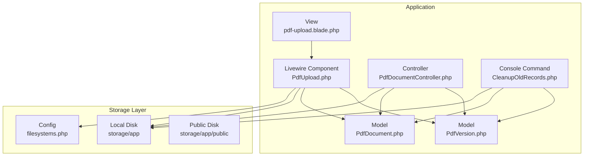
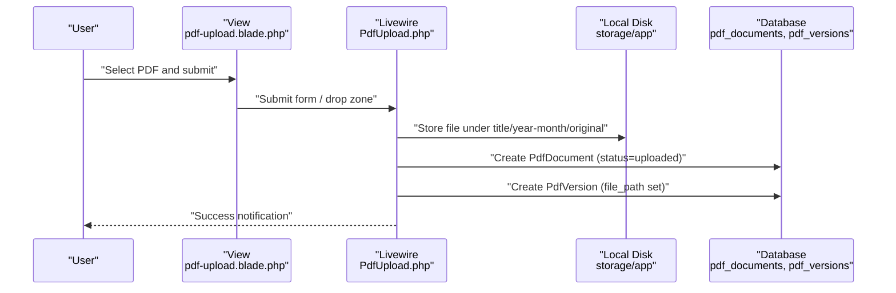
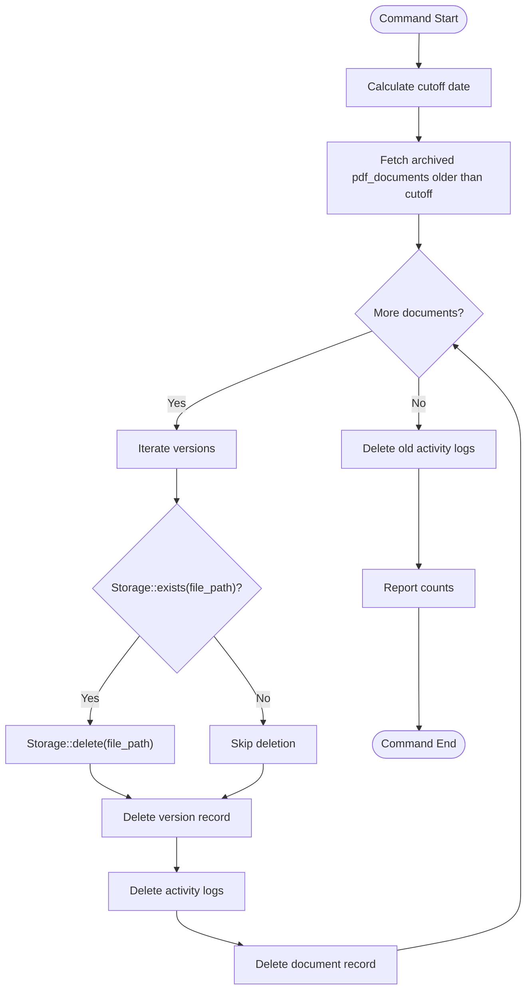
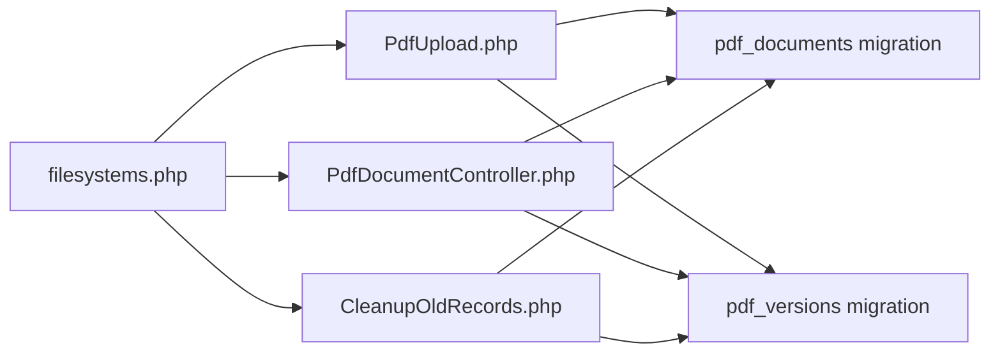

# File Storage System

<cite>
**Referenced Files in This Document**
- [filesystems.php](file://config/filesystems.php)
- [PdfUpload.php](file://app/Livewire/PdfUpload.php)
- [PdfDocumentController.php](file://app/Http/Controllers/PdfDocumentController.php)
- [PdfDocument.php](file://app/Models/PdfDocument.php)
- [PdfVersion.php](file://app/Models/PdfVersion.php)
- [CleanupOldRecords.php](file://app/Console/Commands/CleanupOldRecords.php)
- [2024_06_10_120000_create_pdf_documents_table.php](file://database/migrations/2024_06_10_120000_create_pdf_documents_table.php)
- [2024_06_10_130000_create_pdf_versions_table.php](file://database/migrations/2024_06_10_130000_create_pdf_versions_table.php)
- [pdf-upload.blade.php](file://resources/views/livewire/pdf-upload.blade.php)
- [composer.json](file://composer.json)
</cite>

## Table of Contents
1. [Introduction](#introduction)
2. [Project Structure](#project-structure)
3. [Core Components](#core-components)
4. [Architecture Overview](#architecture-overview)
5. [Detailed Component Analysis](#detailed-component-analysis)
6. [Dependency Analysis](#dependency-analysis)
7. [Performance Considerations](#performance-considerations)
8. [Troubleshooting Guide](#troubleshooting-guide)
9. [Conclusion](#conclusion)
10. [Appendices](#appendices)

## Introduction
This document describes the file storage system architecture and implementation for the pdf-korektura project. It covers local storage configuration, directory structure organization by date and document type, file path generation and naming conventions, access controls, cleanup processes for old or orphaned files, capacity planning and disk space management considerations, backup strategies for stored PDFs, and recovery procedures. It also documents the integration with Laravel’s Storage facade and custom file handling logic.

## Project Structure
The storage system is built on Laravel’s local filesystem driver and Flysystem. Uploaded PDFs are stored under the application storage path with a structured hierarchy by publication title and year-month. The system uses Eloquent models to track metadata and file paths, and Livewire for uploads and controllers for downloads and previews. A scheduled cleanup command removes archived documents and their associated files after a retention period.

**Diagram sources**
- [filesystems.php:1-22](file://config/filesystems.php#L1-L22)
- [PdfUpload.php:1-96](file://app/Livewire/PdfUpload.php#L1-L96)
- [PdfDocumentController.php:1-82](file://app/Http/Controllers/PdfDocumentController.php#L1-L82)
- [PdfDocument.php:1-130](file://app/Models/PdfDocument.php#L1-L130)
- [PdfVersion.php:1-43](file://app/Models/PdfVersion.php#L1-L43)
- [CleanupOldRecords.php:1-47](file://app/Console/Commands/CleanupOldRecords.php#L1-L47)
- [pdf-upload.blade.php:1-142](file://resources/views/livewire/pdf-upload.blade.php#L1-L142)

**Section sources**
- [filesystems.php:1-22](file://config/filesystems.php#L1-L22)
- [PdfUpload.php:47-87](file://app/Livewire/PdfUpload.php#L47-L87)
- [PdfDocumentController.php:15-63](file://app/Http/Controllers/PdfDocumentController.php#L15-L63)
- [CleanupOldRecords.php:16-45](file://app/Console/Commands/CleanupOldRecords.php#L16-L45)

## Core Components
- Local filesystem configuration defines the default disk and public disk roots, URL visibility, and symlink creation for public storage.
- Livewire component handles drag-and-drop and form-based uploads, generates unique filenames, and writes to the local disk under a title- and month-based directory.
- Controllers manage secure downloads and inline previews with role-based access checks and file existence verification.
- Models define the relationship between documents and versions and expose helpers for URL generation.
- Cleanup command removes archived documents older than a configurable threshold, including their files and activity logs.

**Section sources**
- [filesystems.php:4-21](file://config/filesystems.php#L4-L21)
- [PdfUpload.php:47-87](file://app/Livewire/PdfUpload.php#L47-L87)
- [PdfDocumentController.php:15-63](file://app/Http/Controllers/PdfDocumentController.php#L15-L63)
- [PdfDocument.php:56-70](file://app/Models/PdfDocument.php#L56-L70)
- [PdfVersion.php:28-41](file://app/Models/PdfVersion.php#L28-L41)
- [CleanupOldRecords.php:16-45](file://app/Console/Commands/CleanupOldRecords.php#L16-L45)

## Architecture Overview
The storage architecture integrates user uploads, metadata persistence, and controlled access to files. The flow begins with a user interface that triggers Livewire upload handlers. Files are stored on the local filesystem under a predictable path derived from the publication title and current year-month. Metadata is persisted in the database, linking document and version records with file paths. Downloads and previews are served through controllers that enforce authorization and verify file presence.

**Diagram sources**
- [pdf-upload.blade.php:1-142](file://resources/views/livewire/pdf-upload.blade.php#L1-L142)
- [PdfUpload.php:47-87](file://app/Livewire/PdfUpload.php#L47-L87)
- [2024_06_10_120000_create_pdf_documents_table.php:1-32](file://database/migrations/2024_06_10_120000_create_pdf_documents_table.php#L1-L32)
- [2024_06_10_130000_create_pdf_versions_table.php:1-29](file://database/migrations/2024_06_10_130000_create_pdf_versions_table.php#L1-L29)

## Detailed Component Analysis

### Local Storage Configuration and Disks
- Default disk is local, rooted at storage_path('app').
- Public disk is configured for publicly accessible files under storage_path('app/public'), with a URL base and symlink at public/storage.
- The filesystem configuration enables Flysystem-backed local storage and supports the Storage facade usage across the application.

**Section sources**
- [filesystems.php:4-21](file://config/filesystems.php#L4-L21)

### Directory Structure Organization by Date and Document Type
- Uploads are organized by publication title and year-month folders under storage/app/pdfs/<title>/<YYYY-MM>/original.
- This structure supports scalable retrieval and lifecycle management by grouping files temporally and by content type.

**Section sources**
- [PdfUpload.php:52](file://app/Livewire/PdfUpload.php#L52)

### File Path Generation and Naming Conventions
- Unique filenames are generated using a timestamp prefix and the original client filename to avoid collisions while preserving human-readable names.
- The stored path is recorded in the pdf_versions.file_path field for later retrieval.

**Section sources**
- [PdfUpload.php:59](file://app/Livewire/PdfUpload.php#L59)
- [PdfUpload.php:77](file://app/Livewire/PdfUpload.php#L77)

### Access Controls and Permissions
- Download and preview actions are gated by role-based checks:
  - Administrators always have access.
  - Editors/Grafik can access documents they uploaded.
  - Proofreaders can access documents assigned to them.
- Controllers verify file existence before serving content and log access events.

**Section sources**
- [PdfDocumentController.php:65-80](file://app/Http/Controllers/PdfDocumentController.php#L65-L80)
- [PdfDocumentController.php:33-39](file://app/Http/Controllers/PdfDocumentController.php#L33-L39)
- [PdfDocumentController.php:51-57](file://app/Http/Controllers/PdfDocumentController.php#L51-L57)

### Storage Integration with Laravel’s Storage Facade and Custom Logic
- Livewire uses the Storage facade to persist uploaded files to the local disk with a generated path.
- Controllers resolve absolute paths using storage_path and serve files via response helpers, verifying existence prior to delivery.
- The cleanup command leverages Storage::exists and Storage::delete to remove orphaned files alongside database records.

**Section sources**
- [PdfUpload.php:60](file://app/Livewire/PdfUpload.php#L60)
- [PdfDocumentController.php:33](file://app/Http/Controllers/PdfDocumentController.php#L33)
- [CleanupOldRecords.php:29-31](file://app/Console/Commands/CleanupOldRecords.php#L29-L31)

### Database Schema and Relationships
- pdf_documents tracks metadata such as title, deadlines, status, and current version number.
- pdf_versions stores per-version file paths, version numbers, and change summaries, with a unique constraint on (pdf_document_id, version_number).
- Models define relationships and helper methods for latest version and URL generation.

**Section sources**
- [2024_06_10_120000_create_pdf_documents_table.php:11-24](file://database/migrations/2024_06_10_120000_create_pdf_documents_table.php#L11-L24)
- [2024_06_10_130000_create_pdf_versions_table.php:11-21](file://database/migrations/2024_06_10_130000_create_pdf_versions_table.php#L11-L21)
- [PdfDocument.php:56-70](file://app/Models/PdfDocument.php#L56-L70)
- [PdfVersion.php:28-41](file://app/Models/PdfVersion.php#L28-L41)

### Cleanup Processes for Old or Orphaned Files
- A console command removes archived pdf_documents older than a specified number of days, cascading deletion of versions and activity logs.
- For each version, the command checks file existence via Storage::exists and deletes the file using Storage::delete before removing the record.
- This ensures disk space is reclaimed for truly archived content.

**Diagram sources**
- [CleanupOldRecords.php:16-45](file://app/Console/Commands/CleanupOldRecords.php#L16-L45)

**Section sources**
- [CleanupOldRecords.php:16-45](file://app/Console/Commands/CleanupOldRecords.php#L16-L45)

### Backup Strategies and Recovery Procedures
- Recommended approach:
  - Schedule periodic tar/zip backups of storage/app/pdfs to an external location.
  - Maintain a separate offsite copy of storage/app/public for downloadable assets if used.
  - Include database dumps for metadata restoration.
  - Test restoration by re-creating the directory structure and restoring files, then re-running migrations and seeding roles/users if needed.
- Recovery steps:
  - Restore files to storage/app/pdfs/<title>/<YYYY-MM>/original.
  - Recreate database records (pdf_documents and pdf_versions) with accurate file_path values.
  - Verify access controls and re-index any search or audit systems if applicable.

[No sources needed since this section provides general guidance]

### Capacity Planning and Disk Space Management
- Estimate storage needs by multiplying average PDF size by monthly upload volume and retention period.
- Monitor storage/app/pdfs growth and adjust retention windows accordingly.
- Use the cleanup command with shorter retention periods for very large archives.
- Consider implementing quotas per user or title if upload volumes vary widely.

[No sources needed since this section provides general guidance]

## Dependency Analysis
The storage system relies on Laravel’s filesystem configuration and the Storage facade. Livewire components depend on the local disk configuration and database migrations. Controllers depend on models and the Storage facade for file operations. The cleanup command depends on both the filesystem and database models.

**Diagram sources**
- [filesystems.php:1-22](file://config/filesystems.php#L1-L22)
- [PdfUpload.php:47-87](file://app/Livewire/PdfUpload.php#L47-L87)
- [PdfDocumentController.php:15-63](file://app/Http/Controllers/PdfDocumentController.php#L15-L63)
- [CleanupOldRecords.php:16-45](file://app/Console/Commands/CleanupOldRecords.php#L16-L45)
- [2024_06_10_120000_create_pdf_documents_table.php:1-32](file://database/migrations/2024_06_10_120000_create_pdf_documents_table.php#L1-L32)
- [2024_06_10_130000_create_pdf_versions_table.php:1-29](file://database/migrations/2024_06_10_130000_create_pdf_versions_table.php#L1-L29)

**Section sources**
- [composer.json:1-70](file://composer.json#L1-L70)

## Performance Considerations
- Large PDF uploads can strain memory; consider chunked uploads or server-side streaming for very large files.
- Use CDN or public disk for frequently accessed assets if bandwidth becomes a concern.
- Optimize database queries by indexing foreign keys and filtering archived vs active documents efficiently.
- Monitor disk I/O during bulk cleanup operations and schedule them during low-traffic periods.

[No sources needed since this section provides general guidance]

## Troubleshooting Guide
- Files not found during download:
  - Verify file_path exists in pdf_versions and that the file is present at storage_path('app/' . file_path).
  - Confirm cleanup command has not removed the file prematurely.
- Permission denied errors:
  - Ensure user roles align with access rules in PdfDocumentController.
  - Check filesystem permissions on storage/app and storage/app/public.
- Upload failures:
  - Confirm Livewire temporary uploads are handled correctly and that the local disk is writable.
  - Validate max file size and MIME type constraints in the Livewire component.

**Section sources**
- [PdfDocumentController.php:33-39](file://app/Http/Controllers/PdfDocumentController.php#L33-L39)
- [PdfDocumentController.php:65-80](file://app/Http/Controllers/PdfDocumentController.php#L65-L80)
- [PdfUpload.php:27-34](file://app/Livewire/PdfUpload.php#L27-L34)

## Conclusion
The pdf-korektura file storage system combines Laravel’s local filesystem with structured directory organization, robust access controls, and automated cleanup. By leveraging the Storage facade, Eloquent models, and a dedicated cleanup command, the system maintains scalability and reliability. Proper backup and capacity planning further ensure long-term operability.

## Appendices

### Appendix A: Roles and Access Matrix
- Administrator: Full access to all documents.
- Editor/Grafik: Access to documents they uploaded.
- Proofreader: Access to documents assigned to them.

**Section sources**
- [PdfDocumentController.php:65-80](file://app/Http/Controllers/PdfDocumentController.php#L65-L80)

### Appendix B: File Lifecycle Summary
- Upload: Livewire stores file under title/year-month/original and creates document/version records.
- Access: Controllers verify roles and file existence before serving.
- Archival: Documents are marked archived; cleanup removes them after retention.
- Recovery: Restore files and recreate database records with correct file_path.

**Section sources**
- [PdfUpload.php:47-87](file://app/Livewire/PdfUpload.php#L47-L87)
- [PdfDocumentController.php:15-63](file://app/Http/Controllers/PdfDocumentController.php#L15-L63)
- [CleanupOldRecords.php:16-45](file://app/Console/Commands/CleanupOldRecords.php#L16-L45)