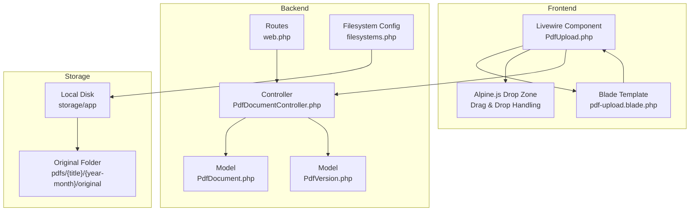
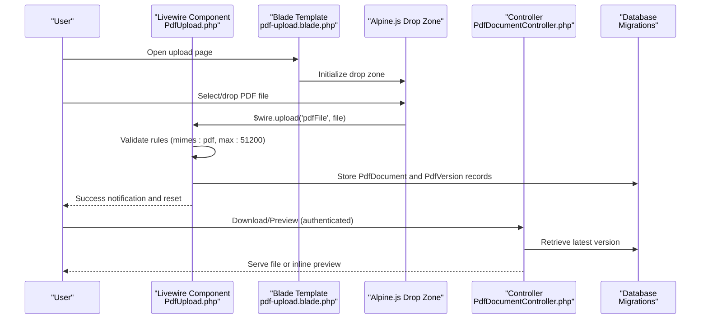
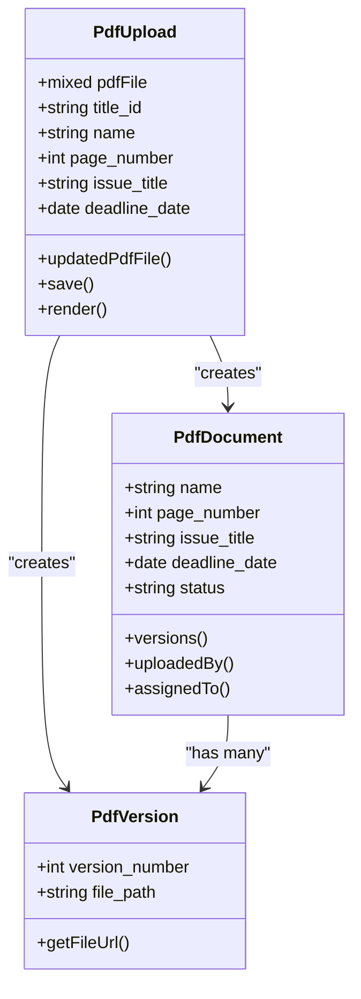
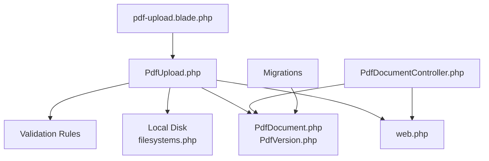

# PDF Upload Process

<cite>
**Referenced Files in This Document**
- [PdfUpload.php](file://app/Livewire/PdfUpload.php)
- [pdf-upload.blade.php](file://resources/views/livewire/pdf-upload.blade.php)
- [PdfDocumentController.php](file://app/Http/Controllers/PdfDocumentController.php)
- [PdfDocument.php](file://app/Models/PdfDocument.php)
- [PdfVersion.php](file://app/Models/PdfVersion.php)
- [2024_06_10_120000_create_pdf_documents_table.php](file://database/migrations/2024_06_10_120000_create_pdf_documents_table.php)
- [2024_06_10_130000_create_pdf_versions_table.php](file://database/migrations/2024_06_10_130000_create_pdf_versions_table.php)
- [filesystems.php](file://config/filesystems.php)
- [web.php](file://routes/web.php)
- [composer.json](file://composer.json)
</cite>

## Table of Contents
1. [Introduction](#introduction)
2. [Project Structure](#project-structure)
3. [Core Components](#core-components)
4. [Architecture Overview](#architecture-overview)
5. [Detailed Component Analysis](#detailed-component-analysis)
6. [Dependency Analysis](#dependency-analysis)
7. [Performance Considerations](#performance-considerations)
8. [Security Measures](#security-measures)
9. [Troubleshooting Guide](#troubleshooting-guide)
10. [Conclusion](#conclusion)

## Introduction
This document provides comprehensive documentation for the PDF upload process in the correction system. It covers the complete workflow from file selection to permanent storage, including validation rules, size limits, supported formats, user interface components, backend processing, error handling, Livewire integration, and security measures.

## Project Structure
The PDF upload feature spans Livewire components, Blade templates, controllers, Eloquent models, database migrations, routing, and filesystem configuration. The following diagram illustrates the high-level structure and interactions.

**Diagram sources**
- [PdfUpload.php:1-96](file://app/Livewire/PdfUpload.php#L1-L96)
- [pdf-upload.blade.php:1-142](file://resources/views/livewire/pdf-upload.blade.php#L1-L142)
- [PdfDocumentController.php:1-82](file://app/Http/Controllers/PdfDocumentController.php#L1-L82)
- [PdfDocument.php:1-130](file://app/Models/PdfDocument.php#L1-L130)
- [PdfVersion.php:1-43](file://app/Models/PdfVersion.php#L1-L43)
- [web.php:1-54](file://routes/web.php#L1-L54)
- [filesystems.php:1-23](file://config/filesystems.php#L1-L23)

**Section sources**
- [PdfUpload.php:1-96](file://app/Livewire/PdfUpload.php#L1-L96)
- [pdf-upload.blade.php:1-142](file://resources/views/livewire/pdf-upload.blade.php#L1-L142)
- [PdfDocumentController.php:1-82](file://app/Http/Controllers/PdfDocumentController.php#L1-L82)
- [web.php:1-54](file://routes/web.php#L1-L54)
- [filesystems.php:1-23](file://config/filesystems.php#L1-L23)

## Core Components
- Livewire Component: Handles file selection, validation, and submission. Manages temporary file handling and persistence.
- Blade Template: Provides the drag-and-drop UI, form fields, and Alpine.js integration for file uploads.
- Controller: Manages download and preview operations with access control checks.
- Models: Define the PDF document and version entities, their relationships, and status management.
- Migrations: Define the database schema for documents and versions.
- Routing: Exposes the upload page and download/preview endpoints.
- Filesystem: Configures local disk storage for PDF files.

**Section sources**
- [PdfUpload.php:1-96](file://app/Livewire/PdfUpload.php#L1-L96)
- [pdf-upload.blade.php:1-142](file://resources/views/livewire/pdf-upload.blade.php#L1-L142)
- [PdfDocumentController.php:1-82](file://app/Http/Controllers/PdfDocumentController.php#L1-L82)
- [PdfDocument.php:1-130](file://app/Models/PdfDocument.php#L1-L130)
- [PdfVersion.php:1-43](file://app/Models/PdfVersion.php#L1-L43)
- [2024_06_10_120000_create_pdf_documents_table.php:1-32](file://database/migrations/2024_06_10_120000_create_pdf_documents_table.php#L1-L32)
- [2024_06_10_130000_create_pdf_versions_table.php:1-29](file://database/migrations/2024_06_10_130000_create_pdf_versions_table.php#L1-L29)
- [web.php:1-54](file://routes/web.php#L1-L54)
- [filesystems.php:1-23](file://config/filesystems.php#L1-L23)

## Architecture Overview
The upload workflow integrates frontend interactivity with backend validation and persistence. The following sequence diagram maps the end-to-end process from user interaction to database persistence.

**Diagram sources**
- [PdfUpload.php:27-87](file://app/Livewire/PdfUpload.php#L27-L87)
- [pdf-upload.blade.php:7-89](file://resources/views/livewire/pdf-upload.blade.php#L7-L89)
- [PdfDocumentController.php:15-63](file://app/Http/Controllers/PdfDocumentController.php#L15-L63)
- [2024_06_10_120000_create_pdf_documents_table.php:11-24](file://database/migrations/2024_06_10_120000_create_pdf_documents_table.php#L11-L24)
- [2024_06_10_130000_create_pdf_versions_table.php:11-21](file://database/migrations/2024_06_10_130000_create_pdf_versions_table.php#L11-L21)

## Detailed Component Analysis

### Livewire Component: PdfUpload
Responsibilities:
- Accepts file uploads via wire:model and $wire.upload.
- Validates input according to strict rules (format, size, presence, relationships).
- Creates document and version records with metadata.
- Stores files in a structured folder hierarchy under the local filesystem.
- Dispatches UI events for feedback and resets.

Key behaviors:
- Validation rules enforce PDF format, size limit, required fields, and date constraints.
- Temporary file handling supports both direct model binding and explicit upload callbacks.
- Storage path is organized by title and year-month to prevent clutter.
- Activity logging tracks the upload action.

**Diagram sources**
- [PdfUpload.php:16-96](file://app/Livewire/PdfUpload.php#L16-L96)
- [PdfDocument.php:10-130](file://app/Models/PdfDocument.php#L10-L130)
- [PdfVersion.php:9-43](file://app/Models/PdfVersion.php#L9-L43)

**Section sources**
- [PdfUpload.php:27-87](file://app/Livewire/PdfUpload.php#L27-L87)
- [PdfUpload.php:52-61](file://app/Livewire/PdfUpload.php#L52-L61)
- [PdfUpload.php:63-80](file://app/Livewire/PdfUpload.php#L63-L80)

### Blade Template: pdf-upload.blade.php
Responsibilities:
- Provides the drag-and-drop UI with Alpine.js integration.
- Displays upload progress and validation errors.
- Renders form fields for title, name, page number, issue title, and deadline.
- Uses wire:submit to trigger the Livewire save action.

User experience:
- Drag-and-drop zone with visual feedback and progress indicator.
- Immediate client-side validation messages for file type and size.
- Success notifications and UI reset after successful upload.

**Section sources**
- [pdf-upload.blade.php:5-139](file://resources/views/livewire/pdf-upload.blade.php#L5-L139)

### Controller: PdfDocumentController
Responsibilities:
- Implements download and preview endpoints with access control.
- Validates user permissions based on role and ownership/assignment.
- Retrieves the latest or requested version for serving.
- Logs activities for audit trails.

Access control logic:
- Admin users have broad access.
- Editors can access PDFs they uploaded.
- Proofreaders can access PDFs assigned to them.

**Section sources**
- [PdfDocumentController.php:15-63](file://app/Http/Controllers/PdfDocumentController.php#L15-L63)
- [PdfDocumentController.php:65-80](file://app/Http/Controllers/PdfDocumentController.php#L65-L80)

### Models: PdfDocument and PdfVersion
Responsibilities:
- Define fillable attributes and relationships.
- Provide scopes for filtering by status, assignment, and archival state.
- Support status labeling and color coding for UI.
- PdfVersion exposes a URL generator for downloads.

Data integrity:
- Unique constraint on (pdf_document_id, version_number) ensures version consistency.
- Foreign keys maintain referential integrity.

**Section sources**
- [PdfDocument.php:19-39](file://app/Models/PdfDocument.php#L19-L39)
- [PdfDocument.php:56-70](file://app/Models/PdfDocument.php#L56-L70)
- [PdfDocument.php:108-128](file://app/Models/PdfDocument.php#L108-L128)
- [PdfVersion.php:13-26](file://app/Models/PdfVersion.php#L13-L26)
- [PdfVersion.php:38-41](file://app/Models/PdfVersion.php#L38-L41)

### Database Migrations
Responsibilities:
- Create tables for PDF documents and versions with appropriate constraints.
- Define foreign keys and unique indexes for data integrity.

Schema highlights:
- Enumerated status field with defaults.
- Unique composite index for version numbering.
- Timestamps for creation and updates.

**Section sources**
- [2024_06_10_120000_create_pdf_documents_table.php:11-24](file://database/migrations/2024_06_10_120000_create_pdf_documents_table.php#L11-L24)
- [2024_06_10_130000_create_pdf_versions_table.php:11-21](file://database/migrations/2024_06_10_130000_create_pdf_versions_table.php#L11-L21)

### Routing
Responsibilities:
- Expose the upload page and document endpoints.
- Apply middleware for authentication and role-based access.

Endpoints:
- GET /pdf/upload → Livewire PdfUpload component
- GET /pdf/{pdfDocument}/download/{version?} → Download handler
- GET /pdf/{pdfDocument}/preview → Preview handler

**Section sources**
- [web.php:29-41](file://routes/web.php#L29-L41)

### Filesystem Configuration
Responsibilities:
- Configure the default local disk for storing files.
- Define storage paths and visibility settings.

Storage layout:
- Default disk uses storage_path('app').
- PDFs are stored under pdfs/{title}/{year-month}/original.

**Section sources**
- [filesystems.php:3-22](file://config/filesystems.php#L3-L22)

## Dependency Analysis
The upload process involves several dependencies across components:

**Diagram sources**
- [PdfUpload.php:27-34](file://app/Livewire/PdfUpload.php#L27-L34)
- [filesystems.php:6-10](file://config/filesystems.php#L6-L10)
- [PdfDocument.php:10-130](file://app/Models/PdfDocument.php#L10-L130)
- [PdfVersion.php:9-43](file://app/Models/PdfVersion.php#L9-L43)
- [web.php:29-41](file://routes/web.php#L29-L41)
- [2024_06_10_120000_create_pdf_documents_table.php:11-24](file://database/migrations/2024_06_10_120000_create_pdf_documents_table.php#L11-L24)
- [2024_06_10_130000_create_pdf_versions_table.php:11-21](file://database/migrations/2024_06_10_130000_create_pdf_versions_table.php#L11-L21)

**Section sources**
- [PdfUpload.php:52-61](file://app/Livewire/PdfUpload.php#L52-L61)
- [PdfDocumentController.php:15-40](file://app/Http/Controllers/PdfDocumentController.php#L15-L40)
- [web.php:29-41](file://routes/web.php#L29-L41)

## Performance Considerations
- File size limit: Enforced at 50 MB (51200 KB) to prevent excessive resource consumption.
- Single-file upload: The interface accepts one PDF at a time, simplifying processing.
- Local storage: Files are stored locally; consider CDN or cloud storage for scalability.
- Database writes: Two inserts per upload (document and version) are efficient but should be monitored under load.
- Access control: Controller checks reduce unnecessary file reads by preventing unauthorized access.

[No sources needed since this section provides general guidance]

## Security Measures
Current security controls observed in the codebase:
- Input validation: Strict mimes and max size rules prevent invalid or oversized files.
- Role-based access control: Download and preview restrict access based on user roles and relationships.
- File storage: Files are stored under the application's storage path, reducing exposure outside the app.
- No explicit virus scanning or malicious content detection is implemented in the current code.

Recommendations for enhancement:
- Integrate virus scanning (e.g., ClamAV integration) to scan uploaded files post-upload.
- Add MIME type verification against actual file signatures, not just extension/type.
- Implement Content Security Policy (CSP) headers for preview/download responses.
- Add rate limiting for upload endpoints to mitigate abuse.
- Consider encrypting sensitive PDFs at rest if applicable.

**Section sources**
- [PdfUpload.php:27-34](file://app/Livewire/PdfUpload.php#L27-L34)
- [PdfDocumentController.php:65-80](file://app/Http/Controllers/PdfDocumentController.php#L65-L80)
- [composer.json:14](file://composer.json#L14)

## Troubleshooting Guide
Common issues and resolutions:
- Invalid file type: Ensure only PDF files are selected; the UI and validation reject non-PDF types.
- File too large: Reduce file size to under 50 MB; the validation rule enforces this limit.
- Missing required fields: Fill all required fields (title, name, deadline) to pass validation.
- Permission denied: Verify user role and relationship to the document for download/preview.
- File not found: Confirm the file exists at the stored path; missing files result in 404 responses.

Error handling mechanisms:
- Validation errors are surfaced via Blade error blocks.
- Alpine.js alerts inform users of upload failures.
- Controller returns 403 for unauthorized access and 404 if files are missing.

**Section sources**
- [pdf-upload.blade.php:86-88](file://resources/views/livewire/pdf-upload.blade.php#L86-L88)
- [pdf-upload.blade.php:21-23](file://resources/views/livewire/pdf-upload.blade.php#L21-L23)
- [PdfDocumentController.php:19-21](file://app/Http/Controllers/PdfDocumentController.php#L19-L21)
- [PdfDocumentController.php:35-37](file://app/Http/Controllers/PdfDocumentController.php#L35-L37)

## Conclusion
The PDF upload process is built around a robust Livewire component with strong validation, a user-friendly drag-and-drop interface, and secure backend persistence. The system enforces file format and size constraints, organizes storage by title and month, and applies role-based access control for downloads and previews. While the current implementation focuses on validation and access control, adding virus scanning and signature-based MIME verification would further strengthen security.