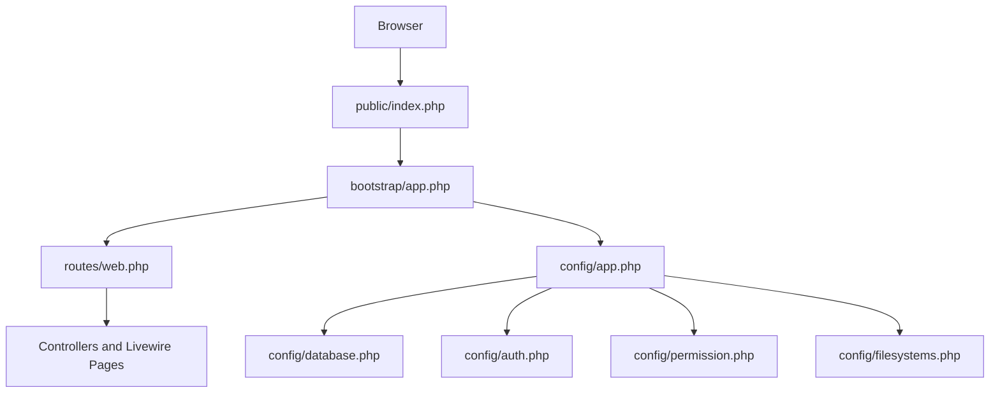
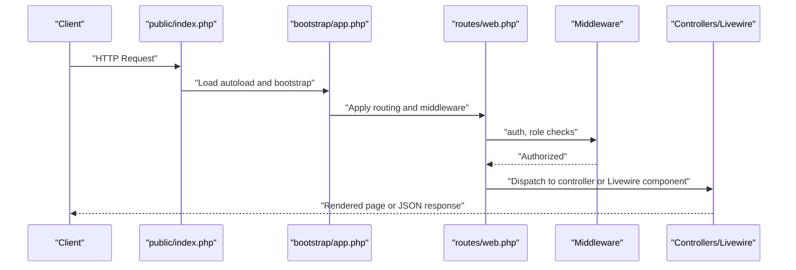
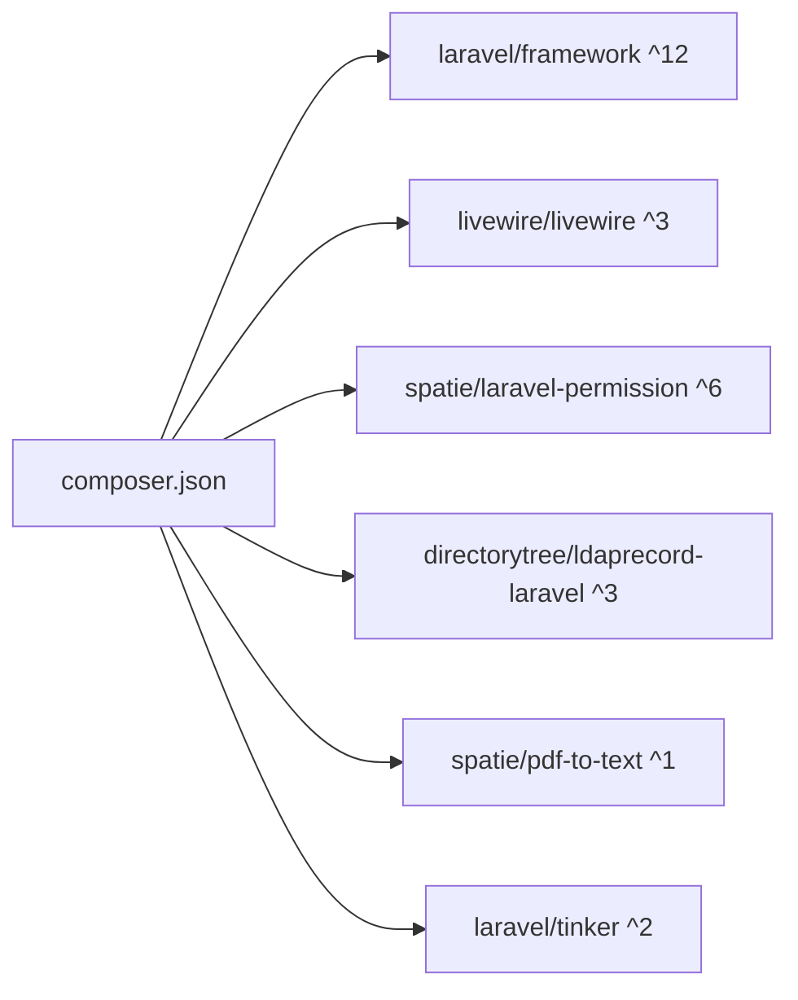

# Getting Started

<cite>
**Referenced Files in This Document**
- [composer.json](file://pdf-korektura/composer.json)
- [.env.example](file://pdf-korektura/.env.example)
- [config/app.php](file://pdf-korektura/config/app.php)
- [config/database.php](file://pdf-korektura/config/database.php)
- [config/permission.php](file://pdf-korektura/config/permission.php)
- [config/auth.php](file://pdf-korektura/config/auth.php)
- [config/filesystems.php](file://pdf-korektura/config/filesystems.php)
- [public/index.php](file://pdf-korektura/public/index.php)
- [bootstrap/app.php](file://pdf-korektura/bootstrap/app.php)
- [routes/web.php](file://pdf-korektura/routes/web.php)
- [database/migrations/0001_01_01_000000_create_users_table.php](file://pdf-korektura/database/migrations/0001_01_01_000000_create_users_table.php)
- [database/migrations/2024_06_10_100000_create_permission_tables.php](file://pdf-korektura/database/migrations/2024_06_10_100000_create_permission_tables.php)
- [database/seeders/DatabaseSeeder.php](file://pdf-korektura/database/seeders/DatabaseSeeder.php)
- [artisan](file://pdf-korektura/artisan)
</cite>

## Table of Contents
1. [Introduction](#introduction)
2. [Project Structure](#project-structure)
3. [Core Components](#core-components)
4. [Architecture Overview](#architecture-overview)
5. [Detailed Component Analysis](#detailed-component-analysis)
6. [Dependency Analysis](#dependency-analysis)
7. [Performance Considerations](#performance-considerations)
8. [Troubleshooting Guide](#troubleshooting-guide)
9. [Conclusion](#conclusion)
10. [Appendices](#appendices)

## Introduction
This guide helps you install and run the PDF correction management system locally. It covers prerequisites, environment setup, database preparation, dependency installation, migrations, initial seeding, and first-time access. It also includes verification steps, common issues, and how to start the development server.

## Project Structure
The application is a Laravel 12 project configured for PHP 8.2+ with Livewire 3 components, Spatie Permission for roles and permissions, LDAP integration support, and PostgreSQL as the default database connection. The public entry point routes requests into the Laravel application, which boots via the bootstrap pipeline and applies middleware and routing.



**Diagram sources**
- [public/index.php:1-18](file://pdf-korektura/public/index.php#L1-L18)
- [bootstrap/app.php:1-23](file://pdf-korektura/bootstrap/app.php#L1-L23)
- [routes/web.php:1-54](file://pdf-korektura/routes/web.php#L1-L54)
- [config/app.php:1-92](file://pdf-korektura/config/app.php#L1-L92)
- [config/database.php:1-93](file://pdf-korektura/config/database.php#L1-L93)
- [config/auth.php:1-49](file://pdf-korektura/config/auth.php#L1-L49)
- [config/permission.php:1-34](file://pdf-korektura/config/permission.php#L1-L34)
- [config/filesystems.php:1-23](file://pdf-korektura/config/filesystems.php#L1-L23)

**Section sources**
- [public/index.php:1-18](file://pdf-korektura/public/index.php#L1-L18)
- [bootstrap/app.php:1-23](file://pdf-korektura/bootstrap/app.php#L1-L23)
- [routes/web.php:1-54](file://pdf-korektura/routes/web.php#L1-L54)
- [config/app.php:1-92](file://pdf-korektura/config/app.php#L1-L92)

## Core Components
- PHP runtime: Version 8.2 or higher is required.
- Web server: Apache/Nginx or PHP built-in server for development.
- Database: PostgreSQL is configured by default; MySQL and SQLite are supported via configuration.
- Package manager: Composer is used for dependency management.
- Optional: Redis for caching/session/store if enabled.
- Optional: LDAP server for authentication if using LDAP guard.

Key configuration files:
- Environment template: [.env.example:1-78](file://pdf-korektura/.env.example#L1-L78)
- Application config: [config/app.php:1-92](file://pdf-korektura/config/app.php#L1-L92)
- Database connections: [config/database.php:1-93](file://pdf-korektura/config/database.php#L1-L93)
- Authentication and guards: [config/auth.php:1-49](file://pdf-korektura/config/auth.php#L1-L49)
- Permissions: [config/permission.php:1-34](file://pdf-korektura/config/permission.php#L1-L34)
- Filesystems: [config/filesystems.php:1-23](file://pdf-korektura/config/filesystems.php#L1-L23)

**Section sources**
- [composer.json:1-70](file://pdf-korektura/composer.json#L1-L70)
- [.env.example:1-78](file://pdf-korektura/.env.example#L1-L78)
- [config/app.php:1-92](file://pdf-korektura/config/app.php#L1-L92)
- [config/database.php:1-93](file://pdf-korektura/config/database.php#L1-L93)
- [config/auth.php:1-49](file://pdf-korektura/config/auth.php#L1-L49)
- [config/permission.php:1-34](file://pdf-korektura/config/permission.php#L1-L34)
- [config/filesystems.php:1-23](file://pdf-korektura/config/filesystems.php#L1-L23)

## Architecture Overview
The request lifecycle starts at the web server, which forwards to the public entry point. The entry script loads Composer autoload and boots Laravel. Routing groups apply authentication and role-based middleware. Livewire pages and controllers serve the UI and handle actions. Database and cache stores are configured centrally.



**Diagram sources**
- [public/index.php:1-18](file://pdf-korektura/public/index.php#L1-L18)
- [bootstrap/app.php:1-23](file://pdf-korektura/bootstrap/app.php#L1-L23)
- [routes/web.php:1-54](file://pdf-korektura/routes/web.php#L1-L54)

## Detailed Component Analysis

### Prerequisites
- PHP 8.2 or higher
- Composer
- Database engine:
  - PostgreSQL (default)
  - MySQL (supported)
  - SQLite (supported)
- Optional: Redis, LDAP server

Verification of PHP version and extensions can be performed using standard PHP tooling. Composer availability is required for dependency installation.

**Section sources**
- [composer.json:7-15](file://pdf-korektura/composer.json#L7-L15)

### Step-by-Step Installation

1) Install dependencies with Composer
- Navigate to the project root and run the Composer install command to fetch all PHP dependencies defined in the manifest.

2) Prepare the environment file
- Copy the example environment file to the active environment file and open it to configure database, mail, and application keys.

3) Configure database
- Set the database connection driver and credentials according to your chosen backend (PostgreSQL, MySQL, or SQLite).
- Ensure the target database exists and is accessible.

4) Configure application keys and mail
- Generate the application key.
- Configure mail settings for notifications or password resets.

5) Bootstrap the application
- Laravel’s Composer scripts will automatically copy the environment file, generate the application key, create the SQLite database file if using SQLite, and run migrations during project creation.

6) Run database migrations
- Apply all pending migrations to set up the schema.

7) Seed initial data
- Seed roles, default titles, and an initial admin user with predefined credentials.

8) Verify installation
- Access the login page, log in with the seeded admin credentials, and confirm navigation to the dashboard and administrative features.

**Section sources**
- [composer.json:41-51](file://pdf-korektura/composer.json#L41-L51)
- [.env.example:1-78](file://pdf-korektura/.env.example#L1-L78)
- [config/database.php:1-93](file://pdf-korektura/config/database.php#L1-L93)
- [config/app.php:1-92](file://pdf-korektura/config/app.php#L1-L92)
- [database/migrations/0001_01_01_000000_create_users_table.php:1-47](file://pdf-korektura/database/migrations/0001_01_01_000000_create_users_table.php#L1-L47)
- [database/migrations/2024_06_10_100000_create_permission_tables.php:1-122](file://pdf-korektura/database/migrations/2024_06_10_100000_create_permission_tables.php#L1-L122)
- [database/seeders/DatabaseSeeder.php:1-31](file://pdf-korektura/database/seeders/DatabaseSeeder.php#L1-L31)

### Environment Variables Configuration
Critical environment variables to review and adjust:

- Application identity and security
  - APP_NAME, APP_ENV, APP_KEY, APP_DEBUG, APP_TIMEZONE, APP_URL
  - FRONTEND_URL (optional)
  - BCRYPT_ROUNDS

- Database
  - DB_CONNECTION (pgsql, mysql, sqlite)
  - DB_HOST, DB_PORT, DB_DATABASE, DB_USERNAME, DB_PASSWORD
  - Additional charset/collation settings for MySQL

- Sessions, cache, queues
  - SESSION_DRIVER (e.g., database)
  - CACHE_STORE (e.g., database)
  - QUEUE_CONNECTION (e.g., database)

- Mail
  - MAIL_MAILER, MAIL_HOST, MAIL_PORT, MAIL_USERNAME, MAIL_PASSWORD, MAIL_ENCRYPTION
  - MAIL_FROM_ADDRESS, MAIL_FROM_NAME

- LDAP (optional)
  - LDAP_LOGGING, LDAP_CONNECTION, LDAP_HOST, LDAP_USERNAME, LDAP_PASSWORD, LDAP_PORT, LDAP_BASE_DN, LDAP_TIMEOUT, LDAP_SSL, LDAP_TLS

- Frontend build integration
  - VITE_APP_NAME

Ensure these values match your local setup. For production, keep APP_DEBUG disabled and set APP_ENV accordingly.

**Section sources**
- [.env.example:1-78](file://pdf-korektura/.env.example#L1-L78)
- [config/app.php:1-92](file://pdf-korektura/config/app.php#L1-L92)
- [config/database.php:1-93](file://pdf-korektura/config/database.php#L1-L93)
- [config/auth.php:1-49](file://pdf-korektura/config/auth.php#L1-L49)

### Database Setup and Migrations
- Supported drivers: sqlite, mysql, pgsql, sqlsrv.
- Default driver is sqlite; PostgreSQL is configured in the example environment.
- Migrations define:
  - Users, password reset tokens, and sessions
  - Permission system tables (roles, permissions, model-role/permission assignments)
  - Titles, PDF documents, PDF versions, and activity logs

Run migrations after configuring the database connection and ensuring the target database exists.

```mermaid
erDiagram
USERS {
bigint id PK
string name
string email UK
string username UK
string guid
string domain
timestamp email_verified_at
string password
remember_token
timestamps
}
ROLES {
bigint id PK
string name
string guard_name
timestamps
}
PERMISSIONS {
bigint id PK
string name
string guard_name
timestamps
}
MODEL_HAS_PERMISSIONS {
bigint model_id
string model_type
bigint permission_id FK
}
MODEL_HAS_ROLES {
bigint model_id
string model_type
bigint role_id FK
}
ROLE_HAS_PERMISSIONS {
bigint permission_id FK
bigint role_id FK
}
TITLES {
bigint id PK
string name
string description
timestamps
}
PDF_DOCUMENTS {
bigint id PK
string title_id FK
string uploader_id FK
string original_filename
string storage_path
timestamps
}
PDF_VERSIONS {
bigint id PK
bigint pdf_document_id FK
string filename
string storage_path
int version_number
timestamps
}
ACTIVITY_LOGS {
bigint id PK
string user_id FK
string action
text payload
timestamps
}
USERS ||--o{ PDF_DOCUMENTS : "uploaded"
TITLES ||--o{ PDF_DOCUMENTS : "owns"
PDF_DOCUMENTS ||--o{ PDF_VERSIONS : "has_versions"
USERS ||--o{ ACTIVITY_LOGS : "logged"
```

**Diagram sources**
- [database/migrations/0001_01_01_000000_create_users_table.php:1-47](file://pdf-korektura/database/migrations/0001_01_01_000000_create_users_table.php#L1-L47)
- [database/migrations/2024_06_10_100000_create_permission_tables.php:1-122](file://pdf-korektura/database/migrations/2024_06_10_100000_create_permission_tables.php#L1-L122)

**Section sources**
- [config/database.php:1-93](file://pdf-korektura/config/database.php#L1-L93)
- [database/migrations/0001_01_01_000000_create_users_table.php:1-47](file://pdf-korektura/database/migrations/0001_01_01_000000_create_users_table.php#L1-L47)
- [database/migrations/2024_06_10_100000_create_permission_tables.php:1-122](file://pdf-korektura/database/migrations/2024_06_10_100000_create_permission_tables.php#L1-L122)

### Initial User Account Creation
- Roles are seeded: admin, editor, proofreader.
- An admin user is created with a default username and password.
- Titles are seeded for content categorization.

Use the seeded admin credentials to log in and manage users and titles via the admin panel.

**Section sources**
- [database/seeders/DatabaseSeeder.php:1-31](file://pdf-korektura/database/seeders/DatabaseSeeder.php#L1-L31)
- [config/permission.php:1-34](file://pdf-korektura/config/permission.php#L1-L34)

### Verification Steps
- Confirm the application responds to requests at the configured APP_URL.
- Log in using the seeded admin credentials.
- Navigate to the dashboard and administrative screens to verify routing and middleware.
- Check that Livewire components render without errors.

**Section sources**
- [routes/web.php:1-54](file://pdf-korektura/routes/web.php#L1-L54)
- [bootstrap/app.php:1-23](file://pdf-korektura/bootstrap/app.php#L1-L23)

### Development Server Startup and Initial Access
- Use the PHP built-in server for quick local testing.
- Point your browser to the configured APP_URL.
- The default route redirects to the login page; use the seeded admin credentials to sign in.

**Section sources**
- [routes/web.php:17-23](file://pdf-korektura/routes/web.php#L17-L23)
- [public/index.php:1-18](file://pdf-korektura/public/index.php#L1-L18)

## Dependency Analysis
The project relies on Laravel 12, Livewire 3, Spatie Permission, LDAP record integration, and PDF parsing utilities. Composer manages autoload and post-install hooks to discover packages and run migrations.



**Diagram sources**
- [composer.json:7-15](file://pdf-korektura/composer.json#L7-L15)

**Section sources**
- [composer.json:1-70](file://pdf-korektura/composer.json#L1-L70)

## Performance Considerations
- Use production-ready web servers (Apache/Nginx) for performance.
- Enable OPcache and appropriate PHP tuning for production.
- Keep APP_DEBUG disabled in production environments.
- Consider Redis for session/cache if scaling.

## Troubleshooting Guide
Common issues and resolutions:
- Composer install fails due to missing PHP extensions
  - Ensure required extensions are installed and enabled.
- Database connection errors
  - Verify DB_CONNECTION, DB_HOST, DB_PORT, DB_DATABASE, DB_USERNAME, DB_PASSWORD.
  - Confirm the database service is running and accessible.
- Application key not set
  - Generate the key using the application’s key generation command.
- Migrations fail
  - Ensure the target database exists and credentials are correct.
  - Clear configuration cache if permission package configuration is missing.
- LDAP authentication issues
  - Adjust LDAP_* variables to match your Active Directory server.
- File permissions for storage and cache
  - Ensure write permissions for storage and bootstrap/cache directories.
- Frontend assets not loading
  - Confirm filesystem disk configuration and storage links.

**Section sources**
- [composer.json:41-51](file://pdf-korektura/composer.json#L41-L51)
- [config/database.php:1-93](file://pdf-korektura/config/database.php#L1-L93)
- [config/permission.php:18-22](file://pdf-korektura/config/permission.php#L18-L22)
- [config/filesystems.php:1-23](file://pdf-korektura/config/filesystems.php#L1-L23)
- [.env.example:68-78](file://pdf-korektura/.env.example#L68-L78)

## Conclusion
You now have the prerequisites, configuration, and steps to install and run the PDF correction management system locally. After completing the setup, verify access via the login page and explore the admin and user features.

## Appendices

### Appendix A: Environment Variables Reference
- Application
  - APP_NAME, APP_ENV, APP_KEY, APP_DEBUG, APP_TIMEZONE, APP_URL, FRONTEND_URL
- Database
  - DB_CONNECTION, DB_HOST, DB_PORT, DB_DATABASE, DB_USERNAME, DB_PASSWORD
- Sessions, Cache, Queue
  - SESSION_DRIVER, CACHE_STORE, QUEUE_CONNECTION
- Mail
  - MAIL_MAILER, MAIL_HOST, MAIL_PORT, MAIL_USERNAME, MAIL_PASSWORD, MAIL_ENCRYPTION, MAIL_FROM_ADDRESS, MAIL_FROM_NAME
- LDAP
  - LDAP_LOGGING, LDAP_CONNECTION, LDAP_HOST, LDAP_USERNAME, LDAP_PASSWORD, LDAP_PORT, LDAP_BASE_DN, LDAP_TIMEOUT, LDAP_SSL, LDAP_TLS
- Frontend
  - VITE_APP_NAME

**Section sources**
- [.env.example:1-78](file://pdf-korektura/.env.example#L1-L78)