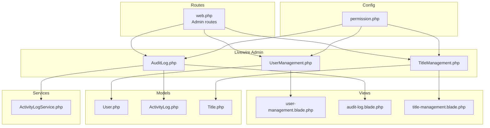
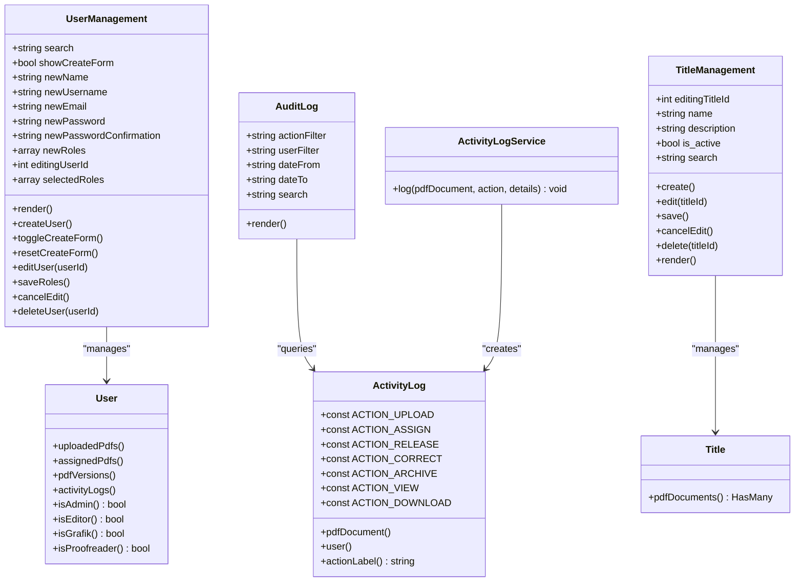
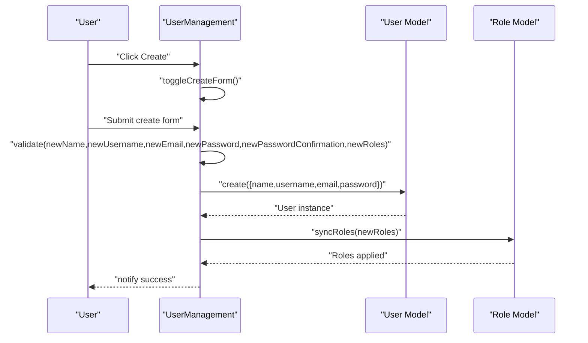
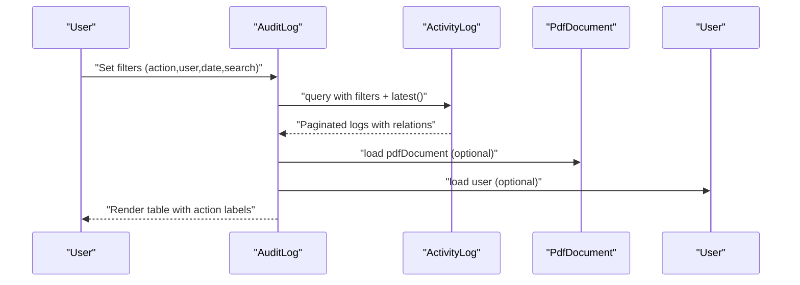
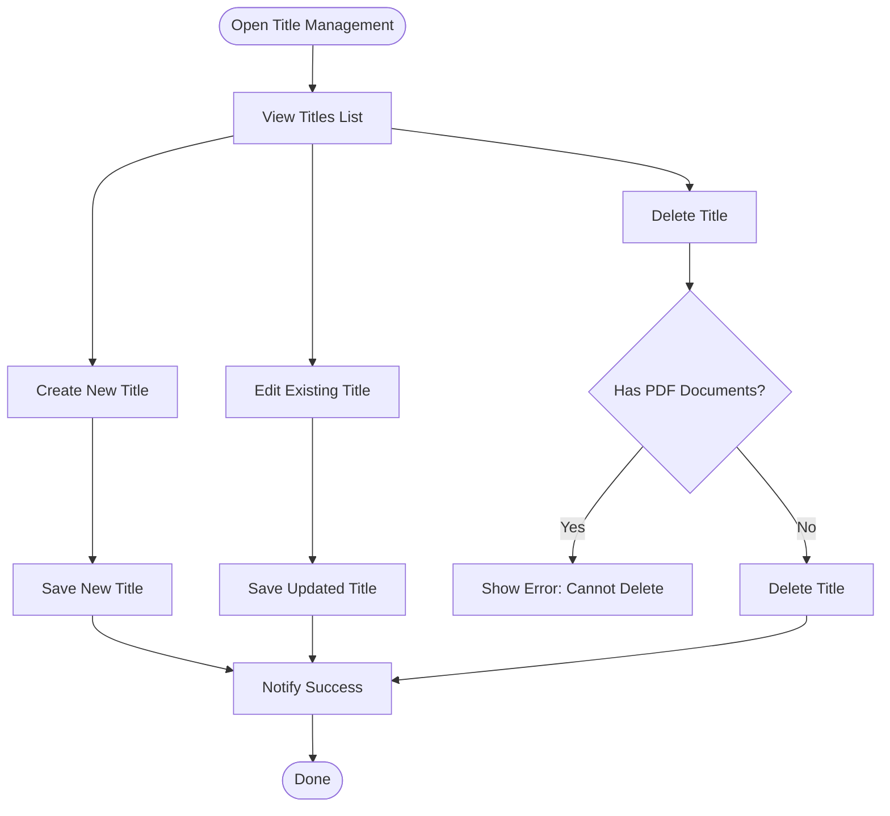
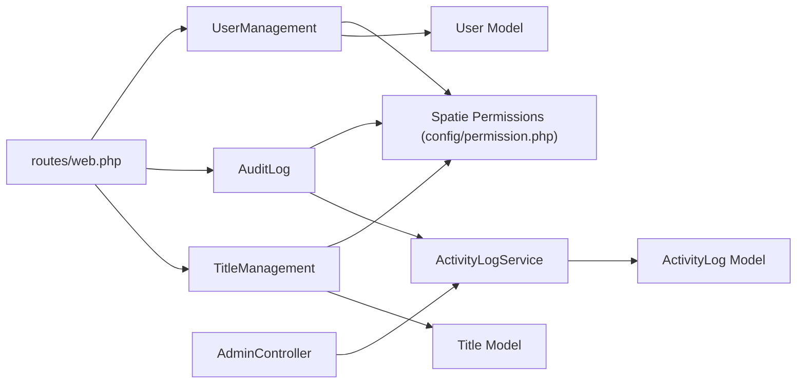

# Administrative Components

<cite>
**Referenced Files in This Document**
- [UserManagement.php](file://app/Livewire/Admin/UserManagement.php)
- [AuditLog.php](file://app/Livewire/Admin/AuditLog.php)
- [TitleManagement.php](file://app/Livewire/Admin/TitleManagement.php)
- [user-management.blade.php](file://resources/views/livewire/admin/user-management.blade.php)
- [audit-log.blade.php](file://resources/views/livewire/admin/audit-log.blade.php)
- [title-management.blade.php](file://resources/views/livewire/admin/title-management.blade.php)
- [User.php](file://app/Models/User.php)
- [ActivityLog.php](file://app/Models/ActivityLog.php)
- [Title.php](file://app/Models/Title.php)
- [ActivityLogService.php](file://app/Services/ActivityLogService.php)
- [permission.php](file://config/permission.php)
- [web.php](file://routes/web.php)
- [2024_06_10_140000_create_activity_logs_table.php](file://database/migrations/2024_06_10_140000_create_activity_logs_table.php)
- [2024_06_10_110000_create_titles_table.php](file://database/migrations/2024_06_10_110000_create_titles_table.php)
- [AdminController.php](file://app/Http/Controllers/AdminController.php)
</cite>

## Table of Contents
1. [Introduction](#introduction)
2. [Project Structure](#project-structure)
3. [Core Components](#core-components)
4. [Architecture Overview](#architecture-overview)
5. [Detailed Component Analysis](#detailed-component-analysis)
6. [Dependency Analysis](#dependency-analysis)
7. [Performance Considerations](#performance-considerations)
8. [Security and Compliance](#security-and-compliance)
9. [Troubleshooting Guide](#troubleshooting-guide)
10. [Conclusion](#conclusion)

## Introduction
This document explains the administrative Livewire components that power user management, audit logging, and title/document categorization within the application. It covers:
- UserManagement: user registration, role assignment, and profile-related administrative operations
- AuditLog: system activity tracking, filtering, and compliance visibility
- TitleManagement: document categorization and administrative configuration
It also documents state management, pagination, role-based access control, and integration with the permission system, along with security and audit trail requirements.

## Project Structure
The administrative features are organized under the Livewire Admin namespace with dedicated Blade views and Eloquent models. Routes restrict access to Admin-only pages and actions.

**Diagram sources**
- [web.php:43-52](file://routes/web.php#L43-L52)
- [UserManagement.php:14-127](file://app/Livewire/Admin/UserManagement.php#L14-L127)
- [AuditLog.php:11-55](file://app/Livewire/Admin/AuditLog.php#L11-L55)
- [TitleManagement.php:11-98](file://app/Livewire/Admin/TitleManagement.php#L11-L98)
- [user-management.blade.php:1-152](file://resources/views/livewire/admin/user-management.blade.php#L1-L152)
- [audit-log.blade.php:1-68](file://resources/views/livewire/admin/audit-log.blade.php#L1-L68)
- [title-management.blade.php:1-88](file://resources/views/livewire/admin/title-management.blade.php#L1-L88)
- [User.php:10-76](file://app/Models/User.php#L10-L76)
- [ActivityLog.php:9-60](file://app/Models/ActivityLog.php#L9-L60)
- [Title.php:9-31](file://app/Models/Title.php#L9-L31)
- [ActivityLogService.php:10-31](file://app/Services/ActivityLogService.php#L10-L31)
- [permission.php:1-34](file://config/permission.php#L1-L34)

**Section sources**
- [web.php:43-52](file://routes/web.php#L43-L52)
- [UserManagement.php:14-127](file://app/Livewire/Admin/UserManagement.php#L14-L127)
- [AuditLog.php:11-55](file://app/Livewire/Admin/AuditLog.php#L11-L55)
- [TitleManagement.php:11-98](file://app/Livewire/Admin/TitleManagement.php#L11-L98)

## Core Components
- UserManagement: CRUD-like user administration with role assignment, search, and pagination. Prevents self-deletion and integrates with Spatie permissions.
- AuditLog: Filterable activity log with action, user, date range, and free-text search; displays related PDF and IP address.
- TitleManagement: Manage document titles (categories), including activation/deactivation and deletion safeguards.

Key capabilities:
- State-driven UI with Livewire reactive properties
- Pagination for large datasets
- Validation and user feedback via notifications
- Role-based routing and middleware enforcement

**Section sources**
- [UserManagement.php:14-127](file://app/Livewire/Admin/UserManagement.php#L14-L127)
- [AuditLog.php:11-55](file://app/Livewire/Admin/AuditLog.php#L11-L55)
- [TitleManagement.php:11-98](file://app/Livewire/Admin/TitleManagement.php#L11-L98)

## Architecture Overview
The Admin components are rendered via Blade templates and backed by Eloquent models. Activity logging is centralized in a service that records actions with metadata.

**Diagram sources**
- [UserManagement.php:14-127](file://app/Livewire/Admin/UserManagement.php#L14-L127)
- [AuditLog.php:11-55](file://app/Livewire/Admin/AuditLog.php#L11-L55)
- [TitleManagement.php:11-98](file://app/Livewire/Admin/TitleManagement.php#L11-L98)
- [User.php:10-76](file://app/Models/User.php#L10-L76)
- [ActivityLog.php:9-60](file://app/Models/ActivityLog.php#L9-L60)
- [Title.php:9-31](file://app/Models/Title.php#L9-L31)
- [ActivityLogService.php:10-31](file://app/Services/ActivityLogService.php#L10-L31)

## Detailed Component Analysis

### UserManagement Component
Responsibilities:
- Toggle creation form and reset state
- Validate and create users with hashed passwords
- Assign roles via sync against Spatie Role model
- Edit roles per user and persist changes
- Delete users with protection against self-deletion
- Paginated listing with live search across name/email/username

State management:
- Reactive properties for search, create form toggling, and role selection
- Uses WithPagination trait for efficient listing
- Validation messages localized in component

UI integration:
- Blade template renders create/edit forms, role checkboxes, and user table with actions

**Diagram sources**
- [UserManagement.php:31-67](file://app/Livewire/Admin/UserManagement.php#L31-L67)
- [User.php:10-76](file://app/Models/User.php#L10-L76)

**Section sources**
- [UserManagement.php:14-127](file://app/Livewire/Admin/UserManagement.php#L14-L127)
- [user-management.blade.php:14-73](file://resources/views/livewire/admin/user-management.blade.php#L14-L73)
- [user-management.blade.php:75-99](file://resources/views/livewire/admin/user-management.blade.php#L75-L99)
- [user-management.blade.php:107-150](file://resources/views/livewire/admin/user-management.blade.php#L107-L150)

### AuditLog Component
Responsibilities:
- Filter activity logs by action, user, date range, and free-text details
- Paginate entries ordered by recency
- Provide distinct action list and user list for filters
- Localize action labels for readability

State management:
- queryString synchronization for filter persistence
- Live debounced search for responsive filtering

**Diagram sources**
- [AuditLog.php:23-53](file://app/Livewire/Admin/AuditLog.php#L23-L53)
- [ActivityLog.php:36-58](file://app/Models/ActivityLog.php#L36-L58)

**Section sources**
- [AuditLog.php:11-55](file://app/Livewire/Admin/AuditLog.php#L11-L55)
- [audit-log.blade.php:4-22](file://resources/views/livewire/admin/audit-log.blade.php#L4-L22)
- [audit-log.blade.php:24-66](file://resources/views/livewire/admin/audit-log.blade.php#L24-L66)

### TitleManagement Component
Responsibilities:
- Create/update titles with validation rules
- Activate/deactivate titles
- Safely delete titles only if unused by PDF documents
- Paginated listing with live search by name

**Diagram sources**
- [TitleManagement.php:27-83](file://app/Livewire/Admin/TitleManagement.php#L27-L83)
- [Title.php:26-29](file://app/Models/Title.php#L26-L29)

**Section sources**
- [TitleManagement.php:11-98](file://app/Livewire/Admin/TitleManagement.php#L11-L98)
- [title-management.blade.php:4-38](file://resources/views/livewire/admin/title-management.blade.php#L4-L38)
- [title-management.blade.php:40-86](file://resources/views/livewire/admin/title-management.blade.php#L40-L86)

## Dependency Analysis
- Routing enforces Admin-only access for administrative pages and actions
- Permission configuration integrates with Spatie models and caching
- Activity logging is centralized and used by both Livewire components and controllers
- Models define relationships and helper methods for role checks and activity associations

**Diagram sources**
- [web.php:43-52](file://routes/web.php#L43-L52)
- [permission.php:1-34](file://config/permission.php#L1-L34)
- [ActivityLogService.php:10-31](file://app/Services/ActivityLogService.php#L10-L31)
- [ActivityLog.php:9-60](file://app/Models/ActivityLog.php#L9-L60)
- [User.php:10-76](file://app/Models/User.php#L10-L76)
- [Title.php:9-31](file://app/Models/Title.php#L9-L31)
- [AdminController.php:11-62](file://app/Http/Controllers/AdminController.php#L11-L62)

**Section sources**
- [web.php:43-52](file://routes/web.php#L43-L52)
- [permission.php:1-34](file://config/permission.php#L1-L34)

## Performance Considerations
- Pagination is enabled for all lists to limit database load and improve responsiveness.
- Live debounced search reduces unnecessary queries during typing.
- Eager loading of relations (roles for users, user/pdfDocument for logs) minimizes N+1 queries.
- Filtering conditions are applied server-side to keep payloads small.
- Consider adding database indexes on frequently filtered columns (e.g., activity_logs.action, activity_logs.created_at, titles.name) for larger datasets.

[No sources needed since this section provides general guidance]

## Security and Compliance
Access control:
- Admin-only routes are guarded by role middleware ensuring only users with the Admin role can access administrative pages and actions.
- Self-deletion prevention in UserManagement avoids accidental account lockouts.
- Deletion safeguards in TitleManagement prevent orphaning PDF documents.

Audit trails:
- ActivityLogService centralizes logging with action constants and IP capture.
- ActivityLog model stores timestamps, user references, optional PDF linkage, and details.
- AdminController logs release and reassignment actions with contextual details.

Compliance:
- Keep audit logs searchable and filterable by date ranges and users.
- Retain IP addresses and user identities for traceability.
- Regularly review and export logs for compliance audits.

**Section sources**
- [web.php:43-52](file://routes/web.php#L43-L52)
- [UserManagement.php:95-107](file://app/Livewire/Admin/UserManagement.php#L95-L107)
- [TitleManagement.php:72-83](file://app/Livewire/Admin/TitleManagement.php#L72-L83)
- [ActivityLogService.php:20-29](file://app/Services/ActivityLogService.php#L20-L29)
- [ActivityLog.php:13-27](file://app/Models/ActivityLog.php#L13-L27)
- [2024_06_10_140000_create_activity_logs_table.php:11-18](file://database/migrations/2024_06_10_140000_create_activity_logs_table.php#L11-L18)
- [2024_06_10_110000_create_titles_table.php:11-16](file://database/migrations/2024_06_10_110000_create_titles_table.php#L11-L16)

## Troubleshooting Guide
Common issues and resolutions:
- Role assignment errors: Ensure roles exist and are assignable; verify Spatie permission cache if stale.
- Duplicate usernames/emails: Validation prevents duplicates; check uniqueness constraints.
- Self-deletion blocked: Confirm current user ID differs from target user ID.
- Title deletion fails: Verify no PDF documents reference the title; remove or reassign documents first.
- Empty audit log filters: Confirm filters match existing values; note that action list is derived from distinct stored actions.

Operational tips:
- Use the AuditLog filters to locate specific events quickly.
- For bulk operations, leverage the search and filter controls to narrow the dataset before applying changes.

**Section sources**
- [UserManagement.php:39-67](file://app/Livewire/Admin/UserManagement.php#L39-L67)
- [UserManagement.php:95-107](file://app/Livewire/Admin/UserManagement.php#L95-L107)
- [TitleManagement.php:72-83](file://app/Livewire/Admin/TitleManagement.php#L72-L83)
- [AuditLog.php:23-53](file://app/Livewire/Admin/AuditLog.php#L23-L53)

## Conclusion
The administrative Livewire components provide a secure, auditable, and user-friendly interface for managing users, tracking system activity, and configuring document titles. They integrate tightly with the role-based access control system and maintain comprehensive audit trails suitable for compliance needs. By leveraging pagination, live filtering, and centralized logging, the components scale effectively while remaining easy to operate.