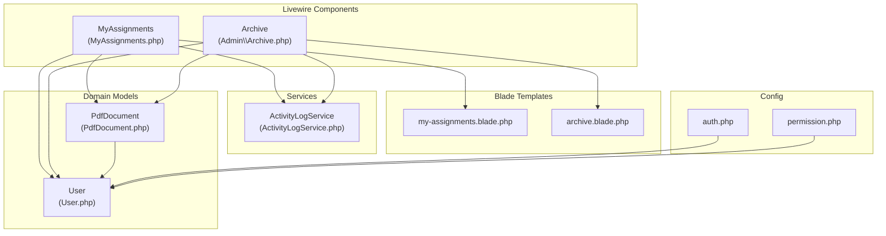
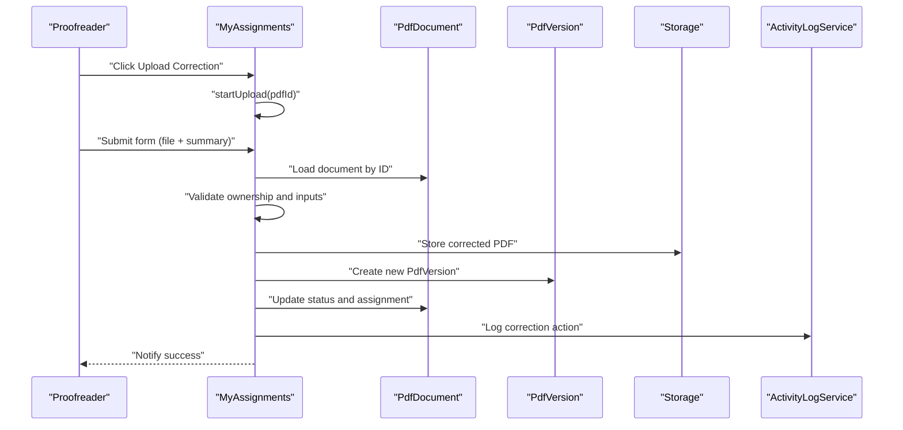
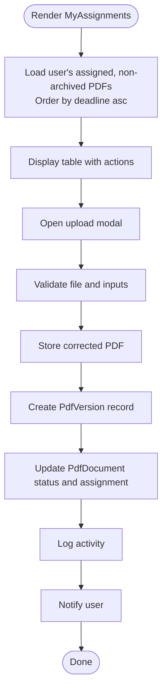
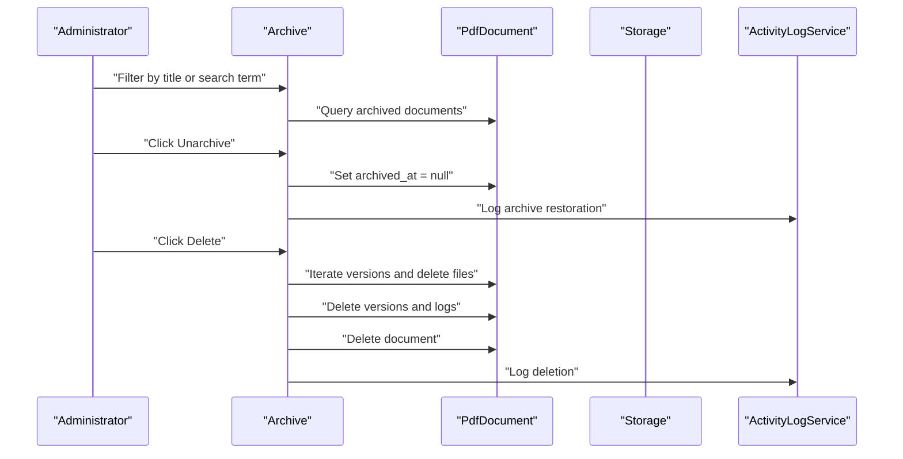
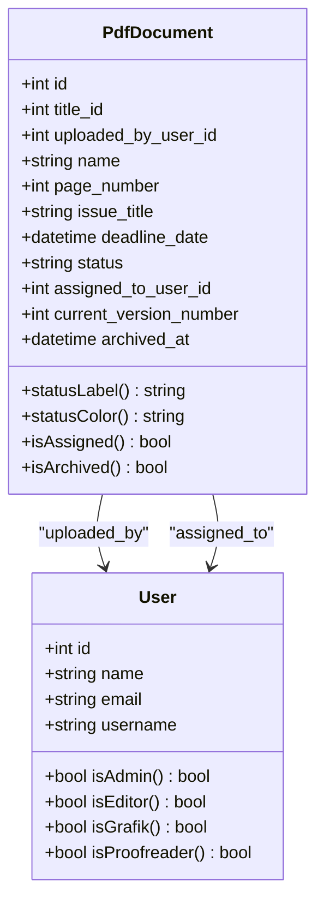
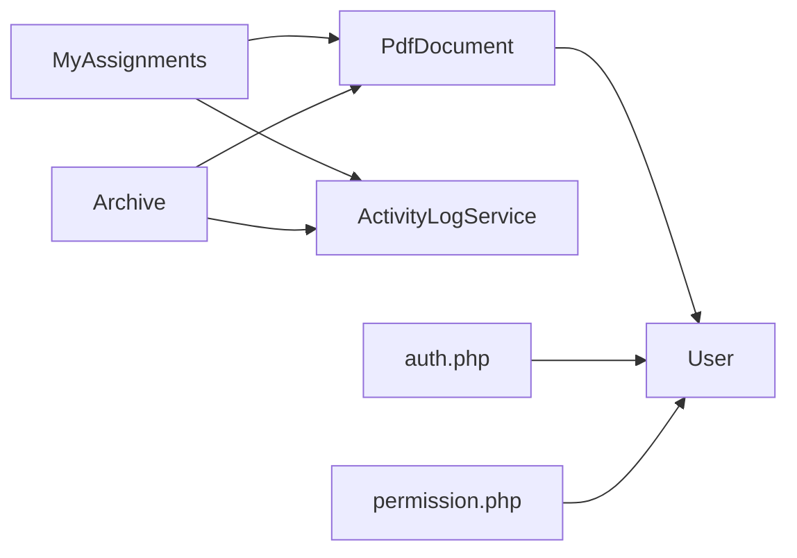

# Assignment Components

<cite>
**Referenced Files in This Document**
- [MyAssignments.php](file://app/Livewire/MyAssignments.php)
- [my-assignments.blade.php](file://resources/views/livewire/my-assignments.blade.php)
- [Archive.php](file://app/Livewire/Admin/Archive.php)
- [archive.blade.php](file://resources/views/livewire/admin/archive.blade.php)
- [PdfDocument.php](file://app/Models/PdfDocument.php)
- [User.php](file://app/Models/User.php)
- [ActivityLogService.php](file://app/Services/ActivityLogService.php)
- [auth.php](file://config/auth.php)
- [permission.php](file://config/permission.php)
</cite>

## Table of Contents
1. [Introduction](#introduction)
2. [Project Structure](#project-structure)
3. [Core Components](#core-components)
4. [Architecture Overview](#architecture-overview)
5. [Detailed Component Analysis](#detailed-component-analysis)
6. [Dependency Analysis](#dependency-analysis)
7. [Performance Considerations](#performance-considerations)
8. [Troubleshooting Guide](#troubleshooting-guide)
9. [Conclusion](#conclusion)
10. [Appendices](#appendices)

## Introduction
This document explains the assignment-related Livewire components in the system, focusing on:
- MyAssignments: displays a proofreader’s assigned tasks, upload corrections, manage deadlines, and release assignments back to the pool.
- Archive: allows administrators to view archived documents, restore them, and permanently delete archived versions.

It covers component state management, integration with assignment logic and user permissions, customization for different roles, and performance considerations for large lists and frequent updates.

## Project Structure
The assignment workflow spans Livewire components, Blade templates, Eloquent models, and service utilities. The following diagram shows how the key files relate to each other.

**Diagram sources**
- [MyAssignments.php:16-121](file://app/Livewire/MyAssignments.php#L16-L121)
- [my-assignments.blade.php:1-155](file://resources/views/livewire/my-assignments.blade.php#L1-L155)
- [Archive.php:13-74](file://app/Livewire/Admin/Archive.php#L13-L74)
- [archive.blade.php:1-79](file://resources/views/livewire/admin/archive.blade.php#L1-L79)
- [PdfDocument.php:10-129](file://app/Models/PdfDocument.php#L10-L129)
- [User.php:10-75](file://app/Models/User.php#L10-L75)
- [ActivityLogService.php:10-30](file://app/Services/ActivityLogService.php#L10-L30)
- [auth.php:1-49](file://config/auth.php#L1-L49)
- [permission.php:1-34](file://config/permission.php#L1-L34)

**Section sources**
- [MyAssignments.php:16-121](file://app/Livewire/MyAssignments.php#L16-L121)
- [Archive.php:13-74](file://app/Livewire/Admin/Archive.php#L13-L74)

## Core Components
- MyAssignments
  - Purpose: Show a proofreader’s assigned PDFs, upload corrected versions, optionally return for revision, and release assignments back to the pool.
  - Key state: Tracks the current upload target, file input, change summary, and return-for-revision flag.
  - Pagination: Paginates 15 items per page.
  - Validation: Enforces PDF file type and size limits.
  - Permissions: Ensures the logged-in user is assigned to the target PDF before acting.
  - Side effects: Creates a new version record, updates document status and assignment, logs activity, and notifies the user.

- Archive
  - Purpose: Admin-only view of archived PDFs with filtering and actions to restore or delete.
  - Filters: Title filter and free-text search across name and issue title.
  - Actions: Restore (remove archived timestamp) and delete (remove all versions’ files and records).
  - Pagination: Paginates 20 items per page.
  - Observability: Shows total archived count and per-document metadata.

**Section sources**
- [MyAssignments.php:16-121](file://app/Livewire/MyAssignments.php#L16-L121)
- [my-assignments.blade.php:1-155](file://resources/views/livewire/my-assignments.blade.php#L1-L155)
- [Archive.php:13-74](file://app/Livewire/Admin/Archive.php#L13-L74)
- [archive.blade.php:1-79](file://resources/views/livewire/admin/archive.blade.php#L1-L79)

## Architecture Overview
The components integrate with Eloquent models and a shared activity logging service. The MyAssignments component focuses on the proofreader workflow, while Archive provides administrative oversight of historical documents.

**Diagram sources**
- [MyAssignments.php:31-88](file://app/Livewire/MyAssignments.php#L31-L88)
- [PdfDocument.php:10-129](file://app/Models/PdfDocument.php#L10-L129)
- [ActivityLogService.php:20-29](file://app/Services/ActivityLogService.php#L20-L29)

## Detailed Component Analysis

### MyAssignments Component
- Responsibilities
  - Render a paginated list of the authenticated user’s assigned, non-archived PDFs ordered by deadline.
  - Manage the upload flow for corrected PDFs, including drag-and-drop handling via Livewire’s upload mechanism.
  - Update document status and assignment state after upload.
  - Allow releasing an assignment back to the pool.

- State Management
  - Properties track the current upload target, file input, change summary, and return flag.
  - Validation rules ensure file type and size constraints and optional text length.

- Permission and Ownership Checks
  - Upload and release actions verify the logged-in user matches the document’s assigned user before proceeding.

- Data Flow
  - On submit, a new version is created under a folder path derived from the title and version number.
  - The document’s current version number increments, and status transitions reflect completion or return for revision.
  - Activity logs capture the correction event.

- UI Integration
  - Uses a Blade template with Tailwind classes and Alpine.js for drag-and-drop UX.
  - Displays deadline warnings and links to preview/download.
  - Provides pagination controls.

**Diagram sources**
- [MyAssignments.php:109-120](file://app/Livewire/MyAssignments.php#L109-L120)
- [MyAssignments.php:42-88](file://app/Livewire/MyAssignments.php#L42-L88)
- [PdfDocument.php:88-96](file://app/Models/PdfDocument.php#L88-L96)

**Section sources**
- [MyAssignments.php:16-121](file://app/Livewire/MyAssignments.php#L16-L121)
- [my-assignments.blade.php:1-155](file://resources/views/livewire/my-assignments.blade.php#L1-L155)
- [PdfDocument.php:10-129](file://app/Models/PdfDocument.php#L10-L129)
- [ActivityLogService.php:20-29](file://app/Services/ActivityLogService.php#L20-L29)

### Archive Component
- Responsibilities
  - Present archived PDFs with filters for title and free-text search.
  - Provide actions to restore (unarchive) or delete archived documents and their versions.

- Filtering and Query Building
  - Applies title filter and full-text search across name and issue title.
  - Orders by archived timestamp descending.

- Deletion Behavior
  - Deletes all stored version files from local disk.
  - Removes version records and activity logs, then deletes the document.

- UI Integration
  - Includes a total archived counter and pagination controls.
  - Offers download, restore, and delete actions per row.

**Diagram sources**
- [Archive.php:51-73](file://app/Livewire/Admin/Archive.php#L51-L73)
- [Archive.php:22-49](file://app/Livewire/Admin/Archive.php#L22-L49)
- [PdfDocument.php:93-96](file://app/Models/PdfDocument.php#L93-L96)
- [ActivityLogService.php:20-29](file://app/Services/ActivityLogService.php#L20-L29)

**Section sources**
- [Archive.php:13-74](file://app/Livewire/Admin/Archive.php#L13-L74)
- [archive.blade.php:1-79](file://resources/views/livewire/admin/archive.blade.php#L1-L79)

### Data Models and Status Management
- PdfDocument
  - Defines lifecycle statuses and helper scopes for assigned/unassigned/not archived/archived.
  - Provides helpers to map status to localized labels and color tokens.
  - Exposes relations to Title, uploader, assignee, versions, and activity logs.

- User
  - Role-based helpers to identify Admin, Editor, Grafik, and Proofreader roles.
  - Relations to uploaded PDFs, assigned PDFs, versions, and activity logs.

**Diagram sources**
- [PdfDocument.php:10-129](file://app/Models/PdfDocument.php#L10-L129)
- [User.php:10-75](file://app/Models/User.php#L10-L75)

**Section sources**
- [PdfDocument.php:10-129](file://app/Models/PdfDocument.php#L10-L129)
- [User.php:10-75](file://app/Models/User.php#L10-L75)

## Dependency Analysis
- Component-to-model coupling
  - MyAssignments depends on PdfDocument for scoping, status updates, and version creation.
  - Archive depends on PdfDocument for querying archived records and cascading deletions.
- Cross-component collaboration
  - Both components rely on ActivityLogService for audit trail entries.
- Authentication and permissions
  - Authentication guard and provider are configured in auth.php.
  - Role-based permissions are managed via Spatie Permission package configuration.

**Diagram sources**
- [MyAssignments.php:16-121](file://app/Livewire/MyAssignments.php#L16-L121)
- [Archive.php:13-74](file://app/Livewire/Admin/Archive.php#L13-L74)
- [PdfDocument.php:10-129](file://app/Models/PdfDocument.php#L10-L129)
- [User.php:10-75](file://app/Models/User.php#L10-L75)
- [ActivityLogService.php:10-30](file://app/Services/ActivityLogService.php#L10-L30)
- [auth.php:1-49](file://config/auth.php#L1-L49)
- [permission.php:1-34](file://config/permission.php#L1-L34)

**Section sources**
- [auth.php:1-49](file://config/auth.php#L1-L49)
- [permission.php:1-34](file://config/permission.php#L1-L34)

## Performance Considerations
- Pagination
  - MyAssignments paginates 15 items; Archive paginates 20 items. Keep page sizes balanced to avoid excessive DOM rendering.
- Eager loading
  - Both components eager-load related data (title, uploader, versions, assigned user) to reduce N+1 queries.
- Sorting and filtering
  - MyAssignments orders by deadline ascending; Archive applies filters on server-side queries to limit result sets.
- File uploads
  - Uploads are validated for type and size. Consider chunked uploads or server-side limits for very large files.
- Activity logging
  - Logging occurs per action; batch writes or background jobs can reduce latency under high-frequency updates.
- Rendering
  - Blade templates use minimal Alpine logic; keep additional client-side scripts scoped to avoid reactivity overhead.

[No sources needed since this section provides general guidance]

## Troubleshooting Guide
- Upload fails or permission denied
  - Verify the logged-in user is assigned to the target PDF before uploading or releasing.
  - Confirm file type and size constraints are met.
- No assigned PDFs shown
  - Ensure the user has non-archived, assigned PDFs ordered by deadline.
- Archive filters not applied
  - Check query string synchronization and debounce timing for live filters.
- Deletion removes files but not records
  - Confirm cascading deletions for versions and activity logs are executed before deleting the document.
- Notifications not visible
  - Ensure the frontend listens for notify events and displays messages.

**Section sources**
- [MyAssignments.php:48-51](file://app/Livewire/MyAssignments.php#L48-L51)
- [MyAssignments.php:94-97](file://app/Livewire/MyAssignments.php#L94-L97)
- [Archive.php:57-66](file://app/Livewire/Admin/Archive.php#L57-L66)

## Conclusion
MyAssignments and Archive provide a cohesive assignment workflow: proofreaders manage deadlines and corrections with robust validation and notifications, while administrators oversee archived content with filtering, restoration, and safe deletion. The components leverage Eloquent scopes, relations, and a shared activity logging service to maintain clarity and auditability. With pagination, eager loading, and server-side filtering, the system remains responsive even with larger datasets.

[No sources needed since this section summarizes without analyzing specific files]

## Appendices

### Extending Assignment Functionality
- Add new assignment features
  - Introduce new Livewire actions in MyAssignments for additional transitions (e.g., pause/resume) and update the template accordingly.
  - Extend PdfDocument scopes to support new filters and statuses.
- Customize for different user roles
  - Gate component actions behind role checks using helpers from User model.
  - Adjust templates to show/hide buttons based on roles.
- Enhance Archive with bulk actions
  - Add multi-select checkboxes and batch unarchive/delete operations.
  - Improve search to include metadata like author or version count.

[No sources needed since this section provides general guidance]