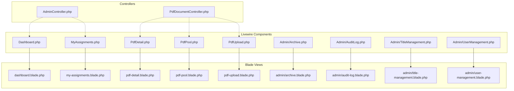
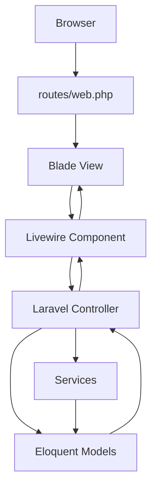
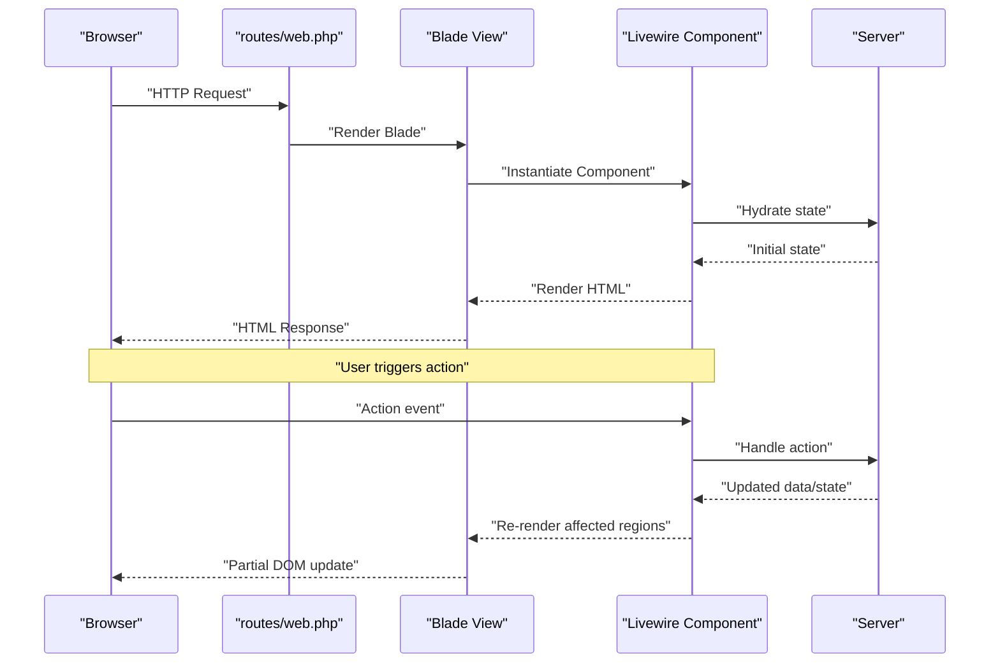
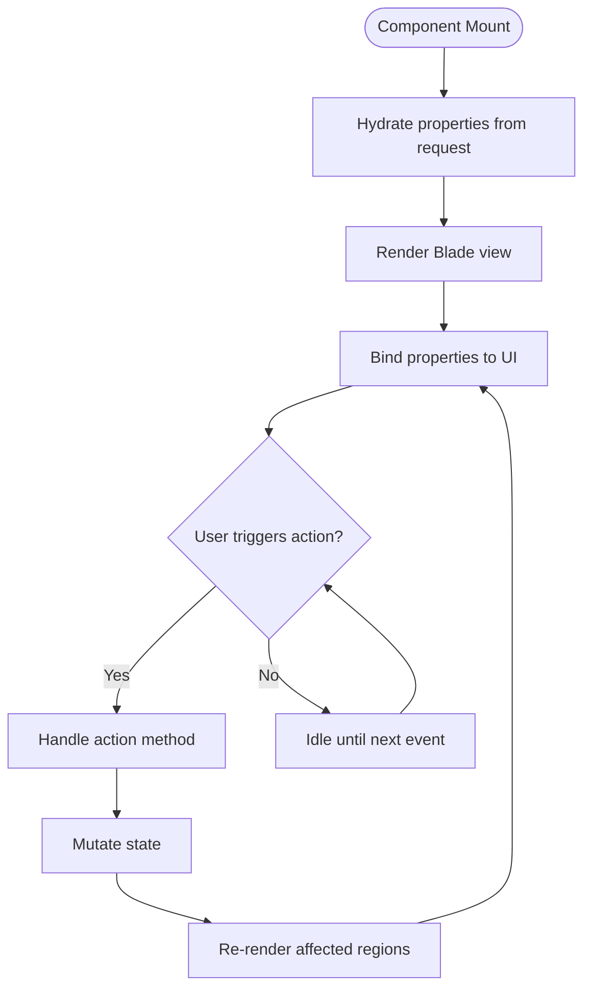
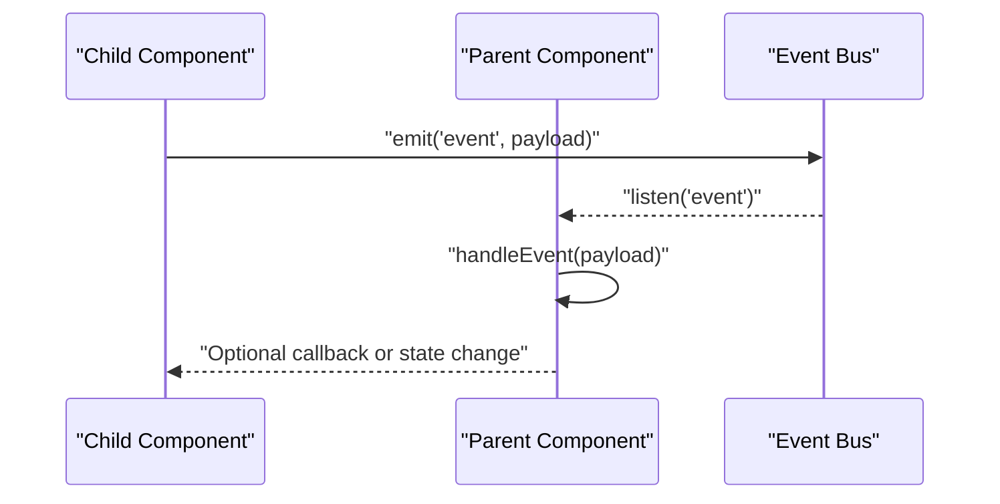
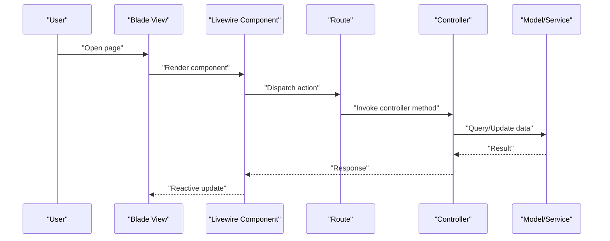
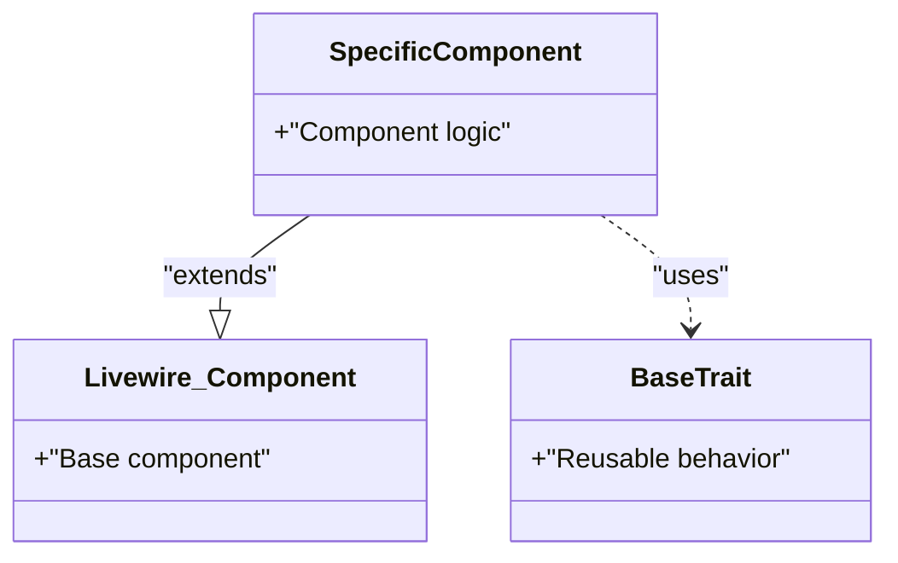
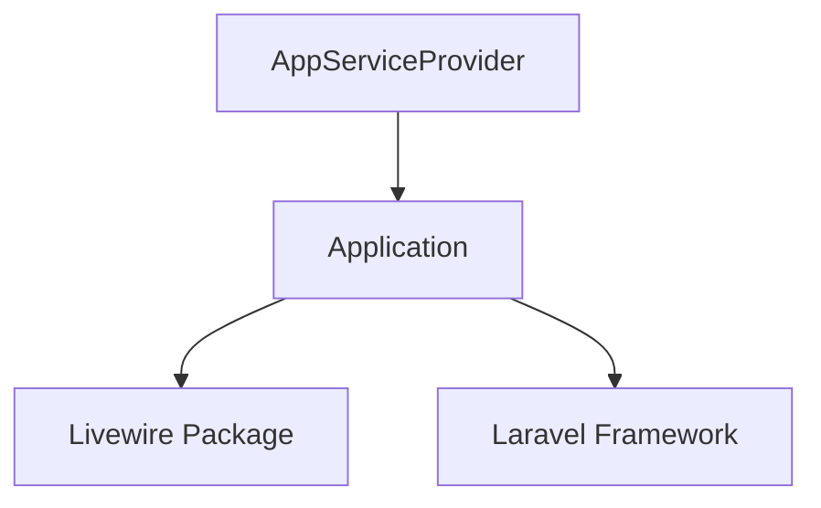

# Component Architecture

<cite>
**Referenced Files in This Document**
- [Dashboard.php](file://pdf-korektura/app/Livewire/Dashboard.php)
- [PdfDetail.php](file://pdf-korektura/app/Livewire/PdfDetail.php)
- [PdfPool.php](file://pdf-korektura/app/Livewire/PdfPool.php)
- [PdfUpload.php](file://pdf-korektura/app/Livewire/PdfUpload.php)
- [MyAssignments.php](file://pdf-korektura/app/Livewire/MyAssignments.php)
- [Archive.php](file://pdf-korektura/app/Livewire/Admin/Archive.php)
- [AuditLog.php](file://pdf-korektura/app/Livewire/Admin/AuditLog.php)
- [TitleManagement.php](file://pdf-korektura/app/Livewire/Admin/TitleManagement.php)
- [UserManagement.php](file://pdf-korektura/app/Livewire/Admin/UserManagement.php)
- [dashboard.blade.php](file://pdf-korektura/resources/views/livewire/dashboard.blade.php)
- [pdf-detail.blade.php](file://pdf-korektura/resources/views/livewire/pdf-detail.blade.php)
- [pdf-pool.blade.php](file://pdf-korektura/resources/views/livewire/pdf-pool.blade.php)
- [pdf-upload.blade.php](file://pdf-korektura/resources/views/livewire/pdf-upload.blade.php)
- [my-assignments.blade.php](file://pdf-korektura/resources/views/livewire/my-assignments.blade.php)
- [admin/archive.blade.php](file://pdf-korektura/resources/views/livewire/admin/archive.blade.php)
- [admin/audit-log.blade.php](file://pdf-korektura/resources/views/livewire/admin/audit-log.blade.php)
- [admin/title-management.blade.php](file://pdf-korektura/resources/views/livewire/admin/title-management.blade.php)
- [admin/user-management.blade.php](file://pdf-korektura/resources/views/livewire/admin/user-management.blade.php)
- [AdminController.php](file://pdf-korektura/app/Livewire/AdminController.php)
- [PdfDocumentController.php](file://pdf-korektura/app/Livewire/PdfDocumentController.php)
- [web.php](file://pdf-korektura/routes/web.php)
- [AppServiceProvider.php](file://pdf-korektura/app/Providers/AppServiceProvider.php)
- [composer.json](file://pdf-korektura/composer.json)
</cite>

## Table of Contents
1. [Introduction](#introduction)
2. [Project Structure](#project-structure)
3. [Core Components](#core-components)
4. [Architecture Overview](#architecture-overview)
5. [Detailed Component Analysis](#detailed-component-analysis)
6. [Dependency Analysis](#dependency-analysis)
7. [Performance Considerations](#performance-considerations)
8. [Troubleshooting Guide](#troubleshooting-guide)
9. [Conclusion](#conclusion)
10. [Appendices](#appendices)

## Introduction
This document explains the Livewire component architecture and design patterns used in the project. It covers component lifecycle, state management, reactive updates, composition patterns, data binding, event handling, and the relationship between Livewire components and Laravel controllers. It also documents initialization, rendering, and cleanup processes, component communication, data flow between parent and child components, best practices for organization and folder structure, performance optimization, memory management, and examples of component inheritance and traits.

## Project Structure
Livewire components are organized under the application namespace with dedicated folders for feature areas. Blade views mirror component functionality and are grouped under resources/views/livewire and resources/views/livewire/admin. Controllers bridge Livewire components to server-side logic and routing.



**Diagram sources**
- [Dashboard.php](file://pdf-korektura/app/Livewire/Dashboard.php)
- [MyAssignments.php](file://pdf-korektura/app/Livewire/MyAssignments.php)
- [PdfDetail.php](file://pdf-korektura/app/Livewire/PdfDetail.php)
- [PdfPool.php](file://pdf-korektura/app/Livewire/PdfPool.php)
- [PdfUpload.php](file://pdf-korektura/app/Livewire/PdfUpload.php)
- [Archive.php](file://pdf-korektura/app/Livewire/Admin/Archive.php)
- [AuditLog.php](file://pdf-korektura/app/Livewire/Admin/AuditLog.php)
- [TitleManagement.php](file://pdf-korektura/app/Livewire/Admin/TitleManagement.php)
- [UserManagement.php](file://pdf-korektura/app/Livewire/Admin/UserManagement.php)
- [dashboard.blade.php](file://pdf-korektura/resources/views/livewire/dashboard.blade.php)
- [my-assignments.blade.php](file://pdf-korektura/resources/views/livewire/my-assignments.blade.php)
- [pdf-detail.blade.php](file://pdf-korektura/resources/views/livewire/pdf-detail.blade.php)
- [pdf-pool.blade.php](file://pdf-korektura/resources/views/livewire/pdf-pool.blade.php)
- [pdf-upload.blade.php](file://pdf-korektura/resources/views/livewire/pdf-upload.blade.php)
- [admin/archive.blade.php](file://pdf-korektura/resources/views/livewire/admin/archive.blade.php)
- [admin/audit-log.blade.php](file://pdf-korektura/resources/views/livewire/admin/audit-log.blade.php)
- [admin/title-management.blade.php](file://pdf-korektura/resources/views/livewire/admin/title-management.blade.php)
- [admin/user-management.blade.php](file://pdf-korektura/resources/views/livewire/admin/user-management.blade.php)
- [AdminController.php](file://pdf-korektura/app/Livewire/AdminController.php)
- [PdfDocumentController.php](file://pdf-korektura/app/Livewire/PdfDocumentController.php)

**Section sources**
- [Dashboard.php](file://pdf-korektura/app/Livewire/Dashboard.php)
- [PdfDetail.php](file://pdf-korektura/app/Livewire/PdfDetail.php)
- [PdfPool.php](file://pdf-korektura/app/Livewire/PdfPool.php)
- [PdfUpload.php](file://pdf-korektura/app/Livewire/PdfUpload.php)
- [MyAssignments.php](file://pdf-korektura/app/Livewire/MyAssignments.php)
- [Archive.php](file://pdf-korektura/app/Livewire/Admin/Archive.php)
- [AuditLog.php](file://pdf-korektura/app/Livewire/Admin/AuditLog.php)
- [TitleManagement.php](file://pdf-korektura/app/Livewire/Admin/TitleManagement.php)
- [UserManagement.php](file://pdf-korektura/app/Livewire/Admin/UserManagement.php)
- [dashboard.blade.php](file://pdf-korektura/resources/views/livewire/dashboard.blade.php)
- [pdf-detail.blade.php](file://pdf-korektura/resources/views/livewire/pdf-detail.blade.php)
- [pdf-pool.blade.php](file://pdf-korektura/resources/views/livewire/pdf-pool.blade.php)
- [pdf-upload.blade.php](file://pdf-korektura/resources/views/livewire/pdf-upload.blade.php)
- [my-assignments.blade.php](file://pdf-korektura/resources/views/livewire/my-assignments.blade.php)
- [admin/archive.blade.php](file://pdf-korektura/resources/views/livewire/admin/archive.blade.php)
- [admin/audit-log.blade.php](file://pdf-korektura/resources/views/livewire/admin/audit-log.blade.php)
- [admin/title-management.blade.php](file://pdf-korektura/resources/views/livewire/admin/title-management.blade.php)
- [admin/user-management.blade.php](file://pdf-korektura/resources/views/livewire/admin/user-management.blade.php)
- [web.php](file://pdf-korektura/routes/web.php)

## Core Components
Livewire components encapsulate interactive UI logic and state. They are PHP classes extending the base Livewire component and render via Blade templates. Typical responsibilities include:
- Managing reactive state and computed properties
- Handling user events and actions
- Interacting with models and services
- Emitting and listening to events for inter-component communication
- Integrating with Laravel controllers for server-side operations

Representative components:
- Dashboard: Orchestrates overview metrics and summaries
- PdfDetail: Displays PDF metadata and related actions
- PdfPool: Manages collections of PDF items
- PdfUpload: Handles file uploads and progress feedback
- MyAssignments: Lists user-specific tasks
- Admin components: Archive, AuditLog, TitleManagement, UserManagement

Each component pairs with a Blade view that defines the presentation layer and binds to component properties.

**Section sources**
- [Dashboard.php](file://pdf-korektura/app/Livewire/Dashboard.php)
- [PdfDetail.php](file://pdf-korektura/app/Livewire/PdfDetail.php)
- [PdfPool.php](file://pdf-korektura/app/Livewire/PdfPool.php)
- [PdfUpload.php](file://pdf-korektura/app/Livewire/PdfUpload.php)
- [MyAssignments.php](file://pdf-korektura/app/Livewire/MyAssignments.php)
- [Archive.php](file://pdf-korektura/app/Livewire/Admin/Archive.php)
- [AuditLog.php](file://pdf-korektura/app/Livewire/Admin/AuditLog.php)
- [TitleManagement.php](file://pdf-korektura/app/Livewire/Admin/TitleManagement.php)
- [UserManagement.php](file://pdf-korektura/app/Livewire/Admin/UserManagement.php)

## Architecture Overview
Livewire components integrate with Laravel through routing and controllers. Components are invoked via Blade directives and route handlers, which delegate to controllers for data retrieval and persistence. The controller layer interacts with models and services, returning data to components for reactive updates.



**Diagram sources**
- [web.php](file://pdf-korektura/routes/web.php)
- [dashboard.blade.php](file://pdf-korektura/resources/views/livewire/dashboard.blade.php)
- [Dashboard.php](file://pdf-korektura/app/Livewire/Dashboard.php)
- [PdfDocumentController.php](file://pdf-korektura/app/Livewire/PdfDocumentController.php)
- [PdfDetail.php](file://pdf-korektura/app/Livewire/PdfDetail.php)
- [PdfPool.php](file://pdf-korektura/app/Livewire/PdfPool.php)
- [PdfUpload.php](file://pdf-korektura/app/Livewire/PdfUpload.php)
- [MyAssignments.php](file://pdf-korektura/app/Livewire/MyAssignments.php)
- [Archive.php](file://pdf-korektura/app/Livewire/Admin/Archive.php)
- [AuditLog.php](file://pdf-korektura/app/Livewire/Admin/AuditLog.php)
- [TitleManagement.php](file://pdf-korektura/app/Livewire/Admin/TitleManagement.php)
- [UserManagement.php](file://pdf-korektura/app/Livewire/Admin/UserManagement.php)

## Detailed Component Analysis

### Component Lifecycle and Reactive Updates
Livewire components follow a predictable lifecycle:
- Initialization: Properties are hydrated from the request state
- Rendering: Blade view renders based on current component state
- Reactive updates: Changes trigger targeted DOM updates without full page reloads
- Cleanup: Component state is released after navigation or destruction



**Diagram sources**
- [web.php](file://pdf-korektura/routes/web.php)
- [dashboard.blade.php](file://pdf-korektura/resources/views/livewire/dashboard.blade.php)
- [Dashboard.php](file://pdf-korektura/app/Livewire/Dashboard.php)

**Section sources**
- [Dashboard.php](file://pdf-korektura/app/Livewire/Dashboard.php)
- [dashboard.blade.php](file://pdf-korektura/resources/views/livewire/dashboard.blade.php)

### State Management and Data Binding
Components manage state declaratively:
- Public properties become reactive and serializable
- Methods handle actions and mutations
- Blade directives bind component properties to UI elements
- Events propagate changes across components



**Diagram sources**
- [PdfDetail.php](file://pdf-korektura/app/Livewire/PdfDetail.php)
- [pdf-detail.blade.php](file://pdf-korektura/resources/views/livewire/pdf-detail.blade.php)

**Section sources**
- [PdfDetail.php](file://pdf-korektura/app/Livewire/PdfDetail.php)
- [pdf-detail.blade.php](file://pdf-korektura/resources/views/livewire/pdf-detail.blade.php)

### Event Handling and Component Communication
Components emit and listen to events for decoupled communication:
- Emitting events from child components
- Listening for events in parent components
- Using event parameters to pass data



**Diagram sources**
- [PdfPool.php](file://pdf-korektura/app/Livewire/PdfPool.php)
- [PdfUpload.php](file://pdf-korektura/app/Livewire/PdfUpload.php)

**Section sources**
- [PdfPool.php](file://pdf-korektura/app/Livewire/PdfPool.php)
- [PdfUpload.php](file://pdf-korektura/app/Livewire/PdfUpload.php)

### Composition Patterns and Parent-Child Data Flow
Parent components orchestrate child components and pass data via attributes. Children react to prop changes and emit upstream events.

```mermaid
graph TB
P["Parent Component"]
C1["Child Component A"]
C2["Child Component B"]
P --> |"Pass props"| C1
P --> |"Pass props"| C2
C1 --|"Emit event"| P
C2 --|"Emit event"| P
```

**Diagram sources**
- [Dashboard.php](file://pdf-korektura/app/Livewire/Dashboard.php)
- [MyAssignments.php](file://pdf-korektura/app/Livewire/MyAssignments.php)

**Section sources**
- [Dashboard.php](file://pdf-korektura/app/Livewire/Dashboard.php)
- [MyAssignments.php](file://pdf-korektura/app/Livewire/MyAssignments.php)

### Relationship Between Livewire Components and Laravel Controllers
Controllers mediate between Livewire components and backend services:
- Route handlers render Blade pages containing Livewire components
- Controllers fetch data and coordinate model interactions
- Components call controller endpoints for server actions
- Responses update component state reactively



**Diagram sources**
- [web.php](file://pdf-korektura/routes/web.php)
- [PdfDocumentController.php](file://pdf-korektura/app/Livewire/PdfDocumentController.php)
- [PdfDetail.php](file://pdf-korektura/app/Livewire/PdfDetail.php)
- [PdfPool.php](file://pdf-korektura/app/Livewire/PdfPool.php)
- [PdfUpload.php](file://pdf-korektura/app/Livewire/PdfUpload.php)

**Section sources**
- [web.php](file://pdf-korektura/routes/web.php)
- [PdfDocumentController.php](file://pdf-korektura/app/Livewire/PdfDocumentController.php)

### Component Inheritance and Traits
Livewire supports inheritance and traits to share behavior:
- Base component class extends the framework base
- Traits encapsulate reusable logic (e.g., validation, permissions)
- Child components inherit shared properties and methods



[No sources needed since this diagram shows conceptual workflow, not actual code structure]

### Best Practices for Organization and Folder Structure
- Group related components under feature-based folders (e.g., Admin/)
- Mirror Blade views under resources/views/livewire with descriptive names
- Keep components focused and single-responsibility
- Use consistent naming for events and property names
- Centralize shared logic in traits or base classes

[No sources needed since this section provides general guidance]

## Dependency Analysis
The project relies on Livewire and Laravel. Composer manages package dependencies, while service providers register framework integrations.



**Diagram sources**
- [composer.json](file://pdf-korektura/composer.json)
- [AppServiceProvider.php](file://pdf-korektura/app/Providers/AppServiceProvider.php)

**Section sources**
- [composer.json](file://pdf-korektura/composer.json)
- [AppServiceProvider.php](file://pdf-korektura/app/Providers/AppServiceProvider.php)

## Performance Considerations
- Minimize reactive state: Only expose necessary properties to the frontend
- Use debounced updates for rapid input changes
- Paginate and lazy-load heavy datasets
- Avoid unnecessary re-renders by structuring state efficiently
- Leverage component events to reduce tight coupling
- Optimize Blade rendering and avoid expensive computations in templates

[No sources needed since this section provides general guidance]

## Troubleshooting Guide
Common issues and remedies:
- Component not updating: Verify reactive properties and event emissions
- State hydration errors: Ensure properties are serializable and initialized
- Route conflicts: Confirm route bindings align with component expectations
- Permission failures: Validate middleware and controller guards
- Upload issues: Check file size limits and temporary storage permissions

[No sources needed since this section provides general guidance]

## Conclusion
Livewire components in this project follow a clean separation of concerns: Blade views define presentation, Livewire components manage state and interactions, and controllers handle server-side logic. By leveraging events, traits, and feature-based organization, the system remains maintainable and scalable. Applying performance best practices ensures responsive user experiences.

## Appendices
- Component-to-view mapping:
  - Dashboard ↔ dashboard.blade.php
  - MyAssignments ↔ my-assignments.blade.php
  - PdfDetail ↔ pdf-detail.blade.php
  - PdfPool ↔ pdf-pool.blade.php
  - PdfUpload ↔ pdf-upload.blade.php
  - Admin components ↔ admin/*.blade.php

[No sources needed since this section provides general guidance]