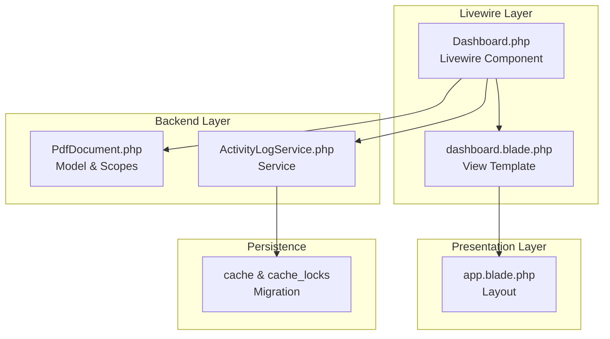
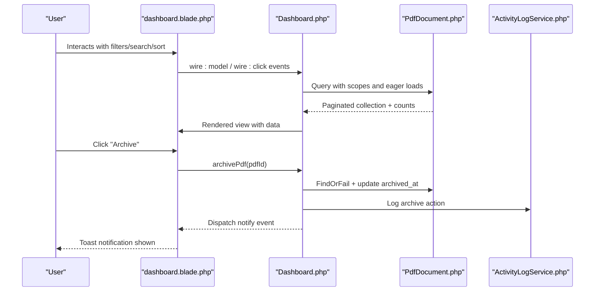
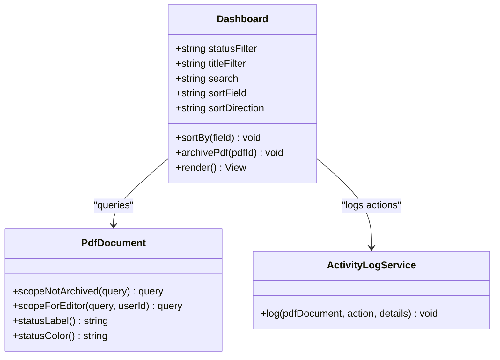
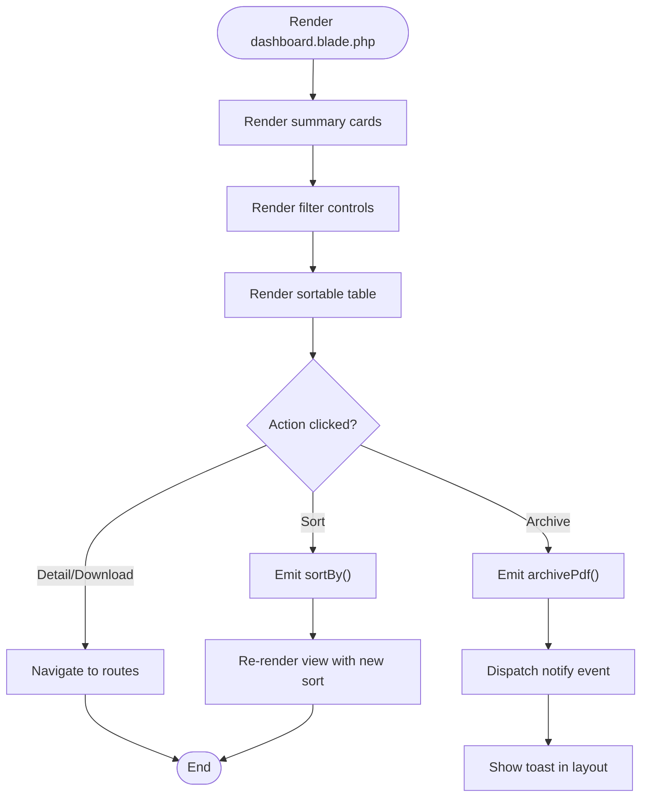
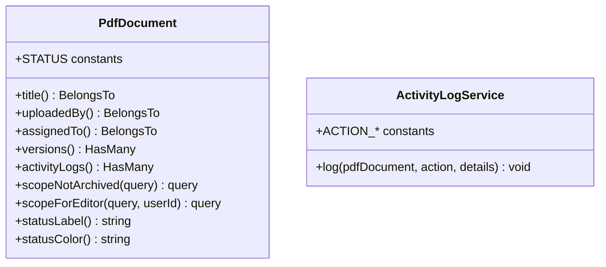

# Dashboard Components

<cite>
**Referenced Files in This Document**
- [Dashboard.php](file://app/Livewire/Dashboard.php)
- [dashboard.blade.php](file://resources/views/livewire/dashboard.blade.php)
- [PdfDocument.php](file://app/Models/PdfDocument.php)
- [ActivityLogService.php](file://app/Services/ActivityLogService.php)
- [app.blade.php](file://resources/views/layouts/app.blade.php)
- [0001_01_01_000001_create_cache_table.php](file://database/migrations/0001_01_01_000001_create_cache_table.php)
</cite>

## Table of Contents
1. [Introduction](#introduction)
2. [Project Structure](#project-structure)
3. [Core Components](#core-components)
4. [Architecture Overview](#architecture-overview)
5. [Detailed Component Analysis](#detailed-component-analysis)
6. [Dependency Analysis](#dependency-analysis)
7. [Performance Considerations](#performance-considerations)
8. [Troubleshooting Guide](#troubleshooting-guide)
9. [Conclusion](#conclusion)

## Introduction
This document explains the Dashboard component and related dashboard functionality in the application. It covers the main dashboard layout, widget organization, and data visualization components. It also documents the dashboard’s role in displaying system overview, user statistics, and workflow status, along with state management for dynamic content updates, integration with backend services for real-time-like updates, customization options for widgets and layout, examples for adding new widgets, and performance optimization strategies.

## Project Structure
The dashboard is implemented as a Livewire component with a Blade view and integrates with Laravel models and services. The layout is provided by a shared Blade layout that injects Livewire assets and provides navigation and notifications.

**Diagram sources**
- [Dashboard.php:12-91](file://app/Livewire/Dashboard.php#L12-L91)
- [dashboard.blade.php:1-101](file://resources/views/livewire/dashboard.blade.php#L1-L101)
- [PdfDocument.php:10-129](file://app/Models/PdfDocument.php#L10-L129)
- [ActivityLogService.php:10-30](file://app/Services/ActivityLogService.php#L10-L30)
- [app.blade.php:10-74](file://resources/views/layouts/app.blade.php#L10-L74)
- [0001_01_01_000001_create_cache_table.php:9-28](file://database/migrations/0001_01_01_000001_create_cache_table.php#L9-L28)

**Section sources**
- [Dashboard.php:12-91](file://app/Livewire/Dashboard.php#L12-L91)
- [dashboard.blade.php:1-101](file://resources/views/livewire/dashboard.blade.php#L1-L101)
- [app.blade.php:10-74](file://resources/views/layouts/app.blade.php#L10-L74)

## Core Components
- Dashboard Livewire component: orchestrates filters, sorting, pagination, and stats computation. It renders a Blade view and emits notifications via the layout’s Alpine-driven notification system.
- Dashboard Blade view: defines the grid of summary cards, filter controls, sortable table, and pagination controls.
- PdfDocument model: provides scopes for filtering and ordering, and exposes helpers for status labels and colors.
- ActivityLogService: records actions like archiving with user identity and IP.
- Layout: provides navigation, asset injection, and a global notification toast powered by Alpine.js.

Key responsibilities:
- State management: component properties for filters, search, sort field/direction, and pagination.
- Data retrieval: Eloquent queries with scopes and eager loading.
- UI rendering: Blade templates with Tailwind CSS classes and Livewire directives.
- Notifications: Alpine-driven toast messages dispatched from the component.

**Section sources**
- [Dashboard.php:16-32](file://app/Livewire/Dashboard.php#L16-L32)
- [Dashboard.php:48-90](file://app/Livewire/Dashboard.php#L48-L90)
- [dashboard.blade.php:4-21](file://resources/views/livewire/dashboard.blade.php#L4-L21)
- [dashboard.blade.php:23-99](file://resources/views/livewire/dashboard.blade.php#L23-L99)
- [PdfDocument.php:72-96](file://app/Models/PdfDocument.php#L72-L96)
- [PdfDocument.php:108-128](file://app/Models/PdfDocument.php#L108-L128)
- [ActivityLogService.php:20-29](file://app/Services/ActivityLogService.php#L20-L29)
- [app.blade.php:61-70](file://resources/views/layouts/app.blade.php#L61-L70)

## Architecture Overview
The dashboard follows a reactive, server-side rendered pattern with Livewire:
- The component computes stats and paginated lists based on filters and roles.
- The view binds to component state using Livewire directives for live updates.
- Backend services record actions for auditability.
- The layout provides a unified shell with navigation and notifications.

**Diagram sources**
- [dashboard.blade.php:25-40](file://resources/views/livewire/dashboard.blade.php#L25-L40)
- [dashboard.blade.php:79-84](file://resources/views/livewire/dashboard.blade.php#L79-L84)
- [Dashboard.php:24-46](file://app/Livewire/Dashboard.php#L24-L46)
- [Dashboard.php:48-90](file://app/Livewire/Dashboard.php#L48-L90)
- [PdfDocument.php:72-96](file://app/Models/PdfDocument.php#L72-L96)
- [ActivityLogService.php:20-29](file://app/Services/ActivityLogService.php#L20-L29)
- [app.blade.php:61-70](file://resources/views/layouts/app.blade.php#L61-L70)

## Detailed Component Analysis

### Dashboard Component (Livewire)
Responsibilities:
- Manage filters: status, title, and free-text search.
- Manage sorting: click column headers to toggle ascending/descending order.
- Paginate results for performance.
- Compute summary statistics per user role.
- Enforce permissions for archival actions.
- Emit notifications for user feedback.

Implementation highlights:
- Properties for filters and sort direction are synchronized to the URL via query string synchronization.
- Sorting toggles direction on repeated clicks on the same field.
- Stats computed with role-aware scoping and status-based counts.
- Archive action validates ownership/admin rights and logs the action.

**Diagram sources**
- [Dashboard.php:16-32](file://app/Livewire/Dashboard.php#L16-L32)
- [Dashboard.php:48-90](file://app/Livewire/Dashboard.php#L48-L90)
- [PdfDocument.php:72-96](file://app/Models/PdfDocument.php#L72-L96)
- [PdfDocument.php:108-128](file://app/Models/PdfDocument.php#L108-L128)
- [ActivityLogService.php:20-29](file://app/Services/ActivityLogService.php#L20-L29)

**Section sources**
- [Dashboard.php:16-32](file://app/Livewire/Dashboard.php#L16-L32)
- [Dashboard.php:24-46](file://app/Livewire/Dashboard.php#L24-L46)
- [Dashboard.php:48-90](file://app/Livewire/Dashboard.php#L48-L90)

### Dashboard View (Blade)
Structure and widgets:
- Summary cards grid: Total, Uploaded, In Progress, Completed counts.
- Filter bar: Search box, status dropdown, title dropdown.
- Sortable table: Name, Title, Pages, Deadline, Status, Assignee, Actions.
- Pagination controls at the bottom.

Behavior:
- Live updates via wire:model.live with debouncing for search.
- Column headers trigger sortBy on the component.
- Archive button conditionally enabled for completed items.
- Links to detail and download routes.

**Diagram sources**
- [dashboard.blade.php:4-21](file://resources/views/livewire/dashboard.blade.php#L4-L21)
- [dashboard.blade.php:23-99](file://resources/views/livewire/dashboard.blade.php#L23-L99)
- [app.blade.php:61-70](file://resources/views/layouts/app.blade.php#L61-L70)

**Section sources**
- [dashboard.blade.php:4-21](file://resources/views/livewire/dashboard.blade.php#L4-L21)
- [dashboard.blade.php:23-99](file://resources/views/livewire/dashboard.blade.php#L23-L99)

### Models and Services
- PdfDocument model:
  - Provides scopes for role-based visibility and archival status.
  - Exposes helpers for human-readable status labels and color categories.
- ActivityLogService:
  - Centralized logging of actions with user identity and IP address.

**Diagram sources**
- [PdfDocument.php:14-39](file://app/Models/PdfDocument.php#L14-L39)
- [PdfDocument.php:41-70](file://app/Models/PdfDocument.php#L41-L70)
- [PdfDocument.php:72-96](file://app/Models/PdfDocument.php#L72-L96)
- [PdfDocument.php:108-128](file://app/Models/PdfDocument.php#L108-L128)
- [ActivityLogService.php:12-29](file://app/Services/ActivityLogService.php#L12-L29)

**Section sources**
- [PdfDocument.php:14-39](file://app/Models/PdfDocument.php#L14-L39)
- [PdfDocument.php:72-96](file://app/Models/PdfDocument.php#L72-L96)
- [PdfDocument.php:108-128](file://app/Models/PdfDocument.php#L108-L128)
- [ActivityLogService.php:12-29](file://app/Services/ActivityLogService.php#L12-L29)

### Layout Integration
- The layout injects Livewire styles/scripts and provides a global notification toast powered by Alpine.js.
- Navigation adapts to user roles and routes to relevant sections.

**Section sources**
- [app.blade.php:8-9](file://resources/views/layouts/app.blade.php#L8-L9)
- [app.blade.php:72-73](file://resources/views/layouts/app.blade.php#L72-L73)
- [app.blade.php:61-70](file://resources/views/layouts/app.blade.php#L61-L70)

## Dependency Analysis
- Component-to-view coupling: tight and intentional; the component passes data to the view and reacts to user interactions.
- Component-to-model coupling: uses Eloquent with scopes and eager loading to minimize N+1 queries.
- Component-to-service coupling: logs actions after state changes.
- View-to-layout coupling: relies on layout assets and notification mechanism.

Potential circular dependencies: none observed; the component depends on models/services but not vice versa.

External dependencies:
- Livewire for reactivity and server-side rendering.
- Tailwind CSS for styling.
- Alpine.js for client-side notifications.

**Section sources**
- [Dashboard.php:48-90](file://app/Livewire/Dashboard.php#L48-L90)
- [dashboard.blade.php:23-99](file://resources/views/livewire/dashboard.blade.php#L23-L99)
- [app.blade.php:8-9](file://resources/views/layouts/app.blade.php#L8-L9)
- [app.blade.php:72-73](file://resources/views/layouts/app.blade.php#L72-L73)

## Performance Considerations
Observed optimizations and recommendations:
- Pagination: The component paginates results to limit payload size and improve responsiveness.
- Debounced search: The search input uses a debounce to reduce frequent re-renders while typing.
- Eager loading: The component eager-loads related data to avoid N+1 queries.
- Scopes: Model scopes encapsulate common filters, keeping queries concise.
- Caching: The application includes a cache table migration, suitable for storing computed stats or frequently accessed aggregates to reduce database load.

Recommendations:
- Cache computed stats: Store totals and status counts per user in the cache keyed by user ID to avoid repeated counting queries.
- Cursor-based pagination: For very large datasets, consider cursor-based pagination to reduce offset overhead.
- Selectivity: Narrow selected columns in queries when possible to reduce memory usage.
- CDN/static assets: Serve Tailwind and Livewire assets via CDN to reduce latency.

**Section sources**
- [Dashboard.php:75](file://app/Livewire/Dashboard.php#L75)
- [dashboard.blade.php:25](file://resources/views/livewire/dashboard.blade.php#L25)
- [Dashboard.php:51-52](file://app/Livewire/Dashboard.php#L51-L52)
- [PdfDocument.php:72-96](file://app/Models/PdfDocument.php#L72-L96)
- [0001_01_01_000001_create_cache_table.php:9-28](file://database/migrations/0001_01_01_000001_create_cache_table.php#L9-L28)

## Troubleshooting Guide
Common issues and resolutions:
- Permission errors when archiving: The component checks ownership or admin rights and dispatches an error notification. Verify user roles and ownership logic.
- Empty table state: The view displays a message when no items are found; confirm filters and scopes.
- Notification not showing: Ensure the layout includes the Alpine notification container and Livewire scripts.
- Slow search: Confirm debounce is applied and consider indexing searchable columns.

**Section sources**
- [Dashboard.php:34-46](file://app/Livewire/Dashboard.php#L34-L46)
- [dashboard.blade.php:87-91](file://resources/views/livewire/dashboard.blade.php#L87-L91)
- [app.blade.php:61-70](file://resources/views/layouts/app.blade.php#L61-L70)

## Conclusion
The Dashboard component provides a responsive, role-aware overview of PDF workflow status with live filtering, sorting, and pagination. Its design leverages Livewire for interactivity, Eloquent scopes for clean queries, and a centralized service for audit logging. The Blade view organizes information into digestible widgets and actionable controls. With caching and pagination strategies, the dashboard remains performant at scale. Extensibility is straightforward: add new widgets by introducing new stats and UI sections, and extend functionality by adding new filters and actions while preserving the existing patterns.