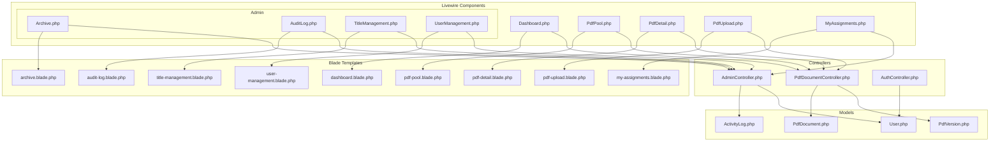
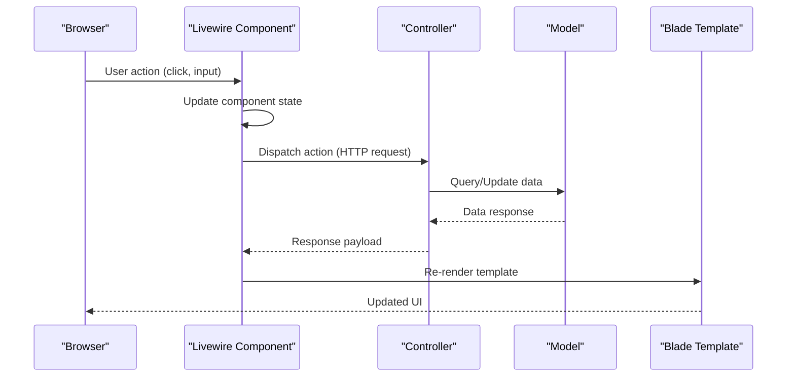
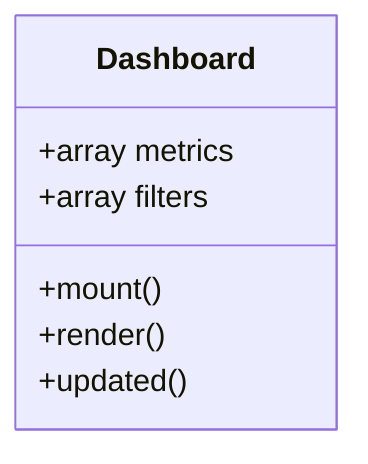
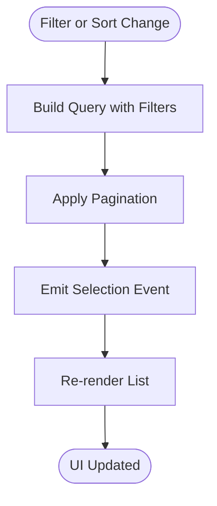
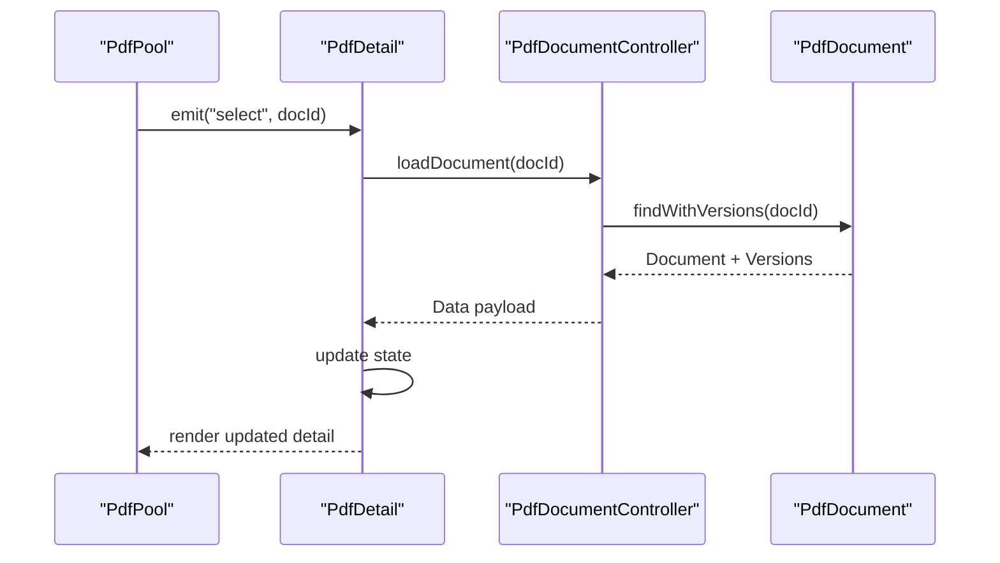
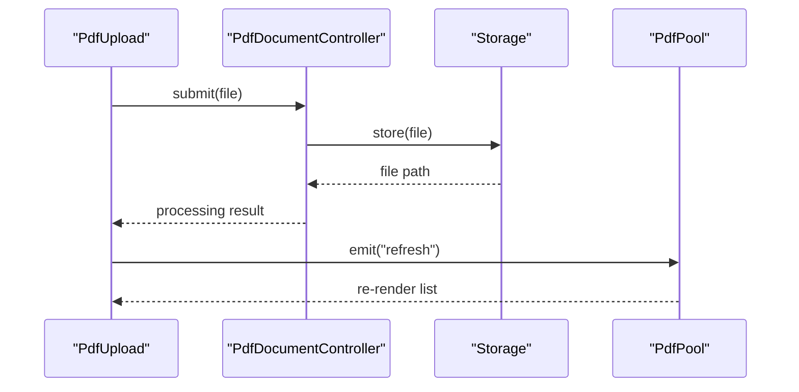
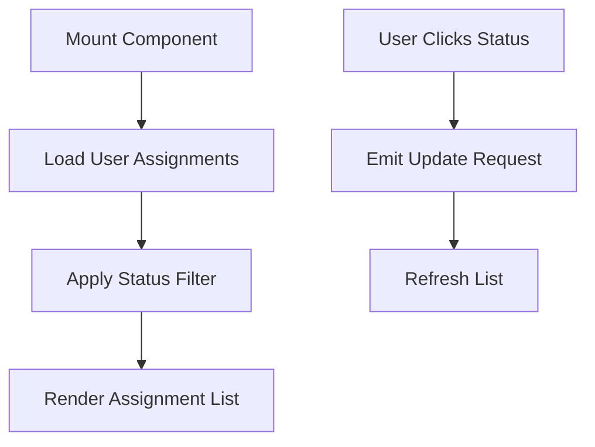
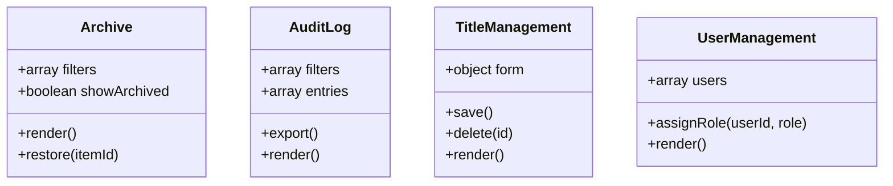
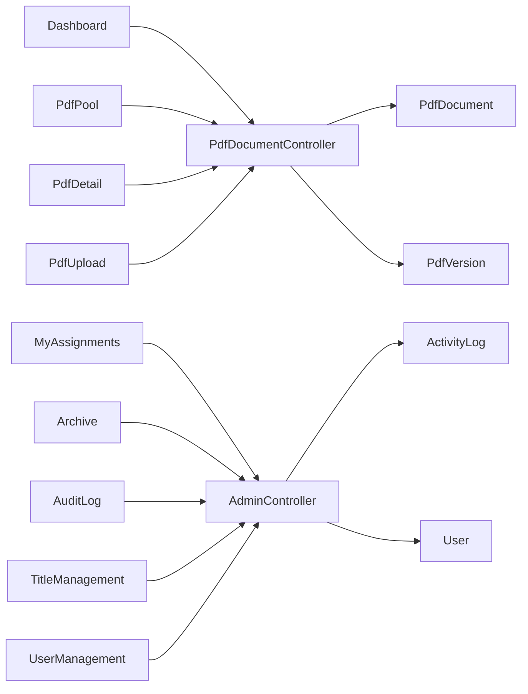

# Livewire Components

<cite>
**Referenced Files in This Document**
- [Dashboard.php](file://pdf-korektura/app/Livewire/Dashboard.php)
- [PdfPool.php](file://pdf-korektura/app/Livewire/PdfPool.php)
- [PdfDetail.php](file://pdf-korektura/app/Livewire/PdfDetail.php)
- [PdfUpload.php](file://pdf-korektura/app/Livewire/PdfUpload.php)
- [MyAssignments.php](file://pdf-korektura/app/Livewire/MyAssignments.php)
- [Archive.php](file://pdf-korektura/app/Livewire/Admin/Archive.php)
- [AuditLog.php](file://pdf-korektura/app/Livewire/Admin/AuditLog.php)
- [TitleManagement.php](file://pdf-korektura/app/Livewire/Admin/TitleManagement.php)
- [UserManagement.php](file://pdf-korektura/app/Livewire/Admin/UserManagement.php)
- [PdfDocumentController.php](file://pdf-korektura/app/Http/Controllers/PdfDocumentController.php)
- [AdminController.php](file://pdf-korektura/app/Http/Controllers/AdminController.php)
- [AuthController.php](file://pdf-korektura/app/Http/Controllers/AuthController.php)
- [PdfDocument.php](file://pdf-korektura/app/Models/PdfDocument.php)
- [PdfVersion.php](file://pdf-korektura/app/Models/PdfVersion.php)
- [User.php](file://pdf-korektura/app/Models/User.php)
- [ActivityLog.php](file://pdf-korektura/app/Models/ActivityLog.php)
- [livewire.php](file://pdf-korektura/vendor/livewire/livewire/config/livewire.php)
- [login.blade.php](file://pdf-korektura/resources/views/auth/login.blade.php)
- [app.blade.php](file://pdf-korektura/resources/views/layouts/app.blade.php)
- [dashboard.blade.php](file://pdf-korektura/resources/views/livewire/dashboard.blade.php)
- [pdf-pool.blade.php](file://pdf-korektura/resources/views/livewire/pdf-pool.blade.php)
- [pdf-detail.blade.php](file://pdf-korektura/resources/views/livewire/pdf-detail.blade.php)
- [pdf-upload.blade.php](file://pdf-korektura/resources/views/livewire/pdf-upload.blade.php)
- [my-assignments.blade.php](file://pdf-korektura/resources/views/livewire/my-assignments.blade.php)
- [archive.blade.php](file://pdf-korektura/resources/views/livewire/admin/archive.blade.php)
- [audit-log.blade.php](file://pdf-korektura/resources/views/livewire/admin/audit-log.blade.php)
- [title-management.blade.php](file://pdf-korektura/resources/views/livewire/admin/title-management.blade.php)
- [user-management.blade.php](file://pdf-korektura/resources/views/livewire/admin/user-management.blade.php)
</cite>

## Table of Contents
1. [Introduction](#introduction)
2. [Project Structure](#project-structure)
3. [Core Components](#core-components)
4. [Architecture Overview](#architecture-overview)
5. [Detailed Component Analysis](#detailed-component-analysis)
6. [Dependency Analysis](#dependency-analysis)
7. [Performance Considerations](#performance-considerations)
8. [Security and Validation](#security-and-validation)
9. [Testing Strategies](#testing-strategies)
10. [Debugging Techniques](#debugging-techniques)
11. [Styling and Customization](#styling-and-customization)
12. [Integration with Backend Services](#integration-with-backend-services)
13. [Conclusion](#conclusion)

## Introduction
This document provides comprehensive documentation for the Livewire components that power the reactive UI system in the PDF correction application. It explains component architecture, state management, event handling, lifecycle methods, composition patterns, data flow, reactive updates, customization, backend integration, testing, debugging, performance optimization, and security considerations. The focus is on practical understanding for both developers and stakeholders.

## Project Structure
The Livewire components are organized under the application's Livewire namespace, grouped by feature and administrative capabilities. Blade templates define the presentation layer for each component, while controllers and models handle backend logic and persistence.

**Diagram sources**
- [Dashboard.php](file://pdf-korektura/app/Livewire/Dashboard.php)
- [PdfPool.php](file://pdf-korektura/app/Livewire/PdfPool.php)
- [PdfDetail.php](file://pdf-korektura/app/Livewire/PdfDetail.php)
- [PdfUpload.php](file://pdf-korektura/app/Livewire/PdfUpload.php)
- [MyAssignments.php](file://pdf-korektura/app/Livewire/MyAssignments.php)
- [Archive.php](file://pdf-korektura/app/Livewire/Admin/Archive.php)
- [AuditLog.php](file://pdf-korektura/app/Livewire/Admin/AuditLog.php)
- [TitleManagement.php](file://pdf-korektura/app/Livewire/Admin/TitleManagement.php)
- [UserManagement.php](file://pdf-korektura/app/Livewire/Admin/UserManagement.php)
- [PdfDocumentController.php](file://pdf-korektura/app/Http/Controllers/PdfDocumentController.php)
- [AdminController.php](file://pdf-korektura/app/Http/Controllers/AdminController.php)
- [AuthController.php](file://pdf-korektura/app/Http/Controllers/AuthController.php)
- [PdfDocument.php](file://pdf-korektura/app/Models/PdfDocument.php)
- [PdfVersion.php](file://pdf-korektura/app/Models/PdfVersion.php)
- [User.php](file://pdf-korektura/app/Models/User.php)
- [ActivityLog.php](file://pdf-korektura/app/Models/ActivityLog.php)

**Section sources**
- [Dashboard.php](file://pdf-korektura/app/Livewire/Dashboard.php)
- [PdfPool.php](file://pdf-korektura/app/Livewire/PdfPool.php)
- [PdfDetail.php](file://pdf-korektura/app/Livewire/PdfDetail.php)
- [PdfUpload.php](file://pdf-korektura/app/Livewire/PdfUpload.php)
- [MyAssignments.php](file://pdf-korektura/app/Livewire/MyAssignments.php)
- [Archive.php](file://pdf-korektura/app/Livewire/Admin/Archive.php)
- [AuditLog.php](file://pdf-korektura/app/Livewire/Admin/AuditLog.php)
- [TitleManagement.php](file://pdf-korektura/app/Livewire/Admin/TitleManagement.php)
- [UserManagement.php](file://pdf-korektura/app/Livewire/Admin/UserManagement.php)

## Core Components
This section outlines the primary Livewire components and their responsibilities:

- Dashboard: Provides an overview of system metrics and quick actions.
- PdfPool: Manages a collection of PDF documents with filtering and pagination.
- PdfDetail: Displays detailed information for a selected PDF document.
- PdfUpload: Handles document upload and initial processing.
- MyAssignments: Shows user-specific assignment tasks.
- Admin components: Archive, AuditLog, TitleManagement, UserManagement for administrative functions.

Each component follows Livewire conventions for state, events, and lifecycle methods, and renders via dedicated Blade templates.

**Section sources**
- [Dashboard.php](file://pdf-korektura/app/Livewire/Dashboard.php)
- [PdfPool.php](file://pdf-korektura/app/Livewire/PdfPool.php)
- [PdfDetail.php](file://pdf-korektura/app/Livewire/PdfDetail.php)
- [PdfUpload.php](file://pdf-korektura/app/Livewire/PdfUpload.php)
- [MyAssignments.php](file://pdf-korektura/app/Livewire/MyAssignments.php)
- [Archive.php](file://pdf-korektura/app/Livewire/Admin/Archive.php)
- [AuditLog.php](file://pdf-korektura/app/Livewire/Admin/AuditLog.php)
- [TitleManagement.php](file://pdf-korektura/app/Livewire/Admin/TitleManagement.php)
- [UserManagement.php](file://pdf-korektura/app/Livewire/Admin/UserManagement.php)

## Architecture Overview
The Livewire architecture integrates frontend interactivity with Laravel backend services. Components render Blade templates, emit and listen to events, and interact with controllers and models to manage state and persistence.

**Diagram sources**
- [Dashboard.php](file://pdf-korektura/app/Livewire/Dashboard.php)
- [PdfPool.php](file://pdf-korektura/app/Livewire/PdfPool.php)
- [PdfDetail.php](file://pdf-korektura/app/Livewire/PdfDetail.php)
- [PdfUpload.php](file://pdf-korektura/app/Livewire/PdfUpload.php)
- [MyAssignments.php](file://pdf-korektura/app/Livewire/MyAssignments.php)
- [PdfDocumentController.php](file://pdf-korektura/app/Http/Controllers/PdfDocumentController.php)
- [PdfDocument.php](file://pdf-korektura/app/Models/PdfDocument.php)
- [dashboard.blade.php](file://pdf-korektura/resources/views/livewire/dashboard.blade.php)
- [pdf-pool.blade.php](file://pdf-korektura/resources/views/livewire/pdf-pool.blade.php)
- [pdf-detail.blade.php](file://pdf-korektura/resources/views/livewire/pdf-detail.blade.php)
- [pdf-upload.blade.php](file://pdf-korektura/resources/views/livewire/pdf-upload.blade.php)
- [my-assignments.blade.php](file://pdf-korektura/resources/views/livewire/my-assignments.blade.php)

## Detailed Component Analysis

### Dashboard Component
Purpose: Aggregates system overview data and provides navigation shortcuts.

Key aspects:
- State management: Holds computed metrics and filters.
- Lifecycle: Initializes data on mount and updates on reactive changes.
- Events: Emits navigation commands to child components.
- Rendering: Uses a dedicated Blade template for layout and widgets.

**Diagram sources**
- [Dashboard.php](file://pdf-korektura/app/Livewire/Dashboard.php)
- [dashboard.blade.php](file://pdf-korektura/resources/views/livewire/dashboard.blade.php)

**Section sources**
- [Dashboard.php](file://pdf-korektura/app/Livewire/Dashboard.php)
- [dashboard.blade.php](file://pdf-korektura/resources/views/livewire/dashboard.blade.php)

### PdfPool Component
Purpose: Lists PDF documents with search, sorting, and pagination.

Key aspects:
- State: Stores query filters, sort criteria, and page index.
- Computed data: Builds filtered and paginated dataset.
- Events: Notifies selection changes to detail view.
- Reactive updates: Triggers re-query on filter changes.

**Diagram sources**
- [PdfPool.php](file://pdf-korektura/app/Livewire/PdfPool.php)
- [pdf-pool.blade.php](file://pdf-korektura/resources/views/livewire/pdf-pool.blade.php)

**Section sources**
- [PdfPool.php](file://pdf-korektura/app/Livewire/PdfPool.php)
- [pdf-pool.blade.php](file://pdf-korektura/resources/views/livewire/pdf-pool.blade.php)

### PdfDetail Component
Purpose: Displays detailed metadata and versions of a selected PDF.

Key aspects:
- State: Holds selected document ID and related versions.
- Lifecycle: Loads data on selection change.
- Events: Receives selection from pool component.
- Rendering: Presents structured detail view with version history.

**Diagram sources**
- [PdfPool.php](file://pdf-korektura/app/Livewire/PdfPool.php)
- [PdfDetail.php](file://pdf-korektura/app/Livewire/PdfDetail.php)
- [PdfDocumentController.php](file://pdf-korektura/app/Http/Controllers/PdfDocumentController.php)
- [PdfDocument.php](file://pdf-korektura/app/Models/PdfDocument.php)
- [pdf-detail.blade.php](file://pdf-korektura/resources/views/livewire/pdf-detail.blade.php)

**Section sources**
- [PdfDetail.php](file://pdf-korektura/app/Livewire/PdfDetail.php)
- [pdf-detail.blade.php](file://pdf-korektura/resources/views/livewire/pdf-detail.blade.php)

### PdfUpload Component
Purpose: Handles file uploads and initial processing of PDFs.

Key aspects:
- State: Tracks uploaded file and processing status.
- Events: Emits completion events to refresh lists.
- Reactive updates: Shows progress and errors dynamically.
- Integration: Delegates upload to controller for persistence.

**Diagram sources**
- [PdfUpload.php](file://pdf-korektura/app/Livewire/PdfUpload.php)
- [PdfDocumentController.php](file://pdf-korektura/app/Http/Controllers/PdfDocumentController.php)
- [pdf-upload.blade.php](file://pdf-korektura/resources/views/livewire/pdf-upload.blade.php)

**Section sources**
- [PdfUpload.php](file://pdf-korektura/app/Livewire/PdfUpload.php)
- [pdf-upload.blade.php](file://pdf-korektura/resources/views/livewire/pdf-upload.blade.php)

### MyAssignments Component
Purpose: Displays user-specific tasks and allows status updates.

Key aspects:
- State: Holds assignments and current status filters.
- Lifecycle: Loads assignments on mount.
- Events: Emits status change requests to backend.
- Reactive updates: Reflects status changes without full reload.

**Diagram sources**
- [MyAssignments.php](file://pdf-korektura/app/Livewire/MyAssignments.php)
- [my-assignments.blade.php](file://pdf-korektura/resources/views/livewire/my-assignments.blade.php)

**Section sources**
- [MyAssignments.php](file://pdf-korektura/app/Livewire/MyAssignments.php)
- [my-assignments.blade.php](file://pdf-korektura/resources/views/livewire/my-assignments.blade.php)

### Admin Components
Admin components provide specialized functionality for system administration:

- Archive: Manages archived items and restoration.
- AuditLog: Displays activity logs with filtering and export.
- TitleManagement: CRUD operations for titles.
- UserManagement: User administration and permissions.

**Diagram sources**
- [Archive.php](file://pdf-korektura/app/Livewire/Admin/Archive.php)
- [AuditLog.php](file://pdf-korektura/app/Livewire/Admin/AuditLog.php)
- [TitleManagement.php](file://pdf-korektura/app/Livewire/Admin/TitleManagement.php)
- [UserManagement.php](file://pdf-korektura/app/Livewire/Admin/UserManagement.php)
- [archive.blade.php](file://pdf-korektura/resources/views/livewire/admin/archive.blade.php)
- [audit-log.blade.php](file://pdf-korektura/resources/views/livewire/admin/audit-log.blade.php)
- [title-management.blade.php](file://pdf-korektura/resources/views/livewire/admin/title-management.blade.php)
- [user-management.blade.php](file://pdf-korektura/resources/views/livewire/admin/user-management.blade.php)

**Section sources**
- [Archive.php](file://pdf-korektura/app/Livewire/Admin/Archive.php)
- [AuditLog.php](file://pdf-korektura/app/Livewire/Admin/AuditLog.php)
- [TitleManagement.php](file://pdf-korektura/app/Livewire/Admin/TitleManagement.php)
- [UserManagement.php](file://pdf-korektura/app/Livewire/Admin/UserManagement.php)
- [archive.blade.php](file://pdf-korektura/resources/views/livewire/admin/archive.blade.php)
- [audit-log.blade.php](file://pdf-korektura/resources/views/livewire/admin/audit-log.blade.php)
- [title-management.blade.php](file://pdf-korektura/resources/views/livewire/admin/title-management.blade.php)
- [user-management.blade.php](file://pdf-korektura/resources/views/livewire/admin/user-management.blade.php)

## Dependency Analysis
Components depend on controllers for backend operations and models for data access. Controllers encapsulate business logic and coordinate with Eloquent models. Blade templates define the presentation layer and bind component state.

**Diagram sources**
- [Dashboard.php](file://pdf-korektura/app/Livewire/Dashboard.php)
- [PdfPool.php](file://pdf-korektura/app/Livewire/PdfPool.php)
- [PdfDetail.php](file://pdf-korektura/app/Livewire/PdfDetail.php)
- [PdfUpload.php](file://pdf-korektura/app/Livewire/PdfUpload.php)
- [MyAssignments.php](file://pdf-korektura/app/Livewire/MyAssignments.php)
- [Archive.php](file://pdf-korektura/app/Livewire/Admin/Archive.php)
- [AuditLog.php](file://pdf-korektura/app/Livewire/Admin/AuditLog.php)
- [TitleManagement.php](file://pdf-korektura/app/Livewire/Admin/TitleManagement.php)
- [UserManagement.php](file://pdf-korektura/app/Livewire/Admin/UserManagement.php)
- [PdfDocumentController.php](file://pdf-korektura/app/Http/Controllers/PdfDocumentController.php)
- [AdminController.php](file://pdf-korektura/app/Http/Controllers/AdminController.php)
- [PdfDocument.php](file://pdf-korektura/app/Models/PdfDocument.php)
- [PdfVersion.php](file://pdf-korektura/app/Models/PdfVersion.php)
- [ActivityLog.php](file://pdf-korektura/app/Models/ActivityLog.php)
- [User.php](file://pdf-korektura/app/Models/User.php)

**Section sources**
- [PdfDocumentController.php](file://pdf-korektura/app/Http/Controllers/PdfDocumentController.php)
- [AdminController.php](file://pdf-korektura/app/Http/Controllers/AdminController.php)
- [PdfDocument.php](file://pdf-korektura/app/Models/PdfDocument.php)
- [PdfVersion.php](file://pdf-korektura/app/Models/PdfVersion.php)
- [ActivityLog.php](file://pdf-korektura/app/Models/ActivityLog.php)
- [User.php](file://pdf-korektura/app/Models/User.php)

## Performance Considerations
- Pagination and lazy loading: Use pagination in PdfPool to limit rendered items per page.
- Computed properties: Cache expensive computations with computed properties to avoid redundant work.
- Debounced input: Debounce search/filter inputs to reduce server load during typing.
- Selective reactivity: Keep state minimal; only reactive properties that drive UI updates.
- Efficient queries: Apply scopes and eager loading in controllers to minimize N+1 queries.
- Asset optimization: Minimize CSS/JS and leverage browser caching for templates.

## Security and Validation
- Input validation: Validate and sanitize all user inputs in controllers before persistence.
- Authorization: Enforce policies and gates in controllers to restrict access to sensitive operations.
- CSRF protection: Livewire integrates with Laravel CSRF; ensure forms are submitted via Livewire.
- File handling: Validate file types and sizes in PdfUpload; store uploads securely.
- XSS prevention: Escape dynamic content in Blade templates; avoid raw HTML where possible.

## Testing Strategies
- Component tests: Verify state transitions, event emissions, and rendering logic.
- Feature tests: Simulate user interactions and assert backend responses.
- Integration tests: Test controller actions and model interactions.
- Snapshot tests: Compare rendered Blade output to expected templates.

## Debugging Techniques
- Livewire devtools: Use browser devtools to inspect component state and events.
- Logging: Add targeted logs in controllers and components for request/response tracing.
- Tinker: Use tinker to test model queries and component logic in isolation.
- Step-through debugging: Set breakpoints in controllers and middleware to trace execution.

## Styling and Customization
- TailwindCSS: Apply utility classes in Blade templates for responsive design.
- Component styling: Encapsulate styles per component using scoped Blade includes.
- Theme consistency: Define global styles in layouts and reuse components across pages.
- Dark mode: Support theme switching via data attributes and CSS custom properties.

## Integration with Backend Services
- Controllers: Centralize business logic and orchestrate model interactions.
- Models: Define relationships and accessors/mutators for data transformation.
- Middleware: Apply authentication and authorization middleware to protected routes.
- Services: Encapsulate complex operations in service classes for testability.

**Section sources**
- [PdfDocumentController.php](file://pdf-korektura/app/Http/Controllers/PdfDocumentController.php)
- [AdminController.php](file://pdf-korektura/app/Http/Controllers/AdminController.php)
- [AuthController.php](file://pdf-korektura/app/Http/Controllers/AuthController.php)
- [login.blade.php](file://pdf-korektura/resources/views/auth/login.blade.php)
- [app.blade.php](file://pdf-korektura/resources/views/layouts/app.blade.php)

## Conclusion
The Livewire components in this application provide a reactive, modular UI foundation integrated with Laravel controllers and models. By following established patterns for state management, event handling, lifecycle methods, and data flow, the system achieves maintainability, scalability, and a smooth user experience. Adhering to performance, security, testing, and debugging best practices ensures robust operation across diverse use cases.