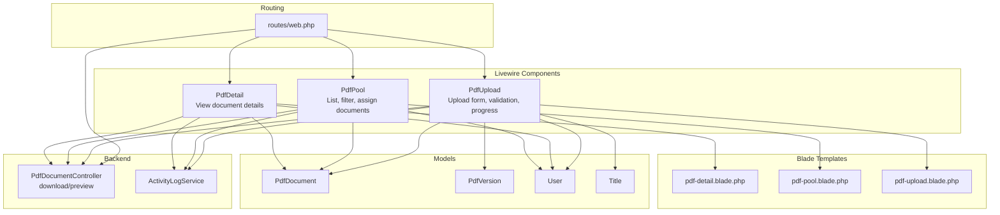
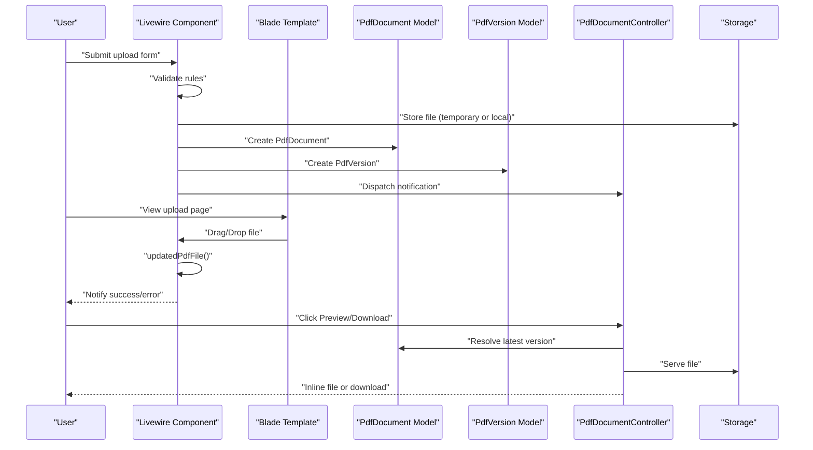
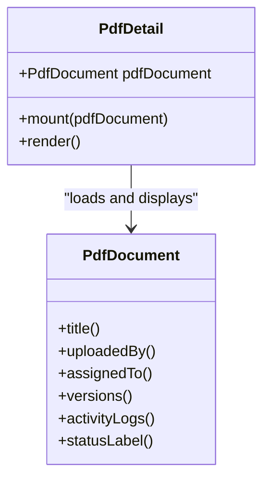
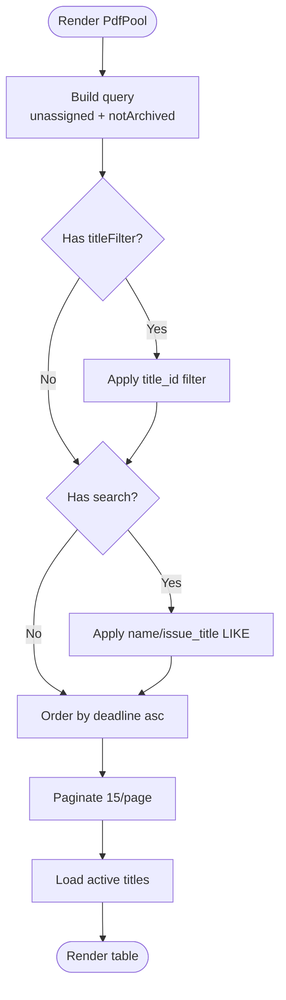
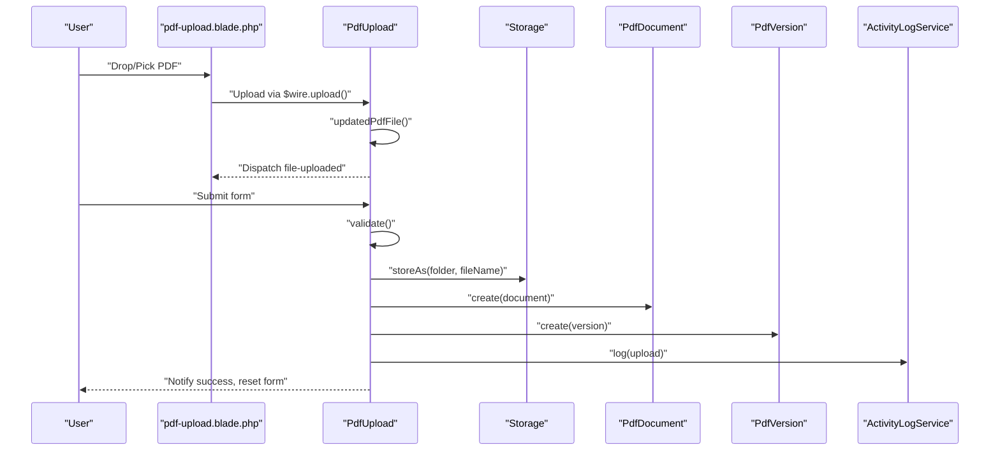
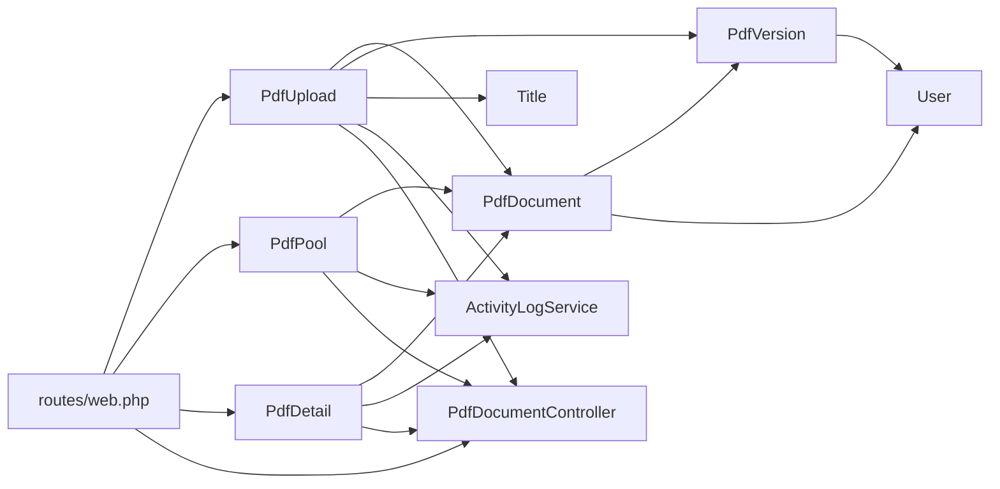
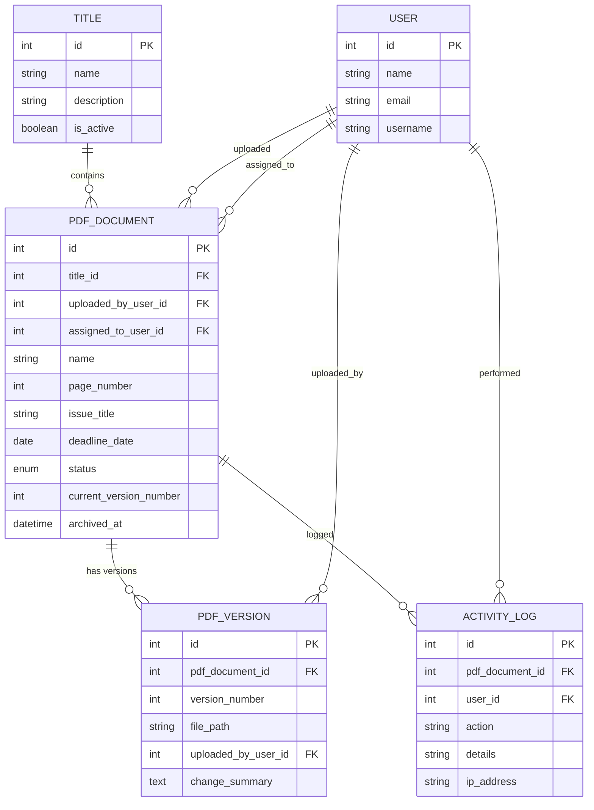

# PDF Document Components

<cite>
**Referenced Files in This Document**
- [PdfDetail.php](file://app/Livewire/PdfDetail.php)
- [PdfPool.php](file://app/Livewire/PdfPool.php)
- [PdfUpload.php](file://app/Livewire/PdfUpload.php)
- [pdf-detail.blade.php](file://resources/views/livewire/pdf-detail.blade.php)
- [pdf-pool.blade.php](file://resources/views/livewire/pdf-pool.blade.php)
- [pdf-upload.blade.php](file://resources/views/livewire/pdf-upload.blade.php)
- [PdfDocument.php](file://app/Models/PdfDocument.php)
- [PdfVersion.php](file://app/Models/PdfVersion.php)
- [ActivityLogService.php](file://app/Services/ActivityLogService.php)
- [PdfDocumentController.php](file://app/Http/Controllers/PdfDocumentController.php)
- [web.php](file://routes/web.php)
- [app.blade.php](file://resources/views/layouts/app.blade.php)
- [2024_06_10_120000_create_pdf_documents_table.php](file://database/migrations/2024_06_10_120000_create_pdf_documents_table.php)
- [2024_06_10_130000_create_pdf_versions_table.php](file://database/migrations/2024_06_10_130000_create_pdf_versions_table.php)
- [User.php](file://app/Models/User.php)
- [Title.php](file://app/Models/Title.php)
</cite>

## Table of Contents
1. [Introduction](#introduction)
2. [Project Structure](#project-structure)
3. [Core Components](#core-components)
4. [Architecture Overview](#architecture-overview)
5. [Detailed Component Analysis](#detailed-component-analysis)
6. [Dependency Analysis](#dependency-analysis)
7. [Performance Considerations](#performance-considerations)
8. [Troubleshooting Guide](#troubleshooting-guide)
9. [Conclusion](#conclusion)
10. [Appendices](#appendices)

## Introduction
This document explains the PDF-related Livewire components that power document lifecycle management: PdfDetail, PdfPool, and PdfUpload. It covers how these components render views, manage state, validate inputs, persist data, integrate with backend controllers for file delivery, and track activity. It also outlines customization possibilities, error handling, validation feedback, and user experience enhancements.

## Project Structure
The PDF subsystem is organized around three Livewire components backed by Blade templates, Eloquent models, a controller for downloads/previews, and supporting services and migrations.

**Diagram sources**
- [PdfDetail.php:10-23](file://app/Livewire/PdfDetail.php#L10-L23)
- [PdfPool.php:13-66](file://app/Livewire/PdfPool.php#L13-L66)
- [PdfUpload.php:16-101](file://app/Livewire/PdfUpload.php#L16-L101)
- [pdf-detail.blade.php:1-90](file://resources/views/livewire/pdf-detail.blade.php#L1-L90)
- [pdf-pool.blade.php:1-64](file://resources/views/livewire/pdf-pool.blade.php#L1-L64)
- [pdf-upload.blade.php:1-142](file://resources/views/livewire/pdf-upload.blade.php#L1-L142)
- [PdfDocumentController.php:13-82](file://app/Http/Controllers/PdfDocumentController.php#L13-L82)
- [ActivityLogService.php:10-31](file://app/Services/ActivityLogService.php#L10-L31)
- [PdfDocument.php:10-130](file://app/Models/PdfDocument.php#L10-L130)
- [PdfVersion.php:9-43](file://app/Models/PdfVersion.php#L9-L43)
- [web.php:25-53](file://routes/web.php#L25-L53)

**Section sources**
- [PdfDetail.php:10-23](file://app/Livewire/PdfDetail.php#L10-L23)
- [PdfPool.php:13-66](file://app/Livewire/PdfPool.php#L13-L66)
- [PdfUpload.php:16-101](file://app/Livewire/PdfUpload.php#L16-L101)
- [pdf-detail.blade.php:1-90](file://resources/views/livewire/pdf-detail.blade.php#L1-L90)
- [pdf-pool.blade.php:1-64](file://resources/views/livewire/pdf-pool.blade.php#L1-L64)
- [pdf-upload.blade.php:1-142](file://resources/views/livewire/pdf-upload.blade.php#L1-L142)
- [PdfDocumentController.php:13-82](file://app/Http/Controllers/PdfDocumentController.php#L13-L82)
- [ActivityLogService.php:10-31](file://app/Services/ActivityLogService.php#L10-L31)
- [PdfDocument.php:10-130](file://app/Models/PdfDocument.php#L10-L130)
- [PdfVersion.php:9-43](file://app/Models/PdfVersion.php#L9-L43)
- [web.php:25-53](file://routes/web.php#L25-L53)

## Core Components
- PdfDetail: Loads a single document with related data and renders metadata, version history, and activity logs. Provides quick links to preview and download.
- PdfPool: Lists unassigned, non-archived documents, supports live search and title filtering, and allows proofreaders to assign documents to themselves.
- PdfUpload: Presents a form with drag-and-drop upload, validates inputs, persists document and version records, and tracks uploads in the activity log.

**Section sources**
- [PdfDetail.php:10-23](file://app/Livewire/PdfDetail.php#L10-L23)
- [PdfPool.php:13-66](file://app/Livewire/PdfPool.php#L13-L66)
- [PdfUpload.php:16-101](file://app/Livewire/PdfUpload.php#L16-L101)

## Architecture Overview
The components communicate with Blade templates, Eloquent models, and backend controllers. Livewire handles state updates and user interactions. Alpine.js enhances the upload UX with drag-and-drop and progress indicators. Activity logging captures actions across the system.

**Diagram sources**
- [PdfUpload.php:45-93](file://app/Livewire/PdfUpload.php#L45-L93)
- [PdfDocumentController.php:15-40](file://app/Http/Controllers/PdfDocumentController.php#L15-L40)
- [pdf-upload.blade.php:7-89](file://resources/views/livewire/pdf-upload.blade.php#L7-L89)
- [PdfDocument.php:56-70](file://app/Models/PdfDocument.php#L56-L70)
- [PdfVersion.php:28-41](file://app/Models/PdfVersion.php#L28-L41)

## Detailed Component Analysis

### PdfDetail Component
Responsibilities:
- Load a document with related data (title, uploader, assignee, versions, activity logs).
- Render document metadata, status badges, and links to preview/download.
- Display version history and activity timeline.

State and rendering:
- Public property holds the loaded model instance.
- Uses a dedicated Blade template for presentation.

User interactions:
- Back navigation to dashboard.
- Preview and download links routed via controller.

**Diagram sources**
- [PdfDetail.php:10-23](file://app/Livewire/PdfDetail.php#L10-L23)
- [PdfDocument.php:41-70](file://app/Models/PdfDocument.php#L41-L70)

**Section sources**
- [PdfDetail.php:10-23](file://app/Livewire/PdfDetail.php#L10-L23)
- [pdf-detail.blade.php:1-90](file://resources/views/livewire/pdf-detail.blade.php#L1-L90)
- [PdfDocument.php:41-70](file://app/Models/PdfDocument.php#L41-L70)

### PdfPool Component
Responsibilities:
- List unassigned, non-archived documents.
- Filter by title and free-text search with debounced live updates.
- Allow proofreaders to assign a document to themselves with validation and notifications.

State and rendering:
- Public filters: titleFilter, search.
- Pagination enabled.
- queryString sync for filters.

Processing logic:
- Query builder applies scopes for unassigned/not archived.
- Applies title and search filters.
- Orders by deadline ascending and paginates.

User interactions:
- Assign button triggers assignment logic and logs action.

**Diagram sources**
- [PdfPool.php:41-65](file://app/Livewire/PdfPool.php#L41-L65)

**Section sources**
- [PdfPool.php:13-66](file://app/Livewire/PdfPool.php#L13-L66)
- [pdf-pool.blade.php:1-64](file://resources/views/livewire/pdf-pool.blade.php#L1-L64)
- [PdfDocument.php:72-96](file://app/Models/PdfDocument.php#L72-L96)

### PdfUpload Component
Responsibilities:
- Provide a form with drag-and-drop upload area.
- Validate inputs (file presence, MIME, size, title, name, page number, issue title, deadline).
- Persist document and initial version, store file in storage, and log activity.
- Reset form and notify user upon success.

State and rendering:
- Public properties for form fields.
- Mount initializes deadline to today’s date.
- Rules define validation constraints.

Processing logic:
- updatedPdfFile dispatches a frontend event to reset dropzone UI.
- save validates, selects storage folder based on title and month, handles both temporary and stored files, creates document and version, logs upload, resets form, and notifies.

**Diagram sources**
- [PdfUpload.php:45-93](file://app/Livewire/PdfUpload.php#L45-L93)
- [pdf-upload.blade.php:7-89](file://resources/views/livewire/pdf-upload.blade.php#L7-L89)
- [ActivityLogService.php:20-29](file://app/Services/ActivityLogService.php#L20-L29)

**Section sources**
- [PdfUpload.php:16-101](file://app/Livewire/PdfUpload.php#L16-L101)
- [pdf-upload.blade.php:1-142](file://resources/views/livewire/pdf-upload.blade.php#L1-L142)
- [ActivityLogService.php:10-31](file://app/Services/ActivityLogService.php#L10-L31)

## Dependency Analysis
Key relationships:
- Components depend on Eloquent models for data access and persistence.
- Controllers serve file delivery and previews with access checks.
- Services centralize activity logging.
- Routes bind components to URLs and controller actions.
- Blade templates define UI and Alpine-driven UX.

**Diagram sources**
- [PdfUpload.php:16-101](file://app/Livewire/PdfUpload.php#L16-L101)
- [PdfPool.php:13-66](file://app/Livewire/PdfPool.php#L13-L66)
- [PdfDetail.php:10-23](file://app/Livewire/PdfDetail.php#L10-L23)
- [PdfDocumentController.php:13-82](file://app/Http/Controllers/PdfDocumentController.php#L13-L82)
- [ActivityLogService.php:10-31](file://app/Services/ActivityLogService.php#L10-L31)
- [PdfDocument.php:10-130](file://app/Models/PdfDocument.php#L10-L130)
- [PdfVersion.php:9-43](file://app/Models/PdfVersion.php#L9-L43)
- [web.php:25-53](file://routes/web.php#L25-L53)

**Section sources**
- [PdfDocument.php:10-130](file://app/Models/PdfDocument.php#L10-L130)
- [PdfVersion.php:9-43](file://app/Models/PdfVersion.php#L9-L43)
- [PdfDocumentController.php:13-82](file://app/Http/Controllers/PdfDocumentController.php#L13-L82)
- [web.php:25-53](file://routes/web.php#L25-L53)

## Performance Considerations
- PdfPool pagination reduces DOM and query load; keep per-page count reasonable.
- Debounced search (300 ms) prevents excessive queries during typing.
- Lazy loading of images and minimal Alpine logic keeps UI responsive.
- Storage path construction avoids deep directory trees; grouping by title and month balances locality and manageability.
- Controller checks ensure only latest or requested version is served, avoiding unnecessary scans.

[No sources needed since this section provides general guidance]

## Troubleshooting Guide
Common issues and resolutions:
- Validation errors on upload:
  - Verify file MIME type and size limits; ensure title selection and required fields are set.
  - Check deadline constraints and numeric constraints for page number.
- Assignment conflicts:
  - If a document is already assigned, the component emits an error notification and prevents reassignment.
- Download/preview failures:
  - Confirm access permissions based on roles and ownership/assignment.
  - Ensure the file exists at the stored path; missing files trigger a 404 response.
- UI feedback:
  - Notifications are dispatched on success or failure; Alpine toast appears at bottom-right.
  - Drop zone resets after successful upload; progress indicators reflect upload state.

**Section sources**
- [PdfUpload.php:32-39](file://app/Livewire/PdfUpload.php#L32-L39)
- [PdfPool.php:22-39](file://app/Livewire/PdfPool.php#L22-L39)
- [PdfDocumentController.php:15-40](file://app/Http/Controllers/PdfDocumentController.php#L15-L40)
- [app.blade.php:61-70](file://resources/views/layouts/app.blade.php#L61-L70)

## Conclusion
The PDF components provide a cohesive workflow for document ingestion, assignment, and review. They leverage Livewire for reactive state, Blade for templating, Alpine for UX, and Eloquent for data modeling. Controllers and services ensure secure access and auditability. The design supports customization through model scopes, additional validation rules, and UI refinements.

[No sources needed since this section summarizes without analyzing specific files]

## Appendices

### Data Models Overview

**Diagram sources**
- [2024_06_10_120000_create_pdf_documents_table.php:11-24](file://database/migrations/2024_06_10_120000_create_pdf_documents_table.php#L11-L24)
- [2024_06_10_130000_create_pdf_versions_table.php:11-21](file://database/migrations/2024_06_10_130000_create_pdf_versions_table.php#L11-L21)
- [PdfDocument.php:19-39](file://app/Models/PdfDocument.php#L19-L39)
- [PdfVersion.php:13-26](file://app/Models/PdfVersion.php#L13-L26)
- [User.php:14-21](file://app/Models/User.php#L14-L21)
- [Title.php:13-17](file://app/Models/Title.php#L13-L17)

### Component-to-Template Mapping
- PdfDetail → pdf-detail.blade.php
- PdfPool → pdf-pool.blade.php
- PdfUpload → pdf-upload.blade.php

**Section sources**
- [pdf-detail.blade.php:1-90](file://resources/views/livewire/pdf-detail.blade.php#L1-L90)
- [pdf-pool.blade.php:1-64](file://resources/views/livewire/pdf-pool.blade.php#L1-L64)
- [pdf-upload.blade.php:1-142](file://resources/views/livewire/pdf-upload.blade.php#L1-L142)

### Customization Examples
- Add new fields:
  - Extend the model fillable arrays and update validation rules.
  - Add corresponding Blade inputs and Livewire properties.
- Modify status transitions:
  - Update model status constants and labels; adjust controller logic for allowed transitions.
- Enhance filtering:
  - Add new Livewire properties and apply additional query scopes.
- Improve UX:
  - Integrate progress bars or chunked uploads in the upload flow.
  - Add tooltips, keyboard shortcuts, or bulk actions in PdfPool.

[No sources needed since this section provides general guidance]