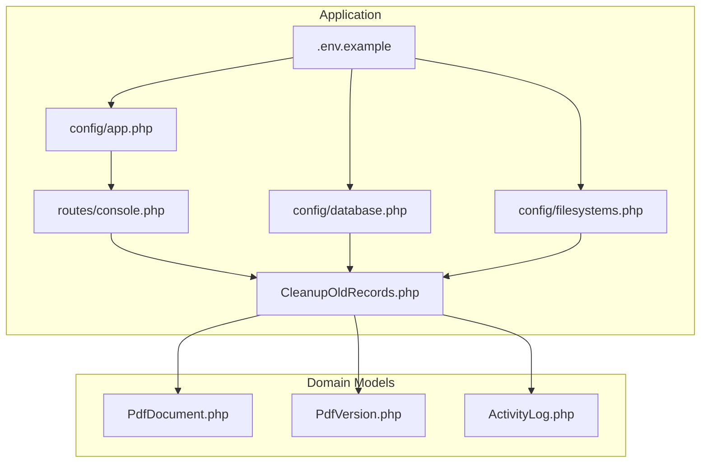
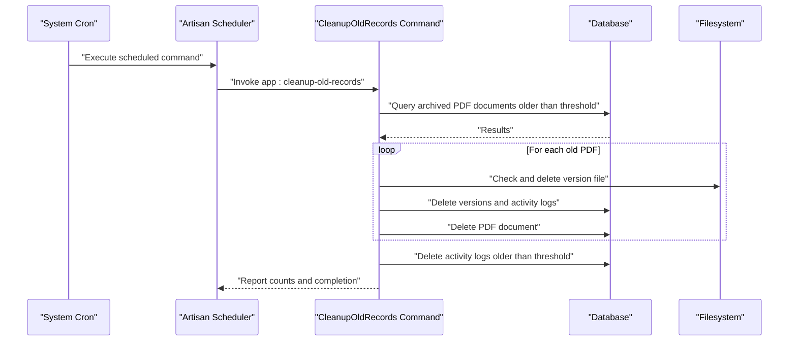
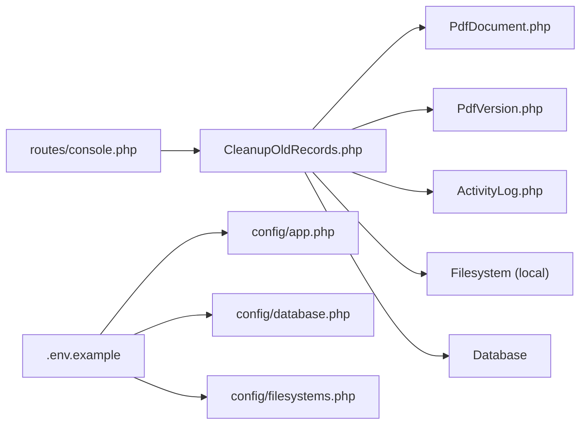

# Maintenance and Operations

<cite>
**Referenced Files in This Document**
- [routes/console.php](file://pdf-korektura/routes/console.php)
- [CleanupOldRecords.php](file://pdf-korektura/app/Console/Commands/CleanupOldRecords.php)
- [.env.example](file://pdf-korektura/.env.example)
- [app.php](file://pdf-korektura/config/app.php)
- [database.php](file://pdf-korektura/config/database.php)
- [filesystems.php](file://pdf-korektura/config/filesystems.php)
- [PdfDocument.php](file://pdf-korektura/app/Models/PdfDocument.php)
- [PdfVersion.php](file://pdf-korektura/app/Models/PdfVersion.php)
- [ActivityLog.php](file://pdf-korektura/app/Models/ActivityLog.php)
- [composer.json](file://pdf-korektura/composer.json)
</cite>

## Table of Contents
1. [Introduction](#introduction)
2. [Project Structure](#project-structure)
3. [Core Components](#core-components)
4. [Architecture Overview](#architecture-overview)
5. [Detailed Component Analysis](#detailed-component-analysis)
6. [Dependency Analysis](#dependency-analysis)
7. [Performance Considerations](#performance-considerations)
8. [Troubleshooting Guide](#troubleshooting-guide)
9. [Conclusion](#conclusion)
10. [Appendices](#appendices)

## Introduction
This document provides comprehensive maintenance and operations guidance for the PDF correction system. It covers scheduled tasks and cron job configuration, log management (rotation, monitoring, and analysis), backup strategies for database and file system data, monitoring and alerting configurations, performance maintenance and optimization, incident response and troubleshooting workflows, update and patch management processes, and capacity planning with resource optimization strategies.

## Project Structure
The system is a Laravel application with Eloquent models for PDF documents, versions, and activity logs. Scheduling is configured via the console routes file, and a dedicated cleanup command maintains data hygiene. Environment variables define logging, database, queue, cache, and filesystem behavior.

**Diagram sources**
- [routes/console.php:1-12](file://pdf-korektura/routes/console.php#L1-L12)
- [CleanupOldRecords.php:1-47](file://pdf-korektura/app/Console/Commands/CleanupOldRecords.php#L1-L47)
- [app.php:1-92](file://pdf-korektura/config/app.php#L1-L92)
- [database.php:1-93](file://pdf-korektura/config/database.php#L1-L93)
- [filesystems.php:1-23](file://pdf-korektura/config/filesystems.php#L1-L23)
- [.env.example:1-78](file://pdf-korektura/.env.example#L1-L78)
- [PdfDocument.php:1-130](file://pdf-korektura/app/Models/PdfDocument.php#L1-L130)
- [PdfVersion.php:1-43](file://pdf-korektura/app/Models/PdfVersion.php#L1-L43)
- [ActivityLog.php:1-60](file://pdf-korektura/app/Models/ActivityLog.php#L1-L60)

**Section sources**
- [routes/console.php:1-12](file://pdf-korektura/routes/console.php#L1-L12)
- [CleanupOldRecords.php:1-47](file://pdf-korektura/app/Console/Commands/CleanupOldRecords.php#L1-L47)
- [app.php:1-92](file://pdf-korektura/config/app.php#L1-L92)
- [database.php:1-93](file://pdf-korektura/config/database.php#L1-L93)
- [filesystems.php:1-23](file://pdf-korektura/config/filesystems.php#L1-L23)
- [.env.example:1-78](file://pdf-korektura/.env.example#L1-L78)

## Core Components
- Scheduled cleanup command: A daily cron job invokes a command to remove old PDF documents, versions, and activity logs after a configurable retention period.
- Logging configuration: Logging channels and stack are defined via environment variables and configuration files.
- Database connectivity: Multi-driver support (SQLite, MySQL, PostgreSQL, SQL Server) with Redis options for cache and queue.
- Filesystem: Local disks for private and public storage; symbolic links configured for public access.
- Domain models: PDF documents, versions, and activity logs with relationships and scopes.

**Section sources**
- [routes/console.php:11-12](file://pdf-korektura/routes/console.php#L11-L12)
- [CleanupOldRecords.php:13-46](file://pdf-korektura/app/Console/Commands/CleanupOldRecords.php#L13-L46)
- [.env.example:19-22](file://pdf-korektura/.env.example#L19-L22)
- [app.php:17-20](file://pdf-korektura/config/app.php#L17-L20)
- [database.php:5-67](file://pdf-korektura/config/database.php#L5-L67)
- [filesystems.php:3-22](file://pdf-korektura/config/filesystems.php#L3-L22)
- [PdfDocument.php:14-129](file://pdf-korektura/app/Models/PdfDocument.php#L14-L129)
- [PdfVersion.php:13-42](file://pdf-korektura/app/Models/PdfVersion.php#L13-L42)
- [ActivityLog.php:13-58](file://pdf-korektura/app/Models/ActivityLog.php#L13-L58)

## Architecture Overview
The maintenance architecture centers on a scheduled task that triggers a cleanup routine. The routine interacts with domain models and the filesystem to remove outdated data. Logging and database configuration are externalized via environment variables and configuration files.

**Diagram sources**
- [routes/console.php:11-12](file://pdf-korektura/routes/console.php#L11-L12)
- [CleanupOldRecords.php:16-46](file://pdf-korektura/app/Console/Commands/CleanupOldRecords.php#L16-L46)
- [PdfDocument.php:23-38](file://pdf-korektura/app/Models/PdfDocument.php#L23-L38)
- [PdfVersion.php:13-26](file://pdf-korektura/app/Models/PdfVersion.php#L13-L26)
- [ActivityLog.php:21-34](file://pdf-korektura/app/Models/ActivityLog.php#L21-L34)

## Detailed Component Analysis

### Scheduled Tasks and Cron Job Configuration
- Daily cleanup: A scheduled command runs daily to remove old records based on a cutoff date.
- Retention window: The command accepts a configurable number of days to retain records.
- Scope: Removes archived PDF documents and their associated versions and activity logs; also purges old activity logs.

Operational steps:
- Configure server cron to call the Laravel scheduler at a desired interval.
- Verify the scheduled command is registered and runs as expected.
- Monitor command output and logs for successful completion and counts.

**Section sources**
- [routes/console.php:11-12](file://pdf-korektura/routes/console.php#L11-L12)
- [CleanupOldRecords.php:13-19](file://pdf-korektura/app/Console/Commands/CleanupOldRecords.php#L13-L19)
- [CleanupOldRecords.php:23-42](file://pdf-korektura/app/Console/Commands/CleanupOldRecords.php#L23-L42)

### Log Management
- Channels and stacks: Logging channel and stack are controlled via environment variables.
- Log level: Configurable via environment variable for operational visibility.
- Default stack: Single channel stack is enabled by default.

Recommended practices:
- Set appropriate log levels per environment (e.g., info or warning for production).
- Route logs to centralized systems for aggregation and alerting.
- Implement log rotation at the OS level to prevent disk growth.

**Section sources**
- [.env.example:19-22](file://pdf-korektura/.env.example#L19-L22)
- [app.php:17-20](file://pdf-korektura/config/app.php#L17-L20)

### Backup Strategies
- Database backups:
  - SQLite: Back up the SQLite database file regularly.
  - MySQL/PostgreSQL/SQL Server: Use native database backup utilities and automate retention policies.
- File system backups:
  - Local storage: Back up the storage/app directory, especially the PDFs folder.
  - Public storage: Back up the storage/app/public directory for shared assets.
- Offsite retention: Store backups offsite or in secure cloud storage with encryption.
- Validation: Periodically restore test restores to verify integrity.

Note: The filesystem configuration uses local disks and a public symlink; ensure backups cover both private and public storage locations.

**Section sources**
- [database.php:5-67](file://pdf-korektura/config/database.php#L5-L67)
- [filesystems.php:3-22](file://pdf-korektura/config/filesystems.php#L3-L22)
- [composer.json:49-51](file://pdf-korektura/composer.json#L49-L51)

### Monitoring and Alerting
- Application logs: Centralize logs and set alerts for error spikes and critical events.
- Database health: Monitor connection pools, slow queries, and disk usage.
- Filesystem health: Watch storage utilization and permissions for the PDF storage directories.
- Queue and cache: Monitor queue backlogs and cache hit rates.
- Alerts: Define thresholds for CPU, memory, disk, and network to trigger notifications.

[No sources needed since this section provides general guidance]

### Performance Maintenance and Optimization
- Database:
  - Indexes: Ensure appropriate indexes on frequently queried columns (e.g., created_at, archived_at).
  - Vacuum/defragment: For SQLite, periodically vacuum the database file.
  - Connection pooling: Tune pool sizes and timeouts for MySQL/PostgreSQL.
- Filesystem:
  - Directory layout: Keep file paths short and avoid excessive nesting.
  - Permissions: Ensure read/write permissions for the web server user.
- Application:
  - OPcache: Enable and tune PHP OPcache for improved performance.
  - Composer autoload: Optimize autoloader and clear caches after deployments.
  - Queue workers: Scale workers according to workload and monitor backlog.

[No sources needed since this section provides general guidance]

### Incident Response Procedures
- Immediate actions:
  - Identify symptoms and isolate affected components.
  - Review recent changes and deployments.
  - Check application logs, database logs, and system logs.
- Containment:
  - Roll back recent changes if correlated with incidents.
  - Temporarily disable problematic features or routes.
- Resolution:
  - Apply hotfixes or patches as needed.
  - Restart services if required.
- Postmortem:
  - Document root cause, impact, and remediation steps.
  - Update runbooks and alerting thresholds.

[No sources needed since this section provides general guidance]

### Troubleshooting Workflows
- Logs:
  - Increase log level temporarily for diagnosis.
  - Tail logs for the specific command or controller actions.
- Database:
  - Verify connectivity and credentials.
  - Check for long-running transactions or deadlocks.
- Filesystem:
  - Confirm file paths and permissions.
  - Validate symbolic links and storage disk configuration.
- Scheduling:
  - Ensure cron executes the scheduler and the command is registered.

**Section sources**
- [routes/console.php:11-12](file://pdf-korektura/routes/console.php#L11-L12)
- [CleanupOldRecords.php:16-46](file://pdf-korektura/app/Console/Commands/CleanupOldRecords.php#L16-L46)
- [filesystems.php:3-22](file://pdf-korektura/config/filesystems.php#L3-L22)
- [database.php:5-67](file://pdf-korektura/config/database.php#L5-L67)

### System Updates and Patch Management
- PHP and extensions: Keep PHP and required extensions updated.
- Laravel and dependencies: Regularly update Laravel framework and third-party packages.
- Security patches: Apply security updates promptly; scan for vulnerabilities.
- Testing: Validate updates in staging before production deployment.
- Rollback: Maintain previous versions and deployment artifacts for quick rollback.

**Section sources**
- [composer.json:7-14](file://pdf-korektura/composer.json#L7-L14)
- [composer.json:36-51](file://pdf-korektura/composer.json#L36-L51)

### Capacity Planning and Resource Optimization
- Forecast growth: Track PDF volume, storage usage, and concurrent users.
- Horizontal scaling: Add queue workers and load balance web servers.
- Database scaling: Consider read replicas, partitioning, or migration to enterprise databases.
- Storage scaling: Use separate volumes or object storage for large PDFs.
- Caching: Leverage Redis for session and cache to reduce database load.

[No sources needed since this section provides general guidance]

## Dependency Analysis
The cleanup command depends on domain models and the filesystem. Scheduling is configured in the console routes file and relies on the application’s scheduler. Logging and database configuration are driven by environment variables and configuration files.

**Diagram sources**
- [routes/console.php:11-12](file://pdf-korektura/routes/console.php#L11-L12)
- [CleanupOldRecords.php:1-47](file://pdf-korektura/app/Console/Commands/CleanupOldRecords.php#L1-L47)
- [PdfDocument.php:1-130](file://pdf-korektura/app/Models/PdfDocument.php#L1-L130)
- [PdfVersion.php:1-43](file://pdf-korektura/app/Models/PdfVersion.php#L1-L43)
- [ActivityLog.php:1-60](file://pdf-korektura/app/Models/ActivityLog.php#L1-L60)
- [app.php:1-92](file://pdf-korektura/config/app.php#L1-L92)
- [database.php:1-93](file://pdf-korektura/config/database.php#L1-L93)
- [filesystems.php:1-23](file://pdf-korektura/config/filesystems.php#L1-L23)
- [.env.example:1-78](file://pdf-korektura/.env.example#L1-L78)

**Section sources**
- [routes/console.php:11-12](file://pdf-korektura/routes/console.php#L11-L12)
- [CleanupOldRecords.php:1-47](file://pdf-korektura/app/Console/Commands/CleanupOldRecords.php#L1-L47)
- [PdfDocument.php:1-130](file://pdf-korektura/app/Models/PdfDocument.php#L1-L130)
- [PdfVersion.php:1-43](file://pdf-korektura/app/Models/PdfVersion.php#L1-L43)
- [ActivityLog.php:1-60](file://pdf-korektura/app/Models/ActivityLog.php#L1-L60)
- [app.php:1-92](file://pdf-korektura/config/app.php#L1-L92)
- [database.php:1-93](file://pdf-korektura/config/database.php#L1-L93)
- [filesystems.php:1-23](file://pdf-korektura/config/filesystems.php#L1-L23)
- [.env.example:1-78](file://pdf-korektura/.env.example#L1-L78)

## Performance Considerations
- Database:
  - Use indexes on created_at and archived_at for efficient cleanup queries.
  - Batch deletions to minimize transaction overhead.
- Filesystem:
  - Ensure fast I/O for PDF storage directories.
  - Monitor inode limits and file descriptor availability.
- Application:
  - Tune PHP and web server settings for concurrency.
  - Use queue workers for heavy operations.

[No sources needed since this section provides general guidance]

## Troubleshooting Guide
- Command not running:
  - Verify cron is configured to call the scheduler.
  - Check that the scheduled command is registered.
- Cleanup deletes too much or too little:
  - Adjust the retention days option.
  - Validate archived_at and created_at conditions.
- Storage errors:
  - Confirm file paths exist and are readable/writable.
  - Check filesystem permissions and disk space.
- Database errors:
  - Validate credentials and connection settings.
  - Inspect slow query logs and locks.

**Section sources**
- [routes/console.php:11-12](file://pdf-korektura/routes/console.php#L11-L12)
- [CleanupOldRecords.php:13-19](file://pdf-korektura/app/Console/Commands/CleanupOldRecords.php#L13-L19)
- [CleanupOldRecords.php:23-42](file://pdf-korektura/app/Console/Commands/CleanupOldRecords.php#L23-L42)
- [filesystems.php:3-22](file://pdf-korektura/config/filesystems.php#L3-L22)
- [database.php:5-67](file://pdf-korektura/config/database.php#L5-L67)

## Conclusion
This document outlined the maintenance and operations procedures for the PDF correction system, focusing on scheduled cleanup, logging, backups, monitoring, performance, incident response, updates, and capacity planning. By following the recommended practices and leveraging the existing configuration and scheduling mechanisms, operators can maintain a reliable and efficient system.

## Appendices
- Quick checklist:
  - Confirm cron runs the scheduler.
  - Validate cleanup command options and thresholds.
  - Ensure backups cover database and filesystem storage.
  - Set up centralized logging and alerting.
  - Monitor database and filesystem health.
  - Keep dependencies updated and tested.

[No sources needed since this section provides general guidance]