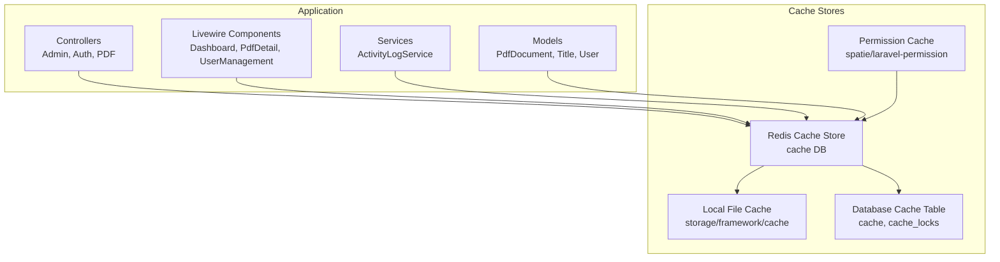
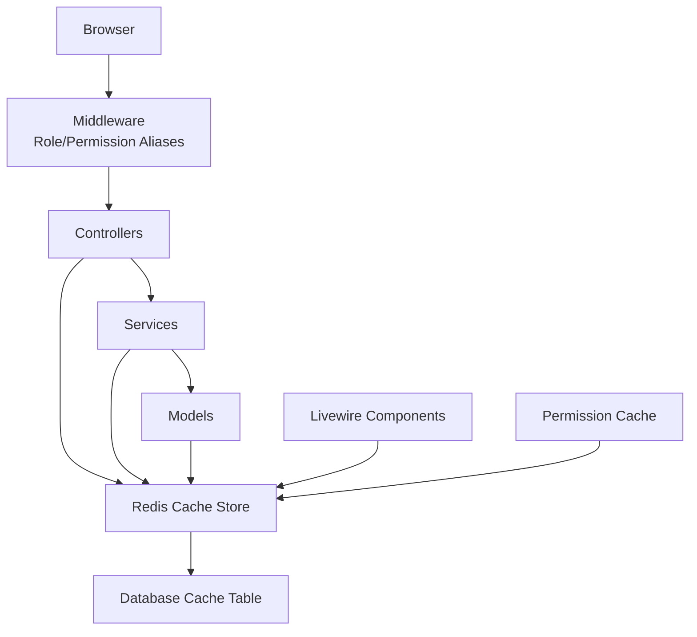
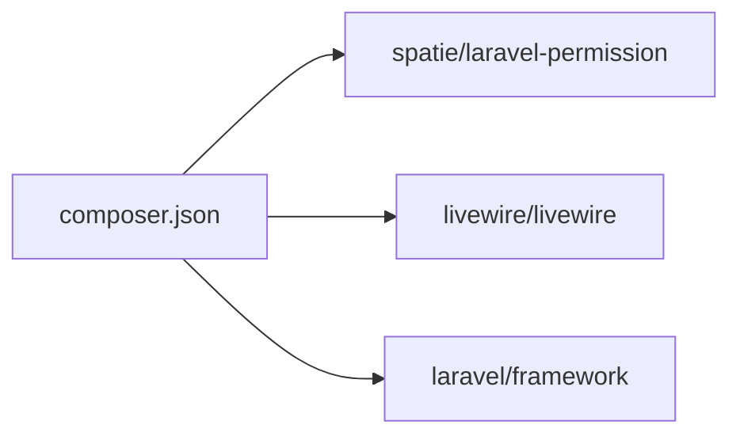

# Caching Strategies

<cite>
**Referenced Files in This Document**
- [database.php](file://config/database.php)
- [permission.php](file://config/permission.php)
- [0001_01_01_000001_create_cache_table.php](file://database/migrations/0001_01_01_000001_create_cache_table.php)
- [AppServiceProvider.php](file://app/Providers/AppServiceProvider.php)
- [Dashboard.php](file://app/Livewire/Dashboard.php)
- [PdfDetail.php](file://app/Livewire/PdfDetail.php)
- [UserManagement.php](file://app/Livewire/Admin/UserManagement.php)
- [ActivityLogService.php](file://app/Services/ActivityLogService.php)
- [AdminController.php](file://app/Http/Controllers/AdminController.php)
- [AuthController.php](file://app/Http/Controllers/AuthController.php)
- [PdfDocumentController.php](file://app/Http/Controllers/PdfDocumentController.php)
- [app.php](file://bootstrap/app.php)
- [composer.json](file://composer.json)
</cite>

## Table of Contents
1. [Introduction](#introduction)
2. [Project Structure](#project-structure)
3. [Core Components](#core-components)
4. [Architecture Overview](#architecture-overview)
5. [Detailed Component Analysis](#detailed-component-analysis)
6. [Dependency Analysis](#dependency-analysis)
7. [Performance Considerations](#performance-considerations)
8. [Troubleshooting Guide](#troubleshooting-guide)
9. [Conclusion](#conclusion)
10. [Appendices](#appendices)

## Introduction
This document defines a comprehensive caching strategy for the Laravel application. It covers Redis and file-based caching configuration, caching patterns for frequently accessed data (user permissions, document metadata, system configurations), invalidation strategies, tagging and selective clearing, Livewire component rendering and state persistence, performance monitoring and hit ratio optimization, distributed caching considerations, and cache warming for startup and high-traffic scenarios.

## Project Structure
The application integrates caching via:
- Redis-backed cache stores for application and session caching
- A dedicated database-backed cache table for environments without external cache servers
- Spatie Laravel Permission cache configuration for role/permission caching
- Livewire components that benefit from server-side caching and state persistence

**Diagram sources**
- [database.php:68-91](file://config/database.php#L68-L91)
- [0001_01_01_000001_create_cache_table.php:11-21](file://database/migrations/0001_01_01_000001_create_cache_table.php#L11-L21)
- [permission.php:28-32](file://config/permission.php#L28-L32)

**Section sources**
- [database.php:68-91](file://config/database.php#L68-L91)
- [0001_01_01_000001_create_cache_table.php:11-21](file://database/migrations/0001_01_01_000001_create_cache_table.php#L11-L21)
- [permission.php:28-32](file://config/permission.php#L28-L32)

## Core Components
- Redis cache configuration supports separate logical databases for default and cache usage, enabling isolation and targeted invalidation.
- A database-backed cache table is provisioned for environments without external cache infrastructure.
- Spatie permission cache is configured with a dedicated expiration interval, cache key, and store.
- Livewire components rely on server-side state persistence and can benefit from caching around expensive queries and computed stats.

Key configuration anchors:
- Redis cache store definition and database selection
- Database cache table schema
- Permission cache configuration

**Section sources**
- [database.php:68-91](file://config/database.php#L68-L91)
- [0001_01_01_000001_create_cache_table.php:11-21](file://database/migrations/0001_01_01_000001_create_cache_table.php#L11-L21)
- [permission.php:28-32](file://config/permission.php#L28-L32)

## Architecture Overview
The caching architecture leverages Redis for high-performance caching and optional fallback to database-backed cache. Livewire components encapsulate state and can be paired with cached data to reduce query load.

**Diagram sources**
- [app.php:14-19](file://bootstrap/app.php#L14-L19)
- [database.php:68-91](file://config/database.php#L68-L91)
- [0001_01_01_000001_create_cache_table.php:11-21](file://database/migrations/0001_01_01_000001_create_cache_table.php#L11-L21)
- [permission.php:28-32](file://config/permission.php#L28-L32)

## Detailed Component Analysis

### Redis Cache Configuration
- Dedicated cache database: The Redis configuration defines a separate logical database for cache operations, allowing isolation from default application data.
- Prefixing and clustering: Redis options include a configurable prefix and cluster mode for distributed deployments.
- Environment-driven configuration: Host, port, credentials, and database indices are controlled via environment variables.

Operational implications:
- Use the cache store for application-level caching and avoid mixing with persistent application data.
- For multi-server deployments, ensure consistent Redis cluster configuration and shared cache keys.

**Section sources**
- [database.php:68-91](file://config/database.php#L68-L91)

### Database-Backed Cache
- The migration creates a cache table and a cache_locks table suitable for environments without external cache infrastructure.
- Laravel’s cache contracts support database drivers; this schema enables cache operations against the relational store.

Operational implications:
- Prefer Redis for production workloads; use database cache as a fallback or development option.
- Ensure proper indexing and maintenance of cache entries.

**Section sources**
- [0001_01_01_000001_create_cache_table.php:11-21](file://database/migrations/0001_01_01_000001_create_cache_table.php#L11-L21)

### Spatie Permission Cache
- The permission package cache is configured with:
  - Expiration interval set to 24 hours
  - Cache key prefix for permission cache
  - Store targeting the default cache store
- This reduces repeated permission checks and improves authorization performance.

Operational implications:
- Align cache expiration with role/permission update cadence.
- Invalidate or rotate cache keys during bulk permission updates.

**Section sources**
- [permission.php:28-32](file://config/permission.php#L28-L32)

### Livewire Components and State Persistence
Livewire components encapsulate reactive state and can benefit from caching around expensive computations and queries.

- Dashboard component:
  - Uses pagination and filters; expensive counts and lists can be cached per user/session.
  - Computed statistics can be cached with appropriate invalidation on document status changes.

- PdfDetail component:
  - Loads related models; caching related records reduces N+1 query overhead.

- UserManagement component:
  - Paginated user listings with role data; caching roles and user counts improves responsiveness.

Recommendations:
- Cache filtered and paginated datasets keyed by user ID and query parameters.
- Use cache tags or composite keys to enable targeted invalidation.
- Persist Livewire state in cache for long-running operations if needed.

**Section sources**
- [Dashboard.php:48-90](file://app/Livewire/Dashboard.php#L48-L90)
- [PdfDetail.php:14-22](file://app/Livewire/PdfDetail.php#L14-L22)
- [UserManagement.php:109-125](file://app/Livewire/Admin/UserManagement.php#L109-L125)

### Activity Logging and Cache Invalidation
Activity logging is used across the application to track document actions. While logging itself is not cached, it informs invalidation strategies.

- Use activity events to trigger cache invalidation for affected documents, titles, and user-specific caches.
- Invalidate permission cache after role/permission changes.

**Section sources**
- [ActivityLogService.php:20-29](file://app/Services/ActivityLogService.php#L20-L29)

### Controllers and Cache Patterns
Controllers orchestrate requests and can leverage caching for:
- Frequently accessed system configurations
- Document metadata summaries
- User permission checks (via Spatie cache)

Recommendations:
- Cache configuration reads with short TTLs and invalidate on configuration change.
- Cache metadata aggregates with ETags or versioned keys.
- Use middleware aliases for role/permission checks to minimize repeated authorization logic.

**Section sources**
- [app.php:14-19](file://bootstrap/app.php#L14-L19)

## Dependency Analysis
The application depends on several packages that influence caching behavior:
- spatie/laravel-permission: Provides built-in cache for permissions/roles
- livewire/livewire: Enables reactive UI with server-side state persistence
- laravel/framework: Provides cache contracts and drivers

**Diagram sources**
- [composer.json:13-14](file://composer.json#L13-L14)

**Section sources**
- [composer.json:13-14](file://composer.json#L13-L14)

## Performance Considerations
- Choose Redis for production for low-latency cache operations; database-backed cache is acceptable for development or constrained environments.
- Align cache TTLs with data volatility; for example, keep permission cache at 24 hours but shorten TTLs for dynamic lists.
- Monitor cache hit ratios and adjust TTLs and key designs accordingly.
- Use cache tagging or composite keys to enable targeted invalidation and reduce broad flushes.

[No sources needed since this section provides general guidance]

## Troubleshooting Guide
Common issues and resolutions:
- Cache not invalidated after role/permission changes:
  - Clear the permission cache or rotate its cache key.
  - Verify the cache store configuration and database connectivity.
- High miss rates:
  - Increase TTL for stable data, reduce TTL for volatile data.
  - Add cache tagging or composite keys for selective invalidation.
- Livewire state inconsistencies:
  - Re-evaluate cached queries and ensure cache keys incorporate user ID and filters.
  - Confirm Redis availability and network latency.

**Section sources**
- [permission.php:28-32](file://config/permission.php#L28-L32)
- [database.php:68-91](file://config/database.php#L68-L91)

## Conclusion
A layered caching strategy combining Redis, database-backed cache, and Spatie permission cache delivers strong performance and scalability. By applying targeted invalidation, tagging, and careful TTL management, the system maintains consistency while optimizing throughput. Livewire components can further benefit from server-side caching and state persistence.

[No sources needed since this section summarizes without analyzing specific files]

## Appendices

### Cache Configuration Reference
- Redis cache store and database separation
- Database cache table schema
- Spatie permission cache configuration

**Section sources**
- [database.php:68-91](file://config/database.php#L68-L91)
- [0001_01_01_000001_create_cache_table.php:11-21](file://database/migrations/0001_01_01_000001_create_cache_table.php#L11-L21)
- [permission.php:28-32](file://config/permission.php#L28-L32)