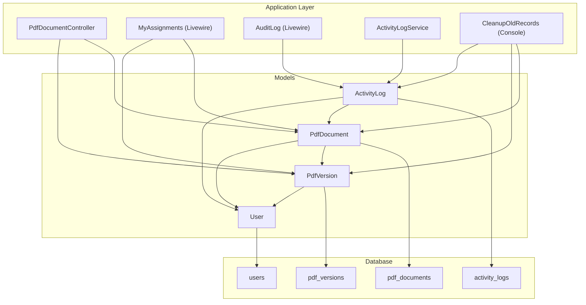
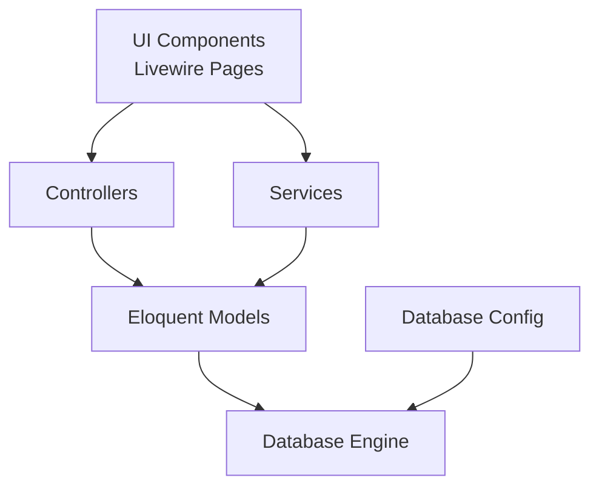
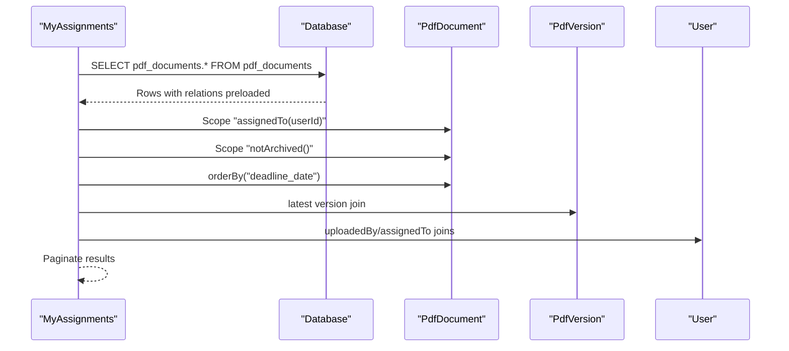
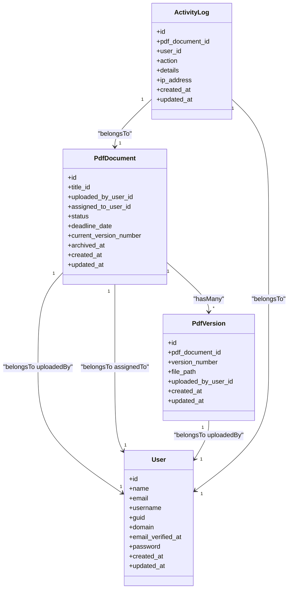

# Database Optimization

<cite>
**Referenced Files in This Document**
- [create_pdf_documents_table.php](file://database/migrations/2024_06_10_120000_create_pdf_documents_table.php)
- [create_pdf_versions_table.php](file://database/migrations/2024_06_10_130000_create_pdf_versions_table.php)
- [create_users_table.php](file://database/migrations/0001_01_01_000000_create_users_table.php)
- [create_activity_logs_table.php](file://database/migrations/2024_06_10_140000_create_activity_logs_table.php)
- [database.php](file://config/database.php)
- [PdfDocument.php](file://app/Models/PdfDocument.php)
- [PdfVersion.php](file://app/Models/PdfVersion.php)
- [User.php](file://app/Models/User.php)
- [PdfDocumentController.php](file://app/Http/Controllers/PdfDocumentController.php)
- [MyAssignments.php](file://app/Livewire/MyAssignments.php)
- [AuditLog.php](file://app/Livewire/Admin/AuditLog.php)
- [CleanupOldRecords.php](file://app/Console/Commands/CleanupOldRecords.php)
- [ActivityLogService.php](file://app/Services/ActivityLogService.php)
</cite>

## Table of Contents
1. [Introduction](#introduction)
2. [Project Structure](#project-structure)
3. [Core Components](#core-components)
4. [Architecture Overview](#architecture-overview)
5. [Detailed Component Analysis](#detailed-component-analysis)
6. [Dependency Analysis](#dependency-analysis)
7. [Performance Considerations](#performance-considerations)
8. [Troubleshooting Guide](#troubleshooting-guide)
9. [Conclusion](#conclusion)
10. [Appendices](#appendices)

## Introduction
This document provides comprehensive database optimization guidance for the PDF correction system. It focuses on indexing strategies for frequently queried columns (document status, user assignments, timestamps), query optimization for complex joins among PdfDocument, PdfVersion, and User tables, database connection pooling and transaction management, query execution plans and performance monitoring, maintenance procedures (index rebuilding and statistics updates), partitioning strategies for large datasets, archiving old records, and configuration tuning for optimal performance under load.

## Project Structure
The system uses Laravel Eloquent ORM with relational tables for users, PDF documents, PDF versions, and activity logs. The database configuration supports SQLite, MySQL, PostgreSQL, and SQL Server drivers. The application exposes controllers and Livewire components that drive database queries and operations.

**Diagram sources**
- [PdfDocumentController.php:1-82](file://app/Http/Controllers/PdfDocumentController.php#L1-L82)
- [MyAssignments.php:1-122](file://app/Livewire/MyAssignments.php#L1-L122)
- [AuditLog.php:1-55](file://app/Livewire/Admin/AuditLog.php#L1-L55)
- [ActivityLogService.php:1-31](file://app/Services/ActivityLogService.php#L1-L31)
- [CleanupOldRecords.php:1-47](file://app/Console/Commands/CleanupOldRecords.php#L1-L47)
- [PdfDocument.php:1-130](file://app/Models/PdfDocument.php#L1-L130)
- [PdfVersion.php:1-43](file://app/Models/PdfVersion.php#L1-L43)
- [User.php:1-71](file://app/Models/User.php#L1-L71)
- [create_users_table.php:1-47](file://database/migrations/0001_01_01_000000_create_users_table.php#L1-L47)
- [create_pdf_documents_table.php:1-32](file://database/migrations/2024_06_10_120000_create_pdf_documents_table.php#L1-L32)
- [create_pdf_versions_table.php:1-29](file://database/migrations/2024_06_10_130000_create_pdf_versions_table.php#L1-L29)
- [create_activity_logs_table.php:1-27](file://database/migrations/2024_06_10_140000_create_activity_logs_table.php#L1-L27)

**Section sources**
- [database.php:1-93](file://config/database.php#L1-L93)
- [create_pdf_documents_table.php:1-32](file://database/migrations/2024_06_10_120000_create_pdf_documents_table.php#L1-L32)
- [create_pdf_versions_table.php:1-29](file://database/migrations/2024_06_10_130000_create_pdf_versions_table.php#L1-L29)
- [create_users_table.php:1-47](file://database/migrations/0001_01_01_000000_create_users_table.php#L1-L47)
- [create_activity_logs_table.php:1-27](file://database/migrations/2024_06_10_140000_create_activity_logs_table.php#L1-L27)

## Core Components
- PdfDocument: Central entity representing PDF correction tasks with status, assignment, deadlines, and archival timestamps. Includes scopes for filtering unassigned, assigned, archived/not archived, and editor-specific queries.
- PdfVersion: Versioned file records linked to PdfDocument with unique constraints on (document_id, version_number).
- User: Authentication and authorization model with roles via Spatie Permission package; related to PdfDocument via upload/assignment and to PdfVersion via uploader.
- ActivityLog: Audit trail for actions performed on PDFs, linked to PdfDocument and User.
- Controllers and Livewire components: Drive queries for downloads, previews, assignment lists, and audit logging.

Key query patterns observed:
- Join-heavy reads across PdfDocument, PdfVersion, and User for assignment dashboards and admin audit views.
- Filtering by status, assignment, and timestamps for work distribution and reporting.
- Aggregated counts and paginated lists for UI rendering.

**Section sources**
- [PdfDocument.php:1-130](file://app/Models/PdfDocument.php#L1-L130)
- [PdfVersion.php:1-43](file://app/Models/PdfVersion.php#L1-L43)
- [User.php:1-71](file://app/Models/User.php#L1-L71)
- [PdfDocumentController.php:1-82](file://app/Http/Controllers/PdfDocumentController.php#L1-L82)
- [MyAssignments.php:1-122](file://app/Livewire/MyAssignments.php#L1-L122)
- [AuditLog.php:1-55](file://app/Livewire/Admin/AuditLog.php#L1-L55)

## Architecture Overview
The application follows a layered architecture:
- Presentation: Controllers and Livewire components.
- Application: Services (e.g., ActivityLogService) encapsulate cross-cutting concerns.
- Domain: Eloquent models define relationships and scopes.
- Infrastructure: Database configuration supports multiple drivers with connection pooling and transaction support via the framework.

**Diagram sources**
- [database.php:1-93](file://config/database.php#L1-L93)
- [PdfDocumentController.php:1-82](file://app/Http/Controllers/PdfDocumentController.php#L1-L82)
- [ActivityLogService.php:1-31](file://app/Services/ActivityLogService.php#L1-L31)
- [PdfDocument.php:1-130](file://app/Models/PdfDocument.php#L1-L130)

## Detailed Component Analysis

### Indexing Strategies for Frequently Queried Columns
Recommended indexes to optimize frequent queries:

- PdfDocument
  - status: frequently filtered for assignment pools and dashboards.
  - assigned_to_user_id: used in assignment scoping and release operations.
  - uploaded_by_user_id: used in editor-specific views.
  - deadline_date: sorting and filtering for overdue/urgent items.
  - archived_at: used in archived/not archived scopes.
  - created_at: used in cleanup operations and audit trails.

- PdfVersion
  - pdf_document_id: foreign key join in version retrieval.
  - version_number: combined with pdf_document_id for uniqueness and fast lookup.
  - uploaded_by_user_id: used in uploader-scoped queries.

- User
  - email: primary key for authentication and session indexing.
  - id: primary key index implicitly exists.

- ActivityLog
  - user_id: join and filter for audit views.
  - pdf_document_id: join and filter for per-document audit.
  - created_at: sorting and date-range filtering.

Implementation guidance:
- Add single-column indexes for high-selectivity filters (status, assigned_to_user_id, uploaded_by_user_id, deadline_date, archived_at, created_at).
- Ensure composite indexes align with existing unique constraints and common WHERE clauses (e.g., (pdf_document_id, version_number)).
- Monitor slow query logs and adjust indexes based on actual query patterns.

**Section sources**
- [PdfDocument.php:72-96](file://app/Models/PdfDocument.php#L72-L96)
- [PdfVersion.php:13-19](file://app/Models/PdfVersion.php#L13-L19)
- [create_pdf_documents_table.php:11-24](file://database/migrations/2024_06_10_120000_create_pdf_documents_table.php#L11-L24)
- [create_pdf_versions_table.php:11-21](file://database/migrations/2024_06_10_130000_create_pdf_versions_table.php#L11-L21)
- [create_activity_logs_table.php:11-19](file://database/migrations/2024_06_10_140000_create_activity_logs_table.php#L11-L19)
- [MyAssignments.php:109-120](file://app/Livewire/MyAssignments.php#L109-L120)
- [AuditLog.php:23-52](file://app/Livewire/Admin/AuditLog.php#L23-L52)
- [CleanupOldRecords.php:16-45](file://app/Console/Commands/CleanupOldRecords.php#L16-L45)

### Query Optimization for Complex Joins (PdfDocument, PdfVersion, User)
Observed query patterns:
- Assignment dashboard: PdfDocument with title, uploadedBy, assignedTo, and versions; ordered by deadline_date.
- Audit log: ActivityLog with user and pdfDocument; filtered by action, user, date range, and details.
- Download/preview: PdfDocument joined with PdfVersion to fetch latest or specific version.

Optimization techniques:
- Use eager loading (with) to avoid N+1 queries for relations.
- Apply scopes and constraints to reduce result sets early.
- Prefer selective column selection (avoid SELECT *) in joins.
- Use pagination for large result sets.
- Consider covering indexes for columns frequently used in JOINs and WHERE clauses.

**Diagram sources**
- [MyAssignments.php:109-120](file://app/Livewire/MyAssignments.php#L109-L120)
- [PdfDocument.php:41-70](file://app/Models/PdfDocument.php#L41-L70)
- [PdfVersion.php:28-36](file://app/Models/PdfVersion.php#L28-L36)

**Section sources**
- [MyAssignments.php:109-120](file://app/Livewire/MyAssignments.php#L109-L120)
- [AuditLog.php:23-52](file://app/Livewire/Admin/AuditLog.php#L23-L52)
- [PdfDocumentController.php:15-40](file://app/Http/Controllers/PdfDocumentController.php#L15-L40)

### Database Connection Pooling and Transaction Management
- Connection pooling: Laravel’s database connections support persistent connections and pooling depending on the driver and underlying client. Configure appropriate timeouts and limits in the database server and PHP extensions.
- Transactions: Wrap write operations (e.g., creating PdfVersion and updating PdfDocument status) in transactions to maintain atomicity and consistency.
- Deadlocks: Use retry logic for transient deadlocks during concurrent corrections and releases.

Best practices:
- Use database transactions for multi-step updates (e.g., create version + update current_version_number + status change).
- Keep transactions short to minimize lock contention.
- Use pessimistic or optimistic locking where appropriate for high-contention scenarios.

**Section sources**
- [MyAssignments.php:65-87](file://app/Livewire/MyAssignments.php#L65-L87)
- [PdfDocumentController.php:15-40](file://app/Http/Controllers/PdfDocumentController.php#L15-L40)

### Query Execution Plans and Performance Monitoring
- Enable slow query logging and query profiling on the database server.
- Use EXPLAIN/EXPLAIN ANALYZE to inspect execution plans for:
  - Assignment dashboard queries (JOINs across PdfDocument, PdfVersion, User).
  - Audit log queries (filters on user_id, pdf_document_id, created_at).
  - Cleanup job queries (date-based deletions).
- Monitor index usage and identify missing indexes based on query plans.
- Track query latency and throughput under realistic loads.

[No sources needed since this section provides general guidance]

### Database Maintenance Procedures
- Index rebuilding: Periodically rebuild fragmented indexes after bulk operations.
- Statistics updates: Update table and index statistics to help the optimizer choose efficient plans.
- Archival and cleanup:
  - Use the CleanupOldRecords command to remove old archived PdfDocument records, their PdfVersion entries, and associated ActivityLog entries.
  - Archive old records by setting archived_at timestamps and moving files out of primary storage paths.

Operational steps:
- Schedule CleanupOldRecords via cron with retention windows (e.g., 60 days).
- Verify cleanup logic handles file deletion safely and cascades deletes appropriately.

**Section sources**
- [CleanupOldRecords.php:11-47](file://app/Console/Commands/CleanupOldRecords.php#L11-L47)

### Partitioning Strategies for Large Datasets
- Horizontal partitioning by date ranges (e.g., monthly partitions for PdfVersion.file_path or ActivityLog.created_at) to improve manageability and query performance.
- Use database-native partitioning where supported (MySQL PARTITION BY RANGE, PostgreSQL inheritance or native partitioning).
- Maintain separate storage for historical partitions to reduce I/O on active partitions.

[No sources needed since this section provides general guidance]

### Database Configuration Tuning
- MySQL/Percona:
  - Increase innodb_buffer_pool_size to cache frequently accessed pages.
  - Tune innodb_log_file_size and sync settings for write-heavy workloads.
  - Adjust max_connections and wait_timeout for connection pooling.
- PostgreSQL:
  - Set shared_buffers and effective_cache_size proportional to available RAM.
  - Tune work_mem for large sorts/joins.
  - Configure autovacuum settings to keep statistics fresh.
- SQLite:
  - Use WAL mode for concurrent reads/writes.
  - Tune synchronous and journal_mode for durability vs. performance balance.
- Laravel configuration:
  - Ensure DB_* environment variables are set for chosen driver.
  - Use persistent connections where supported by the driver.

**Section sources**
- [database.php:1-93](file://config/database.php#L1-L93)

## Dependency Analysis
The models define relationships that drive query complexity. PdfDocument has many PdfVersion entries and belongs to Users for uploader/assignee roles. ActivityLog links to both PdfDocument and User.

**Diagram sources**
- [PdfDocument.php:10-70](file://app/Models/PdfDocument.php#L10-L70)
- [PdfVersion.php:9-36](file://app/Models/PdfVersion.php#L9-L36)
- [User.php:10-54](file://app/Models/User.php#L10-L54)
- [create_pdf_documents_table.php:11-24](file://database/migrations/2024_06_10_120000_create_pdf_documents_table.php#L11-L24)
- [create_pdf_versions_table.php:11-21](file://database/migrations/2024_06_10_130000_create_pdf_versions_table.php#L11-L21)
- [create_activity_logs_table.php:11-19](file://database/migrations/2024_06_10_140000_create_activity_logs_table.php#L11-L19)

**Section sources**
- [PdfDocument.php:10-70](file://app/Models/PdfDocument.php#L10-L70)
- [PdfVersion.php:9-36](file://app/Models/PdfVersion.php#L9-L36)
- [User.php:10-54](file://app/Models/User.php#L10-L54)

## Performance Considerations
- Use targeted indexes on status, assignment, timestamps, and foreign keys.
- Leverage model scopes to push filtering into the database layer.
- Batch operations for cleanup and archival to reduce overhead.
- Monitor and tune database engine settings for the chosen driver.
- Consider read replicas for reporting-heavy dashboards (audit logs, assignment lists).

[No sources needed since this section provides general guidance]

## Troubleshooting Guide
Common issues and resolutions:
- Slow assignment dashboard:
  - Add indexes on PdfDocument.assigned_to_user_id, status, deadline_date, archived_at.
  - Verify eager loading of relations in Livewire components.
- Missing audit entries:
  - Confirm ActivityLogService::log is invoked after successful operations.
  - Check database connectivity and transaction boundaries.
- Cleanup job failures:
  - Validate file paths and permissions for stored PDFs.
  - Ensure CleanupOldRecords runs with sufficient memory and timeout.

**Section sources**
- [ActivityLogService.php:20-29](file://app/Services/ActivityLogService.php#L20-L29)
- [AuditLog.php:23-52](file://app/Livewire/Admin/AuditLog.php#L23-L52)
- [CleanupOldRecords.php:16-45](file://app/Console/Commands/CleanupOldRecords.php#L16-L45)

## Conclusion
Optimizing the PDF correction system’s database requires strategic indexing, efficient query patterns, robust maintenance routines, and careful configuration tuning. By focusing on high-impact indexes, leveraging model scopes and eager loading, managing transactions carefully, and implementing regular maintenance and monitoring, the system can scale effectively under load while maintaining responsive user experiences.

## Appendices

### Appendix A: Observed Query Patterns and Recommendations
- Assignment dashboard:
  - Pattern: JOIN PdfDocument with PdfVersion and User; filter by assigned_to_user_id and archived_at; order by deadline_date.
  - Recommendation: Add indexes on PdfDocument.assigned_to_user_id, status, deadline_date, archived_at; ensure PdfVersion.pdf_document_id and (pdf_document_id, version_number) are indexed.
- Audit log:
  - Pattern: JOIN ActivityLog with User and PdfDocument; filter by user_id, pdf_document_id, created_at date range.
  - Recommendation: Add indexes on ActivityLog.user_id, ActivityLog.pdf_document_id, ActivityLog.created_at.
- Cleanup job:
  - Pattern: Select archived PdfDocument older than cutoff; cascade delete versions and activity logs.
  - Recommendation: Add index on PdfDocument.archived_at and PdfDocument.created_at; ensure Storage::exists checks are efficient.

**Section sources**
- [MyAssignments.php:109-120](file://app/Livewire/MyAssignments.php#L109-L120)
- [AuditLog.php:23-52](file://app/Livewire/Admin/AuditLog.php#L23-L52)
- [CleanupOldRecords.php:16-45](file://app/Console/Commands/CleanupOldRecords.php#L16-L45)