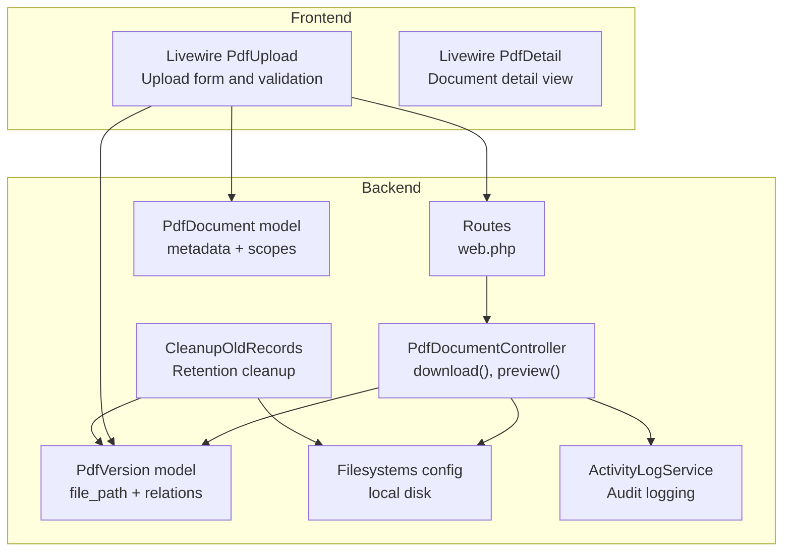
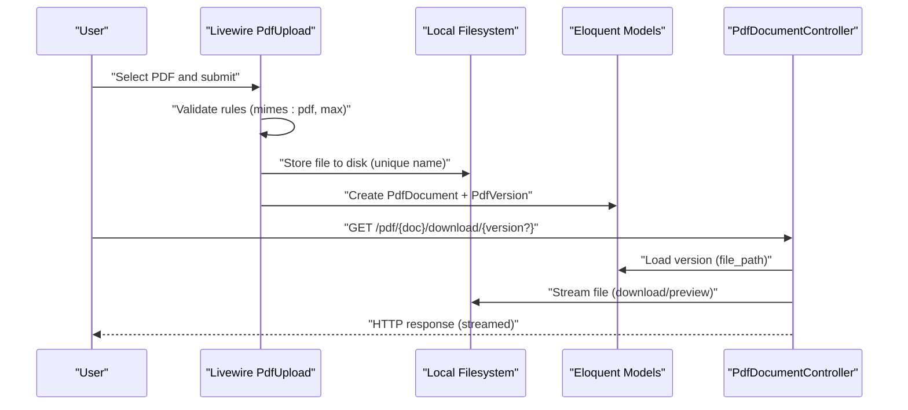
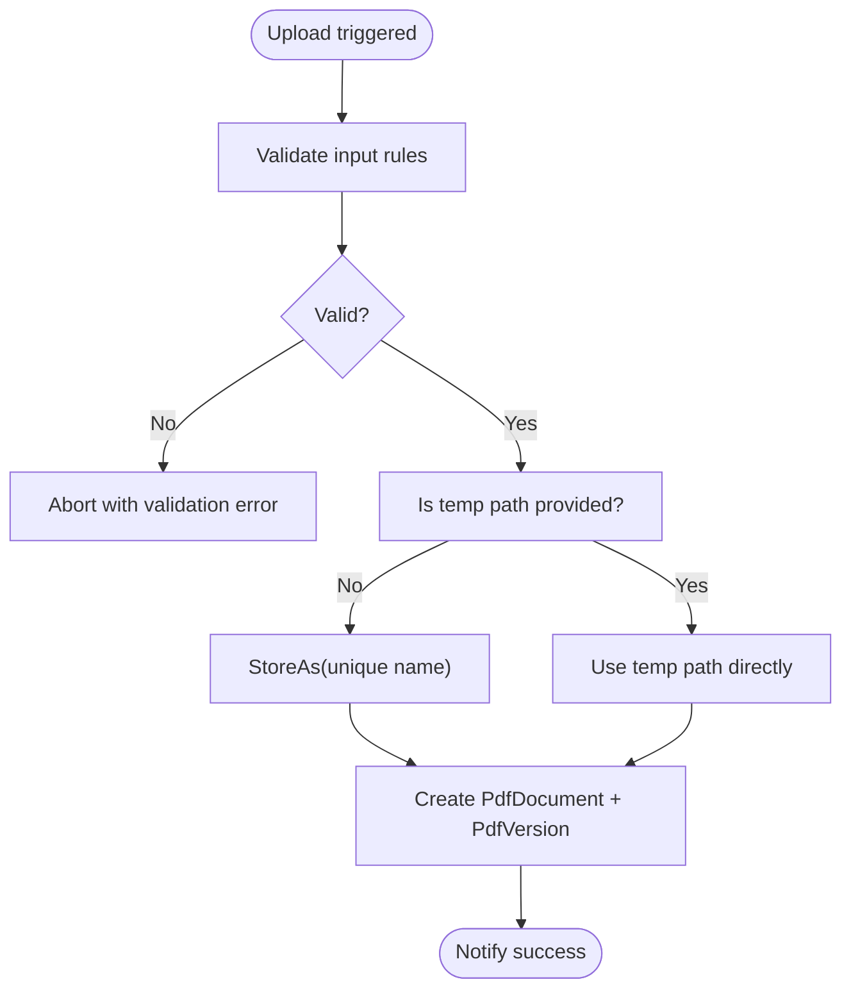
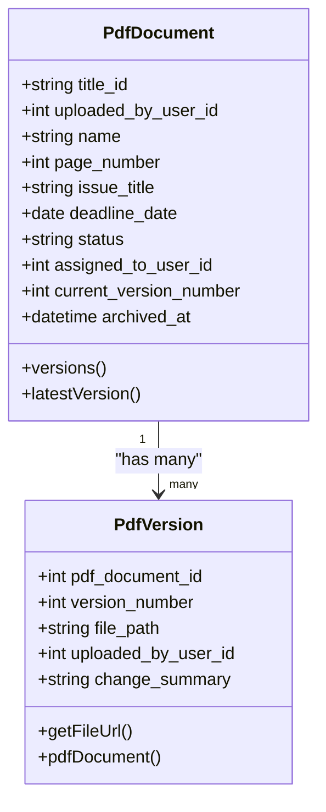
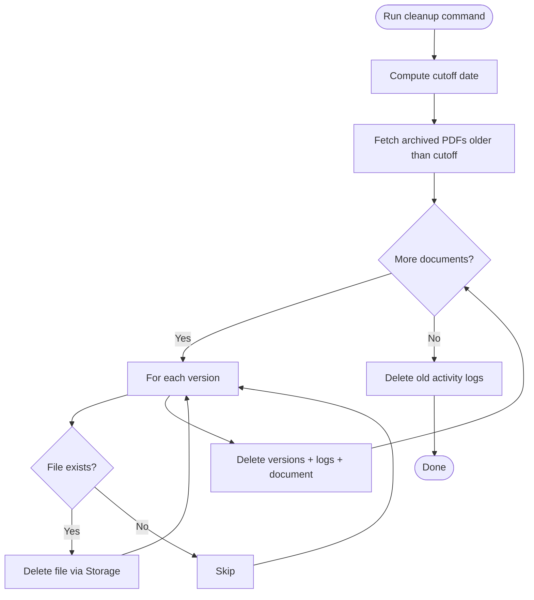
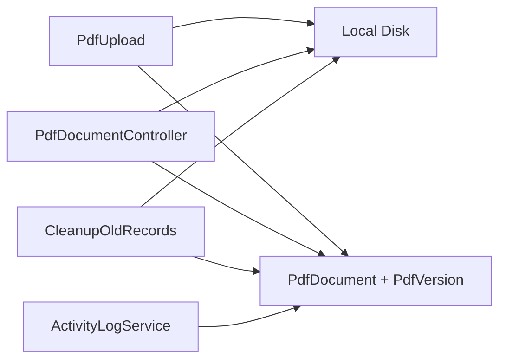

# File Processing Optimization

<cite>
**Referenced Files in This Document**
- [PdfUpload.php](file://pdf-korektura/app/Livewire/PdfUpload.php)
- [PdfDocumentController.php](file://pdf-korektura/app/Http/Controllers/PdfDocumentController.php)
- [PdfDocument.php](file://pdf-korektura/app/Models/PdfDocument.php)
- [PdfVersion.php](file://pdf-korektura/app/Models/PdfVersion.php)
- [CleanupOldRecords.php](file://pdf-korektura/app/Console/Commands/CleanupOldRecords.php)
- [filesystems.php](file://pdf-korektura/config/filesystems.php)
- [web.php](file://pdf-korektura/routes/web.php)
- [ActivityLogService.php](file://pdf-korektura/app/Services/ActivityLogService.php)
</cite>

## Table of Contents
1. [Introduction](#introduction)
2. [Project Structure](#project-structure)
3. [Core Components](#core-components)
4. [Architecture Overview](#architecture-overview)
5. [Detailed Component Analysis](#detailed-component-analysis)
6. [Dependency Analysis](#dependency-analysis)
7. [Performance Considerations](#performance-considerations)
8. [Troubleshooting Guide](#troubleshooting-guide)
9. [Conclusion](#conclusion)
10. [Appendices](#appendices)

## Introduction
This document provides a comprehensive guide to optimizing file processing for PDF handling in the system. It focuses on efficient upload strategies, temporary file lifecycle, streaming and memory-efficient downloads, storage optimization, concurrency safeguards, validation and sanitization, file system performance tuning, and backup/restore strategies for large file collections.

## Project Structure
The PDF handling pipeline spans Livewire components for uploads, Eloquent models for metadata, controllers for streaming downloads and previews, a filesystem configuration for local storage, routing for endpoints, and a cleanup command for archival retention and disk hygiene.

**Diagram sources**
- [web.php:38-41](file://pdf-korektura/routes/web.php#L38-L41)
- [PdfDocumentController.php:15-63](file://pdf-korektura/app/Http/Controllers/PdfDocumentController.php#L15-L63)
- [PdfUpload.php:52-93](file://pdf-korektura/app/Livewire/PdfUpload.php#L52-L93)
- [PdfDocument.php:19-39](file://pdf-korektura/app/Models/PdfDocument.php#L19-L39)
- [PdfVersion.php:13-26](file://pdf-korektura/app/Models/PdfVersion.php#L13-L26)
- [filesystems.php:4-22](file://pdf-korektura/config/filesystems.php#L4-L22)
- [CleanupOldRecords.php:16-45](file://pdf-korektura/app/Console/Commands/CleanupOldRecords.php#L16-L45)
- [ActivityLogService.php:20-29](file://pdf-korektura/app/Services/ActivityLogService.php#L20-L29)

**Section sources**
- [web.php:38-41](file://pdf-korektura/routes/web.php#L38-L41)
- [PdfDocumentController.php:15-63](file://pdf-korektura/app/Http/Controllers/PdfDocumentController.php#L15-L63)
- [PdfUpload.php:52-93](file://pdf-korektura/app/Livewire/PdfUpload.php#L52-L93)
- [PdfDocument.php:19-39](file://pdf-korektura/app/Models/PdfDocument.php#L19-L39)
- [PdfVersion.php:13-26](file://pdf-korektura/app/Models/PdfVersion.php#L13-L26)
- [filesystems.php:4-22](file://pdf-korektura/config/filesystems.php#L4-L22)
- [CleanupOldRecords.php:16-45](file://pdf-korektura/app/Console/Commands/CleanupOldRecords.php#L16-L45)
- [ActivityLogService.php:20-29](file://pdf-korektura/app/Services/ActivityLogService.php#L20-L29)

## Core Components
- Upload surface: Livewire component validates and persists the PDF to a local disk path, then creates document/version metadata.
- Download/preview: Controller streams files directly from storage to avoid loading entire files into memory.
- Metadata models: Track document lifecycle, versions, and file paths.
- Filesystem: Local disk configured for storage under storage/app.
- Retention cleanup: Console command removes archived old records and their files.
- Audit logging: Service records user actions for compliance and diagnostics.

**Section sources**
- [PdfUpload.php:32-39](file://pdf-korektura/app/Livewire/PdfUpload.php#L32-L39)
- [PdfUpload.php:52-93](file://pdf-korektura/app/Livewire/PdfUpload.php#L52-L93)
- [PdfDocumentController.php:15-63](file://pdf-korektura/app/Http/Controllers/PdfDocumentController.php#L15-L63)
- [PdfDocument.php:19-39](file://pdf-korektura/app/Models/PdfDocument.php#L19-L39)
- [PdfVersion.php:13-26](file://pdf-korektura/app/Models/PdfVersion.php#L13-L26)
- [filesystems.php:4-22](file://pdf-korektura/config/filesystems.php#L4-L22)
- [CleanupOldRecords.php:16-45](file://pdf-korektura/app/Console/Commands/CleanupOldRecords.php#L16-L45)
- [ActivityLogService.php:20-29](file://pdf-korektura/app/Services/ActivityLogService.php#L20-L29)

## Architecture Overview
The system separates concerns across upload, metadata persistence, and streaming delivery. Uploads leverage Livewire’s temporary file handling and store the file on the local filesystem. Downloads and previews stream content directly from storage to reduce memory footprint.

**Diagram sources**
- [PdfUpload.php:32-39](file://pdf-korektura/app/Livewire/PdfUpload.php#L32-L39)
- [PdfUpload.php:52-93](file://pdf-korektura/app/Livewire/PdfUpload.php#L52-L93)
- [PdfDocumentController.php:15-63](file://pdf-korektura/app/Http/Controllers/PdfDocumentController.php#L15-L63)
- [PdfVersion.php:38-41](file://pdf-korektura/app/Models/PdfVersion.php#L38-L41)
- [filesystems.php:4-22](file://pdf-korektura/config/filesystems.php#L4-L22)

## Detailed Component Analysis

### Upload Pipeline and Temporary File Management
- Validation: Enforces PDF mime type and maximum size to prevent oversized uploads.
- Temporary handling: Supports both Livewire’s temporary file path and direct TemporaryUploadedFile storage.
- Naming: Generates a unique file name to avoid collisions and simplify deduplication later.
- Persistence: Stores file path in PdfVersion and creates PdfDocument metadata.
- Cleanup: Temporary files are managed by Livewire; permanent cleanup occurs via retention policies.

**Diagram sources**
- [PdfUpload.php:32-39](file://pdf-korektura/app/Livewire/PdfUpload.php#L32-L39)
- [PdfUpload.php:52-93](file://pdf-korektura/app/Livewire/PdfUpload.php#L52-L93)

**Section sources**
- [PdfUpload.php:32-39](file://pdf-korektura/app/Livewire/PdfUpload.php#L32-L39)
- [PdfUpload.php:52-93](file://pdf-korektura/app/Livewire/PdfUpload.php#L52-L93)

### Streaming Downloads and Memory-Efficient Preview
- Access control: Ensures user roles can access the requested document version.
- Path resolution: Uses stored file_path to locate the file under storage_path.
- Streaming: Returns a streamed download or inline preview response to avoid loading entire PDF into memory.
- Audit: Logs download/view actions for compliance.

```mermaid
sequenceDiagram
participant U as "User"
participant R as "Route"
participant C as "PdfDocumentController"
participant DB as "PdfVersion"
participant FS as "Local Filesystem"
U->>R : "GET /pdf/{doc}/download/{version?}"
R->>C : "download()"
C->>C : "canAccess()"
C->>DB : "Resolve version (latest or specific)"
C->>FS : "Check file exists"
C-->>U : "Streamed download response"
```

**Diagram sources**
- [web.php:38-41](file://pdf-korektura/routes/web.php#L38-L41)
- [PdfDocumentController.php:15-40](file://pdf-korektura/app/Http/Controllers/PdfDocumentController.php#L15-L40)
- [PdfVersion.php:38-41](file://pdf-korektura/app/Models/PdfVersion.php#L38-L41)

**Section sources**
- [PdfDocumentController.php:15-40](file://pdf-korektura/app/Http/Controllers/PdfDocumentController.php#L15-L40)
- [PdfDocumentController.php:42-63](file://pdf-korektura/app/Http/Controllers/PdfDocumentController.php#L42-L63)
- [PdfVersion.php:38-41](file://pdf-korektura/app/Models/PdfVersion.php#L38-L41)

### Metadata Models and Versioning
- PdfDocument: Tracks document metadata, status, assignments, and current version number.
- PdfVersion: Stores per-version file_path and change summary; provides a route-based URL generator.
- Relations: PdfDocument has many versions; PdfVersion belongs to PdfDocument.

**Diagram sources**
- [PdfDocument.php:19-39](file://pdf-korektura/app/Models/PdfDocument.php#L19-L39)
- [PdfVersion.php:13-26](file://pdf-korektura/app/Models/PdfVersion.php#L13-L26)
- [PdfVersion.php:38-41](file://pdf-korektura/app/Models/PdfVersion.php#L38-L41)

**Section sources**
- [PdfDocument.php:19-39](file://pdf-korektura/app/Models/PdfDocument.php#L19-L39)
- [PdfVersion.php:13-26](file://pdf-korektura/app/Models/PdfVersion.php#L13-L26)
- [PdfVersion.php:38-41](file://pdf-korektura/app/Models/PdfVersion.php#L38-L41)

### Retention and Cleanup
- Retention policy: Removes archived documents older than a configurable threshold.
- File removal: Iterates versions and deletes files via Storage before removing records.
- Audit cleanup: Removes old activity logs beyond the cutoff date.

**Diagram sources**
- [CleanupOldRecords.php:16-45](file://pdf-korektura/app/Console/Commands/CleanupOldRecords.php#L16-L45)

**Section sources**
- [CleanupOldRecords.php:16-45](file://pdf-korektura/app/Console/Commands/CleanupOldRecords.php#L16-L45)

### Filesystem Configuration and Routing
- Disks: Local disk configured under storage_path('app'); public disk under storage_path('app/public').
- Routes: Expose download and preview endpoints for PDF versions.

**Section sources**
- [filesystems.php:4-22](file://pdf-korektura/config/filesystems.php#L4-L22)
- [web.php:38-41](file://pdf-korektura/routes/web.php#L38-L41)

## Dependency Analysis
- Upload depends on Livewire validation and local filesystem storage.
- Controller depends on PdfVersion for file_path and on Storage for existence checks.
- Models encapsulate metadata and relationships; controllers enforce access rules.
- Cleanup depends on Storage to remove files and on Eloquent to delete records.

**Diagram sources**
- [PdfUpload.php:52-93](file://pdf-korektura/app/Livewire/PdfUpload.php#L52-L93)
- [PdfDocumentController.php:15-63](file://pdf-korektura/app/Http/Controllers/PdfDocumentController.php#L15-L63)
- [CleanupOldRecords.php:16-45](file://pdf-korektura/app/Console/Commands/CleanupOldRecords.php#L16-L45)
- [ActivityLogService.php:20-29](file://pdf-korektura/app/Services/ActivityLogService.php#L20-L29)

**Section sources**
- [PdfUpload.php:52-93](file://pdf-korektura/app/Livewire/PdfUpload.php#L52-L93)
- [PdfDocumentController.php:15-63](file://pdf-korektura/app/Http/Controllers/PdfDocumentController.php#L15-L63)
- [CleanupOldRecords.php:16-45](file://pdf-korektura/app/Console/Commands/CleanupOldRecords.php#L16-L45)
- [ActivityLogService.php:20-29](file://pdf-korektura/app/Services/ActivityLogService.php#L20-L29)

## Performance Considerations
- Streaming downloads: Use streamed responses to avoid loading entire PDFs into memory.
- Chunked uploads: Not implemented; consider multipart uploads with resume support for very large files.
- Compression: No compression applied during storage; consider transparent compression at ingress if bandwidth is constrained.
- Deduplication: No built-in deduplication; compare checksums to avoid storing identical files.
- Concurrency: Use database transactions for creating document/version rows and file writes to prevent partial states.
- Indexing: Ensure database indexes on PdfDocument.status, archived_at, and PdfVersion.file_path for fast cleanup and lookup.
- I/O optimization: Store on SSD-backed storage; batch cleanup operations during off-peak hours.
- Caching: Cache frequently accessed metadata; avoid caching raw binary content.

[No sources needed since this section provides general guidance]

## Troubleshooting Guide
- File not found errors: Verify file_path exists under storage_path and that permissions allow reading.
- Access denied: Confirm user role matches document ownership or assignment rules.
- Validation failures: Ensure mimes and max constraints align with client-side expectations.
- Cleanup anomalies: Confirm archived_at timestamps and that files still exist before deletion.

**Section sources**
- [PdfDocumentController.php:33-37](file://pdf-korektura/app/Http/Controllers/PdfDocumentController.php#L33-L37)
- [PdfDocumentController.php:53-55](file://pdf-korektura/app/Http/Controllers/PdfDocumentController.php#L53-L55)
- [PdfUpload.php:32-39](file://pdf-korektura/app/Livewire/PdfUpload.php#L32-L39)
- [CleanupOldRecords.php:28-33](file://pdf-korektura/app/Console/Commands/CleanupOldRecords.php#L28-L33)

## Conclusion
The system employs a clean separation between upload, metadata, and streaming delivery. To further optimize for large files and high throughput, implement chunked/resumable uploads, introduce deduplication and optional compression, strengthen concurrency controls with transactions, and schedule cleanup during low-traffic windows.

[No sources needed since this section summarizes without analyzing specific files]

## Appendices

### Appendix A: Upload Validation Rules
- PDF mime enforcement and maximum size limit ensure only valid PDFs are accepted.
- Unique naming reduces collisions and simplifies future deduplication.

**Section sources**
- [PdfUpload.php:32-39](file://pdf-korektura/app/Livewire/PdfUpload.php#L32-L39)
- [PdfUpload.php:64-66](file://pdf-korektura/app/Livewire/PdfUpload.php#L64-L66)

### Appendix B: Download Endpoint Behavior
- Resolves latest or specified version, checks file existence, and streams content.

**Section sources**
- [PdfDocumentController.php:23-40](file://pdf-korektura/app/Http/Controllers/PdfDocumentController.php#L23-L40)

### Appendix C: Retention Policy Options
- Configure retention window via command option and schedule periodic runs.

**Section sources**
- [CleanupOldRecords.php:13-14](file://pdf-korektura/app/Console/Commands/CleanupOldRecords.php#L13-L14)
- [CleanupOldRecords.php:18-42](file://pdf-korektura/app/Console/Commands/CleanupOldRecords.php#L18-L42)