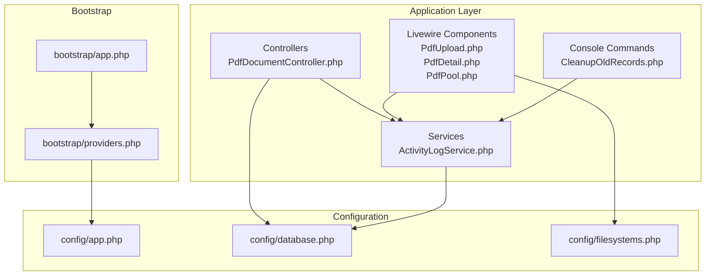
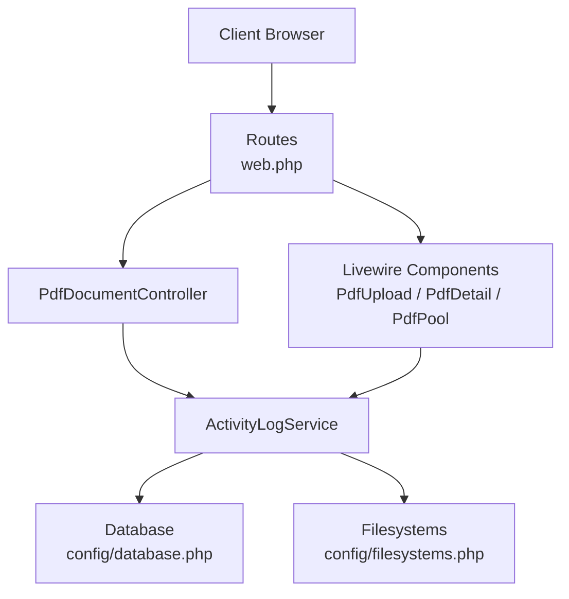
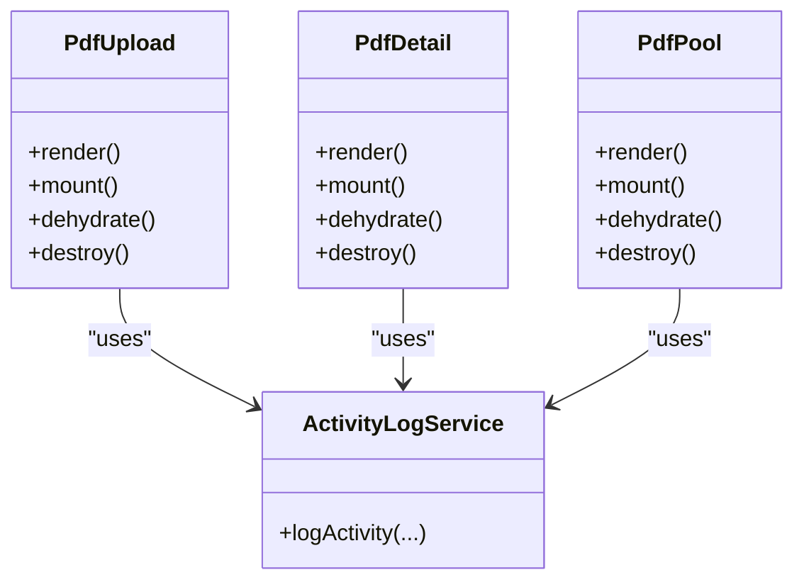
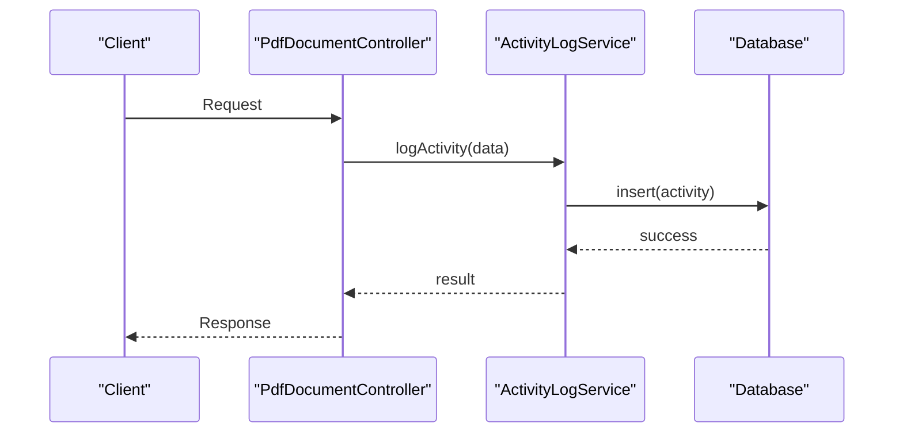
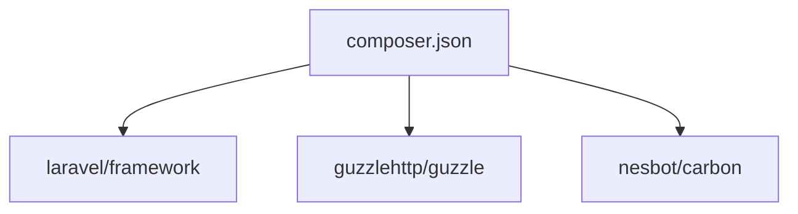

# Memory and Resource Management

<cite>
**Referenced Files in This Document**
- [composer.json](file://composer.json)
- [app.php](file://bootstrap/app.php)
- [providers.php](file://bootstrap/providers.php)
- [app.php](file://config/app.php)
- [database.php](file://config/database.php)
- [filesystems.php](file://config/filesystems.php)
- [CleanupOldRecords.php](file://app/Console/Commands/CleanupOldRecords.php)
- [PdfDocumentController.php](file://app/Http/Controllers/PdfDocumentController.php)
- [PdfUpload.php](file://app/Livewire/PdfUpload.php)
- [PdfDetail.php](file://app/Livewire/PdfDetail.php)
- [PdfPool.php](file://app/Livewire/PdfPool.php)
- [ActivityLogService.php](file://app/Services/ActivityLogService.php)
- [web.php](file://routes/web.php)
</cite>

## Table of Contents
1. [Introduction](#introduction)
2. [Project Structure](#project-structure)
3. [Core Components](#core-components)
4. [Architecture Overview](#architecture-overview)
5. [Detailed Component Analysis](#detailed-component-analysis)
6. [Dependency Analysis](#dependency-analysis)
7. [Performance Considerations](#performance-considerations)
8. [Troubleshooting Guide](#troubleshooting-guide)
9. [Conclusion](#conclusion)

## Introduction
This document provides a comprehensive guide to memory and resource management for the Laravel application. It focuses on preventing memory leaks, optimizing garbage collection, cleaning up database connections, file handles, and external API connections, managing background jobs and long-running processes, monitoring resource usage, efficient processing of large datasets, session optimization, concurrent request handling, resource pooling, and performance profiling techniques. The guidance is grounded in the application’s configuration and selected controller and Livewire components.

## Project Structure
The Laravel application follows a standard MVC layout with controllers, Livewire components, services, models, configuration files, and console commands. Key areas relevant to memory and resource management include:
- Configuration files for application, database, and filesystem settings
- Controllers handling PDF document operations
- Livewire components for upload, detail, and pool views
- A console command for cleanup tasks
- A service for activity logging

**Diagram sources**
- [PdfDocumentController.php](file://app/Http/Controllers/PdfDocumentController.php)
- [PdfUpload.php](file://app/Livewire/PdfUpload.php)
- [PdfDetail.php](file://app/Livewire/PdfDetail.php)
- [PdfPool.php](file://app/Livewire/PdfPool.php)
- [ActivityLogService.php](file://app/Services/ActivityLogService.php)
- [CleanupOldRecords.php](file://app/Console/Commands/CleanupOldRecords.php)
- [app.php](file://config/app.php)
- [database.php](file://config/database.php)
- [filesystems.php](file://config/filesystems.php)
- [app.php](file://bootstrap/app.php)
- [providers.php](file://bootstrap/providers.php)

**Section sources**
- [composer.json](file://composer.json)
- [app.php](file://bootstrap/app.php)
- [providers.php](file://bootstrap/providers.php)
- [app.php](file://config/app.php)
- [database.php](file://config/database.php)
- [filesystems.php](file://config/filesystems.php)

## Core Components
- Application configuration controls runtime behavior, including environment settings and service provider registration.
- Database configuration defines connection parameters and pooling behavior.
- Filesystems configuration governs local and temporary file storage policies.
- Controllers orchestrate HTTP requests and coordinate with services and models.
- Livewire components encapsulate interactive UI logic and lifecycle events.
- Services centralize business logic and resource-intensive operations.
- Console commands handle scheduled maintenance and cleanup tasks.

Key areas for memory management:
- Garbage collection and long-running process handling
- Resource cleanup for database connections, file handles, and external API calls
- Background job memory management
- Session management and concurrent request handling
- Resource pooling for database and external services
- Monitoring and profiling tools

**Section sources**
- [app.php](file://config/app.php)
- [database.php](file://config/database.php)
- [filesystems.php](file://config/filesystems.php)
- [PdfDocumentController.php](file://app/Http/Controllers/PdfDocumentController.php)
- [PdfUpload.php](file://app/Livewire/PdfUpload.php)
- [PdfDetail.php](file://app/Livewire/PdfDetail.php)
- [PdfPool.php](file://app/Livewire/PdfPool.php)
- [ActivityLogService.php](file://app/Services/ActivityLogService.php)
- [CleanupOldRecords.php](file://app/Console/Commands/CleanupOldRecords.php)

## Architecture Overview
The application architecture integrates HTTP controllers, Livewire components, services, and configuration-driven resource management. Controllers and Livewire components trigger service operations that may involve database queries, file I/O, and external API calls. Proper resource cleanup and pooling are essential to prevent memory leaks and optimize performance.

**Diagram sources**
- [web.php](file://routes/web.php)
- [PdfDocumentController.php](file://app/Http/Controllers/PdfDocumentController.php)
- [PdfUpload.php](file://app/Livewire/PdfUpload.php)
- [PdfDetail.php](file://app/Livewire/PdfDetail.php)
- [PdfPool.php](file://app/Livewire/PdfPool.php)
- [ActivityLogService.php](file://app/Services/ActivityLogService.php)
- [database.php](file://config/database.php)
- [filesystems.php](file://config/filesystems.php)

## Detailed Component Analysis

### Controllers: Memory and Resource Management
Controllers handle HTTP requests and often coordinate with services and models. To prevent memory leaks:
- Avoid retaining references to large collections or models after response generation.
- Use chunked processing for large datasets.
- Ensure database transactions are closed promptly.
- Dispose of temporary file handles and streams.

Recommended practices:
- Limit payload sizes and enforce timeouts.
- Use eager loading to minimize N+1 queries.
- Clear heavy variables after use.

**Section sources**
- [PdfDocumentController.php](file://app/Http/Controllers/PdfDocumentController.php)

### Livewire Components: Lifecycle and Memory
Livewire components manage state and lifecycle events. For memory efficiency:
- Reset component state in destructors or lifecycle hooks.
- Avoid storing large objects in component properties.
- Use pagination and streaming for large lists.
- Release event listeners and timers in cleanup.

**Diagram sources**
- [PdfUpload.php](file://app/Livewire/PdfUpload.php)
- [PdfDetail.php](file://app/Livewire/PdfDetail.php)
- [PdfPool.php](file://app/Livewire/PdfPool.php)
- [ActivityLogService.php](file://app/Services/ActivityLogService.php)

**Section sources**
- [PdfUpload.php](file://app/Livewire/PdfUpload.php)
- [PdfDetail.php](file://app/Livewire/PdfDetail.php)
- [PdfPool.php](file://app/Livewire/PdfPool.php)

### Services: Centralized Resource Management
Services encapsulate business logic and resource-intensive operations. Best practices:
- Encapsulate database operations with explicit transaction boundaries.
- Close file handles and streams immediately after use.
- Implement retry and timeout policies for external API calls.
- Use dependency injection to manage object lifetimes.

**Diagram sources**
- [PdfDocumentController.php](file://app/Http/Controllers/PdfDocumentController.php)
- [ActivityLogService.php](file://app/Services/ActivityLogService.php)
- [database.php](file://config/database.php)

**Section sources**
- [ActivityLogService.php](file://app/Services/ActivityLogService.php)

### Console Commands: Cleanup and Maintenance
Console commands perform scheduled cleanup tasks. For memory efficiency:
- Process records in batches.
- Free memory after each batch.
- Log progress and errors without retaining large buffers.

**Section sources**
- [CleanupOldRecords.php](file://app/Console/Commands/CleanupOldRecords.php)

### Configuration: Database and Filesystems
Configuration files define resource pools and storage policies:
- Database configuration controls connection limits, timeouts, and persistent connections.
- Filesystems configuration manages local storage and temporary directories.

Recommendations:
- Tune database pool sizes according to server capacity.
- Set appropriate timeouts for external API calls.
- Configure filesystem caching and temporary directories for optimal I/O.

**Section sources**
- [database.php](file://config/database.php)
- [filesystems.php](file://config/filesystems.php)

## Dependency Analysis
The application’s dependencies influence memory and resource consumption. Composer-managed packages include Laravel framework, Guzzle HTTP client, and Carbon date library. Understanding these dependencies helps in selecting compatible versions and avoiding memory-heavy alternatives.

**Diagram sources**
- [composer.json](file://composer.json)

**Section sources**
- [composer.json](file://composer.json)

## Performance Considerations
- Garbage collection: Use PHP’s built-in garbage collection and avoid circular references in Livewire components.
- Long-running processes: Implement timeouts and periodic checkpoints to release memory.
- Background jobs: Use queues with bounded memory and periodic restarts to prevent leaks.
- Sessions: Optimize session driver settings and reduce session payload size.
- Concurrency: Limit concurrent requests and use connection pooling for database and external APIs.
- Profiling: Use Xdebug, Blackfire, or Tideways to profile memory usage and identify hotspots.

[No sources needed since this section provides general guidance]

## Troubleshooting Guide
Common memory-related issues and resolutions:
- Memory spikes during file uploads: Stream uploads and process in chunks; dispose of temporary files promptly.
- Database memory growth: Use pagination, limit result sets, and close transactions after use.
- External API memory issues: Implement timeouts, retries, and resource cleanup after requests.
- Livewire state bloat: Reset component state in lifecycle hooks and avoid storing large objects in properties.
- Console command memory leaks: Process records in batches and free memory after each iteration.

**Section sources**
- [PdfUpload.php](file://app/Livewire/PdfUpload.php)
- [PdfDetail.php](file://app/Livewire/PdfDetail.php)
- [PdfPool.php](file://app/Livewire/PdfPool.php)
- [CleanupOldRecords.php](file://app/Console/Commands/CleanupOldRecords.php)

## Conclusion
Effective memory and resource management in Laravel requires attention to configuration, component lifecycle, service design, and operational practices. By applying the techniques outlined—such as chunked processing, proper cleanup, pooling, and monitoring—you can prevent memory leaks, optimize garbage collection, and maintain stable performance under load.