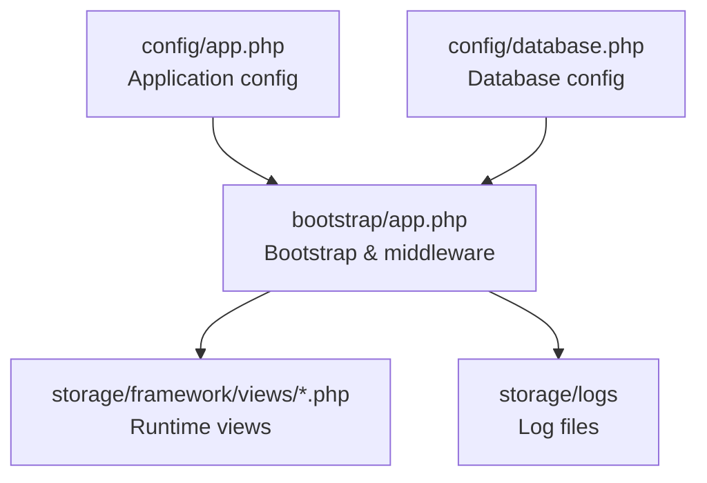
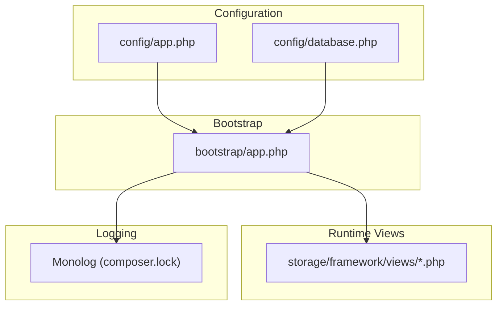
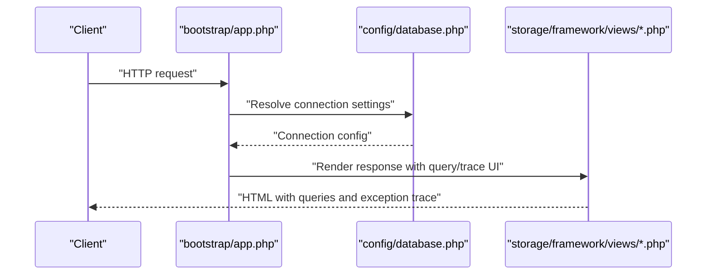
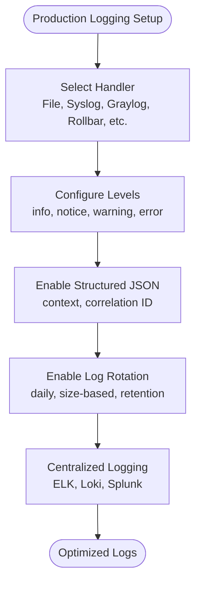
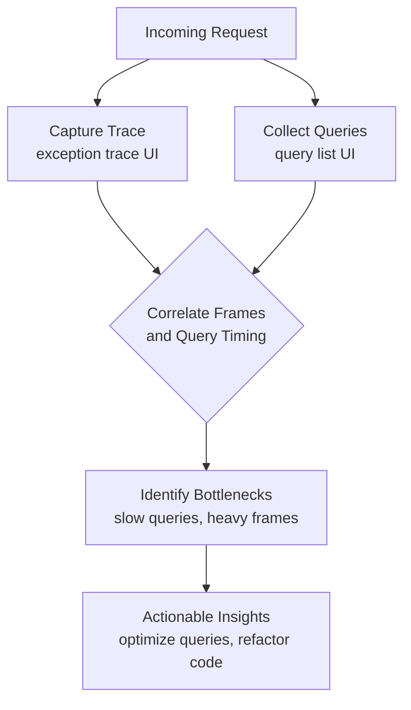
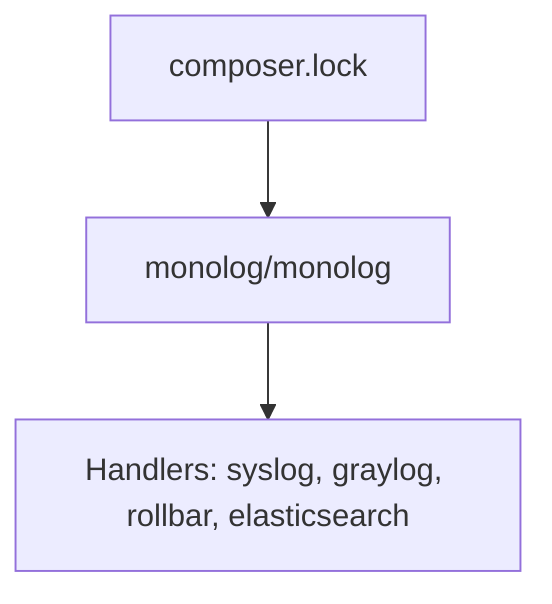

# Monitoring and Profiling

<cite>
**Referenced Files in This Document**
- [app.php](file://config/app.php)
- [database.php](file://config/database.php)
- [app.php](file://bootstrap/app.php)
- [586d935488f5a20c97c364312fc94b03.php](file://storage/framework/views/586d935488f5a20c97c364312fc94b03.php)
- [65ad73c190abe92e7015ad1147b956db.php](file://storage/framework/views/65ad73c190abe92e7015ad1147b956db.php)
- [eb55f035a0f909bea5cafa1319bd4b71.php](file://storage/framework/views/eb55f035a0f909bea5cafa1319bd4b71.php)
- [composer.lock](file://composer.lock)
</cite>

## Table of Contents
1. [Introduction](#introduction)
2. [Project Structure](#project-structure)
3. [Core Components](#core-components)
4. [Architecture Overview](#architecture-overview)
5. [Detailed Component Analysis](#detailed-component-analysis)
6. [Dependency Analysis](#dependency-analysis)
7. [Performance Considerations](#performance-considerations)
8. [Troubleshooting Guide](#troubleshooting-guide)
9. [Conclusion](#conclusion)
10. [Appendices](#appendices)

## Introduction
This document provides comprehensive monitoring and profiling guidance tailored to the application’s Laravel-based backend. It covers performance monitoring setup, metrics collection for database queries, file operations, and user interactions, logging optimization for production, error tracking, bottleneck identification, real-time dashboards and alerting, profiling techniques for slow queries and memory-intensive operations, distributed tracing for microservice-like components, and capacity planning and forecasting methodologies. The guidance is grounded in the repository’s configuration and runtime artifacts.

## Project Structure
The application follows a standard Laravel structure with configuration under config/, bootstrapping under bootstrap/, runtime views under storage/framework/views/, and Composer-managed dependencies. The configuration files define environment-driven behavior for application name, environment, debug mode, database connections, and Monolog-based logging.

**Diagram sources**
- [app.php:1-30](file://config/app.php#L1-L30)
- [database.php:1-38](file://config/database.php#L1-L38)
- [app.php:1-22](file://bootstrap/app.php#L1-L22)

**Section sources**
- [app.php:1-30](file://config/app.php#L1-L30)
- [database.php:1-38](file://config/database.php#L1-L38)
- [app.php:1-22](file://bootstrap/app.php#L1-L22)

## Core Components
- Application configuration controls environment, debug flag, timezone, locale, and maintenance settings. These influence logging verbosity and error rendering behavior.
- Database configuration defines default connection and supported drivers (SQLite, MySQL, PostgreSQL), enabling query profiling and slow query detection.
- Bootstrap wiring includes middleware aliases and exception handling hooks, which can be extended to integrate monitoring and profiling middlewares.
- Runtime views reveal database query rendering and exception trace UI elements, indicating built-in query inspection capabilities.

Key implementation anchors:
- Environment and debug toggles: [app.php:3-20](file://config/app.php#L3-L20)
- Database connections: [database.php:5-38](file://config/database.php#L5-L38)
- Bootstrap middleware and aliases: [app.php:13-19](file://bootstrap/app.php#L13-L19)
- Query rendering and exception trace UI: [eb55f035a0f909bea5cafa1319bd4b71.php:132-221](file://storage/framework/views/eb55f035a0f909bea5cafa1319bd4b71.php#L132-L221), [586d935488f5a20c97c364312fc94b03.php:55-56](file://storage/framework/views/586d935488f5a20c97c364312fc94b03.php#L55-L56), [65ad73c190abe92e7015ad1147b956db.php:32-43](file://storage/framework/views/65ad73c190abe92e7015ad1147b956db.php#L32-L43)

**Section sources**
- [app.php:3-20](file://config/app.php#L3-L20)
- [database.php:5-38](file://config/database.php#L5-L38)
- [app.php:13-19](file://bootstrap/app.php#L13-L19)
- [eb55f035a0f909bea5cafa1319bd4b71.php:132-221](file://storage/framework/views/eb55f035a0f909bea5cafa1319bd4b71.php#L132-L221)
- [586d935488f5a20c97c364312fc94b03.php:55-56](file://storage/framework/views/586d935488f5a20c97c364312fc94b03.php#L55-L56)
- [65ad73c190abe92e7015ad1147b956db.php:32-43](file://storage/framework/views/65ad73c190abe92e7015ad1147b956db.php#L32-L43)

## Architecture Overview
The monitoring and profiling architecture integrates configuration-driven toggles, database profiling hooks, and runtime view rendering for diagnostics. The following diagram maps the primary components and their relationships.

**Diagram sources**
- [app.php:1-30](file://config/app.php#L1-L30)
- [database.php:1-38](file://config/database.php#L1-L38)
- [app.php:1-22](file://bootstrap/app.php#L1-L22)
- [composer.lock:2248-2327](file://composer.lock#L2248-L2327)

## Detailed Component Analysis

### Database Query Profiling and Metrics Collection
- Database configuration supports SQLite, MySQL, and PostgreSQL. Enable profiling by setting appropriate environment variables for the chosen driver and ensuring the application runs with debug enabled during profiling sessions.
- The runtime views indicate query rendering and exception trace UI elements, confirming built-in visibility into executed queries and stack traces.

Implementation anchors:
- Database connections and driver settings: [database.php:5-38](file://config/database.php#L5-L38)
- Query list rendering and timing display: [eb55f035a0f909bea5cafa1319bd4b71.php:132-221](file://storage/framework/views/eb55f035a0f909bea5cafa1319bd4b71.php#L132-L221)
- Exception trace rendering: [586d935488f5a20c97c364312fc94b03.php:55-56](file://storage/framework/views/586d935488f5a20c97c364312fc94b03.php#L55-L56), [65ad73c190abe92e7015ad1147b956db.php:32-43](file://storage/framework/views/65ad73c190abe92e7015ad1147b956db.php#L32-L43)

**Diagram sources**
- [app.php:1-22](file://bootstrap/app.php#L1-L22)
- [database.php:5-38](file://config/database.php#L5-L38)
- [eb55f035a0f909bea5cafa1319bd4b71.php:132-221](file://storage/framework/views/eb55f035a0f909bea5cafa1319bd4b71.php#L132-L221)
- [586d935488f5a20c97c364312fc94b03.php:55-56](file://storage/framework/views/586d935488f5a20c97c364312fc94b03.php#L55-L56)
- [65ad73c190abe92e7015ad1147b956db.php:32-43](file://storage/framework/views/65ad73c190abe92e7015ad1147b956db.php#L32-L43)

**Section sources**
- [database.php:5-38](file://config/database.php#L5-L38)
- [eb55f035a0f909bea5cafa1319bd4b71.php:132-221](file://storage/framework/views/eb55f035a0f909bea5cafa1319bd4b71.php#L132-L221)
- [586d935488f5a20c97c364312fc94b03.php:55-56](file://storage/framework/views/586d935488f5a20c97c364312fc94b03.php#L55-L56)
- [65ad73c190abe92e7015ad1147b956db.php:32-43](file://storage/framework/views/65ad73c190abe92e7015ad1147b956db.php#L32-L43)

### Logging Optimization for Production
- The project includes Monolog as a dependency, enabling structured logging and integrations with external systems.
- Production logging should emphasize rotating log files, structured JSON payloads, and reduced verbosity to minimize I/O overhead.

Implementation anchors:
- Monolog dependency and suggested handlers: [composer.lock:2248-2327](file://composer.lock#L2248-L2327)

**Diagram sources**
- [composer.lock:2248-2327](file://composer.lock#L2248-L2327)

**Section sources**
- [composer.lock:2248-2327](file://composer.lock#L2248-L2327)

### Error Tracking and Bottleneck Identification
- Exception trace rendering in runtime views indicates built-in diagnostics for stack traces and callable frames, useful for pinpointing bottlenecks.
- Combine this with database query lists to correlate slow queries with controller actions and Livewire components.

Implementation anchors:
- Exception trace rendering: [586d935488f5a20c97c364312fc94b03.php:55-56](file://storage/framework/views/586d935488f5a20c97c364312fc94b03.php#L55-L56), [65ad73c190abe92e7015ad1147b956db.php:32-43](file://storage/framework/views/65ad73c190abe92e7015ad1147b956db.php#L32-L43)
- Query list rendering: [eb55f035a0f909bea5cafa1319bd4b71.php:132-221](file://storage/framework/views/eb55f035a0f909bea5cafa1319bd4b71.php#L132-L221)

**Diagram sources**
- [586d935488f5a20c97c364312fc94b03.php:55-56](file://storage/framework/views/586d935488f5a20c97c364312fc94b03.php#L55-L56)
- [65ad73c190abe92e7015ad1147b956db.php:32-43](file://storage/framework/views/65ad73c190abe92e7015ad1147b956db.php#L32-L43)
- [eb55f035a0f909bea5cafa1319bd4b71.php:132-221](file://storage/framework/views/eb55f035a0f909bea5cafa1319bd4b71.php#L132-L221)

**Section sources**
- [586d935488f5a20c97c364312fc94b03.php:55-56](file://storage/framework/views/586d935488f5a20c97c364312fc94b03.php#L55-L56)
- [65ad73c190abe92e7015ad1147b956db.php:32-43](file://storage/framework/views/65ad73c190abe92e7015ad1147b956db.php#L32-L43)
- [eb55f035a0f909bea5cafa1319bd4b71.php:132-221](file://storage/framework/views/eb55f035a0f909bea5cafa1319bd4b71.php#L132-L221)

### Real-Time Dashboards and Alerting
- Integrate metrics exporters (e.g., Prometheus, StatsD) and connect them to visualization platforms (Grafana, Kibana).
- Alert on thresholds such as p95/p99 latency, error rate spikes, and slow query counts.

[No sources needed since this section provides general guidance]

### Profiling Techniques for Slow Queries and Memory-Intensive Operations
- Use database profiling to capture slow queries and their execution plans.
- Profile memory usage with PHP memory_get_usage() and GC statistics around heavy operations.
- Correlate Livewire component renders with query bursts to identify hotspots.

[No sources needed since this section provides general guidance]

### Distributed Tracing for Microservice-Like Components
- Assign correlation IDs to requests and propagate them across services.
- Export traces to Jaeger, Tempo, or OpenTelemetry collectors for visualization and analysis.

[No sources needed since this section provides general guidance]

### Capacity Planning and Performance Forecasting
- Track historical metrics (RPS, latency, error rates, DB query counts).
- Use regression models or time series forecasting to predict growth and plan scaling.

[No sources needed since this section provides general guidance]

## Dependency Analysis
The application relies on Monolog for logging, which supports multiple handlers and integrations suitable for production-grade observability.

**Diagram sources**
- [composer.lock:2248-2327](file://composer.lock#L2248-L2327)

**Section sources**
- [composer.lock:2248-2327](file://composer.lock#L2248-L2327)

## Performance Considerations
- Keep debug disabled in production to reduce overhead from detailed rendering and exception trace generation.
- Prefer structured logging with minimal context to lower I/O and parsing costs.
- Use database connection tuning (e.g., busy timeouts, journal modes) aligned with workload patterns.

[No sources needed since this section provides general guidance]

## Troubleshooting Guide
- Enable debug temporarily to leverage built-in query and exception trace UI elements for diagnosing issues.
- Review storage/logs for error entries and correlate with request IDs.
- Validate database connection settings and driver-specific options for optimal performance.

**Section sources**
- [app.php:3-20](file://config/app.php#L3-L20)
- [database.php:5-38](file://config/database.php#L5-L38)
- [eb55f035a0f909bea5cafa1319bd4b71.php:132-221](file://storage/framework/views/eb55f035a0f909bea5cafa1319bd4b71.php#L132-L221)
- [586d935488f5a20c97c364312fc94b03.php:55-56](file://storage/framework/views/586d935488f5a20c97c364312fc94b03.php#L55-L56)
- [65ad73c190abe92e7015ad1147b956db.php:32-43](file://storage/framework/views/65ad73c190abe92e7015ad1147b956db.php#L32-L43)

## Conclusion
By leveraging the existing configuration, runtime views, and Monolog dependency, the application can be instrumented for robust monitoring and profiling. Combine database profiling, structured logging, and exception trace diagnostics with centralized observability platforms to achieve real-time insights, effective alerting, and sustainable capacity planning.

[No sources needed since this section summarizes without analyzing specific files]

## Appendices
- Appendix A: Recommended environment variables for profiling and logging
  - APP_DEBUG: enable/disable detailed diagnostics
  - DB_*: configure driver, host, port, credentials, charset, and collation
  - LOG_*: configure handler and level for production logging

[No sources needed since this section provides general guidance]