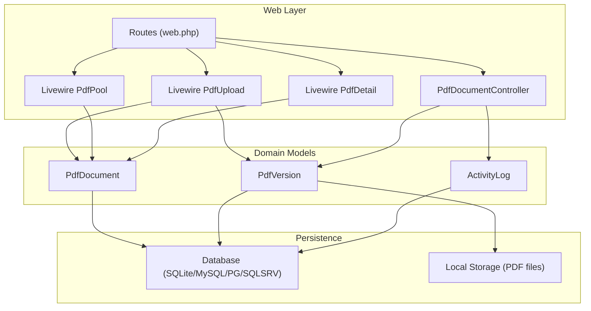
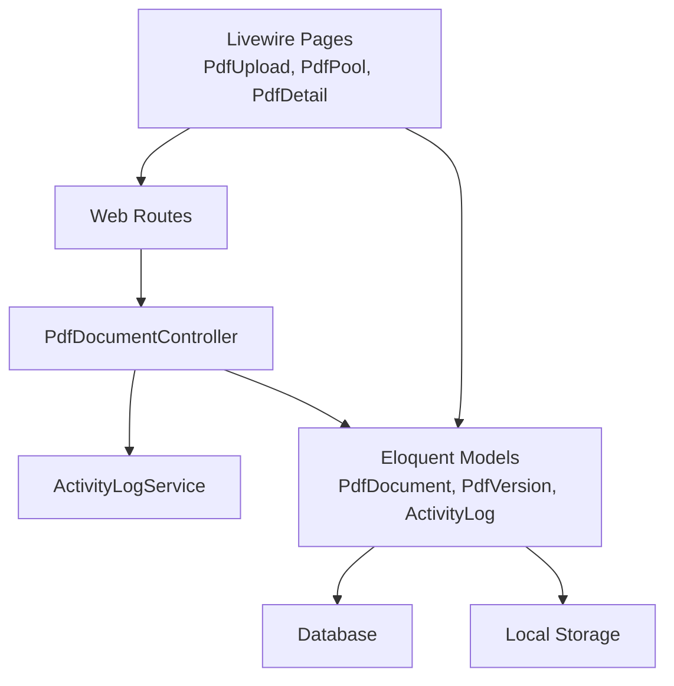
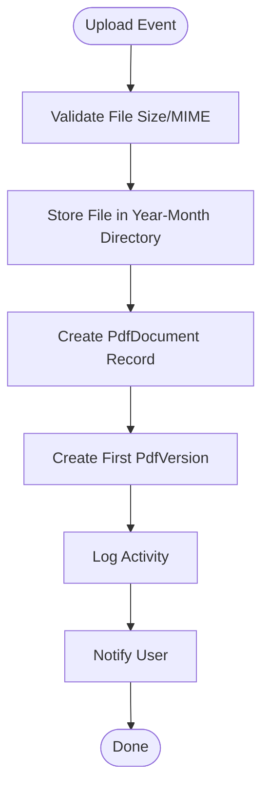
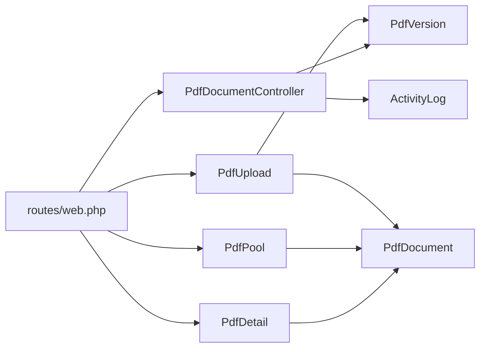

# Performance Optimization

<cite>
**Referenced Files in This Document**
- [composer.json](file://composer.json)
- [config/database.php](file://config/database.php)
- [database/migrations/2024_06_10_120000_create_pdf_documents_table.php](file://database/migrations/2024_06_10_120000_create_pdf_documents_table.php)
- [database/migrations/2024_06_10_130000_create_pdf_versions_table.php](file://database/migrations/2024_06_10_130000_create_pdf_versions_table.php)
- [app/Models/PdfDocument.php](file://app/Models/PdfDocument.php)
- [app/Models/PdfVersion.php](file://app/Models/PdfVersion.php)
- [app/Models/ActivityLog.php](file://app/Models/ActivityLog.php)
- [app/Http/Controllers/PdfDocumentController.php](file://app/Http/Controllers/PdfDocumentController.php)
- [routes/web.php](file://routes/web.php)
- [app/Livewire/PdfUpload.php](file://app/Livewire/PdfUpload.php)
- [app/Livewire/PdfPool.php](file://app/Livewire/PdfPool.php)
- [app/Livewire/PdfDetail.php](file://app/Livewire/PdfDetail.php)
- [app/Console/Commands/CleanupOldRecords.php](file://app/Console/Commands/CleanupOldRecords.php)
- [app/Services/ActivityLogService.php](file://app/Services/ActivityLogService.php)
</cite>

## Table of Contents
1. [Introduction](#introduction)
2. [Project Structure](#project-structure)
3. [Core Components](#core-components)
4. [Architecture Overview](#architecture-overview)
5. [Detailed Component Analysis](#detailed-component-analysis)
6. [Dependency Analysis](#dependency-analysis)
7. [Performance Considerations](#performance-considerations)
8. [Troubleshooting Guide](#troubleshooting-guide)
9. [Conclusion](#conclusion)
10. [Appendices](#appendices)

## Introduction
This document provides a comprehensive performance optimization guide for the PDF correction system. It focuses on database optimization, caching strategies, file processing and batch operations, memory management, performance monitoring and profiling, background job processing, scaling and load balancing, and performance testing/benchmarking. The guidance is grounded in the current codebase and leverages Laravel/Eloquent patterns present in the repository.

## Project Structure
The system is a Laravel application with Eloquent models, Livewire components, controllers, and scheduled maintenance commands. The primary domain entities are PDF documents and versions, with supporting entities for titles, users, and activity logging. Routes expose endpoints for upload, preview, and download, while Livewire pages manage UI flows.

**Diagram sources**
- [routes/web.php:1-54](file://routes/web.php#L1-L54)
- [app/Http/Controllers/PdfDocumentController.php:1-82](file://app/Http/Controllers/PdfDocumentController.php#L1-L82)
- [app/Livewire/PdfUpload.php:1-96](file://app/Livewire/PdfUpload.php#L1-L96)
- [app/Livewire/PdfPool.php:1-67](file://app/Livewire/PdfPool.php#L1-L67)
- [app/Livewire/PdfDetail.php:1-24](file://app/Livewire/PdfDetail.php#L1-L24)
- [app/Models/PdfDocument.php:1-130](file://app/Models/PdfDocument.php#L1-L130)
- [app/Models/PdfVersion.php:1-43](file://app/Models/PdfVersion.php#L1-L43)
- [app/Models/ActivityLog.php:1-60](file://app/Models/ActivityLog.php#L1-L60)

**Section sources**
- [routes/web.php:1-54](file://routes/web.php#L1-L54)
- [composer.json:1-70](file://composer.json#L1-L70)
- [config/database.php:1-93](file://config/database.php#L1-L93)

## Core Components
- PdfDocument model encapsulates document metadata, status lifecycle, and relationships to versions and activity logs. Scopes support filtering by assignment and archival state.
- PdfVersion model stores versioned file paths and links to the parent document and uploader.
- ActivityLogService centralizes logging of user actions for auditability.
- PdfDocumentController handles preview and download of PDF versions with access checks and file existence verification.
- Livewire components (PdfUpload, PdfPool, PdfDetail) drive UI interactions, including pagination and eager loading of relations.
- CleanupOldRecords command performs periodic cleanup of archived documents, versions, and related logs.

**Section sources**
- [app/Models/PdfDocument.php:1-130](file://app/Models/PdfDocument.php#L1-L130)
- [app/Models/PdfVersion.php:1-43](file://app/Models/PdfVersion.php#L1-L43)
- [app/Services/ActivityLogService.php:1-31](file://app/Services/ActivityLogService.php#L1-L31)
- [app/Http/Controllers/PdfDocumentController.php:1-82](file://app/Http/Controllers/PdfDocumentController.php#L1-L82)
- [app/Livewire/PdfUpload.php:1-96](file://app/Livewire/PdfUpload.php#L1-L96)
- [app/Livewire/PdfPool.php:1-67](file://app/Livewire/PdfPool.php#L1-L67)
- [app/Livewire/PdfDetail.php:1-24](file://app/Livewire/PdfDetail.php#L1-L24)
- [app/Console/Commands/CleanupOldRecords.php:1-47](file://app/Console/Commands/CleanupOldRecords.php#L1-L47)

## Architecture Overview
The system follows a layered architecture:
- Presentation: Web routes and Livewire components.
- Application: Controllers and services.
- Domain: Eloquent models with scopes and relationships.
- Persistence: Database and local filesystem for PDF storage.

**Diagram sources**
- [routes/web.php:1-54](file://routes/web.php#L1-L54)
- [app/Http/Controllers/PdfDocumentController.php:1-82](file://app/Http/Controllers/PdfDocumentController.php#L1-L82)
- [app/Services/ActivityLogService.php:1-31](file://app/Services/ActivityLogService.php#L1-L31)
- [app/Models/PdfDocument.php:1-130](file://app/Models/PdfDocument.php#L1-L130)
- [app/Models/PdfVersion.php:1-43](file://app/Models/PdfVersion.php#L1-L43)
- [app/Models/ActivityLog.php:1-60](file://app/Models/ActivityLog.php#L1-L60)

## Detailed Component Analysis

### Database Optimization
- Indexing strategies:
  - Primary keys are auto-incremented integers; ensure foreign keys are indexed implicitly by constraints.
  - Add composite unique index on pdf_versions(pdf_document_id, version_number) to enforce uniqueness efficiently.
  - Consider adding indexes on frequently filtered columns:
    - pdf_documents(title_id, status, archived_at) for pool and archive queries.
    - pdf_documents(assigned_to_user_id, status) for proofreader assignment views.
    - activity_logs(pdf_document_id, created_at) for audit trails and recent activity.
- Query optimization:
  - Use select only required columns in paginated lists (PdfPool).
  - Apply scopes judiciously; ensure filters are covered by indexes.
  - Avoid N+1 queries by eager loading relations (PdfDetail uses load with relations).
- Data types and casting:
  - Integer and date casts reduce overhead and improve sorting performance.
- Connection tuning:
  - Configure connection-specific settings (busy_timeout, journal_mode, synchronous) per environment.
  - Enable persistent connections for Redis where applicable.

**Section sources**
- [database/migrations/2024_06_10_130000_create_pdf_versions_table.php:1-29](file://database/migrations/2024_06_10_130000_create_pdf_versions_table.php#L1-L29)
- [app/Models/PdfDocument.php:72-96](file://app/Models/PdfDocument.php#L72-L96)
- [app/Models/PdfDetail.php:14-17](file://app/Livewire/PdfDetail.php#L14-L17)
- [config/database.php:68-91](file://config/database.php#L68-L91)

### Caching Strategies
- Application-level caching:
  - Cache frequently accessed titles and lookup data to reduce repeated DB hits.
  - Use cache tags or prefixes to invalidate groups (e.g., titles).
- Redis-backed cache:
  - Leverage configured cache database for short-lived computed results (e.g., counts, stats).
  - Store session data on Redis for horizontal scalability.
- HTTP-level caching:
  - Add appropriate Cache-Control headers for static assets and immutable previews.
- Cache invalidation:
  - Invalidate caches on write operations (e.g., title updates, document status changes).

**Section sources**
- [config/database.php:68-91](file://config/database.php#L68-L91)
- [app/Livewire/PdfUpload.php:89-94](file://app/Livewire/PdfUpload.php#L89-L94)
- [app/Livewire/PdfPool.php:41-65](file://app/Livewire/PdfPool.php#L41-L65)

### File Processing and Batch Operations
- Upload pipeline:
  - Validate file size and MIME type before storing.
  - Store files in organized directories by title and year-month to prevent filesystem bottlenecks.
- Preview/download:
  - Verify file existence before serving to avoid unnecessary work.
  - Use streaming responses for large files to minimize memory usage.
- Batch cleanup:
  - Use chunked deletion and filesystem cleanup to avoid long transactions.
  - Schedule cleanup jobs to run during off-peak hours.

**Diagram sources**
- [app/Livewire/PdfUpload.php:47-87](file://app/Livewire/PdfUpload.php#L47-L87)

**Section sources**
- [app/Livewire/PdfUpload.php:27-34](file://app/Livewire/PdfUpload.php#L27-L34)
- [app/Livewire/PdfUpload.php:52-61](file://app/Livewire/PdfUpload.php#L52-L61)
- [app/Console/Commands/CleanupOldRecords.php:16-45](file://app/Console/Commands/CleanupOldRecords.php#L16-L45)

### Memory Management and Resource Cleanup
- Eager loading:
  - Load only necessary relations to avoid excessive memory usage (PdfDetail).
- Pagination:
  - Use paginate to limit result sets for list views (PdfPool).
- Temporary files:
  - Livewire manages temporary uploads; ensure cleanup after processing.
- Storage cleanup:
  - Remove old version files alongside record deletion (CleanupOldRecords).
- Controller responses:
  - Serve files directly via download/file helpers to avoid buffering entire content in PHP.

**Section sources**
- [app/Livewire/PdfDetail.php:14-17](file://app/Livewire/PdfDetail.php#L14-L17)
- [app/Livewire/PdfPool.php:58](file://app/Livewire/PdfPool.php#L58)
- [app/Http/Controllers/PdfDocumentController.php:15-40](file://app/Http/Controllers/PdfDocumentController.php#L15-L40)
- [app/Console/Commands/CleanupOldRecords.php:27-38](file://app/Console/Commands/CleanupOldRecords.php#L27-L38)

### Background Job Processing
- Long-running tasks:
  - Offload heavy PDF processing (e.g., OCR, conversion) to queued jobs.
  - Use database-backed queues for reliability and visibility.
- Queue workers:
  - Scale workers horizontally behind a load balancer.
  - Monitor queue depth and retry policies.
- Administrative actions:
  - Use queued jobs for bulk operations (e.g., reprocessing overdue deadlines).

[No sources needed since this section provides general guidance]

### Scaling and Load Balancing
- Stateless web tier:
  - Keep sessions on Redis; avoid file-based sessions.
- Database scaling:
  - Use read replicas for reporting/list queries; keep writes on primary.
- CDN/static assets:
  - Serve previews and downloads via CDN for large files.
- Horizontal scaling:
  - Scale web nodes behind a load balancer; ensure shared storage for logs and temporary uploads.

**Section sources**
- [config/database.php:68-91](file://config/database.php#L68-L91)

### Performance Monitoring and Profiling
- Observability:
  - Instrument key endpoints (download/preview) with metrics (response time, throughput).
  - Track database query count and slow queries.
- Logging:
  - Centralize logs and add correlation IDs for requests.
- Profiling:
  - Use Xdebug or Tideways to profile hotspots in controllers and Livewire components.
- Health checks:
  - Expose readiness/liveness probes for containers.

[No sources needed since this section provides general guidance]

### Performance Testing and Benchmarking
- Load testing:
  - Simulate concurrent uploads, previews, and downloads.
  - Measure p50/p95/p99 latency and error rates.
- Database benchmarks:
  - Test queries with and without indexes; compare EXPLAIN plans.
- Filesystem benchmarks:
  - Evaluate I/O performance under concurrent reads/writes.
- Regression testing:
  - Automate performance checks in CI to catch regressions.

[No sources needed since this section provides general guidance]

## Dependency Analysis
The system exhibits clear separation of concerns with controllers orchestrating service calls and models encapsulating persistence logic. Livewire components depend on models for data retrieval and presentation. Routes bind to controllers and Livewire pages.

**Diagram sources**
- [routes/web.php:1-54](file://routes/web.php#L1-L54)
- [app/Http/Controllers/PdfDocumentController.php:1-82](file://app/Http/Controllers/PdfDocumentController.php#L1-L82)
- [app/Livewire/PdfUpload.php:1-96](file://app/Livewire/PdfUpload.php#L1-L96)
- [app/Livewire/PdfPool.php:1-67](file://app/Livewire/PdfPool.php#L1-L67)
- [app/Livewire/PdfDetail.php:1-24](file://app/Livewire/PdfDetail.php#L1-L24)
- [app/Models/PdfDocument.php:1-130](file://app/Models/PdfDocument.php#L1-L130)
- [app/Models/PdfVersion.php:1-43](file://app/Models/PdfVersion.php#L1-L43)
- [app/Models/ActivityLog.php:1-60](file://app/Models/ActivityLog.php#L1-L60)

**Section sources**
- [routes/web.php:1-54](file://routes/web.php#L1-L54)
- [app/Http/Controllers/PdfDocumentController.php:1-82](file://app/Http/Controllers/PdfDocumentController.php#L1-L82)
- [app/Livewire/PdfUpload.php:1-96](file://app/Livewire/PdfUpload.php#L1-L96)
- [app/Livewire/PdfPool.php:1-67](file://app/Livewire/PdfPool.php#L1-L67)
- [app/Livewire/PdfDetail.php:1-24](file://app/Livewire/PdfDetail.php#L1-L24)

## Performance Considerations
- Database
  - Add missing indexes on filtered columns and optimize joins.
  - Use select() to limit columns in list views.
  - Prefer scopes for reusable filters; ensure they hit indexes.
- Caching
  - Cache titles and frequently accessed metadata.
  - Use Redis for cache and sessions; enable persistence where needed.
- File Processing
  - Stream large file downloads/previews.
  - Organize files by date/title to improve filesystem performance.
- Memory
  - Paginate and eager load selectively.
  - Avoid loading unnecessary relations.
- Jobs
  - Move heavy operations to queued jobs.
  - Scale workers horizontally.
- Scaling
  - Use Redis for sessions; scale web nodes behind a load balancer.
  - Offload static assets and large downloads to CDN.

[No sources needed since this section provides general guidance]

## Troubleshooting Guide
- Slow list views:
  - Verify pagination and column selection.
  - Check for missing indexes on filter columns.
- High memory usage:
  - Confirm eager loading and pagination usage.
  - Review Livewire component data binding.
- Download failures:
  - Ensure file exists before responding.
  - Check filesystem permissions and path construction.
- Cleanup not reclaiming disk:
  - Confirm file paths and storage driver configuration.
  - Validate cleanup command execution and scheduling.

**Section sources**
- [app/Livewire/PdfPool.php:58](file://app/Livewire/PdfPool.php#L58)
- [app/Livewire/PdfDetail.php:14-17](file://app/Livewire/PdfDetail.php#L14-L17)
- [app/Http/Controllers/PdfDocumentController.php:33-39](file://app/Http/Controllers/PdfDocumentController.php#L33-L39)
- [app/Console/Commands/CleanupOldRecords.php:27-38](file://app/Console/Commands/CleanupOldRecords.php#L27-L38)

## Conclusion
Optimizing the PDF correction system requires a combination of database indexing, selective caching, efficient file handling, disciplined memory management, and robust background processing. By implementing the strategies outlined here—alongside careful monitoring, profiling, and load testing—the system can achieve predictable performance at scale.

## Appendices
- Dependencies and framework versions are defined in the project manifest.

**Section sources**
- [composer.json:1-70](file://composer.json#L1-L70)