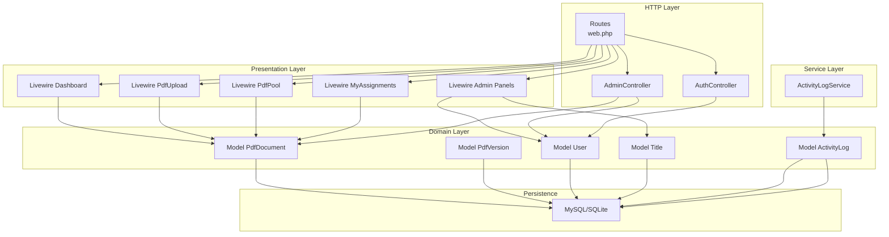
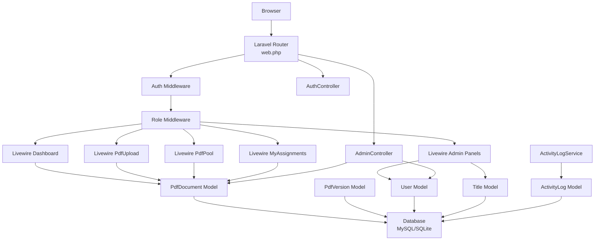
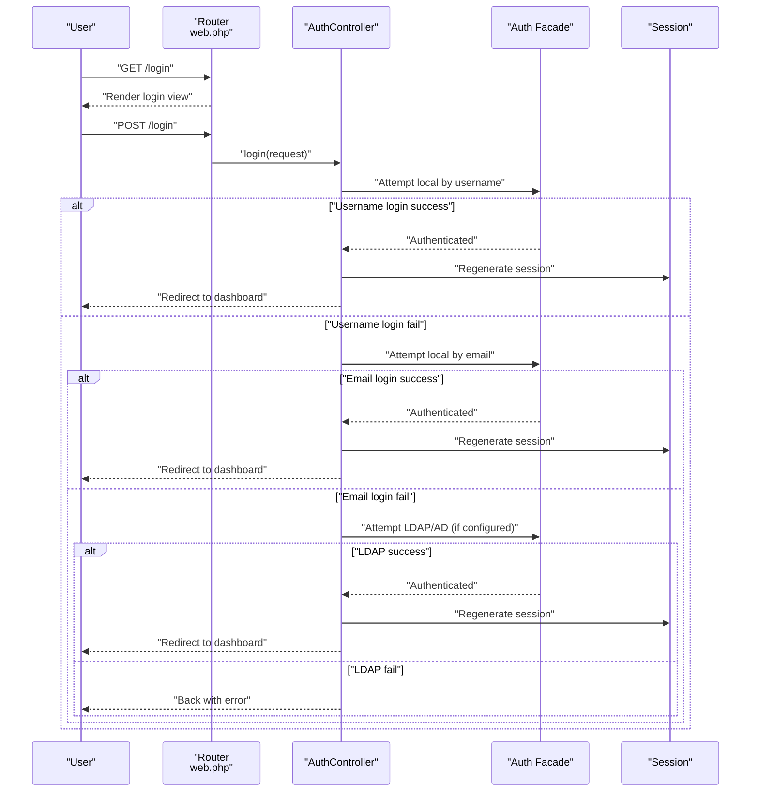
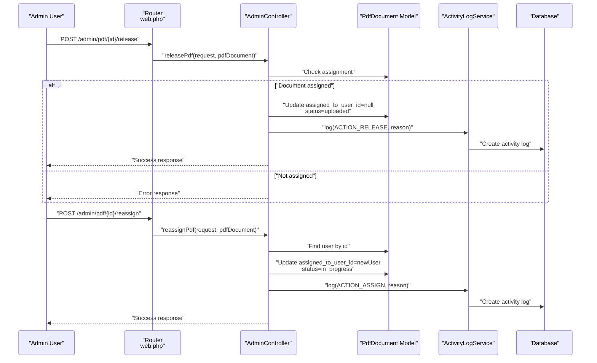
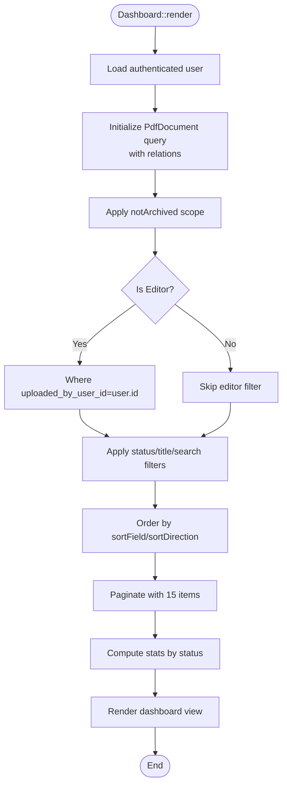
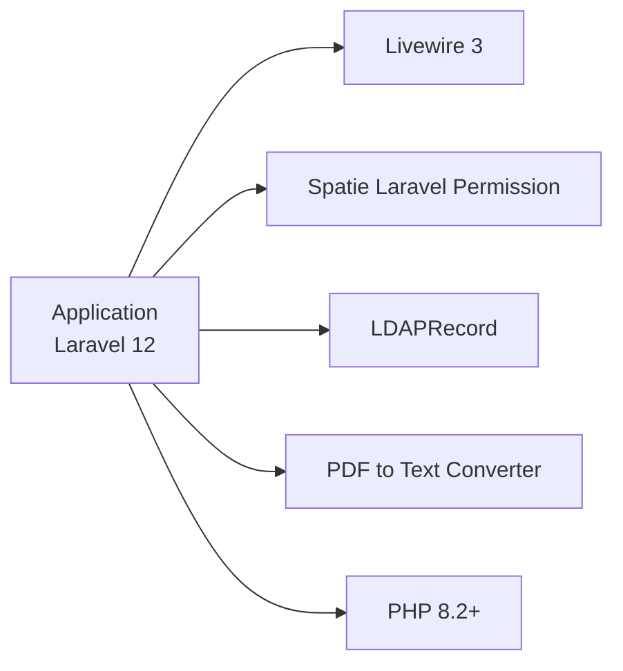

# Project Overview

<cite>
**Referenced Files in This Document**
- [composer.json](file://composer.json)
- [web.php](file://routes/web.php)
- [app.php](file://config/app.php)
- [permission.php](file://config/permission.php)
- [User.php](file://app/Models/User.php)
- [PdfDocument.php](file://app/Models/PdfDocument.php)
- [AuthController.php](file://app/Http/Controllers/AuthController.php)
- [AdminController.php](file://app/Http/Controllers/AdminController.php)
- [Dashboard.php](file://app/Livewire/Dashboard.php)
- [ActivityLogService.php](file://app/Services/ActivityLogService.php)
- [2024_06_10_100000_create_permission_tables.php](file://database/migrations/2024_06_10_100000_create_permission_tables.php)
- [2024_06_10_120000_create_pdf_documents_table.php](file://database/migrations/2024_06_10_120000_create_pdf_documents_table.php)
- [2024_06_10_130000_create_pdf_versions_table.php](file://database/migrations/2024_06_10_130000_create_pdf_versions_table.php)
- [database.php](file://config/database.php)
</cite>

## Table of Contents
1. [Introduction](#introduction)
2. [Project Structure](#project-structure)
3. [Core Components](#core-components)
4. [Architecture Overview](#architecture-overview)
5. [Detailed Component Analysis](#detailed-component-analysis)
6. [Dependency Analysis](#dependency-analysis)
7. [Performance Considerations](#performance-considerations)
8. [Troubleshooting Guide](#troubleshooting-guide)
9. [Conclusion](#conclusion)
10. [Appendices](#appendices)

## Introduction
This document provides a comprehensive overview of the PDF correction management system, a Laravel-based web application designed to streamline collaborative document correction workflows. The platform supports three primary user roles—administrators, editors, and proofreaders—each with distinct capabilities tailored to their part in the document lifecycle. Administrators manage users, titles, and system-wide audits; editors upload documents and track their progress; proofreaders review and process assigned documents. The system emphasizes real-time collaboration via reactive UI components and robust role-based access control powered by Spatie Laravel Permission.

## Project Structure
The application follows Laravel’s conventional MVC structure with additional reactive components and a dedicated service layer for cross-cutting concerns like activity logging. Key areas include:
- Routes: Define authentication, role-gated access, and Livewire/Controller endpoints.
- Controllers: Handle authentication and administrative actions.
- Livewire Components: Provide reactive UI for dashboards, uploads, pools, and administration panels.
- Models: Represent domain entities such as Users, PDF documents, versions, and titles.
- Services: Encapsulate reusable logic (e.g., activity logging).
- Migrations: Define database schema for permissions, titles, PDF documents, versions, and activity logs.
- Configuration: Application, database, and permission settings.



**Diagram sources**
- [web.php:1-54](file://routes/web.php#L1-L54)
- [AuthController.php:1-81](file://app/Http/Controllers/AuthController.php#L1-L81)
- [AdminController.php:1-62](file://app/Http/Controllers/AdminController.php#L1-L62)
- [Dashboard.php:1-92](file://app/Livewire/Dashboard.php#L1-L92)
- [User.php:1-71](file://app/Models/User.php#L1-L71)
- [PdfDocument.php:1-130](file://app/Models/PdfDocument.php#L1-L130)
- [ActivityLogService.php:1-31](file://app/Services/ActivityLogService.php#L1-L31)
- [2024_06_10_120000_create_pdf_documents_table.php:1-32](file://database/migrations/2024_06_10_120000_create_pdf_documents_table.php#L1-L32)
- [2024_06_10_130000_create_pdf_versions_table.php:1-29](file://database/migrations/2024_06_10_130000_create_pdf_versions_table.php#L1-L29)

**Section sources**
- [web.php:1-54](file://routes/web.php#L1-L54)
- [composer.json:1-70](file://composer.json#L1-L70)
- [app.php:1-92](file://config/app.php#L1-L92)

## Core Components
- Authentication and Authorization
  - Login supports local accounts (by username or email) and optional LDAP/AD integration.
  - Role-based middleware gates access to features for editors, proofreaders, and administrators.
- Livewire Reactive UI
  - Dashboard, upload, pool, assignments, and admin panels deliver dynamic, stateful interactions without full page reloads.
- Domain Models
  - Users with roles and associations to uploaded/assigned PDFs and versions.
  - PDF documents with status tracking, assignment, deadlines, and version history.
  - Titles categorize documents; activity logs record system actions.
- Administrative Actions
  - Release and reassign documents with reasons and audit trails.
- Activity Logging
  - Centralized service records actions, actors, and IP addresses for compliance and auditing.

**Section sources**
- [AuthController.php:1-81](file://app/Http/Controllers/AuthController.php#L1-L81)
- [web.php:25-53](file://routes/web.php#L25-L53)
- [Dashboard.php:1-92](file://app/Livewire/Dashboard.php#L1-L92)
- [User.php:1-71](file://app/Models/User.php#L1-L71)
- [PdfDocument.php:1-130](file://app/Models/PdfDocument.php#L1-L130)
- [ActivityLogService.php:1-31](file://app/Services/ActivityLogService.php#L1-L31)
- [AdminController.php:1-62](file://app/Http/Controllers/AdminController.php#L1-L62)

## Architecture Overview
The system adheres to an MVC pattern enhanced with a service layer and Livewire components:
- HTTP Layer: Routes define entry points and apply middleware for authentication and role checks.
- Controllers: Handle requests for authentication and administrative tasks.
- Livewire Components: Provide reactive UI for dashboards, document pools, uploads, and administration.
- Models: Encapsulate domain logic and relationships.
- Services: Centralize cross-cutting concerns like activity logging.
- Persistence: MySQL or SQLite via Eloquent ORM.



**Diagram sources**
- [web.php:1-54](file://routes/web.php#L1-L54)
- [AuthController.php:1-81](file://app/Http/Controllers/AuthController.php#L1-L81)
- [AdminController.php:1-62](file://app/Http/Controllers/AdminController.php#L1-L62)
- [Dashboard.php:1-92](file://app/Livewire/Dashboard.php#L1-L92)
- [User.php:1-71](file://app/Models/User.php#L1-L71)
- [PdfDocument.php:1-130](file://app/Models/PdfDocument.php#L1-L130)
- [ActivityLogService.php:1-31](file://app/Services/ActivityLogService.php#L1-L31)

## Detailed Component Analysis

### Authentication and Authorization Flow
The login flow attempts local authentication first, then falls back to LDAP/AD when configured. Successful authentication redirects to the dashboard; otherwise, appropriate errors are returned.



**Diagram sources**
- [web.php:21-23](file://routes/web.php#L21-L23)
- [AuthController.php:21-71](file://app/Http/Controllers/AuthController.php#L21-L71)

**Section sources**
- [AuthController.php:1-81](file://app/Http/Controllers/AuthController.php#L1-L81)
- [web.php:21-23](file://routes/web.php#L21-L23)

### Administrative Document Reassignment
Administrators can release or reassign documents with reasons captured in activity logs.



**Diagram sources**
- [web.php:48-51](file://routes/web.php#L48-L51)
- [AdminController.php:13-60](file://app/Http/Controllers/AdminController.php#L13-L60)
- [ActivityLogService.php:20-29](file://app/Services/ActivityLogService.php#L20-L29)

**Section sources**
- [AdminController.php:1-62](file://app/Http/Controllers/AdminController.php#L1-L62)
- [ActivityLogService.php:1-31](file://app/Services/ActivityLogService.php#L1-L31)

### Dashboard Filtering and Sorting Logic
The dashboard component applies filters and sorting, aggregates statistics per role, and paginates results.



**Diagram sources**
- [Dashboard.php:48-90](file://app/Livewire/Dashboard.php#L48-L90)

**Section sources**
- [Dashboard.php:1-92](file://app/Livewire/Dashboard.php#L1-L92)

### Data Model Relationships
The domain model layer defines core entities and their relationships, supporting the document lifecycle and auditability.

```mermaid
erDiagram
USERS {
bigint id PK
string name
string email
string username
string guid
string domain
string password
timestamp email_verified_at
timestamps created_at, updated_at
}
TITLES {
bigint id PK
string name
boolean is_active
timestamps created_at, updated_at
}
PDF_DOCUMENTS {
bigint id PK
bigint title_id FK
bigint uploaded_by_user_id FK
string name
integer page_number
string issue_title
date deadline_date
enum status
bigint assigned_to_user_id FK
integer current_version_number
timestamp archived_at
timestamps created_at, updated_at
}
PDF_VERSIONS {
bigint id PK
bigint pdf_document_id FK
integer version_number
string file_path
bigint uploaded_by_user_id FK
text change_summary
timestamps created_at, updated_at
}
ACTIVITY_LOGS {
bigint id PK
bigint pdf_document_id FK
bigint user_id FK
string action
string details
string ip_address
timestamp created_at
}
USERS ||--o{ PDF_DOCUMENTS : "uploaded"
USERS ||--o{ PDF_VERSIONS : "uploaded"
USERS ||--o{ ACTIVITY_LOGS : "performed"
TITLES ||--|| PDF_DOCUMENTS : "categorizes"
PDF_DOCUMENTS ||--o{ PDF_VERSIONS : "contains"
PDF_DOCUMENTS ||--o{ ACTIVITY_LOGS : "logged_for"
```

**Diagram sources**
- [2024_06_10_120000_create_pdf_documents_table.php:11-24](file://database/migrations/2024_06_10_120000_create_pdf_documents_table.php#L11-L24)
- [2024_06_10_130000_create_pdf_versions_table.php:11-21](file://database/migrations/2024_06_10_130000_create_pdf_versions_table.php#L11-L21)
- [User.php:36-54](file://app/Models/User.php#L36-L54)
- [PdfDocument.php:41-70](file://app/Models/PdfDocument.php#L41-L70)

**Section sources**
- [User.php:1-71](file://app/Models/User.php#L1-L71)
- [PdfDocument.php:1-130](file://app/Models/PdfDocument.php#L1-L130)
- [2024_06_10_120000_create_pdf_documents_table.php:1-32](file://database/migrations/2024_06_10_120000_create_pdf_documents_table.php#L1-L32)
- [2024_06_10_130000_create_pdf_versions_table.php:1-29](file://database/migrations/2024_06_10_130000_create_pdf_versions_table.php#L1-L29)

## Dependency Analysis
The application relies on Laravel 12, Livewire 3, Spatie Laravel Permission for RBAC, and optional LDAP integration. Database connectivity supports SQLite and MySQL.



**Diagram sources**
- [composer.json:7-15](file://composer.json#L7-L15)

**Section sources**
- [composer.json:1-70](file://composer.json#L1-L70)
- [app.php:44-46](file://config/app.php#L44-L46)
- [permission.php:1-34](file://config/permission.php#L1-L34)

## Performance Considerations
- Pagination: The dashboard paginates results to limit payload sizes.
- Indexing: Unique and foreign key constraints in migrations support efficient joins and lookups.
- Caching: Permission caching configuration reduces repeated role/permission queries.
- Database Choice: SQLite is supported for development; production should use MySQL for scalability.

[No sources needed since this section provides general guidance]

## Troubleshooting Guide
- Authentication Failures
  - Local credentials not accepted: Verify username/email and password; check database entries.
  - LDAP unavailable: Review logs for connection exceptions; confirm LDAP configuration.
- Role Access Denied
  - Middleware denies access: Confirm user roles and permissions; ensure Spatie permission tables are migrated.
- Administrative Actions
  - Cannot release/reassign: Ensure the document is assigned; verify reason field constraints.
- Database Connectivity
  - Migration errors: Confirm database credentials and driver selection; ensure migrations are executed.

**Section sources**
- [AuthController.php:58-70](file://app/Http/Controllers/AuthController.php#L58-L70)
- [web.php:28-52](file://routes/web.php#L28-L52)
- [2024_06_10_100000_create_permission_tables.php:17-22](file://database/migrations/2024_06_10_100000_create_permission_tables.php#L17-L22)
- [database.php:5-63](file://config/database.php#L5-L63)

## Conclusion
The PDF correction management system offers a streamlined, role-aware platform for collaborative document correction. Its architecture combines Laravel’s MVC foundation with Livewire’s reactive UI and Spatie Permission’s RBAC, ensuring secure and efficient workflows for administrators, editors, and proofreaders. The modular design, centralized activity logging, and scalable persistence model position the system for growth and maintenance.

[No sources needed since this section summarizes without analyzing specific files]

## Appendices

### System Requirements and Prerequisites
- PHP: ^8.2
- Laravel Framework: ^12.0
- Livewire: ^3.5
- Spatie Laravel Permission: ^6.9
- Optional: LDAP/AD server for authentication
- Database: MySQL or SQLite

**Section sources**
- [composer.json:8-14](file://composer.json#L8-L14)

### Initial Setup Overview
- Install dependencies via Composer.
- Configure environment variables for database and LDAP if needed.
- Publish and run migrations to set up permission and document schemas.
- Seed roles and users as required.
- Start the application server and access the login route.

**Section sources**
- [composer.json:41-51](file://composer.json#L41-L51)
- [2024_06_10_100000_create_permission_tables.php:102-105](file://database/migrations/2024_06_10_100000_create_permission_tables.php#L102-L105)
- [database.php:6-36](file://config/database.php#L6-L36)