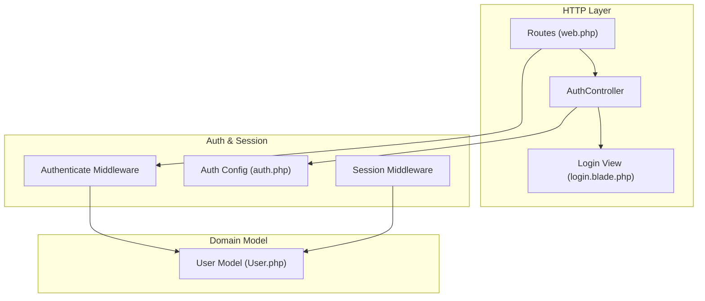
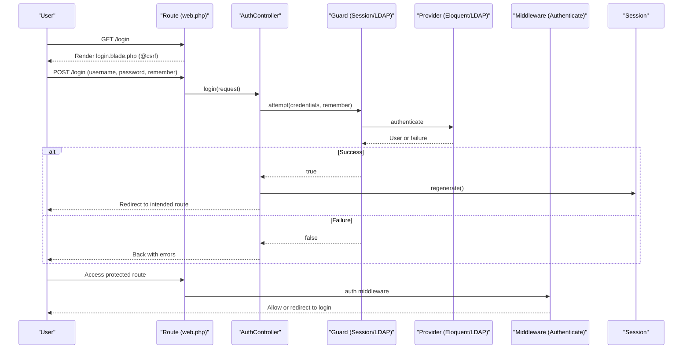
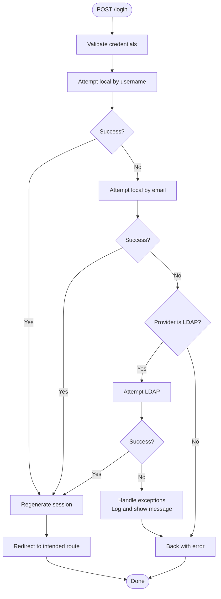
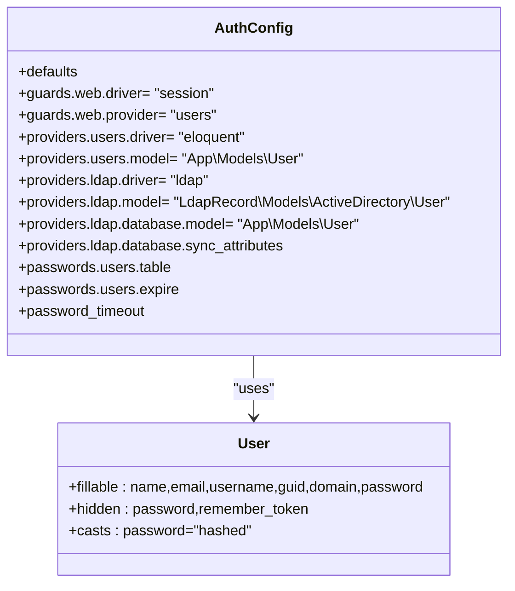
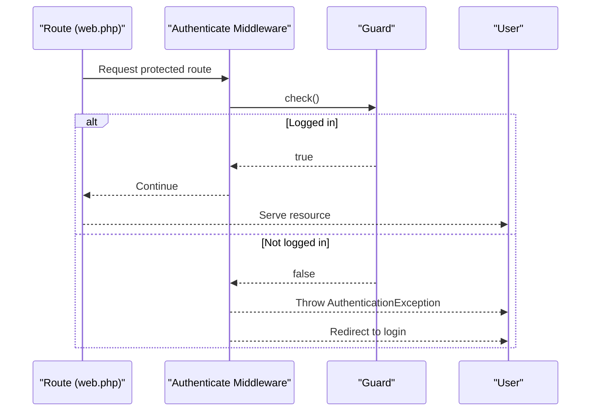
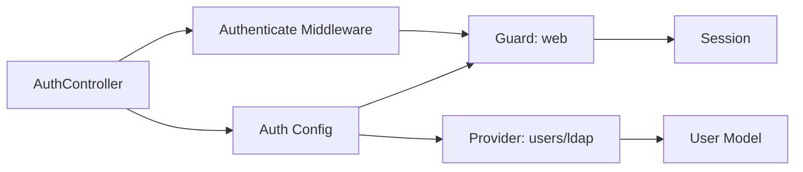

# Authentication System

<cite>
**Referenced Files in This Document**
- [AuthController.php](file://pdf-korektura/app/Http/Controllers/AuthController.php)
- [auth.php](file://pdf-korektura/config/auth.php)
- [web.php](file://pdf-korektura/routes/web.php)
- [User.php](file://pdf-korektura/app/Models/User.php)
- [login.blade.php](file://pdf-korektura/resources/views/auth/login.blade.php)
- [Authenticate.php](file://pdf-korektura/vendor/laravel/framework/src/Illuminate/Auth/Middleware/Authenticate.php)
- [AuthenticatesSessions.php](file://pdf-korektura/vendor/laravel/framework/src/Illuminate/Contracts/Session/Middleware/AuthenticatesSessions.php)
- [app.php](file://pdf-korektura/config/app.php)
</cite>

## Table of Contents
1. [Introduction](#introduction)
2. [Project Structure](#project-structure)
3. [Core Components](#core-components)
4. [Architecture Overview](#architecture-overview)
5. [Detailed Component Analysis](#detailed-component-analysis)
6. [Dependency Analysis](#dependency-analysis)
7. [Performance Considerations](#performance-considerations)
8. [Troubleshooting Guide](#troubleshooting-guide)
9. [Conclusion](#conclusion)

## Introduction
This document provides comprehensive authentication documentation for the PDF correction system. It covers login and logout processes, session management, credential validation, authentication guard configuration, user provider setup, middleware integration, password hashing, session timeout handling, and security token management. It also documents the AuthController implementation, CSRF protection, secure cookie settings, and session fixation prevention. Authentication flow diagrams, error handling for failed attempts, and account lockout mechanisms are included to guide both developers and operators.

## Project Structure
The authentication system spans several key areas:
- Routes define login, logout, and protected routes with middleware.
- AuthController handles login, logout, and redirects.
- Config files define guards, providers, and password reset policies.
- Blade templates render the login form with CSRF protection.
- Models encapsulate user credentials and roles.
- Middleware enforces authentication and session policies.

**Diagram sources**
- [web.php:21-23](file://pdf-korektura/routes/web.php#L21-L23)
- [AuthController.php:13-19](file://pdf-korektura/app/Http/Controllers/AuthController.php#L13-L19)
- [auth.php:8-13](file://pdf-korektura/config/auth.php#L8-L13)
- [Authenticate.php:59-88](file://pdf-korektura/vendor/laravel/framework/src/Illuminate/Auth/Middleware/Authenticate.php#L59-L88)
- [User.php:10-34](file://pdf-korektura/app/Models/User.php#L10-L34)

**Section sources**
- [web.php:21-23](file://pdf-korektura/routes/web.php#L21-L23)
- [auth.php:8-13](file://pdf-korektura/config/auth.php#L8-L13)
- [login.blade.php:23-24](file://pdf-korektura/resources/views/auth/login.blade.php#L23-L24)

## Core Components
- Authentication Guard and Provider
  - Guard "web" uses the session driver and delegates to provider "users".
  - Provider "users" uses the Eloquent driver with the User model.
  - Provider "ldap" integrates Active Directory via LDAP with attribute synchronization to the local User model.
- Password Reset Policy
  - Password reset tokens table is configurable, with expiration and throttling settings.
- Session Timeout
  - Password timeout setting is configurable for re-authentication prompts after inactivity.
- Middleware Integration
  - Routes under the "auth" middleware group require authentication.
  - Additional role-based middleware restricts access to specific features.

**Section sources**
- [auth.php:4-48](file://pdf-korektura/config/auth.php#L4-L48)
- [web.php:25-53](file://pdf-korektura/routes/web.php#L25-L53)

## Architecture Overview
The authentication architecture combines Laravel's built-in authentication with optional LDAP integration. The flow begins at the login route, validated by the controller, then leverages the configured guard/provider. Successful authentication creates a session and regenerates the session ID to prevent fixation. Protected routes enforce authentication and role checks.

**Diagram sources**
- [web.php:21-23](file://pdf-korektura/routes/web.php#L21-L23)
- [AuthController.php:21-71](file://pdf-korektura/app/Http/Controllers/AuthController.php#L21-L71)
- [auth.php:8-13](file://pdf-korektura/config/auth.php#L8-L13)
- [Authenticate.php:59-88](file://pdf-korektura/vendor/laravel/framework/src/Illuminate/Auth/Middleware/Authenticate.php#L59-L88)

## Detailed Component Analysis

### AuthController Implementation
- showLogin
  - Checks if the user is already authenticated and redirects to the dashboard if so.
  - Otherwise renders the login view.
- login
  - Validates input credentials.
  - Attempts authentication using local username and email.
  - If the configured provider is LDAP, attempts AD/LDAP authentication with error handling for connection and user-not-found scenarios.
  - On success, regenerates the session to prevent fixation and redirects to the intended route.
  - On failure, returns back with an appropriate error message.
- logout
  - Logs out the current user, invalidates the session, regenerates the CSRF token, and redirects to the login route.

**Diagram sources**
- [AuthController.php:21-71](file://pdf-korektura/app/Http/Controllers/AuthController.php#L21-L71)

**Section sources**
- [AuthController.php:13-19](file://pdf-korektura/app/Http/Controllers/AuthController.php#L13-L19)
- [AuthController.php:21-71](file://pdf-korektura/app/Http/Controllers/AuthController.php#L21-L71)
- [AuthController.php:73-79](file://pdf-korektura/app/Http/Controllers/AuthController.php#L73-L79)

### Authentication Guard and Provider Configuration
- Guard "web"
  - Driver: session
  - Provider: users
- Provider "users"
  - Driver: eloquent
  - Model: App\Models\User
- Provider "ldap"
  - Driver: ldap
  - Model: LdapRecord\Models\ActiveDirectory\User
  - Database sync:
    - Local model: App\Models\User
    - Attribute mappings: cn -> name, mail -> email, samaccountname -> username, objectguid -> guid
    - Existing record updates: email sync
- Password reset policy
  - Token table: configurable
  - Expiration: 60 minutes
  - Throttle: 60 seconds
- Password timeout
  - Re-authentication window: configurable seconds

**Diagram sources**
- [auth.php:4-48](file://pdf-korektura/config/auth.php#L4-L48)
- [User.php:14-34](file://pdf-korektura/app/Models/User.php#L14-L34)

**Section sources**
- [auth.php:8-13](file://pdf-korektura/config/auth.php#L8-L13)
- [auth.php:14-38](file://pdf-korektura/config/auth.php#L14-L38)
- [auth.php:39-47](file://pdf-korektura/config/auth.php#L39-L47)

### Middleware Integration
- Routes grouped under "auth" require authentication via the configured guard.
- Role-based middleware further restricts access to editor/admin, korektor/admin, and admin-only routes.
- The Authenticate middleware checks if the user is logged in for the specified guard and throws an authentication exception if not, causing redirection to the login route.

**Diagram sources**
- [web.php:25-53](file://pdf-korektura/routes/web.php#L25-L53)
- [Authenticate.php:59-106](file://pdf-korektura/vendor/laravel/framework/src/Illuminate/Auth/Middleware/Authenticate.php#L59-L106)

**Section sources**
- [web.php:25-53](file://pdf-korektura/routes/web.php#L25-L53)
- [Authenticate.php:59-88](file://pdf-korektura/vendor/laravel/framework/src/Illuminate/Auth/Middleware/Authenticate.php#L59-L88)

### Login Form and CSRF Protection
- The login form posts to the POST /login route.
- CSRF protection is enabled via the @csrf directive.
- The form accepts username/email and password, with an optional "remember" checkbox passed to the controller.

**Section sources**
- [login.blade.php:23-24](file://pdf-korektura/resources/views/auth/login.blade.php#L23-L24)
- [login.blade.php:26-41](file://pdf-korektura/resources/views/auth/login.blade.php#L26-L41)

### Password Hashing and Storage
- The User model casts the password attribute to hashed, ensuring secure storage.
- The Eloquent provider manages password verification against stored hashes.

**Section sources**
- [User.php:28-34](file://pdf-korektura/app/Models/User.php#L28-L34)

### Session Management and Fixation Prevention
- On successful login, the controller regenerates the session to prevent fixation attacks.
- Logout invalidates the session and regenerates the CSRF token to mitigate session hijacking risks.
- The session driver is configured via the guard, and middleware ensures authenticated access.

**Section sources**
- [AuthController.php:37-38](file://pdf-korektura/app/Http/Controllers/AuthController.php#L37-L38)
- [AuthController.php:47-48](file://pdf-korektura/app/Http/Controllers/AuthController.php#L47-L48)
- [AuthController.php:55-56](file://pdf-korektura/app/Http/Controllers/AuthController.php#L55-L56)
- [AuthController.php:75-78](file://pdf-korektura/app/Http/Controllers/AuthController.php#L75-L78)

### LDAP Integration and Account Lockout
- LDAP attempts are performed when the provider is set to "ldap".
- Connection failures are logged and surfaced to the user with a generic message.
- User-not-found conditions are logged but do not reveal whether the account exists.
- No explicit account lockout mechanism is implemented in the controller; consider adding rate limiting or lockout policies at the application or infrastructure level.

**Section sources**
- [AuthController.php:52-66](file://pdf-korektura/app/Http/Controllers/AuthController.php#L52-L66)

### Secure Cookie Settings
- Application encryption cipher and key are defined in the application configuration.
- Cookies are managed by the framework; ensure HTTPS enforcement and secure cookie flags are configured at the reverse proxy or framework level as per deployment requirements.

**Section sources**
- [app.php:14-16](file://pdf-korektura/config/app.php#L14-L16)

## Dependency Analysis
The authentication system depends on:
- Laravel's authentication and session services.
- The configured guard/provider drivers (session/Eloquent/LDAP).
- Middleware for enforcing authentication and authorization.
- The User model for credential verification and role checks.

**Diagram sources**
- [AuthController.php:28-29](file://pdf-korektura/app/Http/Controllers/AuthController.php#L28-L29)
- [auth.php:8-13](file://pdf-korektura/config/auth.php#L8-L13)
- [Authenticate.php:59-88](file://pdf-korektura/vendor/laravel/framework/src/Illuminate/Auth/Middleware/Authenticate.php#L59-L88)

**Section sources**
- [auth.php:8-13](file://pdf-korektura/config/auth.php#L8-L13)
- [Authenticate.php:59-88](file://pdf-korektura/vendor/laravel/framework/src/Illuminate/Auth/Middleware/Authenticate.php#L59-L88)

## Performance Considerations
- Prefer local Eloquent authentication for internal users to minimize external dependency latency.
- For LDAP, optimize network connectivity and consider caching frequently accessed user attributes.
- Use efficient password hashing defaults and avoid excessive bcrypt cost settings.
- Apply rate limiting at the application or infrastructure level to protect against brute-force attempts.

## Troubleshooting Guide
- Login fails with generic message
  - Verify provider configuration and LDAP connectivity if applicable.
  - Check application logs for LDAP connection errors.
- LDAP server unavailable
  - The controller logs connection failures and returns a user-friendly message.
- User not found in LDAP
  - The controller logs warnings for missing users; ensure correct username format and domain.
- Stuck on login page after logout
  - Ensure session invalidation and token regeneration occur during logout.
- Role-based access denied
  - Confirm user roles and middleware assignments for protected routes.

**Section sources**
- [AuthController.php:58-65](file://pdf-korektura/app/Http/Controllers/AuthController.php#L58-L65)
- [web.php:25-53](file://pdf-korektura/routes/web.php#L25-L53)

## Conclusion
The PDF correction system implements a robust authentication foundation using Laravel's session-based guard with optional LDAP integration. The AuthController centralizes login, logout, and credential validation while preventing session fixation through session regeneration. The configuration supports flexible provider selection, secure password storage, and middleware-driven access control. Enhancements such as explicit account lockout policies and rate limiting should be considered to strengthen resilience against brute-force attacks.