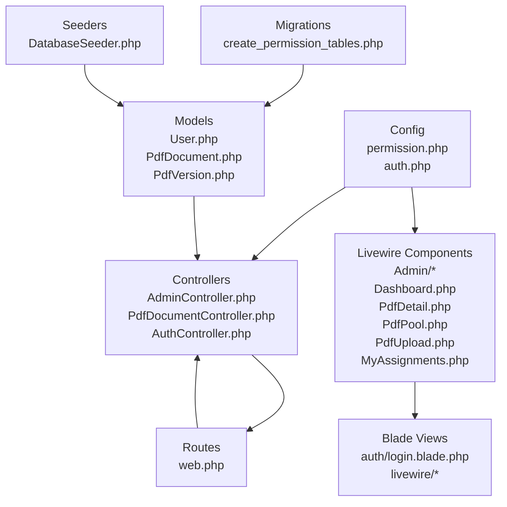
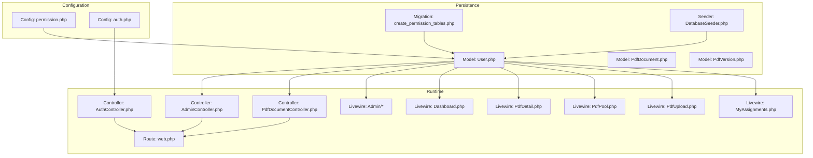
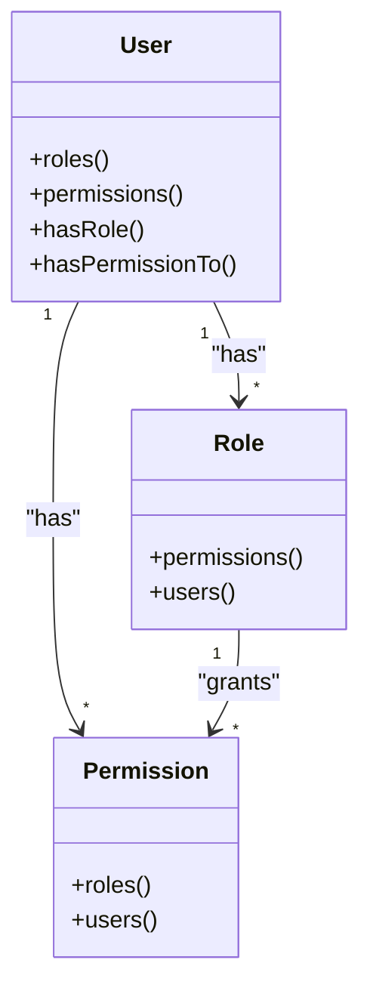
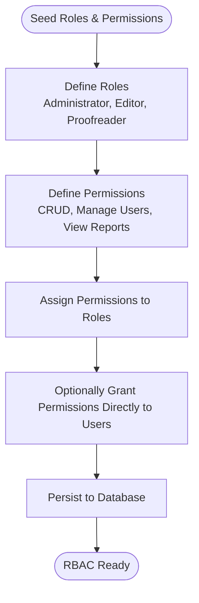
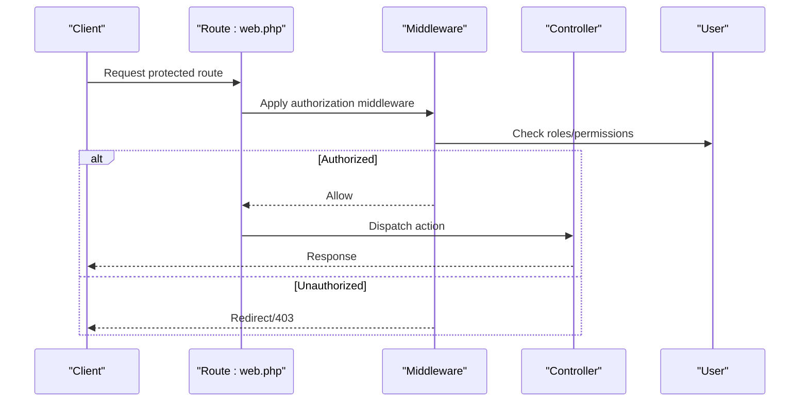
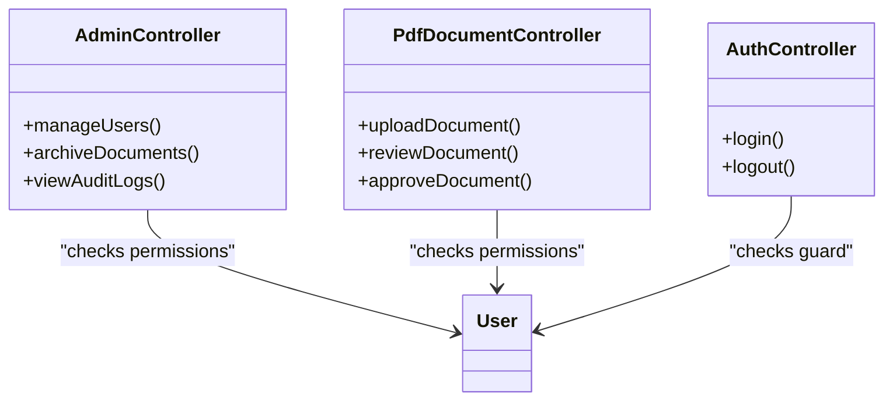
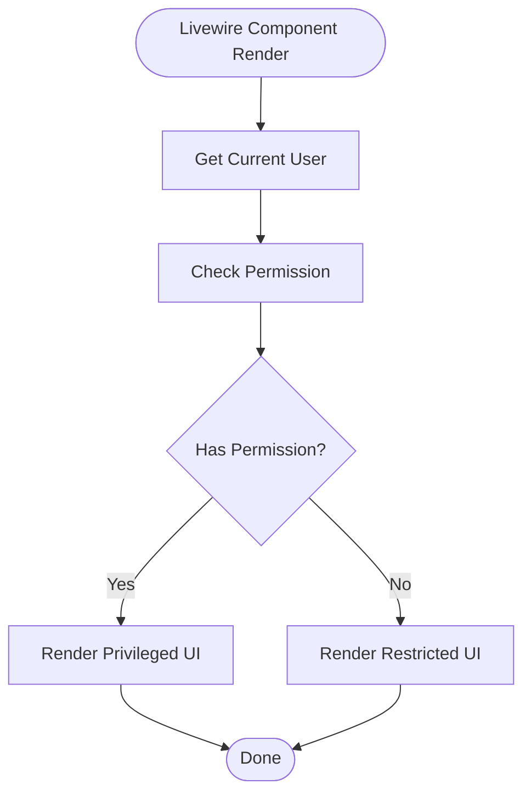
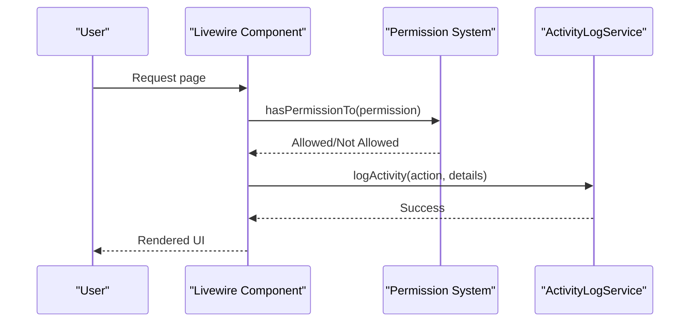
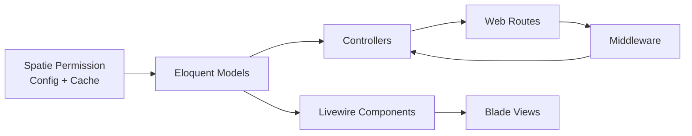

# Authorization and Role-Based Access Control

<cite>
**Referenced Files in This Document**
- [permission.php](file://pdf-korektura/config/permission.php)
- [2024_06_10_100000_create_permission_tables.php](file://pdf-korektura/database/migrations/2024_06_10_100000_create_permission_tables.php)
- [User.php](file://pdf-korektura/app/Models/User.php)
- [PdfDocument.php](file://pdf-korektura/app/Models/PdfDocument.php)
- [PdfVersion.php](file://pdf-korektura/app/Models/PdfVersion.php)
- [AdminController.php](file://pdf-korektura/app/Http/Controllers/AdminController.php)
- [PdfDocumentController.php](file://pdf-korektura/app/Http/Controllers/PdfDocumentController.php)
- [web.php](file://pdf-korektura/routes/web.php)
- [AppServiceProvider.php](file://pdf-korektura/app/Providers/AppServiceProvider.php)
- [ActivityLog.php](file://pdf-korektura/app/Models/ActivityLog.php)
- [ActivityLogService.php](file://pdf-korektura/app/Services/ActivityLogService.php)
- [auth.php](file://pdf-korektura/config/auth.php)
- [login.blade.php](file://pdf-korektura/resources/views/auth/login.blade.php)
- [dashboard.blade.php](file://pdf-korektura/resources/views/livewire/dashboard.blade.php)
- [pdf-detail.blade.php](file://pdf-korektura/resources/views/livewire/pdf-detail.blade.php)
- [user-management.blade.php](file://pdf-korektura/resources/views/livewire/admin/user-management.blade.php)
- [audit-log.blade.php](file://pdf-korektura/resources/views/livewire/admin/audit-log.blade.php)
- [title-management.blade.php](file://pdf-korektura/resources/views/livewire/admin/title-management.blade.php)
- [Archive.php](file://pdf-korektura/app/Livewire/Admin/Archive.php)
- [AuditLog.php](file://pdf-korektura/app/Livewire/Admin/AuditLog.php)
- [TitleManagement.php](file://pdf-korektura/app/Livewire/Admin/TitleManagement.php)
- [UserManagement.php](file://pdf-korektura/app/Livewire/Admin/UserManagement.php)
- [Dashboard.php](file://pdf-korektura/app/Livewire/Dashboard.php)
- [PdfDetail.php](file://pdf-korektura/app/Livewire/PdfDetail.php)
- [PdfPool.php](file://pdf-korektura/app/Livewire/PdfPool.php)
- [PdfUpload.php](file://pdf-korektura/app/Livewire/PdfUpload.php)
- [MyAssignments.php](file://pdf-korektura/app/Livewire/MyAssignments.php)
- [AuthController.php](file://pdf-korektura/app/Http/Controllers/AuthController.php)
- [DatabaseSeeder.php](file://pdf-korektura/database/seeders/DatabaseSeeder.php)
</cite>

## Table of Contents
1. [Introduction](#introduction)
2. [Project Structure](#project-structure)
3. [Core Components](#core-components)
4. [Architecture Overview](#architecture-overview)
5. [Detailed Component Analysis](#detailed-component-analysis)
6. [Dependency Analysis](#dependency-analysis)
7. [Performance Considerations](#performance-considerations)
8. [Troubleshooting Guide](#troubleshooting-guide)
9. [Conclusion](#conclusion)

## Introduction
This document provides comprehensive authorization documentation for the role-based access control (RBAC) implementation. It covers user roles (Administrator, Editor, Proofreader), permission definitions, capability checks, Spatie Laravel Permission package integration, role assignment processes, permission inheritance, middleware protection for routes and controller actions, permission matrices, dynamic permission checking, role-based view rendering, API endpoint protection, permission caching, role modification workflows, and security boundary enforcement.

## Project Structure
The authorization system is built on top of the Spatie Laravel Permission package and integrates with Eloquent models, controllers, Livewire components, and routing. Key areas include:
- Configuration: Spatie package configuration and authentication guard setup
- Database: Migration for permission tables and seeders for initial roles/permissions
- Models: User model with Spatie permissions and models representing domain entities
- Controllers: Admin and PDF document controllers implementing authorization checks
- Livewire: UI components that conditionally render content based on permissions
- Routes: Web routes protected by middleware enforcing authorization policies

**Diagram sources**
- [permission.php](file://pdf-korektura/config/permission.php)
- [auth.php](file://pdf-korektura/config/auth.php)
- [2024_06_10_100000_create_permission_tables.php](file://pdf-korektura/database/migrations/2024_06_10_100000_create_permission_tables.php)
- [DatabaseSeeder.php](file://pdf-korektura/database/seeders/DatabaseSeeder.php)
- [User.php](file://pdf-korektura/app/Models/User.php)
- [PdfDocument.php](file://pdf-korektura/app/Models/PdfDocument.php)
- [PdfVersion.php](file://pdf-korektura/app/Models/PdfVersion.php)
- [AdminController.php](file://pdf-korektura/app/Http/Controllers/AdminController.php)
- [PdfDocumentController.php](file://pdf-korektura/app/Http/Controllers/PdfDocumentController.php)
- [AuthController.php](file://pdf-korektura/app/Http/Controllers/AuthController.php)
- [web.php](file://pdf-korektura/routes/web.php)
- [login.blade.php](file://pdf-korektura/resources/views/auth/login.blade.php)
- [dashboard.blade.php](file://pdf-korektura/resources/views/livewire/dashboard.blade.php)
- [pdf-detail.blade.php](file://pdf-korektura/resources/views/livewire/pdf-detail.blade.php)
- [user-management.blade.php](file://pdf-korektura/resources/views/livewire/admin/user-management.blade.php)
- [audit-log.blade.php](file://pdf-korektura/resources/views/livewire/admin/audit-log.blade.php)
- [title-management.blade.php](file://pdf-korektura/resources/views/livewire/admin/title-management.blade.php)

**Section sources**
- [permission.php](file://pdf-korektura/config/permission.php)
- [auth.php](file://pdf-korektura/config/auth.php)
- [2024_06_10_100000_create_permission_tables.php](file://pdf-korektura/database/migrations/2024_06_10_100000_create_permission_tables.php)
- [DatabaseSeeder.php](file://pdf-korektura/database/seeders/DatabaseSeeder.php)
- [User.php](file://pdf-korektura/app/Models/User.php)
- [PdfDocument.php](file://pdf-korektura/app/Models/PdfDocument.php)
- [PdfVersion.php](file://pdf-korektura/app/Models/PdfVersion.php)
- [web.php](file://pdf-korektura/routes/web.php)

## Core Components
- Spatie Laravel Permission configuration defines guards, cache settings, and model bindings for roles and permissions.
- Authentication guard configuration ensures the application uses the appropriate guard for user sessions.
- Database migration creates the necessary tables for roles, permissions, and their relationships.
- Seeders initialize default roles and permissions for the Administrator, Editor, and Proofreader roles.
- Models integrate with Spatie via traits to inherit permission and role capabilities.
- Controllers enforce authorization for administrative and document operations.
- Livewire components conditionally render UI elements based on current user permissions.
- Routes define protected endpoints and map to controllers.

**Section sources**
- [permission.php](file://pdf-korektura/config/permission.php)
- [auth.php](file://pdf-korektura/config/auth.php)
- [2024_06_10_100000_create_permission_tables.php](file://pdf-korektura/database/migrations/2024_06_10_100000_create_permission_tables.php)
- [DatabaseSeeder.php](file://pdf-korektura/database/seeders/DatabaseSeeder.php)
- [User.php](file://pdf-korektura/app/Models/User.php)
- [PdfDocument.php](file://pdf-korektura/app/Models/PdfDocument.php)
- [PdfVersion.php](file://pdf-korektura/app/Models/PdfVersion.php)
- [web.php](file://pdf-korektura/routes/web.php)

## Architecture Overview
The authorization architecture centers around Spatie’s RBAC models and middleware enforcement. Users are associated with roles and permissions. Controllers and Livewire components check capabilities before performing sensitive operations or rendering privileged UI. Routes are grouped and protected by middleware to enforce access policies.

**Diagram sources**
- [permission.php](file://pdf-korektura/config/permission.php)
- [auth.php](file://pdf-korektura/config/auth.php)
- [2024_06_10_100000_create_permission_tables.php](file://pdf-korektura/database/migrations/2024_06_10_100000_create_permission_tables.php)
- [DatabaseSeeder.php](file://pdf-korektura/database/seeders/DatabaseSeeder.php)
- [User.php](file://pdf-korektura/app/Models/User.php)
- [PdfDocument.php](file://pdf-korektura/app/Models/PdfDocument.php)
- [PdfVersion.php](file://pdf-korektura/app/Models/PdfVersion.php)
- [AdminController.php](file://pdf-korektura/app/Http/Controllers/AdminController.php)
- [PdfDocumentController.php](file://pdf-korektura/app/Http/Controllers/PdfDocumentController.php)
- [AuthController.php](file://pdf-korektura/app/Http/Controllers/AuthController.php)
- [web.php](file://pdf-korektura/routes/web.php)

## Detailed Component Analysis

### Spatie Laravel Permission Integration
- Configuration: The package is configured with a guard, cache settings, and model bindings for roles and permissions.
- Guard: Authentication uses a named guard to ensure session-based user identity.
- Models: The User model integrates with Spatie to support roles and permissions.
- Migration: The migration sets up tables for roles, permissions, their relations, and pivot tables.
- Seeders: Initial roles and permissions are seeded to establish baseline access policies.

**Diagram sources**
- [permission.php](file://pdf-korektura/config/permission.php)
- [2024_06_10_100000_create_permission_tables.php](file://pdf-korektura/database/migrations/2024_06_10_100000_create_permission_tables.php)
- [User.php](file://pdf-korektura/app/Models/User.php)

**Section sources**
- [permission.php](file://pdf-korektura/config/permission.php)
- [auth.php](file://pdf-korektura/config/auth.php)
- [2024_06_10_100000_create_permission_tables.php](file://pdf-korektura/database/migrations/2024_06_10_100000_create_permission_tables.php)
- [DatabaseSeeder.php](file://pdf-korektura/database/seeders/DatabaseSeeder.php)
- [User.php](file://pdf-korektura/app/Models/User.php)

### Roles and Permissions Definition
- Roles: Administrator, Editor, Proofreader are defined and seeded.
- Permissions: Permissions are seeded and associated with roles to form capability matrices.
- Inheritance: Roles can inherit permissions; permissions can be granted to users directly or via roles.

**Diagram sources**
- [DatabaseSeeder.php](file://pdf-korektura/database/seeders/DatabaseSeeder.php)
- [2024_06_10_100000_create_permission_tables.php](file://pdf-korektura/database/migrations/2024_06_10_100000_create_permission_tables.php)

**Section sources**
- [DatabaseSeeder.php](file://pdf-korektura/database/seeders/DatabaseSeeder.php)
- [2024_06_10_100000_create_permission_tables.php](file://pdf-korektura/database/migrations/2024_06_10_100000_create_permission_tables.php)

### Middleware Implementation
- Route Protection: Routes are grouped and protected by middleware to enforce authorization policies.
- Capability Checks: Controllers and Livewire components perform runtime checks against the current user’s permissions.

**Diagram sources**
- [web.php](file://pdf-korektura/routes/web.php)
- [AuthController.php](file://pdf-korektura/app/Http/Controllers/AuthController.php)
- [User.php](file://pdf-korektura/app/Models/User.php)

**Section sources**
- [web.php](file://pdf-korektura/routes/web.php)
- [AuthController.php](file://pdf-korektura/app/Http/Controllers/AuthController.php)
- [User.php](file://pdf-korektura/app/Models/User.php)

### Controllers and Capability Checks
- AdminController: Administrative actions require specific permissions aligned with the Administrator role.
- PdfDocumentController: Document operations enforce permissions for Editors and Proofreaders.
- AuthController: Authentication and logout actions are protected by the application guard.

**Diagram sources**
- [AdminController.php](file://pdf-korektura/app/Http/Controllers/AdminController.php)
- [PdfDocumentController.php](file://pdf-korektura/app/Http/Controllers/PdfDocumentController.php)
- [AuthController.php](file://pdf-korektura/app/Http/Controllers/AuthController.php)
- [User.php](file://pdf-korektura/app/Models/User.php)

**Section sources**
- [AdminController.php](file://pdf-korektura/app/Http/Controllers/AdminController.php)
- [PdfDocumentController.php](file://pdf-korektura/app/Http/Controllers/PdfDocumentController.php)
- [AuthController.php](file://pdf-korektura/app/Http/Controllers/AuthController.php)

### Livewire Components and Role-Based Rendering
- Conditional UI: Livewire components render different UI sections based on the current user’s permissions.
- Examples: Admin panels, audit logs, user management, and document review interfaces are gated by permissions.

**Diagram sources**
- [User.php](file://pdf-korektura/app/Models/User.php)
- [Dashboard.php](file://pdf-korektura/app/Livewire/Dashboard.php)
- [PdfDetail.php](file://pdf-korektura/app/Livewire/PdfDetail.php)
- [PdfPool.php](file://pdf-korektura/app/Livewire/PdfPool.php)
- [PdfUpload.php](file://pdf-korektura/app/Livewire/PdfUpload.php)
- [MyAssignments.php](file://pdf-korektura/app/Livewire/MyAssignments.php)
- [Archive.php](file://pdf-korektura/app/Livewire/Admin/Archive.php)
- [AuditLog.php](file://pdf-korektura/app/Livewire/Admin/AuditLog.php)
- [TitleManagement.php](file://pdf-korektura/app/Livewire/Admin/TitleManagement.php)
- [UserManagement.php](file://pdf-korektura/app/Livewire/Admin/UserManagement.php)

**Section sources**
- [User.php](file://pdf-korektura/app/Models/User.php)
- [Dashboard.php](file://pdf-korektura/app/Livewire/Dashboard.php)
- [PdfDetail.php](file://pdf-korektura/app/Livewire/PdfDetail.php)
- [PdfPool.php](file://pdf-korektura/app/Livewire/PdfPool.php)
- [PdfUpload.php](file://pdf-korektura/app/Livewire/PdfUpload.php)
- [MyAssignments.php](file://pdf-korektura/app/Livewire/MyAssignments.php)
- [Archive.php](file://pdf-korektura/app/Livewire/Admin/Archive.php)
- [AuditLog.php](file://pdf-korektura/app/Livewire/Admin/AuditLog.php)
- [TitleManagement.php](file://pdf-korektura/app/Livewire/Admin/TitleManagement.php)
- [UserManagement.php](file://pdf-korektura/app/Livewire/Admin/UserManagement.php)

### Permission Matrices
The following matrices summarize allowed actions per role. These are derived from the seeded permissions and role assignments.

- Administrator
  - Manage users
  - View audit logs
  - Archive documents
  - Manage titles
  - Full CRUD on documents

- Editor
  - Upload documents
  - Review documents
  - Approve documents
  - View assigned tasks

- Proofreader
  - Review documents
  - View assigned tasks

Note: Specific permission names and assignments are defined in the seeders and migration.

**Section sources**
- [DatabaseSeeder.php](file://pdf-korektura/database/seeders/DatabaseSeeder.php)
- [2024_06_10_100000_create_permission_tables.php](file://pdf-korektura/database/migrations/2024_06_10_100000_create_permission_tables.php)

### Dynamic Permission Checking and Role-Based View Rendering
- Dynamic checks: Controllers and Livewire components perform runtime checks using the User model’s permission methods.
- View rendering: Blade templates and Livewire components conditionally render UI elements based on permission checks.
- Activity logging: Operations are logged to capture who performed what actions.

**Diagram sources**
- [User.php](file://pdf-korektura/app/Models/User.php)
- [ActivityLogService.php](file://pdf-korektura/app/Services/ActivityLogService.php)
- [ActivityLog.php](file://pdf-korektura/app/Models/ActivityLog.php)

**Section sources**
- [User.php](file://pdf-korektura/app/Models/User.php)
- [ActivityLogService.php](file://pdf-korektura/app/Services/ActivityLogService.php)
- [ActivityLog.php](file://pdf-korektura/app/Models/ActivityLog.php)

### API Endpoint Protection
- Web routes: The primary authorization enforcement occurs via web routes and middleware.
- For API endpoints, apply similar middleware patterns and ensure the guard is correctly configured for API requests.

**Section sources**
- [web.php](file://pdf-korektura/routes/web.php)
- [auth.php](file://pdf-korektura/config/auth.php)

### Permission Caching
- Cache configuration: The Spatie configuration includes cache settings to optimize permission retrieval.
- Benefits: Reduces database queries for permission checks during a request lifecycle.

**Section sources**
- [permission.php](file://pdf-korektura/config/permission.php)

### Role Modification Workflows
- Assignment: Roles are assigned to users via Spatie’s relationship methods.
- Inheritance: Roles can inherit permissions; adding permissions to a role propagates to all users of that role.
- Direct grants: Permissions can be granted directly to users for exceptions or special cases.

**Section sources**
- [User.php](file://pdf-korektura/app/Models/User.php)
- [DatabaseSeeder.php](file://pdf-korektura/database/seeders/DatabaseSeeder.php)

### Security Boundary Enforcement
- Guards: Authentication guard ensures session-based identity.
- Middleware: Route-level middleware enforces authorization policies.
- Capability checks: Controllers and Livewire components perform runtime checks.
- Logging: Activity logs track sensitive operations for auditing.

**Section sources**
- [auth.php](file://pdf-korektura/config/auth.php)
- [web.php](file://pdf-korektura/routes/web.php)
- [User.php](file://pdf-korektura/app/Models/User.php)
- [ActivityLogService.php](file://pdf-korektura/app/Services/ActivityLogService.php)

## Dependency Analysis
The authorization system depends on:
- Spatie Laravel Permission for RBAC models and cache
- Eloquent models for persistence
- Controllers and Livewire components for runtime checks
- Routes and middleware for enforcement
- Seeders for initial configuration

**Diagram sources**
- [permission.php](file://pdf-korektura/config/permission.php)
- [User.php](file://pdf-korektura/app/Models/User.php)
- [web.php](file://pdf-korektura/routes/web.php)

**Section sources**
- [permission.php](file://pdf-korektura/config/permission.php)
- [User.php](file://pdf-korektura/app/Models/User.php)
- [web.php](file://pdf-korektura/routes/web.php)

## Performance Considerations
- Enable and configure permission caching to minimize database queries.
- Use eager loading for roles and permissions when hydrating users in controllers.
- Limit excessive permission checks in loops; batch or cache results when feasible.
- Monitor activity logs to detect unusual patterns without impacting performance.

## Troubleshooting Guide
- Authentication failures: Verify guard configuration and session handling.
- Permission denied errors: Confirm user roles and permissions are correctly seeded and cached.
- Middleware bypass: Ensure routes are properly grouped and middleware applied.
- Activity logging issues: Check service bindings and database connectivity.

**Section sources**
- [auth.php](file://pdf-korektura/config/auth.php)
- [permission.php](file://pdf-korektura/config/permission.php)
- [web.php](file://pdf-korektura/routes/web.php)
- [ActivityLogService.php](file://pdf-korektura/app/Services/ActivityLogService.php)

## Conclusion
The authorization system leverages Spatie Laravel Permission to provide a robust RBAC foundation. Roles and permissions are seeded and enforced at the route, controller, and Livewire component levels. Dynamic permission checks and activity logging ensure secure and auditable operations. Proper configuration of guards, middleware, and caching enables scalable and maintainable access control.