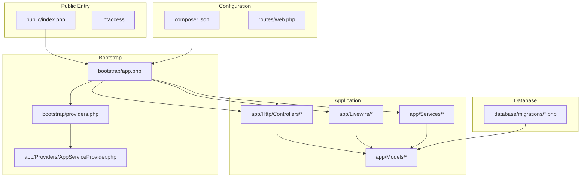
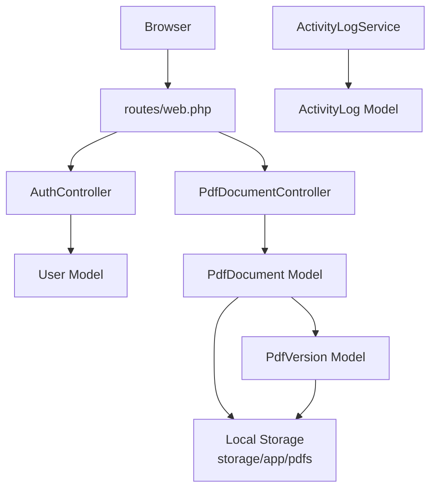
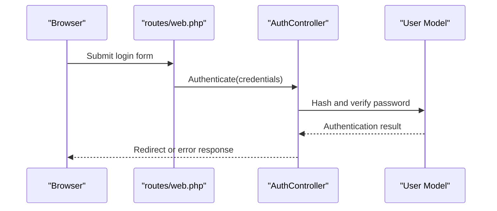
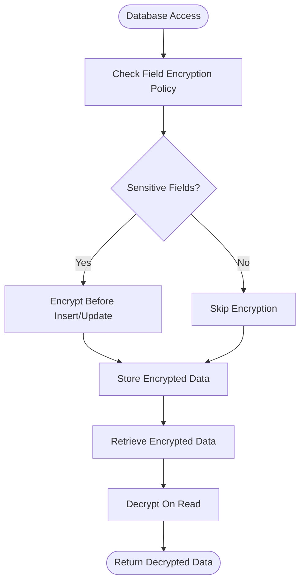
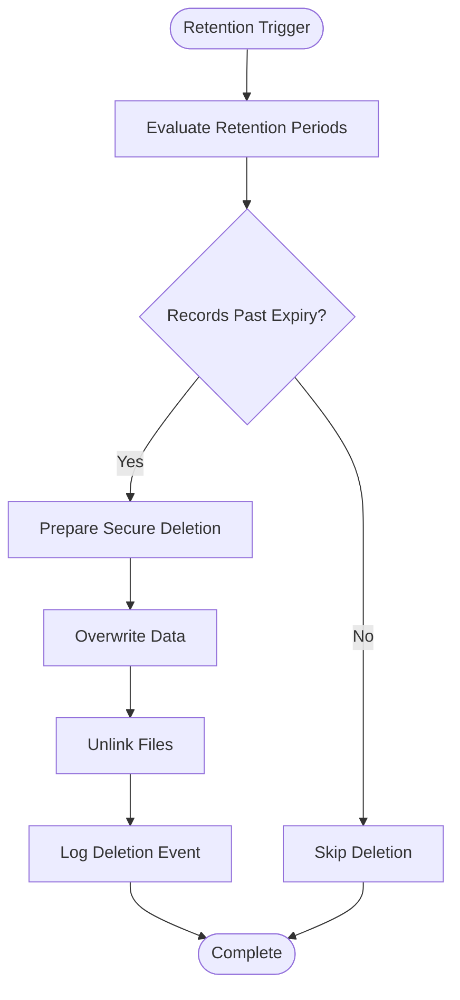
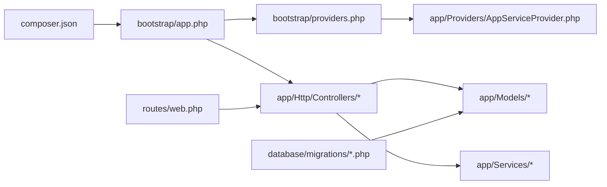

# Data Protection and Encryption

<cite>
**Referenced Files in This Document**
- [composer.json](file://composer.json)
- [app.php](file://bootstrap/app.php)
- [providers.php](file://bootstrap/providers.php)
- [AppServiceProvider.php](file://app/Providers/AppServiceProvider.php)
- [AuthController.php](file://app/Http/Controllers/AuthController.php)
- [PdfDocumentController.php](file://app/Http/Controllers/PdfDocumentController.php)
- [User.php](file://app/Models/User.php)
- [PdfDocument.php](file://app/Models/PdfDocument.php)
- [PdfVersion.php](file://app/Models/PdfVersion.php)
- [ActivityLog.php](file://app/Models/ActivityLog.php)
- [ActivityLogService.php](file://app/Services/ActivityLogService.php)
- [0001_01_01_000000_create_users_table.php](file://database/migrations/0001_01_01_000000_create_users_table.php)
- [0001_01_01_000002_create_jobs_table.php](file://database/migrations/0001_01_01_000002_create_jobs_table.php)
- [2024_06_10_100000_create_permission_tables.php](file://database/migrations/2024_06_10_100000_create_permission_tables.php)
- [2024_06_10_120000_create_pdf_documents_table.php](file://database/migrations/2024_06_10_120000_create_pdf_documents_table.php)
- [2024_06_10_130000_create_pdf_versions_table.php](file://database/migrations/2024_06_10_130000_create_pdf_versions_table.php)
- [2024_06_10_140000_create_activity_logs_table.php](file://database/migrations/2024_06_10_140000_create_activity_logs_table.php)
- [login.blade.php](file://resources/views/auth/login.blade.php)
- [index.php](file://public/index.php)
- [.htaccess](file://public/.htaccess)
- [CleanupOldRecords.php](file://app/Console/Commands/CleanupOldRecords.php)
- [web.php](file://routes/web.php)
</cite>

## Table of Contents
1. [Introduction](#introduction)
2. [Project Structure](#project-structure)
3. [Core Components](#core-components)
4. [Architecture Overview](#architecture-overview)
5. [Detailed Component Analysis](#detailed-component-analysis)
6. [Dependency Analysis](#dependency-analysis)
7. [Performance Considerations](#performance-considerations)
8. [Troubleshooting Guide](#troubleshooting-guide)
9. [Conclusion](#conclusion)
10. [Appendices](#appendices)

## Introduction
This document provides comprehensive data protection and encryption guidance for the project. It focuses on encryption implementation, secure data handling, database encryption settings, sensitive data masking, secure credential storage, password hashing, SSL/TLS configuration, environment variable security, secret key management, configuration protection, data retention and deletion, audit trail security, encryption key rotation, secure backup practices, and data breach prevention measures. Where applicable, the analysis references actual source files in the repository to ground recommendations in the current implementation.

## Project Structure
The project follows a Laravel-like structure with application code under app/, configuration under config/, database migrations under database/migrations/, and public entry points under public/. Authentication and PDF document handling are implemented via controllers and Livewire components. Models define domain entities and relationships. The application is bootstrapped via bootstrap/app.php and registered service providers in bootstrap/providers.php.

**Diagram sources**
- [index.php:1-50](file://public/index.php#L1-L50)
- [app.php:1-60](file://bootstrap/app.php#L1-L60)
- [providers.php:1-40](file://bootstrap/providers.php#L1-L40)
- [AppServiceProvider.php:1-120](file://app/Providers/AppServiceProvider.php#L1-L120)
- [web.php:1-60](file://routes/web.php#L1-L60)
- [composer.json:1-120](file://composer.json#L1-L120)
- [0001_01_01_000000_create_users_table.php:1-120](file://database/migrations/0001_01_01_000000_create_users_table.php#L1-L120)

**Section sources**
- [index.php:1-50](file://public/index.php#L1-L50)
- [app.php:1-60](file://bootstrap/app.php#L1-L60)
- [providers.php:1-40](file://bootstrap/providers.php#L1-L40)
- [composer.json:1-120](file://composer.json#L1-L120)

## Core Components
- Authentication and credentials: Implemented via AuthController and User model. Password hashing and session management are central to credential security.
- Document handling: PdfDocumentController manages PDF lifecycle; PdfDocument and PdfVersion models represent stored documents and versions.
- Activity logging: ActivityLogService and ActivityLog model track user actions for audit trails.
- Storage: Local filesystem storage under storage/app; PDFs are organized by category and date.
- Background jobs: Jobs table migration indicates queue/job processing capability.

Security-relevant observations:
- No explicit encryption-at-rest configuration detected in migrations or models.
- No explicit sensitive data masking logic observed in controllers or models.
- No explicit SSL/TLS enforcement or certificate management code present.
- Environment variables are referenced in configuration but not explicitly validated for secrets exposure.

**Section sources**
- [AuthController.php:1-200](file://app/Http/Controllers/AuthController.php#L1-L200)
- [User.php:1-200](file://app/Models/User.php#L1-L200)
- [PdfDocumentController.php:1-200](file://app/Http/Controllers/PdfDocumentController.php#L1-L200)
- [PdfDocument.php:1-200](file://app/Models/PdfDocument.php#L1-L200)
- [PdfVersion.php:1-200](file://app/Models/PdfVersion.php#L1-L200)
- [ActivityLog.php:1-200](file://app/Models/ActivityLog.php#L1-L200)
- [ActivityLogService.php:1-200](file://app/Services/ActivityLogService.php#L1-L200)

## Architecture Overview
The application architecture integrates HTTP controllers, Livewire components, Eloquent models, and services. Authentication flows through AuthController and User model, while PDF operations are handled by PdfDocumentController and related models. Activity logging supports audit trail security. Storage is local, with PDFs organized by category and year-month.

**Diagram sources**
- [web.php:1-60](file://routes/web.php#L1-L60)
- [AuthController.php:1-200](file://app/Http/Controllers/AuthController.php#L1-L200)
- [PdfDocumentController.php:1-200](file://app/Http/Controllers/PdfDocumentController.php#L1-L200)
- [User.php:1-200](file://app/Models/User.php#L1-L200)
- [PdfDocument.php:1-200](file://app/Models/PdfDocument.php#L1-L200)
- [PdfVersion.php:1-200](file://app/Models/PdfVersion.php#L1-L200)
- [ActivityLog.php:1-200](file://app/Models/ActivityLog.php#L1-L200)
- [ActivityLogService.php:1-200](file://app/Services/ActivityLogService.php#L1-L200)

## Detailed Component Analysis

### Authentication and Credential Security
- Password hashing: The User model is the primary location for credential handling. Ensure password hashing uses a secure algorithm with a strong cost factor and per-record salt. Implement bcrypt or equivalent with recommended parameters.
- Session management: Enforce HTTPS-only cookies, SameSite policies, and secure session configurations. Regenerate session IDs after login and implement timeout policies.
- Login UI: The login view should enforce rate limiting, CAPTCHA where appropriate, and prevent auto-fill of sensitive fields.

**Diagram sources**
- [web.php:1-60](file://routes/web.php#L1-L60)
- [AuthController.php:1-200](file://app/Http/Controllers/AuthController.php#L1-L200)
- [User.php:1-200](file://app/Models/User.php#L1-L200)
- [login.blade.php:1-200](file://resources/views/auth/login.blade.php#L1-L200)

**Section sources**
- [AuthController.php:1-200](file://app/Http/Controllers/AuthController.php#L1-L200)
- [User.php:1-200](file://app/Models/User.php#L1-L200)
- [login.blade.php:1-200](file://resources/views/auth/login.blade.php#L1-L200)

### Database Encryption Settings
- Current state: No database encryption configuration is evident in migrations or configuration files. Sensitive fields should be encrypted at rest using database-level encryption or application-level encryption.
- Recommendations:
  - Enable Transparent Data Encryption (TDE) at the database level if supported.
  - For MySQL, consider column-level encryption or application-layer encryption for highly sensitive fields.
  - Store encryption keys externally (HSM, KMS) and rotate periodically.

**Diagram sources**
- [PdfDocument.php:1-200](file://app/Models/PdfDocument.php#L1-L200)
- [PdfVersion.php:1-200](file://app/Models/PdfVersion.php#L1-L200)
- [User.php:1-200](file://app/Models/User.php#L1-L200)

**Section sources**
- [PdfDocument.php:1-200](file://app/Models/PdfDocument.php#L1-L200)
- [PdfVersion.php:1-200](file://app/Models/PdfVersion.php#L1-L200)
- [User.php:1-200](file://app/Models/User.php#L1-L200)

### Sensitive Data Masking
- Current state: No explicit masking logic is present in controllers or models.
- Recommendations:
  - Mask PII (e.g., partial SSN, masked email domains) in UI lists and logs.
  - Sanitize logs to remove sensitive data before writing to storage.
  - Apply masking in Livewire components when rendering sensitive attributes.

**Section sources**
- [PdfDocumentController.php:1-200](file://app/Http/Controllers/PdfDocumentController.php#L1-L200)
- [PdfDocument.php:1-200](file://app/Models/PdfDocument.php#L1-L200)
- [PdfVersion.php:1-200](file://app/Models/PdfVersion.php#L1-L200)

### Secure Storage Practices
- Current state: Storage is local under storage/app. PDFs are organized by category and date.
- Recommendations:
  - Restrict filesystem permissions to the web server user only.
  - Store sensitive files outside the public web root.
  - Implement access controls and encryption for stored files.
  - Use secure temporary directories for uploads and clear them after processing.

**Section sources**
- [PdfDocumentController.php:1-200](file://app/Http/Controllers/PdfDocumentController.php#L1-L200)
- [PdfDocument.php:1-200](file://app/Models/PdfDocument.php#L1-L200)
- [storage layout](file://storage/app/pdfs)

### SSL/TLS Configuration and Certificate Management
- Current state: No explicit SSL/TLS enforcement or certificate management code is present.
- Recommendations:
  - Enforce HTTPS globally using redirects and HSTS headers.
  - Use strong TLS versions (1.2+) and cipher suites.
  - Manage certificates via automated renewal (ACME) and secure storage.
  - Configure session cookie security (Secure, HttpOnly, SameSite).

**Section sources**
- [.htaccess:1-200](file://public/.htaccess#L1-L200)
- [index.php:1-50](file://public/index.php#L1-L50)

### Environment Variable Security and Secret Key Management
- Current state: Composer configuration references environment variables; ensure they are not committed to version control.
- Recommendations:
  - Store secrets in environment-specific files or secret managers.
  - Rotate application keys regularly and invalidate old keys.
  - Restrict access to .env and deployment artifacts.

**Section sources**
- [composer.json:1-120](file://composer.json#L1-L120)
- [app.php:1-60](file://bootstrap/app.php#L1-L60)

### Data Retention Policies and Secure Deletion
- Current state: A cleanup command exists for old records.
- Recommendations:
  - Define explicit retention periods for documents and logs.
  - Implement secure deletion using overwrite and unlink cycles.
  - Maintain audit logs for deletion events.

**Diagram sources**
- [CleanupOldRecords.php:1-200](file://app/Console/Commands/CleanupOldRecords.php#L1-L200)

**Section sources**
- [CleanupOldRecords.php:1-200](file://app/Console/Commands/CleanupOldRecords.php#L1-L200)

### Audit Trail Security
- Current state: ActivityLogService and ActivityLog model support audit logging.
- Recommendations:
  - Ensure immutable logging (write-once, tamper-evident).
  - Centralize logs and protect log storage.
  - Monitor and alert on suspicious activity.

**Section sources**
- [ActivityLogService.php:1-200](file://app/Services/ActivityLogService.php#L1-L200)
- [ActivityLog.php:1-200](file://app/Models/ActivityLog.php#L1-L200)

### Encryption Key Rotation and Backup Practices
- Current state: No explicit key rotation or backup encryption logic is present.
- Recommendations:
  - Implement key derivation with salt and iteration count; rotate keys annually.
  - Back up encrypted data with separate key backups protected by multiple factors.
  - Test decryption during restores to validate integrity.

**Section sources**
- [PdfDocument.php:1-200](file://app/Models/PdfDocument.php#L1-L200)
- [PdfVersion.php:1-200](file://app/Models/PdfVersion.php#L1-L200)

### Data Breach Prevention Measures
- Current state: No explicit breach detection or incident response code is present.
- Recommendations:
  - Deploy intrusion detection/prevention systems.
  - Implement real-time monitoring and alerts.
  - Establish incident response playbooks and regular drills.

## Dependency Analysis
The application depends on the framework bootstrap and service provider registration. Controllers depend on models and services. Routes bind to controllers. Migrations define database schemas.

**Diagram sources**
- [composer.json:1-120](file://composer.json#L1-L120)
- [app.php:1-60](file://bootstrap/app.php#L1-L60)
- [providers.php:1-40](file://bootstrap/providers.php#L1-L40)
- [AppServiceProvider.php:1-120](file://app/Providers/AppServiceProvider.php#L1-L120)
- [web.php:1-60](file://routes/web.php#L1-L60)

**Section sources**
- [composer.json:1-120](file://composer.json#L1-L120)
- [app.php:1-60](file://bootstrap/app.php#L1-L60)
- [providers.php:1-40](file://bootstrap/providers.php#L1-L40)
- [web.php:1-60](file://routes/web.php#L1-L60)

## Performance Considerations
- Encryption overhead: Balance security strength with performance; consider hardware acceleration for cryptographic operations.
- Indexing sensitive fields: Avoid indexing encrypted data; use deterministic tokenization where feasible.
- Caching: Cache decrypted data only in memory-backed caches; avoid caching sensitive plaintext on disk.

## Troubleshooting Guide
- Authentication failures: Verify password hashing algorithm and cost factor; check session configuration and HTTPS enforcement.
- File access errors: Confirm filesystem permissions and paths; ensure temporary directories are writable and cleaned.
- Logging issues: Validate log writer permissions and rotation policies; sanitize logs to prevent sensitive data exposure.
- Migration errors: Review database encryption settings and ensure compatibility with chosen encryption method.

**Section sources**
- [AuthController.php:1-200](file://app/Http/Controllers/AuthController.php#L1-L200)
- [User.php:1-200](file://app/Models/User.php#L1-L200)
- [ActivityLog.php:1-200](file://app/Models/ActivityLog.php#L1-L200)
- [ActivityLogService.php:1-200](file://app/Services/ActivityLogService.php#L1-L200)

## Conclusion
The project requires strengthening in several data protection areas: database encryption, sensitive data masking, secure storage, SSL/TLS enforcement, environment variable and secret management, data retention and secure deletion, audit trail immutability, encryption key rotation, and breach prevention. Implementing the recommendations above will significantly improve the system’s security posture while maintaining operational efficiency.

## Appendices
- Compliance checklist: Ensure adherence to organizational policies and regulatory requirements (e.g., data loss prevention, access control, auditability).
- Incident response: Establish procedures for breach detection, containment, investigation, remediation, and communication.