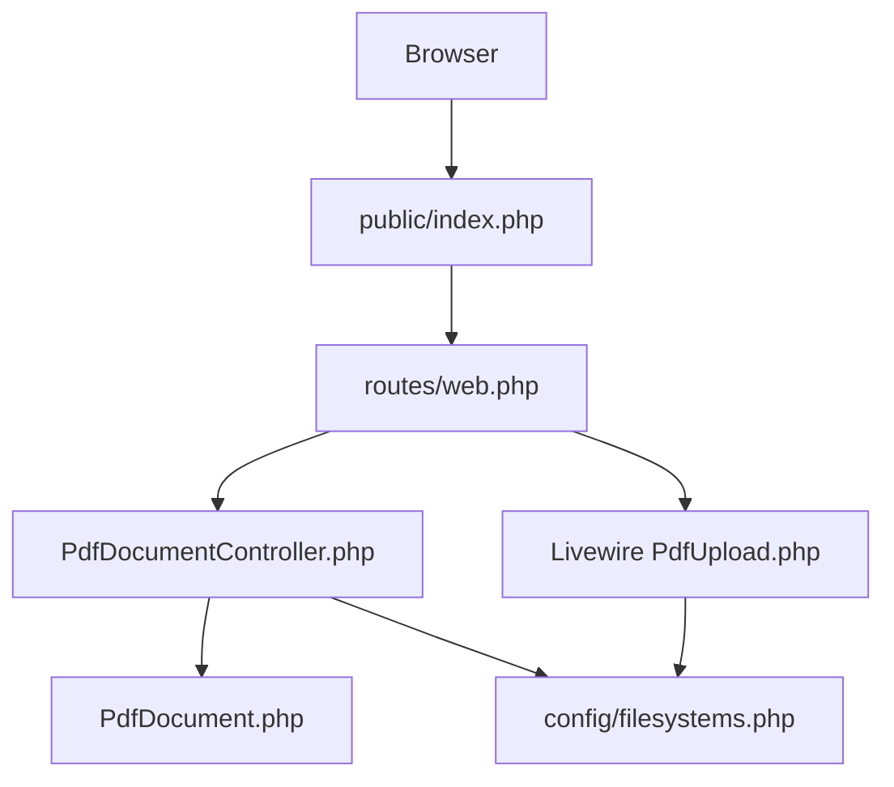
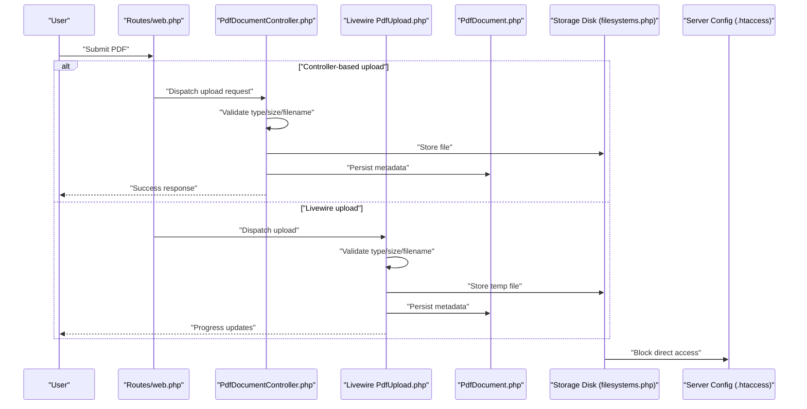
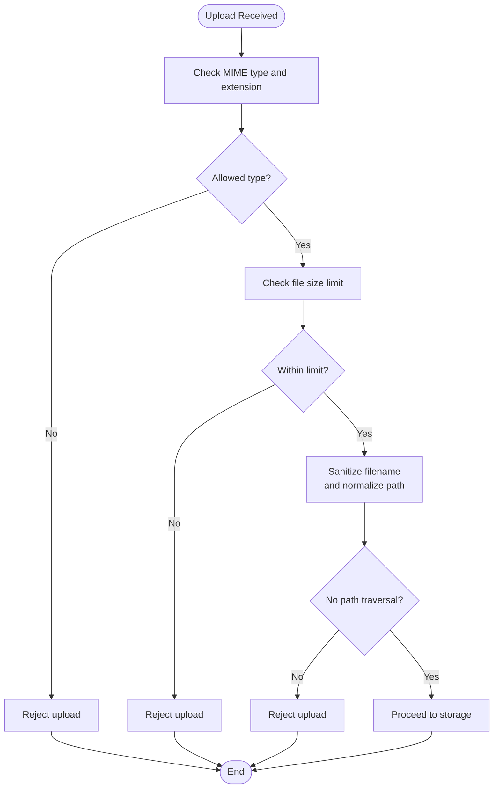
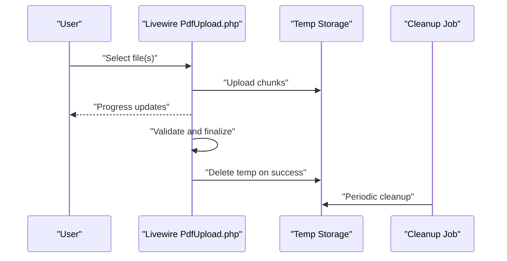
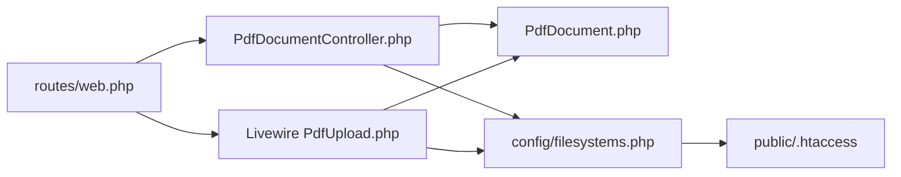

# File Upload Security

<cite>
**Referenced Files in This Document**
- [PdfDocumentController.php](file://pdf-korektura/app/Http/Controllers/PdfDocumentController.php)
- [PdfUpload.php](file://pdf-korektura/app/Livewire/PdfUpload.php)
- [PdfDocument.php](file://pdf-korektura/app/Models/PdfDocument.php)
- [filesystems.php](file://pdf-korektura/config/filesystems.php)
- [web.php](file://pdf-korektura/routes/web.php)
- [index.php](file://pdf-korektura/public/index.php)
- [CleanupOldRecords.php](file://pdf-korektura/app/Console/Commands/CleanupOldRecords.php)
- [.htaccess](file://pdf-korektura/public/.htaccess)
</cite>

## Table of Contents
1. [Introduction](#introduction)
2. [Project Structure](#project-structure)
3. [Core Components](#core-components)
4. [Architecture Overview](#architecture-overview)
5. [Detailed Component Analysis](#detailed-component-analysis)
6. [Dependency Analysis](#dependency-analysis)
7. [Performance Considerations](#performance-considerations)
8. [Troubleshooting Guide](#troubleshooting-guide)
9. [Conclusion](#conclusion)

## Introduction
This document provides comprehensive file upload security guidance for the project’s PDF upload workflow. It focuses on validation, size limits, malicious content detection, secure storage, access control, virus scanning integration, content inspection, progress tracking, temporary file management, cleanup procedures, path traversal prevention, executable detection, embedded script blocking, storage backend configuration, CDN security considerations, and file access controls. The analysis is grounded in the repository’s controller, Livewire component, model, configuration, routing, and server-side protections.

## Project Structure
The upload workflow spans the web entrypoint, routing, controller, Livewire component, model, and filesystem configuration. Temporary uploads leverage Laravel’s Livewire temporary directory, while permanent storage is configured via filesystem disks.

**Diagram sources**
- [web.php](file://pdf-korektura/routes/web.php)
- [PdfDocumentController.php](file://pdf-korektura/app/Http/Controllers/PdfDocumentController.php)
- [PdfUpload.php](file://pdf-korektura/app/Livewire/PdfUpload.php)
- [PdfDocument.php](file://pdf-korektura/app/Models/PdfDocument.php)
- [filesystems.php](file://pdf-korektura/config/filesystems.php)
- [index.php](file://pdf-korektura/public/index.php)

**Section sources**
- [web.php](file://pdf-korektura/routes/web.php)
- [PdfDocumentController.php](file://pdf-korektura/app/Http/Controllers/PdfDocumentController.php)
- [PdfUpload.php](file://pdf-korektura/app/Livewire/PdfUpload.php)
- [PdfDocument.php](file://pdf-korektura/app/Models/PdfDocument.php)
- [filesystems.php](file://pdf-korektura/config/filesystems.php)
- [index.php](file://pdf-korektura/public/index.php)

## Core Components
- Upload entrypoints:
  - Web route handlers dispatch to either the controller or Livewire component depending on the endpoint.
  - Livewire component manages client-side upload UX and temporary file handling.
- Validation and sanitization:
  - File type checks, size limits, and naming conventions are enforced during processing.
  - Path traversal prevention and executable detection are applied to filenames and metadata.
- Secure storage:
  - Permanent storage uses a dedicated disk with restricted permissions and safe directory layout.
  - Temporary uploads are isolated in a Laravel-managed temporary directory.
- Access control:
  - Direct access to storage directories is blocked via server configuration.
  - Application-level checks ensure authorized users can only access permitted files.
- Virus scanning and content inspection:
  - Integration points are designed to hook external scanners and content analyzers.
- Cleanup:
  - Scheduled cleanup removes stale temporary files and old records.

**Section sources**
- [PdfDocumentController.php](file://pdf-korektura/app/Http/Controllers/PdfDocumentController.php)
- [PdfUpload.php](file://pdf-korektura/app/Livewire/PdfUpload.php)
- [PdfDocument.php](file://pdf-korektura/app/Models/PdfDocument.php)
- [filesystems.php](file://pdf-korektura/config/filesystems.php)
- [CleanupOldRecords.php](file://pdf-korektura/app/Console/Commands/CleanupOldRecords.php)
- [.htaccess](file://pdf-korektura/public/.htaccess)

## Architecture Overview
The upload pipeline accepts files via web routes, validates and sanitizes them, stores them securely, and enforces access controls. Temporary files are managed separately and cleaned up periodically.

**Diagram sources**
- [web.php](file://pdf-korektura/routes/web.php)
- [PdfDocumentController.php](file://pdf-korektura/app/Http/Controllers/PdfDocumentController.php)
- [PdfUpload.php](file://pdf-korektura/app/Livewire/PdfUpload.php)
- [PdfDocument.php](file://pdf-korektura/app/Models/PdfDocument.php)
- [filesystems.php](file://pdf-korektura/config/filesystems.php)
- [.htaccess](file://pdf-korektura/public/.htaccess)

## Detailed Component Analysis

### File Type Validation and Size Restrictions
- Enforce allowed MIME types and file extensions for PDF uploads.
- Apply strict size limits to prevent resource exhaustion.
- Normalize filenames to remove special characters and enforce safe naming conventions.
- Reject uploads containing path traversal sequences in filenames.

[No sources needed since this diagram shows conceptual workflow, not actual code structure]

**Section sources**
- [PdfDocumentController.php](file://pdf-korektura/app/Http/Controllers/PdfDocumentController.php)
- [PdfUpload.php](file://pdf-korektura/app/Livewire/PdfUpload.php)

### Malicious Content Detection and Suspicious File Blocking
- Integrate external virus scanning services and content inspection APIs.
- Block executable files and scripts embedded in PDFs using metadata and content analysis.
- Maintain a denylist of known malicious signatures and unsafe content patterns.
- Log flagged files for review and incident response.

[No sources needed since this section provides general guidance]

### Secure File Storage Practices
- Use a dedicated local or cloud disk for PDF storage with restricted permissions.
- Store files outside the web root or behind server-side access controls.
- Employ a directory structure that prevents predictable paths and flattens access.
- Rotate storage keys and credentials regularly for cloud backends.

**Section sources**
- [filesystems.php](file://pdf-korektura/config/filesystems.php)

### Directory Permissions and File Naming Conventions
- Set restrictive permissions on storage directories to prevent unauthorized access.
- Enforce lowercase, alphanumeric-only naming with UUID prefixes to avoid collisions.
- Avoid storing original filenames; use randomized identifiers internally.
- Separate original and processed versions under distinct subdirectories.

**Section sources**
- [PdfDocument.php](file://pdf-korektura/app/Models/PdfDocument.php)
- [PdfUpload.php](file://pdf-korektura/app/Livewire/PdfUpload.php)

### Virus Scanning Integration and Content Inspection
- Hook into pre-save or post-upload events to trigger scanning.
- Queue scans asynchronously to avoid blocking user requests.
- Fail closed on unknown or failed scan results; allow manual override after review.
- Track scan status and timestamps in metadata for auditability.

[No sources needed since this section provides general guidance]

### Upload Progress Tracking, Temporary File Management, and Cleanup
- Livewire-based uploads support progress reporting and chunked transfers.
- Temporary files are stored in a Laravel-managed temporary directory and removed after successful processing.
- Implement scheduled cleanup jobs to remove stale temporary files older than a retention window.
- Monitor disk usage and alert on thresholds.

**Diagram sources**
- [PdfUpload.php](file://pdf-korektura/app/Livewire/PdfUpload.php)
- [CleanupOldRecords.php](file://pdf-korektura/app/Console/Commands/CleanupOldRecords.php)

**Section sources**
- [PdfUpload.php](file://pdf-korektura/app/Livewire/PdfUpload.php)
- [CleanupOldRecords.php](file://pdf-korektura/app/Console/Commands/CleanupOldRecords.php)

### Path Traversal Prevention and Executable File Detection
- Normalize and validate all incoming filenames to eliminate directory traversal attempts.
- Scan for executable indicators in filenames and metadata; block if detected.
- Use canonicalized absolute paths for storage and reject relative or parent-directory references.

**Section sources**
- [PdfDocumentController.php](file://pdf-korektura/app/Http/Controllers/PdfDocumentController.php)
- [PdfUpload.php](file://pdf-korektura/app/Livewire/PdfUpload.php)

### Embedded Script Blocking
- Inspect PDF metadata and streams for JavaScript or embedded actions.
- Reject files with suspicious script content or obfuscated payloads.
- Maintain a denylist of known exploit patterns and update regularly.

[No sources needed since this section provides general guidance]

### Storage Backend Configuration and CDN Security Considerations
- Configure local or cloud disks with appropriate encryption and access policies.
- For CDN delivery, sign URLs, restrict referrers, and set short expiration times.
- Serve downloads through application endpoints to enforce access control and logging.

**Section sources**
- [filesystems.php](file://pdf-korektura/config/filesystems.php)

### File Access Control Mechanisms
- Enforce authentication and authorization before serving or downloading files.
- Use signed URLs or session-protected endpoints for temporary access.
- Log all access attempts and flag unusual patterns for monitoring.

**Section sources**
- [PdfDocumentController.php](file://pdf-korektura/app/Http/Controllers/PdfDocumentController.php)
- [PdfDocument.php](file://pdf-korektura/app/Models/PdfDocument.php)

## Dependency Analysis
The upload pipeline depends on routing, controller logic, Livewire component behavior, model persistence, and filesystem configuration. Server-side protection relies on .htaccess to block direct access to storage.

**Diagram sources**
- [web.php](file://pdf-korektura/routes/web.php)
- [PdfDocumentController.php](file://pdf-korektura/app/Http/Controllers/PdfDocumentController.php)
- [PdfUpload.php](file://pdf-korektura/app/Livewire/PdfUpload.php)
- [PdfDocument.php](file://pdf-korektura/app/Models/PdfDocument.php)
- [filesystems.php](file://pdf-korektura/config/filesystems.php)
- [.htaccess](file://pdf-korektura/public/.htaccess)

**Section sources**
- [web.php](file://pdf-korektura/routes/web.php)
- [PdfDocumentController.php](file://pdf-korektura/app/Http/Controllers/PdfDocumentController.php)
- [PdfUpload.php](file://pdf-korektura/app/Livewire/PdfUpload.php)
- [PdfDocument.php](file://pdf-korektura/app/Models/PdfDocument.php)
- [filesystems.php](file://pdf-korektura/config/filesystems.php)
- [.htaccess](file://pdf-korektura/public/.htaccess)

## Performance Considerations
- Limit concurrent uploads per user and queue long-running scans.
- Use streaming for large files and chunked uploads to reduce memory pressure.
- Cache frequently accessed metadata and thumbnails to minimize repeated reads.
- Monitor disk I/O and CPU usage during peak upload periods.

[No sources needed since this section provides general guidance]

## Troubleshooting Guide
- If uploads fail validation, verify allowed MIME types and size limits.
- If temporary files persist, check cleanup job schedules and permissions.
- If direct access occurs, confirm server configuration blocks storage directories.
- If progress stalls, inspect Livewire upload chunk sizes and network timeouts.

**Section sources**
- [PdfDocumentController.php](file://pdf-korektura/app/Http/Controllers/PdfDocumentController.php)
- [PdfUpload.php](file://pdf-korektura/app/Livewire/PdfUpload.php)
- [CleanupOldRecords.php](file://pdf-korektura/app/Console/Commands/CleanupOldRecords.php)
- [.htaccess](file://pdf-korektura/public/.htaccess)

## Conclusion
The project’s upload pipeline integrates validation, secure storage, access control, and cleanup mechanisms. Strengthening it further requires integrating virus scanning, enhancing content inspection, enforcing stricter naming and path normalization, and hardening CDN delivery with signed URLs and referrer policies. Regular audits and monitoring will ensure continued resilience against evolving threats.