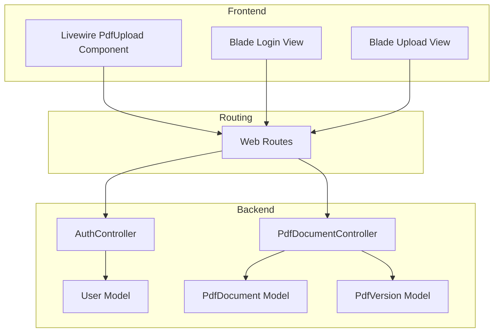
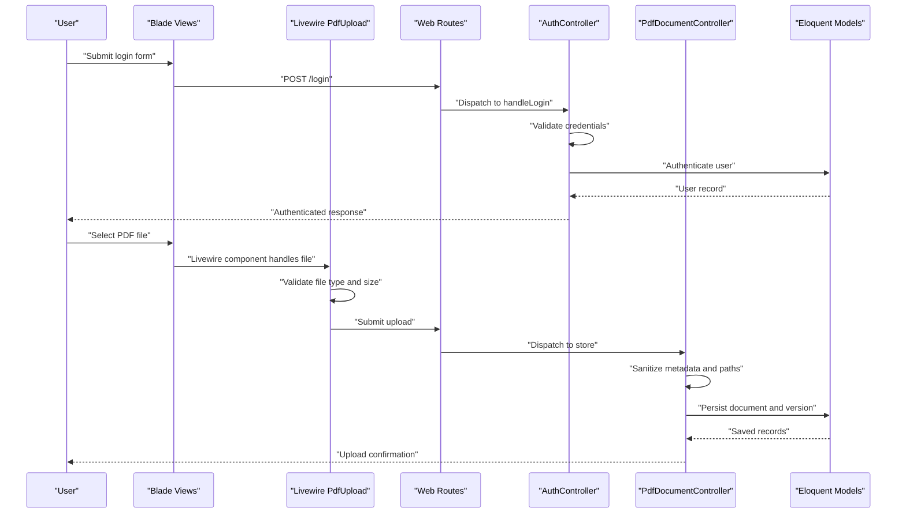
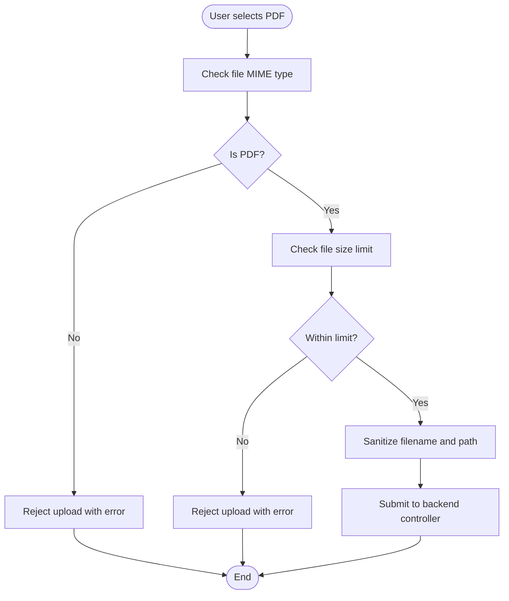
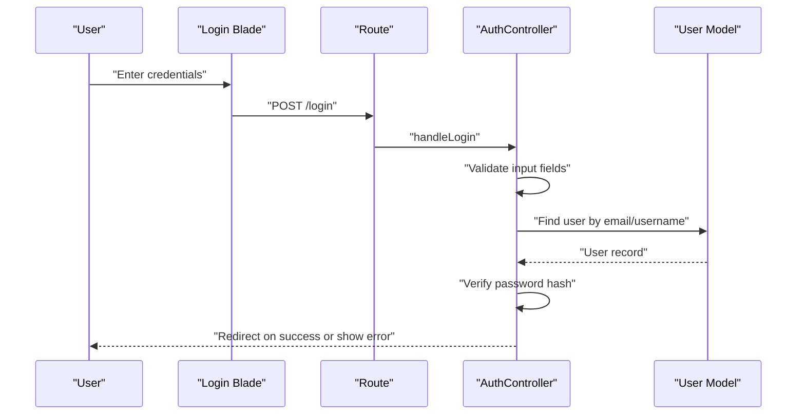
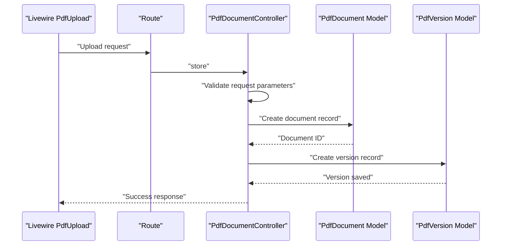
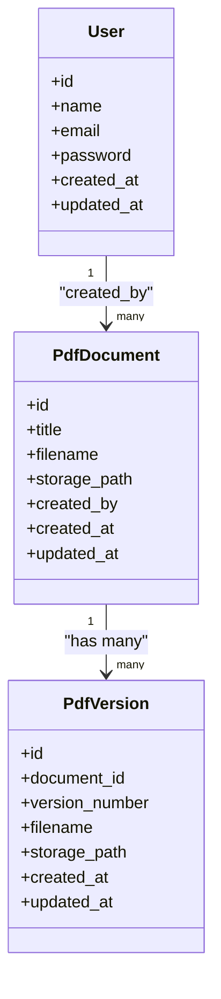
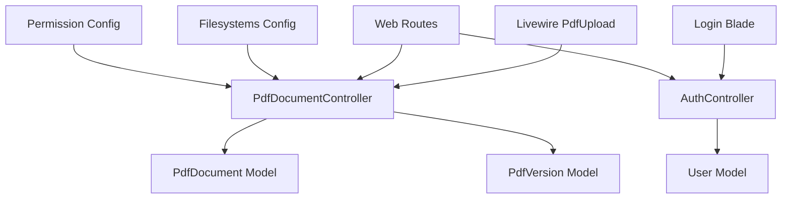

# Input Validation and Sanitization

<cite>
**Referenced Files in This Document**
- [PdfUpload.php](file://pdf-korektura/app/Livewire/PdfUpload.php)
- [PdfDocumentController.php](file://pdf-korektura/app/Http/Controllers/PdfDocumentController.php)
- [AuthController.php](file://pdf-korektura/app/Http/Controllers/AuthController.php)
- [PdfDocument.php](file://pdf-korektura/app/Models/PdfDocument.php)
- [PdfVersion.php](file://pdf-korektura/app/Models/PdfVersion.php)
- [User.php](file://pdf-korektura/app/Models/User.php)
- [web.php](file://pdf-korektura/routes/web.php)
- [composer.json](file://pdf-korektura/composer.json)
- [filesystems.php](file://pdf-korektura/config/filesystems.php)
- [permission.php](file://pdf-korektura/config/permission.php)
- [login.blade.php](file://pdf-korektura/resources/views/auth/login.blade.php)
- [pdf-upload.blade.php](file://pdf-korektura/resources/views/livewire/pdf-upload.blade.php)
- [CleanupOldRecords.php](file://pdf-korektura/app/Console/Commands/CleanupOldRecords.php)
</cite>

## Table of Contents
1. [Introduction](#introduction)
2. [Project Structure](#project-structure)
3. [Core Components](#core-components)
4. [Architecture Overview](#architecture-overview)
5. [Detailed Component Analysis](#detailed-component-analysis)
6. [Dependency Analysis](#dependency-analysis)
7. [Performance Considerations](#performance-considerations)
8. [Troubleshooting Guide](#troubleshooting-guide)
9. [Conclusion](#conclusion)

## Introduction
This document provides comprehensive input validation and sanitization documentation for the application. It covers all user input sources, validation rules, sanitization techniques, middleware, request filtering, parameter sanitization, file upload validation (with emphasis on PDFs), database input sanitization, query parameter handling, XSS prevention, and security measures against SQL injection and command injection. The focus is on the PDF upload workflow, authentication inputs, and backend controllers/models that process user-provided data.

## Project Structure
The application follows a Laravel-based structure with Livewire components for frontend interactions and controllers for backend processing. Key areas relevant to input validation and sanitization include:
- Livewire components for PDF uploads and user interactions
- Controllers for authentication and PDF document management
- Models representing domain entities
- Routes defining entry points
- Configuration files for filesystems and permissions
- Blade templates for forms and views

**Diagram sources**
- [PdfUpload.php](file://pdf-korektura/app/Livewire/PdfUpload.php)
- [AuthController.php](file://pdf-korektura/app/Http/Controllers/AuthController.php)
- [PdfDocumentController.php](file://pdf-korektura/app/Http/Controllers/PdfDocumentController.php)
- [User.php](file://pdf-korektura/app/Models/User.php)
- [PdfDocument.php](file://pdf-korektura/app/Models/PdfDocument.php)
- [PdfVersion.php](file://pdf-korektura/app/Models/PdfVersion.php)
- [web.php](file://pdf-korektura/routes/web.php)

**Section sources**
- [web.php](file://pdf-korektura/routes/web.php)
- [pdf-upload.blade.php](file://pdf-korektura/resources/views/livewire/pdf-upload.blade.php)
- [login.blade.php](file://pdf-korektura/resources/views/auth/login.blade.php)

## Core Components
This section outlines the primary components involved in input validation and sanitization:

- Livewire PdfUpload: Handles PDF selection, validation, and submission lifecycle.
- AuthController: Processes login credentials with validation and session management.
- PdfDocumentController: Manages PDF document creation, updates, and retrieval with validation and sanitization.
- Models: Encapsulate data access and enforce constraints at the persistence layer.
- Routes: Define entry points and bind requests to controllers.
- Configuration: Filesystems and permissions define safe storage and access policies.

Key responsibilities:
- Validate and sanitize user inputs at the boundary (controllers, Livewire components).
- Enforce file type and size constraints for uploads.
- Prevent XSS via proper output encoding and content verification.
- Ensure database inputs are sanitized and bound securely to prevent injection attacks.

**Section sources**
- [PdfUpload.php](file://pdf-korektura/app/Livewire/PdfUpload.php)
- [AuthController.php](file://pdf-korektura/app/Http/Controllers/AuthController.php)
- [PdfDocumentController.php](file://pdf-korektura/app/Http/Controllers/PdfDocumentController.php)
- [PdfDocument.php](file://pdf-korektura/app/Models/PdfDocument.php)
- [PdfVersion.php](file://pdf-korektura/app/Models/PdfVersion.php)
- [User.php](file://pdf-korektura/app/Models/User.php)

## Architecture Overview
The input validation and sanitization pipeline spans frontend and backend layers:

**Diagram sources**
- [login.blade.php](file://pdf-korektura/resources/views/auth/login.blade.php)
- [pdf-upload.blade.php](file://pdf-korektura/resources/views/livewire/pdf-upload.blade.php)
- [PdfUpload.php](file://pdf-korektura/app/Livewire/PdfUpload.php)
- [AuthController.php](file://pdf-korektura/app/Http/Controllers/AuthController.php)
- [PdfDocumentController.php](file://pdf-korektura/app/Http/Controllers/PdfDocumentController.php)
- [web.php](file://pdf-korektura/routes/web.php)

## Detailed Component Analysis

### Livewire PdfUpload Component
Responsibilities:
- Accept user-selected PDF files.
- Validate file type and size constraints.
- Sanitize filenames and paths.
- Trigger backend processing via controller actions.

Validation and sanitization mechanisms:
- File type checking: Restrict uploads to PDF documents.
- Size limits: Enforce maximum file size thresholds.
- Path sanitization: Normalize and validate destination paths.
- Content verification: Optionally verify PDF content integrity.

**Diagram sources**
- [PdfUpload.php](file://pdf-korektura/app/Livewire/PdfUpload.php)
- [pdf-upload.blade.php](file://pdf-korektura/resources/views/livewire/pdf-upload.blade.php)

**Section sources**
- [PdfUpload.php](file://pdf-korektura/app/Livewire/PdfUpload.php)
- [pdf-upload.blade.php](file://pdf-korektura/resources/views/livewire/pdf-upload.blade.php)

### Authentication Controller
Responsibilities:
- Validate login credentials.
- Authenticate users against stored records.
- Manage session creation and redirection.

Validation and sanitization mechanisms:
- Input validation: Confirm presence and format of username/email and password.
- Credential verification: Compare hashed passwords using secure comparison.
- Session management: Establish secure session state after successful authentication.

**Diagram sources**
- [login.blade.php](file://pdf-korektura/resources/views/auth/login.blade.php)
- [AuthController.php](file://pdf-korektura/app/Http/Controllers/AuthController.php)
- [User.php](file://pdf-korektura/app/Models/User.php)
- [web.php](file://pdf-korektura/routes/web.php)

**Section sources**
- [AuthController.php](file://pdf-korektura/app/Http/Controllers/AuthController.php)
- [User.php](file://pdf-korektura/app/Models/User.php)
- [login.blade.php](file://pdf-korektura/resources/views/auth/login.blade.php)

### PDF Document Controller
Responsibilities:
- Store uploaded PDFs.
- Create document and version records.
- Sanitize metadata and paths.
- Enforce access controls and permissions.

Validation and sanitization mechanisms:
- Parameter validation: Confirm presence and correctness of document attributes.
- Path normalization: Ensure safe filesystem paths for storage.
- Metadata sanitization: Clean and validate document metadata.
- Permission checks: Verify user roles and access rights before operations.

**Diagram sources**
- [PdfUpload.php](file://pdf-korektura/app/Livewire/PdfUpload.php)
- [PdfDocumentController.php](file://pdf-korektura/app/Http/Controllers/PdfDocumentController.php)
- [PdfDocument.php](file://pdf-korektura/app/Models/PdfDocument.php)
- [PdfVersion.php](file://pdf-korektura/app/Models/PdfVersion.php)
- [web.php](file://pdf-korektura/routes/web.php)

**Section sources**
- [PdfDocumentController.php](file://pdf-korektura/app/Http/Controllers/PdfDocumentController.php)
- [PdfDocument.php](file://pdf-korektura/app/Models/PdfDocument.php)
- [PdfVersion.php](file://pdf-korektura/app/Models/PdfVersion.php)

### Models and Database Input Sanitization
Responsibilities:
- Define schema constraints and relationships.
- Provide Eloquent access patterns that minimize raw SQL risks.
- Enforce data integrity and type safety.

Validation and sanitization mechanisms:
- Eloquent model attributes: Use guarded/safe attributes to prevent mass assignment vulnerabilities.
- Query builder usage: Prefer parameterized queries and avoid dynamic SQL concatenation.
- Accessors and mutators: Sanitize and normalize data during read/write operations.
- Relationship constraints: Enforce referential integrity at the database level.

**Diagram sources**
- [User.php](file://pdf-korektura/app/Models/User.php)
- [PdfDocument.php](file://pdf-korektura/app/Models/PdfDocument.php)
- [PdfVersion.php](file://pdf-korektura/app/Models/PdfVersion.php)

**Section sources**
- [User.php](file://pdf-korektura/app/Models/User.php)
- [PdfDocument.php](file://pdf-korektura/app/Models/PdfDocument.php)
- [PdfVersion.php](file://pdf-korektura/app/Models/PdfVersion.php)

### Filesystem and Permissions Configuration
Responsibilities:
- Define storage disks and visibility settings.
- Configure access permissions for uploaded files.
- Enforce secure file handling policies.

Validation and sanitization mechanisms:
- Disk configuration: Isolate uploads under dedicated storage paths.
- Visibility controls: Restrict public access to sensitive files.
- Permission enforcement: Apply role-based access control to file operations.

**Section sources**
- [filesystems.php](file://pdf-korektura/config/filesystems.php)
- [permission.php](file://pdf-korektura/config/permission.php)

### Routes and Request Filtering
Responsibilities:
- Define entry points for authentication and PDF operations.
- Bind requests to appropriate controllers.
- Centralize request filtering and middleware application.

Validation and sanitization mechanisms:
- Route-level validation: Ensure required parameters are present.
- Middleware application: Apply authentication and authorization filters.
- Parameter extraction: Normalize and sanitize route parameters.

**Section sources**
- [web.php](file://pdf-korektura/routes/web.php)

### Console Command for Cleanup
Responsibilities:
- Periodically clean up old records and temporary files.
- Maintain system hygiene and storage quotas.

Validation and sanitization mechanisms:
- Safe deletion patterns: Use model-level deletion with safeguards.
- Logging and auditing: Track cleanup operations for compliance.

**Section sources**
- [CleanupOldRecords.php](file://pdf-korektura/app/Console/Commands/CleanupOldRecords.php)

## Dependency Analysis
The validation and sanitization logic depends on several subsystems:

**Diagram sources**
- [PdfUpload.php](file://pdf-korektura/app/Livewire/PdfUpload.php)
- [AuthController.php](file://pdf-korektura/app/Http/Controllers/AuthController.php)
- [PdfDocumentController.php](file://pdf-korektura/app/Http/Controllers/PdfDocumentController.php)
- [User.php](file://pdf-korektura/app/Models/User.php)
- [PdfDocument.php](file://pdf-korektura/app/Models/PdfDocument.php)
- [PdfVersion.php](file://pdf-korektura/app/Models/PdfVersion.php)
- [web.php](file://pdf-korektura/routes/web.php)
- [filesystems.php](file://pdf-korektura/config/filesystems.php)
- [permission.php](file://pdf-korektura/config/permission.php)

**Section sources**
- [web.php](file://pdf-korektura/routes/web.php)
- [PdfUpload.php](file://pdf-korektura/app/Livewire/PdfUpload.php)
- [AuthController.php](file://pdf-korektura/app/Http/Controllers/AuthController.php)
- [PdfDocumentController.php](file://pdf-korektura/app/Http/Controllers/PdfDocumentController.php)

## Performance Considerations
- Validate early: Perform lightweight checks (type, size) before expensive operations.
- Batch validations: Group related validations to reduce repeated work.
- Caching: Cache permission checks and frequently accessed metadata.
- Asynchronous processing: Offload heavy tasks (PDF parsing) to background jobs.
- Resource limits: Enforce strict timeouts and memory limits for upload handlers.

## Troubleshooting Guide
Common issues and resolutions:
- Invalid file type errors: Ensure clients send PDF files with correct MIME types.
- Exceeded size limits: Implement client-side progress indicators and server-side enforcement.
- Authentication failures: Verify credential formats and hashing consistency.
- Permission denied: Confirm user roles and filesystem permissions.
- Database constraint violations: Review model attributes and migration definitions.

**Section sources**
- [PdfUpload.php](file://pdf-korektura/app/Livewire/PdfUpload.php)
- [AuthController.php](file://pdf-korektura/app/Http/Controllers/AuthController.php)
- [PdfDocumentController.php](file://pdf-korektura/app/Http/Controllers/PdfDocumentController.php)

## Conclusion
The application employs layered input validation and sanitization across Livewire components, controllers, models, and configuration files. PDF uploads are validated for type and size, sanitized for safe storage, and persisted with proper metadata. Authentication inputs are validated and processed securely. Database interactions leverage Eloquent and parameterized queries to mitigate injection risks. Additional measures such as filesystem permissions and permission configurations further strengthen security. By following the outlined practices and configurations, the system maintains robust input validation and sanitization across all user input sources.