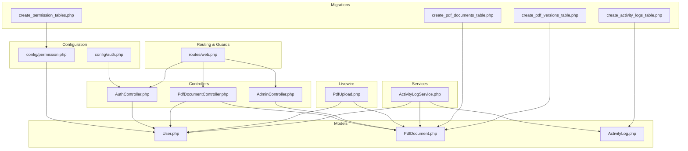
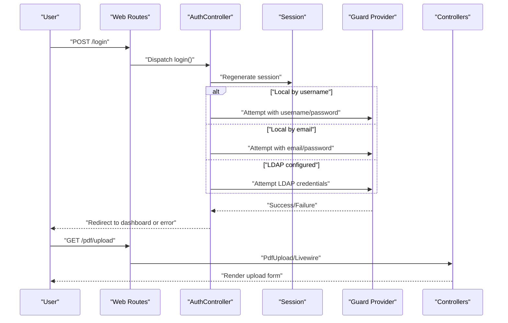
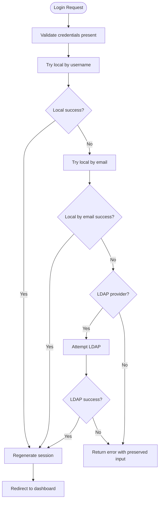
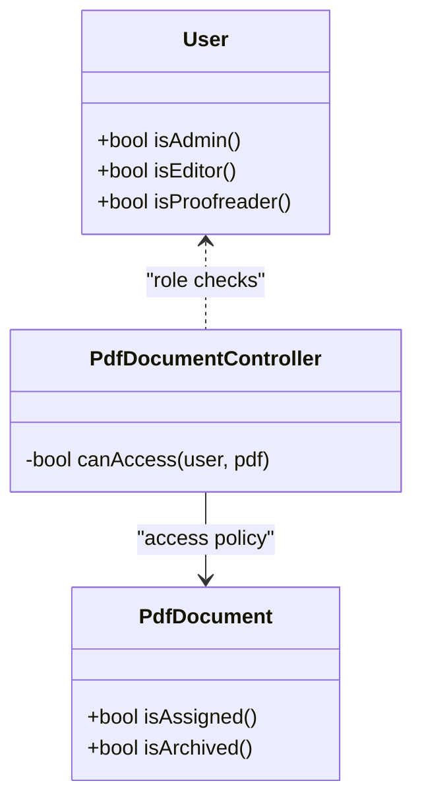
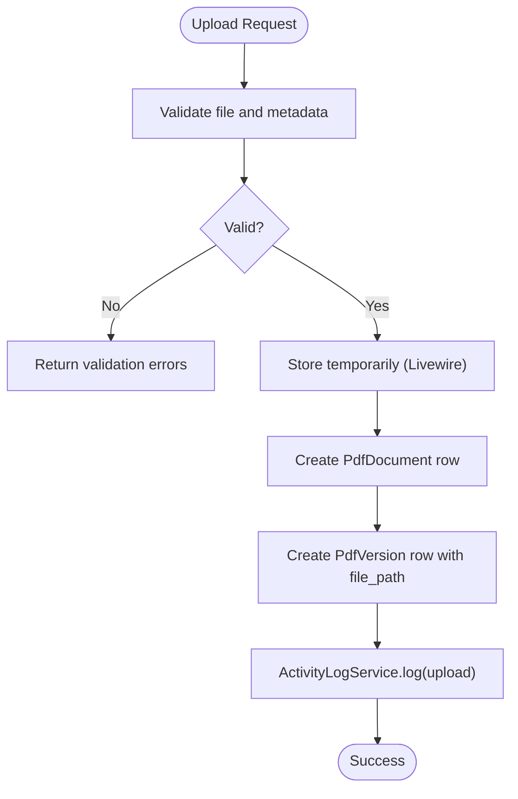
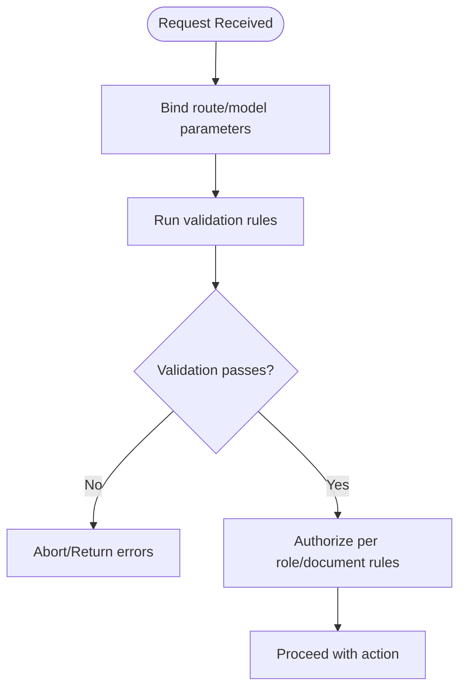
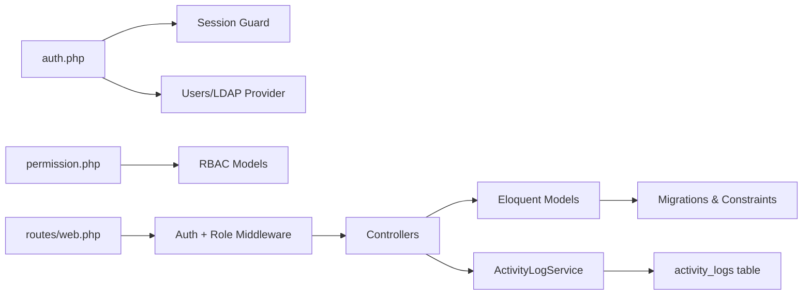

# Security Considerations

<cite>
**Referenced Files in This Document**
- [config/auth.php](file://config/auth.php)
- [config/permission.php](file://config/permission.php)
- [routes/web.php](file://routes/web.php)
- [app/Http/Controllers/AuthController.php](file://app/Http/Controllers/AuthController.php)
- [app/Http/Controllers/PdfDocumentController.php](file://app/Http/Controllers/PdfDocumentController.php)
- [app/Http/Controllers/AdminController.php](file://app/Http/Controllers/AdminController.php)
- [app/Models/User.php](file://app/Models/User.php)
- [app/Models/PdfDocument.php](file://app/Models/PdfDocument.php)
- [app/Services/ActivityLogService.php](file://app/Services/ActivityLogService.php)
- [app/Models/ActivityLog.php](file://app/Models/ActivityLog.php)
- [app/Livewire/PdfUpload.php](file://app/Livewire/PdfUpload.php)
- [database/migrations/2024_06_10_100000_create_permission_tables.php](file://database/migrations/2024_06_10_100000_create_permission_tables.php)
- [database/migrations/2024_06_10_120000_create_pdf_documents_table.php](file://database/migrations/2024_06_10_120000_create_pdf_documents_table.php)
- [database/migrations/2024_06_10_130000_create_pdf_versions_table.php](file://database/migrations/2024_06_10_130000_create_pdf_versions_table.php)
- [database/migrations/2024_06_10_140000_create_activity_logs_table.php](file://database/migrations/2024_06_10_140000_create_activity_logs_table.php)
</cite>

## Table of Contents
1. [Introduction](#introduction)
2. [Project Structure](#project-structure)
3. [Core Components](#core-components)
4. [Architecture Overview](#architecture-overview)
5. [Detailed Component Analysis](#detailed-component-analysis)
6. [Dependency Analysis](#dependency-analysis)
7. [Performance Considerations](#performance-considerations)
8. [Troubleshooting Guide](#troubleshooting-guide)
9. [Conclusion](#conclusion)
10. [Appendices](#appendices)

## Introduction
This document provides comprehensive security documentation for the PDF correction system. It covers authentication and session management, authorization via role-based access control (RBAC), file upload security, input validation and sanitization, data protection, security middleware and request filtering, audit logging and monitoring, and common vulnerability mitigations. The goal is to help operators and developers understand how security controls are implemented and how to maintain and extend them securely.

## Project Structure
Security-relevant parts of the system are organized around:
- Authentication and authorization configuration
- Web routes with middleware guards
- Controllers implementing access checks and actions
- Eloquent models with RBAC traits and scopes
- Livewire components enforcing validation and safe storage
- Database migrations defining constrained and indexed security-sensitive tables
- Activity logging service capturing user actions and IP addresses

**Diagram sources**
- [config/auth.php:1-49](file://config/auth.php#L1-L49)
- [config/permission.php:1-34](file://config/permission.php#L1-L34)
- [routes/web.php:1-54](file://routes/web.php#L1-L54)
- [app/Http/Controllers/AuthController.php:1-81](file://app/Http/Controllers/AuthController.php#L1-L81)
- [app/Http/Controllers/PdfDocumentController.php:1-82](file://app/Http/Controllers/PdfDocumentController.php#L1-L82)
- [app/Http/Controllers/AdminController.php:1-62](file://app/Http/Controllers/AdminController.php#L1-L62)
- [app/Models/User.php:1-71](file://app/Models/User.php#L1-L71)
- [app/Models/PdfDocument.php:1-130](file://app/Models/PdfDocument.php#L1-L130)
- [app/Models/ActivityLog.php:1-60](file://app/Models/ActivityLog.php#L1-L60)
- [app/Services/ActivityLogService.php:1-31](file://app/Services/ActivityLogService.php#L1-L31)
- [app/Livewire/PdfUpload.php:1-96](file://app/Livewire/PdfUpload.php#L1-L96)
- [database/migrations/2024_06_10_100000_create_permission_tables.php:1-122](file://database/migrations/2024_06_10_100000_create_permission_tables.php#L1-L122)
- [database/migrations/2024_06_10_120000_create_pdf_documents_table.php:1-32](file://database/migrations/2024_06_10_120000_create_pdf_documents_table.php#L1-L32)
- [database/migrations/2024_06_10_130000_create_pdf_versions_table.php:1-29](file://database/migrations/2024_06_10_130000_create_pdf_versions_table.php#L1-L29)
- [database/migrations/2024_06_10_140000_create_activity_logs_table.php:1-27](file://database/migrations/2024_06_10_140000_create_activity_logs_table.php#L1-L27)

**Section sources**
- [config/auth.php:1-49](file://config/auth.php#L1-L49)
- [config/permission.php:1-34](file://config/permission.php#L1-L34)
- [routes/web.php:1-54](file://routes/web.php#L1-L54)

## Core Components
- Authentication and session management:
  - Session-based guard with configurable provider and LDAP support.
  - Login attempts with fallbacks to username/email and optional LDAP.
  - Logout with session invalidation and CSRF token regeneration.
- Authorization via RBAC:
  - Roles and permissions managed via a dedicated package with cached permissions.
  - Route-level role middleware groups restrict access to upload, pool, assignments, and admin panels.
  - Model-level helpers and controller checks enforce per-document access rules.
- File upload security:
  - Strict validation for file type, size, and metadata.
  - Temporary storage during upload, then persisted with controlled paths.
  - Versioning and change summaries tracked in the database.
- Input validation and sanitization:
  - Form requests and Livewire rules validate and constrain inputs.
  - Date and integer constraints prevent malformed data.
- Data protection:
  - Password hashing and hidden sensitive attributes.
  - Database foreign key constraints and unique indexes protect referential integrity.
- Audit logging and monitoring:
  - Centralized logging service records actions, actors, and IP addresses.
  - Dedicated activity logs table with timestamps and relationships.
- Security middleware and request filtering:
  - Global auth middleware protects routes.
  - Role-based route groups apply fine-grained access control.

**Section sources**
- [app/Http/Controllers/AuthController.php:21-80](file://app/Http/Controllers/AuthController.php#L21-L80)
- [routes/web.php:25-53](file://routes/web.php#L25-L53)
- [app/Models/User.php:56-70](file://app/Models/User.php#L56-L70)
- [app/Http/Controllers/PdfDocumentController.php:65-81](file://app/Http/Controllers/PdfDocumentController.php#L65-L81)
- [app/Livewire/PdfUpload.php:27-47](file://app/Livewire/PdfUpload.php#L27-L47)
- [app/Services/ActivityLogService.php:20-29](file://app/Services/ActivityLogService.php#L20-L29)
- [app/Models/ActivityLog.php:21-27](file://app/Models/ActivityLog.php#L21-L27)

## Architecture Overview
The system enforces authentication and authorization at multiple layers:
- Transport and session: Laravel session guard.
- Application: Route middleware and controller checks.
- Data: RBAC model traits and database constraints.
- Audit: Centralized logging service.

**Diagram sources**
- [routes/web.php:21-23](file://routes/web.php#L21-L23)
- [app/Http/Controllers/AuthController.php:21-71](file://app/Http/Controllers/AuthController.php#L21-L71)

**Section sources**
- [config/auth.php:8-18](file://config/auth.php#L8-L18)
- [routes/web.php:25-31](file://routes/web.php#L25-L31)
- [app/Http/Controllers/AuthController.php:31-66](file://app/Http/Controllers/AuthController.php#L31-L66)

## Detailed Component Analysis

### Authentication and Session Management
- Session guard:
  - Uses the session driver with the configured user provider.
  - Supports local Eloquent and optional LDAP provider with attribute synchronization.
- Login flow:
  - Validates username and password presence.
  - Attempts authentication in order: local by username, local by email, then LDAP if configured.
  - On success, regenerates session and redirects to intended route.
  - On failure, returns errors and preserves input.
- Logout:
  - Clears current session and regenerates CSRF token.

**Diagram sources**
- [app/Http/Controllers/AuthController.php:21-71](file://app/Http/Controllers/AuthController.php#L21-L71)

**Section sources**
- [config/auth.php:8-37](file://config/auth.php#L8-L37)
- [app/Http/Controllers/AuthController.php:21-71](file://app/Http/Controllers/AuthController.php#L21-L71)

### Authorization and Role-Based Access Control
- RBAC configuration:
  - Permissions and roles mapped to Eloquent models.
  - Unique constraints on permission/role names with guard names.
  - Caching enabled for performance.
- Route-level access control:
  - Grouped routes protected by auth middleware.
  - Editor/admin routes for uploads and viewing details.
  - Proofreader/admin routes for pools and assignments.
  - Admin-only routes under a prefixed group.
- Model-level access checks:
  - Users expose helper methods to check roles.
  - Controllers implement a per-document access policy.

**Diagram sources**
- [config/permission.php:4-32](file://config/permission.php#L4-L32)
- [routes/web.php:25-53](file://routes/web.php#L25-L53)
- [app/Models/User.php:56-70](file://app/Models/User.php#L56-L70)
- [app/Http/Controllers/PdfDocumentController.php:65-81](file://app/Http/Controllers/PdfDocumentController.php#L65-L81)

**Section sources**
- [config/permission.php:1-34](file://config/permission.php#L1-L34)
- [routes/web.php:25-53](file://routes/web.php#L25-L53)
- [app/Models/User.php:56-70](file://app/Models/User.php#L56-L70)
- [app/Http/Controllers/PdfDocumentController.php:65-81](file://app/Http/Controllers/PdfDocumentController.php#L65-L81)

### File Upload Security
- Validation rules:
  - File type restricted to PDF.
  - Maximum file size enforced.
  - Metadata validated for titles, names, page counts, and deadlines.
- Storage:
  - Temporary handling via Livewire’s upload mechanism.
  - Persisted under a structured path derived from title and month.
- Integrity:
  - PDF documents and versions tracked with unique constraints and foreign keys.
  - Activity logs record upload actions.

**Diagram sources**
- [app/Livewire/PdfUpload.php:27-87](file://app/Livewire/PdfUpload.php#L27-L87)
- [database/migrations/2024_06_10_120000_create_pdf_documents_table.php:11-24](file://database/migrations/2024_06_10_120000_create_pdf_documents_table.php#L11-L24)
- [database/migrations/2024_06_10_130000_create_pdf_versions_table.php:11-21](file://database/migrations/2024_06_10_130000_create_pdf_versions_table.php#L11-L21)
- [app/Services/ActivityLogService.php:20-29](file://app/Services/ActivityLogService.php#L20-L29)

**Section sources**
- [app/Livewire/PdfUpload.php:27-87](file://app/Livewire/PdfUpload.php#L27-L87)
- [database/migrations/2024_06_10_120000_create_pdf_documents_table.php:11-24](file://database/migrations/2024_06_10_120000_create_pdf_documents_table.php#L11-L24)
- [database/migrations/2024_06_10_130000_create_pdf_versions_table.php:11-21](file://database/migrations/2024_06_10_130000_create_pdf_versions_table.php#L11-L21)
- [app/Services/ActivityLogService.php:20-29](file://app/Services/ActivityLogService.php#L20-L29)

### Input Validation and Sanitization
- Route and controller validation:
  - Download and preview actions validate presence of the bound model and access rights.
  - Admin actions validate reason text length and target user existence.
- Livewire validation:
  - Comprehensive rules for file type, size, and metadata.
  - Integer and date constraints applied.
- Database constraints:
  - Foreign keys and unique indexes enforce referential integrity and uniqueness.

**Diagram sources**
- [app/Http/Controllers/PdfDocumentController.php:15-41](file://app/Http/Controllers/PdfDocumentController.php#L15-L41)
- [app/Http/Controllers/AdminController.php:15-44](file://app/Http/Controllers/AdminController.php#L15-L44)
- [app/Livewire/PdfUpload.php:27-34](file://app/Livewire/PdfUpload.php#L27-L34)

**Section sources**
- [app/Http/Controllers/PdfDocumentController.php:15-41](file://app/Http/Controllers/PdfDocumentController.php#L15-L41)
- [app/Http/Controllers/AdminController.php:15-44](file://app/Http/Controllers/AdminController.php#L15-L44)
- [app/Livewire/PdfUpload.php:27-34](file://app/Livewire/PdfUpload.php#L27-L34)
- [database/migrations/2024_06_10_120000_create_pdf_documents_table.php:13-20](file://database/migrations/2024_06_10_120000_create_pdf_documents_table.php#L13-L20)
- [database/migrations/2024_06_10_130000_create_pdf_versions_table.php:13-17](file://database/migrations/2024_06_10_130000_create_pdf_versions_table.php#L13-L17)

### Data Protection Measures
- Credentials and secrets:
  - Passwords are hashed and stored securely; sensitive attributes are hidden.
- Storage:
  - Files are stored under a controlled path structure; access is gated by controller logic and middleware.
- Database integrity:
  - Foreign keys and unique constraints reduce risk of inconsistent or malicious data.
- Logging:
  - Activity logs capture actor, action, details, and IP address for auditability.

**Section sources**
- [app/Models/User.php:23-34](file://app/Models/User.php#L23-L34)
- [app/Services/ActivityLogService.php:20-29](file://app/Services/ActivityLogService.php#L20-L29)
- [app/Models/ActivityLog.php:21-27](file://app/Models/ActivityLog.php#L21-L27)

### Security Middleware and Request Filtering
- Global auth middleware:
  - Protects dashboard, upload, pool, assignments, downloads, previews, and admin routes.
- Role-based route groups:
  - Restrict access to editors, proofreaders, and admins.
- Controller-level checks:
  - Additional authorization logic ensures users can only access documents they own or are assigned to.

**Section sources**
- [routes/web.php:25-53](file://routes/web.php#L25-L53)
- [app/Http/Controllers/PdfDocumentController.php:65-81](file://app/Http/Controllers/PdfDocumentController.php#L65-L81)

### Audit Logging and Monitoring
- Centralized logging:
  - ActivityLogService records actions performed by authenticated users.
  - Captures IP address and links to the affected document and user.
- Database-backed logs:
  - Activity logs table supports querying and reporting.
- Administrative visibility:
  - Admin routes expose audit log views for oversight.

**Section sources**
- [app/Services/ActivityLogService.php:20-29](file://app/Services/ActivityLogService.php#L20-L29)
- [app/Models/ActivityLog.php:21-27](file://app/Models/ActivityLog.php#L21-L27)
- [routes/web.php:43-47](file://routes/web.php#L43-L47)

## Dependency Analysis
The security posture depends on several interdependent components. Misconfiguration in any layer can weaken the system.

**Diagram sources**
- [config/auth.php:3-47](file://config/auth.php#L3-L47)
- [config/permission.php:4-32](file://config/permission.php#L4-L32)
- [routes/web.php:25-53](file://routes/web.php#L25-L53)
- [database/migrations/2024_06_10_100000_create_permission_tables.php:24-100](file://database/migrations/2024_06_10_100000_create_permission_tables.php#L24-L100)
- [database/migrations/2024_06_10_120000_create_pdf_documents_table.php:11-24](file://database/migrations/2024_06_10_120000_create_pdf_documents_table.php#L11-L24)
- [database/migrations/2024_06_10_140000_create_activity_logs_table.php:11-19](file://database/migrations/2024_06_10_140000_create_activity_logs_table.php#L11-L19)

**Section sources**
- [config/auth.php:3-47](file://config/auth.php#L3-L47)
- [config/permission.php:4-32](file://config/permission.php#L4-L32)
- [routes/web.php:25-53](file://routes/web.php#L25-L53)
- [database/migrations/2024_06_10_100000_create_permission_tables.php:24-100](file://database/migrations/2024_06_10_100000_create_permission_tables.php#L24-L100)
- [database/migrations/2024_06_10_120000_create_pdf_documents_table.php:11-24](file://database/migrations/2024_06_10_120000_create_pdf_documents_table.php#L11-L24)
- [database/migrations/2024_06_10_140000_create_activity_logs_table.php:11-19](file://database/migrations/2024_06_10_140000_create_activity_logs_table.php#L11-L19)

## Performance Considerations
- Permission caching:
  - RBAC caching reduces repeated permission lookups and improves response times.
- Efficient queries:
  - Controller access checks and model scopes minimize N+1 and unnecessary joins.
- Storage:
  - Structured folder hierarchy and unique constraints help manage large volumes of PDFs efficiently.

[No sources needed since this section provides general guidance]

## Troubleshooting Guide
- Authentication failures:
  - Verify guard and provider configuration.
  - Check LDAP connectivity and user mapping if enabled.
- Authorization denied:
  - Confirm user roles and document ownership/assignment.
  - Review route groups and controller access checks.
- Upload errors:
  - Validate file type and size limits.
  - Ensure storage path exists and is writable.
- Missing audit logs:
  - Confirm logging service invocation and database write permissions.

**Section sources**
- [config/auth.php:8-37](file://config/auth.php#L8-L37)
- [routes/web.php:25-53](file://routes/web.php#L25-L53)
- [app/Http/Controllers/PdfDocumentController.php:65-81](file://app/Http/Controllers/PdfDocumentController.php#L65-L81)
- [app/Livewire/PdfUpload.php:27-87](file://app/Livewire/PdfUpload.php#L27-L87)
- [app/Services/ActivityLogService.php:20-29](file://app/Services/ActivityLogService.php#L20-L29)

## Conclusion
The system implements layered security controls: session-based authentication with optional LDAP, robust RBAC via dedicated package, strict input validation and file upload safeguards, controller-level access checks, and comprehensive audit logging. Adhering to configuration best practices, maintaining strong passwords, and regularly reviewing access policies will further strengthen the system.

[No sources needed since this section summarizes without analyzing specific files]

## Appendices

### Common Vulnerabilities and Mitigations
- Injection attacks:
  - Use Eloquent ORM with validated inputs; avoid raw SQL concatenation.
  - Validate and limit file types and sizes; sanitize filenames.
- Privilege escalation:
  - Enforce role-based route groups and controller checks.
  - Limit administrative actions to authorized users.
- Information disclosure:
  - Hide sensitive attributes and avoid exposing internal paths.
  - Log IP addresses for suspicious activity.
- Denial of service:
  - Apply rate limiting and enforce file size limits.
  - Monitor audit logs for anomalies.

[No sources needed since this section provides general guidance]