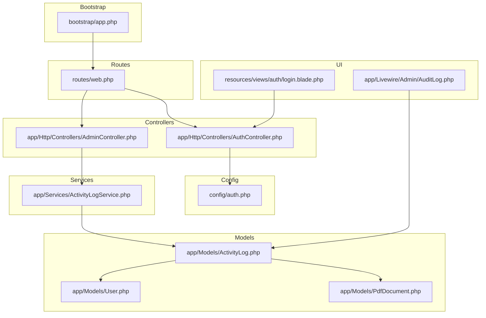
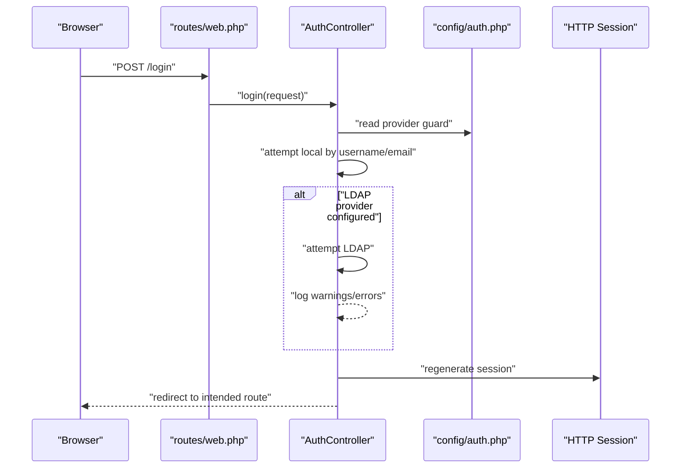
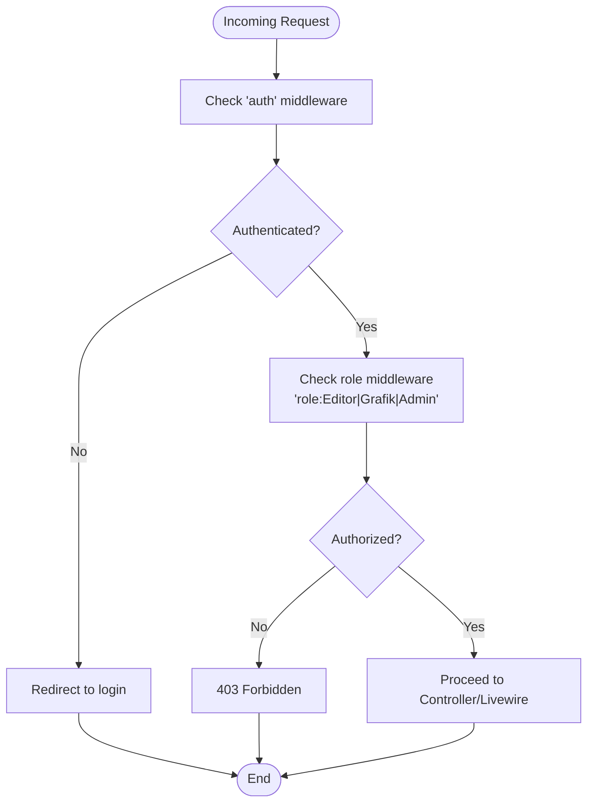
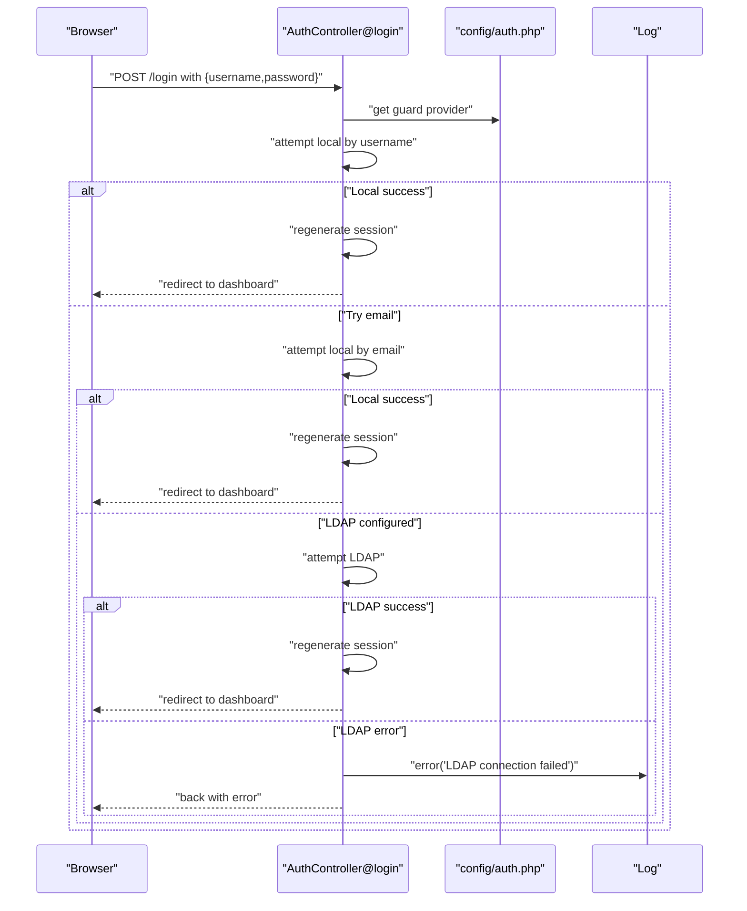
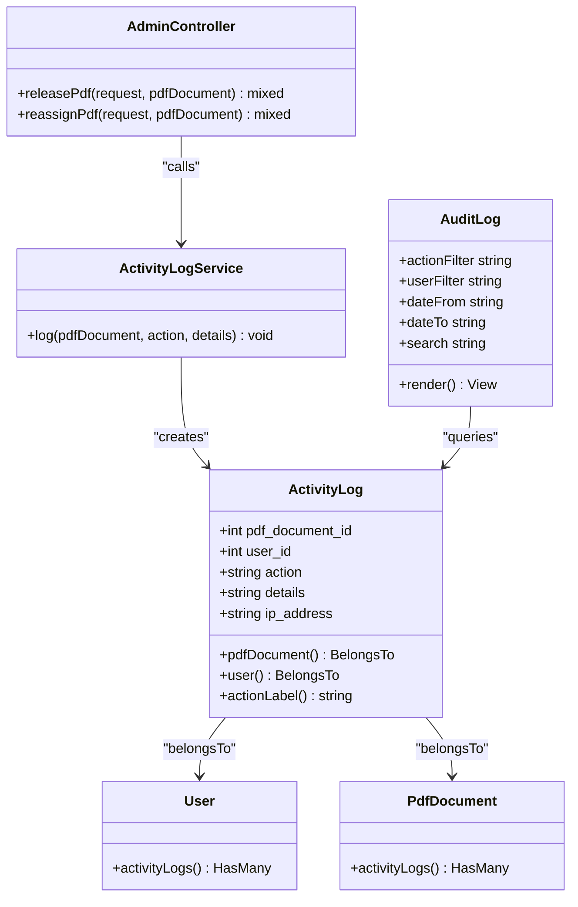
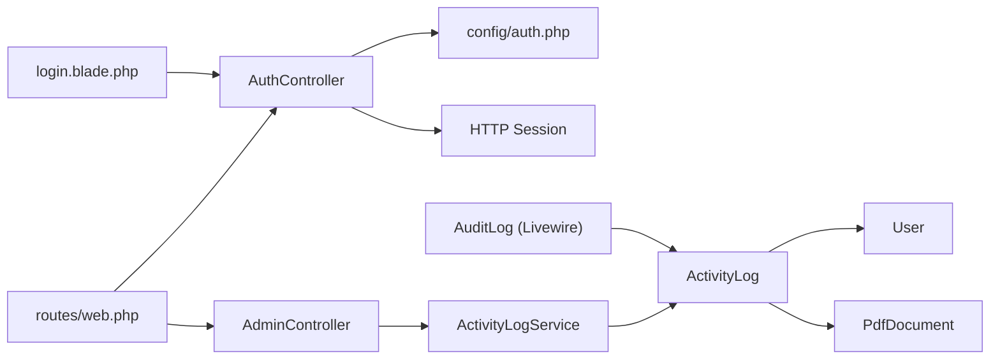

# Security Middleware and Monitoring

<cite>
**Referenced Files in This Document**
- [app.php](file://bootstrap/app.php)
- [web.php](file://routes/web.php)
- [auth.php](file://config/auth.php)
- [AuthController.php](file://app/Http/controllers/AuthController.php)
- [ActivityLogService.php](file://app/Services/ActivityLogService.php)
- [ActivityLog.php](file://app/Models/ActivityLog.php)
- [AuditLog.php](file://app/Livewire/Admin/AuditLog.php)
- [User.php](file://app/Models/User.php)
- [PdfDocument.php](file://app/Models/PdfDocument.php)
- [AdminController.php](file://app/Http/Controllers/AdminController.php)
- [login.blade.php](file://resources/views/auth/login.blade.php)
</cite>

## Table of Contents
1. [Introduction](#introduction)
2. [Project Structure](#project-structure)
3. [Core Components](#core-components)
4. [Architecture Overview](#architecture-overview)
5. [Detailed Component Analysis](#detailed-component-analysis)
6. [Dependency Analysis](#dependency-analysis)
7. [Performance Considerations](#performance-considerations)
8. [Troubleshooting Guide](#troubleshooting-guide)
9. [Conclusion](#conclusion)
10. [Appendices](#appendices)

## Introduction
This document describes the security middleware and monitoring capabilities implemented in the application. It focuses on the middleware pipeline configuration, request interception via authentication and role-based access control, and security policy enforcement through route guards. It also documents activity logging, security event capture, and audit trail management. Additional guidance is provided for rate limiting, brute force protection, suspicious activity detection, security headers, CORS, content security policies, real-time monitoring, alerting, and compliance reporting.

## Project Structure
The security and monitoring features are primarily implemented through:
- Middleware alias configuration for role and permission checks
- Authentication controller supporting local and LDAP authentication
- Role-based routing groups enforcing access policies
- Activity logging service and model capturing user actions
- Livewire admin component for audit log viewing and filtering
- Supporting models for users, PDF documents, and activity logs

**Diagram sources**
- [app.php:13-19](file://bootstrap/app.php#L13-L19)
- [web.php:25-53](file://routes/web.php#L25-L53)
- [auth.php:8-18](file://config/auth.php#L8-L18)
- [AuthController.php:21-71](file://app/Http/Controllers/AuthController.php#L21-L71)
- [AdminController.php:13-60](file://app/Http/Controllers/AdminController.php#L13-L60)
- [ActivityLogService.php:20-29](file://app/Services/ActivityLogService.php#L20-L29)
- [ActivityLog.php:36-44](file://app/Models/ActivityLog.php#L36-L44)
- [AuditLog.php:23-53](file://app/Livewire/Admin/AuditLog.php#L23-L53)
- [login.blade.php:23-46](file://resources/views/auth/login.blade.php#L23-L46)

**Section sources**
- [app.php:13-19](file://bootstrap/app.php#L13-L19)
- [web.php:25-53](file://routes/web.php#L25-L53)
- [auth.php:8-18](file://config/auth.php#L8-L18)

## Core Components
- Middleware aliases for role and permission enforcement are registered during application bootstrap.
- Authentication supports local accounts and LDAP with fallback attempts and logging of connection errors.
- Role-based routing groups restrict access to editor, proofreader, and admin features.
- Activity logging captures user actions with IP address and optional details.
- Audit log UI enables filtering by action, user, date range, and free-text search.

**Section sources**
- [app.php:14-18](file://bootstrap/app.php#L14-L18)
- [AuthController.php:21-71](file://app/Http/Controllers/AuthController.php#L21-L71)
- [web.php:25-53](file://routes/web.php#L25-L53)
- [ActivityLogService.php:20-29](file://app/Services/ActivityLogService.php#L20-L29)
- [AuditLog.php:15-53](file://app/Livewire/Admin/AuditLog.php#L15-L53)

## Architecture Overview
The security architecture centers on authentication, authorization, and auditing:
- Authentication controller validates credentials against local and LDAP providers, with session regeneration and error logging.
- Middleware aliases enable role-based access control on route groups.
- Admin actions trigger activity log entries with contextual details.
- Audit log component queries and paginates activity logs with filters.

**Diagram sources**
- [web.php:21-23](file://routes/web.php#L21-L23)
- [AuthController.php:21-71](file://app/Http/Controllers/AuthController.php#L21-L71)
- [auth.php:8-18](file://config/auth.php#L8-L18)

## Detailed Component Analysis

### Middleware Pipeline and Access Control
- Middleware aliases for role, permission, and role-or-permission are registered during application configuration.
- Route groups apply authentication and role checks to restrict access to specific features:
  - Editor/Grafik/Admin for upload and document detail pages
  - Proofreader/Admin for pool and assignments
  - Admin-only routes under /admin with dedicated controllers and Livewire components

**Diagram sources**
- [app.php:14-18](file://bootstrap/app.php#L14-L18)
- [web.php:25-53](file://routes/web.php#L25-L53)

**Section sources**
- [app.php:14-18](file://bootstrap/app.php#L14-L18)
- [web.php:25-53](file://routes/web.php#L25-L53)

### Authentication Controller and Login Flow
- Validates username/password, attempts local authentication by username and email, then falls back to LDAP if configured.
- Logs LDAP connection failures and missing users for security monitoring.
- On successful login, regenerates session and redirects to intended route.
- Logout invalidates session and regenerates CSRF token.

**Diagram sources**
- [AuthController.php:21-71](file://app/Http/Controllers/AuthController.php#L21-L71)
- [auth.php:8-18](file://config/auth.php#L8-L18)

**Section sources**
- [AuthController.php:21-71](file://app/Http/Controllers/AuthController.php#L21-L71)
- [login.blade.php:23-46](file://resources/views/auth/login.blade.php#L23-L46)

### Activity Logging and Audit Trail
- ActivityLogService records actions with associated PDF document, user, action type, details, and client IP.
- ActivityLog model defines fillable attributes, relationships to User and PdfDocument, and localized action labels.
- AdminController triggers logging for release and reassignment actions with contextual details.
- AuditLog Livewire component provides filtering by action, user, date range, and free-text search, with pagination.

**Diagram sources**
- [ActivityLogService.php:20-29](file://app/Services/ActivityLogService.php#L20-L29)
- [ActivityLog.php:21-44](file://app/Models/ActivityLog.php#L21-L44)
- [AdminController.php:30-57](file://app/Http/Controllers/AdminController.php#L30-L57)
- [AuditLog.php:23-53](file://app/Livewire/Admin/AuditLog.php#L23-L53)
- [User.php:51-54](file://app/Models/User.php#L51-L54)
- [PdfDocument.php:67-70](file://app/Models/PdfDocument.php#L67-L70)

**Section sources**
- [ActivityLogService.php:20-29](file://app/Services/ActivityLogService.php#L20-L29)
- [ActivityLog.php:21-58](file://app/Models/ActivityLog.php#L21-L58)
- [AdminController.php:30-57](file://app/Http/Controllers/AdminController.php#L30-L57)
- [AuditLog.php:15-53](file://app/Livewire/Admin/AuditLog.php#L15-L53)

### Security Headers, CORS, and CSP
- The application does not define explicit security headers, CORS policies, or Content Security Policy directives in the provided files. These should be configured at the web server or framework level to mitigate common web vulnerabilities.

[No sources needed since this section provides general guidance]

### Rate Limiting and Brute Force Protection
- The application does not implement explicit rate limiting or brute force protection mechanisms in the provided files. Recommended approaches include:
  - Using Laravel Throttle or similar middleware to limit login attempts per IP or user.
  - Integrating a CAPTCHA or secondary challenge after repeated failed attempts.
  - Employing temporary account lockout and notification mechanisms.

[No sources needed since this section provides general guidance]

### Suspicious Activity Detection
- The current audit trail captures actions, users, timestamps, and IP addresses. To enhance detection:
  - Monitor unusual actions or bulk operations from single IPs.
  - Alert on failed login spikes or attempts against non-existent users.
  - Correlate events across users and documents to identify anomalies.

[No sources needed since this section provides general guidance]

### Real-Time Monitoring, Alerting, and Incident Response
- The application includes an audit log viewer but lacks integrated real-time monitoring and alerting. Consider:
  - Streaming logs to a SIEM or log aggregation platform.
  - Setting up alerts for critical events (failed logins, admin actions).
  - Defining incident response procedures for detected threats.

[No sources needed since this section provides general guidance]

## Dependency Analysis
The following diagram shows key dependencies among security and monitoring components:

**Diagram sources**
- [AuthController.php:21-71](file://app/Http/Controllers/AuthController.php#L21-L71)
- [auth.php:8-18](file://config/auth.php#L8-L18)
- [web.php:25-53](file://routes/web.php#L25-L53)
- [AdminController.php:30-57](file://app/Http/Controllers/AdminController.php#L30-L57)
- [ActivityLogService.php:20-29](file://app/Services/ActivityLogService.php#L20-L29)
- [ActivityLog.php:36-44](file://app/Models/ActivityLog.php#L36-L44)
- [AuditLog.php:23-53](file://app/Livewire/Admin/AuditLog.php#L23-L53)
- [login.blade.php:23-46](file://resources/views/auth/login.blade.php#L23-L46)

**Section sources**
- [web.php:25-53](file://routes/web.php#L25-L53)
- [AuthController.php:21-71](file://app/Http/Controllers/AuthController.php#L21-L71)
- [ActivityLog.php:36-44](file://app/Models/ActivityLog.php#L36-L44)

## Performance Considerations
- Activity log writes occur synchronously; consider asynchronous logging for high-throughput environments.
- Pagination in audit log reduces memory footprint; maintain efficient database indexing on created_at, user_id, and action.
- Authentication attempts should be optimized; avoid redundant LDAP calls by caching user existence when appropriate.

[No sources needed since this section provides general guidance]

## Troubleshooting Guide
- Authentication fails:
  - Verify provider configuration in authentication settings.
  - Check LDAP connectivity and user mapping.
  - Review logged warnings and errors for LDAP-related issues.
- Authorization denied:
  - Confirm user roles and permissions.
  - Ensure route groups apply correct role middleware.
- Audit log not showing expected entries:
  - Verify activity logging is invoked for relevant actions.
  - Check filters and pagination parameters in the audit log UI.

**Section sources**
- [auth.php:8-18](file://config/auth.php#L8-L18)
- [AuthController.php:58-65](file://app/Http/Controllers/AuthController.php#L58-L65)
- [web.php:25-53](file://routes/web.php#L25-L53)
- [AuditLog.php:23-53](file://app/Livewire/Admin/AuditLog.php#L23-L53)

## Conclusion
The application implements a robust foundation for security and monitoring through middleware-driven access control, comprehensive activity logging, and an audit log interface. To achieve enterprise-grade security, integrate rate limiting, brute force protection, security headers, CORS/CSP policies, real-time monitoring, alerting, and incident response procedures.

[No sources needed since this section summarizes without analyzing specific files]

## Appendices
- Compliance reporting can leverage the audit log data to generate reports on user actions, administrative changes, and document lifecycle events. Export functionality can be added to the audit log component to support periodic compliance exports.

[No sources needed since this section provides general guidance]